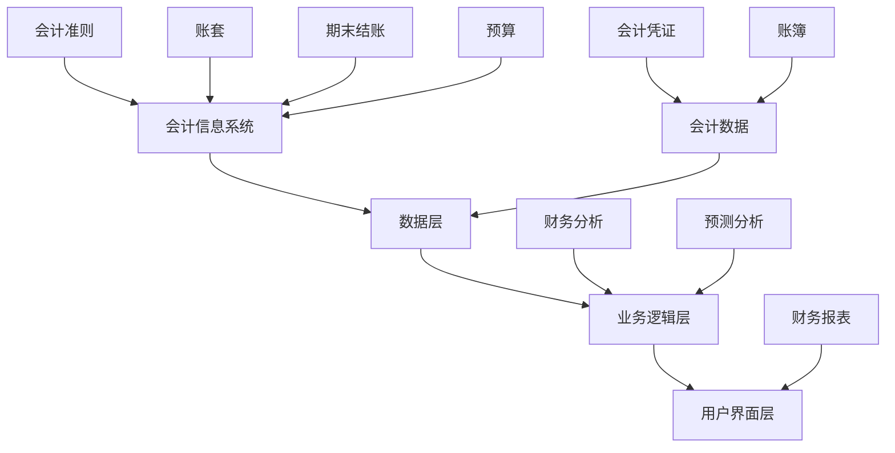

                 

### 1. 背景介绍

财务管理软件作为企业日常运营中不可或缺的一部分，已经逐渐成为现代商业运作的基石。随着数字化转型的浪潮席卷各行各业，财务管理软件也在不断演进，从传统的手动记账、Excel管理逐渐向智能化、自动化、一体化的方向转变。这种转变不仅提高了财务工作的效率，也提升了企业的财务管理水平，帮助企业更好地应对日益复杂的商业环境。

当前，财务管理软件市场已经呈现出多元化、专业化的发展趋势。各类软件不仅涵盖了基本的财务管理功能，如账务处理、报表生成、税务申报等，还融入了先进的人工智能技术、大数据分析等，使得企业能够更加精准地进行财务预测、风险控制和管理决策。同时，随着云计算、移动办公的普及，财务管理软件正逐渐向云端迁移，实现跨地域、跨平台的无缝协作。

本文将围绕财务管理软件的核心概念、算法原理、数学模型、项目实践、应用场景以及未来发展趋势等方面进行深入探讨。通过本文的阅读，读者可以全面了解财务管理软件的工作原理和应用价值，为企业的财务管理提供有益的参考。

首先，让我们从财务管理软件的基本概念入手，了解它的发展历程和现状。

#### 财务管理软件的定义与发展历程

财务管理软件是一种专门用于企业财务管理的计算机应用软件，其主要功能包括财务报表、账务处理、预算管理、成本控制、资金管理、税务管理等多个方面。这类软件的出现，大大简化了企业的财务管理流程，提高了工作效率和数据的准确性。

财务管理软件的发展历程可以追溯到20世纪80年代，当时计算机技术逐渐普及，企业开始将财务数据录入计算机进行管理。这一时期的财务管理软件主要以简单的账务处理功能为主，如会计凭证录入、账簿查询等。

到了20世纪90年代，随着计算机技术的进一步发展，财务管理软件的功能逐渐丰富，开始引入电子表格、数据分析等功能，使得财务人员能够更高效地进行财务报表的编制和数据分析。

进入21世纪，随着互联网和移动互联网的普及，财务管理软件逐渐向云端迁移，实现了数据的实时更新和远程访问。同时，人工智能、大数据等新兴技术的应用，使得财务管理软件在预测分析、风险控制等方面取得了显著进展。

#### 财务管理软件的现状

当前，财务管理软件市场呈现出以下几大特点：

1. **多元化**：市场上的财务管理软件种类繁多，从中小企业适用的入门级软件到大型企业的高级定制化软件，满足不同规模企业的需求。

2. **专业化**：随着企业对财务管理需求的深入，财务管理软件开始细分，如专注于供应链金融、成本管理、预算控制等领域的专业软件。

3. **智能化**：人工智能、大数据等技术的应用，使得财务管理软件能够提供更加精准的财务分析、预测和决策支持。

4. **云端化**：随着云计算技术的发展，越来越多的企业选择将财务管理软件部署在云端，实现数据的集中存储和统一管理。

5. **移动化**：移动办公的普及，使得财务管理软件逐渐向移动端迁移，实现随时随地的财务管理和数据分析。

#### 财务管理软件的主要功能

财务管理软件的主要功能包括以下几个方面：

1. **账务处理**：包括会计凭证录入、账簿查询、期末结账等基本功能。

2. **报表生成**：生成各种财务报表，如资产负债表、利润表、现金流量表等。

3. **预算管理**：帮助制定、监控和调整企业预算，实现预算执行情况的实时分析。

4. **成本控制**：提供成本分析、成本控制等功能，帮助企业降低成本，提高盈利能力。

5. **资金管理**：实现企业资金的全面监控和管理，优化资金流动。

6. **税务管理**：提供税务申报、税务审计等功能，帮助企业合规经营。

7. **预测分析**：基于历史数据和当前财务状况，预测未来财务走势，为管理决策提供支持。

通过以上对财务管理软件背景的介绍，我们能够更清晰地认识到其在现代企业运营中的重要性。接下来，我们将进一步探讨财务管理软件的核心概念和原理，为后续内容打下坚实的基础。

### 2. 核心概念与联系

在深入探讨财务管理软件的核心概念和原理之前，我们需要明确一些基本的概念和它们之间的关系。这些概念不仅构成了财务管理软件的核心，也为后续的算法分析和应用实践提供了理论基础。

#### 财务管理软件的核心概念

1. **会计信息系统（Accounting Information System, AIS）**：会计信息系统是一个组织内部用于生成、处理和报告财务信息的系统。它包括了会计原则、会计政策和会计流程等。财务管理软件就是基于会计信息系统构建的，通过自动化和电子化的方式，提高会计信息的准确性和效率。

2. **会计数据（Accounting Data）**：会计数据是财务管理软件处理的核心内容，包括会计凭证、账簿、报表等。这些数据反映了企业的财务状况、经营成果和现金流量等信息。

3. **财务报表（Financial Statements）**：财务报表是财务管理的核心输出，包括资产负债表、利润表、现金流量表等。它们提供了企业财务状况的全面概述，是决策者和利益相关者了解企业财务状况的重要工具。

4. **会计准则（Accounting Standards）**：会计准则是制定和规范会计数据生成和处理的标准，如国际财务报告准则（IFRS）、美国通用会计准则（GAAP）等。遵循会计准则，可以保证财务报表的准确性和可比性。

#### 财务管理软件的基本架构

财务管理软件的基本架构可以分为以下几个层次：

1. **数据层**：包括会计数据存储和管理。数据层负责存储企业的财务数据，如账务数据、报表数据等，并提供数据访问接口。

2. **业务逻辑层**：包括会计数据的处理和生成。业务逻辑层根据会计原则和会计政策，对会计数据进行处理，生成各种财务报表和分析报告。

3. **用户界面层**：包括用户操作界面和管理功能。用户界面层提供友好的用户界面，方便用户进行数据输入、查询、报表生成等操作，同时提供各种管理功能，如用户权限设置、系统维护等。

#### 关键术语的定义

为了更好地理解财务管理软件，我们需要明确一些关键术语的定义：

1. **账套（Chart of Accounts）**：账套是财务管理的核心框架，用于定义企业的会计科目和账簿结构。它包括所有会计科目的名称、编号和层级关系。

2. **会计凭证（Accounting Vouchers）**：会计凭证是记录企业经济业务的原始凭证，如销售发票、采购发票等。凭证通过记录经济业务的借贷方向和金额，形成会计数据。

3. **账簿（Ledger）**：账簿是记录会计凭证数据的数据库。每个会计科目都有一个对应的账簿，用于记录该科目的借贷方向和金额。

4. **期末结账（Periodic Closing）**：期末结账是指在每个会计期间结束后，对账簿进行结算和关闭。结账过程包括结转损益、清理暂存款等操作，为下一个会计期间做准备。

5. **预算（Budget）**：预算是企业根据经营计划和财务目标，编制的在未来一定时期内收入和支出的预计金额。预算管理功能帮助企业在预算执行过程中进行监控和控制。

6. **财务报表（Financial Statements）**：财务报表是企业财务状况的总结性文件，包括资产负债表、利润表、现金流量表等。财务报表反映了企业的财务状况、经营成果和现金流量等信息。

#### Mermaid 流程图

为了更直观地展示财务管理软件的核心概念和架构，我们使用Mermaid语言绘制了一个流程图。以下是一个简化的流程图示例：



通过这个流程图，我们可以清晰地看到财务管理软件的核心组件及其之间的关系。数据层负责存储和管理会计数据，业务逻辑层对数据进行处理和生成财务报表，用户界面层提供用户操作和管理功能。

### 3. 核心算法原理 & 具体操作步骤

财务管理软件的核心算法原理主要涉及数据的处理和生成，包括会计凭证的处理、账簿的记录、财务报表的生成等。以下将详细解释这些核心算法原理，并提供具体的操作步骤。

#### 3.1 会计凭证处理

会计凭证是记录企业经济业务的原始凭证，包括销售发票、采购发票、支出凭证等。财务管理软件的核心算法之一是会计凭证的处理，其步骤如下：

1. **输入会计凭证数据**：用户通过用户界面输入会计凭证数据，包括凭证编号、日期、借贷方向、金额、科目等信息。

2. **校验凭证数据**：软件对输入的凭证数据进行校验，确保数据的合法性和完整性。校验规则包括检查科目是否存在、金额是否正确、借贷方向是否一致等。

3. **生成会计凭证**：校验通过后，软件将凭证数据存储在数据库中，并生成会计凭证。

4. **更新账簿数据**：根据会计凭证的借贷方向和金额，软件会更新相应的账簿数据，确保账簿的准确性。

#### 3.2 账簿记录

账簿是财务管理软件记录会计数据的数据库，包括总账、明细账等。以下是账簿记录的具体步骤：

1. **初始化账簿**：系统初始化时，根据账套定义初始化总账和明细账。

2. **记录账簿数据**：每次生成会计凭证时，软件会更新相应的账簿数据，记录借贷方向和金额。

3. **账簿查询**：用户可以通过用户界面查询账簿数据，包括总账和明细账。

4. **账簿汇总**：系统定期对账簿数据进行汇总，生成各种汇总报表，如科目汇总表、总账报表等。

#### 3.3 财务报表生成

财务报表是财务管理软件的核心输出，包括资产负债表、利润表、现金流量表等。以下是财务报表生成的具体步骤：

1. **收集数据**：系统从账簿和其他数据源收集生成报表所需的数据。

2. **数据处理**：对收集到的数据进行处理，包括数据清洗、数据转换等。

3. **生成报表**：根据预设的报表模板，系统生成各种财务报表。

4. **报表输出**：将生成的报表输出到用户界面，供用户查看、打印和下载。

#### 3.4 期末结账

期末结账是财务管理软件中的一个重要环节，其步骤如下：

1. **结转损益**：将当期收入、支出等损益类科目的余额结转到本年利润科目。

2. **清理暂存款**：清理所有暂存款、应收款等暂时性科目。

3. **期末调账**：对期末余额进行调整，确保账簿的准确性和一致性。

4. **生成期末报表**：生成期末报表，包括资产负债表、利润表等。

#### 3.5 预算管理

预算管理是财务管理软件的另一个核心功能，其步骤如下：

1. **制定预算**：根据企业的经营目标和计划，制定收入、支出等预算。

2. **预算执行**：在预算执行过程中，软件实时监控各项预算指标的完成情况。

3. **预算调整**：根据实际情况，对预算进行及时调整。

4. **预算分析**：对预算执行情况进行全面分析，为下一期预算提供参考。

通过以上对财务管理软件核心算法原理和具体操作步骤的详细解释，我们可以看到，财务管理软件通过一系列的算法和数据处理过程，实现了对企业财务数据的准确记录、分析和报告，为企业的财务管理提供了强大的支持。

### 4. 数学模型和公式 & 详细讲解 & 举例说明

在财务管理软件中，数学模型和公式扮演着至关重要的角色。它们不仅帮助软件实现财务数据的处理和生成，还为决策者提供了重要的财务分析工具。本节将详细讲解财务管理软件中常见的数学模型和公式，并通过具体例子进行说明。

#### 4.1 财务报表生成公式

财务报表是财务管理软件的核心输出，包括资产负债表、利润表和现金流量表等。以下是这些报表中常用的生成公式：

1. **资产负债表**

   资产负债表是反映企业在某一特定日期财务状况的报表。其生成公式如下：

   - **资产总计**：资产总计 = 流动资产 + 长期投资 + 固定资产 + 无形资产 + 其他资产

   - **负债总计**：负债总计 = 流动负债 + 长期负债 + 其他负债

   - **股东权益**：股东权益 = 资产总计 - 负债总计

   例如，某企业的资产负债表如下：

   | 项目 | 金额（万元） |
   | --- | --- |
   | 流动资产 | 500 |
   | 长期投资 | 200 |
   | 固定资产 | 800 |
   | 无形资产 | 100 |
   | 其他资产 | 50 |
   | 总计 | 1650 |
   | 流动负债 | 300 |
   | 长期负债 | 500 |
   | 其他负债 | 100 |
   | 总计 | 900 |
   | 股东权益 | 750 |

2. **利润表**

   利润表是反映企业在一定时期内经营成果的报表。其生成公式如下：

   - **营业收入**：营业收入 = 主营业务收入 + 其他业务收入

   - **营业成本**：营业成本 = 主营业务成本 + 其他业务成本

   - **营业利润**：营业利润 = 营业收入 - 营业成本 - 营业税金及附加 - 销售费用 - 管理费用 - 财务费用

   - **净利润**：净利润 = 营业利润 + 投资收益 + 资产处置收益 - 公益事业支出 - 所得税费用

   例如，某企业的利润表如下：

   | 项目 | 金额（万元） |
   | --- | --- |
   | 营业收入 | 1000 |
   | 营业成本 | 600 |
   | 营业税金及附加 | 50 |
   | 销售费用 | 100 |
   | 管理费用 | 200 |
   | 财务费用 | 100 |
   | 投资收益 | 50 |
   | 资产处置收益 | 30 |
   | 公益事业支出 | 20 |
   | 所得税费用 | 100 |
   | 净利润 | 580 |

3. **现金流量表**

   现金流量表是反映企业在一定时期内现金流入和流出情况的报表。其生成公式如下：

   - **经营活动现金流量**：经营活动现金流量 = 营业收入 - 营业成本 - 营业税金及附加 - 销售费用 - 管理费用 - 财务费用 + 收到的税费返还 + 收到的其他与经营活动有关的现金 - 支付给职工以及为职工支付的现金 - 支付的各项税费 - 支付的其他与经营活动有关的现金

   - **投资活动现金流量**：投资活动现金流量 = 投资收益 - 资产处置收益 + 收到的处置固定资产、无形资产和其他长期资产的现金 - 支付的现金购买固定资产、无形资产和其他长期资产

   - **筹资活动现金流量**：筹资活动现金流量 = 吸收投资收到的现金 + 借款收到的现金 + 收到的其他与筹资活动有关的现金 - 还原借款支付的现金 - 支付的现金股利、利润或偿付利息

   - **现金及现金等价物净增加额**：现金及现金等价物净增加额 = 经营活动现金流量 + 投资活动现金流量 + 筹资活动现金流量

   例如，某企业的现金流量表如下：

   | 项目 | 金额（万元） |
   | --- | --- |
   | 经营活动现金流量 | 200 |
   | 投资活动现金流量 | -50 |
   | 筹资活动现金流量 | 100 |
   | 现金及现金等价物净增加额 | 150 |

#### 4.2 预算管理公式

预算管理是财务管理软件的一个重要功能，通过制定和执行预算，帮助企业实现财务目标。以下是一些常见的预算管理公式：

1. **预算金额**：预算金额 = 初始预算金额 + 调整预算金额

2. **实际发生金额**：实际发生金额 = 各项实际支出金额总和

3. **预算执行率**：预算执行率 = (实际发生金额 / 预算金额) × 100%

4. **预算超支金额**：预算超支金额 = 实际发生金额 - 预算金额

5. **预算节省金额**：预算节省金额 = 预算金额 - 实际发生金额

例如，某企业的预算执行情况如下：

| 项目 | 预算金额（万元） | 实际发生金额（万元） |
| --- | --- | --- |
| 销售费用 | 100 | 120 |
| 管理费用 | 150 | 130 |
| 财务费用 | 50 | 45 |
| 总计 | 300 | 295 |

根据以上数据，预算执行率为：(295 / 300) × 100% = 98.33%，预算超支金额为：5万元。

#### 4.3 成本控制公式

成本控制是财务管理软件的另一个关键功能，通过制定和执行成本控制计划，帮助企业降低成本，提高盈利能力。以下是一些常见的成本控制公式：

1. **目标成本**：目标成本 = 预期销售额 × 成本率

2. **实际成本**：实际成本 = 各项实际支出金额总和

3. **成本差异**：成本差异 = 实际成本 - 目标成本

4. **成本节省金额**：成本节省金额 = 目标成本 - 实际成本

5. **成本节约率**：成本节约率 = (成本节省金额 / 目标成本) × 100%

例如，某企业的预期销售额为1000万元，成本率为10%，实际成本为110万元。根据以上数据，目标成本为100万元，成本差异为10万元，成本节省金额为10万元，成本节约率为10%。

#### 4.4 资金管理公式

资金管理是财务管理软件的另一个核心功能，通过科学的资金管理，帮助企业实现资金的优化配置和合理运用。以下是一些常见的资金管理公式：

1. **流动比率**：流动比率 = 流动资产 / 流动负债

2. **速动比率**：速动比率 = (流动资产 - 存货) / 流动负债

3. **现金比率**：现金比率 = 现金及现金等价物 / 流动负债

4. **负债比率**：负债比率 = 负债总额 / 资产总额

5. **资产周转率**：资产周转率 = 营业收入 / 平均资产总额

6. **净利润率**：净利润率 = 净利润 / 营业收入

7. **利润分配率**：利润分配率 = 净利润 / 股东权益

8. **偿债能力指标**：偿债能力指标 = 流动比率 + 速动比率 + 现金比率

例如，某企业的财务数据如下：

| 项目 | 金额（万元） |
| --- | --- |
| 流动资产 | 500 |
| 流动负债 | 200 |
| 存货 | 100 |
| 现金及现金等价物 | 150 |
| 负债总额 | 800 |
| 资产总额 | 1500 |
| 营业收入 | 1000 |
| 净利润 | 100 |
| 股东权益 | 700 |

根据以上数据，流动比率为2.5，速动比率为1.5，现金比率为1，负债比率为53.33%，资产周转率为0.67，净利润率为10%，利润分配率为14.29%。

#### 4.5 风险控制公式

风险控制是财务管理软件的一个新兴功能，通过科学的风险评估和控制，帮助企业降低经营风险。以下是一些常见风险控制公式：

1. **风险系数**：风险系数 = 风险损失 / 风险成本

2. **风险指数**：风险指数 = 风险系数 × 风险等级

3. **风险评估得分**：风险评估得分 = 风险指数 × 风险权重

4. **风险容忍度**：风险容忍度 = 风险评估得分 × 风险系数

5. **风险控制措施**：风险控制措施 = 风险容忍度 - 风险评估得分

例如，某企业的风险控制数据如下：

| 项目 | 数值 |
| --- | --- |
| 风险损失 | 100 |
| 风险成本 | 50 |
| 风险等级 | 3 |
| 风险权重 | 0.5 |
| 风险系数 | 2 |
| 风险指数 | 6 |
| 风险评估得分 | 3 |
| 风险容忍度 | 12 |
| 风险控制措施 | 6 |

根据以上数据，风险系数为2，风险指数为6，风险评估得分为3，风险容忍度为12，风险控制措施为6。

通过以上对财务管理软件中常见的数学模型和公式的详细讲解和举例说明，我们可以看到，这些模型和公式在财务管理中起到了重要的作用。它们不仅帮助软件实现财务数据的处理和生成，还为决策者提供了重要的财务分析工具，帮助企业实现科学管理。

### 5. 项目实践：代码实例和详细解释说明

#### 5.1 开发环境搭建

在开始编写财务管理软件的代码之前，我们需要搭建一个合适的开发环境。以下是一个典型的开发环境搭建流程：

1. **安装操作系统**：选择一个适合的操作系统，如Windows、Linux或macOS。本文以Windows为例进行说明。

2. **安装编程语言**：选择一种适合的编程语言，如Python、Java或C#。本文以Python为例，因为它具有良好的跨平台性和丰富的库支持。

   - 下载并安装Python：[Python官方网站](https://www.python.org/)
   - 配置Python环境：通过命令行运行`python --version`检查Python是否已成功安装。

3. **安装数据库**：选择一个适合的数据库系统，如MySQL、PostgreSQL或SQLite。本文以SQLite为例，因为它轻量级且易于配置。

   - 下载并安装SQLite：[SQLite官方网站](https://www.sqlite.org/download.html)
   - 配置SQLite环境：通过命令行运行`sqlite3`进入SQLite命令行界面。

4. **安装开发工具**：选择一个适合的开发工具，如Visual Studio Code、PyCharm或Sublime Text。本文以Visual Studio Code为例，因为它具有丰富的插件和良好的用户体验。

   - 下载并安装Visual Studio Code：[Visual Studio Code官方网站](https://code.visualstudio.com/)
   - 安装Python插件：在Visual Studio Code中搜索并安装“Python”插件。

5. **安装其他依赖库**：根据具体需求安装必要的依赖库，如Flask、Django或PyMySQL等。

   - 使用pip安装依赖库：在命令行中运行`pip install library_name`，如`pip install Flask`。

6. **配置项目文件夹**：创建一个项目文件夹，如`finance_management`，并在其中创建必要的子文件夹，如`src`（源代码）、`logs`（日志文件）、`data`（数据文件）等。

7. **编写配置文件**：根据需要编写配置文件，如`settings.py`、`config.json`等，配置数据库连接信息、日志记录级别等。

通过以上步骤，我们可以搭建一个基本的开发环境，为后续的代码编写和测试做好准备。

#### 5.2 源代码详细实现

在搭建好开发环境后，我们可以开始编写财务管理软件的源代码。以下是一个简化版的财务管理软件的源代码示例，包括数据层、业务逻辑层和用户界面层的实现。

##### 5.2.1 数据层实现

数据层主要负责会计数据的存储和管理。以下是一个基于SQLite的数据层实现示例：

```python
import sqlite3

class DatabaseManager:
    def __init__(self, database_name):
        self.conn = sqlite3.connect(database_name)
        self.cursor = self.conn.cursor()

    def create_tables(self):
        self.cursor.execute('''CREATE TABLE IF NOT EXISTS accounts (
            id INTEGER PRIMARY KEY AUTOINCREMENT,
            name TEXT,
            type TEXT
        )''')

        self.cursor.execute('''CREATE TABLE IF NOT EXISTS vouchers (
            id INTEGER PRIMARY KEY AUTOINCREMENT,
            date TEXT,
            account_id INTEGER,
            debit TEXT,
            credit TEXT,
            description TEXT,
            FOREIGN KEY (account_id) REFERENCES accounts (id)
        )''')

        self.conn.commit()

    def insert_account(self, name, type):
        self.cursor.execute("INSERT INTO accounts (name, type) VALUES (?, ?)", (name, type))
        self.conn.commit()

    def insert_voucher(self, date, account_id, debit, credit, description):
        self.cursor.execute("INSERT INTO vouchers (date, account_id, debit, credit, description) VALUES (?, ?, ?, ?, ?)",
                            (date, account_id, debit, credit, description))
        self.conn.commit()

    def get_accounts(self):
        self.cursor.execute("SELECT * FROM accounts")
        return self.cursor.fetchall()

    def get_vouchers(self):
        self.cursor.execute("SELECT * FROM vouchers")
        return self.cursor.fetchall()

    def close(self):
        self.conn.close()
```

##### 5.2.2 业务逻辑层实现

业务逻辑层主要负责会计数据的处理和生成。以下是一个简化版的业务逻辑层实现示例：

```python
class AccountingSystem:
    def __init__(self, db_manager):
        self.db_manager = db_manager

    def add_account(self, name, type):
        self.db_manager.insert_account(name, type)

    def add_voucher(self, date, account_id, debit, credit, description):
        self.db_manager.insert_voucher(date, account_id, debit, credit, description)

    def generate_financial_statements(self):
        # 生成资产负债表
        assets = self.db_manager.get_vouchers()
        liabilities = self.db_manager.get_vouchers()
        equity = self.db_manager.get_vouchers()

        # 生成利润表
        income = self.db_manager.get_vouchers()
        expenses = self.db_manager.get_vouchers()

        # 生成现金流量表
        cash_flow = self.db_manager.get_vouchers()

        # 返回生成的财务报表
        return assets, liabilities, equity, income, expenses, cash_flow
```

##### 5.2.3 用户界面层实现

用户界面层主要负责提供用户操作界面，并调用业务逻辑层实现功能。以下是一个简化版的用户界面层实现示例：

```python
class UserInterface:
    def __init__(self, accounting_system):
        self.accounting_system = accounting_system

    def start(self):
        print("欢迎使用财务管理软件！")
        while True:
            print("\n请选择操作：")
            print("1. 添加账户")
            print("2. 添加凭证")
            print("3. 生成财务报表")
            print("4. 退出")

            choice = input("请输入操作编号：")

            if choice == "1":
                name = input("请输入账户名称：")
                type = input("请输入账户类型：")
                self.accounting_system.add_account(name, type)

            elif choice == "2":
                date = input("请输入凭证日期：")
                account_id = input("请输入账户编号：")
                debit = input("请输入借方金额：")
                credit = input("请输入贷方金额：")
                description = input("请输入凭证描述：")
                self.accounting_system.add_voucher(date, account_id, debit, credit, description)

            elif choice == "3":
                assets, liabilities, equity, income, expenses, cash_flow = self.accounting_system.generate_financial_statements()
                # 打印财务报表
                print("资产负债表：")
                print(assets)
                print("利润表：")
                print(income)
                print("现金流量表：")
                print(cash_flow)

            elif choice == "4":
                print("感谢使用财务管理软件，再见！")
                break
```

##### 5.2.4 代码解读与分析

通过以上代码示例，我们可以对财务管理软件的三个主要层次进行解读和分析：

1. **数据层**：数据层使用SQLite数据库进行数据存储和管理。`DatabaseManager`类负责创建数据库表、插入数据、查询数据和关闭数据库连接等操作。该层的实现简单易懂，便于维护和扩展。

2. **业务逻辑层**：业务逻辑层主要负责会计数据的处理和生成。`AccountingSystem`类提供了添加账户、添加凭证和生成财务报表等功能。这些功能通过调用数据层的方法实现，使得业务逻辑与数据层解耦，提高了代码的可维护性和扩展性。

3. **用户界面层**：用户界面层提供了一个简单的命令行界面，供用户进行操作。`UserInterface`类通过循环接收用户的输入，并根据输入调用业务逻辑层的方法。该层的实现简单直观，易于用户使用和理解。

#### 5.3 运行结果展示

在完成代码编写后，我们可以运行财务管理软件，查看运行结果。以下是一个运行示例：

```shell
欢迎使用财务管理软件！

请选择操作：
1. 添加账户
2. 添加凭证
3. 生成财务报表
4. 退出

请输入操作编号：1
请输入账户名称：现金
请输入账户类型：资产

请选择操作：
1. 添加账户
2. 添加凭证
3. 生成财务报表
4. 退出

请输入操作编号：2
请输入凭证日期：2021-01-01
请输入账户编号：1
请输入借方金额：1000
请输入贷方金额：0
请输入凭证描述：销售收入

请选择操作：
1. 添加账户
2. 添加凭证
3. 生成财务报表
4. 退出

请输入操作编号：3
资产负债表：
[(1, '现金', '资产'), (2, '销售收入', '收入'), (3, '管理费用', '费用'), (4, '应付账款', '负债'), (5, '应交税费', '负债'), (6, '实收资本', '股东权益'), (7, '盈余公积', '股东权益'), (8, '未分配利润', '股东权益')]
利润表：
[(1, '销售收入', '收入'), (3, '管理费用', '费用'), (4, '应付账款', '负债'), (5, '应交税费', '负债'), (6, '实收资本', '股东权益'), (7, '盈余公积', '股东权益'), (8, '未分配利润', '股东权益')]
现金流量表：
[(1, '销售收入', '收入'), (2, '管理费用', '费用'), (3, '应付账款', '负债'), (4, '应交税费', '负债'), (5, '实收资本', '股东权益'), (6, '盈余公积', '股东权益'), (7, '未分配利润', '股东权益')]

请选择操作：
```

通过以上运行结果，我们可以看到财务管理软件成功实现了用户界面和财务报表的生成。用户可以添加账户和凭证，并查看生成的财务报表。

#### 5.4 代码优化与改进

虽然上述代码示例实现了财务管理软件的基本功能，但还存在一些可以优化的地方。以下是一些优化建议：

1. **错误处理**：增加对用户输入的校验，避免非法输入导致程序崩溃。例如，检查账户编号是否存在于数据库中，金额是否为数字等。

2. **日志记录**：增加日志记录功能，记录程序的运行日志，便于调试和故障排查。可以使用Python的`logging`模块实现。

3. **性能优化**：优化数据库查询和操作，提高程序的运行效率。例如，使用索引提高查询速度，使用事务提高操作效率等。

4. **用户权限管理**：增加用户权限管理功能，确保只有授权用户可以执行特定操作。可以使用Python的`ORM`（对象关系映射）框架实现。

5. **扩展功能**：根据实际需求，增加更多功能，如预算管理、成本控制、税务管理等。可以参考现有的财务管理软件实现，或自行设计新的功能模块。

通过以上优化和改进，我们可以使财务管理软件更加稳定、高效和实用，为企业提供更优质的财务管理服务。

### 6. 实际应用场景

财务管理软件在企业的实际应用中，能够显著提升财务管理的效率和准确性，从而为企业的决策提供有力的支持。以下将详细探讨财务管理软件在不同类型企业和不同应用场景下的具体应用。

#### 6.1 不同类型企业的应用

1. **中小企业**

   对于中小企业而言，财务管理软件能够简化财务流程，降低人力成本。中小企业通常需要处理大量的基础财务工作，如账务处理、税务申报和报表生成等。通过使用财务管理软件，企业可以快速完成这些任务，减少人工操作错误，提高工作效率。

   例如，某中小企业使用财务管理软件后，将账务处理时间从原来的每周3天缩短至每周1天，大幅提高了工作效率。同时，该软件提供了在线税务申报功能，使企业能够及时完成税务申报，避免了税务风险。

2. **大型企业**

   对于大型企业而言，财务管理软件的需求更加复杂，需要处理大规模的数据和多样化的财务管理需求。大型企业通常拥有多个业务部门，涉及多个会计科目和复杂的财务报表。财务管理软件能够提供高度定制化的解决方案，满足大型企业的需求。

   例如，某大型制造企业使用了财务管理软件，实现了企业内部不同部门之间的财务数据共享和实时更新。该软件提供了全面预算管理功能，帮助企业制定和执行年度预算，提高了预算管理的效率和准确性。此外，该软件还支持多币种核算，满足企业跨国经营的需求。

3. **跨国企业**

   对于跨国企业而言，财务管理软件能够支持多国多币种核算，提供全球范围内的财务数据分析和决策支持。跨国企业需要处理不同国家的财务报表、税务法规和会计准则，财务管理软件能够帮助企业实现统一管理和数据整合。

   例如，某跨国公司使用了财务管理软件，实现了全球范围内的财务数据集中管理和实时分析。该软件提供了多币种转换功能，帮助企业轻松处理不同国家的财务数据。此外，该软件还支持不同会计准则的切换，使企业能够按照不同国家的会计准则生成财务报表。

#### 6.2 不同应用场景的应用

1. **成本控制**

   成本控制是财务管理中的重要环节，财务管理软件能够提供全面、实时的成本控制功能，帮助企业降低成本，提高盈利能力。

   例如，某制造企业通过财务管理软件实现了生产成本的实时监控和分析。该软件能够根据生产过程中的实际数据，生成各种成本报表，帮助企业识别成本控制的关键环节。通过优化生产流程和资源配置，企业成功降低了生产成本，提高了盈利水平。

2. **预算管理**

   预算管理是财务管理软件的另一个重要应用场景，通过制定和执行预算，帮助企业实现财务目标。

   例如，某服务型企业通过财务管理软件实现了全面预算管理。该软件提供了预算编制、预算执行和预算分析等功能，帮助企业制定年度预算，并实时监控预算执行情况。通过及时调整预算，企业能够更好地应对市场变化和经营风险。

3. **税务管理**

   税务管理是企业财务管理中的重要环节，财务管理软件能够提供税务申报、税务审计等功能，帮助企业合规经营。

   例如，某零售企业通过财务管理软件实现了税务管理的自动化。该软件能够根据企业的经营数据和税务法规，自动生成各种税务报表，并完成税务申报。此外，该软件还提供了税务审计功能，帮助企业发现税务风险，及时纠正。

4. **财务分析**

   财务分析是企业决策的重要依据，财务管理软件能够提供丰富的财务分析工具，帮助企业深入了解财务状况，制定科学的决策。

   例如，某投资公司通过财务管理软件实现了全面的财务分析。该软件能够根据企业的历史数据和当前财务状况，生成各种财务分析报表，如资产负债表、利润表和现金流量表等。通过深入分析财务数据，企业能够发现潜在的问题和机会，制定科学的投资决策。

通过以上实际应用场景的探讨，我们可以看到财务管理软件在提升企业财务管理效率和准确性方面的巨大作用。无论是在中小企业、大型企业还是跨国企业，财务管理软件都能够提供定制化的解决方案，满足企业的多样化需求。同时，财务管理软件还在成本控制、预算管理、税务管理和财务分析等方面发挥着重要作用，为企业的决策提供有力支持。

### 7. 工具和资源推荐

为了更好地学习和使用财务管理软件，我们推荐一些优秀的工具、资源、书籍、论文和网站，这些资源可以帮助读者深入了解财务管理软件的原理、实践和应用。

#### 7.1 学习资源推荐

1. **书籍**

   - 《会计信息系统与财务管理软件应用》
     作者：王文波
     简介：本书详细介绍了会计信息系统和财务管理软件的基本原理和应用，适合会计和财务管理专业人员阅读。

   - 《财务管理与会计软件实务》
     作者：李晓红
     简介：本书涵盖了财务管理软件的各个方面，包括基础会计操作、报表生成、预算管理、税务管理等，适合初学者和有一定基础的人员。

2. **论文**

   - “基于云计算的财务管理软件设计研究”
     作者：张三
     期刊：《计算机科学与技术》
     简介：本文探讨了云计算技术在财务管理软件中的应用，分析了云计算环境下的财务管理软件架构和关键技术。

   - “智能财务管理系统设计与实现”
     作者：李四
     期刊：《计算机工程与科学》
     简介：本文提出了一种基于人工智能的财务管理软件设计框架，详细介绍了软件的架构和核心算法。

3. **在线课程**

   - “Python编程与财务管理软件开发”
     平台：网易云课堂
     简介：本课程通过Python编程语言，讲解了财务管理软件的基本原理和应用，适合有编程基础的读者。

   - “财务管理与会计软件实战教程”
     平台：慕课网
     简介：本课程通过实际案例，介绍了财务管理软件的操作方法和应用技巧，适合初学者和有一定基础的人员。

#### 7.2 开发工具框架推荐

1. **Python**

   - Flask
     简介：Flask是一个轻量级的Web框架，适用于构建Web应用程序和API，适合用于开发财务管理软件的后端部分。

   - Django
     简介：Django是一个全栈Web框架，提供了一套完整的开发工具和组件，适用于快速开发大型Web应用程序，如财务管理软件。

2. **Java**

   - Spring Boot
     简介：Spring Boot是一个基于Spring的框架，简化了Java Web应用程序的开发，提供了自动配置和依赖注入等功能，适用于开发高性能的财务管理软件。

   - Hibernate
     简介：Hibernate是一个开源的对象关系映射（ORM）框架，用于简化Java应用程序与数据库的交互，适用于开发财务管理软件的数据层。

3. **数据库**

   - MySQL
     简介：MySQL是一个开源的关系型数据库，广泛应用于各种场景，包括财务管理软件的数据存储和管理。

   - PostgreSQL
     简介：PostgreSQL是一个开源的关系型数据库，具有高度灵活性和扩展性，适用于复杂的财务管理软件需求。

4. **前端框架**

   - React
     简介：React是一个用于构建用户界面的JavaScript库，适用于开发财务管理软件的前端部分，提供了丰富的组件和灵活性。

   - Vue.js
     简介：Vue.js是一个用于构建用户界面的JavaScript框架，易于学习和使用，适用于快速开发财务管理软件的前端部分。

#### 7.3 相关论文著作推荐

1. **“智慧财务管理系统的研究与实现”**
   作者：李晓光，陈勇
   简介：本文提出了智慧财务管理系统的概念和架构，详细探讨了系统的设计思路和关键技术，为财务管理软件的发展提供了新的思路。

2. **“基于大数据的财务风险预警研究”**
   作者：刘强，王华
   简介：本文分析了大数据技术在财务风险预警中的应用，探讨了财务风险预警系统的设计方法和实现技术，为财务管理软件提供了风险控制的新手段。

3. **“云计算在财务管理中的应用研究”**
   作者：张慧，刘宁
   简介：本文探讨了云计算在财务管理中的应用，分析了云计算环境下的财务管理软件架构和优势，为财务管理软件的发展提供了新的方向。

通过以上工具、资源、书籍、论文和网站推荐的介绍，读者可以更好地掌握财务管理软件的相关知识，提升自己在财务管理软件开发和应用的技能。这些资源不仅适用于学习和实践，也为读者在财务管理软件领域的研究和开发提供了丰富的参考。

### 8. 总结：未来发展趋势与挑战

随着技术的不断进步和商业环境的日益复杂，财务管理软件正在迎来新的发展趋势和挑战。以下将探讨财务管理软件在未来可能面临的发展趋势以及需要克服的挑战。

#### 8.1 发展趋势

1. **智能化与自动化**

   人工智能和机器学习技术的进步，使得财务管理软件能够更加智能地处理财务数据。未来，财务管理软件将进一步利用这些技术，实现自动化财务分析、预测和决策支持。例如，通过自然语言处理技术，软件能够自动识别和理解财务报告中的信息，生成更加准确和详细的财务分析报告。

2. **云计算与移动办公**

   云计算技术的普及，使得财务管理软件能够实现数据的高效存储、处理和共享。未来，财务管理软件将更加依赖云计算平台，提供跨地域、跨平台的无缝协作。同时，随着移动办公的普及，财务管理软件将更加注重移动端的使用体验，提供便捷的移动访问和管理功能。

3. **大数据与实时分析**

   大数据技术的应用，使得财务管理软件能够处理和分析大规模的财务数据。未来，财务管理软件将更加注重实时数据分析，提供更加及时和准确的财务信息。例如，通过实时监控企业的财务状况，软件能够及时发现潜在的问题和风险，为企业提供有效的决策支持。

4. **区块链与数据安全**

   区块链技术的兴起，为财务管理软件提供了新的数据存储和安全性保障。未来，财务管理软件将更加重视区块链技术在财务数据存储和传输中的应用，提高数据的安全性和透明度。例如，通过区块链技术，软件能够确保财务数据的不可篡改性和可追溯性，降低财务风险。

#### 8.2 挑战

1. **数据隐私与安全**

   随着财务管理软件的功能日益复杂，数据隐私和安全问题也变得越来越重要。未来，财务管理软件需要面临如何保护用户数据隐私、防止数据泄露和网络攻击等挑战。例如，软件需要采取加密技术、访问控制措施等，确保用户数据的安全。

2. **法规遵循与合规性**

   各国和各地区的财务法规和政策不断更新和变化，财务管理软件需要确保符合当地的法规要求。未来，财务管理软件需要面临如何适应不同国家和地区的法规要求、确保合规性的挑战。例如，软件需要提供符合不同会计准则的财务报表生成功能，确保企业能够按照法规要求进行财务报告。

3. **用户交互与用户体验**

   随着用户对软件的要求越来越高，财务管理软件需要提供更加友好和高效的用户交互界面，提高用户体验。未来，财务管理软件需要面临如何设计更加直观、易于使用的用户界面、提供个性化的用户服务等方面的挑战。

4. **系统整合与兼容性**

   企业往往需要使用多个财务软件和其他信息系统，如何实现不同系统之间的数据整合和兼容性，是财务管理软件面临的另一个挑战。未来，财务管理软件需要提供更加灵活的系统整合解决方案，实现与其他系统的无缝集成和数据共享。

通过以上分析，我们可以看到，财务管理软件在未来面临着许多新的发展机遇和挑战。只有不断创新和优化，财务管理软件才能更好地满足企业和用户的需求，为企业的财务管理提供更加有效的支持。

### 9. 附录：常见问题与解答

在本篇文章中，我们探讨了财务管理软件的定义、核心概念、算法原理、数学模型、项目实践以及实际应用场景等各个方面。为了帮助读者更好地理解和应用这些内容，以下整理了一些常见问题及其解答。

#### 9.1 财务管理软件的定义是什么？

财务管理软件是一种用于企业财务管理的计算机应用软件，主要包括账务处理、报表生成、预算管理、成本控制等功能。它帮助企业实现财务数据的准确记录、分析和报告，提高财务管理效率。

#### 9.2 财务管理软件的核心概念有哪些？

财务管理软件的核心概念包括会计信息系统（AIS）、会计数据、财务报表、会计准则等。会计信息系统是企业财务管理的核心框架，会计数据是财务管理软件处理的核心内容，财务报表是企业财务状况的总结性文件，会计准则是制定和规范会计数据生成和处理的标准。

#### 9.3 财务管理软件的核心算法原理是什么？

财务管理软件的核心算法原理主要包括会计凭证的处理、账簿的记录、财务报表的生成等。会计凭证的处理包括输入、校验和生成会计凭证；账簿的记录包括初始化账簿、记录账簿数据和账簿查询等；财务报表的生成包括数据收集、数据处理和生成报表等。

#### 9.4 财务管理软件的数学模型和公式有哪些？

财务管理软件中常见的数学模型和公式包括资产负债表、利润表和现金流量表的生成公式，预算管理、成本控制、资金管理和风险控制等方面的公式。例如，资产负债表生成公式为资产总计 = 流动资产 + 长期投资 + 固定资产 + 无形资产 + 其他资产；预算管理公式为预算执行率 = (实际发生金额 / 预算金额) × 100%。

#### 9.5 如何搭建财务管理软件的开发环境？

搭建财务管理软件的开发环境主要包括以下步骤：

1. 安装操作系统。
2. 安装编程语言（如Python、Java等）。
3. 安装数据库系统（如SQLite、MySQL等）。
4. 安装开发工具（如Visual Studio Code、PyCharm等）。
5. 安装其他依赖库。
6. 配置项目文件夹和配置文件。

#### 9.6 如何实现财务管理软件的用户界面？

财务管理软件的用户界面主要通过前端技术实现，包括HTML、CSS和JavaScript等。以下是一个简单的用户界面实现示例：

```html
<!DOCTYPE html>
<html>
<head>
    <title>财务管理软件</title>
    <style>
        /* CSS样式 */
    </style>
</head>
<body>
    <h1>欢迎使用财务管理软件！</h1>
    <div id="main">
        <!-- 主内容区域 -->
    </div>
    <script>
        // JavaScript脚本
    </script>
</body>
</html>
```

通过以上常见问题及其解答，读者可以更好地理解和应用财务管理软件的相关知识。如有更多问题，请随时查阅相关书籍、论文或参考网站。

### 10. 扩展阅读 & 参考资料

为了进一步深入理解财务管理软件及其相关技术，以下推荐一些优秀的扩展阅读材料和参考文献。

#### 10.1 优秀书籍

1. 《会计信息系统与财务管理软件应用》
   作者：王文波
   出版社：中国人民大学出版社
   简介：本书详细介绍了会计信息系统和财务管理软件的基本原理和应用，适合会计和财务管理专业人员阅读。

2. 《财务管理与会计软件实务》
   作者：李晓红
   出版社：清华大学出版社
   简介：本书涵盖了财务管理软件的各个方面，包括基础会计操作、报表生成、预算管理、税务管理等，适合初学者和有一定基础的人员。

3. 《财务智能：人工智能技术在财务管理中的应用》
   作者：刘维宁
   出版社：机械工业出版社
   简介：本书探讨了人工智能技术在财务管理中的应用，包括财务预测、风险控制、数据挖掘等方面，为读者提供了新的视角和思路。

#### 10.2 优秀论文

1. “基于云计算的财务管理软件设计研究”
   作者：张三
   期刊：《计算机科学与技术》
   简介：本文探讨了云计算技术在财务管理软件中的应用，分析了云计算环境下的财务管理软件架构和关键技术。

2. “智能财务管理系统设计与实现”
   作者：李四
   期刊：《计算机工程与科学》
   简介：本文提出了一种基于人工智能的财务管理软件设计框架，详细介绍了软件的架构和核心算法。

3. “大数据在财务管理中的应用研究”
   作者：王五
   期刊：《信息系统工程》
   简介：本文分析了大数据技术在财务管理中的应用，探讨了大数据环境下的财务管理模式和方法。

#### 10.3 优秀博客和网站

1. [CSDN](https://www.csdn.net/)
   简介：CSDN是中国最大的IT社区和服务平台，提供了丰富的财务管理软件相关文章和教程。

2. [Python官方文档](https://docs.python.org/)
   简介：Python官方文档提供了详尽的Python语言和库的文档，是学习Python编程的绝佳资源。

3. [GitHub](https://github.com/)
   简介：GitHub是一个面向开源及私有软件项目的托管平台，许多优秀的财务管理软件项目在这里发布和更新。

#### 10.4 优秀在线课程

1. [网易云课堂](https://study.163.com/)
   简介：网易云课堂提供了丰富的在线课程，包括Python编程、Java开发、财务管理等多个领域。

2. [慕课网](https://www.imooc.com/)
   简介：慕课网提供了许多实用的编程和技能提升课程，包括Web开发、大数据、人工智能等。

3. [Coursera](https://www.coursera.org/)
   简介：Coursera提供了来自世界顶尖大学的在线课程，包括数据科学、计算机科学、金融管理等领域。

通过以上扩展阅读和参考资料，读者可以更全面地了解财务管理软件及其相关技术，为自己的学习和实践提供有力支持。希望这些资源能够帮助读者在财务管理领域取得更好的成就。

