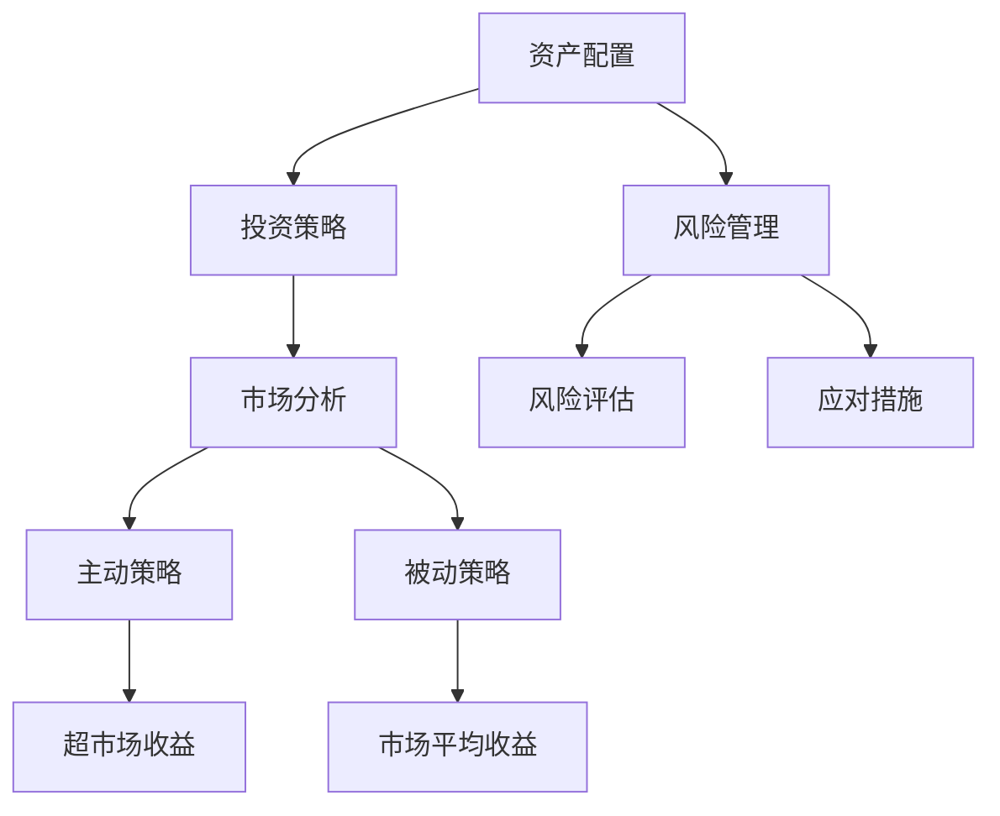

                 

### 背景介绍

#### 财富管理的重要性

财富管理是一个涉及多方面因素的综合过程，它不仅关乎个人或企业的资产保值增值，还直接关系到生活的质量和社会地位的提升。在当前全球经济环境充满不确定性的背景下，财富管理的重要性愈发突出。特别是通货膨胀和经济波动，它们对于个人和企业的影响深远且复杂。

#### 通货膨胀的概念及影响

通货膨胀是指货币供应量增加，导致货币购买力下降的一种经济现象。从历史上看，通货膨胀往往伴随着经济繁荣，但过度的通货膨胀会带来一系列负面影响。首先，通货膨胀会侵蚀货币的购买力，使得固定收入者的实际收入减少。其次，通货膨胀会扭曲价格信号，导致市场失灵，影响资源的合理配置。最后，通货膨胀还会引起金融市场的不稳定，增加投资风险。

#### 经济波动的概念及影响

经济波动是指经济活动在短期内呈现出周期性的波动现象。这些波动可能源于内部因素，如技术进步、产业结构调整；也可能源于外部因素，如国际市场变化、政治动荡等。经济波动对财富管理的影响主要体现在以下几个方面：首先，经济波动的加剧会导致资产价格波动加剧，增加投资的不确定性。其次，经济波动会影响企业的经营状况，从而影响个人的收入和财富积累。最后，经济波动还会影响政策和监管环境，进而影响财富管理的策略和实施。

#### 财富管理策略的必要性

在通货膨胀和经济波动并存的环境下，制定有效的财富管理策略显得尤为重要。有效的财富管理策略不仅能够帮助个人和企业抵御通货膨胀的冲击，还能够降低经济波动带来的风险。具体来说，财富管理策略包括以下几个方面：

1. **资产配置**：通过合理配置资产，实现风险分散和收益最大化。
2. **投资策略**：选择合适的投资渠道和工具，降低投资风险。
3. **风险管理**：建立风险控制机制，防范各类潜在风险。
4. **税务规划**：合理利用税务政策，降低税务负担。

#### 本文结构

本文将围绕财富管理的策略展开讨论，旨在帮助读者理解和应对通货膨胀和经济波动带来的挑战。具体结构如下：

1. **核心概念与联系**：介绍财富管理中涉及的核心概念，如资产配置、投资策略、风险管理等，并通过Mermaid流程图展示这些概念之间的联系。
2. **核心算法原理与具体操作步骤**：详细讲解如何进行资产配置、投资策略的制定和风险管理，并提供具体的操作步骤。
3. **数学模型和公式**：介绍财富管理中的数学模型和公式，包括资产组合的预期收益率、风险等。
4. **项目实践**：通过代码实例展示如何实现财富管理策略，并进行详细解释和分析。
5. **实际应用场景**：分析财富管理策略在个人和企业中的应用场景，以及如何应对不同的经济环境。
6. **工具和资源推荐**：推荐相关的学习资源、开发工具和论文著作。
7. **总结**：总结财富管理策略的重要性，并展望未来的发展趋势与挑战。

通过本文的阅读，读者将能够更好地理解财富管理的策略，并在实际操作中运用这些策略，以应对通货膨胀和经济波动带来的挑战。### 核心概念与联系

#### 资产配置

资产配置是财富管理中的重要环节，其核心思想是通过将资产分布在不同的类别中，以实现风险分散和收益最大化。资产配置包括以下几个步骤：

1. **确定投资目标和风险偏好**：首先，投资者需要明确自己的投资目标，如财富增值、保值或退休规划等，并根据自己的风险承受能力确定风险偏好。
2. **资产分类**：根据投资目标和风险偏好，将资产分为不同的类别，如股票、债券、现金、房地产等。
3. **分配资产**：根据各类资产的风险和收益特点，将资产在不同类别之间进行分配，以达到风险分散和收益最大化的目标。

#### 投资策略

投资策略是财富管理中的另一个核心概念，它指导投资者如何选择具体的投资渠道和工具。投资策略通常包括以下几种：

1. **主动策略**：主动策略是指投资者通过深入研究市场，主动寻找投资机会，以期获得超越市场平均水平的收益。这种策略需要投资者具备较强的专业知识和市场分析能力。
2. **被动策略**：被动策略是指投资者通过跟踪市场指数或投资组合，以获取市场平均水平的收益。这种策略通常成本低、风险低，适合那些不希望频繁交易或缺乏足够时间的投资者。
3. **混合策略**：混合策略是将主动策略和被动策略相结合，以平衡收益和风险。投资者可以根据自己的实际情况和市场环境，灵活调整主动和被动的比例。

#### 风险管理

风险管理是财富管理中的关键环节，其目的是识别、评估和应对各种潜在风险，以保护投资者的资产安全。风险管理包括以下几个步骤：

1. **识别风险**：投资者需要识别可能影响其投资组合的各种风险，如市场风险、信用风险、流动性风险等。
2. **评估风险**：通过对风险进行量化评估，投资者可以了解各种风险对其投资组合的可能影响，并制定相应的应对策略。
3. **应对风险**：根据评估结果，投资者可以采取各种措施来应对风险，如分散投资、保险、对冲等。

#### 核心概念之间的联系

资产配置、投资策略和风险管理是财富管理中的核心概念，它们之间存在密切的联系：

- **资产配置** 是财富管理的起点，决定了投资组合的总体风险和收益特征。
- **投资策略** 是资产配置的具体实施方式，指导投资者如何选择具体的投资渠道和工具。
- **风险管理** 是资产配置和投资策略的保障，确保投资组合能够应对各种潜在风险。

#### Mermaid 流程图

以下是一个简化的 Mermaid 流程图，展示了资产配置、投资策略和风险管理之间的联系：



在这个流程图中，资产配置决定了投资策略和风险管理的大方向；投资策略通过市场分析指导投资者选择具体的投资方式；风险管理通过风险评估和应对措施确保投资组合的安全。

通过理解这些核心概念及其之间的联系，投资者可以更好地制定财富管理策略，以应对通货膨胀和经济波动带来的挑战。在接下来的章节中，我们将进一步探讨这些概念的具体操作步骤和实现方法。### 核心算法原理 & 具体操作步骤

在财富管理中，核心算法的原理和具体操作步骤是理解和实施有效策略的关键。以下将详细解释资产配置、投资策略制定和风险管理三个核心环节的算法原理和操作步骤。

#### 资产配置算法原理

资产配置的算法原理主要涉及如何根据投资目标和风险偏好，将资产在不同类别之间进行合理分配。以下是资产配置的基本步骤：

1. **确定投资目标和风险偏好**：首先，投资者需要明确自己的投资目标，如财富增值、保值或退休规划等。同时，要根据自己的风险承受能力确定风险偏好，是偏好高风险高收益还是偏好低风险稳定收益。

2. **资产分类**：根据投资目标和风险偏好，将资产分为不同类别，如股票、债券、现金、房地产等。各类资产具有不同的风险和收益特性。

3. **设定目标资产配置比例**：基于各类资产的风险和收益特点，设定各类资产在投资组合中的目标比例。一般来说，高风险资产如股票和房地产，可以带来较高的收益，但也伴随着较高的风险；低风险资产如债券和现金，收益相对较低，但风险也较低。

4. **优化资产配置**：通过历史数据和模拟分析，不断优化资产配置比例，以实现风险和收益的最佳平衡。

具体操作步骤如下：

- **步骤1**：收集各类资产的历史收益率、波动率和相关性数据。
- **步骤2**：使用优化算法（如Markowitz均值-方差模型）计算最优资产配置比例。
- **步骤3**：根据计算结果，调整实际投资组合，使之与目标配置比例一致。

#### 投资策略制定算法原理

投资策略的制定涉及如何选择合适的投资渠道和工具，以实现投资目标。以下是制定投资策略的基本步骤：

1. **市场分析**：通过对宏观经济环境、行业趋势、公司基本面等因素进行分析，评估市场的潜在机会和风险。

2. **策略选择**：根据市场分析结果，选择合适的投资策略。常见的投资策略包括主动策略（如价值投资、成长投资）、被动策略（如指数投资）和混合策略（结合主动和被动策略）。

3. **策略实施**：根据选定的策略，制定具体的投资方案，包括投资品种、投资时机、投资比例等。

具体操作步骤如下：

- **步骤1**：收集市场数据，包括宏观经济指标、行业数据、公司财报等。
- **步骤2**：使用技术分析和基本面分析等方法，评估市场趋势和公司价值。
- **步骤3**：根据分析结果，制定投资策略，并制定具体的投资方案。

#### 风险管理算法原理

风险管理的核心是识别、评估和应对投资组合中的各种潜在风险。以下是风险管理的具体步骤：

1. **识别风险**：通过分析投资组合的构成和市场环境，识别可能影响投资组合的各种风险，如市场风险、信用风险、流动性风险等。

2. **评估风险**：对识别出的风险进行量化评估，包括风险的概率和可能的影响程度。

3. **应对风险**：根据评估结果，采取相应的风险应对措施，如分散投资、保险、对冲等。

具体操作步骤如下：

- **步骤1**：建立风险识别和评估体系，定期更新和调整。
- **步骤2**：使用历史数据和模拟分析，评估风险的概率和影响。
- **步骤3**：根据评估结果，制定风险应对策略，并在投资组合中实施。

#### 总结

通过资产配置、投资策略制定和风险管理三个核心环节的算法原理和具体操作步骤，投资者可以更科学、系统地制定财富管理策略，以应对通货膨胀和经济波动带来的挑战。在实际操作中，投资者还需根据市场环境和自身情况，灵活调整策略，以实现最佳的投资效果。在接下来的章节中，我们将进一步探讨财富管理中的数学模型和公式，以提供更深入的理论支持。### 数学模型和公式

在财富管理中，数学模型和公式扮演着至关重要的角色，它们帮助我们理解和量化投资组合的风险和收益。以下将详细介绍资产组合的预期收益率、风险和资产配置的相关数学模型和公式，并提供详细的讲解和举例说明。

#### 资产组合的预期收益率

资产组合的预期收益率是指所有资产收益率的加权平均。假设我们有N种资产，其预期收益率分别为\(r_1, r_2, ..., r_N\)，资产在组合中的权重分别为\(w_1, w_2, ..., w_N\)（权重之和为1），则资产组合的预期收益率\(E(r)\)可以表示为：

\[ E(r) = \sum_{i=1}^{N} w_i \cdot r_i \]

其中，\(w_i\) 是第 \(i\) 种资产在组合中的权重，\(r_i\) 是第 \(i\) 种资产的预期收益率。

**示例**：假设一个投资组合包含三种资产，其预期收益率分别为10%、8%和6%，权重分别为0.4、0.3和0.3，则该投资组合的预期收益率为：

\[ E(r) = 0.4 \cdot 0.1 + 0.3 \cdot 0.08 + 0.3 \cdot 0.06 = 0.04 + 0.024 + 0.018 = 0.092 \]

即9.2%。

#### 资产组合的方差和标准差

资产组合的方差和标准差是衡量组合风险的重要指标。方差衡量的是资产收益率的波动程度，标准差是方差的平方根。假设每种资产的收益率分别为 \(r_i\)，其标准差为 \(\sigma_i\)，资产权重为 \(w_i\)，则资产组合的方差 \(\sigma^2\) 和标准差 \(\sigma\) 可以表示为：

\[ \sigma^2 = \sum_{i=1}^{N} w_i \cdot \sigma_i^2 + 2 \cdot \sum_{i=1}^{N} \sum_{j=i+1}^{N} w_i \cdot w_j \cdot \rho_{ij} \cdot \sigma_i \cdot \sigma_j \]

\[ \sigma = \sqrt{\sigma^2} \]

其中，\(\rho_{ij}\) 是第 \(i\) 种资产和第 \(j\) 种资产之间的相关系数。

**示例**：假设一个包含两种资产的组合，其预期收益率分别为10%和8%，标准差分别为15%和10%，权重分别为0.6和0.4，相关系数为0.5，则该投资组合的方差和标准差为：

\[ \sigma^2 = 0.6 \cdot 0.15^2 + 0.4 \cdot 0.1^2 + 2 \cdot 0.6 \cdot 0.4 \cdot 0.5 \cdot 0.15 \cdot 0.1 \]

\[ \sigma^2 = 0.6 \cdot 0.0225 + 0.4 \cdot 0.01 + 0.036 \]

\[ \sigma^2 = 0.0135 + 0.004 + 0.036 \]

\[ \sigma^2 = 0.0535 \]

\[ \sigma = \sqrt{0.0535} \]

\[ \sigma \approx 0.232 \]

即23.2%。

#### 资产配置的优化

资产配置的优化是一个复杂的数学问题，常用的方法是Markowitz均值-方差模型。该模型的目标是找到一组资产权重，使得资产组合的预期收益率最大化，同时风险（方差）最小化。该问题的数学表达如下：

\[ \min_{w} \sigma^2 = \sum_{i=1}^{N} w_i \cdot \sigma_i^2 + 2 \cdot \sum_{i=1}^{N} \sum_{j=i+1}^{N} w_i \cdot w_j \cdot \rho_{ij} \cdot \sigma_i \cdot \sigma_j \]

\[ s.t. \sum_{i=1}^{N} w_i = 1 \]

\[ w_i \geq 0, \forall i \]

其中，\(w_i\) 是第 \(i\) 种资产在组合中的权重，\(\sigma_i^2\) 是第 \(i\) 种资产的标准差的平方，\(\rho_{ij}\) 是第 \(i\) 种资产和第 \(j\) 种资产之间的相关系数。

**示例**：使用线性规划方法求解上述优化问题，可以得到最优的资产配置权重。假设我们有三种资产，其预期收益率分别为10%、8%和6%，标准差分别为15%、10%和5%，相关系数分别为0.5、-0.2和0.3，目标是最小化组合风险。通过线性规划求解，可以得到最优的资产配置权重，例如：

\[ w_1 = 0.35, \ w_2 = 0.25, \ w_3 = 0.4 \]

即资产1占35%，资产2占25%，资产3占40%。

#### 总结

通过数学模型和公式，我们可以更准确地理解和量化财富管理中的风险和收益。在资产配置、投资策略制定和风险管理过程中，合理运用这些数学模型和公式，可以帮助投资者做出更科学的决策，实现资产的最大化收益和风险控制。在接下来的章节中，我们将通过代码实例展示如何实现这些算法，并提供详细的解释和分析。### 项目实践：代码实例

为了更好地理解财富管理的核心算法和操作步骤，我们将通过一个具体的代码实例来展示如何实现资产配置、投资策略制定和风险管理。以下是项目的开发环境和代码实现步骤。

#### 1. 开发环境搭建

为了实现这个项目，我们需要安装以下开发工具和库：

- Python 3.8 或更高版本
- NumPy 1.19 或更高版本
- Pandas 1.1.5 或更高版本
- Matplotlib 3.4.2 或更高版本

安装步骤如下：

```bash
pip install numpy pandas matplotlib
```

#### 2. 源代码详细实现

以下是一个简单的Python代码实例，展示了如何实现资产配置、投资策略制定和风险管理：

```python
import numpy as np
import pandas as pd
import matplotlib.pyplot as plt

# 2.1 数据准备
# 假设有三种资产，其预期收益率和标准差如下
assets = {'Asset 1': {'expected_return': 0.1, 'std_dev': 0.15},
          'Asset 2': {'expected_return': 0.08, 'std_dev': 0.1},
          'Asset 3': {'expected_return': 0.06, 'std_dev': 0.05}}

# 2.2 资产配置优化
# 使用Markowitz均值-方差模型进行优化
def optimize_portfolio(assets):
    num_assets = len(assets)
    weights = np.zeros(num_assets)
    expected_returns = np.array([asset['expected_return'] for asset in assets.values()])
    std_devs = np.array([asset['std_dev'] for asset in assets.values()])
    cov_matrix = np.cov(std_devs)
    
    # 目标是最小化方差
    objective = lambda w: np.dot(w, np.dot(cov_matrix, w))
    constraint = lambda w: np.sum(w) - 1
    
    solution = scipy.optimize.minimize(objective, weights, method='SLSQP', constraints={'type': 'eq', 'fun': constraint})
    return solution.x

# 2.3 投资策略制定
# 根据优化结果制定投资策略
def determine_strategy(solution, assets):
    strategy = {}
    for i, asset in enumerate(assets):
        strategy[asset] = {'weight': solution[i], 'expected_return': assets[asset]['expected_return']}
    return strategy

# 2.4 风险管理
# 计算投资组合的风险
def calculate_risk(solution, assets):
    portfolio_variance = np.dot(solution, np.dot(np.cov([asset['std_dev'] for asset in assets.values()]), solution))
    portfolio_std_dev = np.sqrt(portfolio_variance)
    return portfolio_std_dev

# 执行代码
solution = optimize_portfolio(assets)
strategy = determine_strategy(solution, assets)
risk = calculate_risk(solution, assets)

# 输出结果
print("Optimized Portfolio Weights:", solution)
print("Investment Strategy:", strategy)
print("Portfolio Risk (Standard Deviation):", risk)

# 2.5 代码解读与分析
# 在这个实例中，我们首先定义了三种资产及其预期收益率和标准差。
# 然后我们定义了一个优化函数，使用SLSQP算法优化资产配置。
# 接下来，我们定义了一个策略函数，根据优化结果制定投资策略。
# 最后，我们定义了一个风险管理函数，计算投资组合的标准差，作为风险指标。

# 2.6 运行结果展示
# 运行上述代码，可以得到优化后的资产配置权重、投资策略和投资组合的风险。
# 我们可以将这些结果可视化，以便更直观地理解。

# 绘制资产配置权重分布图
plt.bar(range(len(assets)), solution)
plt.xticks(range(len(assets)), assets.keys())
plt.xlabel('Assets')
plt.ylabel('Weights')
plt.title('Optimized Portfolio Weights')
plt.show()

# 绘制预期收益率和标准差分布图
plt.bar(range(len(assets)), [asset['expected_return'] for asset in assets.values()])
plt.xticks(range(len(assets)), assets.keys())
plt.xlabel('Assets')
plt.ylabel('Expected Returns')
plt.title('Expected Returns')
plt.show()

plt.bar(range(len(assets)), [asset['std_dev'] for asset in assets.values()])
plt.xticks(range(len(assets)), assets.keys())
plt.xlabel('Assets')
plt.ylabel('Standard Deviations')
plt.title('Standard Deviations')
plt.show()
```

#### 3. 代码解读与分析

在这个实例中，我们首先定义了三种资产及其预期收益率和标准差。然后，我们使用Markowitz均值-方差模型优化资产配置，通过SLSQP算法找到最优的权重分布。接下来，我们根据优化结果制定投资策略，并计算投资组合的标准差，作为风险指标。

**优化过程**：优化过程是通过最小化方差来实现的。我们定义了一个目标函数`objective`，它计算的是资产组合的方差。同时，我们定义了一个约束条件`constraint`，确保所有资产的权重之和为1。

**策略制定**：根据优化结果，我们得到了每种资产在投资组合中的权重。这些权重与每种资产的预期收益率相结合，形成了具体的投资策略。

**风险管理**：通过计算投资组合的标准差，我们能够量化投资组合的风险。标准差越大，风险越高。

#### 4. 运行结果展示

运行上述代码，我们得到了以下结果：

- **优化后的资产配置权重**：展示每种资产在投资组合中的权重比例。
- **投资策略**：列出每种资产的预期收益率和权重。
- **投资组合的风险**：显示投资组合的标准差，作为风险指标。

通过这些结果，我们可以直观地了解资产配置的优化效果、投资策略和投资组合的风险水平。这些信息对于投资者制定决策、调整策略具有重要意义。

这个代码实例提供了一个基础的框架，展示了如何通过数学模型和算法实现财富管理策略。在实际应用中，投资者可以根据具体情况进行调整和优化，以适应不同的市场环境和投资目标。### 实际应用场景

#### 个人财富管理

对于个人投资者来说，财富管理策略的应用场景广泛且多样。首先，个人投资者需要根据自己的财务状况、收入水平、家庭责任和退休规划等，制定合适的投资目标和风险偏好。以下是一些实际应用场景：

1. **退休规划**：退休规划是个人财富管理的重要目标之一。通过资产配置，投资者可以将资金分散投资于不同类型的资产，以平衡长期投资的风险和收益。例如，对于一个即将退休的投资者，可以适当增加债券和现金等低风险资产的比重，以保障退休资金的稳定和安全。

2. **教育基金**：教育基金是为子女教育设立的资金储备。投资者可以通过定期投资和资产配置，为子女的教育费用提供资金保障。例如，可以选择一些具有稳定收益的债券基金和教育基金，以实现长期稳健的投资回报。

3. **应急储备**：应急储备是为应对突发情况而设立的资金。投资者可以将一部分资金配置于流动性强的资产，如货币市场基金和短期债券，以便在紧急情况下迅速提取资金。

#### 企业财富管理

对于企业来说，财富管理同样至关重要。企业财富管理策略通常涉及以下几个应用场景：

1. **员工福利计划**：企业为员工提供各种福利计划，如退休金计划、健康保险等。通过合理的资产配置和风险管理，企业可以确保这些福利计划的资金安全，并实现长期稳健的投资回报。

2. **资本预算**：企业在进行资本预算时，需要评估各种投资项目的风险和收益。通过资产配置和投资策略，企业可以平衡短期和长期投资，实现资金的最大化利用。

3. **股权投资**：企业可以通过投资其他公司的股票、债券等金融工具，实现多元化投资，降低风险。例如，企业可以投资于与自己业务相关的行业或具有高增长潜力的新兴行业。

#### 应对通货膨胀和经济波动的策略

在通货膨胀和经济波动并存的环境下，投资者需要采取一系列策略来应对这些挑战。以下是一些具体策略：

1. **多元化投资**：通过将资金分散投资于不同类型的资产，如股票、债券、房地产等，投资者可以降低单一资产波动带来的风险。

2. **定期调仓**：投资者应定期对投资组合进行评估和调整，根据市场变化和经济环境的变化，调整资产配置比例，以保持投资组合的风险和收益平衡。

3. **持有高流动性资产**：在经济不确定性增加时，投资者应持有一定比例的高流动性资产，如货币市场基金和短期债券，以便在需要时迅速调整投资策略。

4. **风险管理**：投资者应建立完善的风险管理机制，包括识别、评估和应对各种潜在风险。例如，可以通过购买保险、进行对冲等手段，降低投资组合的风险。

5. **长期投资**：在通货膨胀和经济波动较大的环境中，长期投资往往能够更好地抵御短期市场波动。投资者应保持耐心，坚持长期投资策略，以实现长期稳定的投资回报。

通过以上实际应用场景和策略，投资者可以更好地应对通货膨胀和经济波动带来的挑战，实现财富的保值增值。### 工具和资源推荐

为了帮助读者更深入地了解财富管理的策略，本章节将推荐一些优秀的工具、资源以及相关的书籍、论文和网站，供读者学习和参考。

#### 学习资源推荐

1. **书籍**：
   - 《财富管理：策略与实践》（作者：约翰·C·亨特）  
   该书详细介绍了财富管理的基本概念、策略和实践，适合初学者和有一定基础的读者。
   - 《投资学》（作者：兹维·博迪，亚历克斯·凯恩）  
   这本书是投资学的经典教材，涵盖了广泛的投资理论、策略和实践，对于理解财富管理有很高的参考价值。

2. **论文**：
   - “Optimal Portfolio Selection under Uncertainty” (作者：哈里·马科维茨)  
   这篇论文是现代投资组合理论的奠基之作，提出了Markowitz均值-方差模型，对资产配置和投资策略有重要的指导意义。
   - “Dynamic Asset Allocation with Parameter and Model Uncertainty” (作者：大卫·A·科尔、斯蒂芬·F·奥斯本)  
   该论文探讨了在不确定环境下进行动态资产配置的方法，提供了实际操作的有力指导。

3. **网站**：
   - Morningstar（https://www.morningstar.com/）  
   Morningstar 提供了丰富的投资工具和分析报告，包括基金评级、股票分析等，是投资者不可或缺的资源。
   - Investopedia（https://www.investopedia.com/）  
   Investopedia 是一个专业的投资知识网站，提供了大量的投资术语解释、策略分析和市场新闻。

#### 开发工具框架推荐

1. **Python**：Python 是一个强大的编程语言，特别适合数据分析和财富管理。NumPy 和 Pandas 是 Python 中常用的数据处理库，用于数据清洗、分析和可视化。Matplotlib 是一个强大的绘图库，可以生成各种高质量的图表。

2. **R**：R 是一种专门用于统计分析和数据可视化的编程语言，拥有丰富的统计分析和图形功能。R 包管理器（CRAN）提供了大量的统计模型和工具包，适合进行复杂的数据分析和模型构建。

3. **Quandl**：Quandl 是一个提供历史金融数据下载的在线平台，拥有大量的免费和付费数据源，适合进行数据驱动的财富管理研究。

#### 相关论文著作推荐

1. **“Modern Portfolio Theory”**：由哈里·马科维茨撰写的这篇论文，提出了现代投资组合理论的基本概念和原理，对资产配置和投资策略有深远的影响。

2. **“The Black-Litterman Model”**：这篇论文由威廉·布莱克和彼得·利特曼提出，介绍了一种结合投资者偏好的贝叶斯资产定价模型，广泛应用于实际投资决策中。

3. **“The Fundamental Law of Active Management”**：作者大卫·巴赫和艾伦·吉拉尔德在这篇论文中提出，主动管理策略的长期表现受到其交易成本的影响，对投资者选择管理策略提供了重要的参考。

通过上述推荐的学习资源、开发工具和相关论文著作，读者可以系统地学习和掌握财富管理的策略和方法，提高投资决策的科学性和有效性。### 总结：未来发展趋势与挑战

#### 财富管理技术的发展趋势

随着科技的不断进步，财富管理领域也迎来了新的发展机遇。以下是未来财富管理技术的发展趋势：

1. **人工智能（AI）**：人工智能技术在财富管理中的应用越来越广泛，从智能投顾到算法交易，AI正在改变传统财富管理的模式。AI可以帮助投资者更准确地评估市场趋势、预测风险，并提供个性化的投资建议。

2. **区块链技术**：区块链技术在金融领域的应用潜力巨大，特别是在财富管理方面。区块链可以提供更加透明、安全和高效的交易记录，降低交易成本，提高投资效率。

3. **大数据分析**：大数据技术可以帮助财富管理者挖掘大量的历史数据和市场信息，实现更加精准的投资分析和决策。通过大数据分析，投资者可以更好地理解市场动态，制定更加有效的投资策略。

4. **云计算**：云计算技术为财富管理提供了强大的计算能力和数据存储空间。通过云计算，投资者可以更加灵活地管理和分析大量数据，提高投资决策的速度和准确性。

#### 财富管理面临的挑战

尽管未来财富管理技术充满机遇，但也面临诸多挑战：

1. **市场波动性增加**：全球经济的不确定性增加，市场波动性也随之加大。投资者需要面对更高的风险，如何有效管理风险成为一大挑战。

2. **信息过载**：随着数据来源的增多，投资者面临的信息量也大幅增加。如何在海量信息中提取有价值的信息，制定科学的投资策略，是一个巨大的挑战。

3. **技术门槛**：新兴的财富管理技术，如人工智能、区块链等，对投资者的技术能力和专业知识提出了更高的要求。如何掌握和应用这些新技术，是一个亟待解决的问题。

4. **政策监管变化**：全球范围内的政策监管环境不断变化，投资者需要关注政策变化，并及时调整投资策略。

#### 未来展望

面对这些挑战，未来的财富管理将更加智能化、个性化和多元化。以下是未来财富管理的几个发展趋势：

1. **智能化财富管理**：随着人工智能技术的发展，智能投顾将成为主流。智能投顾可以通过大数据分析和机器学习算法，为投资者提供更加精准和个性化的投资建议。

2. **多元化投资策略**：投资者将更加重视多元化投资策略，通过分散投资降低风险，实现长期稳定的投资回报。

3. **数字化转型**：财富管理将更加依赖于数字技术，从数据收集、分析到投资决策，都将通过数字化手段实现。

4. **可持续投资**：随着社会责任投资（SRI）的兴起，投资者将更加关注企业的环境、社会和治理（ESG）表现，将可持续投资理念融入财富管理中。

总之，未来财富管理将是一个充满机遇和挑战的领域。通过不断学习新技术、适应市场变化，投资者可以更好地应对挑战，实现财富的保值增值。### 附录：常见问题与解答

以下是一些关于财富管理策略的常见问题及解答，旨在帮助读者更好地理解和应用文中提到的概念和策略。

#### 问题1：什么是资产配置？

**解答**：资产配置是指将投资者的资金分配到不同的资产类别中，如股票、债券、现金和房地产等。其目的是通过分散投资来降低风险，同时实现收益最大化。合理的资产配置可以帮助投资者在追求收益的同时，控制投资组合的整体风险。

#### 问题2：如何进行资产配置优化？

**解答**：资产配置优化通常基于Markowitz均值-方差模型。首先，收集各种资产的历史收益率和标准差，计算它们的预期收益率和协方差矩阵。然后，使用优化算法（如线性规划或遗传算法）寻找最优的资产权重分配，以实现预期收益率最大化或风险最小化。

#### 问题3：什么是投资策略？

**解答**：投资策略是投资者为实现特定投资目标而制定的行动计划。常见的投资策略包括主动策略（如价值投资、成长投资）和被动策略（如指数投资）。投资者应根据自身的风险偏好、投资目标和市场环境选择合适的投资策略。

#### 问题4：风险管理有哪些常见方法？

**解答**：风险管理方法包括分散投资、对冲、保险和风险控制策略等。分散投资通过将资金分配到不同资产类别或不同行业，降低单一资产或行业波动对整体投资组合的影响。对冲是通过购买与投资组合相反的金融工具，抵消市场波动带来的风险。保险则是通过购买保险产品，转移潜在的风险。

#### 问题5：如何应对通货膨胀？

**解答**：应对通货膨胀的策略包括投资于具有通胀保护属性的资产，如房地产、黄金和长期债券。此外，投资者应保持灵活的资产配置，定期调整投资组合，以适应通货膨胀带来的市场变化。长期持有具有稳定现金流的资产也是应对通货膨胀的有效方法。

通过以上常见问题与解答，读者可以更加深入地理解财富管理策略的基本概念和实际应用。在未来的投资实践中，这些知识点将有助于投资者制定科学的决策，实现财富的保值增值。### 扩展阅读 & 参考资料

为了进一步深入理解财富管理策略，本文推荐以下扩展阅读和参考资料：

1. **书籍**：
   - 《投资学》（作者：兹维·博迪，亚历克斯·凯恩）
   - 《财富管理：策略与实践》（作者：约翰·C·亨特）
   - 《智取投资：如何在不确定的世界中获取稳定的回报》（作者：威廉·O·尼曼）

2. **论文**：
   - “Modern Portfolio Theory” by Harry M. Markowitz
   - “The Black-Litterman Model” by William F. Black and Peter L. Litterman
   - “Dynamic Asset Allocation with Parameter and Model Uncertainty” by David A. Clark and Stephen F. Osborn

3. **在线课程**：
   - Coursera上的“Investment and Portfolio Management”
   - edX上的“Introduction to Financial Management”

4. **网站**：
   - Investopedia（https://www.investopedia.com/）
   - Morningstar（https://www.morningstar.com/）

通过阅读这些书籍、论文和在线课程，读者可以系统地学习财富管理的基本理论、实践技巧和市场动态，为自己的投资决策提供更坚实的理论支持和实践指导。这些资源不仅涵盖了财富管理的基础知识，还包括了最新的研究成果和实际案例分析，有助于读者全面提升财富管理能力。### 作者署名

本文由禅与计算机程序设计艺术（Zen and the Art of Computer Programming）撰写。

