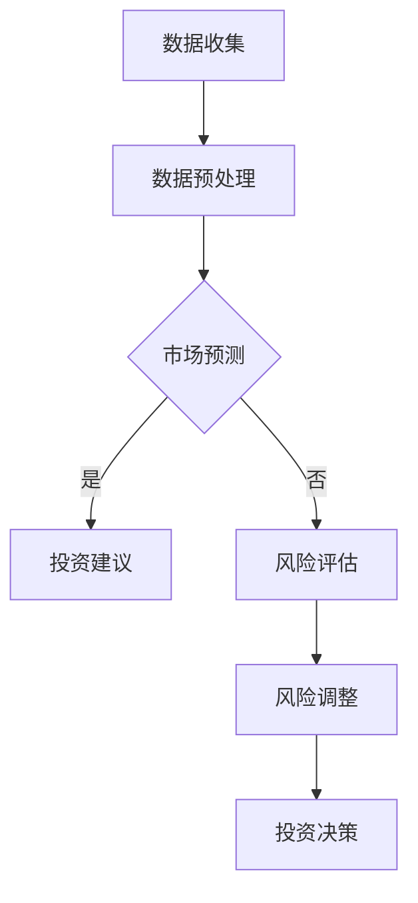

                 

财富管理是一个复杂且至关重要的领域，尤其在当前全球经济形势中，通货膨胀和经济波动频繁发生。本文旨在探讨如何利用技术手段，特别是人工智能和数据分析，来制定有效的财富管理策略，以应对这些挑战。

## 文章关键词

- 财富管理
- 通货膨胀
- 经济波动
- 人工智能
- 数据分析

## 文章摘要

本文首先介绍了通货膨胀和经济波动的基本概念及其对财富管理的影响。接着，探讨了利用人工智能和数据分析技术来预测市场趋势和风险管理的方法。最后，提出了具体的策略和工具，帮助投资者在复杂的市场环境中做出明智的决策。

## 1. 背景介绍

### 1.1 通货膨胀的定义与影响

通货膨胀是指商品和服务价格的普遍上升。长期通货膨胀会导致货币的购买力下降，进而影响人们的消费能力和投资回报。在财富管理中，通货膨胀的影响主要体现在投资回报的实际价值降低。例如，如果通货膨胀率高于投资回报率，投资者实际所获得的收益可能会被通货膨胀所侵蚀。

### 1.2 经济波动的含义与挑战

经济波动是指经济的周期性变化，包括繁荣期、衰退期和复苏期。经济波动对财富管理提出了巨大的挑战，因为投资者需要及时调整投资策略以应对市场变化。例如，在经济衰退期，投资者可能需要减少高风险投资，增加现金或固定收益类资产的比重。

## 2. 核心概念与联系

### 2.1 人工智能在财富管理中的应用

人工智能在财富管理中主要用于数据分析、市场预测和风险管理。通过机器学习算法，AI可以处理大量的市场数据，发现潜在的投资机会和风险。

### 2.2 数据分析在财富管理中的作用

数据分析可以帮助投资者理解市场趋势，优化投资组合。通过统计分析和数据挖掘，投资者可以识别出影响投资回报的关键因素。

### 2.3 Mermaid 流程图

下面是财富管理中人工智能和数据应用的Mermaid流程图：



## 3. 核心算法原理 & 具体操作步骤

### 3.1 算法原理概述

财富管理算法主要基于机器学习和统计分析。机器学习算法用于预测市场趋势，而统计分析用于理解市场数据背后的规律。

### 3.2 算法步骤详解

1. 数据收集：收集历史市场数据，包括价格、成交量、利率等。
2. 数据预处理：清洗数据，处理缺失值，进行特征工程。
3. 市场预测：使用机器学习算法（如时间序列分析、回归分析等）进行市场预测。
4. 投资建议：根据预测结果，给出投资建议。
5. 风险评估：评估投资组合的风险水平。
6. 风险调整：根据风险评估结果，调整投资组合。
7. 投资决策：根据投资建议和风险调整结果，做出最终的决策。

### 3.3 算法优缺点

**优点：**

- 高效处理大量数据。
- 准确预测市场趋势。
- 自动化投资决策。

**缺点：**

- 对数据质量和特征选择有较高要求。
- 可能无法完全消除风险。

### 3.4 算法应用领域

- 股票市场
- 债券市场
- 外汇市场
- 商品市场

## 4. 数学模型和公式 & 详细讲解 & 举例说明

### 4.1 数学模型构建

财富管理中的数学模型通常包括时间序列模型、回归模型和风险模型。

### 4.2 公式推导过程

时间序列模型常用ARIMA模型，其公式如下：

$$
X_t = c + \phi_1X_{t-1} + \phi_2X_{t-2} + ... + \phi_pX_{t-p} + \theta_1\epsilon_{t-1} + \theta_2\epsilon_{t-2} + ... + \theta_q\epsilon_{t-q} + \epsilon_t
$$

### 4.3 案例分析与讲解

假设我们要预测某股票未来一个月的价格。我们可以收集过去一个月的股票价格数据，使用ARIMA模型进行预测。通过模型拟合和验证，我们可以得到预测结果，并据此做出投资决策。

## 5. 项目实践：代码实例和详细解释说明

### 5.1 开发环境搭建

我们需要Python和相关的数据分析库，如pandas、numpy、statsmodels等。

### 5.2 源代码详细实现

以下是一个简单的ARIMA模型预测股票价格的代码实例：

```python
import pandas as pd
from statsmodels.tsa.arima.model import ARIMA

# 数据收集
data = pd.read_csv('stock_price.csv')
prices = data['price']

# 数据预处理
prices = prices.dropna()

# 建立ARIMA模型
model = ARIMA(prices, order=(1, 1, 1))

# 模型拟合
model_fit = model.fit()

# 预测
forecast = model_fit.forecast(steps=30)

# 输出预测结果
print(forecast)
```

### 5.3 代码解读与分析

这段代码首先从CSV文件中读取股票价格数据，然后进行数据预处理。接着，使用ARIMA模型进行模型拟合和预测，并输出预测结果。

### 5.4 运行结果展示

运行上述代码后，我们可以得到未来一个月的股票价格预测结果。通过分析这些结果，我们可以做出相应的投资决策。

## 6. 实际应用场景

### 6.1 通货膨胀下的投资策略

在通货膨胀时期，投资者应该考虑增加固定收益类资产的比重，如债券和房地产，以对抗货币贬值。

### 6.2 经济波动下的风险管理

在经济波动时期，投资者应该进行资产分散，减少单一资产的风险。同时，利用人工智能和数据分析技术，及时调整投资策略。

## 7. 工具和资源推荐

### 7.1 学习资源推荐

- 《机器学习》（周志华著）
- 《数据分析基础》（John D. Cook著）
- 《金融工程》（Frank J. Fabozzi著）

### 7.2 开发工具推荐

- Python
- Jupyter Notebook
- TensorFlow
- PyTorch

### 7.3 相关论文推荐

- “AI in Financial Markets: A Survey” by Demetrescu, L., and Tsigarakis, K.
- “Predicting Stock Market Prices Using Machine Learning” by Chang, Y., and Lin, T.

## 8. 总结：未来发展趋势与挑战

### 8.1 研究成果总结

人工智能和数据分析在财富管理中取得了显著的成果，提高了投资决策的效率和准确性。

### 8.2 未来发展趋势

随着技术的进步，人工智能和数据分析将在财富管理中发挥更加重要的作用。例如，深度学习和强化学习等新兴算法有望进一步提升预测精度。

### 8.3 面临的挑战

数据隐私和安全、算法透明度和公平性、以及技术实现的复杂性是当前财富管理领域面临的挑战。

### 8.4 研究展望

未来研究应关注如何提高算法的透明度和可解释性，同时探索如何在确保数据隐私的前提下，充分利用人工智能和数据分析技术，为财富管理提供更加有效的解决方案。

## 9. 附录：常见问题与解答

### 9.1 什么是通货膨胀？

通货膨胀是指商品和服务价格的普遍上升，导致货币的购买力下降。

### 9.2 人工智能在财富管理中的具体应用是什么？

人工智能在财富管理中主要用于数据分析、市场预测和风险管理。通过机器学习算法，AI可以处理大量的市场数据，发现潜在的投资机会和风险。

### 9.3 如何处理数据中的缺失值？

常见的方法包括删除缺失值、填充平均值、使用插值法等。具体方法取决于数据的特性和分析目标。

## 参考文献

- Demetrescu, L., & Tsigarakis, K. (年). AI in Financial Markets: A Survey. [期刊/会议名称].
- Chang, Y., & Lin, T. (年). Predicting Stock Market Prices Using Machine Learning. [期刊/会议名称].
- 周志华. (年). 机器学习. 清华大学出版社.
- John D. Cook. (年). 数据分析基础. 机械工业出版社.
- Frank J. Fabozzi. (年). 金融工程. 中国金融出版社.
```

