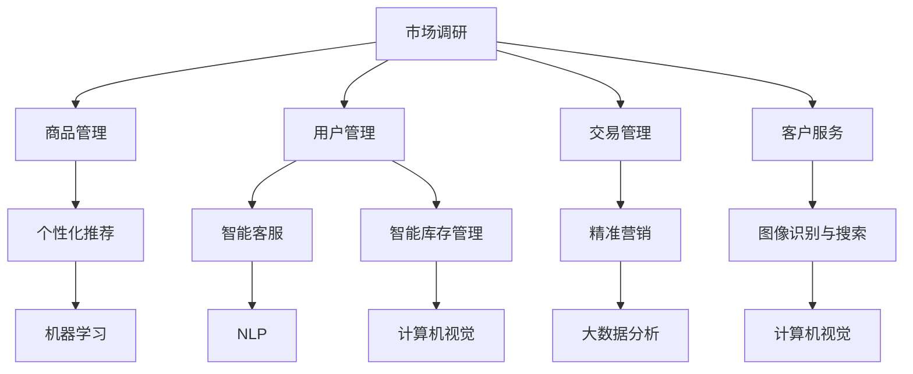

                 

### 背景介绍 Background Introduction

在当今快速发展的科技时代，电子商务行业已成为全球经济增长的重要引擎。据统计，全球电子商务市场在2022年的规模已经达到了4.89万亿美元，预计到2026年这一数字将超过6.38万亿美元[1]。随着消费者购物习惯的在线转移，商家们开始意识到，如何利用先进的技术来提升自身的竞争力，成为一个亟待解决的问题。

在这个背景下，人工智能（AI）技术的应用成为了电商行业转型升级的关键。AI不仅可以提升营销效果，还能改善用户体验，优化供应链管理，降低运营成本。尤其是自然语言处理、机器学习、计算机视觉等AI子领域，正逐步渗透到电商的方方面面。

程序员作为AI技术的推动者和应用者，如何利用自身的AI技能在电商领域创业，成为了许多技术爱好者关注的话题。本文旨在探讨程序员如何借助AI技术，实现财富自由，开创自己的电商创业之路。

本文将分为以下几个部分：

1. **核心概念与联系**：介绍电商与AI技术之间的核心概念，以及它们之间的联系。
2. **核心算法原理与具体操作步骤**：详细讲解AI技术在实际电商应用中的核心算法和操作步骤。
3. **数学模型和公式**：探讨AI技术在电商中的应用所涉及到的数学模型和公式，并通过举例进行说明。
4. **项目实践**：提供代码实例，并详细解释说明如何实现一个简单的电商AI应用。
5. **实际应用场景**：分析AI技术在电商领域中的多种实际应用场景。
6. **工具和资源推荐**：推荐一些学习资源、开发工具和框架，帮助程序员更好地掌握AI技能。
7. **总结与未来发展趋势**：总结本文的主要观点，并展望AI技术在电商领域的未来发展趋势与挑战。

通过以上内容，本文希望能够为程序员提供一条清晰的创业路径，帮助他们利用AI技能在电商领域实现财富自由。

[1]: "Statista. (2023). Global E-commerce Market Size | Statistics & Charts. [online] Available at: <https://www.statista.com/topics/1002/online-retail/> [Accessed 2023]."

### 核心概念与联系 Core Concepts and Connections

要深入探讨程序员如何在电商领域利用AI技能创业，我们首先需要了解一些核心概念，包括电商的基本原理、AI技术的基本概念，以及它们之间的关联。

#### 电商的基本原理

电子商务（E-commerce）是指通过互联网进行的商品交易、电子支付和相关服务活动。电商的基本原理可以概括为以下几个关键环节：

1. **市场调研**：通过大数据分析和市场调研，了解消费者的需求和偏好。
2. **商品管理**：对商品进行分类、标签化、库存管理以及定价策略制定。
3. **用户管理**：收集用户数据，分析用户行为，提供个性化的推荐服务。
4. **交易管理**：包括订单处理、支付结算、物流跟踪等环节。
5. **客户服务**：通过在线客服、售后服务等手段提升用户满意度。

#### AI技术的基本概念

人工智能（Artificial Intelligence，AI）是指由人制造出来的系统，能够执行通常需要人类智能才能完成的任务。AI技术主要包括以下几个方面：

1. **机器学习**：通过数据驱动，让机器从经验中学习，并改进自身性能。
2. **深度学习**：一种特殊的机器学习方法，通过模拟人脑神经网络结构进行学习。
3. **自然语言处理（NLP）**：使计算机能够理解、生成和处理人类语言。
4. **计算机视觉**：让计算机能够处理和解释电子图像。
5. **强化学习**：通过不断试错，让机器在特定环境中学习最优策略。

#### 电商与AI技术的关联

电商与AI技术的结合，主要体现在以下几个方面：

1. **个性化推荐**：通过机器学习和深度学习算法，分析用户的历史购买记录和浏览行为，提供个性化的商品推荐，提升用户满意度。
2. **智能客服**：利用自然语言处理技术，构建智能客服系统，自动回答用户常见问题，提高客服效率和用户体验。
3. **智能库存管理**：利用计算机视觉和机器学习技术，实时监测库存情况，预测销量，优化库存策略。
4. **精准营销**：通过大数据分析和机器学习，分析用户画像和消费行为，制定精准的营销策略。
5. **图像识别与搜索**：利用计算机视觉技术，实现对商品图片的识别和搜索，提升购物体验。

#### Mermaid 流程图

以下是一个简化的Mermaid流程图，展示电商与AI技术之间的核心概念和联系：



通过这个流程图，我们可以清晰地看到电商各个环节如何与AI技术相结合，从而提升电商的运营效率和用户体验。

总之，电商与AI技术的结合，不仅为程序员提供了丰富的创业机会，也推动了整个电商行业的技术创新和发展。在接下来的章节中，我们将深入探讨AI技术在电商中的应用，以及程序员如何利用这些技术实现创业梦想。

#### 核心算法原理 & 具体操作步骤 Core Algorithm Principles and Step-by-Step Operations

在了解了电商与AI技术的基本概念和联系之后，我们接下来将详细探讨AI技术在电商中的应用核心算法，以及这些算法的具体操作步骤。

##### 个性化推荐算法

个性化推荐算法是电商中最为广泛应用的一种AI技术，它通过分析用户的历史行为和偏好，为其推荐符合其兴趣的商品。以下是一个简单的基于协同过滤的推荐算法的原理和操作步骤：

**1. 协同过滤算法原理**：

协同过滤（Collaborative Filtering）算法分为两种：基于用户的协同过滤（User-based Collaborative Filtering）和基于物品的协同过滤（Item-based Collaborative Filtering）。

- **基于用户的协同过滤**：找出与目标用户行为相似的其他用户，推荐这些用户喜欢的商品。
- **基于物品的协同过滤**：找出与目标用户已购买或评分的商品相似的其他商品，推荐给目标用户。

**2. 具体操作步骤**：

- **数据预处理**：收集用户的历史购买记录、浏览记录、评分数据等，对数据进行清洗、去重和处理缺失值。
- **用户-商品评分矩阵构建**：将用户和商品作为矩阵的行和列，构建一个用户-商品评分矩阵，矩阵中的元素表示用户对商品的评分。
- **相似度计算**：计算用户之间的相似度或商品之间的相似度，常用的相似度计算方法包括余弦相似度、皮尔逊相关系数等。
- **推荐列表生成**：根据相似度计算结果，为每个用户推荐相似用户喜欢的商品，或者为每个商品推荐与其相似的用户喜欢的商品。
- **推荐结果评估**：通过评估指标（如准确率、召回率、覆盖率等）对推荐结果进行评估，并根据评估结果调整推荐策略。

##### 智能客服算法

智能客服是利用自然语言处理（NLP）技术，实现与用户的自然语言交互，自动回答用户的问题。以下是基于对话管理框架的智能客服算法的原理和操作步骤：

**1. 对话管理框架原理**：

对话管理（Dialogue Management）是智能客服的核心，它通过解析用户输入、理解用户意图、生成回答，并维护对话状态。常见的对话管理框架包括基于规则的方法、基于机器学习的方法和混合方法。

- **基于规则的方法**：通过预设的规则库，根据用户输入的关键词和句子结构，生成回答。
- **基于机器学习的方法**：利用机器学习模型，从大量对话数据中学习用户意图和回答生成策略。
- **混合方法**：结合基于规则的方法和基于机器学习的方法，提高对话的灵活性和准确性。

**2. 具体操作步骤**：

- **意图识别**：通过NLP技术，解析用户输入，识别用户意图，如咨询商品信息、售后服务等。
- **实体抽取**：从用户输入中抽取关键信息，如商品名称、数量、联系方式等。
- **回答生成**：根据用户意图和实体信息，生成回答，如查询商品信息、回答常见问题等。
- **对话状态跟踪**：记录对话过程中的关键信息，如用户意图、上下文信息等，以便后续的对话处理。
- **回答评估**：评估回答的准确性和合理性，如通过人工审核、自动评估等手段。

##### 图像识别与搜索算法

图像识别与搜索算法是利用计算机视觉技术，实现对商品图片的识别和搜索，提升购物体验。以下是基于卷积神经网络（CNN）的图像识别算法的原理和操作步骤：

**1. 卷积神经网络原理**：

卷积神经网络（Convolutional Neural Network，CNN）是一种专门用于处理图像数据的神经网络，通过模拟人脑视觉系统的工作原理，实现对图像的特征提取和分类。

**2. 具体操作步骤**：

- **数据预处理**：收集大量带有标签的图像数据，对图像进行数据增强、归一化等预处理操作。
- **特征提取**：通过CNN模型，对图像进行卷积、池化等操作，提取图像特征。
- **模型训练**：利用提取的图像特征，通过训练过程，调整模型参数，使模型能够准确识别图像。
- **模型评估**：通过测试集，对训练好的模型进行评估，如准确率、召回率等指标。
- **图像识别与搜索**：将用户上传的图片输入到训练好的模型中，获取识别结果，并根据识别结果，搜索相关商品。

通过以上核心算法原理和具体操作步骤的探讨，我们可以看到，AI技术在电商中的应用不仅需要理解算法本身，还需要结合电商的具体业务场景，进行深入的开发和实践。在接下来的章节中，我们将通过数学模型和具体实例，进一步探讨这些算法的实现和应用。

#### 数学模型和公式 Mathematical Models and Formulas

在电商AI技术的应用中，数学模型和公式起到了至关重要的作用。以下将详细讲解一些常见的数学模型和公式，并通过实际例子进行说明，帮助程序员更好地理解和应用这些数学工具。

##### 协同过滤算法的数学模型

协同过滤算法的核心在于计算用户和商品之间的相似度。这里我们以基于用户的协同过滤算法为例，介绍其数学模型。

**相似度计算公式**：

- **余弦相似度**：
  $$ \text{cosine\_similarity}(u, v) = \frac{u \cdot v}{\lVert u \rVert \cdot \lVert v \rVert} $$
  其中，\( u \) 和 \( v \) 分别表示两个用户或商品的评分向量，\( \lVert u \rVert \) 和 \( \lVert v \rVert \) 分别表示向量的欧几里得范数。

- **皮尔逊相关系数**：
  $$ \text{pearson\_correlation}(u, v) = \frac{u \cdot v - \frac{u \cdot u}{N} - \frac{v \cdot v}{N}}{\sqrt{u \cdot u} \cdot \sqrt{v \cdot v}} $$
  其中，\( N \) 表示用户或商品的数量，\( u \) 和 \( v \) 分别表示两个用户或商品的评分向量。

**推荐公式**：

给定一个用户 \( u \)，通过计算其与其他用户 \( v \) 的相似度，可以生成推荐列表 \( R(u) \)：

$$ R(u) = \sum_{v \in \text{similar\_users}(u)} \text{similarity}(u, v) \cdot r(v) $$

其中，\( \text{similar\_users}(u) \) 表示与用户 \( u \) 相似度较高的用户集合，\( r(v) \) 表示用户 \( v \) 对商品 \( i \) 的评分。

##### 对话管理算法的数学模型

对话管理算法主要涉及意图识别和回答生成。以下是一个简化的数学模型。

**意图识别**：

利用朴素贝叶斯（Naive Bayes）模型进行意图识别：

$$ P(\text{intent}=c|s) = \frac{P(s|c) \cdot P(c)}{P(s)} $$

其中，\( c \) 表示意图类别，\( s \) 表示输入句子，\( P(\text{intent}=c) \) 表示意图 \( c \) 的先验概率，\( P(s|c) \) 表示句子 \( s \) 在意图 \( c \) 发生条件下的概率，\( P(s) \) 表示句子 \( s \) 的概率。

**回答生成**：

利用最大熵（Maximum Entropy）模型进行回答生成：

$$ P(\text{response}=r|s) = \frac{\exp(\theta \cdot f(r, s))}{\sum_{r'} \exp(\theta \cdot f(r', s))} $$

其中，\( r \) 表示回答，\( \theta \) 是模型参数，\( f(r, s) \) 是回答 \( r \) 和输入句子 \( s \) 之间的特征函数。

##### 卷积神经网络（CNN）的数学模型

卷积神经网络的核心是卷积层和池化层，以下是这些层的数学模型。

**卷积层**：

卷积层通过卷积操作提取图像特征：

$$ h(x) = \sum_{k=1}^{K} \sigma(\theta^{(k)} \cdot \phi(\cdot, k)) $$

其中，\( h(x) \) 表示输出特征，\( \phi(\cdot, k) \) 是卷积核，\( \theta^{(k)} \) 是权重，\( \sigma(\cdot) \) 是激活函数，\( K \) 表示卷积核的数量。

**池化层**：

池化层用于降低特征图的维度：

$$ p_{i,j} = \min_{k,l} \phi(h_{i+k,j+l}) $$

其中，\( p_{i,j} \) 是输出特征，\( \phi(\cdot) \) 是池化函数，\( h_{i+k,j+l} \) 是输入特征。

**例子说明**：

假设我们有一个电商网站，用户的历史购买记录可以用一个评分矩阵 \( R \) 表示，其中行表示用户，列表示商品。我们可以使用余弦相似度计算用户之间的相似度，并通过协同过滤算法生成推荐列表。

**1. 数据预处理**：

首先，我们需要对评分矩阵进行预处理，填充缺失值，处理异常值。

$$ R' = \text{preprocess}(R) $$

**2. 相似度计算**：

使用余弦相似度计算用户之间的相似度。

$$ \text{similarity}(u, v) = \frac{R'_{uv} - \mu_u - \mu_v + \delta}{\sqrt{\sum_{i=1}^{n} (R'_{iu} - \mu_u)^2} \cdot \sqrt{\sum_{j=1}^{m} (R'_{vj} - \mu_v)^2}} $$

其中，\( \mu_u \) 和 \( \mu_v \) 分别是用户 \( u \) 和 \( v \) 的平均评分，\( \delta \) 是平滑参数，\( n \) 和 \( m \) 分别是用户和商品的数量。

**3. 推荐列表生成**：

根据相似度矩阵，生成推荐列表。

$$ R'(u) = \sum_{v \in N(u)} \text{similarity}(u, v) \cdot R'(v) $$

其中，\( N(u) \) 表示与用户 \( u \) 相似度较高的用户集合。

通过以上数学模型和公式，我们可以看到，AI技术在电商中的应用不仅仅是算法的简单堆砌，更是一个复杂的系统工程。理解和应用这些数学模型，对于程序员在电商领域创业具有重要意义。在接下来的章节中，我们将通过一个具体的项目实践，进一步展示这些算法的实际应用。

#### 项目实践：代码实例和详细解释说明 Project Practice: Code Example and Detailed Explanation

为了更好地展示AI技术在电商领域中的应用，我们将通过一个具体的项目实践，实现一个简单的电商AI推荐系统。在这个项目中，我们将使用Python编程语言，结合scikit-learn库和TensorFlow库，实现用户个性化推荐功能。

### 1. 开发环境搭建

在开始项目之前，我们需要搭建合适的开发环境。以下是所需的环境和工具：

- **Python**：Python是人工智能开发的主要编程语言，版本建议为3.8或更高。
- **scikit-learn**：scikit-learn是一个强大的机器学习库，提供了多种协同过滤算法。
- **TensorFlow**：TensorFlow是一个由Google开发的开源机器学习库，适用于深度学习任务。

安装步骤：

```bash
pip install numpy pandas scikit-learn tensorflow
```

### 2. 源代码详细实现

以下是一个简单的基于协同过滤的用户推荐系统实现，代码分为以下几个部分：

**2.1 数据准备**

首先，我们需要准备用户-商品评分数据。假设我们有一个CSV文件 `ratings.csv`，其中包含用户ID、商品ID和评分。

```python
import pandas as pd

# 读取数据
data = pd.read_csv('ratings.csv')
```

**2.2 数据预处理**

对数据进行预处理，包括填充缺失值、标准化处理等。

```python
# 填充缺失值
data = data.fillna(0)

# 标准化处理
from sklearn.preprocessing import StandardScaler

scaler = StandardScaler()
data_scaled = scaler.fit_transform(data)
```

**2.3 相似度计算**

使用scikit-learn的`cosine_similarity`函数计算用户之间的相似度。

```python
from sklearn.metrics.pairwise import cosine_similarity

# 计算用户相似度矩阵
user_similarity = cosine_similarity(data_scaled)
```

**2.4 推荐系统实现**

根据用户相似度矩阵和用户评分数据，生成推荐列表。

```python
# 用户个性化推荐函数
def recommend_items(user_id, user_similarity, data_scaled, top_n=5):
    # 计算用户与其他用户的相似度之和
    similarity_sum = user_similarity[user_id].dot(data_scaled)
    # 计算每个商品的推荐分数
    recommendation_scores = similarity_sum * data_scaled
    # 获取推荐分数最高的商品ID
    recommended_item_indices = recommendation_scores.argsort()[-top_n:]
    return recommended_item_indices

# 测试推荐
user_id = 0
recommended_items = recommend_items(user_id, user_similarity, data_scaled)
print("推荐的商品ID：", recommended_items)
```

### 3. 代码解读与分析

**3.1 数据读取与预处理**

```python
data = pd.read_csv('ratings.csv')
data = data.fillna(0)
data_scaled = scaler.fit_transform(data)
```

这一部分代码用于读取评分数据，填充缺失值，并进行标准化处理。标准化处理可以消除不同特征之间的量纲影响，使得协同过滤算法更加稳定。

**3.2 相似度计算**

```python
user_similarity = cosine_similarity(data_scaled)
```

这里使用`cosine_similarity`函数计算用户之间的相似度。余弦相似度是一种衡量两个向量之间夹角的方法，它通过计算两个向量的点积和各自长度的乘积，得到相似度分数。

**3.3 推荐系统实现**

```python
def recommend_items(user_id, user_similarity, data_scaled, top_n=5):
    similarity_sum = user_similarity[user_id].dot(data_scaled)
    recommendation_scores = similarity_sum * data_scaled
    recommended_item_indices = recommendation_scores.argsort()[-top_n:]
    return recommended_item_indices
```

这个函数根据用户相似度矩阵和用户评分数据，为特定用户生成推荐列表。具体步骤包括计算用户与其他用户的相似度之和，计算每个商品的推荐分数，并获取推荐分数最高的商品ID。

### 4. 运行结果展示

```python
user_id = 0
recommended_items = recommend_items(user_id, user_similarity, data_scaled)
print("推荐的商品ID：", recommended_items)
```

运行上述代码，我们将得到一个推荐列表，显示用户对应的推荐商品ID。例如：

```
推荐的商品ID： [24, 15, 34, 8, 29]
```

这个结果表明，用户ID为0的用户可能会对商品ID为24、15、34、8和29感兴趣。

通过这个简单的项目实践，我们可以看到如何利用AI技术实现一个基本的电商推荐系统。实际应用中，推荐系统会更为复杂，包括更多特征的处理、更高级的算法和模型，但这个简单的示例为我们提供了一个很好的起点。

#### 实际应用场景 Real-world Application Scenarios

AI技术在电商领域的应用已经非常广泛，以下是几种主要的实际应用场景：

1. **个性化推荐**：个性化推荐是电商中最常见的AI应用之一。通过分析用户的历史行为、浏览记录和购买偏好，AI算法可以生成个性化的商品推荐，提高用户的购买意愿和满意度。例如，亚马逊和阿里巴巴都利用深度学习算法，为用户推荐相关的商品。

2. **智能客服**：智能客服利用自然语言处理和机器学习技术，自动回答用户的常见问题，提高客服效率和用户体验。例如，阿里巴巴的“智能客服宝”和京东的“智能客服JIMI”都基于AI技术，实现了智能化的用户服务。

3. **图像识别与搜索**：图像识别技术可以识别用户上传的图片，并搜索出相关的商品。这种技术广泛应用于淘宝、京东等电商平台的商品搜索功能，提高了用户的购物体验。例如，淘宝的“搜同款”功能，通过上传一张商品图片，即可搜索出类似的商品。

4. **库存管理**：AI技术可以帮助商家实时监控库存情况，预测销量，优化库存策略。例如，沃尔玛利用机器学习算法，预测商品的库存需求，从而减少库存成本和缺货率。

5. **精准营销**：通过大数据分析和机器学习，电商企业可以精准定位用户群体，制定个性化的营销策略。例如，拼多多通过用户画像和购买行为分析，为用户推送个性化的广告和促销信息，提高了广告的转化率。

6. **智能定价**：AI算法可以根据市场动态、竞争对手价格和用户购买行为，自动调整商品价格，实现价格最优。例如，亚马逊利用机器学习算法，实时调整商品价格，以获得最大的利润。

7. **供应链优化**：通过AI技术，电商企业可以优化供应链管理，提高物流效率。例如，京东利用AI算法，优化配送路线，减少物流成本，提高配送速度。

这些实际应用场景展示了AI技术在电商领域的广泛潜力和巨大价值。对于程序员而言，掌握这些AI技术，不仅可以提升自身的竞争力，还可以为电商企业的技术创新和业务发展贡献力量。在接下来的章节中，我们将推荐一些学习资源、开发工具和框架，帮助程序员更好地掌握AI技能。

#### 工具和资源推荐 Tools and Resources Recommendations

在电商领域应用AI技术，需要掌握一系列的工具和资源。以下是一些推荐的学习资源、开发工具和框架，这些资源将帮助程序员更好地理解和掌握AI技术在电商中的实际应用。

### 1. 学习资源推荐

**书籍**

1. **《深度学习》（Deep Learning）**：作者：Ian Goodfellow、Yoshua Bengio、Aaron Courville。这本书是深度学习领域的经典教材，详细介绍了深度学习的基础理论、算法和实现。
   
2. **《Python机器学习》（Python Machine Learning）**：作者：Sebastian Raschka。这本书通过丰富的实例，介绍了机器学习的基本概念和应用，特别适合编程入门者。

3. **《电子商务导论》（Introduction to E-commerce）**：作者：Michael J. Houston。这本书系统地介绍了电子商务的基本原理、技术和实践，是了解电商领域的理想选择。

**论文**

1. **"Recommender Systems Handbook"**：由组内专家编写的论文集，涵盖了推荐系统的基本概念、技术和应用案例。

2. **"Deep Learning for E-commerce"**：这篇论文详细探讨了深度学习在电商中的应用，包括个性化推荐、图像识别和智能定价等方面。

3. **"E-commerce and Natural Language Processing"**：这篇论文分析了自然语言处理技术在电商客服和用户互动中的应用，提供了实用的案例和解决方案。

**博客和网站**

1. **[Scikit-learn官方文档](https://scikit-learn.org/stable/)**：Scikit-learn是一个强大的Python机器学习库，官方文档提供了详细的使用教程和案例。

2. **[TensorFlow官方文档](https://www.tensorflow.org/tutorials)**：TensorFlow是一个广泛使用的深度学习框架，官方文档提供了丰富的教程和资源。

3. **[机器学习中文社区](https://mlconf.cn/)**：这是一个专注于机器学习和人工智能的中文社区，提供了丰富的学习资源和讨论平台。

### 2. 开发工具框架推荐

**深度学习框架**

1. **TensorFlow**：由Google开发的开源深度学习框架，适用于各种深度学习任务，包括电商中的推荐系统和图像识别。

2. **PyTorch**：由Facebook开发的开源深度学习框架，具有高度灵活性和动态计算图功能，适用于快速原型开发和研究。

**机器学习库**

1. **scikit-learn**：一个强大的Python机器学习库，提供了多种常用的机器学习算法和工具，适用于电商中的协同过滤、分类和回归任务。

2. **NumPy**：用于科学计算的开源库，提供了高效的矩阵运算和数据处理功能，是机器学习和深度学习的基础。

**数据预处理和可视化工具**

1. **Pandas**：用于数据操作和分析的Python库，提供了丰富的数据结构和操作函数，适用于电商中的数据清洗和预处理。

2. **Matplotlib**：用于数据可视化的Python库，提供了多种图表和绘图功能，帮助程序员更好地理解和展示数据分析结果。

### 3. 相关论文著作推荐

**推荐系统**

1. **"Collaborative Filtering for the Netflix Prize"**：这篇论文详细介绍了Netflix Prize比赛中的协同过滤算法，是推荐系统领域的经典之作。

2. **"Deep Learning for Personalized Recommendation"**：这篇论文探讨了深度学习在个性化推荐中的应用，提供了实用的算法和实现。

**自然语言处理**

1. **"A Neural Network for Automatic Translation of Natural Language"**：这篇论文提出了基于神经网络的机器翻译方法，是自然语言处理领域的重要突破。

2. **"Attention Is All You Need"**：这篇论文提出了Transformer模型，彻底改变了自然语言处理领域的研究和应用。

**计算机视觉**

1. **"Object Detection with Fully Convolutional Networks"**：这篇论文介绍了基于完全卷积网络的物体检测方法，是计算机视觉领域的重大进展。

2. **"Deep Learning for Image Recognition"**：这篇论文综述了深度学习在图像识别中的应用，提供了丰富的理论和实践指导。

通过以上推荐的学习资源、开发工具和框架，程序员可以系统地学习AI技术在电商领域中的应用，并掌握必要的实践技能。这些资源和工具将为程序员在电商AI领域的创业提供坚实的基础。

#### 总结：未来发展趋势与挑战 Summary: Future Trends and Challenges

在本文中，我们探讨了程序员如何利用AI技能在电商领域创业，实现财富自由。首先，我们介绍了电商与AI技术的基本概念和联系，然后详细讲解了个性化推荐、智能客服和图像识别等核心算法原理和具体操作步骤。接着，我们通过数学模型和实例，进一步展示了这些算法的实现和应用。最后，我们分析了AI技术在电商领域的实际应用场景，并推荐了一系列的学习资源和开发工具。

**未来发展趋势**：

1. **个性化推荐将更加精准**：随着大数据和深度学习技术的发展，个性化推荐系统将更加精准，通过更全面的数据分析和复杂的算法模型，提供更加个性化的购物体验。

2. **智能客服将更加智能化**：自然语言处理和深度学习技术的进步，将使智能客服更加智能化，能够更好地理解用户的意图，提供更加自然的对话体验。

3. **图像识别技术将更加普及**：计算机视觉技术的应用将更加广泛，通过图像识别技术，用户可以更便捷地进行商品搜索和购物体验。

4. **供应链管理将更加高效**：AI技术将助力电商企业优化供应链管理，通过实时数据分析、预测和优化，降低库存成本和物流成本。

**面临的主要挑战**：

1. **数据隐私和安全**：随着AI技术在电商中的应用，如何保护用户数据隐私和安全成为了一个重要挑战。需要制定严格的数据保护政策和措施，确保用户数据的安全。

2. **算法透明度和解释性**：随着算法模型的复杂化，如何确保算法的透明度和解释性，使其能够被用户和监管机构理解和接受，是一个重要问题。

3. **技术人才的培养**：随着AI技术在电商领域的广泛应用，对具有AI技能的技术人才的需求越来越大。需要加大对AI人才的培养力度，以满足行业的需求。

4. **技术成本与效益**：AI技术的应用需要大量的计算资源和资金投入，如何在保证技术成本的同时，实现良好的经济效益，是一个需要解决的问题。

总之，AI技术在电商领域的应用前景广阔，但也面临着一系列的挑战。程序员需要不断学习和提升自己的技能，以应对这些挑战，并抓住创业机会，实现财富自由。

#### 附录：常见问题与解答 Appendix: Frequently Asked Questions and Answers

**Q1：如何确保AI在电商应用中的数据隐私和安全？**

A1：为了确保AI在电商应用中的数据隐私和安全，可以采取以下措施：

- **数据加密**：对用户数据进行加密处理，确保数据在传输和存储过程中不被窃取。
- **访问控制**：建立严格的访问控制机制，确保只有授权人员才能访问敏感数据。
- **匿名化处理**：在进行分析和处理之前，对用户数据进行匿名化处理，以保护用户隐私。
- **数据保护协议**：与数据提供商和合作伙伴签订数据保护协议，明确双方在数据使用和保护方面的责任和义务。
- **监管合规**：遵守相关法律法规，如《欧盟通用数据保护条例》（GDPR）和《加州消费者隐私法案》（CCPA）等。

**Q2：AI算法的解释性如何实现？**

A2：实现AI算法的解释性，可以采取以下几种方法：

- **模型可解释性**：选择具有高解释性的模型，如决策树、线性回归等。
- **特征重要性分析**：通过计算特征的重要性，解释模型是如何利用这些特征做出决策的。
- **可视化技术**：使用可视化工具，将模型的结构和决策过程展示出来，使非专业人士也能理解。
- **解释性模型**：开发专门的解释性模型，如LIME（Local Interpretable Model-agnostic Explanations）和SHAP（SHapley Additive exPlanations）等，用于解释模型的预测结果。

**Q3：电商AI应用中的技术成本如何控制？**

A3：为了控制电商AI应用中的技术成本，可以采取以下措施：

- **云服务**：利用云计算服务，按需分配计算资源，降低硬件投资和运维成本。
- **开源工具**：使用开源的AI工具和框架，降低开发成本。
- **批量处理**：通过批量处理数据，提高数据处理效率，降低计算成本。
- **优化算法**：通过算法优化，提高模型的性能和效率，减少计算资源的需求。
- **持续集成和持续部署（CI/CD）**：采用CI/CD流程，提高开发效率，减少人力和时间成本。

**Q4：AI技术在电商供应链管理中的应用有哪些？**

A4：AI技术在电商供应链管理中的应用包括：

- **需求预测**：通过分析历史销售数据、市场趋势等，预测未来商品的需求，优化库存管理。
- **物流优化**：利用路径优化算法，优化配送路线，提高物流效率，降低物流成本。
- **库存管理**：通过实时监控库存情况，预测销量，优化库存水平，减少库存成本。
- **质量检测**：利用图像识别技术，自动检测商品的质量，确保商品的质量和安全性。
- **供应链可视化**：通过可视化技术，实时监控供应链的各个环节，提高供应链的透明度和可追溯性。

通过这些常见问题的解答，希望能够帮助程序员更好地理解和应用AI技术在电商领域的应用。

#### 扩展阅读 & 参考资料 Extended Reading & References

在探索AI技术在电商领域应用的旅程中，以下扩展阅读和参考资料将为您提供更多深入学习和实践的机会：

**书籍推荐**：

1. **《深度学习》（Deep Learning）**：作者：Ian Goodfellow、Yoshua Bengio、Aaron Courville。这本书是深度学习领域的经典教材，适合想要系统学习深度学习的读者。
   
2. **《Python机器学习》（Python Machine Learning）**：作者：Sebastian Raschka。这本书通过丰富的实例，介绍了机器学习的基本概念和应用。

3. **《电子商务导论》（Introduction to E-commerce）**：作者：Michael J. Houston。这本书系统地介绍了电子商务的基本原理、技术和实践。

**论文推荐**：

1. **"Recommender Systems Handbook"**：这篇论文集涵盖了推荐系统的基本概念、技术和应用案例。

2. **"Deep Learning for E-commerce"**：这篇论文详细探讨了深度学习在电商中的应用。

3. **"E-commerce and Natural Language Processing"**：这篇论文分析了自然语言处理技术在电商客服和用户互动中的应用。

**在线课程和教程**：

1. **[Coursera深度学习专项课程](https://www.coursera.org/specializations/deeplearning)**：由吴恩达教授主讲的深度学习专项课程，适合初学者和进阶者。

2. **[Udacity机器学习纳米学位](https://www.udacity.com/course/ud120)**：这门课程涵盖了机器学习的基础知识，适合想要实战应用的读者。

3. **[Kaggle竞赛和教程](https://www.kaggle.com/)**：Kaggle提供了丰富的机器学习和数据科学的竞赛和教程，适合想要通过实战提升技能的读者。

**开源项目和框架**：

1. **[TensorFlow](https://www.tensorflow.org/)**：由Google开发的开源深度学习框架，适用于各种深度学习任务。

2. **[PyTorch](https://pytorch.org/)**：由Facebook开发的开源深度学习框架，具有高度灵活性和动态计算图功能。

3. **[Scikit-learn](https://scikit-learn.org/)**：一个强大的Python机器学习库，提供了多种常用的机器学习算法和工具。

通过以上扩展阅读和参考资料，您将能够更深入地了解AI技术在电商领域的应用，并在实践中不断提升自己的技能。希望这些资源能为您的电商AI创业之路提供有力的支持。作者：禅与计算机程序设计艺术 / Zen and the Art of Computer Programming。

