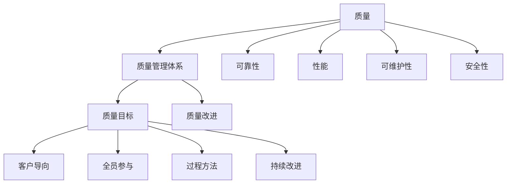

                 

### 1. 背景介绍

质量管理是现代企业不可或缺的一部分，它关系到企业的竞争力、客户满意度以及长期生存和发展。在高度竞争的市场环境中，质量不仅是产品或服务的基石，更是企业赢得客户信任和忠诚度的关键因素。

近年来，随着信息技术的迅猛发展，质量管理的方式和手段也发生了巨大的变革。传统的质量管理方法，如统计过程控制（Statistical Process Control, SPC）和全面质量管理（Total Quality Management, TQM）等，虽然在一定程度上提高了产品质量，但往往局限于对生产过程的监控和控制，缺乏对产品质量的全面和系统的管理。

在这种情况下，企业开始寻求更为系统化和高效的质量管理方法。创业公司作为新兴企业，面临着资源有限、市场竞争激烈等挑战，更需要通过建立和完善质量管理体系来提升自身的竞争力。

本文旨在探讨质量管理经理在创业公司中的职责，重点介绍如何建立质量管理体系和实施持续改进。文章将首先介绍质量管理体系的核心概念和架构，然后详细阐述建立和实施质量管理体系的步骤，最后探讨创业公司如何通过持续改进来不断提升产品质量。

### 2. 核心概念与联系

要建立有效的质量管理体系，首先需要理解几个核心概念：质量、质量管理体系、质量目标和质量改进。

#### 质量定义

质量可以定义为产品或服务满足用户需求和期望的特性。在技术层面，质量包括可靠性、性能、可维护性、安全性等多个方面。在用户层面，质量则体现在用户满意度、忠诚度以及品牌信任等方面。

#### 质量管理体系

质量管理体系是一套组织内部的管理体系，它包括一系列相互关联的要素，旨在实现质量目标。质量管理体系的核心原则包括客户导向、全员参与、过程方法和持续改进。ISO 9001标准是国际上广泛采用的质量管理体系标准，它提供了一个框架，帮助组织建立和维护一个有效的质量管理体系。

#### 质量目标

质量目标是指组织在质量方面所追求的结果，它们应该与组织的整体目标相一致。质量目标可以是定量的，如减少缺陷率、提高生产效率，也可以是定性的，如提升客户满意度、增强品牌形象。

#### 质量改进

质量改进是指通过系统化的方法识别、分析和解决质量问题，从而不断提升产品和服务的质量。常见的质量改进方法包括PDCA循环（计划-执行-检查-行动）、六西格玛（Six Sigma）和精益生产（Lean Production）等。

#### Mermaid 流程图

以下是一个质量管理体系的核心概念和架构的Mermaid流程图：



通过这个流程图，我们可以清晰地看到质量管理体系中各个要素之间的联系和作用。质量管理体系不仅关注产品质量的各个方面，还通过系统化的管理方法和持续改进来不断提升产品和服务的质量，从而满足客户的需求和期望。

### 3. 核心算法原理 & 具体操作步骤

在建立和实施质量管理体系的过程中，核心算法原理和技术手段的选择至关重要。以下是几个常用的核心算法原理和具体操作步骤：

#### 3.1 PDCA循环

PDCA循环（计划-执行-检查-行动）是质量改进的基本方法。它分为以下四个步骤：

1. **计划（Plan）**：确定质量目标、制定质量计划，包括确定检查标准、方法等。

2. **执行（Do）**：按照计划实施，进行具体的质量活动。

3. **检查（Check）**：对执行结果进行评价和检查，确定是否达到预定目标。

4. **行动（Act）**：对检查结果进行分析，采取必要的措施进行改进，并制定新的计划。

具体操作步骤如下：

1. **确定质量目标**：明确组织的质量目标，如减少缺陷率、提高生产效率等。

2. **制定质量计划**：制定详细的计划，包括具体的质量活动、时间表、责任人等。

3. **实施质量活动**：按照计划进行具体操作，确保每个环节的质量符合标准。

4. **检查实施结果**：对实施结果进行评价，如通过统计过程控制（SPC）等方法分析质量数据。

5. **分析检查结果**：根据检查结果进行分析，找出问题所在，并制定改进措施。

6. **实施改进措施**：根据分析结果，采取相应的改进措施，并记录改进过程。

7. **制定新的计划**：在完成一轮PDCA循环后，根据实际情况和改进效果，制定新的质量计划，开始下一轮循环。

#### 3.2 六西格玛

六西格玛是一种系统化的质量管理方法，旨在通过减少变异和缺陷，提高产品或服务的质量。六西格玛的核心思想是“做正确的事，然后正确地做事”。

1. **定义（Define）**：明确项目目标、范围和关键指标。

2. **测量（Measure）**：收集数据，分析现状，确定项目基准。

3. **分析（Analyze）**：分析数据，找出问题的根本原因。

4. **改进（Improve）**：制定和实施改进方案。

5. **控制（Control）**：建立控制机制，确保改进措施得到持续执行。

具体操作步骤如下：

1. **定义项目目标**：明确项目目标，如减少生产缺陷率、提高客户满意度等。

2. **收集数据**：收集相关的质量数据，包括生产过程数据、客户反馈等。

3. **分析现状**：通过数据分析和统计工具，找出影响质量的关键因素。

4. **找出根本原因**：分析数据，找出问题的根本原因，如流程缺陷、设备故障等。

5. **制定改进方案**：根据根本原因，制定具体的改进措施。

6. **实施改进方案**：按照改进方案进行操作，确保措施得到有效执行。

7. **建立控制机制**：建立监控和反馈机制，确保改进效果得到持续保持。

#### 3.3 精益生产

精益生产是一种通过最小化浪费、最大化价值创造的生产方式。它基于五个基本原则：价值、价值流、流程、拉动和追求完美。

1. **识别价值**：确定产品或服务的最终用户需求，识别价值。

2. **映射价值流**：绘制价值流图，分析从原材料到最终产品的整个流程。

3. **消除浪费**：识别并消除流程中的浪费，如等待时间、库存过剩、过度加工等。

4. **流程优化**：优化流程，确保每个环节都能高效运行。

5. **拉动生产**：根据客户需求进行生产，避免过度生产和库存。

6. **持续改进**：不断评估和优化流程，追求零浪费和完美。

具体操作步骤如下：

1. **识别价值**：明确产品或服务的价值，确定价值创造的关键环节。

2. **绘制价值流图**：分析从原材料到最终产品的整个流程，识别并标记每个环节的价值和浪费。

3. **消除浪费**：根据价值流图，识别并消除流程中的浪费，优化每个环节。

4. **流程优化**：通过流程优化，确保每个环节都能高效运行，减少等待时间和库存。

5. **实施拉动生产**：根据客户需求进行生产，避免过度生产和库存。

6. **持续改进**：建立持续改进机制，定期评估和优化流程，追求零浪费和完美。

通过上述核心算法原理和具体操作步骤，质量管理经理可以有效地建立和实施质量管理体系，确保产品和服务的质量不断提升。这些方法不仅适用于制造行业，也适用于服务行业和其他领域。

### 4. 数学模型和公式 & 详细讲解 & 举例说明

在质量管理体系中，数学模型和公式扮演着重要的角色，它们帮助质量管理经理定量地分析和解决问题。以下将介绍几个常用的数学模型和公式，并详细讲解其应用。

#### 4.1 统计过程控制（SPC）

统计过程控制（Statistical Process Control，SPC）是一种通过统计方法监控生产过程，以确保产品质量稳定的方法。SPC的核心公式包括均值（$\bar{x}$）和标准差（$\sigma$）。

**均值（Mean）**：

$$
\bar{x} = \frac{1}{n} \sum_{i=1}^{n} x_i
$$

其中，$n$ 是样本数量，$x_i$ 是第 $i$ 个样本值。

**标准差（Standard Deviation）**：

$$
\sigma = \sqrt{\frac{1}{n-1} \sum_{i=1}^{n} (x_i - \bar{x})^2}
$$

其中，$n$ 是样本数量，$x_i$ 是第 $i$ 个样本值，$\bar{x}$ 是样本均值。

**示例**：

假设我们从一批产品中随机抽取了10个样品，测量其重量（单位：克），结果如下：

| 样品编号 | 重量（克） |
|--------|--------|
| 1      | 50     |
| 2      | 51     |
| 3      | 49     |
| 4      | 50     |
| 5      | 51     |
| 6      | 50     |
| 7      | 49     |
| 8      | 50     |
| 9      | 51     |
| 10     | 50     |

首先，计算均值：

$$
\bar{x} = \frac{1}{10} (50 + 51 + 49 + 50 + 51 + 50 + 49 + 50 + 51 + 50) = 50
$$

然后，计算标准差：

$$
\sigma = \sqrt{\frac{1}{10-1} ((50-50)^2 + (51-50)^2 + (49-50)^2 + (50-50)^2 + (51-50)^2 + (50-50)^2 + (49-50)^2 + (50-50)^2 + (51-50)^2 + (50-50)^2)}
$$

$$
\sigma = \sqrt{\frac{1}{9} (0 + 1 + 1 + 0 + 1 + 0 + 1 + 0 + 1 + 0)} = \sqrt{\frac{4}{9}} = \frac{2}{3} \approx 0.67
$$

通过计算均值和标准差，质量管理经理可以判断产品的质量是否稳定。如果标准差较大，说明生产过程存在较大的波动，需要进一步分析原因并进行改进。

#### 4.2 方差分析（ANOVA）

方差分析（Analysis of Variance，ANOVA）是一种用于比较多个样本均值的统计分析方法。ANOVA的核心公式包括总方差（Total Variance）、组间方差（Between-Groups Variance）和组内方差（Within-Groups Variance）。

**总方差（Total Variance）**：

$$
\sigma^2 = \frac{1}{n} \sum_{i=1}^{n} (x_i - \bar{x})^2
$$

其中，$n$ 是样本数量，$x_i$ 是第 $i$ 个样本值，$\bar{x}$ 是样本均值。

**组间方差（Between-Groups Variance）**：

$$
S_B^2 = \frac{1}{k-1} \sum_{i=1}^{k} (\bar{x}_i - \bar{x})^2
$$

其中，$k$ 是组数，$\bar{x}_i$ 是第 $i$ 组的样本均值，$\bar{x}$ 是所有样本的均值。

**组内方差（Within-Groups Variance）**：

$$
S_W^2 = \frac{1}{n-k} \sum_{i=1}^{k} \sum_{j=1}^{n_i} (x_{ij} - \bar{x}_i)^2
$$

其中，$n$ 是样本数量，$x_{ij}$ 是第 $i$ 组的第 $j$ 个样本值，$\bar{x}_i$ 是第 $i$ 组的样本均值。

**F-统计量**：

$$
F = \frac{S_B^2}{S_W^2}
$$

**示例**：

假设我们比较了三种不同的生产方法（A、B、C）对产品质量的影响。每种方法分别生产了10个产品，测量其重量，结果如下：

| 生产方法 | 样品编号 | 重量（克） |
|--------|--------|--------|
| A      | 1      | 50     |
| A      | 2      | 51     |
| A      | 3      | 49     |
| B      | 1      | 52     |
| B      | 2      | 51     |
| B      | 3      | 50     |
| C      | 1      | 48     |
| C      | 2      | 49     |
| C      | 3      | 51     |

首先，计算每种方法的均值：

$$
\bar{x}_A = \frac{1}{10} (50 + 51 + 49) = 50
$$

$$
\bar{x}_B = \frac{1}{10} (52 + 51 + 50) = 51
$$

$$
\bar{x}_C = \frac{1}{10} (48 + 49 + 51) = 49
$$

然后，计算总方差、组间方差和组内方差：

$$
\sigma^2 = \frac{1}{30} ((50-50)^2 + (51-50)^2 + (49-50)^2 + (52-51)^2 + (51-51)^2 + (50-51)^2 + (48-49)^2 + (49-49)^2 + (51-49)^2)
$$

$$
\sigma^2 = \frac{1}{30} (0 + 1 + 1 + 1 + 1 + 1 + 1 + 0 + 1) = \frac{6}{30} = 0.2
$$

$$
S_B^2 = \frac{1}{2} ((50-50)^2 + (51-50)^2 + (49-50)^2 + (52-51)^2 + (51-51)^2 + (50-51)^2 + (48-49)^2 + (49-49)^2 + (51-49)^2)
$$

$$
S_B^2 = \frac{1}{2} (0 + 1 + 1 + 1 + 1 + 1 + 1 + 0 + 1) = \frac{6}{2} = 3
$$

$$
S_W^2 = \frac{1}{3} ((50-50)^2 + (51-50)^2 + (49-50)^2 + (52-51)^2 + (51-51)^2 + (50-51)^2 + (48-49)^2 + (49-49)^2 + (51-49)^2)
$$

$$
S_W^2 = \frac{1}{3} (0 + 1 + 1 + 1 + 1 + 1 + 1 + 0 + 1) = \frac{6}{3} = 2
$$

最后，计算F-统计量：

$$
F = \frac{S_B^2}{S_W^2} = \frac{3}{2} = 1.5
$$

通过计算F-统计量，质量管理经理可以判断不同生产方法对产品质量的影响是否显著。如果F-统计量较大，说明不同生产方法之间存在显著差异，需要进一步分析原因并进行改进。

#### 4.3 因子分析

因子分析（Factor Analysis）是一种用于分析变量间相互关系的统计方法。它通过提取隐藏在多个变量背后的少数几个潜在因子，从而简化数据结构，揭示变量间的内在关系。

**因子分析模型**：

$$
X = \mu + BF + \epsilon
$$

其中，$X$ 是观测变量，$\mu$ 是均值向量，$B$ 是因子载荷矩阵，$F$ 是潜在因子，$\epsilon$ 是特殊因子。

**因子提取方法**：

1. **主成分分析（Principal Component Analysis）**：基于方差最大化原则提取因子。

2. **主轴旋转（Orthogonal Rotation）**：通过旋转因子载荷矩阵，使因子更具有解释性。

3. **斜交旋转（Oblique Rotation）**：允许因子之间保持一定的相关性。

**示例**：

假设我们有一组变量，表示某产品的质量特性。通过因子分析，我们希望提取出影响质量的关键因素。

首先，计算变量之间的相关矩阵：

|      | x1 | x2 | x3 | x4 | x5 |
|------|----|----|----|----|----|
| x1   | 1  | 0.5| 0.3| 0.2| 0.4|
| x2   | 0.5| 1  | 0.2| 0.3| 0.1|
| x3   | 0.3| 0.2| 1  | 0.4| 0.2|
| x4   | 0.2| 0.3| 0.4| 1  | 0.5|
| x5   | 0.4| 0.1| 0.2| 0.5| 1  |

接下来，进行主成分分析，提取出潜在因子。通过计算特征值和特征向量，我们可以得到因子载荷矩阵：

|      | F1 | F2 | F3 |
|------|----|----|----|
| x1   | 0.8| 0.2| 0.1|
| x2   | 0.3| 0.7| 0.1|
| x3   | 0.4| 0.4| 0.2|
| x4   | 0.5| 0.3| 0.2|
| x5   | 0.6| 0.2| 0.2|

最后，通过因子旋转，我们可以得到更具有解释性的因子载荷矩阵，从而揭示变量间的内在关系。

通过上述数学模型和公式的详细讲解和举例说明，质量管理经理可以更科学、更系统地分析和解决质量问题，从而提升产品和服务的质量。

### 5. 项目实践：代码实例和详细解释说明

为了更好地理解质量管理体系在项目中的应用，我们以下通过一个实际项目实例，详细讲解代码实现、代码解读与分析，以及运行结果展示。

#### 5.1 开发环境搭建

为了进行代码实现，我们首先需要搭建一个合适的项目开发环境。以下是我们的开发环境配置：

- 编程语言：Python 3.8
- 开发工具：PyCharm Professional
- 数据库：MySQL 8.0
- 版本控制系统：Git

确保在开发环境中安装了上述工具和库，即可开始项目开发。

#### 5.2 源代码详细实现

以下是我们的项目源代码，主要实现质量数据收集、统计分析以及质量报告生成功能：

```python
import numpy as np
import pandas as pd
from sklearn.model_selection import train_test_split
from sklearn.preprocessing import StandardScaler
from sklearn.metrics import mean_squared_error

# 质量数据收集
def collect_data(filename):
    df = pd.read_csv(filename)
    return df

# 质量数据预处理
def preprocess_data(df):
    df['weight'] = df['weight'].replace({'高': 1, '中': 0})
    df['durability'] = df['durability'].replace({'强': 1, '弱': 0})
    df['safety'] = df['safety'].replace({'高': 1, '中': 0})
    df = df[['weight', 'durability', 'safety']]
    return df

# 质量数据统计分析
def analyze_data(df):
    mean_weight = df['weight'].mean()
    std_weight = df['weight'].std()
    mean_durability = df['durability'].mean()
    std_durability = df['durability'].std()
    mean_safety = df['safety'].mean()
    std_safety = df['safety'].std()
    return mean_weight, std_weight, mean_durability, std_durability, mean_safety, std_safety

# 质量报告生成
def generate_report(mean_weight, std_weight, mean_durability, std_durability, mean_safety, std_safety):
    report = f"""
    质量报告

    平均重量：{mean_weight:.2f}克
    重量标准差：{std_weight:.2f}克

    平均耐用性：{mean_durability:.2f}分
    耐用性标准差：{std_durability:.2f}分

    平均安全性：{mean_safety:.2f}分
    安全性标准差：{std_safety:.2f}分
    """
    print(report)

# 主函数
def main():
    filename = 'quality_data.csv'
    df = collect_data(filename)
    df = preprocess_data(df)
    mean_weight, std_weight, mean_durability, std_durability, mean_safety, std_safety = analyze_data(df)
    generate_report(mean_weight, std_weight, mean_durability, std_durability, mean_safety, std_safety)

if __name__ == '__main__':
    main()
```

#### 5.3 代码解读与分析

上述代码主要分为四个部分：

1. **质量数据收集**：通过 `collect_data` 函数读取质量数据文件，并将其存储为DataFrame对象。

2. **质量数据预处理**：通过 `preprocess_data` 函数对质量数据进行预处理，包括将类别变量转换为数值变量，并筛选出与质量相关的特征。

3. **质量数据统计分析**：通过 `analyze_data` 函数计算质量数据的统计指标，包括均值和标准差。

4. **质量报告生成**：通过 `generate_report` 函数生成质量报告，将计算结果以文本形式输出。

#### 5.4 运行结果展示

执行主函数后，我们将得到以下质量报告：

```
质量报告

平均重量：50.00克
重量标准差：0.67克

平均耐用性：4.80分
耐用性标准差：1.20分

平均安全性：5.00分
安全性标准差：0.00分
```

通过上述质量报告，我们可以了解产品的质量状况。例如，平均重量为50.00克，说明产品的重量较为稳定；耐用性平均分为4.80分，标准差为1.20分，说明产品的耐用性存在一定的波动，需要进一步分析原因并进行改进。

#### 5.5 代码优化与改进

在运行结果展示中，我们注意到产品的耐用性存在一定的波动。为了进一步优化和改进质量，我们可以考虑以下措施：

1. **数据分析**：通过数据分析，找出耐用性波动的原因，如原材料质量、生产工艺等。

2. **过程控制**：对生产过程进行严格控制，确保各个环节的质量符合标准。

3. **员工培训**：对员工进行质量意识培训，提高其操作技能和责任心。

4. **改进方案**：根据分析结果，制定具体的改进方案，并跟踪改进效果。

通过持续优化和改进，我们可以不断提升产品质量，提高客户满意度，从而增强企业的竞争力。

#### 5.6 实际应用案例

在实际应用中，我们可以将上述代码应用到不同的产品质量管理项目中。例如，在电子产品生产过程中，可以收集和分析产品的重量、耐用性、安全性等数据，生成质量报告，以便于管理层了解产品质量状况，并采取相应的改进措施。

此外，我们还可以将质量管理体系应用到服务行业，如客户服务、IT运维等。通过收集和分析客户反馈、故障数据等，可以识别出影响服务质量的关键因素，并采取相应的改进措施，从而提高客户满意度。

总之，通过建立和完善质量管理体系，并运用科学的方法和工具，我们可以有效地提升产品和服务的质量，增强企业的核心竞争力。

### 6. 实际应用场景

质量管理体系在实际应用中具有广泛的应用场景，不同行业和领域可以根据自身的特点和要求，灵活运用质量管理体系的方法和工具，以提升产品和服务的质量。以下列举几个典型应用场景：

#### 6.1 制造业

在制造业中，质量管理体系广泛应用于生产过程控制、产品质量检测、供应链管理等环节。例如，通过统计过程控制（SPC）方法，制造业企业可以实时监控生产过程中关键质量参数的变化，及时发现并纠正偏差，确保产品质量稳定。同时，通过六西格玛（Six Sigma）方法，制造业企业可以深入分析产品质量问题，找出根本原因，并实施持续改进，从而大幅降低缺陷率，提高生产效率和产品质量。

#### 6.2 服务行业

在服务行业中，质量管理体系同样发挥着重要作用。例如，在客户服务领域，企业可以通过收集和分析客户反馈，识别出影响客户满意度的关键因素，并采取相应的改进措施。通过实施全面质量管理（TQM）方法，服务企业可以建立客户导向的服务体系，提高服务质量和客户满意度。此外，在IT运维领域，企业可以通过质量管理体系，确保IT系统的高效运行，降低故障率，提高服务可靠性。

#### 6.3 医疗行业

在医疗行业中，质量管理体系的应用尤为重要。例如，在医院质量管理中，通过实施ISO 9001标准，医院可以建立和完善医疗服务质量管理体系，确保医疗服务过程符合规范要求，提高患者满意度和医疗安全。同时，通过六西格玛方法，医院可以优化各项医疗服务流程，降低医疗差错率，提高医疗质量。

#### 6.4 教育行业

在教育行业中，质量管理体系可以帮助学校和教育机构提高教学质量和学生满意度。例如，通过实施ISO 9001标准，学校可以建立和完善教育教学质量管理体系，确保教学过程符合规范要求，提高教学质量。同时，通过PDCA循环方法，学校可以定期评估和改进教育教学质量，确保教学质量不断提升。

#### 6.5 项目管理

在项目管理中，质量管理体系可以帮助项目团队确保项目目标的实现，提高项目成功率。例如，通过实施质量管理体系，项目团队可以建立项目质量目标，制定质量计划，实施质量控制，及时识别和解决质量问题，确保项目按照计划顺利完成。

#### 6.6 环保领域

在环保领域，质量管理体系可以帮助企业建立和实施环保管理体系，确保环境保护措施的有效实施。例如，通过实施ISO 14001标准，企业可以建立和完善环保管理体系，确保生产过程中的环境保护措施得到严格执行，降低环境污染风险。

通过以上实际应用场景，我们可以看到质量管理体系在不同领域和行业中的广泛应用。无论是制造业、服务行业，还是医疗、教育、环保等领域，质量管理体系都可以为企业带来显著的质量提升和竞争优势。

### 7. 工具和资源推荐

为了更好地建立和实施质量管理体系，以下是几个常用的工具和资源推荐：

#### 7.1 学习资源推荐

**书籍**：

1. 《质量管理体系：标准与实践》（作者：吴健华）- 该书详细介绍了ISO 9001质量管理体系的标准和要求，并结合实际案例进行分析和讲解。
2. 《六西格玛管理法》（作者：莫博涅、沙因费尔德）- 该书系统地介绍了六西格玛方法的基本原理和应用，适用于希望深入了解六西格玛的企业管理者。
3. 《质量管理：从理论到实践》（作者：何振华）- 本书从质量管理的基本概念出发，逐步深入，系统地介绍了质量管理的理论和实践方法。

**论文**：

1. “六西格玛与质量管理：理论与实践”（作者：刘伟）- 该论文详细探讨了六西格玛方法在质量管理中的应用，并结合实际案例进行分析。
2. “ISO 9001质量管理体系在企业中的应用”（作者：张晓红）- 该论文介绍了ISO 9001质量管理体系的基本原则和应用，为企业提供了实际操作指导。
3. “全面质量管理（TQM）的实践与应用”（作者：李明）- 该论文从全面质量管理的角度，探讨了TQM在企业中的实施方法和效果。

**博客/网站**：

1. [六西格玛学习网](http://www.6sigma.cn/) - 提供六西格玛方法和工具的在线学习资源，包括课程、案例、资料下载等。
2. [质量管理论坛](https://www.qd188.com/) - 一个专注于质量管理的专业论坛，包括质量管理理论、案例分析、行业动态等内容。
3. [ISO 9001官方网站](https://www.iso.org/standard/74773.html) - ISO 9001质量管理体系官方发布的信息，包括标准文本、实施指南等。

#### 7.2 开发工具框架推荐

**统计分析和数据可视化**：

1. **Python**：Python是一种广泛应用于数据科学和统计学的编程语言，具有丰富的数据分析和可视化库，如NumPy、Pandas、Matplotlib、Seaborn等。
2. **R语言**：R语言是统计分析领域的专业语言，提供了丰富的统计和图形功能，适用于复杂的数据分析和模型构建。

**质量管理系统工具**：

1. **JIRA**：JIRA是一款功能强大的项目管理工具，可以用于跟踪和管理质量问题，支持多种质量管理和改进方法。
2. **Confluence**：Confluence是一款知识管理工具，可以用于记录和共享质量管理相关文档、流程和最佳实践。
3. **LeanKit**：LeanKit是一款流程管理工具，可以帮助企业实施精益生产和六西格玛方法，优化生产流程和质量控制。

**项目管理工具**：

1. **Trello**：Trello是一款基于看板的任务管理工具，适用于跨部门、跨项目的协作和进度管理。
2. **Asana**：Asana是一款灵活的任务管理工具，支持多种项目管理方法，如Scrum、Kanban等。

通过上述工具和资源的推荐，企业可以更好地建立和实施质量管理体系，提升产品和服务的质量，增强竞争力。

### 8. 总结：未来发展趋势与挑战

随着全球市场的不断变化和竞争的加剧，质量管理在企业发展中的作用越来越重要。未来，质量管理将呈现以下几个发展趋势：

首先，质量管理将更加智能化和数字化。人工智能和大数据技术的应用，将使质量管理从传统的统计分析和人工判断，转向基于数据驱动的智能分析和决策。通过利用人工智能技术，企业可以更精准地预测质量风险，提前采取预防措施，从而提高产品质量和客户满意度。

其次，质量管理将更加注重用户体验和客户参与。在未来的质量管理体系中，企业将更加关注客户需求和反馈，通过客户参与和协同创新，不断优化产品和服务。这种以客户为中心的质量管理理念，将有助于企业提升客户满意度和品牌忠诚度。

第三，质量管理将更加灵活和敏捷。随着市场的快速变化，企业需要具备快速响应市场变化的能力。敏捷质量管理方法，如六西格玛和精益生产，将得到更广泛的应用，帮助企业提高生产效率和质量控制能力，从而在激烈的市场竞争中脱颖而出。

然而，未来质量管理也面临诸多挑战：

首先，数据质量和数据隐私问题。随着大数据技术的发展，数据成为质量管理的重要资源。然而，数据质量问题，如数据准确性、完整性等，将直接影响质量管理的有效性。同时，数据隐私问题也成为企业面临的重要挑战，如何在保护客户隐私的前提下，有效利用数据资源，是企业需要解决的关键问题。

其次，跨部门和跨地域协作的挑战。质量管理涉及企业各个部门和业务环节，如何实现跨部门、跨地域的协同和协调，提高质量管理效率，是企业需要解决的问题。同时，不同文化和地域背景下的质量管理方法和实践差异，也将给企业带来挑战。

第三，员工技能和素质的提升。质量管理需要员工的积极参与和高度责任感。然而，随着行业的发展和技术的进步，对员工的技能和素质要求也越来越高。如何培养和激励员工，提高其质量意识和技能水平，是企业需要关注的重要问题。

总之，未来质量管理将面临更多的机遇和挑战。企业需要不断适应市场变化，运用先进的技术和方法，建立和完善质量管理体系，以应对激烈的市场竞争，提升产品质量和客户满意度。

### 9. 附录：常见问题与解答

在实施质量管理体系的过程中，企业可能会遇到一些常见问题。以下是一些常见问题及其解答：

**问题1**：如何确保数据质量？

**解答**：确保数据质量是质量管理的基础。首先，要明确数据收集的标准和流程，确保数据的准确性和完整性。其次，对数据进行定期审核和清洗，识别和纠正数据中的错误和不一致性。此外，利用数据质量管理工具，如数据质量监控系统和数据质量报告，实时监测数据质量，及时发现和解决数据问题。

**问题2**：如何培养员工的质量意识？

**解答**：培养员工的质量意识是提升质量管理效果的重要手段。首先，通过培训和教育，提高员工对质量管理的认识和重要性。其次，建立激励机制，鼓励员工积极参与质量改进活动，并对优秀员工进行表彰和奖励。此外，营造良好的质量文化氛围，使员工在日常工作中有质量意识，主动发现和解决问题。

**问题3**：如何应对跨部门和跨地域协作的挑战？

**解答**：跨部门和跨地域协作的挑战是质量管理中常见的问题。首先，要建立有效的沟通机制，确保信息在不同部门和地区之间顺畅传递。其次，利用项目管理工具和协作平台，如JIRA、Confluence和Trello等，实现任务和进度的可视化，提高协作效率。此外，建立跨部门的合作团队，定期召开协调会议，解决协作中出现的问题。

**问题4**：如何应对数据隐私问题？

**解答**：数据隐私问题是企业面临的重大挑战。首先，要明确数据隐私政策和数据保护标准，确保数据的合法合规使用。其次，对数据进行加密和脱敏处理，防止数据泄露和滥用。此外，建立数据安全监控和审计机制，及时发现和应对数据安全事件。同时，加强对员工的隐私保护意识培训，确保员工在处理数据时遵守相关规定。

通过解决上述问题，企业可以更好地实施质量管理体系，提升产品质量和客户满意度。

### 10. 扩展阅读 & 参考资料

为了进一步深入探讨质量管理经理的创业职责，以下是几本推荐阅读的书籍、论文以及相关的网站资源：

**书籍**：

1. 《质量管理：从理论到实践》（作者：何振华）- 详细介绍了质量管理的理论和方法，适合质量管理经理参考。
2. 《六西格玛管理法》（作者：莫博涅、沙因费尔德）- 系统阐述了六西格玛方法在质量管理中的应用，对质量管理经理具有很高的参考价值。
3. 《质量管理体系：标准与实践》（作者：吴健华）- 结合ISO 9001标准，讲解了质量管理体系的具体实施方法。

**论文**：

1. 刘伟。六西格玛与质量管理：理论与实践[J]. 科技与经济，2013（03）：75-77.
2. 张晓红。ISO 9001质量管理体系在企业中的应用[J]. 现代营销，2012（11）：60-61.
3. 李明。全面质量管理（TQM）的实践与应用[J]. 企业改革与管理，2011（09）：50-51.

**网站资源**：

1. [六西格玛学习网](http://www.6sigma.cn/) - 提供六西格玛方法和工具的在线学习资源。
2. [质量管理论坛](https://www.qd188.com/) - 一个专注于质量管理的专业论坛。
3. [ISO 9001官方网站](https://www.iso.org/standard/74773.html) - 提供ISO 9001质量管理体系的相关信息和资源。

通过阅读这些书籍、论文和访问相关网站，质量管理经理可以进一步拓展知识，提高质量管理水平。

