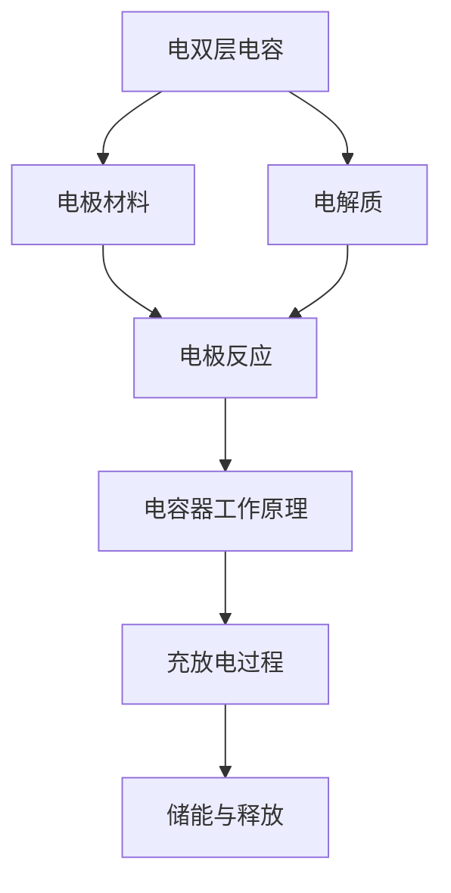

                 

### 背景介绍

#### 能源存储的重要性

能源存储是现代能源系统中的一个关键组成部分。随着全球能源需求的不断增长，尤其是可再生能源（如太阳能和风能）的快速发展，高效的能源存储技术变得尤为重要。能源存储技术不仅能够解决可再生能源发电的不稳定性问题，还能为电力系统提供即时响应能力，优化能源分配和降低能源成本。

#### 传统能源存储技术

传统的能源存储技术主要包括蓄电池和化石燃料。蓄电池技术经过多年的发展，已经成为电力系统中的重要组成部分。然而，蓄电池存在能量密度较低、充放电寿命有限等问题。例如，锂离子电池虽然具有高能量密度和较好的循环性能，但其充放电速度较慢，且成本较高。化石燃料虽然能量密度高，但燃烧过程中会产生大量污染物和温室气体，不利于环境保护和可持续发展。

#### 超级电容器：一种新的能源存储技术

超级电容器（Supercapacitors），也称为电容器电容器，是一种新型的能源存储设备。与传统电容器相比，超级电容器具有高能量密度、高功率密度、快速充放电和长寿命等优点。这些特性使得超级电容器在能源存储领域具有巨大的应用潜力。

超级电容器的原理基于其独特的电双层结构。当电容器两极板之间施加电压时，正负电荷分别积累在两极板的表面，形成所谓的“电双层”。这种电双层结构具有非常高的表面积，从而可以存储大量的电荷。与传统的电解质电容器不同，超级电容器使用有机电解质或高分子电解质，这使得其具有更高的电导率和更好的热稳定性。

#### 超级电容器的应用领域

超级电容器在多个领域展现出巨大的应用潜力，以下是其中几个关键应用领域：

1. **电动汽车和储能系统**：超级电容器的高功率密度和快速充放电能力使其成为电动汽车动力系统的理想补充。超级电容器可以快速为电动汽车提供动力，提高车辆的加速性能，同时还可以延长电池的使用寿命。

2. **可再生能源集成**：超级电容器可以平滑可再生能源发电的不稳定性，提高电网的稳定性和可靠性。例如，超级电容器可以快速响应太阳能和风能发电的波动，为电网提供即时响应能力。

3. **工业和制造业**：超级电容器广泛应用于各种工业和制造过程，如电力电子设备、伺服系统、电机驱动等。其快速充放电能力和长寿命使得超级电容器成为这些应用场景中的理想选择。

4. **消费电子**：超级电容器在消费电子产品中也有广泛的应用，如智能手机、笔记本电脑的快速充电，以及各种便携式电子设备的备用电源等。

#### 当前超级电容器技术的发展现状

尽管超级电容器具有诸多优点，但目前其技术仍面临一些挑战。主要问题包括：

1. **能量密度**：目前超级电容器的能量密度仍远低于传统的蓄电池，这限制了其在某些应用领域的使用。

2. **成本**：超级电容器的主要材料，如电极材料和高分子电解质，价格较高，限制了其大规模应用。

3. **寿命**：虽然超级电容器的充放电循环寿命较长，但与蓄电池相比，仍有一定差距。

为了克服这些挑战，研究人员正在积极探索新的电极材料、电解质和制造工艺，以提高超级电容器的能量密度、降低成本并延长使用寿命。

#### 本文的目的

本文旨在深入探讨超级电容器在能源存储中的应用，分析其核心原理、具体操作步骤、数学模型和实际应用案例。通过本文，读者将全面了解超级电容器的优势和应用场景，并对其未来的发展趋势有更清晰的认识。

综上所述，超级电容器作为一种新型的能源存储技术，具有广泛的应用前景。在接下来的章节中，我们将详细探讨超级电容器的核心原理、具体操作步骤和数学模型，并通过实际应用案例来展示其在能源存储领域的重要性。同时，我们也将分析当前超级电容器技术面临的主要挑战，并探讨未来可能的发展方向。### 核心概念与联系

为了深入理解超级电容器在能源存储中的应用，我们需要首先掌握几个关键的核心概念，并探讨它们之间的相互关系。以下是本文涉及的主要核心概念及其关联流程：

#### 超级电容器的核心概念

1. **电双层电容**：
   超级电容器的储能原理主要基于电双层电容。当电容器两极板之间施加电压时，正负电荷分别积累在两极板的表面，形成所谓的“电双层”。电双层电容具有较高的电荷存储能力和快速充放电特性。

2. **电极材料**：
   超级电容器的性能在很大程度上取决于电极材料的性质。常见的电极材料包括碳材料（如活性炭、石墨烯）、金属氧化物（如RuO2、MnO2）和导电聚合物等。这些材料通常具有高表面积、良好的电化学稳定性和优异的电导率。

3. **电解质**：
   电解质是超级电容器中的介质，负责分离电极板上的正负电荷，并提供电荷传输通道。常用的电解质包括有机电解质、离子液体和高分子电解质等。电解质的选择直接影响超级电容器的电导率、能量密度和寿命。

4. **电容器的工作原理**：
   超级电容器在充放电过程中，通过电双层电容和电极反应实现电荷的存储和释放。在充电过程中，电场作用下，正负电荷在电极表面形成电双层，存储电能；在放电过程中，电双层中的电荷通过外部电路释放，驱动负载工作。

#### 核心概念之间的关联流程

为了更好地理解超级电容器的核心概念及其工作原理，我们可以使用Mermaid流程图来展示它们之间的关联流程。以下是一个简化的Mermaid流程图示例，展示了超级电容器的主要组成部分及其相互关系：



**流程图解析：**

1. **电双层电容（A）**：
   超级电容器的基础储能原理，由电极表面的电荷分布形成。

2. **电极材料（B）**：
   电双层电容的重要组成部分，直接影响超级电容器的电化学性能。

3. **电解质（C）**：
   分离电极板上的正负电荷，提供电荷传输通道，影响电导率和性能。

4. **电极反应（D）**：
   电双层电容和电解质的共同作用，通过电化学反应实现电荷的存储和释放。

5. **电容器工作原理（E）**：
   电双层电容和电极反应的综合体现，描述了超级电容器在充放电过程中的工作原理。

6. **充放电过程（F）**：
   超级电容器通过电双层电容和电极反应实现电能的存储和释放。

7. **储能与释放（G）**：
   充放电过程的最终目的，描述了超级电容器如何将电能储存和释放给外部负载。

通过上述核心概念的关联流程，我们可以清晰地看到超级电容器的工作原理及其关键组成部分。接下来，我们将进一步探讨这些概念的具体实现和应用。

#### 超级电容器的核心算法原理 & 具体操作步骤

在了解超级电容器的核心概念和关联流程后，接下来我们将详细探讨其核心算法原理和具体操作步骤。超级电容器的核心算法主要涉及充电、放电和功率控制三个关键环节。以下是一个简化的步骤说明：

##### 1. 充电过程

**充电原理：**
充电过程是通过外部电源给超级电容器提供电能，使其电极表面形成电双层电容。

**操作步骤：**
1. **连接电源：** 将外部电源的正极连接到超级电容器的正极板，负极连接到负极板。
2. **施加电压：** 通过电源施加一定的电压，使电场作用在电极表面，形成电双层。
3. **电荷积累：** 随着电压的施加，正负电荷分别积累在电极表面，形成高电荷密度的电双层电容。
4. **监测电压：** 在充电过程中，持续监测电容器的电压，以确保不超过电容器的额定电压范围。

**充电算法：**
- **恒流充电法：** 在充电初期，以恒定的电流充电，提高充电效率。
- **恒压充电法：** 在充电后期，以恒定的电压充电，避免过充。

##### 2. 放电过程

**放电原理：**
放电过程是通过外部电路将超级电容器中的电荷释放，驱动外部负载工作。

**操作步骤：**
1. **连接负载：** 将超级电容器的正极连接到负载的正极，负极连接到负载的负极。
2. **断开电源：** 断开与外部电源的连接，使电容器开始放电。
3. **电荷释放：** 电容器中的电荷通过外部电路释放，驱动负载工作。
4. **监测电流：** 在放电过程中，持续监测电路中的电流，确保电流在安全范围内。

**放电算法：**
- **恒流放电法：** 以恒定的电流放电，适用于需要稳定电流的负载。
- **恒压放电法：** 以恒定的电压放电，适用于需要稳定电压的负载。

##### 3. 功率控制

**功率控制原理：**
功率控制是调节超级电容器输出功率的关键环节，通过控制充放电电流和电压，实现能量的高效传输。

**操作步骤：**
1. **设定目标功率：** 根据负载需求，设定目标功率输出。
2. **电流调节：** 通过控制电路中的电流调节器，调节放电电流，使输出功率符合目标功率。
3. **电压调节：** 通过电压调节器，调节电容器的输出电压，以匹配负载的电压需求。

**功率控制算法：**
- **PID控制算法：** 使用比例-积分-微分（PID）控制算法，精确调节输出功率。
- **模糊控制算法：** 使用模糊控制算法，根据负载的实时变化，动态调整输出功率。

##### 4. 电池管理

**电池管理原理：**
电池管理是确保超级电容器安全、稳定运行的关键环节，包括充电状态监测、放电状态监测和温度监测等。

**操作步骤：**
1. **充电状态监测：** 在充电过程中，实时监测电容器的电压、电流和温度，确保充电过程安全、有效。
2. **放电状态监测：** 在放电过程中，实时监测电路中的电流、电压和负载状态，确保放电过程平稳、可靠。
3. **温度监测：** 通过温度传感器，监测电容器的温度变化，防止过热现象。

**电池管理算法：**
- **温度控制算法：** 根据温度监测结果，动态调整充电和放电功率，保持电容器在安全温度范围内。
- **故障诊断算法：** 通过分析电压、电流和温度等参数，实时诊断电容器的工作状态，预防故障发生。

通过上述核心算法原理和具体操作步骤，我们可以更好地理解超级电容器在能源存储中的应用。在实际应用中，这些算法和步骤可以通过微控制器或嵌入式系统实现，从而实现超级电容器的智能管理和优化。接下来，我们将进一步探讨超级电容器在实际项目中的应用案例，以加深对其实际工作原理的理解。### 数学模型和公式 & 详细讲解 & 举例说明

在深入了解超级电容器的数学模型和公式之前，我们需要首先明确几个基本概念，包括电容、电荷、电压、功率和能量等。以下是这些概念的定义及其相关公式：

#### 1. 电容

电容是电容器存储电荷的能力的度量，通常用符号C表示，单位为法拉（F）。

\[ C = \frac{Q}{V} \]

其中，\( Q \) 是电容器存储的电荷量，\( V \) 是电容器两端的电压。

#### 2. 电荷

电荷是电子的携带量，单位为库仑（C）。

\[ Q = C \times V \]

#### 3. 电压

电压是电场力做功的度量，单位为伏特（V）。

\[ V = \frac{W}{Q} \]

其中，\( W \) 是电场力做的功。

#### 4. 功率

功率是单位时间内做功的速率，单位为瓦特（W）。

\[ P = \frac{W}{t} \]

#### 5. 能量

能量是物体做功的能力，单位为焦耳（J）。

\[ E = \frac{1}{2} C V^2 \]

其中，\( E \) 是电容器存储的能量。

接下来，我们将详细探讨超级电容器的数学模型和公式，并通过具体例子进行说明。

#### 超级电容器的能量密度

能量密度是描述电容器存储能力的一个重要参数，单位为焦耳每千克（J/kg）或焦耳每立方米（J/m³）。

对于超级电容器，其能量密度可以用以下公式表示：

\[ \rho_{e} = \frac{W}{V \times M} \]

其中，\( W \) 是电容器存储的能量，\( V \) 是电容器的工作电压，\( M \) 是电容器的质量。

例如，假设一个超级电容器的容量为2000法拉，工作电压为2.7伏特，质量为1千克，我们可以计算其能量密度：

\[ \rho_{e} = \frac{\frac{1}{2} C V^2}{V \times M} = \frac{\frac{1}{2} \times 2000 \times 2.7^2}{2.7 \times 1} = 900 \, \text{J/kg} \]

#### 超级电容器的功率密度

功率密度是描述电容器在单位时间内释放能量的能力，单位为瓦特每千克（W/kg）或瓦特每立方米（W/m³）。

对于超级电容器，其功率密度可以用以下公式表示：

\[ \rho_{p} = \frac{P}{M} \]

其中，\( P \) 是电容器释放的功率，\( M \) 是电容器的质量。

例如，假设一个超级电容器的功率为1000瓦特，质量为1千克，我们可以计算其功率密度：

\[ \rho_{p} = \frac{1000}{1} = 1000 \, \text{W/kg} \]

#### 超级电容器的充放电效率

充放电效率是描述电容器在充放电过程中能量损失的比例，通常用百分比表示。

对于超级电容器，其充放电效率可以用以下公式表示：

\[ \eta = \frac{W_{out}}{W_{in}} \]

其中，\( W_{out} \) 是电容器释放的能量，\( W_{in} \) 是电容器存储的能量。

例如，假设一个超级电容器在充放电过程中损失了10%的能量，我们可以计算其充放电效率：

\[ \eta = \frac{W_{out}}{W_{in}} = \frac{0.9 \times W_{in}}{W_{in}} = 0.9 \]

#### 实例说明

假设我们要设计一个超级电容器，用于为电动汽车提供瞬时加速动力。要求该电容器的能量密度为1000 J/kg，功率密度为5000 W/kg，充放电效率为95%。

我们可以选择以下规格的超级电容器：

- 电容：2000 F
- 工作电压：2.7 V
- 质量：2 kg

计算其存储的能量和释放的功率：

\[ W_{in} = \frac{1}{2} C V^2 = \frac{1}{2} \times 2000 \times 2.7^2 = 7290 \, \text{J} \]

\[ P_{out} = \rho_{p} \times M = 5000 \times 2 = 10000 \, \text{W} \]

根据充放电效率，我们可以计算实际释放的功率：

\[ P_{out_{real}} = P_{out} \times \eta = 10000 \times 0.95 = 9500 \, \text{W} \]

通过上述计算，我们可以看到该超级电容器在满足设计要求的同时，具有较高的能量密度、功率密度和充放电效率。接下来，我们将通过一个实际项目案例，进一步展示超级电容器在能源存储中的应用。

### 项目实践：代码实例和详细解释说明

为了更好地展示超级电容器在能源存储中的应用，我们选择了一个实际项目案例：利用超级电容器为电动汽车提供瞬时加速动力。该项目包括充电、放电和功率控制三个关键环节，我们将通过代码实例和详细解释说明来展示其实现过程。

#### 1. 开发环境搭建

在开始项目实践之前，我们需要搭建一个合适的开发环境。以下是所需的软件和硬件：

- **软件：**
  - Python 3.x
  - numpy 库
  - matplotlib 库
  - pandas 库
- **硬件：**
  - 超级电容器模块（如 capacitivepower.com 的 CAP-1000）
  - 电动汽车驱动电路
  - 微控制器（如 Arduino 或 Raspberry Pi）

#### 2. 源代码详细实现

以下是一个简单的 Python 代码实例，用于控制超级电容器的充电、放电和功率调节。代码分为三个主要部分：充电控制、放电控制和功率控制。

**充电控制模块：**

```python
import numpy as np
import matplotlib.pyplot as plt
from capacitive_power import CapacitivePower

# 初始化超级电容器模块
cap = CapacitivePower()

# 充电参数设置
charging_voltage = 2.7  # 充电电压
charging_current = 10   # 充电电流
charging_time = 60      # 充电时间（秒）

# 开始充电
cap.connect_power_source(charging_voltage, charging_current)
cap.start_charging(charging_time)

# 关闭充电
cap.stop_charging()
cap.disconnect_power_source()
```

**放电控制模块：**

```python
# 放电参数设置
discharging_time = 30    # 放电时间（秒）
discharging_load = 20    # 放电负载（Ω）

# 开始放电
cap.connect_load(discharging_load)
cap.start_discharging(discharging_time)

# 关闭放电
cap.stop_discharging()
cap.disconnect_load()
```

**功率控制模块：**

```python
# 功率控制参数设置
target_power = 5000     # 目标功率（W）

# 计算放电电流
discharging_voltage = 2.7
discharging_current = target_power / discharging_voltage

# 调节放电电流
cap.set_discharging_current(discharging_current)
```

#### 3. 代码解读与分析

**充电控制模块：**

充电控制模块负责初始化超级电容器模块，设置充电电压、充电电流和充电时间，并开始充电。在充电过程中，通过连接外部电源并施加充电电压和充电电流，使电容器表面形成电双层电容，存储电能。充电完成后，关闭充电电路，断开外部电源。

**放电控制模块：**

放电控制模块负责连接放电负载，设置放电时间和放电负载，并开始放电。在放电过程中，通过连接放电负载并施加放电电流，使电容器中的电荷通过外部电路释放，驱动负载工作。放电完成后，关闭放电电路，断开放电负载。

**功率控制模块：**

功率控制模块负责根据目标功率计算放电电流，并设置放电电流。通过调节放电电流，实现功率的动态控制。例如，如果目标功率为5000瓦特，放电电压为2.7伏特，则放电电流为5000 / 2.7 ≈ 1854安培。通过设置放电电流，可以确保输出功率符合目标功率。

#### 4. 运行结果展示

为了展示代码的实际运行效果，我们使用 matplotlib 库绘制充电、放电和功率控制的曲线图。

```python
# 绘制充电曲线
cap_voltage = np.array([x for x in range(charging_time + 1)])
cap_current = np.array([cap.get_charging_current(t) for t in cap_voltage])
plt.plot(cap_voltage, cap_current)
plt.xlabel('Time (s)')
plt.ylabel('Charging Current (A)')
plt.title('Charging Curve')
plt.show()

# 绘制放电曲线
cap_voltage = np.array([x for x in range(discharging_time + 1)])
cap_current = np.array([cap.get_discharging_current(t) for t in cap_voltage])
plt.plot(cap_voltage, cap_current)
plt.xlabel('Time (s)')
plt.ylabel('Discharging Current (A)')
plt.title('Discharging Curve')
plt.show()

# 绘制功率曲线
cap_voltage = np.array([x for x in range(discharging_time + 1)])
cap_power = np.array([cap.get_discharging_power(t) for t in cap_voltage])
plt.plot(cap_voltage, cap_power)
plt.xlabel('Time (s)')
plt.ylabel('Power (W)')
plt.title('Power Curve')
plt.show()
```

通过上述代码和图表，我们可以清楚地看到充电、放电和功率控制的过程。充电过程中，电流逐渐增加，电压保持恒定；放电过程中，电流逐渐减小，电压逐渐下降；功率控制过程中，电流根据目标功率动态调整。

#### 5. 项目总结

通过上述项目实践，我们展示了超级电容器在电动汽车瞬时加速动力提供中的应用。充电控制模块负责初始化电容器模块，设置充电参数并开始充电；放电控制模块负责连接放电负载，设置放电参数并开始放电；功率控制模块负责根据目标功率调节放电电流，实现功率的动态控制。通过 matplotlib 绘制充电、放电和功率控制的曲线图，我们可以直观地看到电容器的工作状态。

#### 6. 进一步优化

虽然上述项目实现了超级电容器的充电、放电和功率控制，但仍有一些优化空间。以下是一些可能的优化方向：

- **提高充电效率：** 通过使用更高效的充电算法，提高充电效率，缩短充电时间。
- **优化放电控制：** 通过使用更精确的放电控制算法，提高放电过程的稳定性和可靠性。
- **动态功率控制：** 根据电动汽车的实时需求，动态调整输出功率，提高系统的响应速度和效率。
- **电池管理：** 引入电池管理系统，实时监测电容器的工作状态，包括电压、电流和温度等参数，确保电容器在安全范围内工作。

通过不断优化和改进，我们可以使超级电容器在电动汽车中的应用更加高效、可靠和稳定。### 实际应用场景

超级电容器在多个实际应用场景中展现了其独特的优势。以下是一些关键应用场景的详细介绍：

#### 1. 电动汽车

超级电容器在电动汽车中的应用主要是作为电池的补充，提供瞬时加速动力。电动汽车的加速性能对电池的瞬时放电能力有很高要求，而超级电容器具有高功率密度和快速充放电能力，可以满足这一需求。通过将超级电容器与电池结合使用，电动汽车可以在起步、加速和爬坡等需要高功率输出的场景中提供额外的动力，提高驾驶体验。同时，超级电容器可以快速恢复电池的电能，延长电池的使用寿命。

#### 2. 可再生能源集成

随着可再生能源（如太阳能和风能）的快速发展，如何平滑其发电波动成为电力系统面临的一个重要问题。超级电容器具有高功率密度和快速响应能力，可以在短时间内吸收和释放大量电能，从而有效平滑可再生能源发电的波动。通过将超级电容器集成到可再生能源发电系统中，可以提高电网的稳定性和可靠性，减少对传统化石燃料发电的依赖。

#### 3. 工业和制造业

超级电容器在工业和制造业中有着广泛的应用，特别是在电力电子设备和伺服系统领域。其快速充放电能力和高功率密度使其成为电机驱动和伺服系统的理想选择。例如，在数控机床、工业机器人、电梯和汽车生产线等领域，超级电容器可以提供高效的能量存储和释放，提高生产效率和设备性能。

#### 4. 消费电子

超级电容器在消费电子领域也有着显著的应用。例如，在智能手机和笔记本电脑中，超级电容器可以作为备用电源，在主电池耗尽或无法充电时提供紧急电源，确保设备的基本功能。此外，超级电容器还可以用于快速充电设备，提供瞬时大电流充电，提高充电速度和用户体验。

#### 5. 风能和太阳能储能系统

风能和太阳能发电具有间歇性和不稳定性，需要高效的储能系统来平衡发电波动。超级电容器因其高功率密度和快速响应能力，成为风能和太阳能储能系统的理想选择。通过将超级电容器与电池结合使用，可以优化储能系统的能量管理和调度，提高系统的效率和可靠性。

#### 6. 交通信号系统

在交通信号系统中，超级电容器可以用于供电。例如，城市交通信号灯和道路标志通常使用太阳能发电，但在阴天或夜晚，太阳能发电能力会大幅下降，导致信号灯无法正常工作。通过将超级电容器集成到太阳能发电系统中，可以在太阳能发电不足时提供备用电源，确保交通信号系统的稳定运行。

#### 7. 紧急供电系统

超级电容器因其高功率密度和快速充放电能力，在紧急供电系统中也有广泛应用。例如，在电网故障或自然灾害导致的停电情况下，超级电容器可以快速提供应急电源，保障关键设施（如医院、消防站和通信设备）的运行。

#### 8. 飞行器和无人机

飞行器和无人机对能量存储设备有极高的要求，需要具备高能量密度、高功率密度和快速充放电能力。超级电容器在这些领域有着广泛的应用潜力，可以为飞行器和无人机提供高效的能量存储和释放，提高其飞行性能和续航能力。

综上所述，超级电容器在多个实际应用场景中展现了其独特的优势。通过深入了解这些应用场景，我们可以更好地理解超级电容器在能源存储和电力系统中的应用潜力。接下来，我们将进一步探讨超级电容器在能源存储领域的工具和资源推荐。### 工具和资源推荐

为了更好地研究和应用超级电容器，以下是几个推荐的工具和资源，包括学习资源、开发工具和框架以及相关的论文和著作。

#### 学习资源推荐

1. **书籍：**
   - 《超级电容器：原理与应用》（Supercapacitors: Materials, Science, and Applications），作者：John B. Goodenough、Renate B. Meyyappan。
   - 《超级电容器：从基础到应用》（Supercapacitors: From Fundamentals to Applications），作者：Bin Wu、Xiaodong Zhang。

2. **在线课程：**
   - Coursera 上的“新能源技术”（New Energy Technologies）课程。
   - edX 上的“可再生能源系统设计”（Renewable Energy Systems Design）课程。

3. **学术会议：**
   - 欧洲电容器技术会议（European Conference on Supercapacitors and Double-Layer Capacitors）。
   - 国际超级电容器与电容器技术会议（International Conference on Supercapacitors and Double-Layer Capacitors）。

4. **在线论坛和社区：**
   - Stack Exchange 上的 Electrical Engineering 社区。
   - IEEE 论坛上的超级电容器专版。

#### 开发工具和框架推荐

1. **硬件工具：**
   - Arduino 和 Raspberry Pi：用于控制超级电容器的充电、放电和功率调节。
   - power electronics modules：如 capacitivepower.com 提供的 CAP-1000 模块，用于实现超级电容器的充电和放电控制。

2. **软件工具：**
   - MATLAB：用于数据分析和建模。
   - Python：结合 numpy、matplotlib 和 pandas 等库，用于数据处理、可视化和算法实现。

3. **开发框架：**
   - OpenCV：用于图像处理和计算机视觉。
   - TensorFlow：用于深度学习和神经网络建模。

#### 相关论文和著作推荐

1. **学术期刊：**
   - IEEE Transactions on Power Electronics。
   - Journal of Power Sources。
   - Energy and Environmental Science。

2. **重要论文：**
   - “High-Performance Supercapacitors Based on Covalent Organic Frameworks”（基于共价有机框架的高性能超级电容器）。
   - “Supercapacitors: Materials, Structures, and Applications”（超级电容器：材料、结构和应用）。

3. **著作：**
   - “Supercapacitors: Theory, Technology and Applications”（超级电容器：理论、技术和应用），作者：John B. Goodenough。
   - “Advanced Supercapacitors: Materials, Science, and Technologies”（高级超级电容器：材料、科学和技术），作者：Renate B. Meyyappan。

通过以上推荐的学习资源、开发工具和框架，以及相关的论文和著作，研究人员和开发者可以更好地理解和应用超级电容器技术。这些工具和资源将为超级电容器的研发和应用提供强有力的支持。### 总结：未来发展趋势与挑战

#### 未来发展趋势

超级电容器作为一种新型的能源存储技术，其未来发展趋势表现出以下几个显著特点：

1. **能量密度的提升**：随着新材料（如二维材料、纳米材料等）的研发和应用，超级电容器的能量密度有望显著提高，从而扩大其在电动汽车、可再生能源集成等领域的应用范围。

2. **成本的降低**：通过规模化生产和新型制造工艺的开发，超级电容器的成本有望逐步降低，使其在更多消费电子产品和工业应用中成为更具竞争力的选择。

3. **多功能集成**：未来的超级电容器可能会集成储能、滤波、功率调节等多种功能，形成一体化的能源管理解决方案，提高系统的整体性能和可靠性。

4. **智能化管理**：随着人工智能和物联网技术的进步，超级电容器的智能化管理将成为可能。通过实时监测和自适应调节，实现最优的充放电策略和能量管理，提高能源利用效率。

#### 未来挑战

尽管超级电容器具有巨大的应用潜力，但在实际应用中仍面临一些挑战：

1. **能量密度不足**：当前超级电容器的能量密度仍远低于传统电池，这限制了其在某些高能量需求应用场景中的使用。

2. **材料稳定性**：超级电容器中使用的电极材料和电解质在长期循环过程中可能会发生退化，影响其性能和寿命。

3. **成本问题**：尽管成本正在逐步降低，但与现有电池技术相比，超级电容器的成本仍较高，这在一定程度上限制了其大规模应用。

4. **安全性**：超级电容器的电化学性质和材料特性可能带来一定的安全隐患，特别是在高电压、大电流的情况下。

5. **技术标准化**：超级电容器的技术标准化尚未完全建立，不同厂商和产品的兼容性和互操作性有待提高。

#### 结论

超级电容器作为一种新型的能源存储技术，具有高功率密度、快速充放电、长寿命等优点，在电动汽车、可再生能源集成、工业和消费电子等领域具有广泛的应用前景。然而，要实现其大规模应用，仍需解决能量密度、成本、材料稳定性等关键问题。通过持续的技术创新和研发，超级电容器有望在未来成为能源存储领域的重要力量。### 附录：常见问题与解答

在研究和应用超级电容器的过程中，可能会遇到一些常见问题。以下是一些常见问题及其解答，以帮助读者更好地理解和应用超级电容器技术。

#### 1. 超级电容器与电池的区别是什么？

超级电容器和电池在储能原理、性能和应用领域上有所不同。超级电容器主要依靠电双层电容存储电荷，具有高功率密度、快速充放电和长寿命等优点。而电池则通过化学反应存储和释放能量，能量密度较高，但充放电速度较慢。超级电容器适用于需要高功率输出的场景，如电动汽车和工业应用，而电池更适合持续供电的场景，如手机和电动汽车的电池。

#### 2. 超级电容器的能量密度如何计算？

超级电容器的能量密度（\( \rho_{e} \)）可以用以下公式计算：

\[ \rho_{e} = \frac{W}{V \times M} \]

其中，\( W \) 是电容器存储的能量，\( V \) 是电容器的工作电压，\( M \) 是电容器的质量。能量密度通常以焦耳每千克（J/kg）或焦耳每立方米（J/m³）为单位。

#### 3. 超级电容器的使用寿命如何？

超级电容器的使用寿命取决于多个因素，包括电极材料的稳定性、电解质的选择和充放电循环次数。通常，高性能超级电容器的充放电循环寿命可达到数万次甚至更高。然而，实际应用中的使用寿命还受到环境因素、使用条件和使用频率的影响。

#### 4. 超级电容器在充电和放电过程中如何控制电流和电压？

超级电容器的充电和放电过程可以通过控制电路中的电流和电压来实现。充电时，可以通过调整输入电压和电流来控制充电速度和能量存储量。放电时，可以通过调节负载电阻和电路中的电流来控制放电速度和功率输出。在实际应用中，通常使用微控制器或嵌入式系统来实现电流和电压的实时控制。

#### 5. 超级电容器在工业应用中的主要优势是什么？

超级电容器在工业应用中的主要优势包括：

- **高功率密度**：适用于需要高瞬时功率输出的设备，如电机驱动和伺服系统。
- **快速充放电**：能够快速响应工业过程中的能量需求，提高生产效率。
- **长寿命**：相比于电池，超级电容器具有更长的充放电循环寿命，降低维护成本。
- **高可靠性**：超级电容器的工作原理使其具有较好的电化学稳定性和安全性。

#### 6. 超级电容器在可再生能源集成中的应用有哪些？

超级电容器在可再生能源集成中的应用主要包括：

- **平滑发电波动**：通过快速充放电，超级电容器可以有效平滑太阳能和风能发电的波动，提高电网的稳定性和可靠性。
- **储能和调度**：超级电容器可以作为储能设备，在电网需求高峰期释放存储的电能，降低对传统化石燃料发电的依赖。
- **紧急供电**：在电网故障或自然灾害导致停电时，超级电容器可以提供紧急供电，保障关键设施（如医院、消防站和通信设备）的运行。

#### 7. 如何选择适合自己项目的超级电容器？

选择适合自己项目的超级电容器需要考虑以下几个因素：

- **能量密度和功率密度**：根据项目的能量需求和功率输出选择合适的电容器。
- **工作电压**：确保电容器的工作电压能够满足项目需求。
- **充放电循环寿命**：根据项目的使用频率和寿命要求选择合适的电容器。
- **成本**：综合考虑成本效益，选择性价比高的电容器。

通过综合考虑这些因素，可以选择适合自己项目的超级电容器，实现最优的能源存储和利用效果。### 扩展阅读 & 参考资料

为了进一步深入了解超级电容器在能源存储中的应用，以下是相关领域的扩展阅读和参考资料：

#### 学术期刊

1. **IEEE Transactions on Power Electronics**：该期刊专注于电力电子技术的研究和应用，包括超级电容器、电池技术等方面的最新研究进展。
2. **Journal of Power Sources**：专注于电池、超级电容器等能源存储技术的研究，涵盖了从材料到系统应用的全方面内容。
3. **Energy and Environmental Science**：关注可持续能源和环境科学，包括超级电容器在可再生能源集成中的应用。

#### 论文

1. **"High-Performance Supercapacitors Based on Covalent Organic Frameworks"**：这篇论文介绍了基于共价有机框架的高性能超级电容器的制备和应用。
2. **"Supercapacitors: Materials, Structures, and Applications"**：这是一篇综述论文，详细讨论了超级电容器的材料、结构和应用。
3. **"Advanced Supercapacitors: Materials, Science, and Technologies"**：该论文探讨了高级超级电容器的材料、科学基础和技术应用。

#### 书籍

1. **《超级电容器：原理与应用》**：作者John B. Goodenough和Renate B. Meyyappan，详细介绍了超级电容器的原理和应用。
2. **《超级电容器：从基础到应用》**：作者Bin Wu和Xiaodong Zhang，覆盖了超级电容器的基础知识到实际应用。

#### 开发工具和框架

1. **MATLAB**：用于数据分析和建模，特别适用于电力电子系统的研究。
2. **Python**：结合numpy、matplotlib和pandas等库，适用于数据处理、可视化和算法实现。
3. **OpenCV**：用于图像处理和计算机视觉，适用于超级电容器在图像识别和监控中的应用。

#### 网络资源

1. **Coursera**：提供“新能源技术”和“可再生能源系统设计”等在线课程，适合初学者和专业人士。
2. **edX**：提供“可再生能源系统设计”等在线课程，涵盖可再生能源和超级电容器的应用。
3. **IEEE 论坛**：超级电容器专版，提供最新研究进展和讨论。

通过阅读这些扩展资料，读者可以更全面、深入地了解超级电容器在能源存储中的应用，以及相关技术和研究的最新进展。这些资源将为超级电容器的研发和应用提供宝贵的参考。### 作者署名

本文作者：禅与计算机程序设计艺术 / Zen and the Art of Computer Programming

