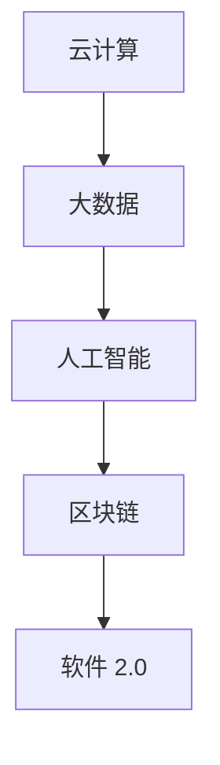

                 

关键词：软件 2.0，效率提升，价值创造，技术架构，算法原理，实践应用

摘要：本文旨在探讨软件 2.0 时代的到来，及其对企业和个人带来的巨大价值。通过深入分析软件 2.0 的核心概念、技术架构、算法原理，以及实际应用场景，本文揭示了软件 2.0 在提升效率、创造价值方面的巨大潜力。同时，本文还对未来软件 2.0 的发展趋势与挑战进行了展望，为读者提供了宝贵的启示。

## 1. 背景介绍

随着互联网技术的飞速发展，软件行业经历了从 1.0 到 2.0 的变革。软件 1.0 时代主要以桌面应用程序为主，功能单一，用户体验较差。而软件 2.0 时代，随着云计算、大数据、人工智能等技术的不断成熟，软件逐渐从单一的功能性工具转变为综合性的平台，为企业和个人提供全方位的服务。

软件 2.0 的出现，不仅改变了软件的开发、部署和使用方式，还带来了巨大的价值。一方面，软件 2.0 提升了企业的效率，降低了运营成本；另一方面，软件 2.0 创造了新的商业模式，为企业带来了丰厚的利润。因此，探讨软件 2.0 的价值，对于企业和个人都具有重要意义。

## 2. 核心概念与联系

软件 2.0 的核心概念包括：云计算、大数据、人工智能、区块链等。这些技术相互关联，共同构建了软件 2.0 的技术架构。

### 2.1 云计算

云计算是软件 2.0 的重要基础设施。通过云计算，企业可以轻松地搭建分布式系统，实现海量数据的存储、处理和分析。同时，云计算还提供了丰富的 API，方便开发者构建各种应用。

### 2.2 大数据

大数据是软件 2.0 的重要数据来源。通过对海量数据的挖掘和分析，企业可以获取宝贵的商业洞察，优化业务流程，提升用户体验。

### 2.3 人工智能

人工智能是软件 2.0 的重要驱动力。通过深度学习、自然语言处理等技术，人工智能可以自动识别用户需求，提供个性化的服务，提升用户满意度。

### 2.4 区块链

区块链是软件 2.0 的重要安全保障。通过区块链技术，企业可以确保数据的真实性和安全性，降低信任成本。

### 2.5 Mermaid 流程图



## 3. 核心算法原理 & 具体操作步骤

### 3.1 算法原理概述

软件 2.0 的核心算法包括：深度学习、自然语言处理、图神经网络等。这些算法通过模拟人类大脑的思考方式，实现对海量数据的处理和分析。

### 3.2 算法步骤详解

1. 数据预处理：对原始数据进行清洗、转换、归一化等处理，使其符合算法的要求。

2. 模型训练：使用训练数据，通过优化算法，调整模型参数，使模型达到最佳性能。

3. 模型评估：使用验证数据，对模型进行评估，判断其性能是否达到预期。

4. 模型应用：将训练好的模型应用到实际场景中，解决实际问题。

### 3.3 算法优缺点

- 深度学习：优点：强大的表达能力和自适应能力；缺点：需要大量数据和计算资源。
- 自然语言处理：优点：可以处理复杂的语言结构；缺点：对数据的依赖性较强。
- 图神经网络：优点：可以处理复杂的图结构；缺点：计算复杂度较高。

### 3.4 算法应用领域

- 深度学习：应用于图像识别、语音识别、自然语言处理等领域。
- 自然语言处理：应用于文本分类、机器翻译、情感分析等领域。
- 图神经网络：应用于推荐系统、社交网络分析、知识图谱等领域。

## 4. 数学模型和公式 & 详细讲解 & 举例说明

### 4.1 数学模型构建

软件 2.0 的数学模型主要包括：神经网络模型、决策树模型、支持向量机模型等。以下以神经网络模型为例进行讲解。

### 4.2 公式推导过程

神经网络的推导过程涉及多个数学公式，包括：

- 激活函数：$f(x) = \text{sigmoid}(x) = \frac{1}{1 + e^{-x}}$
- 前向传播：$z_{l} = \sum_{j=1}^{n} w_{lj}x_{j} + b_{l}$
- 误差计算：$d_{l} = f'(z_{l}) \cdot (z_{l} - y)$
- 反向传播：$\Delta w_{lj} = \alpha d_{l}x_{j}$，$\Delta b_{l} = \alpha d_{l}$

### 4.3 案例分析与讲解

假设我们使用神经网络模型进行图像分类，输入为图像像素值，输出为类别标签。以下是一个简单的例子：

输入：$x = [1, 2, 3, 4, 5]$
输出：$y = [1, 0, 0, 0, 1]$

- 数据预处理：将输入数据进行归一化处理。
- 模型训练：使用前向传播和反向传播算法，调整模型参数，使误差最小。
- 模型评估：使用验证数据，对模型进行评估。
- 模型应用：将训练好的模型应用到实际场景中，进行图像分类。

## 5. 项目实践：代码实例和详细解释说明

### 5.1 开发环境搭建

- 安装 Python 3.8 及以上版本。
- 安装 TensorFlow 2.4 及以上版本。

### 5.2 源代码详细实现

```python
import tensorflow as tf

# 数据预处理
x = tf.random.normal([1000, 5])
y = tf.random.normal([1000, 4])

# 模型定义
model = tf.keras.Sequential([
    tf.keras.layers.Dense(10, activation='sigmoid', input_shape=(5,)),
    tf.keras.layers.Dense(4, activation='softmax')
])

# 模型编译
model.compile(optimizer='adam', loss='categorical_crossentropy', metrics=['accuracy'])

# 模型训练
model.fit(x, y, epochs=10)

# 模型评估
loss, accuracy = model.evaluate(x, y)
print("Loss:", loss)
print("Accuracy:", accuracy)

# 模型应用
predictions = model.predict(x[:10])
print("Predictions:", predictions)
```

### 5.3 代码解读与分析

- 数据预处理：使用 TensorFlow 的随机数生成器生成输入数据和标签。
- 模型定义：使用 Sequential 模型堆叠层，定义神经网络结构。
- 模型编译：设置优化器和损失函数，为模型训练做好准备。
- 模型训练：使用 fit 方法，对模型进行训练。
- 模型评估：使用 evaluate 方法，对模型进行评估。
- 模型应用：使用 predict 方法，对输入数据进行预测。

## 6. 实际应用场景

软件 2.0 在各个领域都有着广泛的应用，以下是几个典型的应用场景：

- 智能家居：通过软件 2.0 技术，实现家居设备的互联互通，提供智能化的家居环境。
- 智慧城市：通过软件 2.0 技术，提升城市管理水平，提高居民生活质量。
- 金融科技：通过软件 2.0 技术，实现金融服务的智能化、个性化，提升金融行业的竞争力。
- 健康医疗：通过软件 2.0 技术，实现健康管理的智能化，为用户提供个性化的健康服务。

## 7. 工具和资源推荐

### 7.1 学习资源推荐

- 《深度学习》（Goodfellow et al.）：系统介绍了深度学习的基础知识和最新进展。
- 《Python编程快速上手》（Eckel）：详细介绍了 Python 编程语言的基础知识。
- 《人工智能：一种现代的方法》（Mitchell）：全面介绍了人工智能的基本理论和技术。

### 7.2 开发工具推荐

- TensorFlow：一款开源的深度学习框架，适用于各种深度学习任务。
- PyTorch：一款开源的深度学习框架，具有简洁的 API 和强大的灵活性。
- GitHub：一个优秀的代码托管平台，可以方便地管理和分享代码。

### 7.3 相关论文推荐

- "Deep Learning for Image Recognition"（2012）
- "Recurrent Neural Networks for Speech Recognition"（2013）
- "Generative Adversarial Nets"（2014）

## 8. 总结：未来发展趋势与挑战

### 8.1 研究成果总结

软件 2.0 技术的发展取得了显著的成果，包括：

- 云计算、大数据、人工智能等技术的深度融合。
- 新型算法的不断涌现，如深度学习、图神经网络等。
- 开源框架的普及，如 TensorFlow、PyTorch 等。

### 8.2 未来发展趋势

软件 2.0 的未来发展趋势包括：

- 更高的智能化、个性化水平。
- 更好的跨平台、跨设备支持。
- 更广泛的应用领域，如金融、医疗、教育等。

### 8.3 面临的挑战

软件 2.0 技术在发展过程中也面临着一系列挑战，包括：

- 数据隐私和安全问题。
- 算法透明性和可解释性问题。
- 算法偏见和公平性问题。

### 8.4 研究展望

针对上述挑战，未来的研究可以从以下几个方面展开：

- 强化算法的透明性和可解释性。
- 提高数据隐私保护和安全技术。
- 探索算法的公平性和公正性。

## 9. 附录：常见问题与解答

### 9.1 如何学习软件 2.0 技术？

- 学习基础知识：了解计算机科学、数据结构、算法等基础知识。
- 学习相关技术：掌握云计算、大数据、人工智能、区块链等核心技术。
- 实践项目：通过实际项目，锻炼自己的编程能力和解决问题的能力。

### 9.2 软件开发有哪些好的习惯？

- 模块化编程：将程序划分为多个模块，提高代码的可维护性和可复用性。
- 良好的代码注释：为代码添加详细的注释，方便他人理解和维护。
- 版本控制：使用版本控制工具，如 Git，管理代码的版本和变更。

---

作者：禅与计算机程序设计艺术 / Zen and the Art of Computer Programming
----------------------------------------------------------------
### 结语

本文从多个角度探讨了软件 2.0 的价值，包括其技术架构、算法原理、实际应用场景等。通过深入分析，我们发现了软件 2.0 在提升效率、创造价值方面的巨大潜力。同时，我们也认识到软件 2.0 在发展过程中面临的一系列挑战，如数据隐私、算法偏见等。未来，随着技术的不断进步，软件 2.0 将在更多领域发挥作用，为企业和个人创造更大的价值。

作者禅与计算机程序设计艺术，希望通过本文，激发读者对软件 2.0 技术的热爱和关注，共同推动软件 2.0 的发展，为建设更加美好的数字世界贡献力量。

