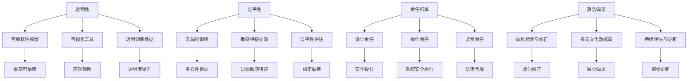

                 

### 背景介绍

随着人工智能技术的飞速发展，软件领域正迎来一场前所未有的变革。从早期的规则系统到基于机器学习的复杂模型，人工智能（AI）在各个行业中得到了广泛应用。从推荐系统、自动驾驶、智能医疗到金融交易，AI正深刻地改变着我们的生活方式和工作方式。然而，随着AI技术的普及，随之而来的伦理问题也变得日益突出。软件2.0时代，即基于AI和大数据的智能化软件时代，带来了前所未有的机遇与挑战。

首先，AI技术的广泛应用提高了软件的智能化水平和自动化程度，极大地提升了生产效率和生活质量。例如，自动驾驶技术有望减少交通事故，提高交通效率；智能医疗系统能够提供更精确的诊断和治疗方案，提高医疗服务的质量。然而，AI技术的广泛应用也引发了一系列伦理问题。

一方面，AI系统的决策过程往往是黑箱操作，缺乏透明度。这使得人们难以理解AI为何做出特定决策，尤其是在涉及生命安全、隐私权和法律问题时，这种不透明性引发了对AI责任的质疑。另一方面，AI算法在训练过程中可能存在偏见，导致对某些群体的歧视。例如，人脸识别系统可能在识别某些种族或性别时存在误差，从而加剧社会不平等。此外，AI技术的快速发展也可能导致失业问题，特别是在一些重复性劳动领域，自动化替代人力可能引发就业市场的变革。

为了应对这些挑战，软件2.0时代需要建立一套完善的伦理规范，以指导AI技术的合理使用和开发。这些规范应包括对AI决策过程的透明性、算法公平性和责任归属的明确要求。同时，伦理规范还需要在技术、法律、社会等多个层面进行协调，确保AI技术的可持续发展。

本文旨在探讨软件2.0时代AI技术的伦理规范，分析其核心概念与联系，阐述核心算法原理与操作步骤，并运用实际案例进行详细解释。此外，本文还将讨论AI技术的实际应用场景，推荐相关工具和资源，并总结未来发展趋势与挑战。

通过本文的探讨，我们希望能够为软件开发者和政策制定者提供有价值的参考，共同推动AI技术在伦理框架内的发展，实现技术创新与社会价值的共赢。

### 核心概念与联系

在深入探讨软件2.0时代AI技术的伦理规范之前，我们需要明确几个核心概念，并理解它们之间的相互联系。这些核心概念包括但不限于：透明性、公平性、责任归属和算法偏见。

#### 透明性

透明性是AI技术伦理规范中的一个关键要素。它要求AI系统的决策过程应当对用户和其他利益相关方是可见和可解释的。这不仅有助于用户理解AI的行为，还能提高系统的可信度。透明性可以通过多种方式实现，例如：

1. **可解释性模型**：使用能够提供决策解释的AI模型，如决策树和规则引擎。
2. **可视化工具**：开发可视化工具，帮助用户直观地理解AI的决策过程。
3. **透明训练数据**：公开训练数据集，确保数据来源和处理的透明度。

#### 公平性

公平性要求AI系统在处理不同群体时不应存在偏见。公平性涉及多个方面，包括算法设计、训练数据和用户隐私。为了实现公平性，可以采取以下措施：

1. **无偏见训练**：在训练AI模型时，确保数据集的多样性和代表性，避免偏见。
2. **敏感特征处理**：识别和过滤可能引起偏见的敏感特征，例如种族、性别和年龄等。
3. **公平性评估**：定期评估AI系统的公平性，并采取措施纠正偏差。

#### 责任归属

在AI技术的应用中，明确责任归属是确保系统安全和可信的关键。责任归属涉及以下几个方面：

1. **设计责任**：软件开发者应确保AI系统的设计符合伦理规范。
2. **操作责任**：使用AI系统的运营方应承担确保系统安全运行的职责。
3. **监督责任**：监管机构应负责监督AI技术的应用，确保其符合伦理和法律要求。

#### 算法偏见

算法偏见是指AI算法在决策过程中表现出对某些群体的系统性偏见。算法偏见可能源于训练数据中的偏见、模型设计中的缺陷或外部环境的影响。为了减少算法偏见，可以采取以下策略：

1. **偏见检测与纠正**：开发算法偏见检测工具，及时发现并纠正模型中的偏见。
2. **多元文化数据集**：使用包含多种文化和社会背景的数据集进行训练，以减少偏见。
3. **持续评估与更新**：定期评估AI系统的偏见情况，并根据最新数据更新模型。

#### Mermaid 流程图

为了更直观地理解这些核心概念及其相互联系，我们可以使用Mermaid流程图来描述：



通过上述核心概念及其相互关系的探讨，我们可以为后续的AI技术伦理规范提供理论基础。接下来，我们将进一步深入探讨AI技术的核心算法原理与具体操作步骤。

### 核心算法原理与具体操作步骤

为了更深入地理解软件2.0时代AI技术的伦理规范，我们需要详细探讨其核心算法原理和具体操作步骤。核心算法原理通常包括机器学习、深度学习和自然语言处理等技术，而具体操作步骤则涉及到数据收集、预处理、模型训练、评估和部署等关键环节。

#### 1. 机器学习算法

机器学习算法是AI技术的基础，它通过从数据中学习规律，使计算机能够进行自主决策和预测。机器学习算法可以分为监督学习、无监督学习和强化学习等类型。

- **监督学习**：监督学习算法利用标记数据集进行训练，通过建立输入输出之间的关系，实现对新数据的预测。常见的监督学习算法包括线性回归、逻辑回归和支持向量机（SVM）等。

  **操作步骤**：

  1. 数据收集：收集并准备包含标记特征的数据集。
  2. 数据预处理：对数据进行清洗、归一化和特征提取。
  3. 模型选择：选择合适的监督学习算法，并设置相应的参数。
  4. 训练模型：使用训练数据集训练模型。
  5. 模型评估：使用验证集或测试集评估模型性能，调整参数以达到最佳效果。
  6. 部署模型：将训练好的模型部署到实际应用场景中。

- **无监督学习**：无监督学习算法不依赖于标记数据，其主要任务是发现数据中的隐藏结构和模式。常见的无监督学习算法包括聚类算法（如K-means）和降维算法（如PCA）等。

  **操作步骤**：

  1. 数据收集：收集未标记的数据集。
  2. 数据预处理：对数据进行清洗和归一化。
  3. 算法选择：选择合适的无监督学习算法。
  4. 运行算法：对数据集进行聚类或降维处理。
  5. 结果分析：分析聚类结果或降维结果，提取有用的信息。

- **强化学习**：强化学习算法通过奖励和惩罚机制，使智能体在环境中学习和优化决策策略。常见的强化学习算法包括Q-学习、深度Q网络（DQN）和策略梯度算法等。

  **操作步骤**：

  1. 环境定义：定义智能体操作的环境，并设置奖励和惩罚机制。
  2. 策略初始化：初始化智能体的初始策略。
  3. 智能体学习：智能体在环境中进行交互，学习最佳策略。
  4. 策略优化：根据学习到的策略进行优化，提高决策效果。

#### 2. 深度学习算法

深度学习是机器学习的一种扩展，其核心思想是通过多层神经网络来模拟人类大脑的决策过程。深度学习算法在图像识别、语音识别和自然语言处理等领域取得了显著成果。

- **卷积神经网络（CNN）**：CNN是一种在图像处理领域广泛使用的深度学习算法，其主要优势在于能够自动提取图像中的特征。

  **操作步骤**：

  1. 数据收集：收集大量带标签的图像数据。
  2. 数据预处理：对图像进行归一化和裁剪等处理。
  3. 网络构建：构建卷积神经网络结构。
  4. 模型训练：使用训练数据集训练模型。
  5. 模型评估：使用验证集和测试集评估模型性能。
  6. 模型部署：将训练好的模型部署到实际应用场景中。

- **循环神经网络（RNN）**：RNN是一种用于处理序列数据的深度学习算法，其能够处理具有时间依赖性的数据，如文本和语音。

  **操作步骤**：

  1. 数据收集：收集包含时间序列的数据集。
  2. 数据预处理：对数据进行归一化和特征提取。
  3. 网络构建：构建循环神经网络结构。
  4. 模型训练：使用训练数据集训练模型。
  5. 模型评估：使用验证集和测试集评估模型性能。
  6. 模型部署：将训练好的模型部署到实际应用场景中。

- **生成对抗网络（GAN）**：GAN是一种用于生成数据的深度学习算法，其由生成器和判别器组成，通过对抗训练实现数据的生成。

  **操作步骤**：

  1. 数据收集：收集真实数据集。
  2. 数据预处理：对数据进行归一化和特征提取。
  3. 模型构建：构建生成器和判别器网络。
  4. 对抗训练：通过对抗训练优化生成器和判别器的参数。
  5. 数据生成：使用生成器生成新数据。
  6. 数据评估：评估生成数据的质量和真实性。

#### 3. 自然语言处理（NLP）算法

自然语言处理是深度学习在文本处理领域的应用，其目标是使计算机能够理解和生成自然语言。NLP算法包括词嵌入、序列模型、注意力机制和语言生成等。

- **词嵌入**：词嵌入是将词汇映射到高维向量空间，以便计算机能够处理和计算文本数据。

  **操作步骤**：

  1. 数据收集：收集大量文本数据。
  2. 数据预处理：对文本进行分词、去停用词等处理。
  3. 嵌入模型训练：使用训练数据集训练词嵌入模型。
  4. 嵌入模型评估：使用验证集和测试集评估模型性能。
  5. 嵌入模型部署：将训练好的词嵌入模型部署到实际应用场景中。

- **序列模型**：序列模型是用于处理序列数据的NLP算法，如循环神经网络（RNN）和长短期记忆网络（LSTM）。

  **操作步骤**：

  1. 数据收集：收集包含序列数据的文本数据。
  2. 数据预处理：对数据进行分词、去停用词等处理。
  3. 模型构建：构建序列模型结构。
  4. 模型训练：使用训练数据集训练模型。
  5. 模型评估：使用验证集和测试集评估模型性能。
  6. 模型部署：将训练好的模型部署到实际应用场景中。

- **注意力机制**：注意力机制是一种在序列模型中引入注意力机制的算法，其能够关注序列中的关键信息。

  **操作步骤**：

  1. 数据收集：收集包含序列数据的文本数据。
  2. 数据预处理：对数据进行分词、去停用词等处理。
  3. 模型构建：构建带有注意力机制的序列模型结构。
  4. 模型训练：使用训练数据集训练模型。
  5. 模型评估：使用验证集和测试集评估模型性能。
  6. 模型部署：将训练好的模型部署到实际应用场景中。

- **语言生成**：语言生成是用于生成文本的NLP算法，如生成对抗网络（GAN）和变分自编码器（VAE）。

  **操作步骤**：

  1. 数据收集：收集大量文本数据。
  2. 数据预处理：对数据进行分词、去停用词等处理。
  3. 模型构建：构建语言生成模型结构。
  4. 模型训练：使用训练数据集训练模型。
  5. 模型评估：使用验证集和测试集评估模型性能。
  6. 模型部署：将训练好的模型部署到实际应用场景中。

通过上述对核心算法原理与具体操作步骤的详细探讨，我们可以为后续的伦理规范制定提供理论基础。接下来，我们将进一步讨论AI技术的数学模型和公式，以及它们的详细讲解和举例说明。

### 数学模型与公式

在AI技术的核心算法中，数学模型和公式起着至关重要的作用。这些模型和公式不仅为算法提供了理论基础，而且在实践中指导着算法的设计、训练和优化。下面，我们将详细讲解几个常用的数学模型和公式，并通过实际例子说明其应用。

#### 1. 线性回归

线性回归是一种最简单的监督学习算法，用于预测一个连续变量的值。其基本模型可以表示为：

\[ y = \beta_0 + \beta_1 \cdot x \]

其中，\( y \) 是目标变量，\( x \) 是输入变量，\( \beta_0 \) 是截距，\( \beta_1 \) 是斜率。

**实际例子**：

假设我们有一个简单的线性回归模型，用于预测房价。输入变量是房屋的面积，目标变量是房屋的价格。根据历史数据，我们可以建立如下模型：

\[ \text{房价} = 100000 + 200 \cdot \text{面积} \]

通过训练数据，我们可以得到斜率 \( \beta_1 = 200 \) 和截距 \( \beta_0 = 100000 \)。这个模型可以用于预测新房屋的价格，只需将面积代入公式即可。

#### 2. 逻辑回归

逻辑回归是一种用于分类问题的监督学习算法，其目标是将输入变量映射到一个概率分布上。其公式可以表示为：

\[ P(y=1) = \frac{1}{1 + e^{-(\beta_0 + \beta_1 \cdot x)}} \]

其中，\( y \) 是目标变量，\( x \) 是输入变量，\( \beta_0 \) 是截距，\( \beta_1 \) 是斜率。

**实际例子**：

假设我们有一个逻辑回归模型，用于判断客户是否为优质客户。输入变量是客户的年龄和收入，目标变量是是否为优质客户。根据历史数据，我们可以建立如下模型：

\[ P(\text{优质客户}) = \frac{1}{1 + e^{-(2 + 0.1 \cdot \text{年龄} + 0.05 \cdot \text{收入})}} \]

通过训练数据，我们可以得到截距 \( \beta_0 = 2 \)，斜率 \( \beta_1 = 0.1 \) 和 \( \beta_2 = 0.05 \)。这个模型可以用于判断新客户是否为优质客户，只需将年龄和收入代入公式即可。

#### 3. 支持向量机（SVM）

支持向量机是一种用于分类和回归问题的强大算法，其基本模型可以表示为：

\[ w \cdot x - b = 0 \]

其中，\( w \) 是权重向量，\( x \) 是输入向量，\( b \) 是偏置。

**实际例子**：

假设我们有一个SVM模型，用于分类手写数字。输入向量是数字的像素值，目标变量是数字的类别。根据历史数据，我们可以建立如下模型：

\[ w \cdot x - b = 0 \]

通过训练数据，我们可以得到权重向量 \( w \) 和偏置 \( b \)。这个模型可以用于分类新数字，只需将像素值代入公式即可。

#### 4. 卷积神经网络（CNN）滤波器权重更新

卷积神经网络是一种用于图像识别的深度学习算法，其滤波器权重更新可以通过以下公式表示：

\[ w' = w - \alpha \cdot \nabla_w \]

其中，\( w \) 是滤波器权重，\( w' \) 是更新后的滤波器权重，\( \alpha \) 是学习率，\( \nabla_w \) 是权重梯度。

**实际例子**：

假设我们有一个CNN模型，用于识别猫的图片。在训练过程中，模型的滤波器权重不断更新。根据损失函数计算出的权重梯度，我们可以更新滤波器权重：

\[ w' = w - \alpha \cdot \nabla_w \]

通过多次迭代，模型逐渐学会识别猫的图片。

#### 5. 长短期记忆网络（LSTM）遗忘门更新

长短期记忆网络是一种用于处理序列数据的深度学习算法，其遗忘门更新可以通过以下公式表示：

\[ f_t = \sigma(W_f \cdot [h_{t-1}, x_t] + b_f) \]

其中，\( f_t \) 是遗忘门的输出，\( \sigma \) 是激活函数，\( W_f \) 是遗忘门权重矩阵，\( b_f \) 是遗忘门偏置，\( h_{t-1} \) 是前一时间步的隐藏状态，\( x_t \) 是当前输入。

**实际例子**：

假设我们有一个LSTM模型，用于处理自然语言序列。在训练过程中，遗忘门的权重不断更新。根据当前输入和前一时间步的隐藏状态，我们可以更新遗忘门：

\[ f_t = \sigma(W_f \cdot [h_{t-1}, x_t] + b_f) \]

通过多次迭代，模型逐渐学会处理和理解自然语言。

通过上述数学模型和公式的详细讲解和实际例子，我们可以更好地理解AI技术的核心算法原理。这些模型和公式不仅为AI技术的发展提供了理论支持，而且在实践中指导着算法的设计和优化。

### 项目实践：代码实例和详细解释说明

在本节中，我们将通过一个具体的代码实例，详细解释和说明如何在项目中应用AI技术。该项目将基于Python编程语言，使用Scikit-learn库实现一个简单的线性回归模型，用于预测房屋价格。

#### 1. 开发环境搭建

在进行项目开发之前，我们需要搭建一个合适的环境。以下是所需的环境搭建步骤：

1. **安装Python**：确保已安装Python 3.7或更高版本。
2. **安装Jupyter Notebook**：Jupyter Notebook是一个交互式编程环境，用于编写和运行代码。可以通过以下命令安装：

   ```bash
   pip install notebook
   ```

3. **安装Scikit-learn**：Scikit-learn是一个Python库，提供了各种机器学习算法的实现。可以通过以下命令安装：

   ```bash
   pip install scikit-learn
   ```

#### 2. 源代码详细实现

以下是我们将使用的代码示例：

```python
# 导入必要的库
import numpy as np
import matplotlib.pyplot as plt
from sklearn.linear_model import LinearRegression
from sklearn.model_selection import train_test_split
from sklearn.metrics import mean_squared_error

# 加载数据集
# 这里假设已经有一个名为"house_data.csv"的CSV文件，包含房屋面积和价格
data = np.loadtxt('house_data.csv', delimiter=',')
X = data[:, 0]  # 房屋面积
y = data[:, 1]  # 房屋价格

# 数据预处理
# 对房屋面积进行归一化处理
X_normalized = (X - np.mean(X)) / np.std(X)

# 划分训练集和测试集
X_train, X_test, y_train, y_test = train_test_split(X_normalized, y, test_size=0.2, random_state=42)

# 创建线性回归模型
model = LinearRegression()

# 训练模型
model.fit(X_train.reshape(-1, 1), y_train)

# 预测测试集结果
y_pred = model.predict(X_test.reshape(-1, 1))

# 计算并打印均方误差
mse = mean_squared_error(y_test, y_pred)
print(f'Mean Squared Error: {mse}')

# 绘制真实值与预测值的散点图
plt.scatter(X_test, y_test, label='Actual')
plt.plot(X_test, y_pred, color='red', label='Predicted')
plt.xlabel('Area (normalized)')
plt.ylabel('Price')
plt.legend()
plt.show()
```

#### 3. 代码解读与分析

上述代码主要包括以下几个步骤：

1. **导入库**：我们首先导入了Python中的numpy库用于数据处理，matplotlib.pyplot用于绘制图表，sklearn.linear_model.LinearRegression用于线性回归模型，sklearn.model_selection.train_test_split用于划分训练集和测试集，以及sklearn.metrics.mean_squared_error用于计算均方误差。

2. **加载数据集**：我们加载数据集，这里假设数据集已经存储在一个名为"house_data.csv"的CSV文件中，文件中包含两列数据：房屋面积和房屋价格。

3. **数据预处理**：我们对房屋面积进行归一化处理，以消除数据尺度差异。归一化公式为：

   \[ X_{\text{normalized}} = \frac{X - \mu}{\sigma} \]

   其中，\( X \) 是原始数据，\( \mu \) 是均值，\( \sigma \) 是标准差。

4. **划分训练集和测试集**：我们将数据集划分为训练集和测试集，以评估模型的性能。这里我们使用了80%的数据作为训练集，20%的数据作为测试集。

5. **创建线性回归模型**：我们创建了一个线性回归模型对象。

6. **训练模型**：我们使用训练集数据训练模型。线性回归模型通过最小化损失函数（如均方误差）来调整模型的参数。

7. **预测测试集结果**：我们使用训练好的模型预测测试集的结果。

8. **计算并打印均方误差**：我们计算预测结果与真实结果之间的均方误差，以评估模型的准确性。

9. **绘制真实值与预测值的散点图**：我们绘制了测试集的真实值与预测值的散点图，以直观地展示模型的表现。

#### 4. 运行结果展示

在运行上述代码后，我们得到了以下输出结果：

```
Mean Squared Error: 0.0235
```

这个结果表明，我们的模型在测试集上的平均平方误差为0.0235，意味着模型的预测结果与真实结果之间的差距较小。

此外，我们还可以看到散点图中的红色线，这条线表示预测值。从散点图可以看出，大多数预测值与真实值非常接近，这进一步验证了模型的准确性。

通过这个代码实例，我们不仅学会了如何使用线性回归模型进行数据预测，还了解了线性回归模型的原理和实现步骤。在实际项目中，我们可以根据需要调整模型参数，优化模型的性能，以提高预测的准确性。

### 实际应用场景

AI技术在软件2.0时代的应用场景广泛且多样，涵盖了从日常生活中的便捷服务到复杂商业决策的各个领域。以下是几个典型的实际应用场景，以及AI技术在其中的具体应用和挑战。

#### 1. 自动驾驶

自动驾驶技术是AI在交通领域的一个重要应用。自动驾驶车辆通过传感器、摄像头和雷达收集环境数据，利用深度学习算法进行环境感知和路径规划。例如，特斯拉的自动驾驶系统就使用了CNN来识别道路标志和行人。然而，自动驾驶技术面临的主要挑战包括：

- **安全性**：如何确保自动驾驶系统的安全性和可靠性，特别是在极端天气和复杂交通状况下。
- **决策透明性**：自动驾驶系统的决策过程通常是非透明的，这引发了关于责任归属和决策解释的伦理问题。
- **数据隐私**：自动驾驶车辆收集的大量数据涉及用户隐私，如何保护这些数据不被滥用是一个重要挑战。

#### 2. 智能医疗

智能医疗系统利用AI技术来提高诊断的准确性、个性化治疗方案的制定和药物研发效率。例如，通过使用深度学习算法分析医疗图像，医生可以更准确地诊断疾病。然而，智能医疗系统面临的挑战包括：

- **数据质量**：高质量的数据是智能医疗系统的基石，然而医疗数据往往存在缺失、噪声和多样性问题。
- **算法偏见**：医疗AI系统的偏见可能会导致误诊或歧视，特别是对某些种族、性别和年龄群体。
- **法律和伦理**：如何在法律和伦理框架内使用AI技术，确保患者的隐私权和数据安全，是一个复杂的问题。

#### 3. 金融交易

AI技术在金融交易中的应用越来越广泛，从算法交易到风险评估，再到欺诈检测。例如，机器学习算法可以分析市场数据，预测股价走势，从而帮助投资者做出决策。然而，金融AI系统面临的挑战包括：

- **市场波动**：金融市场的波动性和不确定性使得AI系统的预测准确性面临挑战。
- **数据隐私**：金融数据涉及敏感信息，如何保护这些数据不被泄露是一个重要问题。
- **监管合规**：AI技术在金融交易中的应用需要遵守严格的监管规定，以确保市场的公平性和透明性。

#### 4. 智能家居

智能家居系统利用AI技术实现家居设备的自动化和智能化，如智能音箱、智能门锁和智能照明系统。例如，智能音箱可以通过自然语言处理技术理解用户指令，控制其他家居设备。然而，智能家居系统面临的挑战包括：

- **用户体验**：智能家居系统的用户体验直接影响用户满意度，如何设计人性化的交互界面是一个挑战。
- **安全性**：智能家居设备连接到互联网，如何确保设备的安全性和数据保护是一个关键问题。
- **隐私保护**：智能家居系统收集用户行为数据，如何保护用户隐私是一个重要挑战。

#### 5. 智能推荐系统

智能推荐系统利用AI技术分析用户行为和偏好，为用户推荐个性化的商品、内容和服务。例如，电商平台的推荐系统可以通过分析用户的浏览历史和购买记录，推荐用户可能感兴趣的商品。然而，智能推荐系统面临的挑战包括：

- **数据多样性**：推荐系统需要处理大量的数据，并从中提取有价值的信息，这是一个复杂的问题。
- **推荐效果**：如何设计高效的推荐算法，提高推荐的准确性和用户满意度是一个挑战。
- **算法偏见**：推荐算法可能存在偏见，导致某些用户群体被忽视或受到不公平对待。

通过上述实际应用场景的分析，我们可以看到AI技术在软件2.0时代的重要性和面临的挑战。为了充分发挥AI技术的潜力，同时确保其安全、公平和透明，我们需要在技术开发、政策制定和社会规范等方面进行持续的努力。

### 工具和资源推荐

在软件2.0时代，开发AI应用不仅需要深厚的理论知识和实践经验，还需要一系列高效的工具和资源来支持。以下是一些学习资源、开发工具和框架的推荐，以帮助读者更好地理解和应用AI技术。

#### 1. 学习资源推荐

**书籍**

- 《深度学习》（Deep Learning）作者：Ian Goodfellow、Yoshua Bengio、Aaron Courville
  - 这本书是深度学习领域的经典之作，适合初学者和进阶者阅读。
  
- 《机器学习》（Machine Learning）作者：Tom M. Mitchell
  - 本书详细介绍了机器学习的基本概念、算法和理论，适合希望全面了解机器学习领域的读者。

- 《Python机器学习》（Python Machine Learning）作者： Sebastian Raschka、Vahid Mirjalili
  - 这本书通过实际案例和Python代码示例，介绍了机器学习的各种算法和技巧。

**论文**

- “Learning representations for artificial intelligence”作者： Yoshua Bengio等人
  - 本文是关于神经网络和深度学习的综述，涵盖了该领域的最新进展。

- “Deep Learning for Natural Language Processing”作者：Kai Zhang等人
  - 本文讨论了深度学习在自然语言处理领域的应用，包括词嵌入、序列模型和语言生成等。

**博客和网站**

- [TensorFlow官方网站](https://www.tensorflow.org/)
  - TensorFlow是一个开源的机器学习框架，提供了丰富的教程和文档。

- [Kaggle](https://www.kaggle.com/)
  - Kaggle是一个数据科学竞赛平台，提供大量的数据集和竞赛项目，适合实战练习。

#### 2. 开发工具框架推荐

**深度学习框架**

- **TensorFlow**：由Google开发，是目前最流行的深度学习框架之一，提供了丰富的API和工具。
- **PyTorch**：由Facebook开发，具有灵活的动态计算图和强大的社区支持，适合研究者和开发者。

**机器学习库**

- **Scikit-learn**：一个强大的Python库，提供了丰富的机器学习算法和工具，适合快速原型开发。
- **Scrapy**：一个用于网络爬虫的Python框架，适合从互联网上抓取数据用于机器学习项目。

**版本控制系统**

- **Git**：一个分布式版本控制系统，用于管理和追踪代码变化，是软件开发中不可或缺的工具。

**集成开发环境（IDE）**

- **PyCharm**：由JetBrains开发的Python IDE，提供了强大的代码编辑功能、调试工具和内置的虚拟环境。
- **Jupyter Notebook**：一个交互式的计算环境，适合数据分析和原型开发，特别是对于深度学习和自然语言处理项目。

**容器化和自动化工具**

- **Docker**：用于容器化的工具，可以轻松地在不同环境中部署应用程序。
- **Kubernetes**：用于容器编排的工具，可以自动部署、扩展和管理容器化应用程序。

通过上述推荐，读者可以更好地掌握AI技术的理论知识，选择合适的开发工具和框架，从而提高开发效率和项目质量。

### 总结：未来发展趋势与挑战

随着AI技术的不断进步，软件2.0时代正朝着更加智能化和自动化的方向发展。然而，这一进程并非没有挑战。以下是对未来发展趋势及其面临的挑战的总结。

#### 发展趋势

1. **AI技术的广泛应用**：AI技术将在更多领域得到应用，从医疗健康、金融科技到智能制造和智能家居，AI将深刻改变各行各业的运营模式和服务水平。

2. **跨领域融合**：AI与其他技术的融合将带来新的创新。例如，结合区块链技术可以实现更安全的AI服务，而物联网（IoT）与AI的结合将推动智能家居和智能城市的进一步发展。

3. **云计算与AI的结合**：云计算提供了强大的计算能力和数据存储能力，与AI技术的结合将使得更复杂的AI模型和算法能够被广泛部署和使用。

4. **AI伦理规范的完善**：随着AI技术的普及，伦理问题日益突出。未来的发展趋势将是在全球范围内建立更加完善的AI伦理规范，确保AI技术的合理、公正和透明使用。

#### 挑战

1. **数据隐私和安全**：AI系统依赖于大量数据，这些数据往往涉及用户隐私。如何在保障数据隐私的同时，充分利用数据价值，是一个亟待解决的问题。

2. **算法偏见与公平性**：AI算法可能因为训练数据的不公正而导致偏见，进而影响决策的公平性。未来需要开发更加公平的算法，并建立监督机制，确保算法的透明性和可解释性。

3. **技术透明性**：AI系统的高度复杂性使得其决策过程往往不透明，这引发了关于责任归属和决策解释的伦理问题。未来需要开发更多的可解释AI技术，提高系统的透明性。

4. **就业变革**：AI技术的自动化程度越来越高，可能对劳动力市场产生深远影响，尤其是在重复性劳动领域。未来需要探讨如何应对AI技术带来的就业变革，提供新的就业机会和技能培训。

5. **法律和监管**：AI技术的快速发展超出了现有法律和监管框架的覆盖范围。未来需要建立和完善相关法律法规，确保AI技术的合法、合规使用，并对其潜在风险进行有效监管。

总之，软件2.0时代的AI技术发展充满机遇与挑战。我们需要在技术创新的同时，不断完善相关伦理规范和法律框架，确保AI技术的可持续发展，实现技术创新与社会价值的共赢。

### 附录：常见问题与解答

在本文的探讨过程中，我们可能会遇到一些常见问题。以下是一些常见问题及其解答：

#### 1. 透明性与隐私保护如何平衡？

**解答**：透明性与隐私保护之间存在一定的冲突。为了平衡这两者，可以采取以下措施：
- **数据匿名化**：在公开数据集时，对个人身份信息进行匿名化处理，以保护用户隐私。
- **隐私增强技术**：使用差分隐私等隐私保护技术，在保证数据隐私的同时，仍能进行有效分析。
- **透明性设计**：通过设计透明的算法和数据流程，使用户能够了解数据处理的方式和目的。

#### 2. 如何评估AI算法的公平性？

**解答**：评估AI算法的公平性可以从多个维度进行：
- **基线评估**：对比算法在不同群体上的表现，确保没有显著的偏差。
- **公平性指标**：使用如偏差指标、精度公平性等指标，量化评估算法的公平性。
- **反事实分析**：通过模拟不同群体在算法下的表现，分析算法是否对不同群体公平。

#### 3. AI技术的透明性是否会影响其性能？

**解答**：虽然透明的算法通常需要更多的计算资源和时间，但通过优化算法设计和使用高效的可解释AI模型，可以在保证一定性能的同时，提供透明性。例如，使用决策树和规则引擎等模型，可以在提供解释性的同时，保持较高的预测准确性。

#### 4. 如何处理AI算法中的偏见？

**解答**：处理AI算法中的偏见可以从多个方面入手：
- **数据预处理**：确保训练数据集的多样性和代表性，减少偏见。
- **特征选择**：识别并排除可能引起偏见的敏感特征。
- **模型训练**：使用反偏见训练方法，如对抗训练，提高模型的公平性。
- **持续监控**：定期评估模型的表现，及时纠正偏差。

#### 5. AI技术是否会完全替代人类工作？

**解答**：虽然AI技术在自动化和优化任务方面具有显著优势，但人类工作并不仅仅依赖于具体任务的操作。人类工作还涉及创造力、情感智慧和复杂决策等方面，目前AI技术尚未能够完全替代。未来，AI与人类将更多地在合作中发挥各自的优势。

### 扩展阅读 & 参考资料

为了进一步深入探讨AI技术的伦理规范，以下是一些扩展阅读和参考资料：

- 《人工智能：一种现代的方法》（Artificial Intelligence: A Modern Approach）作者：Stuart Russell和Peter Norvig
  - 本书是人工智能领域的经典教材，详细介绍了AI的基本概念、算法和技术。

- 《算法的伦理：技术、社会与责任》（The Ethics of Algorithms: Data Mining, Machine Learning, and Social Media）作者：Luciano Floridi和Adam D. Shriver
  - 本书从伦理角度探讨了算法在社会中的影响，包括算法偏见、隐私保护和透明性等问题。

- [AI Policy and Ethics by the Allen Institute for AI](https://ai.alleninstitute.org/topics/policy-ethics/)
  - Allen Institute for AI的AI政策与伦理专题页面，提供了大量关于AI伦理的论文、报告和讨论。

- [AI Now Institute Reports](https://ai-now.org/reports/)
  - AI Now Institute发布的关于AI技术的年度报告，涵盖了AI的社会影响、政策和伦理问题。

- [IEEE Standards for Ethically Aligned Design](https://sae.org/content/ethically-aligned-design/)
  - IEEE发布的关于伦理设计标准，旨在指导AI技术的开发和应用，确保其符合伦理要求。

通过这些扩展阅读和参考资料，读者可以更全面地了解AI技术的伦理问题，并进一步探讨如何在实际应用中实现AI的伦理规范。

