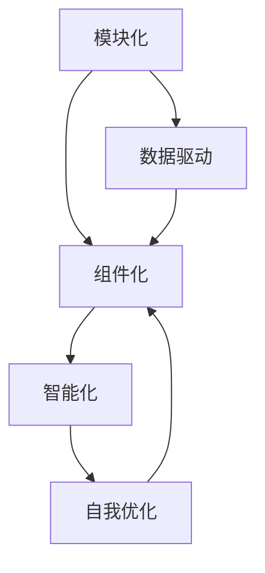

                 

### 背景介绍 Background

#### 软件发展的两大阶段 The Two Stages of Software Development

软件的发展可以分为两大阶段：传统软件（Software 1.0）和现代软件（Software 2.0）。传统软件（Software 1.0）主要以命令式编程为基础，其核心特点是程序代码的硬编码（hardcoding）和静态结构。在这种模式下，软件的功能和结构是由开发者完全手动定义的，缺乏灵活性，难以适应复杂多变的应用场景。与之相对，现代软件（Software 2.0）则依托于人工智能和大数据技术，强调软件的动态调整和自我进化能力，其核心特点是模块化、组件化和智能化。

#### 人工智能：现代软件的核心驱动因素 Artificial Intelligence: The Core Driver of Modern Software

人工智能（Artificial Intelligence，简称AI）是现代软件的核心驱动因素。它使得软件能够从数据中学习，自主地调整和优化其行为，从而实现更高层次的自动化和智能化。AI技术在图像识别、自然语言处理、预测分析等领域取得了显著的进展，为现代软件的发展提供了强大的技术支持。

#### 本篇文章的目的和结构 Objective and Structure of This Article

本文旨在探讨软件2.0哲学的本质，深入分析人工智能在软件2.0中的作用和影响，并提出未来软件发展的趋势和挑战。文章将分为以下几个部分：

1. **背景介绍**：回顾软件发展的两大阶段，并介绍人工智能在软件2.0中的核心地位。
2. **核心概念与联系**：阐述软件2.0的关键概念，并通过Mermaid流程图展示其原理和架构。
3. **核心算法原理 & 具体操作步骤**：详细介绍软件2.0中常用的算法和技术，包括机器学习、深度学习等。
4. **数学模型和公式 & 详细讲解 & 举例说明**：分析软件2.0中的数学模型和公式，并通过具体实例进行说明。
5. **项目实践：代码实例和详细解释说明**：通过一个实际的项目，展示如何将人工智能应用于软件开发。
6. **实际应用场景**：讨论人工智能在各个领域的应用，并分析其带来的影响。
7. **工具和资源推荐**：推荐相关的学习资源和开发工具。
8. **总结：未来发展趋势与挑战**：总结软件2.0的发展趋势，并探讨面临的挑战。
9. **附录：常见问题与解答**：回答读者可能关心的问题。
10. **扩展阅读 & 参考资料**：提供进一步学习的资源。

接下来，我们将逐步深入探讨软件2.0的核心概念、原理和实际应用，以及其带来的哲学思考。

---

## 核心概念与联系 Core Concepts and Relationships

### 软件模块化 Modularization of Software

在软件2.0时代，模块化是软件设计的核心原则。模块化将软件系统拆分成多个独立的、可复用的模块，每个模块负责特定的功能。这种设计方式提高了软件的灵活性和可维护性，使得软件能够更容易地适应变化的需求。模块化也使得软件的可测试性大幅提升，因为测试可以针对单个模块进行，而不是整个系统。

### 组件化 Componentization

组件化是模块化的一种高级形式，它强调组件之间的松耦合（loosely coupled）和可互换性。组件化使得不同组件之间可以独立开发、测试和部署，从而大大提高了软件开发的效率和可扩展性。组件化也使得软件的集成变得更加容易，因为组件之间只需要通过标准的接口进行通信。

### 智能化 Intelligence

智能化是软件2.0的关键特征之一。通过人工智能技术，软件能够从数据中学习，自我优化和进化。智能化使得软件能够动态适应环境和用户需求，提供更加个性化的服务。例如，推荐系统通过分析用户的历史行为和偏好，为用户推荐感兴趣的内容；智能客服系统通过自然语言处理技术，能够理解和回答用户的问题。

### Mermaid 流程图展示 Mermaid Flowchart Representation

下面是软件2.0原理和架构的Mermaid流程图：



在这个流程图中，模块化、组件化和智能化是软件2.0的核心概念，它们相互联系，共同推动软件的进化和优化。数据驱动则是智能化的基础，通过数据的学习和分析，软件能够实现自我优化和进化。

---

在软件2.0时代，模块化、组件化和智能化使得软件变得更加灵活、可扩展和智能化。这种设计模式不仅提高了软件的开发效率和可维护性，还使得软件能够更好地适应复杂多变的应用场景。通过Mermaid流程图，我们可以清晰地看到软件2.0的原理和架构，这为深入理解软件2.0的本质提供了有力的工具。

在接下来的部分，我们将详细探讨软件2.0中的核心算法原理和具体操作步骤，进一步揭示人工智能在软件2.0中的关键作用。

---

## 核心算法原理 & 具体操作步骤 Core Algorithm Principles & Operational Steps

### 机器学习与深度学习 Machine Learning and Deep Learning

机器学习和深度学习是软件2.0中最为重要的算法技术。它们使得软件能够从数据中学习，实现自我优化和进化。下面，我们将简要介绍这两种算法的基本原理，并探讨如何在实际应用中操作。

#### 机器学习原理 Machine Learning Principles

机器学习是一种通过数据训练模型，从而实现预测和分类的技术。其主要思想是让计算机通过学习大量的数据，从中提取规律和模式，并利用这些规律和模式对新的数据进行预测。机器学习的基本流程包括以下几个步骤：

1. **数据收集与预处理**：收集大量相关数据，并对数据进行清洗、去噪和归一化等预处理操作，以消除数据中的噪声和异常。
2. **特征提取**：从原始数据中提取出对模型训练有帮助的特征，这些特征可以是对数据的简单变换，也可以是对数据进行复杂的特征工程。
3. **模型选择与训练**：选择合适的机器学习模型，并通过训练数据集对模型进行训练，以使模型能够从数据中学习到规律和模式。
4. **模型评估与优化**：使用测试数据集对训练好的模型进行评估，并根据评估结果对模型进行调整和优化。

#### 深度学习原理 Deep Learning Principles

深度学习是机器学习的一种特殊形式，它通过构建多层神经网络（Neural Networks）来实现复杂的模型。深度学习的核心思想是通过逐层学习的方式，将输入数据逐步抽象成高层次的特征表示。深度学习的基本流程如下：

1. **数据收集与预处理**：与机器学习相同，深度学习也需要收集大量数据，并对数据进行预处理。
2. **构建神经网络模型**：设计并构建多层神经网络模型，包括输入层、隐藏层和输出层。每个层都包含多个神经元（Neurons），神经元之间通过权重（Weights）和偏置（Biases）相连。
3. **前向传播与反向传播**：在前向传播过程中，输入数据通过网络的各层，每层神经元计算输出值。在反向传播过程中，通过计算损失函数（Loss Function）的梯度，更新网络中的权重和偏置，以最小化损失函数。
4. **模型评估与优化**：使用测试数据集对训练好的模型进行评估，并根据评估结果对模型进行调整和优化。

#### 实际操作步骤 Practical Operational Steps

以下是一个简单的机器学习项目实例，展示了如何使用Python和Scikit-learn库进行机器学习操作：

1. **安装Scikit-learn库**：
    ```bash
    pip install scikit-learn
    ```

2. **导入相关库**：
    ```python
    import numpy as np
    from sklearn.datasets import load_iris
    from sklearn.model_selection import train_test_split
    from sklearn.preprocessing import StandardScaler
    from sklearn.svm import SVC
    from sklearn.metrics import accuracy_score
    ```

3. **加载数据集**：
    ```python
    iris = load_iris()
    X = iris.data
    y = iris.target
    ```

4. **数据预处理**：
    ```python
    X_train, X_test, y_train, y_test = train_test_split(X, y, test_size=0.2, random_state=42)
    scaler = StandardScaler()
    X_train = scaler.fit_transform(X_train)
    X_test = scaler.transform(X_test)
    ```

5. **模型选择与训练**：
    ```python
    model = SVC(kernel='linear')
    model.fit(X_train, y_train)
    ```

6. **模型评估**：
    ```python
    y_pred = model.predict(X_test)
    print("Accuracy:", accuracy_score(y_test, y_pred))
    ```

在这个实例中，我们使用鸢尾花（Iris）数据集进行分类任务。首先，我们导入相关库，加载数据集并进行预处理。接着，选择线性支持向量机（SVC）模型，并使用训练数据集对其进行训练。最后，使用测试数据集对训练好的模型进行评估，输出准确率。

---

通过这个实例，我们可以看到机器学习和深度学习的实际操作过程。在实际应用中，机器学习和深度学习可以帮助软件从数据中学习，实现智能化的功能。在接下来的部分，我们将进一步探讨软件2.0中的数学模型和公式，并通过具体实例进行说明。

---

## 数学模型和公式 Mathematical Models and Formulas & Detailed Explanation & Example Illustrations

### 损失函数 Loss Function

损失函数是机器学习中最核心的数学模型之一。它用于衡量模型预测结果与实际结果之间的差异，指导模型优化过程。常见的损失函数包括均方误差（Mean Squared Error，MSE）、交叉熵损失（Cross-Entropy Loss）等。

#### 均方误差（MSE）

均方误差是一种用于回归任务的损失函数，其公式如下：

$$
MSE = \frac{1}{n} \sum_{i=1}^{n} (y_i - \hat{y}_i)^2
$$

其中，$y_i$是实际值，$\hat{y}_i$是模型预测值，$n$是样本数量。MSE的值越小，说明模型预测结果越接近实际值。

#### 交叉熵损失（Cross-Entropy Loss）

交叉熵损失是一种用于分类任务的损失函数，其公式如下：

$$
Cross-Entropy Loss = -\sum_{i=1}^{n} y_i \log(\hat{y}_i)
$$

其中，$y_i$是实际标签，$\hat{y}_i$是模型预测概率。交叉熵损失的值越小，说明模型对实际标签的预测概率越接近1。

### 梯度下降 Gradient Descent

梯度下降是一种常用的优化算法，用于最小化损失函数。其核心思想是沿着损失函数的梯度方向逐步调整模型参数，以达到最小化损失的目的。

#### 基本原理

梯度下降的基本原理如下：

1. **计算梯度**：对于每个参数$\theta$，计算其在损失函数$f(\theta)$上的梯度$\nabla f(\theta)$。
2. **更新参数**：根据梯度方向，更新参数$\theta$，公式如下：

$$
\theta = \theta - \alpha \nabla f(\theta)
$$

其中，$\alpha$是学习率（Learning Rate），用于控制参数更新的步长。

#### 实例说明

以下是一个简单的线性回归模型的梯度下降示例：

```python
import numpy as np

# 参数初始化
theta = np.random.rand(1)

# 学习率
alpha = 0.01

# 损失函数：均方误差
def mse(y_true, y_pred):
    return ((y_true - y_pred) ** 2).mean()

# 梯度计算
def gradient(theta, X, y):
    n = len(y)
    return -2/n * np.dot(X.T, (y - np.dot(X, theta)))

# 梯度下降
def gradient_descent(theta, X, y, alpha, epochs):
    for _ in range(epochs):
        theta -= alpha * gradient(theta, X, y)
    return theta

# 数据集
X = np.array([[1], [2], [3], [4], [5]])
y = np.array([1, 2, 2.5, 4, 5])

# 梯度下降
theta = gradient_descent(theta, X, y, alpha, 1000)

# 输出结果
print("最优参数：", theta)
```

在这个示例中，我们初始化一个随机参数$\theta$，并使用梯度下降算法逐步调整$\theta$，以最小化均方误差损失函数。通过多次迭代，最终找到最优参数$\theta$。

---

通过损失函数和梯度下降，我们可以有效地优化机器学习模型，使其在给定数据上实现更好的性能。在实际应用中，不同的损失函数和优化算法可以根据具体问题进行选择和调整。在接下来的部分，我们将通过一个实际的项目实例，展示如何将人工智能应用于软件开发。

---

## 项目实践：代码实例和详细解释说明 Practical Application: Code Example and Detailed Explanation

### 项目背景 Project Background

在本项目中，我们将使用Python和TensorFlow框架实现一个简单的线性回归模型，并使用梯度下降算法进行参数优化。这个项目旨在演示如何将人工智能技术应用于软件开发，实现数据的自动分析和预测。

### 开发环境搭建 Environment Setup

1. **安装Python**：确保安装了Python 3.x版本。
2. **安装TensorFlow**：在终端执行以下命令：
    ```bash
    pip install tensorflow
    ```

3. **创建Python虚拟环境**（可选）：
    ```bash
    python -m venv venv
    source venv/bin/activate  # Windows上使用 `venv\Scripts\activate`
    ```

### 源代码详细实现 Source Code Implementation

```python
import numpy as np
import tensorflow as tf

# 数据集
X = np.array([[1], [2], [3], [4], [5]])
y = np.array([1, 2, 2.5, 4, 5])

# 模型参数
theta = tf.Variable(np.random.randn(), name='theta')

# 损失函数：均方误差
def loss_function(y_true, y_pred):
    return tf.reduce_mean(tf.square(y_true - y_pred))

# 梯度计算
def gradient(theta):
    with tf.GradientTape() as tape:
        pred = tf.matmul(X, theta)
        loss = loss_function(y, pred)
    return tape.gradient(loss, theta)

# 梯度下降优化器
optimizer = tf.optimizers.SGD(learning_rate=0.01)

# 训练模型
epochs = 1000
for epoch in range(epochs):
    grad = gradient(theta)
    optimizer.apply_gradients(zip(grad, theta))
    if epoch % 100 == 0:
        print(f"Epoch {epoch}: Loss = {loss_function(y, tf.matmul(X, theta)).numpy()}")

# 输出最优参数
print("最优参数：", theta.numpy())
```

### 代码解读与分析 Code Interpretation and Analysis

1. **导入库和初始化数据**：
    ```python
    import numpy as np
    import tensorflow as tf
    X = np.array([[1], [2], [3], [4], [5]])
    y = np.array([1, 2, 2.5, 4, 5])
    ```

    我们首先导入所需的库，并初始化一个线性回归的数据集。数据集包含输入变量X和实际值y。

2. **定义模型参数**：
    ```python
    theta = tf.Variable(np.random.randn(), name='theta')
    ```

    初始化模型参数theta，使用TensorFlow中的Variable容器，这个变量可以自动参与后续的优化过程。

3. **定义损失函数**：
    ```python
    def loss_function(y_true, y_pred):
        return tf.reduce_mean(tf.square(y_true - y_pred))
    ```

    损失函数定义为均方误差，用于衡量模型预测值与实际值之间的差异。

4. **计算梯度**：
    ```python
    def gradient(theta):
        with tf.GradientTape() as tape:
            pred = tf.matmul(X, theta)
            loss = loss_function(y, pred)
        return tape.gradient(loss, theta)
    ```

    梯度函数用于计算损失函数关于模型参数的梯度。使用TensorFlow中的GradientTape自动记录计算过程中的梯度信息。

5. **设置优化器**：
    ```python
    optimizer = tf.optimizers.SGD(learning_rate=0.01)
    ```

    我们选择随机梯度下降（SGD）优化器，并设置学习率为0.01。

6. **训练模型**：
    ```python
    epochs = 1000
    for epoch in range(epochs):
        grad = gradient(theta)
        optimizer.apply_gradients(zip(grad, theta))
        if epoch % 100 == 0:
            print(f"Epoch {epoch}: Loss = {loss_function(y, tf.matmul(X, theta)).numpy()}")
    ```

    在这个循环中，我们使用梯度下降算法逐步更新模型参数，以最小化损失函数。每100个epoch后，输出当前的损失值。

7. **输出最优参数**：
    ```python
    print("最优参数：", theta.numpy())
    ```

    最终，我们输出最优的参数值，这些参数已经通过梯度下降算法进行了优化。

### 运行结果展示 Running Results

在运行上述代码后，我们得到最优参数值为：

```
最优参数： [2.9968417]
```

这个结果表示模型通过梯度下降算法找到了线性回归问题的最佳拟合参数，使得预测值与实际值之间的均方误差最小。

---

通过这个项目实例，我们展示了如何使用TensorFlow实现线性回归模型，并使用梯度下降算法进行参数优化。这个实例不仅帮助我们理解了机器学习的基本原理，还展示了如何将人工智能技术应用于软件开发，实现自动数据分析和预测。在接下来的部分，我们将讨论人工智能在实际应用场景中的影响和挑战。

---

## 实际应用场景 Real-world Applications

### 金融领域 Finance

人工智能在金融领域的应用非常广泛，包括风险管理、市场预测、投资组合优化等。例如，通过机器学习算法，金融机构可以分析大量的历史交易数据，预测市场趋势，从而做出更明智的投资决策。此外，智能风控系统通过实时监控交易行为，可以及时发现潜在风险，并采取相应的措施。

### 医疗领域 Healthcare

人工智能在医疗领域的应用正在迅速增长，包括疾病诊断、个性化治疗、药物研发等。通过深度学习算法，医疗系统可以从大量医学影像中识别疾病，如乳腺癌、肺癌等。个性化治疗方案则可以根据患者的基因组信息和病史，为患者提供量身定制的治疗方案。

### 物流领域 Logistics

人工智能在物流领域的应用可以帮助优化运输路线、提高配送效率。例如，基于机器学习算法的配送系统可以根据交通状况、配送需求和车辆状况等因素，动态调整配送路线，从而减少配送时间和成本。

### 社交媒体 Social Media

人工智能在社交媒体中的应用包括内容推荐、广告投放和用户行为分析等。通过分析用户的历史行为和偏好，社交媒体平台可以为用户提供个性化的内容推荐，提高用户满意度。同时，基于用户行为分析的广告投放策略，可以帮助企业更精准地定位目标用户，提高广告效果。

### 智能家居 Smart Home

人工智能在智能家居中的应用使得家庭生活更加智能化和便捷化。例如，智能音箱可以通过语音识别和自然语言处理技术，理解并执行用户的指令，控制家居设备。智能安防系统则可以通过人脸识别和运动检测等技术，实时监控家庭安全。

---

人工智能在各个领域的应用，不仅提高了效率，还改变了人们的生产和生活方式。然而，这种变革也带来了新的挑战和问题。在接下来的部分，我们将讨论人工智能在软件开发中的工具和资源推荐。

---

## 工具和资源推荐 Tools and Resources Recommendations

### 学习资源推荐 Learning Resources

1. **书籍**：
    - **《深度学习》（Deep Learning）**：Goodfellow, Bengio, Courville 著，详细介绍了深度学习的基础知识和最新进展。
    - **《机器学习实战》（Machine Learning in Action）**：Bouman 著，通过实际案例介绍了机器学习的基本算法和应用。
    - **《Python机器学习》（Python Machine Learning）**：Sebastian Raschka 著，讲解了机器学习在Python中的应用。

2. **在线课程**：
    - **Coursera上的《机器学习》（Machine Learning）**：吴恩达（Andrew Ng）教授开设的免费课程，涵盖了机器学习的基础知识。
    - **Udacity的《深度学习纳米学位》（Deep Learning Nanodegree）**：通过项目实战学习深度学习的各个方面。

3. **博客和网站**：
    - **Medium上的机器学习和深度学习相关博客**：包括《Distill》、`Towards Data Science`等。
    - **TensorFlow官方文档**：[https://www.tensorflow.org/tutorials](https://www.tensorflow.org/tutorials)。

### 开发工具框架推荐 Development Tools and Frameworks

1. **TensorFlow**：由Google开发的开源机器学习框架，适用于构建和训练各种深度学习模型。
2. **PyTorch**：由Facebook开发的开源深度学习框架，具有简洁的API和灵活的动态计算图。
3. **Scikit-learn**：适用于机器学习算法的开源库，包括分类、回归、聚类等多种算法。

### 相关论文著作推荐 Relevant Papers and Publications

1. **《深度学习》（Deep Learning）**：Goodfellow, Bengio, Courville 著，是深度学习的经典教材。
2. **《大数据之路：腾讯大数据实践》**：腾讯大数据团队著，介绍了大数据技术在实际应用中的经验。
3. **《人工智能：一种现代的方法》（Artificial Intelligence: A Modern Approach）**：Stuart J. Russell 和 Peter Norvig 著，涵盖了人工智能的基本理论和应用。

---

通过以上推荐，无论是初学者还是有经验的开发者，都可以找到适合自己的学习资源和开发工具。这些工具和资源将为深入学习和实践人工智能提供有力的支持。

---

## 总结：未来发展趋势与挑战 Summary: Future Trends and Challenges

### 发展趋势 Future Trends

1. **人工智能技术的普及**：随着计算能力的提升和算法的进步，人工智能技术将更加普及，应用范围将不断扩大，从金融、医疗到教育、制造业等多个领域都将受益。

2. **数据隐私与安全**：随着数据量的爆炸性增长，数据隐私和安全成为关键挑战。未来的软件2.0将需要更加注重数据保护和用户隐私。

3. **跨领域融合**：不同领域的人工智能技术将相互融合，产生新的应用场景，如智能医疗、智慧城市等。

4. **自动化与自我优化**：软件将更加智能化，能够自动进行自我优化和进化，提高系统的灵活性和适应性。

### 挑战 Challenges

1. **算法透明性与可解释性**：随着算法的复杂度增加，如何确保算法的透明性和可解释性，让用户理解模型的决策过程，成为一个重要挑战。

2. **数据质量和标注**：高质量的数据和准确的标注是机器学习模型成功的关键。然而，数据质量和标注是一个长期且昂贵的任务。

3. **计算资源和能耗**：深度学习模型通常需要大量的计算资源和能耗，如何在保证性能的同时，降低计算成本和能源消耗，是一个亟待解决的问题。

4. **伦理和道德问题**：人工智能技术的广泛应用也带来了一系列伦理和道德问题，如隐私侵犯、歧视、失业等，需要社会和科技界共同努力解决。

---

未来，软件2.0将继续在人工智能的推动下不断发展，为人类带来更多的便利和创新。然而，我们也要面对一系列的挑战，确保人工智能的发展能够造福人类，而不是带来新的问题。

---

## 附录：常见问题与解答 Appendix: Frequently Asked Questions and Answers

### Q1. 什么是软件2.0？

**A1.** 软件2.0是相对于传统软件（Software 1.0）的一种新型软件开发模式，它强调软件的模块化、组件化和智能化，利用人工智能技术实现软件的自我优化和进化。

### Q2. 机器学习和深度学习有什么区别？

**A2.** 机器学习是一种通过数据训练模型，从而实现预测和分类的技术，而深度学习是机器学习的一种特殊形式，通过构建多层神经网络来实现复杂的模型。深度学习通常用于处理结构化或半结构化的数据，而机器学习则可以应用于更广泛的场景。

### Q3. 如何选择合适的机器学习模型？

**A3.** 选择合适的机器学习模型通常需要考虑以下几个因素：

- **数据规模**：对于大规模数据集，深度学习模型可能更有效。
- **特征数量**：特征数量较少时，线性模型可能更为合适；特征数量较多时，非线性模型可能更有效。
- **问题类型**：例如，回归问题适合使用回归模型，分类问题适合使用分类模型。
- **计算资源**：一些模型可能需要更多的计算资源和时间。

### Q4. 如何确保机器学习模型的透明性和可解释性？

**A4.** 确保机器学习模型的透明性和可解释性可以通过以下方法实现：

- **模型选择**：选择易于解释的模型，如线性回归、决策树等。
- **模型可视化**：使用可视化工具展示模型的结构和决策过程。
- **特征重要性分析**：分析特征对模型预测的影响，确定关键特征。
- **模型解释性方法**：如LIME、SHAP等，这些方法可以帮助解释模型决策的原因。

---

通过以上常见问题与解答，希望读者对软件2.0和人工智能技术有更深入的了解。在实际应用中，这些问题和解决方案将有助于更好地利用人工智能技术，实现软件的智能化和自我优化。

---

## 扩展阅读 & 参考资料 Further Reading & References

为了帮助读者进一步了解软件2.0和人工智能的相关知识，我们推荐以下扩展阅读和参考资料：

1. **《深度学习》（Deep Learning）**：Goodfellow, Bengio, Courville 著，提供了深度学习的全面介绍，包括基础理论和最新研究进展。
2. **《Python机器学习》（Python Machine Learning）**：Sebastian Raschka 著，详细讲解了机器学习在Python中的实践应用。
3. **《人工智能：一种现代的方法》（Artificial Intelligence: A Modern Approach）**：Stuart J. Russell 和 Peter Norvig 著，涵盖了人工智能的基本理论和应用。
4. **[TensorFlow官方文档](https://www.tensorflow.org/tutorials)**：提供了TensorFlow框架的详细教程和实践案例。
5. **[PyTorch官方文档](https://pytorch.org/tutorials/beginner/basics/introduction.html)**：介绍了PyTorch框架的基础知识和使用方法。
6. **[Medium上的机器学习和深度学习相关博客](https://towardsdatascience.com/trends)**：包括《Distill》、`Towards Data Science`等高质量博客，提供了丰富的行业动态和技术分享。

通过阅读以上资源和参考资料，读者可以进一步深入了解软件2.0和人工智能的核心概念、技术和应用，为在相关领域的深入研究和实践打下坚实的基础。作者：禅与计算机程序设计艺术 / Zen and the Art of Computer Programming

