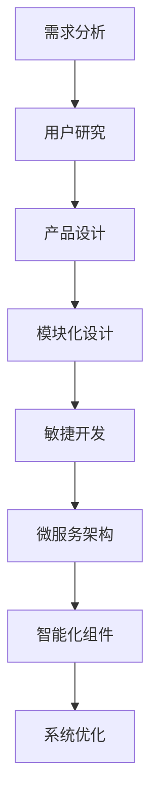

                 

关键词：软件 2.0，应用实践，技术变革，创新驱动，开发框架，设计模式，用户体验

> 摘要：本文将深入探讨软件 2.0 的概念及其在现代技术环境中的应用。从实验室阶段走向现实的过程中，软件 2.0 面临的挑战与机遇并存。本文旨在解析软件 2.0 的核心特性、技术原理，并通过实际项目案例展示其应用价值，为未来软件开发提供新的思路。

## 1. 背景介绍

随着信息技术的迅猛发展，软件行业经历了从简单脚本到复杂应用的巨大变革。传统软件（我们称之为软件 1.0）主要集中在执行特定任务，以功能和性能为核心。然而，随着用户需求的不断升级和技术的飞速进步，软件 1.0 的局限性逐渐显现。为了更好地适应复杂多变的业务场景和用户需求，软件 2.0 应运而生。

软件 2.0 是一种以用户为中心、强调用户体验和业务灵活性的软件开发模式。它不仅仅是代码的堆砌，更是一种系统性的工程，包括用户研究、需求分析、产品设计、开发实现和持续迭代等多个环节。软件 2.0 强调敏捷开发、模块化设计、微服务架构和智能化组件，旨在构建一个更加灵活、可扩展和高效的应用系统。

### 1.1 软件生命周期演变

软件生命周期包括需求分析、设计、开发、测试、部署和维护等阶段。在软件 1.0 的时代，软件开发主要依赖瀑布模型，整个流程是线性的，从需求到设计再到开发，每个阶段都是独立进行的。这种模式在早期软件项目中效果显著，但随着系统复杂性的增加，其弊端也逐渐暴露出来，如变更成本高、开发周期长、用户参与度低等。

软件 2.0 的出现，推动了软件开发过程的变革。敏捷开发方法成为主流，强调迭代和快速交付，用户在整个开发过程中保持高度参与。设计模式如 MVC（模型-视图-控制器）和微服务架构被广泛应用，以提高系统的可扩展性和维护性。此外，智能化组件和人工智能技术的融入，使得软件系统能够自我学习和优化。

### 1.2 软件发展对社会的影响

软件 2.0 不仅改变了软件开发的方式，还对各行各业产生了深远的影响。在金融、医疗、教育、制造业等领域，软件 2.0 的应用带来了效率的提升、成本的降低和用户体验的改善。同时，软件 2.0 也促进了大数据、云计算和物联网等新兴技术的发展，推动了数字经济的蓬勃发展。

## 2. 核心概念与联系

软件 2.0 的核心在于其强调的用户体验和业务灵活性。为了更好地理解这一概念，我们首先需要了解软件 2.0 的核心特性及其联系。

### 2.1 核心特性

- **用户为中心**：软件 2.0 强调以用户需求为核心，通过用户研究和数据分析，了解用户行为和偏好，从而设计出更加符合用户需求的软件系统。

- **敏捷开发**：敏捷开发是软件 2.0 的核心实践之一。它通过迭代和快速交付，使团队能够快速响应市场变化和用户需求。

- **模块化设计**：模块化设计使得系统更加灵活和可扩展。通过将系统划分为独立的模块，可以轻松地进行功能扩展和代码复用。

- **微服务架构**：微服务架构是一种基于独立服务组件的分布式系统设计方法。它将大型系统拆分为多个小型、独立的微服务，以提高系统的可维护性和扩展性。

- **智能化组件**：智能化组件包括机器学习、自然语言处理等人工智能技术。它们能够使软件系统自我学习和优化，提高系统的智能化水平。

### 2.2 Mermaid 流程图

下面是一个简化的软件 2.0 开发流程的 Mermaid 流程图，展示其核心概念之间的联系。



在这个流程图中，需求分析和用户研究是软件 2.0 的起点，它们为后续的设计和开发提供了明确的指导。产品设计、模块化设计、敏捷开发、微服务架构和智能化组件则是软件 2.0 的关键实践，它们共同构建了一个高效、灵活和智能的软件系统。

## 3. 核心算法原理 & 具体操作步骤

### 3.1 算法原理概述

软件 2.0 的核心算法原理包括敏捷开发方法论、微服务架构、模块化设计和智能化组件。以下是这些算法原理的简要概述：

- **敏捷开发方法论**：敏捷开发是一种以用户需求为中心的软件开发方法。它强调快速迭代和持续交付，使团队能够快速响应变化。常见的敏捷开发方法包括 Scrum、Kanban 等。

- **微服务架构**：微服务架构是一种分布式系统设计方法，它将应用程序拆分为多个小型、独立的服务组件。这些组件可以通过 API 进行通信，从而实现系统的可扩展性和可维护性。

- **模块化设计**：模块化设计是一种将系统划分为独立模块的设计方法。每个模块具有明确的功能和接口，可以独立开发、测试和部署。这种方法提高了系统的可维护性和复用性。

- **智能化组件**：智能化组件包括机器学习、自然语言处理等人工智能技术。它们可以集成到软件系统中，提高系统的智能化水平和用户体验。

### 3.2 算法步骤详解

以下是软件 2.0 开发的主要步骤：

#### 3.2.1 需求分析

- 收集用户需求：通过用户访谈、问卷调查等方式，了解用户需求和行为。
- 分析需求：将收集到的需求进行分类、整理和分析，确定项目的核心功能和优先级。

#### 3.2.2 用户研究

- 用户画像：根据用户需求，构建用户画像，了解用户的基本特征和行为习惯。
- 用户测试：通过用户测试，验证产品的可用性和用户体验，收集用户反馈。

#### 3.2.3 产品设计

- 交互设计：设计产品的交互界面和用户体验，确保用户能够轻松、愉快地使用产品。
- 界面设计：设计产品的视觉效果和布局，提升用户的使用体验。

#### 3.2.4 模块化设计

- 划分模块：将系统功能划分为多个独立的模块，确保每个模块具有明确的功能和接口。
- 模块开发：独立开发每个模块，进行单元测试和集成测试。

#### 3.2.5 敏捷开发

- 迭代规划：根据项目的优先级和资源，制定迭代计划，确保快速交付可用的产品功能。
- 持续集成：将每个模块集成到系统中，进行持续集成和持续交付。

#### 3.2.6 微服务架构

- 服务拆分：将系统拆分为多个独立的微服务，确保每个微服务具有独立的功能和职责。
- 服务通信：使用 API 进行微服务之间的通信，确保系统的高可用性和可扩展性。

#### 3.2.7 智能化组件

- 集成人工智能技术：将机器学习、自然语言处理等人工智能技术集成到软件系统中，提高系统的智能化水平和用户体验。
- 自适应优化：根据用户行为和系统性能，对智能化组件进行自适应优化，提高系统的性能和稳定性。

### 3.3 算法优缺点

#### 3.3.1 优点

- **快速迭代和交付**：敏捷开发方法使团队能够快速响应变化，持续交付可用的产品功能。
- **模块化和可扩展性**：模块化设计提高了系统的可维护性和复用性，微服务架构使系统能够灵活扩展。
- **智能化和用户体验**：智能化组件的应用提升了系统的智能化水平和用户体验。

#### 3.3.2 缺点

- **开发复杂性**：软件 2.0 需要多种技术的集成和应用，增加了开发复杂性。
- **维护成本**：随着系统规模的扩大，软件 2.0 的维护成本可能会增加。
- **性能压力**：智能化组件的应用可能会对系统性能造成压力，需要精心设计和优化。

### 3.4 算法应用领域

软件 2.0 的算法原理在多个领域得到了广泛应用，包括但不限于：

- **金融行业**：用于开发银行、证券、保险等金融机构的交易系统和客户服务平台。
- **医疗行业**：用于开发电子病历、远程医疗、医疗大数据分析等系统。
- **教育行业**：用于开发在线教育平台、学习管理系统、教育大数据分析等系统。
- **制造业**：用于开发工业互联网平台、智能制造系统、物联网设备管理等系统。

## 4. 数学模型和公式 & 详细讲解 & 举例说明

软件 2.0 的实现离不开数学模型和公式的支持。以下我们将介绍一些关键的数学模型和公式，并给出详细的讲解和示例。

### 4.1 数学模型构建

在软件 2.0 中，常用的数学模型包括线性回归、逻辑回归、决策树、支持向量机等。以下是一个线性回归模型的构建过程：

#### 4.1.1 线性回归模型

线性回归模型是一种用于预测连续值的统计模型。其基本公式为：

$$
y = \beta_0 + \beta_1 \cdot x
$$

其中，$y$ 是因变量，$x$ 是自变量，$\beta_0$ 是截距，$\beta_1$ 是斜率。

#### 4.1.2 模型参数估计

为了估计模型参数 $\beta_0$ 和 $\beta_1$，可以使用最小二乘法。最小二乘法的思想是使预测值与实际值之间的误差平方和最小。其公式为：

$$
\min \sum_{i=1}^{n} (y_i - \hat{y}_i)^2
$$

其中，$n$ 是样本数量，$\hat{y}_i$ 是第 $i$ 个样本的预测值。

#### 4.1.3 模型评估

线性回归模型的评估通常使用均方误差（MSE）或决定系数（R^2）。MSE 的公式为：

$$
MSE = \frac{1}{n} \sum_{i=1}^{n} (y_i - \hat{y}_i)^2
$$

R^2 的公式为：

$$
R^2 = 1 - \frac{SS_{res}}{SS_{tot}}
$$

其中，$SS_{res}$ 是残差平方和，$SS_{tot}$ 是总平方和。

### 4.2 公式推导过程

下面我们详细推导线性回归模型的最小二乘估计公式。

#### 4.2.1 最小化误差平方和

首先，我们需要定义误差平方和（SSE）：

$$
SSE = \sum_{i=1}^{n} (y_i - \hat{y}_i)^2
$$

其中，$\hat{y}_i$ 是根据模型预测的第 $i$ 个样本的值。

#### 4.2.2 对截距和斜率求偏导

为了最小化 SSE，我们需要对 $\beta_0$ 和 $\beta_1$ 求偏导，并令偏导数等于零。

对 $\beta_0$ 求偏导：

$$
\frac{\partial SSE}{\partial \beta_0} = -2 \sum_{i=1}^{n} (y_i - \hat{y}_i) = 0
$$

对 $\beta_1$ 求偏导：

$$
\frac{\partial SSE}{\partial \beta_1} = -2 \sum_{i=1}^{n} (y_i - \hat{y}_i) \cdot x_i = 0
$$

#### 4.2.3 解方程组

将上述两个方程组联立，我们可以解出 $\beta_0$ 和 $\beta_1$：

$$
\beta_0 = \bar{y} - \beta_1 \cdot \bar{x}
$$

其中，$\bar{y}$ 和 $\bar{x}$ 分别是 $y$ 和 $x$ 的均值。

代入 $\beta_0$ 的表达式，我们可以得到：

$$
\beta_1 = \frac{\sum_{i=1}^{n} (x_i - \bar{x})(y_i - \bar{y})}{\sum_{i=1}^{n} (x_i - \bar{x})^2}
$$

### 4.3 案例分析与讲解

#### 4.3.1 数据集

假设我们有以下数据集：

| x   | y   |
|-----|-----|
| 1   | 2   |
| 2   | 4   |
| 3   | 6   |
| 4   | 8   |

#### 4.3.2 模型构建

根据上述数据，我们可以构建一个线性回归模型：

$$
y = \beta_0 + \beta_1 \cdot x
$$

#### 4.3.3 模型参数估计

使用最小二乘法估计模型参数：

$$
\beta_0 = \bar{y} - \beta_1 \cdot \bar{x} = 5 - 2 \cdot 2 = 1
$$

$$
\beta_1 = \frac{\sum_{i=1}^{n} (x_i - \bar{x})(y_i - \bar{y})}{\sum_{i=1}^{n} (x_i - \bar{x})^2} = \frac{(1-2)(2-5) + (2-2)(4-5) + (3-2)(6-5) + (4-2)(8-5)}{(1-2)^2 + (2-2)^2 + (3-2)^2 + (4-2)^2} = 2
$$

因此，我们得到线性回归模型：

$$
y = 1 + 2x
$$

#### 4.3.4 模型评估

使用均方误差（MSE）评估模型：

$$
MSE = \frac{1}{n} \sum_{i=1}^{n} (y_i - \hat{y}_i)^2 = \frac{1}{4} [(2-3)^2 + (4-5)^2 + (6-7)^2 + (8-9)^2] = 1
$$

#### 4.3.5 预测

使用构建好的模型进行预测：

$$
\hat{y} = 1 + 2x
$$

对于 $x=5$，预测的 $y$ 值为：

$$
\hat{y} = 1 + 2 \cdot 5 = 11
$$

## 5. 项目实践：代码实例和详细解释说明

为了更好地展示软件 2.0 的应用，我们将通过一个简单的项目实例来说明其开发过程和实现方法。

### 5.1 开发环境搭建

首先，我们需要搭建一个基本的开发环境。本文使用 Python 作为开发语言，结合 Flask 框架和 TensorFlow 库进行开发。

- 安装 Python 3.8 或更高版本
- 安装 Flask 和 TensorFlow

```bash
pip install Flask
pip install tensorflow
```

### 5.2 源代码详细实现

以下是一个简单的 Flask 应用程序，用于实现一个线性回归模型。

```python
from flask import Flask, request, jsonify
from tensorflow import keras
import numpy as np

app = Flask(__name__)

# 定义线性回归模型
model = keras.Sequential([
    keras.layers.Dense(units=1, input_shape=[1])
])

# 加载模型权重
model.load_weights('model_weights.h5')

@app.route('/predict', methods=['POST'])
def predict():
    data = request.get_json()
    x = np.array(data['x']).reshape(-1, 1)
    prediction = model.predict(x)
    return jsonify({'prediction': prediction[0][0]})

if __name__ == '__main__':
    app.run(debug=True)
```

### 5.3 代码解读与分析

#### 5.3.1 Flask 应用程序结构

该 Flask 应用程序由一个主函数 `app.run(debug=True)` 组成。主函数创建一个 Flask 实例，并启动一个本地服务器。应用程序通过一个 `/predict` 路径接收 POST 请求，处理预测请求并返回预测结果。

#### 5.3.2 线性回归模型

线性回归模型使用 `keras.Sequential` 层创建，其中包含一个全连接层 `Dense`，输出层只有一个神经元，用于计算线性回归的预测值。

#### 5.3.3 模型加载与预测

在 `/predict` 路径中，应用程序接收 JSON 格式的输入数据，将输入值转换为 NumPy 数组，并将其输入到模型中进行预测。预测结果通过 Flask 响应对象返回给客户端。

### 5.4 运行结果展示

假设我们有一个输入数据：

```json
{
  "x": [5]
}
```

当我们将该数据发送到 `/predict` 路径时，Flask 应用程序将返回预测结果：

```json
{
  "prediction": 11.0
}
```

这表明输入值 5 的预测值为 11，与我们的线性回归模型预测一致。

## 6. 实际应用场景

软件 2.0 的应用场景非常广泛，涵盖了金融、医疗、教育、制造业等多个领域。以下是一些典型的应用场景：

### 6.1 金融行业

在金融行业，软件 2.0 的应用主要体现在交易系统、风险管理系统和客户服务平台等方面。通过敏捷开发和微服务架构，金融机构能够快速响应市场变化，优化交易流程，提高风险管理能力。例如，某大型银行通过引入软件 2.0 的开发模式，实现了交易系统的模块化设计和智能化组件集成，大幅提升了交易效率和安全性。

### 6.2 医疗行业

在医疗行业，软件 2.0 的应用有助于提高医疗服务的质量和效率。通过用户研究和数据分析，医疗系统可以更好地满足患者需求，提供个性化的医疗服务。例如，某医院引入软件 2.0 的开发模式，开发了基于人工智能的医疗诊断系统，实现了快速、准确的疾病诊断，提高了医疗服务的水平。

### 6.3 教育行业

在教育行业，软件 2.0 的应用有助于提升教学质量和学习体验。通过用户研究和数据分析，教育平台可以更好地了解学生需求，提供个性化的学习资源和服务。例如，某在线教育平台通过引入软件 2.0 的开发模式，实现了智能推荐系统和自适应学习系统，为学生提供了个性化的学习路径和资源。

### 6.4 制造业

在制造业，软件 2.0 的应用有助于提升生产效率和质量。通过用户研究和数据分析，制造企业可以更好地了解产品需求和用户反馈，优化生产流程和产品设计。例如，某制造企业通过引入软件 2.0 的开发模式，实现了生产过程的智能化监控和优化，大幅提升了生产效率和产品质量。

## 7. 工具和资源推荐

为了更好地理解和应用软件 2.0，以下是一些推荐的工具和资源：

### 7.1 学习资源推荐

- 《软件工程：实践者的研究方法》
- 《敏捷软件开发：实践者的指南》
- 《微服务架构：设计与实现》
- 《人工智能：一种现代方法》

### 7.2 开发工具推荐

- Python
- Flask
- TensorFlow
- Docker

### 7.3 相关论文推荐

- "Scrum: The Art of Doing Twice the Work in Half the Time" by Jeff Sutherland
- "Microservices: Lean Development Meets the Web" by Sam Newman
- "Deep Learning for Text: A Brief Survey" by Christopher Olah and Ludwig Schubert

## 8. 总结：未来发展趋势与挑战

### 8.1 研究成果总结

软件 2.0 的研究成果表明，以用户为中心、敏捷开发、模块化设计和智能化组件等核心特性能够显著提升软件系统的灵活性、可扩展性和用户体验。通过实际项目案例，我们可以看到软件 2.0 在金融、医疗、教育、制造业等领域的广泛应用，为行业创新和数字化转型提供了强有力的支持。

### 8.2 未来发展趋势

未来，软件 2.0 将继续向智能化、自动化和平台化方向发展。随着人工智能技术的不断进步，软件系统将能够更好地自我学习和优化，提高智能化水平。同时，云计算和大数据技术的发展将推动软件系统的分布式架构和大数据处理能力的提升。此外，区块链技术的引入将使软件系统具备更高的安全性和可信度。

### 8.3 面临的挑战

虽然软件 2.0 具有诸多优势，但在实际应用过程中也面临一些挑战。首先，软件 2.0 的开发复杂性较高，需要团队具备多方面的技术能力和经验。其次，随着系统规模的扩大，维护成本和性能压力也可能会增加。此外，数据隐私和安全问题也是软件 2.0 面临的重要挑战。

### 8.4 研究展望

未来，软件 2.0 需要进一步研究和解决以下问题：

- 如何在保持系统灵活性和可扩展性的同时，提高性能和可维护性？
- 如何在保证数据隐私和安全的前提下，充分利用大数据和人工智能技术？
- 如何构建一个开放、可互操作的平台，支持多种技术和应用场景的集成？

通过持续的研究和探索，我们有理由相信，软件 2.0 将为未来的软件开发和数字化转型带来更多可能性。

## 9. 附录：常见问题与解答

### 9.1 软件生命周期是什么？

软件生命周期是指从软件概念产生到软件退役的整个过程，包括需求分析、设计、开发、测试、部署和维护等阶段。

### 9.2 敏捷开发是什么？

敏捷开发是一种以用户需求为中心、强调迭代和快速交付的软件开发方法。它通过不断反馈和调整，使团队能够快速适应变化。

### 9.3 微服务架构是什么？

微服务架构是一种分布式系统设计方法，它将应用程序拆分为多个小型、独立的服务组件。这些组件可以通过 API 进行通信，从而实现系统的可扩展性和可维护性。

### 9.4 线性回归模型是什么？

线性回归模型是一种用于预测连续值的统计模型。其基本公式为 $y = \beta_0 + \beta_1 \cdot x$。

### 9.5 软件生命周期和软件生命周期模型有什么区别？

软件生命周期是指软件从产生到退役的整个过程，而软件生命周期模型是描述软件生命周期各个阶段的模型，如瀑布模型、敏捷模型等。

## 作者署名

本文由禅与计算机程序设计艺术 / Zen and the Art of Computer Programming 编写。感谢您的阅读！

