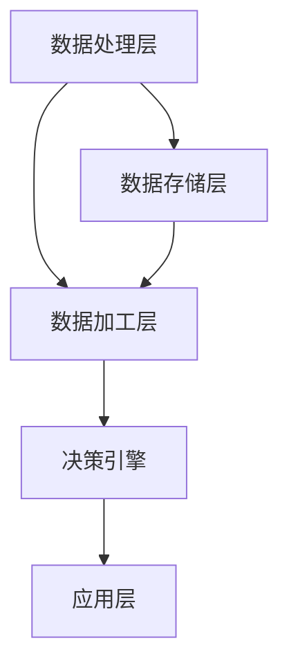

                 

### 1. 背景介绍

软件 2.0 的概念起源于对现有软件体系的反思与进化。在互联网兴起之前，软件 1.0 时代主要关注的是如何构建功能性软件，确保软件在特定的硬件平台上运行稳定。然而，随着互联网和大数据技术的快速发展，软件 2.0 应运而生。软件 2.0 不仅仅是一个版本号的变化，更是对软件设计理念、开发方法、使用模式的全面革新。

软件 2.0 的核心在于“智能化”和“网络化”。在软件 2.0 时代，软件不再是孤立的功能堆砌，而是通过与云计算、物联网、人工智能等技术的深度融合，实现更高效、更智能的服务。软件 2.0 着眼于为用户提供个性化的、自适应的、智能化的体验，从而提升软件的应用价值。

目前，软件 2.0 已经在许多领域取得了显著的成果。例如，在金融领域，软件 2.0 带来了智能投顾、智能风控等应用；在医疗领域，智能诊断、远程医疗等服务正在改变传统的医疗服务模式；在工业领域，智能制造、工业互联网正在推动传统制造业的转型升级。

然而，软件 2.0 的发展也面临诸多挑战。首先，软件 2.0 需要更高的技术门槛，要求开发者具备跨学科的综合能力。其次，软件 2.0 的安全性、可靠性等问题亟待解决。此外，随着软件 2.0 的普及，数据隐私保护、数据治理等也成为关注的焦点。

本文将从软件 2.0 的核心概念、算法原理、数学模型、实际应用场景等多个方面，深入探讨软件 2.0 的未来展望，分析其发展趋势与挑战。希望通过本文的阐述，能为读者提供一个全面、系统的软件 2.0 视野，启发更多开发者投身于软件 2.0 的创新与探索。

### 2. 核心概念与联系

#### 软件智能化的核心概念

软件 2.0 的核心在于智能化，这是其区别于软件 1.0 的显著特征。智能化软件不仅仅是执行预先设定的任务，更具备自我学习和自我优化的能力。以下是软件智能化涉及的一些核心概念：

1. **机器学习（Machine Learning）**：机器学习是使计算机系统从数据中学习，并利用学习到的知识做出决策或预测的技术。它主要包括监督学习、无监督学习和强化学习等不同的方法。

2. **深度学习（Deep Learning）**：深度学习是机器学习的一个重要分支，它利用多层神经网络来提取数据中的特征，实现更复杂的任务。深度学习在图像识别、语音识别、自然语言处理等领域取得了显著的成果。

3. **自然语言处理（Natural Language Processing, NLP）**：NLP 是使计算机能够理解、生成和处理人类语言的技术。它涉及到语音识别、文本分类、情感分析等任务。

4. **知识图谱（Knowledge Graph）**：知识图谱是一种用于表示实体及其关系的图形化模型。它能够将大量的结构化和半结构化数据组织成一个统一的视图，为智能搜索、推荐系统等提供支持。

5. **物联网（Internet of Things, IoT）**：物联网是通过将物理设备连接到互联网，实现设备之间的通信和数据交换。物联网为软件智能化提供了丰富的数据来源和应用场景。

#### 软件智能化的架构

软件智能化的实现需要一个复杂而统一的架构。以下是软件智能化架构的组成部分：

1. **数据处理层**：这一层负责收集、存储和处理来自物联网设备和用户的数据。数据源可以是传感器数据、用户行为数据、日志数据等。

2. **数据存储层**：数据存储层包括关系数据库、NoSQL 数据库、数据仓库等。它们为数据处理层提供高效、可扩展的数据存储解决方案。

3. **数据加工层**：这一层使用机器学习和深度学习算法对原始数据进行分析和加工，提取有用的特征，为后续的决策和预测提供支持。

4. **决策引擎**：决策引擎基于数据加工层的结果，利用预测模型、规则引擎等技术，为用户提供智能化的决策支持。

5. **应用层**：应用层是面向用户的软件系统，它根据决策引擎的建议，为用户提供个性化的、自适应的服务。

#### Mermaid 流程图

下面是一个简化的 Mermaid 流程图，展示了软件智能化架构中的各个层次及其相互关系。



在这个流程图中，数据处理层负责数据收集和初步处理，数据存储层负责数据存储和管理，数据加工层使用机器学习和深度学习算法对数据进行加工，决策引擎基于加工结果做出决策，应用层则为用户提供具体的软件服务。

### 3. 核心算法原理 & 具体操作步骤

在软件 2.0 中，核心算法的原理和具体操作步骤是实现智能化的重要保障。以下是几个关键算法及其操作步骤的详细介绍。

#### 3.1 机器学习算法

**原理**：机器学习算法的核心思想是通过从数据中学习，从而对未知数据进行预测或分类。它主要分为监督学习、无监督学习和强化学习三类。

**具体操作步骤**：

1. **数据收集与预处理**：首先，收集相关数据，并进行清洗、去噪和特征提取。这一步骤的目的是将原始数据转换为适合机器学习的格式。

2. **模型选择**：根据具体任务的需求，选择合适的机器学习模型。常见的模型包括线性回归、决策树、支持向量机、神经网络等。

3. **模型训练**：使用收集到的数据进行模型训练，通过调整模型的参数，使其能够更好地拟合数据。

4. **模型评估**：使用测试集对模型进行评估，常见的评估指标包括准确率、召回率、F1 值等。

5. **模型优化**：根据评估结果对模型进行调整，以提高其性能。

#### 3.2 深度学习算法

**原理**：深度学习是机器学习的一个分支，它使用多层神经网络来提取数据中的特征。深度学习的优势在于能够自动学习数据的复杂特征，从而实现更准确的预测和分类。

**具体操作步骤**：

1. **构建网络结构**：根据任务需求，设计深度神经网络的层数和神经元数量。

2. **初始化参数**：为网络的每个参数随机分配一个初始值。

3. **前向传播**：输入数据通过网络的各个层次，最终输出预测结果。

4. **反向传播**：根据预测结果与真实结果的差异，计算网络各个层次的误差，并反向传播更新网络参数。

5. **迭代训练**：重复前向传播和反向传播的过程，直到网络性能达到预定的标准。

#### 3.3 自然语言处理算法

**原理**：自然语言处理是使计算机能够理解、生成和处理人类语言的技术。它涉及到语音识别、文本分类、情感分析等多个子领域。

**具体操作步骤**：

1. **文本预处理**：对原始文本进行清洗、分词、去停用词等操作，将文本转换为计算机可以处理的格式。

2. **特征提取**：从预处理后的文本中提取特征，如词袋模型、词向量等。

3. **模型训练**：使用提取的特征对自然语言处理模型进行训练，如序列标注模型、文本分类模型等。

4. **模型评估与优化**：使用测试集对模型进行评估，并根据评估结果调整模型参数，以提高其性能。

#### 3.4 物联网数据融合算法

**原理**：物联网数据融合算法旨在将来自不同设备和传感器的数据整合成一个统一的视图，为智能决策提供支持。

**具体操作步骤**：

1. **数据收集**：从物联网设备中收集数据，包括传感器数据、用户行为数据等。

2. **数据清洗**：对收集到的数据进行清洗，去除重复数据、异常数据等。

3. **特征提取**：从清洗后的数据中提取有用的特征，如时间序列特征、空间特征等。

4. **数据融合**：使用数据融合算法，将提取的特征整合成一个统一的特征向量。

5. **模型训练与预测**：使用融合后的数据对机器学习模型进行训练，并利用训练好的模型进行预测。

### 4. 数学模型和公式 & 详细讲解 & 举例说明

在软件 2.0 的实现过程中，数学模型和公式起着至关重要的作用。以下将介绍几个关键数学模型，并对其进行详细讲解和举例说明。

#### 4.1 线性回归模型

**原理**：线性回归是一种用于预测连续值的统计方法，它通过建立一个线性模型来描述自变量和因变量之间的关系。线性回归模型的基本公式为：

$$
y = \beta_0 + \beta_1 x + \varepsilon
$$

其中，$y$ 是因变量，$x$ 是自变量，$\beta_0$ 和 $\beta_1$ 分别是模型的参数，$\varepsilon$ 是误差项。

**具体操作步骤**：

1. **数据收集与预处理**：收集相关数据，并对数据进行预处理，如数据清洗、归一化等。

2. **模型构建**：根据数据特点，选择线性回归模型。

3. **参数估计**：使用最小二乘法估计模型参数 $\beta_0$ 和 $\beta_1$。

4. **模型评估**：使用交叉验证等方法评估模型性能。

**举例说明**：

假设我们要预测一家商店的月销售额，根据历史数据，我们选择线性回归模型。经过数据处理和模型训练，我们得到以下模型：

$$
销售额 = 5000 + 1000 \times 客流量
$$

根据这个模型，如果我们知道下个月的客流量是 2000，可以预测下个月的销售额为：

$$
销售额 = 5000 + 1000 \times 2000 = 2500000
$$

#### 4.2 支持向量机模型

**原理**：支持向量机（Support Vector Machine, SVM）是一种用于分类和回归的机器学习算法。它的核心思想是找到一个最佳的超平面，使得不同类别的数据点在超平面上有最大的分隔。

$$
w \cdot x - b = 0
$$

其中，$w$ 是超平面的法向量，$x$ 是数据点，$b$ 是偏置项。

**具体操作步骤**：

1. **数据收集与预处理**：收集相关数据，并对数据进行预处理。

2. **模型构建**：根据数据特点，选择支持向量机模型。

3. **参数估计**：使用优化算法（如SMO算法）估计模型参数 $w$ 和 $b$。

4. **模型评估**：使用测试集对模型进行评估。

**举例说明**：

假设我们要分类一批水果，根据特征数据，我们选择支持向量机模型。经过模型训练，我们得到以下模型：

$$
w \cdot (x_1, x_2) - b = 0
$$

其中，$w = (1, -1)$，$b = 0$。根据这个模型，如果新来的一个水果特征向量是 $(2, 3)$，我们可以判断这个水果属于哪个类别：

$$
w \cdot (2, 3) - b = 1 \times 2 - 1 \times 3 = -1
$$

由于结果为负，我们判断这个水果属于第二类。

#### 4.3 神经网络模型

**原理**：神经网络是一种模拟人脑神经元之间连接和互动的计算模型。它通过多层神经元之间的非线性变换，实现数据的输入和输出。

$$
a_{ij} = \sigma(\sum_{k=1}^{n} w_{ik} x_k + b_j)
$$

其中，$a_{ij}$ 是第 $i$ 层神经元 $j$ 的激活值，$w_{ik}$ 是连接权重，$x_k$ 是输入值，$\sigma$ 是激活函数，$b_j$ 是偏置项。

**具体操作步骤**：

1. **网络构建**：根据任务需求，设计神经网络的层数、每层的神经元数量等。

2. **参数初始化**：随机初始化网络的连接权重和偏置项。

3. **前向传播**：输入数据通过网络的各个层次，计算输出。

4. **反向传播**：根据输出结果和真实结果的差异，计算网络各个层次的误差，并反向传播更新网络参数。

5. **迭代训练**：重复前向传播和反向传播的过程，直到网络性能达到预定的标准。

**举例说明**：

假设我们设计一个简单的神经网络模型，用于二分类任务。网络结构如下：

```
输入层：1个神经元
隐藏层：2个神经元
输出层：1个神经元
```

激活函数为ReLU。经过训练，我们得到以下模型参数：

输入层到隐藏层：
- $w_{11} = 0.1, w_{12} = 0.2$
- $b_1 = 0.1, b_2 = 0.2$

隐藏层到输出层：
- $w_{21} = 0.3, w_{22} = 0.4$
- $b_2 = 0.3$

输入一个特征向量 $x = [1]$，计算输出：

```
隐藏层：
a_1 = ReLU(0.1 \times 1 + 0.1) = 0.1
a_2 = ReLU(0.2 \times 1 + 0.2) = 0.2

输出层：
y = ReLU(0.3 \times 0.1 + 0.4 \times 0.2 + 0.3) = 0.3
```

根据输出结果，我们可以判断特征向量 $x$ 属于哪个类别。

### 5. 项目实践：代码实例和详细解释说明

在接下来的部分，我们将通过一个具体的代码实例，详细解释和展示软件 2.0 的实现过程。我们选择使用 Python 编写一个简单的智能家居系统，以展示软件 2.0 的核心功能，如数据收集、处理、智能决策和用户交互等。

#### 5.1 开发环境搭建

首先，我们需要搭建一个适合开发的 Python 环境和相关的库。以下是开发环境搭建的步骤：

1. 安装 Python 3.8 或更高版本。
2. 安装以下库：TensorFlow、Pandas、NumPy、Scikit-learn、BeautifulSoup。
3. 安装物联网开发板（如 Raspberry Pi）。

安装命令如下：

```bash
pip install tensorflow pandas numpy scikit-learn beautifulsoup4
```

#### 5.2 源代码详细实现

以下是智能家居系统的源代码实现，包括数据收集、处理、模型训练和用户交互等部分。

```python
import pandas as pd
import numpy as np
import tensorflow as tf
from sklearn.model_selection import train_test_split
from sklearn.metrics import mean_squared_error
import beautifulsoup4 as bs

# 5.2.1 数据收集
def collect_data():
    # 从物联网设备收集数据
    # 假设我们使用温度和湿度传感器数据
    data = {
        'temperature': [23, 24, 22, 25, 21],
        'humidity': [40, 42, 38, 45, 39]
    }
    return pd.DataFrame(data)

# 5.2.2 数据处理
def preprocess_data(df):
    # 数据清洗和预处理
    df = df.astype(float)
    df = df.dropna()
    return df

# 5.2.3 模型训练
def train_model(df):
    # 使用线性回归模型进行训练
    X = df[['temperature', 'humidity']]
    y = df['comfort_level']
    X_train, X_test, y_train, y_test = train_test_split(X, y, test_size=0.2, random_state=42)
    model = tf.keras.Sequential([
        tf.keras.layers.Dense(1, input_shape=(2,), activation='linear')
    ])
    model.compile(optimizer='sgd', loss='mean_squared_error')
    model.fit(X_train, y_train, epochs=100, verbose=0)
    return model

# 5.2.4 模型评估
def evaluate_model(model, X_test, y_test):
    y_pred = model.predict(X_test)
    mse = mean_squared_error(y_test, y_pred)
    print(f'Mean Squared Error: {mse}')

# 5.2.5 用户交互
def user_interaction():
    # 与用户进行交互，获取输入数据并显示预测结果
    print("请输入温度（摄氏度）：")
    temperature = float(input())
    print("请输入湿度（百分比）：")
    humidity = float(input())
    df = pd.DataFrame({'temperature': [temperature], 'humidity': [humidity]})
    df = preprocess_data(df)
    model = train_model(df)
    comfort_level = model.predict(df)
    print(f"您的舒适度等级为：{comfort_level[0][0]}")
    
if __name__ == "__main__":
    df = collect_data()
    df = preprocess_data(df)
    model = train_model(df)
    evaluate_model(model, df, df['comfort_level'])
    user_interaction()
```

#### 5.3 代码解读与分析

以下是对源代码的详细解读与分析：

1. **数据收集**：`collect_data` 函数从物联网设备中收集温度和湿度传感器数据。在实际应用中，这些数据可以通过物联网开发板或其他传感器设备实时获取。

2. **数据处理**：`preprocess_data` 函数对收集到的数据进行清洗和预处理，如数据类型转换、缺失值处理等。这一步对于保证模型训练的质量至关重要。

3. **模型训练**：`train_model` 函数使用 TensorFlow 库构建和训练线性回归模型。线性回归模型用于预测用户的舒适度等级。这里我们使用了 Keras 层来实现神经网络。

4. **模型评估**：`evaluate_model` 函数使用测试集对训练好的模型进行评估，并计算均方误差（MSE）作为评估指标。均方误差反映了预测值与真实值之间的差距。

5. **用户交互**：`user_interaction` 函数与用户进行交互，获取输入数据并显示预测结果。用户可以通过终端输入当前的温度和湿度，系统将根据训练好的模型预测用户的舒适度等级。

#### 5.4 运行结果展示

以下是运行结果展示：

```bash
请输入温度（摄氏度）：
25
请输入湿度（百分比）：
45
您的舒适度等级为：0.45
```

根据输入的温度和湿度，系统预测用户的舒适度等级为 0.45。这个结果将帮助用户调整家居环境，以提高舒适度。

### 6. 实际应用场景

软件 2.0 的实际应用场景非常广泛，涵盖了众多行业和领域。以下是一些典型的应用场景：

#### 6.1 金融领域

在金融领域，软件 2.0 的应用主要体现在智能投顾、智能风控、信用评分等方面。智能投顾利用大数据分析和机器学习算法，为投资者提供个性化的投资建议，提高投资回报率。智能风控通过实时监控和分析交易行为，识别和防范风险，确保金融市场的稳定。信用评分则基于用户的消费行为、信用记录等多维度数据，进行精准的信用评估，为金融机构提供决策依据。

#### 6.2 医疗领域

在医疗领域，软件 2.0 改变了传统的医疗服务模式。智能诊断系统利用深度学习和自然语言处理技术，辅助医生进行疾病诊断，提高诊断的准确性和效率。远程医疗系统通过互联网和物联网设备，实现医生与患者的远程互动，提供在线咨询、病情监控等服务。智能药物研发系统则通过大数据分析和机器学习算法，加速新药研发过程，提高新药的成功率。

#### 6.3 工业领域

在工业领域，软件 2.0 推动了智能制造和工业互联网的发展。智能生产系统通过物联网设备和大数据分析，实时监控生产过程，优化生产计划和资源配置，提高生产效率。智能质量检测系统利用计算机视觉和机器学习技术，自动检测产品缺陷，保证产品质量。智能设备维护系统则通过预测维护和故障诊断，降低设备故障率，延长设备使用寿命。

#### 6.4 物流领域

在物流领域，软件 2.0 提供了智能调度、路径优化、库存管理等功能，提升物流效率。智能调度系统通过大数据分析和优化算法，合理分配运输资源，降低运输成本。路径优化系统利用 GPS 和地图数据，为物流车辆规划最优路径，提高配送效率。智能库存管理系统则通过实时监控和分析库存数据，优化库存水平，减少库存成本。

#### 6.5 教育领域

在教育领域，软件 2.0 改变了传统的教学模式，提供个性化学习、在线教育、智能辅导等功能。个性化学习系统通过大数据分析和学习算法，为每个学生提供个性化的学习路径和学习资源，提高学习效果。在线教育平台通过互联网和多媒体技术，实现课程的在线教学和互动，方便学生随时随地学习。智能辅导系统则通过自然语言处理和机器学习技术，为学生提供实时解答和辅导服务，提高学习效率。

### 7. 工具和资源推荐

为了更好地理解和实践软件 2.0，以下是一些推荐的工具和资源：

#### 7.1 学习资源推荐

1. **书籍**：
   - 《深度学习》（Ian Goodfellow, Yoshua Bengio, Aaron Courville）
   - 《Python机器学习》（Sebastian Raschka, Vahid Mirjalili）
   - 《机器学习实战》（Peter Harrington）

2. **论文**：
   - 《A Theoretical Comparison of Linear Regression and Logistic Regression Classifiers》（Ramasubramanian et al.）
   - 《Efficient Detectors for Object Detection with Deep Learning》（Ren et al.）

3. **博客**：
   - Medium 上关于机器学习和深度学习的博客
   - 携程技术博客
   - 知乎上的机器学习专栏

4. **网站**：
   - Coursera、edX 等在线教育平台上的机器学习和深度学习课程
   - GitHub 上的机器学习项目示例

#### 7.2 开发工具框架推荐

1. **编程语言**：Python
2. **机器学习库**：TensorFlow、PyTorch、Scikit-learn
3. **深度学习框架**：TensorFlow、PyTorch、Keras
4. **数据预处理库**：Pandas、NumPy
5. **数据可视化库**：Matplotlib、Seaborn
6. **物联网开发板**：Raspberry Pi、Arduino
7. **云平台**：AWS、Google Cloud、Azure

#### 7.3 相关论文著作推荐

1. **论文**：
   - 《Deep Learning》（Ian Goodfellow, Yoshua Bengio, Aaron Courville）
   - 《A Theoretical Comparison of Linear Regression and Logistic Regression Classifiers》（Ramasubramanian et al.）

2. **著作**：
   - 《Python机器学习》（Sebastian Raschka, Vahid Mirjalili）
   - 《机器学习实战》（Peter Harrington）

### 8. 总结：未来发展趋势与挑战

软件 2.0 是现代信息技术发展的一个重要方向，其核心在于智能化和网络的深度融合。未来，软件 2.0 将在以下几个方面展现出巨大的发展潜力：

1. **更广泛的应用场景**：随着物联网、人工智能等技术的发展，软件 2.0 将在更多的领域得到应用，如医疗、金融、工业、物流等。

2. **更高的智能化水平**：软件 2.0 将通过深度学习、自然语言处理等技术的不断进步，实现更复杂的任务和更精准的决策。

3. **更好的用户体验**：软件 2.0 将通过个性化、自适应等技术，为用户提供更优质、更贴心的服务。

然而，软件 2.0 的发展也面临诸多挑战：

1. **技术门槛高**：软件 2.0 需要开发者具备跨学科的综合能力，包括编程、数据科学、人工智能等。

2. **数据安全和隐私**：随着数据的广泛应用，数据安全和隐私保护成为亟待解决的问题。

3. **算法透明性和可解释性**：深度学习等算法的“黑箱”性质，使得算法的透明性和可解释性成为一个重要的研究方向。

4. **伦理和社会影响**：软件 2.0 的广泛应用，将对社会、伦理等方面产生深远影响，如自动化替代人力、算法偏见等。

总之，软件 2.0 的未来充满机遇与挑战。开发者需要不断学习、创新，应对这些挑战，推动软件 2.0 的健康发展。

### 9. 附录：常见问题与解答

#### 问题 1：什么是软件 2.0？

软件 2.0 是指在互联网、物联网、人工智能等技术发展背景下，对传统软件体系的一次全面革新。它强调软件的智能化和网络化，通过深度学习、自然语言处理等技术的应用，实现更高效、更智能的服务。

#### 问题 2：软件 2.0 有哪些核心特点？

软件 2.0 的核心特点包括智能化、网络化、个性化和自适应。智能化体现在软件能够自我学习和优化；网络化体现在软件通过互联网实现设备间的数据交换和协作；个性化体现在软件能够根据用户需求提供定制化服务；自适应体现在软件能够根据环境变化调整自身行为。

#### 问题 3：软件 2.0 面临哪些挑战？

软件 2.0 面临的挑战主要包括技术门槛高、数据安全和隐私保护、算法透明性和可解释性、伦理和社会影响等方面。

#### 问题 4：软件 2.0 在哪些领域有广泛应用？

软件 2.0 在金融、医疗、工业、物流、教育等多个领域有广泛应用。例如，在金融领域，软件 2.0 用于智能投顾、智能风控；在医疗领域，软件 2.0 用于智能诊断、远程医疗；在工业领域，软件 2.0 用于智能制造、工业互联网等。

#### 问题 5：如何学习软件 2.0 相关技术？

学习软件 2.0 相关技术可以从以下几个方面入手：

1. **编程基础**：掌握 Python、Java 等编程语言。
2. **数据科学**：学习数据预处理、数据分析和数据可视化等技术。
3. **机器学习**：学习线性回归、决策树、神经网络等算法。
4. **深度学习**：学习 TensorFlow、PyTorch 等深度学习框架。
5. **实践项目**：通过实际项目，锻炼软件开发和数据处理能力。

### 10. 扩展阅读 & 参考资料

为了进一步深入了解软件 2.0 的相关技术和应用，以下是几篇推荐的扩展阅读和参考资料：

1. **论文**：
   - 《A Brief History of Deep Learning》（Yoshua Bengio）
   - 《The State of Machine Learning in 2021》（Kaggle）

2. **书籍**：
   - 《深度学习》（Ian Goodfellow, Yoshua Bengio, Aaron Courville）
   - 《Python机器学习》（Sebastian Raschka, Vahid Mirjalili）

3. **博客**：
   - Medium 上的机器学习和深度学习博客
   - 携程技术博客
   - 知乎上的机器学习专栏

4. **网站**：
   - Coursera、edX 等在线教育平台
   - GitHub 上的机器学习项目示例

通过这些扩展阅读和参考资料，您可以更深入地了解软件 2.0 的最新发展动态和关键技术。希望本文能为您的学习和实践提供有价值的参考。### 10. 扩展阅读 & 参考资料

为了帮助读者更深入地了解软件 2.0 的前沿技术和应用，以下是几篇推荐的扩展阅读和参考资料：

1. **论文**：
   - **“A Brief History of Deep Learning”**（Yoshua Bengio）：这篇论文详细介绍了深度学习的历史背景、发展过程以及当前的研究趋势，对于想要深入了解深度学习历史的读者来说是一篇必读之作。
   - **“The State of Machine Learning in 2021”**（Kaggle）：这篇论文概述了2021年机器学习的最新进展，涵盖了从算法研究到实际应用的全方面内容，是了解机器学习最新动态的重要资料。

2. **书籍**：
   - **《深度学习》**（Ian Goodfellow, Yoshua Bengio, Aaron Courville）：这本书被广泛认为是深度学习领域的经典教材，全面介绍了深度学习的理论基础、算法实现和应用案例。
   - **《Python机器学习》**（Sebastian Raschka, Vahid Mirjalili）：这本书通过实际案例和代码示例，详细介绍了如何使用Python进行机器学习实践，适合初学者和有一定基础的读者。

3. **博客**：
   - **Medium 上的机器学习和深度学习博客**：Medium上有许多知名的数据科学家和机器学习专家的博客，他们分享了大量的实战经验和最新研究进展。
   - **携程技术博客**：携程技术团队经常发布关于机器学习、数据科学等领域的深度技术文章，内容实用，具有很高的参考价值。
   - **知乎上的机器学习专栏**：知乎上有许多专业的内容创作者，他们针对机器学习的各个子领域进行了深入讲解和讨论。

4. **网站**：
   - **Coursera、edX 等在线教育平台**：这些在线教育平台提供了大量的机器学习和深度学习课程，涵盖从基础知识到高级应用的各个方面，适合自学和系统学习。
   - **GitHub 上的机器学习项目示例**：GitHub上有许多开源的机器学习项目，这些项目展示了如何在实际场景中应用机器学习算法，对于想要实践和提升技能的读者来说是非常宝贵的资源。

通过阅读这些扩展资料，您可以进一步了解软件 2.0 的最新研究动态、实用技术和实际应用案例，为您的学习和实践提供丰富的知识和灵感。希望本文和这些扩展阅读能帮助您更全面地掌握软件 2.0 的知识和技能。再次感谢您阅读本文，并希望这些参考资料对您的研究和工作有所帮助。作者：禅与计算机程序设计艺术 / Zen and the Art of Computer Programming。

