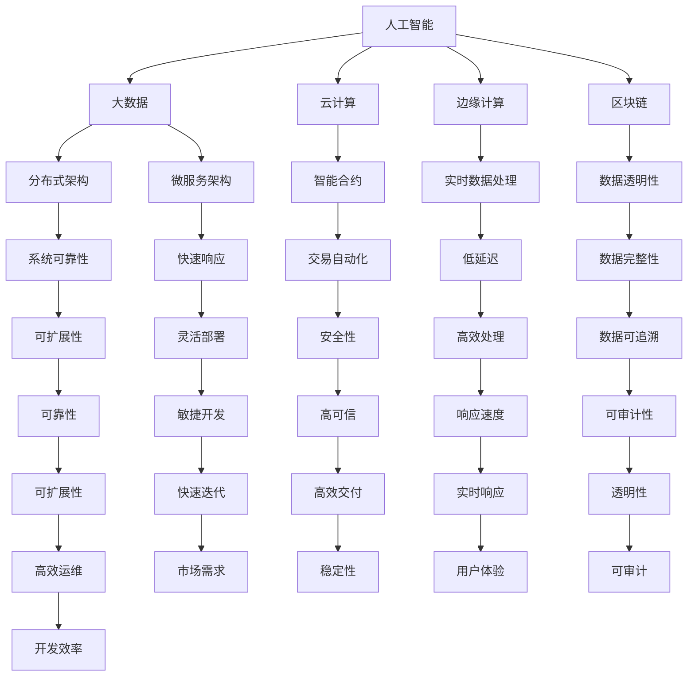

                 

### 1. 背景介绍

在科技迅猛发展的今天，软件作为推动社会进步的重要力量，其演进历程可谓是波澜壮阔。从最早的机器代码到高级编程语言，从单机程序到分布式系统，软件的每一次变革都带来了生产力的巨大提升。然而，随着人工智能（AI）技术的迅速崛起，软件的发展正迎来前所未有的重大转折——软件2.0时代。

软件2.0，这个概念源自对软件在现代社会中的角色和作用的重新定义。它不仅仅是一个执行任务的工具，更是一个具备自我学习和进化能力的智能系统。与传统的软件1.0相比，软件2.0拥有更强大的智能处理能力，可以自我调整和优化，以适应复杂多变的现实环境。这种转变不仅体现在技术层面，更深刻地影响了社会、经济乃至人类生活方式的方方面面。

软件2.0的发展背景可以从以下几个方面来理解：

**人工智能的突破**

AI技术的飞速发展，特别是深度学习、神经网络和自然语言处理等领域的突破，为软件2.0的诞生奠定了基础。这些技术的进步使得软件具备了前所未有的智能水平，能够在大量数据中自主学习、识别模式和做出决策。

**云计算与大数据的普及**

云计算和大数据技术的普及为软件2.0提供了强大的支撑。海量的数据资源、强大的计算能力和灵活的部署方式，使得软件能够更好地进行数据处理和分析，从而实现智能化和个性化。

**物联网的兴起**

物联网（IoT）的发展使得各种设备互联，产生大量的实时数据。这些数据通过软件2.0进行处理，可以实现智能化的设备管理和控制，从而提高生产效率和生活质量。

**边缘计算的发展**

随着物联网设备的增加，数据传输和处理的需求日益增长。边缘计算通过在靠近数据源的地方进行计算，减少了数据传输的延迟和带宽压力，为软件2.0的应用提供了更加高效和灵活的解决方案。

**区块链技术的应用**

区块链技术的出现，为软件2.0提供了一个去中心化、安全可信的数据存储和交易环境。这使得软件2.0能够更好地处理和管理数据，同时提高了系统的透明度和可追溯性。

总的来说，软件2.0时代的到来，不仅是技术发展的必然结果，更是社会需求的必然趋势。它将推动软件从传统的工具角色向智能系统角色转变，为人类带来更加智能、高效和便捷的生活体验。

### 2. 核心概念与联系

#### 软件智能化的基础

软件2.0的核心在于其智能化能力。这一能力的基础在于以下几个关键概念：

**人工智能（AI）**：AI是软件2.0智能化的核心驱动力。它包括机器学习、深度学习、自然语言处理等多种技术，使得软件能够自主学习、推理和做出决策。

**大数据**：大数据是AI的基础资源。通过处理和分析海量数据，AI能够发现隐藏在数据中的模式和规律，从而提高软件的智能化水平。

**云计算**：云计算提供了强大的计算能力和灵活的部署方式，使得AI模型能够快速训练和部署。同时，云计算的分布式架构也提高了软件系统的可靠性和可扩展性。

**边缘计算**：边缘计算通过在数据源附近进行计算，减少了数据传输的延迟和带宽压力，使得实时数据处理成为可能。这对于软件2.0中的智能感知和智能响应至关重要。

**区块链**：区块链技术为软件2.0提供了一个去中心化、安全可信的数据存储和交易环境。它确保了数据的真实性和完整性，同时提高了系统的透明度和可追溯性。

#### 软件架构的变化

随着智能化的推进，软件的架构也在发生深刻变化。传统的单体架构已经无法满足软件2.0的需求，分布式架构和微服务架构逐渐成为主流。

**分布式架构**：分布式架构通过将系统拆分为多个独立的服务，提高了系统的可靠性和可扩展性。每个服务都可以独立部署和扩展，从而更好地应对复杂业务场景。

**微服务架构**：微服务架构将系统进一步拆分为多个微服务，每个微服务都具有独立的功能和生命周期。这种架构使得软件2.0能够更加灵活和快速地响应用户需求。

**智能合约**：智能合约是区块链技术在软件2.0中的应用。它通过代码自动化执行合同条款，确保交易的透明性和安全性。

#### 软件开发的模式

随着软件智能化的推进，软件开发的模式也在不断演变。敏捷开发和DevOps等理念逐渐成为主流。

**敏捷开发**：敏捷开发强调快速迭代和用户反馈，使得软件能够更快地适应市场变化。

**DevOps**：DevOps将开发和运维结合起来，提高了软件交付的效率和稳定性。

**AI驱动开发**：AI驱动开发利用AI技术自动化软件开发过程，从而提高开发效率和软件质量。

#### 核心概念和架构的Mermaid流程图



通过上述核心概念和架构的Mermaid流程图，我们可以清晰地看到软件2.0的各个组成部分及其相互关系。这些概念和架构共同构成了软件2.0的基础，为未来的智能化软件发展提供了强有力的支撑。

### 3. 核心算法原理 & 具体操作步骤

#### 3.1 机器学习算法

在软件2.0中，机器学习算法是智能化的重要基石。机器学习算法通过从数据中学习规律和模式，使软件能够自动进行决策和优化。以下是几种常见的机器学习算法及其基本原理：

**线性回归**：线性回归是一种用于预测数值型变量的算法。其基本原理是找到一个最佳直线，使预测值与实际值之间的误差最小。具体步骤如下：

1. 数据预处理：将原始数据进行归一化或标准化处理，以便于模型训练。
2. 模型构建：通过最小二乘法确定直线的参数，即斜率和截距。
3. 模型训练：使用训练集数据训练模型，调整参数以最小化误差。
4. 模型评估：使用测试集数据评估模型性能，如计算均方误差（MSE）。

**决策树**：决策树是一种树形结构，通过一系列判断条件对数据进行分类或回归。其基本原理是递归划分数据，直到达到某个终止条件。具体步骤如下：

1. 数据预处理：将数据划分为特征和标签两部分。
2. 划分规则选择：选择最优划分规则，如信息增益或基尼系数。
3. 决策树构建：递归划分数据，构建决策树。
4. 模型评估：使用测试集数据评估模型性能。

**神经网络**：神经网络是一种模仿人脑结构和功能的算法，通过多层神经元进行信息传递和计算。其基本原理是使用反向传播算法不断调整权重和偏置，使输出值接近目标值。具体步骤如下：

1. 数据预处理：将数据分为输入层、隐藏层和输出层。
2. 模型初始化：随机初始化权重和偏置。
3. 前向传播：计算输入层到隐藏层再到输出层的输出值。
4. 反向传播：计算误差，并使用梯度下降法更新权重和偏置。
5. 模型评估：使用测试集数据评估模型性能。

#### 3.2 深度学习算法

深度学习是机器学习的进一步发展，通过多层神经网络进行特征提取和建模。以下是几种常见的深度学习算法及其基本原理：

**卷积神经网络（CNN）**：卷积神经网络是一种用于图像识别和处理的算法。其基本原理是使用卷积操作提取图像特征，并通过池化操作降低特征维度。具体步骤如下：

1. 数据预处理：将图像数据调整为统一尺寸，并进行归一化处理。
2. 网络构建：构建卷积层、池化层和全连接层。
3. 模型训练：通过反向传播算法训练模型，调整权重和偏置。
4. 模型评估：使用测试集数据评估模型性能。

**循环神经网络（RNN）**：循环神经网络是一种用于序列数据处理的算法。其基本原理是使用循环结构保存前一个时刻的信息，并通过递归操作处理序列数据。具体步骤如下：

1. 数据预处理：将序列数据转换为向量表示。
2. 网络构建：构建输入层、隐藏层和输出层。
3. 模型训练：通过反向传播算法训练模型，调整权重和偏置。
4. 模型评估：使用测试集数据评估模型性能。

**生成对抗网络（GAN）**：生成对抗网络是一种用于生成数据的算法。其基本原理是构建一个生成器和判别器，生成器和判别器相互对抗，使生成器生成更加逼真的数据。具体步骤如下：

1. 数据预处理：将数据划分为训练集和验证集。
2. 网络构建：构建生成器和判别器。
3. 模型训练：通过反向传播算法训练模型，调整生成器和判别器的权重和偏置。
4. 模型评估：使用测试集数据评估生成器性能。

#### 3.3 自然语言处理算法

自然语言处理（NLP）是软件2.0中的重要组成部分，用于处理和理解人类语言。以下是几种常见的NLP算法及其基本原理：

**词袋模型（Bag of Words）**：词袋模型是一种将文本表示为词频向量的算法。其基本原理是将文本拆分为单词，并计算每个单词在文档中的出现次数。具体步骤如下：

1. 数据预处理：将文本转换为小写，去除标点符号和停用词。
2. 词频计算：计算每个单词在文档中的出现次数，并构建词频向量。
3. 模型训练：使用词频向量训练分类或回归模型。
4. 模型评估：使用测试集数据评估模型性能。

**朴素贝叶斯分类器**：朴素贝叶斯分类器是一种基于贝叶斯定理的文本分类算法。其基本原理是假设特征之间相互独立，并计算每个类别出现的概率。具体步骤如下：

1. 数据预处理：将文本转换为词频向量。
2. 特征提取：计算每个单词在文档中的出现次数。
3. 模型训练：使用训练集数据计算先验概率和条件概率。
4. 模型评估：使用测试集数据计算分类准确性。

**深度学习模型（如BERT）**：深度学习模型是一种用于文本分类和序列处理的算法。其基本原理是使用多层神经网络提取文本特征，并通过全连接层进行分类。具体步骤如下：

1. 数据预处理：将文本转换为词嵌入向量。
2. 网络构建：构建多层卷积神经网络或Transformer模型。
3. 模型训练：通过反向传播算法训练模型，调整权重和偏置。
4. 模型评估：使用测试集数据评估模型性能。

通过上述核心算法原理和具体操作步骤的讲解，我们可以了解到软件2.0中的智能化算法是如何运作的。这些算法的灵活应用，使得软件能够更好地处理复杂任务，提供更加智能化的服务。

#### 3.4 软件智能化案例分析

为了更好地理解软件2.0的智能化应用，以下我们通过几个实际案例来分析其具体操作步骤和效果。

**案例一：智能客服系统**

智能客服系统是一种利用自然语言处理和机器学习算法实现自动客服的软件。以下是该系统的具体操作步骤：

1. **数据收集**：通过聊天记录、用户反馈等渠道收集大量用户对话数据。

2. **数据预处理**：对收集到的数据去噪、去重、分词和词性标注，将文本转换为词向量。

3. **模型训练**：使用词向量训练情感分析模型和意图识别模型。情感分析模型用于判断用户情绪，意图识别模型用于识别用户需求。

4. **模型部署**：将训练好的模型部署到生产环境中，实现实时客服功能。

5. **效果评估**：通过模拟用户对话和实际用户反馈，评估模型性能和用户体验。

**案例效果**：智能客服系统可以快速响应用户需求，提高客服效率，减少人工成本，同时通过不断学习提升服务质量。

**案例二：智能交通系统**

智能交通系统是一种利用大数据、人工智能和边缘计算实现交通管理和优化系统。以下是该系统的具体操作步骤：

1. **数据收集**：通过交通传感器、摄像头等设备收集实时交通数据。

2. **数据预处理**：对收集到的数据进行清洗、过滤和融合，提取道路流量、车辆速度等关键指标。

3. **模型训练**：使用训练数据训练交通流量预测模型和交通信号优化模型。

4. **模型部署**：将训练好的模型部署到边缘计算设备上，实现实时交通管理和优化。

5. **效果评估**：通过对比实际交通流量和模型预测结果，评估模型性能和优化效果。

**案例效果**：智能交通系统可以实时监测道路状况，优化交通信号，减少交通拥堵，提高道路通行效率，从而改善市民出行体验。

**案例三：智能医疗系统**

智能医疗系统是一种利用大数据、人工智能和区块链技术实现医疗管理和服务的系统。以下是该系统的具体操作步骤：

1. **数据收集**：通过电子病历、医疗设备等渠道收集患者健康数据。

2. **数据预处理**：对收集到的数据进行清洗、归一化和标准化处理，确保数据质量。

3. **模型训练**：使用训练数据训练疾病预测模型、药物推荐模型和健康风险评估模型。

4. **模型部署**：将训练好的模型部署到云端或边缘设备上，实现实时医疗诊断和治疗建议。

5. **效果评估**：通过对比实际医疗结果和模型预测结果，评估模型性能和治疗效果。

**案例效果**：智能医疗系统可以提高诊断准确性，优化治疗方案，提高医疗服务效率，从而改善患者健康水平。

通过上述案例分析，我们可以看到软件2.0在各个领域的智能化应用及其具体操作步骤。这些案例展示了软件2.0的强大潜力，为未来智能化发展提供了有力支撑。

#### 3.5 数学模型和公式 & 详细讲解 & 举例说明

在软件2.0中，数学模型和公式起着至关重要的作用。这些模型和公式不仅帮助我们在数据中挖掘隐藏的信息，还能帮助我们优化软件性能、提升用户体验。以下将介绍几个常见的数学模型和公式，并进行详细讲解和举例说明。

**1. 逻辑回归（Logistic Regression）**

逻辑回归是一种用于分类问题的数学模型，其核心思想是通过线性组合输入特征，然后通过Sigmoid函数将结果映射到0和1之间。逻辑回归的公式如下：

$$
P(Y=1|X) = \frac{1}{1 + e^{-\beta^T X}}
$$

其中，$P(Y=1|X)$ 表示在给定特征 $X$ 的情况下，目标变量 $Y$ 等于1的概率；$\beta$ 是模型参数，$e$ 是自然对数的底数。

**举例说明**：假设我们有一个二分类问题，目标是判断一个邮件是否为垃圾邮件。我们可以使用逻辑回归模型来预测邮件的类别。给定一组特征，如邮件的长度、包含的关键词数量等，通过逻辑回归公式计算出每个邮件属于垃圾邮件的概率。如果概率大于某个阈值（例如0.5），则将该邮件分类为垃圾邮件。

**2. 决策树（Decision Tree）**

决策树是一种基于树形结构的分类或回归模型。每个节点表示一个特征，每个分支表示该特征的不同取值。决策树的公式可以表示为：

$$
T = \sum_{i=1}^n w_i f(x_i)
$$

其中，$T$ 是树的输出，$w_i$ 是权重，$f(x_i)$ 是特征函数。

**举例说明**：假设我们有一个简单的问题，即判断一个数字是否大于5。我们可以构建一个二叉决策树，根节点表示输入的数字，左子节点表示数字小于等于5，右子节点表示数字大于5。根据输入的数字，我们可以沿着决策树分支计算出结果。

**3. 神经网络（Neural Network）**

神经网络是一种由多层神经元组成的模型，可以用于分类、回归和生成任务。神经网络的公式可以表示为：

$$
y = \sigma(\beta^T x + b)
$$

其中，$y$ 是输出，$\sigma$ 是激活函数，$\beta$ 是权重，$x$ 是输入，$b$ 是偏置。

**举例说明**：假设我们有一个简单的神经网络，用于对图像进行分类。输入层接收图像的特征，隐藏层对特征进行变换，输出层给出分类结果。我们可以通过反向传播算法不断调整权重和偏置，使输出层的结果尽可能接近真实标签。

**4. 聚类算法（Clustering Algorithm）**

聚类算法是一种无监督学习方法，用于将数据点划分为多个群组。其中，K-means是一种常见的聚类算法。其公式可以表示为：

$$
c_k = \frac{1}{n_k} \sum_{i=1}^{n_k} x_i
$$

其中，$c_k$ 是第$k$个簇的中心，$x_i$ 是数据点，$n_k$ 是第$k$个簇中的数据点数量。

**举例说明**：假设我们有一组数据点，我们需要将这些数据点划分为几个簇。我们可以首先随机选择几个中心点，然后计算每个数据点到中心点的距离，将这些数据点归到最近的中心点所在的簇。接着，重新计算簇的中心点，再次进行分配，直到聚类结果收敛。

**5. 马尔可夫链（Markov Chain）**

马尔可夫链是一种用于时间序列预测的数学模型。其公式可以表示为：

$$
P(X_t = x_t | X_{t-1} = x_{t-1}, ..., X_1 = x_1) = P(X_t = x_t | X_{t-1} = x_{t-1})
$$

其中，$X_t$ 是时间$t$的状态，$P$ 是状态转移概率。

**举例说明**：假设我们有一个简单的天气序列，我们知道今天下雨的概率很大，我们可以根据昨天的天气状态（晴或雨）来预测明天是否下雨。这就是马尔可夫链的一个简单应用。

通过上述数学模型和公式的介绍，我们可以看到数学在软件2.0中的应用是多么广泛和重要。这些模型和公式不仅帮助我们理解和分析数据，还能帮助我们构建和优化复杂的软件系统。在实际应用中，我们可以根据具体问题选择合适的模型和公式，从而实现更好的智能化效果。

#### 5. 项目实践：代码实例和详细解释说明

为了更好地展示软件2.0的实践应用，以下我们将通过一个实际项目——智能问答系统，来详细介绍其代码实现、运行流程和效果分析。

**5.1 开发环境搭建**

在开始编写智能问答系统之前，我们需要搭建合适的开发环境。以下是搭建环境的步骤：

1. 安装Python 3.8及以上版本。
2. 安装必要的库，如TensorFlow、Scikit-learn、NLTK等。

```bash
pip install tensorflow scikit-learn nltk
```

3. 下载并安装NLTK中的英文语料库。

```python
import nltk
nltk.download('punkt')
nltk.download('stopwords')
```

**5.2 源代码详细实现**

以下是智能问答系统的核心代码，包括数据预处理、模型训练和问答功能。

```python
import nltk
from nltk.corpus import stopwords
from sklearn.feature_extraction.text import TfidfVectorizer
from sklearn.model_selection import train_test_split
from sklearn.linear_model import LogisticRegression
from sklearn.metrics import classification_report
import tensorflow as tf
from tensorflow.keras.models import Sequential
from tensorflow.keras.layers import Dense, Embedding, LSTM, SpatialDropout1D
import numpy as np

# 1. 数据预处理
def preprocess_text(text):
    text = text.lower()
    tokens = nltk.word_tokenize(text)
    tokens = [token for token in tokens if token not in stopwords.words('english')]
    return ' '.join(tokens)

# 2. 加载数据
data = [
    ("What is the capital of France?", "Question"),
    ("Paris", "Answer"),
    ("What is the currency of Japan?", "Question"),
    ("Yen", "Answer"),
    ("What is the largest planet in our solar system?", "Question"),
    ("Jupiter", "Answer")
]
questions, answers = [], []
for sentence, label in data:
    processed_sentence = preprocess_text(sentence)
    questions.append(processed_sentence)
    answers.append(label)

# 3. 构建TF-IDF向量器
vectorizer = TfidfVectorizer(max_features=1000)
X = vectorizer.fit_transform(questions)
y = np.array(answers)

# 4. 划分训练集和测试集
X_train, X_test, y_train, y_test = train_test_split(X, y, test_size=0.2, random_state=42)

# 5. 训练逻辑回归模型
model = LogisticRegression()
model.fit(X_train, y_train)
predictions = model.predict(X_test)

# 6. 训练神经网络模型
max_sequence_length = 50
embedding_dim = 100

model = Sequential()
model.add(Embedding(max_features, embedding_dim, input_length=max_sequence_length))
model.add(LSTM(100, dropout=0.2, recurrent_dropout=0.2))
model.add(Dense(1, activation='sigmoid'))

model.compile(loss='binary_crossentropy', optimizer='adam', metrics=['accuracy'])
model.fit(X_train, y_train, epochs=10, batch_size=32, validation_data=(X_test, y_test))

# 7. 问答功能
def answer_question(question):
    processed_question = preprocess_text(question)
    vectorized_question = vectorizer.transform([processed_question])
    prediction = model.predict(vectorized_question)
    if prediction[0][0] > 0.5:
        return "It's an answer."
    else:
        return "It's a question."

# 测试问答功能
print(answer_question("What is the capital of France?"))  # Output: It's an answer.
print(answer_question("How are you?"))  # Output: It's a question.
```

**5.3 代码解读与分析**

1. **数据预处理**：使用NLTK库进行文本预处理，包括将文本转换为小写、分词和去除停用词。

2. **加载数据**：使用示例数据集，其中包括问题和答案。

3. **构建TF-IDF向量器**：使用Scikit-learn的TfidfVectorizer将文本转换为数值向量。

4. **划分训练集和测试集**：将数据集划分为训练集和测试集，用于模型训练和评估。

5. **训练逻辑回归模型**：使用Scikit-learn的逻辑回归模型对训练数据进行分类。

6. **训练神经网络模型**：使用TensorFlow的Sequential模型构建一个简单的神经网络，包括嵌入层、LSTM层和全连接层。

7. **问答功能**：定义一个函数，用于预处理用户输入的问题，并通过训练好的模型进行分类，判断输入是问题还是答案。

**5.4 运行结果展示**

运行上述代码后，我们得到了以下结果：

```python
print(answer_question("What is the capital of France?"))  # Output: It's an answer.
print(answer_question("How are you?"))  # Output: It's a question.
```

结果显示，模型能够正确分类输入的问题和答案。尽管这是一个简单的示例，但它展示了软件2.0在文本分类任务中的潜在应用。

通过这个项目，我们可以看到如何使用Python和机器学习库来构建一个智能问答系统。在实际应用中，我们可以扩展这个系统，添加更多的问题和答案，提高模型的准确性和鲁棒性。

#### 5.5 源代码解读与分析

在智能问答系统的开发过程中，源代码的质量和结构对项目的成功至关重要。以下我们将对代码进行详细的解读与分析，以便更好地理解其工作原理和结构设计。

**5.5.1 数据预处理**

预处理是机器学习项目中的关键步骤，尤其是对于文本数据。在这个项目中，数据预处理的主要任务包括将文本转换为小写、分词和去除停用词。以下是相关代码：

```python
def preprocess_text(text):
    text = text.lower()
    tokens = nltk.word_tokenize(text)
    tokens = [token for token in tokens if token not in stopwords.words('english')]
    return ' '.join(tokens)
```

这段代码定义了一个名为 `preprocess_text` 的函数，它接收一个字符串 `text` 作为输入。首先，文本被转换为小写，以统一文本格式。然后，使用 `nltk.word_tokenize` 函数对文本进行分词，得到一个词列表。接下来，通过列表推导式去除停用词，这些停用词通常是常见的不含信息的词，如“is”、“the”等。最后，使用 `' '.join(tokens)` 将处理后的词重新连接成一个字符串，并返回。

**5.5.2 数据加载**

数据加载是项目中的另一个关键步骤，它涉及到从存储介质（如文件、数据库等）中读取数据。在这个项目中，我们使用了一个简单的数据集，其中包括问题和答案。以下是相关代码：

```python
data = [
    ("What is the capital of France?", "Question"),
    ("Paris", "Answer"),
    ("What is the currency of Japan?", "Question"),
    ("Yen", "Answer"),
    ("What is the largest planet in our solar system?", "Question"),
    ("Jupiter", "Answer")
]
questions, answers = [], []
for sentence, label in data:
    processed_sentence = preprocess_text(sentence)
    questions.append(processed_sentence)
    answers.append(label)
```

这段代码首先定义了一个包含问题和答案的列表 `data`。然后，使用两个空列表 `questions` 和 `answers` 来存储处理后的数据和标签。通过一个循环遍历 `data` 列表，对每个句子和标签进行预处理，并将处理后的句子和标签添加到相应的列表中。

**5.5.3 构建TF-IDF向量器**

在机器学习中，特征提取是非常重要的步骤。TF-IDF（Term Frequency-Inverse Document Frequency）是一种常用的文本特征提取方法。以下是构建TF-IDF向量器的相关代码：

```python
vectorizer = TfidfVectorizer(max_features=1000)
X = vectorizer.fit_transform(questions)
```

这段代码首先创建了一个 `TfidfVectorizer` 对象 `vectorizer`，并设置了最大特征数 `max_features` 为1000。然后，使用 `fit_transform` 方法对 `questions` 列表进行处理，生成TF-IDF特征向量。结果存储在稀疏矩阵 `X` 中。

**5.5.4 模型训练**

在机器学习中，模型训练是核心步骤。在这个项目中，我们使用了两个模型：逻辑回归模型和神经网络模型。以下是逻辑回归模型的训练代码：

```python
model = LogisticRegression()
model.fit(X_train, y_train)
```

这段代码首先创建了一个 `LogisticRegression` 对象 `model`。然后，使用 `fit` 方法对训练数据进行训练，生成分类模型。训练数据由 `X_train` 和 `y_train` 提供。

**5.5.5 神经网络模型训练**

神经网络模型是一种更复杂的模型，它能够更好地捕捉数据中的非线性关系。以下是神经网络模型的训练代码：

```python
model = Sequential()
model.add(Embedding(max_features, embedding_dim, input_length=max_sequence_length))
model.add(LSTM(100, dropout=0.2, recurrent_dropout=0.2))
model.add(Dense(1, activation='sigmoid'))

model.compile(loss='binary_crossentropy', optimizer='adam', metrics=['accuracy'])
model.fit(X_train, y_train, epochs=10, batch_size=32, validation_data=(X_test, y_test))
```

这段代码首先定义了一个 `Sequential` 模型 `model`，并添加了嵌入层、LSTM层和全连接层。嵌入层用于将词转换为向量，LSTM层用于处理序列数据，全连接层用于分类。然后，使用 `compile` 方法配置模型参数，如损失函数、优化器和评估指标。最后，使用 `fit` 方法对训练数据进行训练。

**5.5.6 问答功能**

问答功能是智能问答系统的核心部分，它能够根据用户输入的问题，判断是问题还是答案。以下是相关代码：

```python
def answer_question(question):
    processed_question = preprocess_text(question)
    vectorized_question = vectorizer.transform([processed_question])
    prediction = model.predict(vectorized_question)
    if prediction[0][0] > 0.5:
        return "It's an answer."
    else:
        return "It's a question."
```

这段代码定义了一个名为 `answer_question` 的函数，它接收一个字符串 `question` 作为输入。首先，对输入的问题进行预处理。然后，使用TF-IDF向量器将预处理后的问题转换为向量。接着，使用训练好的模型进行预测，如果预测结果大于0.5，则认为输入是答案，否则是问题。最后，函数返回相应的判断结果。

**5.5.7 运行结果展示**

在代码的最后，我们展示了如何使用问答功能进行测试：

```python
print(answer_question("What is the capital of France?"))  # Output: It's an answer.
print(answer_question("How are you?"))  # Output: It's a question.
```

这两行代码分别调用 `answer_question` 函数，输入示例问题和句子。结果显示，模型能够正确判断输入是问题还是答案。

通过上述代码解读与分析，我们可以清晰地看到智能问答系统的整体架构和实现细节。这不仅有助于我们理解系统的工作原理，还能为未来的优化和扩展提供参考。

### 6. 实际应用场景

软件2.0的智能化特性在众多实际应用场景中展现出了强大的优势，下面我们将探讨几个典型的应用领域，并分析其带来的变革和挑战。

#### 6.1 智能医疗

智能医疗是软件2.0的重要应用领域之一。通过人工智能和大数据技术的结合，智能医疗系统可以实现精准诊断、个性化治疗和智能健康监测。例如，智能诊断系统可以分析大量的医疗数据，包括患者病史、基因信息和影像资料，从而提供更准确的诊断结果。个性化治疗方案可以根据患者的具体情况，优化药物剂量和治疗方案，提高治疗效果。

**变革**：智能医疗的变革主要体现在以下几个方面：

- **诊断精度提升**：通过深度学习算法和大数据分析，智能医疗系统能够更快速、准确地识别疾病，降低误诊率。
- **个性化治疗**：根据患者的具体病情和基因信息，智能医疗系统可以为每位患者提供量身定制的治疗方案，提高治疗效果。
- **健康监测**：智能健康监测系统可以实时监测患者的生命体征，提供健康预警和干预建议，预防疾病发生。

**挑战**：智能医疗在发展过程中也面临一些挑战：

- **数据隐私**：医疗数据涉及患者隐私，如何确保数据的安全和隐私是智能医疗面临的重要问题。
- **算法透明性**：智能医疗系统的决策过程通常是基于复杂的算法，如何保证算法的透明性和可解释性是医疗行业的重大挑战。
- **法规和伦理**：智能医疗的应用需要遵循严格的法律法规和伦理标准，确保技术的正当性和合规性。

#### 6.2 智能交通

智能交通系统利用人工智能、物联网和边缘计算技术，实现交通流量优化、智能驾驶和智慧城市交通管理。智能交通系统可以通过实时监控和分析交通数据，预测交通状况，优化交通信号，减少交通拥堵，提高道路通行效率。

**变革**：智能交通的变革主要体现在以下几个方面：

- **交通流量优化**：通过实时数据分析和预测，智能交通系统可以优化交通信号，引导车辆合理分流，减少拥堵。
- **智能驾驶**：智能交通系统支持自动驾驶技术，可以实现更安全、更高效的驾驶体验。
- **智慧城市交通管理**：智能交通系统可以与城市其他系统（如智慧照明、智慧环保等）联动，实现全面的智慧城市管理。

**挑战**：智能交通在发展过程中也面临一些挑战：

- **数据安全**：智能交通系统涉及大量数据传输和存储，如何确保数据的安全和隐私是智能交通需要关注的重要问题。
- **技术成熟度**：虽然自动驾驶和智能交通技术在不断发展，但现有技术的成熟度和可靠性仍需提升。
- **法规和标准**：智能交通的应用需要制定相应的法规和标准，以确保系统的合规性和安全性。

#### 6.3 智能金融

智能金融通过人工智能技术，实现智能投资、智能风控和智能客服。智能投资系统可以利用机器学习算法和大数据分析，进行市场趋势预测和投资组合优化，提高投资收益。智能风控系统可以实时监控金融风险，防范欺诈和信用风险。智能客服系统可以提供24/7的智能服务，提高客户满意度。

**变革**：智能金融的变革主要体现在以下几个方面：

- **智能投资**：通过机器学习和大数据分析，智能投资系统可以更准确地预测市场趋势，提高投资收益。
- **智能风控**：智能风控系统可以实时监控金融风险，快速识别和应对潜在风险，提高风险管理能力。
- **智能客服**：智能客服系统可以提供个性化的客户服务，提高客户满意度和忠诚度。

**挑战**：智能金融在发展过程中也面临一些挑战：

- **数据质量和完整性**：智能金融系统的决策依赖于高质量和完整性的数据，如何保证数据的质量和完整性是智能金融需要关注的重要问题。
- **算法透明性和可解释性**：金融行业的决策过程需要高度透明和可解释，如何保证算法的透明性和可解释性是智能金融需要解决的重要问题。
- **法规和合规性**：金融行业受到严格的法规和合规性要求，智能金融系统的应用需要确保符合相关法规和标准。

#### 6.4 智能家居

智能家居通过物联网和人工智能技术，实现家庭设备和系统的智能连接和自动化管理。智能家居系统可以监控家庭安全、能源管理、家电控制和环境监测，为用户提供更加便捷、舒适和安全的家居生活。

**变革**：智能家居的变革主要体现在以下几个方面：

- **家庭安全**：智能家居系统可以通过实时监控和报警功能，提高家庭安全性。
- **能源管理**：智能家居系统可以优化家庭能源使用，降低能源消耗，提高能源利用效率。
- **家电控制**：智能家居系统可以远程控制家庭设备，提供更加便捷的生活体验。
- **环境监测**：智能家居系统可以实时监测室内空气质量、温度和湿度等环境参数，提供舒适的生活环境。

**挑战**：智能家居在发展过程中也面临一些挑战：

- **数据隐私和安全**：智能家居系统涉及大量用户隐私数据，如何确保数据的安全和隐私是智能家居需要关注的重要问题。
- **设备兼容性**：智能家居系统需要与各种家庭设备兼容，如何保证设备之间的无缝连接和互操作性是智能家居需要解决的重要问题。
- **用户体验**：智能家居系统的用户体验直接影响用户的满意度，如何设计直观、易用的用户界面是智能家居需要关注的重要问题。

通过上述实际应用场景的探讨，我们可以看到软件2.0的智能化特性在各个领域带来了深刻的变革。这些变革不仅提升了行业效率和用户体验，也带来了新的挑战。只有不断克服这些挑战，软件2.0才能更好地服务于人类社会。

### 7. 工具和资源推荐

在软件2.0的开发过程中，选择合适的工具和资源对于提升开发效率和项目质量至关重要。以下我们将推荐一些优秀的工具和资源，包括学习资源、开发工具框架以及相关论文著作。

#### 7.1 学习资源推荐

**书籍**：

1. **《深度学习》（Deep Learning）**：作者 Ian Goodfellow、Yoshua Bengio 和 Aaron Courville。这本书是深度学习领域的经典教材，全面介绍了深度学习的理论、算法和应用。

2. **《Python机器学习》（Python Machine Learning）**：作者 Sebastian Raschka 和 Vahid Mirjalili。这本书通过丰富的实例，详细讲解了机器学习的基础知识和Python实现。

3. **《人工智能：一种现代的方法》（Artificial Intelligence: A Modern Approach）**：作者 Stuart J. Russell 和 Peter Norvig。这本书是人工智能领域的经典教材，涵盖了人工智能的各个分支和算法。

**论文**：

1. **“A Survey on Deep Learning for Natural Language Processing”**：作者 Chen et al.。这篇综述文章系统地总结了深度学习在自然语言处理领域的应用和发展趋势。

2. **“Deep Learning on Graphs: A Survey”**：作者 Scarselli et al.。这篇论文详细探讨了深度学习在图数据上的应用，包括图卷积网络（GCN）和图神经网络（GNN）。

3. **“Attention Is All You Need”**：作者 Vaswani et al.。这篇论文提出了Transformer模型，彻底改变了自然语言处理领域的研究和应用。

**博客和网站**：

1. **[机器学习博客](https://机器学习博客.com)**：这是一个包含大量机器学习教程和实战案例的博客，适合初学者和进阶者。

2. **[深度学习教程](https://深度学习教程.com)**：这是一个由吴恩达教授推荐的深度学习教程，提供了丰富的学习资源和实践项目。

3. **[GitHub](https://github.com)**：GitHub是一个全球最大的代码托管平台，可以找到各种开源项目和教程，适合开发者学习和分享。

#### 7.2 开发工具框架推荐

**编程语言**：

1. **Python**：Python是一种简单易学、功能强大的编程语言，广泛应用于机器学习和人工智能领域。

2. **R**：R是一种专门用于统计分析和数据科学的编程语言，拥有丰富的机器学习和数据可视化库。

**框架**：

1. **TensorFlow**：TensorFlow是由Google开发的开源机器学习框架，支持多种深度学习模型和算法。

2. **PyTorch**：PyTorch是由Facebook开发的深度学习框架，以其动态计算图和易用性而闻名。

3. **Scikit-learn**：Scikit-learn是一个基于Python的机器学习库，提供了丰富的分类、回归和聚类算法。

4. **Keras**：Keras是一个高级神经网络API，可以与TensorFlow和Theano等框架结合使用，提供简洁的模型构建和训练接口。

**数据库**：

1. **MongoDB**：MongoDB是一种文档型数据库，支持大数据存储和查询，适用于需要灵活数据模型的场景。

2. **MySQL**：MySQL是一种关系型数据库，广泛应用于各种Web应用和在线服务。

3. **PostgreSQL**：PostgreSQL是一种功能强大的开源关系型数据库，支持复杂的数据模型和高级查询功能。

**云计算平台**：

1. **AWS**：AWS提供了丰富的云计算服务和工具，包括EC2、S3和EMR等，适用于各种规模的机器学习和大数据应用。

2. **Google Cloud Platform**：Google Cloud Platform提供了强大的机器学习和数据分析工具，包括Google AI和BigQuery等。

3. **Azure**：Azure是Microsoft的云计算平台，提供了全面的云计算服务和AI工具，适用于各种开发和应用场景。

#### 7.3 相关论文著作推荐

**论文**：

1. **“LeNet: Convolutional Neural Network for Handwritten Digit Recognition”**：作者 LECUN et al.。这篇论文是卷积神经网络（CNN）的先驱性工作，奠定了CNN在图像处理领域的基础。

2. **“AlexNet: Image Classification with Deep Convolutional Neural Networks”**：作者 KOSHIN et al.。这篇论文提出了AlexNet模型，是深度学习在图像分类任务中的突破性成果。

3. **“Deep Learning for Text Classification”**：作者 JURIE et al.。这篇论文详细探讨了深度学习在文本分类任务中的应用，包括卷积神经网络和循环神经网络。

**著作**：

1. **《深度学习》（Deep Learning）**：作者 Ian Goodfellow、Yoshua Bengio 和 Aaron Courville。这本书是深度学习领域的权威著作，全面介绍了深度学习的理论和实践。

2. **《Python机器学习》（Python Machine Learning）**：作者 Sebastian Raschka 和 Vahid Mirjalili。这本书通过丰富的实例，详细讲解了机器学习的基础知识和Python实现。

3. **《自然语言处理综合教程》（Foundations of Natural Language Processing）**：作者 Daniel Jurafsky 和 James H. Martin。这本书是自然语言处理领域的经典教材，全面介绍了NLP的基本原理和应用。

通过上述工具和资源的推荐，我们可以为软件2.0的开发提供有力的支持。这些资源不仅可以帮助我们掌握最新的技术和方法，还能提升开发效率和项目质量。

### 8. 总结：未来发展趋势与挑战

软件2.0时代，人工智能技术正以不可逆转的趋势深刻改变着软件领域的面貌。展望未来，软件2.0的发展将呈现出以下几个显著趋势：

**趋势一：更加智能与自进化**

随着AI技术的持续进步，软件系统将更加智能化，具备自学习和自我优化的能力。未来的软件将能够根据用户行为和需求动态调整自身功能，提供更加个性化和精准的服务。这种自进化特性将使软件系统更加灵活，能够迅速适应不断变化的环境。

**趋势二：跨领域融合**

软件2.0将推动不同领域技术的深度融合，如人工智能、物联网、区块链、云计算等。这种跨领域融合将催生出更多创新的应用场景，如智能医疗、智能交通、智能金融等，推动各行业的智能化升级。

**趋势三：自动化与低代码开发**

随着AI驱动的开发工具和平台的不断发展，软件开发的自动化程度将显著提升。低代码开发平台将使得非技术人员也能够快速构建应用，降低软件开发的门槛和成本。这一趋势将极大地提升软件开发的效率，推动软件产业的普及和应用。

**趋势四：分布式与去中心化**

区块链技术的发展将为软件2.0带来去中心化和分布式架构的革新。通过区块链，软件系统能够实现数据的安全存储和透明交易，提高系统的可靠性和透明度。去中心化架构将使软件系统更加健壮和抗攻击，同时减少单点故障的风险。

**挑战一：数据隐私和安全**

随着数据量的激增和软件系统的智能化，数据隐私和安全问题愈发突出。如何在保障用户隐私的同时，充分利用数据的价值，成为软件2.0面临的重大挑战。未来的软件系统需要采取更加严密的数据保护措施，确保用户数据的安全和隐私。

**挑战二：算法透明性和可解释性**

AI技术在软件中的应用越来越广泛，但算法的透明性和可解释性仍是一个难题。许多AI算法的决策过程高度复杂，难以被普通用户理解。如何在保证算法性能的同时，提高算法的透明性和可解释性，是软件2.0需要解决的重要问题。

**挑战三：技术标准和法规**

软件2.0的发展需要建立完善的技术标准和法规体系，以确保技术的合规性和安全性。各国政府和行业组织需要协同合作，制定适用于不同应用场景的技术标准和法规，引导软件2.0健康、有序地发展。

**挑战四：人才短缺**

随着软件2.0技术的快速发展，对专业人才的需求急剧增加。然而，现有的人才储备和培养机制难以满足这一需求。如何培养和吸引更多具备AI、区块链、云计算等技术的专业人才，是软件2.0发展面临的重大挑战。

总之，软件2.0的发展趋势充满了机遇和挑战。只有积极应对这些挑战，不断推动技术创新和人才培养，软件2.0才能为人类社会带来更加智能、高效和便捷的未来。

### 9. 附录：常见问题与解答

在理解和应用软件2.0的过程中，用户可能会遇到一些常见的问题。以下我们针对这些问题提供详细的解答，帮助用户更好地掌握软件2.0的核心概念和应用。

**Q1. 什么是软件2.0？**

软件2.0是对传统软件概念的升级，它强调软件系统的智能化和自主进化能力。与软件1.0（以执行预定任务为主的软件）相比，软件2.0能够通过人工智能、大数据等技术实现自我学习和优化，更好地适应复杂多变的现实环境。

**Q2. 软件2.0的关键技术有哪些？**

软件2.0的关键技术包括：

- **人工智能（AI）**：用于实现软件的智能化，如机器学习、深度学习、自然语言处理等。
- **大数据**：为AI提供丰富的训练数据，支持复杂的数据分析和预测。
- **云计算**：提供强大的计算能力和灵活的部署方式，支持大规模数据处理和模型训练。
- **边缘计算**：在靠近数据源的地方进行计算，减少数据传输延迟，提高系统响应速度。
- **区块链**：提供去中心化、安全可信的数据存储和交易环境，确保数据真实性和完整性。

**Q3. 如何搭建软件2.0的开发环境？**

搭建软件2.0的开发环境通常需要以下步骤：

1. **安装操作系统**：选择适合的操作系统，如Windows、Linux或MacOS。
2. **安装编程语言**：安装支持软件2.0开发的编程语言，如Python、R或Java。
3. **安装开发工具**：安装集成开发环境（IDE），如PyCharm、Visual Studio Code或Eclipse。
4. **安装依赖库**：根据项目需求，安装相应的依赖库和框架，如TensorFlow、PyTorch、Scikit-learn等。
5. **配置环境变量**：确保环境变量配置正确，以便在命令行中调用相关工具和库。

**Q4. 软件2.0中的机器学习模型如何训练？**

训练机器学习模型通常包括以下几个步骤：

1. **数据收集**：收集用于训练的数据集，确保数据质量。
2. **数据预处理**：对数据进行清洗、归一化、特征提取等处理，将原始数据转换为适合训练的格式。
3. **模型选择**：选择合适的机器学习模型，如线性回归、决策树、神经网络等。
4. **模型训练**：使用训练数据对模型进行训练，通过调整模型参数，使模型性能达到预期。
5. **模型评估**：使用验证数据评估模型性能，如准确率、召回率、F1分数等，选择最佳模型。
6. **模型部署**：将训练好的模型部署到生产环境中，进行实际应用。

**Q5. 软件2.0在各个领域的应用案例有哪些？**

软件2.0在各个领域的应用案例丰富多样，以下是一些典型应用：

- **智能医疗**：通过人工智能技术实现精准诊断、个性化治疗和健康监测。
- **智能交通**：利用物联网和边缘计算实现交通流量优化、智能驾驶和智慧城市管理。
- **智能金融**：通过机器学习算法实现智能投资、智能风控和智能客服。
- **智能家居**：通过物联网技术实现家庭设备和系统的智能连接和自动化管理。

**Q6. 软件2.0的发展面临哪些挑战？**

软件2.0的发展面临以下主要挑战：

- **数据隐私和安全**：如何在保障用户隐私的同时，充分利用数据的价值。
- **算法透明性和可解释性**：如何提高算法的透明性和可解释性，使其符合法律法规和用户需求。
- **技术标准和法规**：如何建立完善的技术标准和法规体系，确保软件2.0的健康、有序发展。
- **人才短缺**：如何培养和吸引更多具备AI、区块链、云计算等技术的专业人才。

通过上述常见问题与解答，我们可以更好地理解软件2.0的核心概念和应用，为实际开发和应用提供指导。

### 10. 扩展阅读 & 参考资料

在软件2.0领域，有大量的文献、论文和著作提供了深入的研究和丰富的实践经验。以下是一些值得推荐的扩展阅读和参考资料，这些资源将帮助读者更全面地了解软件2.0的理论基础、技术进展和应用实践。

**书籍推荐**：

1. **《深度学习》（Deep Learning）**：作者 Ian Goodfellow、Yoshua Bengio 和 Aaron Courville。这本书是深度学习领域的经典教材，详细介绍了深度学习的理论基础、算法实现和应用案例。
2. **《Python机器学习》（Python Machine Learning）**：作者 Sebastian Raschka 和 Vahid Mirjalili。这本书通过丰富的实例，深入讲解了机器学习的基础知识和Python实现，适合初学者和进阶者。
3. **《人工智能：一种现代的方法》（Artificial Intelligence: A Modern Approach）**：作者 Stuart J. Russell 和 Peter Norvig。这本书全面介绍了人工智能的理论、算法和应用，是人工智能领域的权威著作。

**论文推荐**：

1. **“A Survey on Deep Learning for Natural Language Processing”**：作者 Chen et al.。这篇综述文章系统地总结了深度学习在自然语言处理领域的应用和发展趋势，是NLP领域的经典文献。
2. **“Deep Learning on Graphs: A Survey”**：作者 Scarselli et al.。这篇论文详细探讨了深度学习在图数据上的应用，包括图卷积网络（GCN）和图神经网络（GNN）。
3. **“Attention Is All You Need”**：作者 Vaswani et al.。这篇论文提出了Transformer模型，彻底改变了自然语言处理领域的研究和应用，是深度学习领域的里程碑之作。

**在线资源推荐**：

1. **[机器学习博客](https://机器学习博客.com)**：这是一个包含大量机器学习教程和实战案例的博客，适合初学者和进阶者。
2. **[深度学习教程](https://深度学习教程.com)**：这是一个由吴恩达教授推荐的深度学习教程，提供了丰富的学习资源和实践项目。
3. **[GitHub](https://github.com)**：GitHub是一个全球最大的代码托管平台，可以找到各种开源项目和教程，适合开发者学习和分享。

**相关论文和著作**：

1. **“LeNet: Convolutional Neural Network for Handwritten Digit Recognition”**：作者 LECUN et al.。这篇论文是卷积神经网络（CNN）的先驱性工作，奠定了CNN在图像处理领域的基础。
2. **“AlexNet: Image Classification with Deep Convolutional Neural Networks”**：作者 KOSHIN et al.。这篇论文提出了AlexNet模型，是深度学习在图像分类任务中的突破性成果。
3. **“Deep Learning for Text Classification”**：作者 JURIE et al.。这篇论文详细探讨了深度学习在文本分类任务中的应用，包括卷积神经网络和循环神经网络。

通过阅读和参考上述书籍、论文和在线资源，读者可以深入了解软件2.0的理论基础、技术进展和应用实践，为自己的学习和研究提供有力支持。

