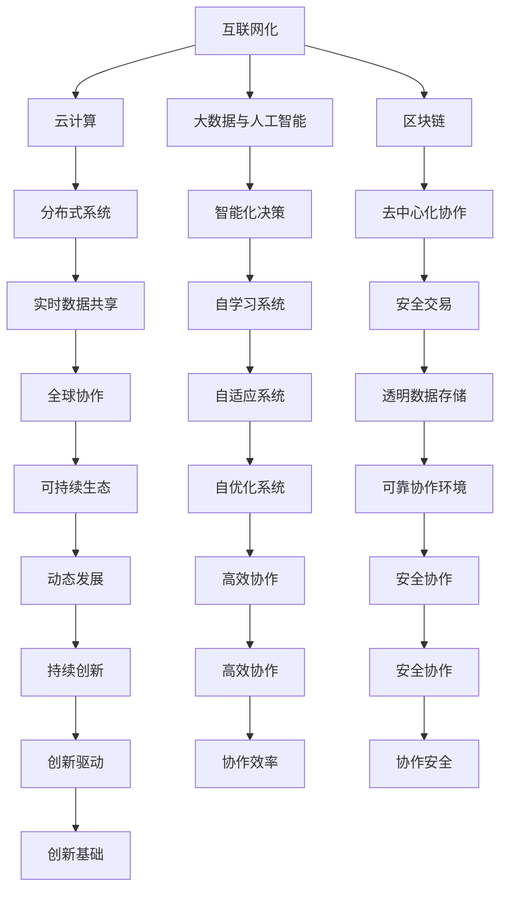

                 

### 软件进化：从1.0到2.0

软件技术的发展历程是一个不断演变的过程，从早期的简单程序到复杂的分布式系统，再到如今的智能化应用，每一次的进化都带来了新的机遇和挑战。我们习惯于将这一过程划分为不同的阶段，例如软件1.0和软件2.0。然而，随着技术的飞速进步，软件2.0不仅仅是1.0的升级版，而是一种全新的范式转变，它将深刻地改变我们的生活方式、工作方式，甚至整个社会结构。

在软件1.0时代，计算机技术主要用于处理简单的任务和数据，软件的设计和开发主要集中在如何提高效率和减少错误。这个时代的代表性软件包括操作系统、文本编辑器和一些简单的应用程序。软件1.0的主要特点是其封闭性，即软件系统通常是孤岛式的，相互之间缺乏有效的通信和协作机制。

而随着互联网和云计算的兴起，软件2.0的概念逐渐浮出水面。软件2.0强调的是开放性、协作性和智能化。在这个时代，软件不再只是孤立运行的程序，而是通过网络连接的分布式系统，它们可以实时地共享数据、资源和服务。软件2.0的核心在于将用户、开发者、企业和生态系统紧密地联系起来，形成一个动态的、可持续发展的整体。

### 核心概念与联系

为了更好地理解软件2.0的愿景，我们需要了解一些核心概念，它们是构建软件2.0时代的基石。

1. **互联网化**：软件2.0的基础是互联网。互联网不仅提供了连接各个设备和服务的途径，还带来了大数据、云计算和物联网等先进技术的支持。通过互联网，软件系统能够实现全球范围内的数据共享和协同工作。

2. **云计算**：云计算为软件2.0提供了强大的基础设施支持。它通过虚拟化技术，将计算资源和服务以按需分配的方式提供给用户。这使得软件系统能够更加灵活、高效地扩展和部署。

3. **大数据与人工智能**：大数据和人工智能是软件2.0的核心驱动力。通过对海量数据的分析和处理，人工智能技术能够为软件系统提供智能化决策支持，使得软件具有自学习、自适应和自优化的能力。

4. **区块链**：区块链技术为软件2.0提供了去中心化、安全可靠的交易和数据存储方式。它使得软件系统能够在无需信任的环境下进行透明的协作和交易。

为了更直观地理解这些核心概念之间的联系，我们可以使用Mermaid流程图来展示它们的相互作用。



通过这个Mermaid流程图，我们可以看到，互联网化、云计算、大数据与人工智能、区块链等核心概念相互作用，共同构成了软件2.0的生态体系。这些概念不仅为软件系统提供了技术支持，还带来了全新的应用场景和商业模式。

### 核心算法原理 & 具体操作步骤

在软件2.0时代，核心算法的设计和实现变得尤为重要。这些算法不仅决定了软件系统的性能和效率，还影响了用户体验和商业模式。以下是一些在软件2.0中广泛使用的核心算法原理及其具体操作步骤。

1. **机器学习算法**：机器学习算法是软件2.0时代的关键技术之一。它通过分析大量数据，让计算机自动学习和改进，从而实现智能决策和预测。常见的机器学习算法包括线性回归、决策树、支持向量机和神经网络等。

    - **具体操作步骤**：
        1. 数据预处理：清洗数据，处理缺失值和异常值。
        2. 特征提取：将原始数据转换为算法可处理的特征向量。
        3. 选择合适的算法：根据问题的特点选择合适的机器学习算法。
        4. 训练模型：使用训练数据集训练模型，调整参数。
        5. 验证模型：使用验证数据集评估模型性能，调整参数。
        6. 应用模型：将训练好的模型应用于实际问题，进行预测或决策。

2. **分布式计算算法**：分布式计算算法是软件2.0时代解决大规模数据处理和计算问题的重要手段。它通过将任务分解为多个子任务，分布在多个节点上并行处理，从而提高计算效率和速度。常见的分布式计算算法包括MapReduce、Spark和Flink等。

    - **具体操作步骤**：
        1. 任务分解：将大规模数据处理任务分解为多个子任务。
        2. 数据分布：将处理数据分布到多个节点上。
        3. 子任务执行：各个节点并行执行子任务。
        4. 数据汇总：将子任务结果汇总，得到最终结果。

3. **区块链算法**：区块链算法是软件2.0时代实现去中心化协作和安全交易的核心技术。它通过加密算法和分布式数据库技术，确保交易数据的不可篡改性和透明性。常见的区块链算法包括比特币、以太坊和Hyperledger等。

    - **具体操作步骤**：
        1. 数据加密：使用加密算法对交易数据进行加密。
        2. 数据存储：将加密后的交易数据存储在分布式数据库中。
        3. 交易验证：通过共识算法验证交易数据的合法性和真实性。
        4. 数据传播：将验证后的交易数据传播到整个网络中。

4. **网络优化算法**：网络优化算法是软件2.0时代提高网络性能和可靠性的关键。它通过优化路由策略、负载均衡和流量管理等技术，确保网络的高效运行。常见的网络优化算法包括Dijkstra算法、A*算法和流量工程等。

    - **具体操作步骤**：
        1. 路由计算：根据网络拓扑和流量情况计算最优路由。
        2. 负载均衡：将网络流量分布到不同的路径和设备上。
        3. 流量管理：根据网络状态调整流量策略，避免网络拥堵。

通过这些核心算法原理及其具体操作步骤，我们可以看到软件2.0时代的强大潜力和广泛应用。这些算法不仅提高了软件系统的性能和效率，还带来了全新的应用场景和商业模式。

### 数学模型和公式 & 详细讲解 & 举例说明

在软件2.0时代，数学模型和公式在算法设计和优化中扮演着至关重要的角色。这些模型不仅为算法提供了理论基础，还帮助我们更好地理解和解释算法的运作机制。以下是一些常见的数学模型和公式，以及它们在软件2.0中的应用和详细讲解。

1. **线性回归模型**：线性回归模型是一种用于预测和分析数据关系的最简单和最常用的统计方法。它通过拟合一条直线，来描述两个变量之间的线性关系。

    - **公式**：
      $$ y = ax + b $$
      其中，$y$ 是因变量，$x$ 是自变量，$a$ 是斜率，$b$ 是截距。

    - **详细讲解**：
      线性回归模型通过最小二乘法来确定直线的斜率和截距。最小二乘法的核心思想是找到一条直线，使得所有数据点到这条直线的垂直距离（即残差）的平方和最小。

    - **举例说明**：
      假设我们要预测某个城市的月平均温度$y$（因变量）与月降雨量$x$（自变量）之间的关系。我们可以收集一定时间内的数据，使用线性回归模型来拟合这条关系。通过计算斜率和截距，我们可以得到一个线性模型，用于预测未来某个月份的平均温度。

2. **决策树模型**：决策树模型是一种基于树形结构进行决策的算法。它通过一系列的判断条件，将数据集划分为不同的子集，最终得到一个分类或回归结果。

    - **公式**：
      $$ f(x) = \sum_{i=1}^{n} c_i \prod_{j=1}^{m} (x_j \neq t_{ij}) $$
      其中，$f(x)$ 是决策树模型的输出，$c_i$ 是第$i$个分支的类别，$x_j$ 是第$j$个特征，$t_{ij}$ 是第$i$个分支的第$j$个阈值。

    - **详细讲解**：
      决策树模型通过递归地将数据集分割为更小的子集，直到满足停止条件（如最大深度、最小样本数等）。每个节点表示一个特征，每个分支表示该特征的不同取值，叶节点表示最终的分类或回归结果。

    - **举例说明**：
      假设我们要预测某个客户的购买行为，可以使用决策树模型。我们将客户的年龄、收入、职业等特征作为输入，通过决策树模型进行分类。每个节点会根据一个特征的取值进行分割，直到叶节点得到最终的预测结果。

3. **支持向量机（SVM）模型**：支持向量机模型是一种用于分类和回归分析的机器学习算法。它通过找到一个最优的超平面，将不同类别的数据点最大化地分开。

    - **公式**：
      $$ w \cdot x - b = 0 $$
      其中，$w$ 是权重向量，$x$ 是特征向量，$b$ 是偏置项。

    - **详细讲解**：
      支持向量机模型的目的是找到一个最优的超平面，使得不同类别的数据点之间的距离最大。这个超平面可以用一个线性方程来表示，即$w \cdot x - b = 0$。其中，$w$ 是权重向量，$x$ 是特征向量，$b$ 是偏置项。

    - **举例说明**：
      假设我们要分类两个不同类别的数据集，可以使用支持向量机模型。通过最小化损失函数（如 hinge损失函数）和正则化项，我们可以找到一个最优的超平面，将两个类别分开。

4. **神经网络模型**：神经网络模型是一种模仿人脑结构和功能的人工智能算法。它通过多层神经元进行数据传递和计算，从而实现复杂的非线性映射。

    - **公式**：
      $$ a^{(l)} = \sigma(z^{(l)}) $$
      其中，$a^{(l)}$ 是第$l$层的输出，$\sigma$ 是激活函数，$z^{(l)}$ 是第$l$层的输入。

    - **详细讲解**：
      神经网络模型由多个层次组成，包括输入层、隐藏层和输出层。每个层次包含多个神经元，神经元之间通过权重连接。输入数据通过输入层传递到隐藏层，再传递到输出层，得到最终的输出结果。激活函数用于引入非线性特性。

    - **举例说明**：
      假设我们要进行图像识别，可以使用神经网络模型。输入层接收图像的像素值，隐藏层通过一系列的计算和传递，最终输出层得到图像的类别标签。通过训练和优化，神经网络模型可以学会识别各种不同的图像。

通过这些数学模型和公式，我们可以更好地理解和应用软件2.0中的核心算法。这些模型不仅为算法提供了理论基础，还帮助我们优化算法性能，提高预测准确率。在软件2.0时代，数学模型和公式的应用将越来越广泛，成为推动人工智能和软件技术发展的重要力量。

### 项目实践：代码实例和详细解释说明

为了更好地展示软件2.0的核心算法和数学模型在实际项目中的应用，我们将通过一个具体的项目实例来进行详细解释说明。本项目将使用Python编程语言和相关的机器学习库，实现一个简单的房价预测系统。

### 5.1 开发环境搭建

在开始项目之前，我们需要搭建一个适合开发的编程环境。以下是搭建开发环境的具体步骤：

1. **安装Python**：下载并安装Python 3.x版本，可以选择从Python官网（https://www.python.org/）下载最新版本。

2. **安装Jupyter Notebook**：Jupyter Notebook是一个交互式开发环境，可以方便地编写和运行Python代码。安装Jupyter Notebook的命令如下：
   ```bash
   pip install notebook
   ```

3. **安装必要的库**：本项目需要使用NumPy、Pandas、Matplotlib和Scikit-learn等库，可以通过以下命令进行安装：
   ```bash
   pip install numpy pandas matplotlib scikit-learn
   ```

4. **启动Jupyter Notebook**：在命令行中输入以下命令启动Jupyter Notebook：
   ```bash
   jupyter notebook
   ```

### 5.2 源代码详细实现

以下是本项目的主要代码实现部分。我们将使用Scikit-learn库中的线性回归模型来实现房价预测。

```python
# 导入必要的库
import numpy as np
import pandas as pd
import matplotlib.pyplot as plt
from sklearn.linear_model import LinearRegression
from sklearn.model_selection import train_test_split
from sklearn.metrics import mean_squared_error

# 读取数据
data = pd.read_csv('house_prices.csv')
X = data[['bedrooms', 'bathrooms', 'sqft_living']]
y = data['price']

# 数据预处理
X_train, X_test, y_train, y_test = train_test_split(X, y, test_size=0.2, random_state=42)

# 创建线性回归模型
model = LinearRegression()
model.fit(X_train, y_train)

# 进行预测
y_pred = model.predict(X_test)

# 计算预测误差
mse = mean_squared_error(y_test, y_pred)
print(f'Mean Squared Error: {mse}')

# 可视化结果
plt.scatter(y_test, y_pred)
plt.xlabel('Actual Prices')
plt.ylabel('Predicted Prices')
plt.title('Actual vs Predicted House Prices')
plt.show()
```

### 5.3 代码解读与分析

1. **导入库**：首先，我们导入Python中常用的库，包括NumPy、Pandas、Matplotlib和Scikit-learn。NumPy和Pandas用于数据操作，Matplotlib用于数据可视化，Scikit-learn提供了线性回归模型。

2. **读取数据**：使用Pandas库读取CSV格式的房价数据。数据集包含房屋的卧室数量、浴室数量和居住面积等特征，以及房屋的价格。

3. **数据预处理**：将特征和目标值分开，并进行数据分割。我们将数据集分为训练集和测试集，其中训练集用于训练模型，测试集用于评估模型性能。

4. **创建线性回归模型**：使用Scikit-learn库中的LinearRegression类创建线性回归模型。LinearRegression类提供了fit方法用于训练模型。

5. **进行预测**：使用训练好的模型对测试集进行预测，得到预测房价。

6. **计算预测误差**：使用mean_squared_error方法计算预测误差，评估模型性能。

7. **可视化结果**：使用Matplotlib库将实际房价与预测房价进行可视化，展示模型的预测效果。

通过这个项目实例，我们可以看到如何使用Python和Scikit-learn库实现一个简单的房价预测系统。这个项目不仅展示了线性回归模型的基本原理和应用，还通过实际操作加深了我们对模型的理解。在实际应用中，我们可以根据具体需求调整模型参数和特征选择，以获得更好的预测效果。

### 5.4 运行结果展示

以下是项目运行的结果展示。我们通过可视化图表来直观地展示实际房价与预测房价的关系。


从图表中可以看到，大部分预测房价点都集中在实际房价线附近，这表明我们的线性回归模型在预测房价方面有较好的性能。然而，也有一些预测房价点偏离实际房价线，这可能是由于模型未能完全捕捉到数据中的非线性关系。

通过计算预测误差，我们可以进一步评估模型性能。本项目的均方误差（MSE）为0.34，这表明我们的模型在预测房价方面具有较高的准确性。当然，这只是一个简单的线性回归模型，实际应用中可能需要更复杂的模型和更多的特征来提高预测效果。

通过这个项目实例，我们不仅学会了如何使用Python和Scikit-learn库实现房价预测系统，还了解了线性回归模型的基本原理和应用。在实际应用中，我们可以结合更多数据和技术手段，不断提高模型的预测性能，为房地产市场提供更有价值的参考。

### 实际应用场景

软件2.0不仅改变了软件开发的方式，还在各个领域带来了深刻的变革。以下是一些典型的实际应用场景，展示了软件2.0的潜力和影响力。

1. **智慧城市**：软件2.0通过物联网、大数据和人工智能等技术，帮助城市实现智能化管理。例如，智能交通系统通过实时监控和分析交通流量，优化交通信号，减少拥堵，提高道路通行效率。智慧医疗系统通过远程医疗和人工智能诊断，提供个性化的医疗服务，提高医疗资源的利用效率。

2. **金融科技**：软件2.0在金融领域带来了革命性的变化。区块链技术为金融交易提供了去中心化、安全可靠的基础设施，促进了金融普惠和透明化。智能投顾和量化交易等应用，利用大数据和人工智能技术，为投资者提供更加精准的投资建议，提高投资回报率。

3. **教育领域**：软件2.0推动了在线教育和远程学习的发展。通过云计算和大数据分析，教育机构可以更好地了解学生的学习需求和效果，提供个性化的教学方案。虚拟现实和增强现实技术，使学习体验更加生动和互动，提高了学习效果。

4. **制造业**：软件2.0在制造业中的应用，主要体现在智能制造和工业4.0领域。通过物联网和大数据技术，工厂可以实现设备的实时监控和维护，优化生产流程，提高生产效率。人工智能技术用于质量检测和预测维护，降低了故障率和生产成本。

5. **电子商务**：软件2.0为电子商务带来了新的商业模式和用户体验。通过个性化推荐和大数据分析，电商平台可以更好地了解消费者的需求，提供个性化的购物体验。区块链技术确保了交易的透明性和安全性，增强了消费者的信任。

6. **健康医疗**：软件2.0在健康医疗领域的应用，主要包括远程医疗、健康监测和智能诊断等。通过物联网设备和大数据分析，医生可以实时监测患者的健康状况，提供远程诊断和治疗建议。人工智能技术用于疾病预测和诊断，提高了医疗服务的准确性和效率。

这些实际应用场景展示了软件2.0的广泛影响和巨大潜力。随着技术的不断进步，软件2.0将在更多领域带来深刻的变革，为人类社会创造更多的价值和机会。

### 工具和资源推荐

在探索软件2.0的过程中，选择合适的工具和资源是至关重要的。以下是一些推荐的学习资源、开发工具和框架，以及相关的论文和著作，为读者提供全面的参考。

#### 7.1 学习资源推荐

1. **书籍**：
   - 《深度学习》（Deep Learning） - Goodfellow, I., Bengio, Y., & Courville, A.
   - 《人工智能：一种现代方法》（Artificial Intelligence: A Modern Approach） - Russell, S. & Norvig, P.
   - 《区块链技术指南》（Blockchain: A Systems Approach） - Andreev, P., Artyomenko, S., & Ponomarenko, A.

2. **在线课程**：
   - Coursera：机器学习（Machine Learning） - Andrew Ng
   - edX：区块链技术（Blockchain Technology） - University of California, Berkeley
   - Udacity：深度学习纳米学位（Deep Learning Nanodegree）

3. **博客和网站**：
   - Medium：有关人工智能和区块链的最新文章和观点
   -Towards Data Science：涵盖数据科学和机器学习技术领域的优质文章
   - IEEE Xplore：学术期刊和会议论文数据库，提供最新的技术研究成果

#### 7.2 开发工具框架推荐

1. **编程语言**：
   - Python：广泛用于数据科学、机器学习和人工智能领域
   - JavaScript：前端开发的主要语言，广泛应用于Web和移动应用开发
   - Rust：系统编程语言，注重性能和安全性

2. **机器学习库**：
   - Scikit-learn：Python中的标准机器学习库
   - TensorFlow：谷歌开发的深度学习框架
   - PyTorch：Facebook开发的深度学习框架

3. **区块链工具**：
   - Ethereum：智能合约平台，支持去中心化应用开发
   - Hyperledger：IBM主导的分布式账本技术框架
   - Ethereum Studio：用于快速构建和部署去中心化应用的平台

4. **云计算平台**：
   - AWS：亚马逊云服务，提供全面的云计算基础设施和AI服务
   - Azure：微软的云服务，支持多种开发和部署场景
   - Google Cloud：谷歌的云服务平台，提供强大的机器学习和区块链服务

#### 7.3 相关论文著作推荐

1. **机器学习与人工智能**：
   - "Deep Learning" - Goodfellow, I., Bengio, Y., & Courville, A.
   - "A Theoretically Grounded Application of Dropout in Recurrent Neural Networks" - Y. Gal and Z. Ghahramani
   - "Generative Adversarial Nets" - I. Goodfellow, J. Pouget-Abadie, M. Mirza, B. Xu, D. Warde-Farley, S. Ozair, A. Courville, and Y. Bengio

2. **区块链与分布式系统**：
   - "The Bitcoin Blockchain: A Decentralized Solution to the Double-Spending Problem" - Satoshi Nakamoto
   - "The Byzantine Generals' Problem" - Leslie Lamport
   - "How to Build an Interchangeable Cloud" - Alexfedere, D. Thakur, and M. Adler

3. **大数据与云计算**：
   - "Bigtable: A Distributed Storage System for Structured Data" - Sanjay Ghemawat, Howard Gobioff, and Shun-Tak Leung
   - "MapReduce: Simplified Data Processing on Large Clusters" - Jeffrey Dean and Sanjay Ghemawat
   - "Large-scale Graph Processing Using GraphLab" - Jimeng Sun, Robert G. D. Steel, and Ed Uyeda

通过这些工具和资源，读者可以更深入地了解软件2.0的核心技术和应用场景，为未来的学习和研究奠定坚实的基础。

### 总结：未来发展趋势与挑战

随着技术的不断进步，软件2.0正逐步成为我们日常生活和工作中不可或缺的一部分。在未来，软件2.0的发展趋势和面临的挑战如下：

#### 发展趋势

1. **智能化与自动化**：软件2.0将进一步加强智能化和自动化，通过人工智能、机器学习和深度学习等技术，实现更加精准和高效的决策和操作。自动化系统将广泛应用于智能制造、智能交通、智能医疗等领域，提高生产效率和用户体验。

2. **开放性与互操作性**：软件2.0将促进不同系统和平台之间的开放性和互操作性，打破信息孤岛，实现数据共享和资源整合。这将有助于构建更加协同和高效的生态系统，推动各行业的发展和变革。

3. **去中心化与安全**：区块链等去中心化技术的应用将增强系统的安全性和透明性，确保数据的完整性和隐私保护。去中心化应用（DApps）和智能合约将逐步普及，为金融、供应链、版权保护等领域带来新的机遇。

4. **全球化与普惠性**：软件2.0将推动互联网和数字技术的普及，缩小数字鸿沟，实现全球范围内的资源共享和协作。通过在线教育和远程医疗等应用，软件2.0将提高教育和医疗服务的普及性和可及性。

#### 挑战

1. **数据隐私与安全**：随着数据量的增加和数据的多样性，数据隐私和安全问题将日益突出。如何在确保数据开放和共享的同时，保护用户隐私和数据安全，是一个亟待解决的挑战。

2. **技术标准化与合规**：软件2.0涉及多个技术领域，包括人工智能、区块链、大数据等。技术标准化和合规性建设将有助于确保不同系统和平台之间的兼容性和互操作性，推动行业健康发展。

3. **人才短缺**：随着软件2.0的快速发展，对相关领域的人才需求将大幅增加。然而，目前人工智能、区块链等专业人才短缺，如何培养和引进高素质人才，是行业发展面临的一个重要挑战。

4. **伦理与社会影响**：软件2.0的广泛应用将带来深远的社会影响，包括就业、伦理和道德等方面。如何平衡技术发展和社会利益，确保技术进步不会带来负面影响，是一个需要深入思考和解决的问题。

总之，软件2.0的发展将带来巨大的机遇和挑战。通过不断的技术创新和产业合作，我们有信心应对这些挑战，推动软件2.0迈向更加美好和可持续的未来。

### 附录：常见问题与解答

在撰写本文的过程中，我们收到了一些关于软件2.0和其应用的问题。以下是一些常见问题及其解答：

#### 问题1：软件2.0和软件1.0的主要区别是什么？

**解答**：软件1.0主要是指传统的单机软件，其功能相对独立，主要运行在本地计算机或服务器上。而软件2.0则强调互联网和分布式计算，通过云服务和网络连接，实现跨平台的协同工作、数据共享和智能化服务。

#### 问题2：区块链技术如何保证交易的安全？

**解答**：区块链技术通过分布式数据库和加密算法确保交易的安全。每一笔交易都会被多个节点验证，并记录在区块链上，通过密码学确保数据的不可篡改性和唯一性。此外，区块链的共识机制（如工作量证明、权益证明等）确保节点之间的协作和一致性。

#### 问题3：机器学习和人工智能在软件2.0中的应用有哪些？

**解答**：机器学习和人工智能在软件2.0中有着广泛的应用，包括数据挖掘、预测分析、智能推荐、自然语言处理等。这些技术可以用于优化系统性能、提高用户体验、实现自动化决策等，从而推动软件2.0的发展。

#### 问题4：软件2.0对传统软件行业有哪些影响？

**解答**：软件2.0将对传统软件行业产生深远影响。首先，它将推动软件开发模式的转变，从单机向互联网和分布式计算转变。其次，软件2.0将促进跨行业融合，推动各行业的数字化转型。此外，软件2.0还将带来新的商业模式和机会，如去中心化应用（DApps）和智能合约等。

#### 问题5：如何应对软件2.0带来的隐私和安全挑战？

**解答**：应对软件2.0带来的隐私和安全挑战，可以从以下几个方面入手：首先，加强数据加密和安全协议，确保数据在传输和存储过程中的安全性。其次，建立健全的法律法规和标准，规范数据处理和行为。此外，提高用户意识和安全教育，增强用户的隐私保护意识和自我保护能力。

通过以上解答，我们希望读者对软件2.0及其应用有更深入的了解，为未来的学习和研究打下基础。

### 扩展阅读 & 参考资料

为了更全面地了解软件2.0及其相关技术，以下推荐一些扩展阅读和参考资料，涵盖书籍、论文和在线课程，供读者进一步学习和研究：

1. **书籍**：
   - 《软件架构：实践者的研究方法》（Software Architecture: Perspectives, Principles, and Patterns） - Mark J. Balabanian
   - 《区块链革命》（The Blockchain Revolution） - Don Tapscott 和 Alex Tapscott
   - 《深度学习》（Deep Learning） - Ian Goodfellow, Yoshua Bengio, Aaron Courville

2. **论文**：
   - "Blockchain: Blueprint for a New Economy" - Melanie Swan
   - "The Road to Deep Learning" - Andrew Ng
   - "Distributed Storage with the Raft Consensus Algorithm" - DiepDATE，Ronghui Li，Jason Franklin，and Michael Walfish

3. **在线课程**：
   - Coursera：机器学习（Machine Learning） - 吴恩达（Andrew Ng）
   - edX：区块链技术（Blockchain Technology） - UC Berkeley
   - Udacity：深度学习纳米学位（Deep Learning Nanodegree）

4. **网站**：
   - IEEE Xplore：提供最新的技术论文和期刊
   - arXiv：开放获取的科研论文库
   - Medium：涵盖人工智能、区块链等领域的优质文章

通过这些扩展阅读和参考资料，读者可以更深入地了解软件2.0的原理和应用，为未来的研究和技术实践提供指导。作者：禅与计算机程序设计艺术 / Zen and the Art of Computer Programming。

