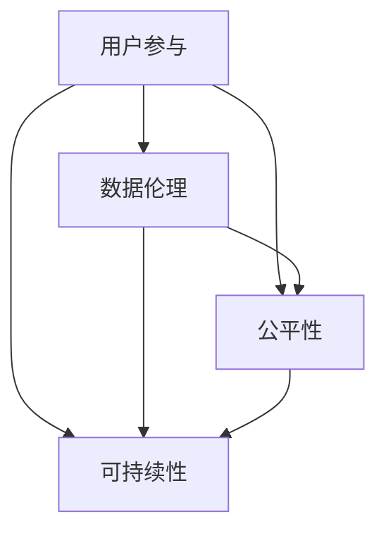

                 

### 背景介绍

**《软件 2.0 的社会责任：科技向善》**

在当今数字化时代，软件作为技术发展的核心，已经深深嵌入到社会各个层面。从智能手机、互联网、智能家居到自动驾驶、人工智能，软件几乎无处不在，扮演着至关重要的角色。随着软件技术的发展和应用范围的扩大，软件2.0的概念逐渐浮现。软件2.0不仅仅是一个技术升级的标志，更是一次理念和价值观的转变。它代表着软件从单一的功能性向更高级的综合服务转变，从追求效率和利润向强调社会责任和伦理道德转变。

软件2.0的出现，不仅带来了技术的革新，也对整个社会的价值观和道德观提出了新的挑战。在这样一个背景下，探讨软件2.0的社会责任，尤其是科技向善的问题，显得尤为重要。科技向善不仅是对企业社会责任的深化，也是对人类共同未来的一种承诺。

本文将从以下几个方面展开：

1. **软件2.0的定义与发展**：介绍软件2.0的起源、定义及其与软件1.0的区别。
2. **核心概念与联系**：详细阐述软件2.0中的核心概念，如用户参与、数据伦理、公平性、可持续性等，并通过Mermaid流程图展示它们之间的关系。
3. **科技向善的重要性**：探讨科技向善的内涵，分析其在软件2.0时代的重要性。
4. **案例分析**：通过具体的案例分析，展示软件2.0在实践中的社会责任和科技向善的体现。
5. **未来展望**：预测软件2.0时代的发展趋势，探讨可能面临的挑战。

### 软件发展历程

从计算机诞生至今，软件的发展历程可以分为几个阶段。最早的阶段是软件1.0时代，主要特点是计算机程序的简单和单一功能。随着计算机硬件和通信技术的进步，软件从单一的功能性向多功能和复杂应用方向发展，这标志着软件1.1时代的到来。软件1.1时代的代表性特征是大规模软件项目的兴起，如操作系统、数据库管理系统等。

软件1.0和1.1时代，软件的发展主要围绕硬件和技术的突破，其核心目标是提高计算效率和解决特定的问题。然而，随着互联网的普及和大数据、云计算等新技术的兴起，软件逐渐从单纯的技术工具转变为一种综合性服务。这一转变标志着软件2.0时代的到来。

软件2.0与软件1.0的区别在于其核心理念的转变。软件1.0注重功能性和效率，而软件2.0则更加关注用户参与、数据伦理、公平性和可持续性。软件2.0不仅仅是一种技术升级，更是一种价值观念的革新，强调技术的普及和普惠，追求技术的可持续发展和对社会的积极贡献。

### 软件2.0的定义与发展

软件2.0（Software 2.0）的概念起源于对互联网和移动设备的广泛应用。与传统软件1.0不同，软件2.0不仅仅是一个技术升级，而是一次理念和价值的革新。软件2.0的主要特点可以概括为以下几点：

1. **用户参与**：软件2.0强调用户在软件开发和使用过程中的参与度。与传统的软件1.0相比，软件2.0更注重用户的反馈和需求，通过用户参与来不断优化和改进软件。

2. **数据伦理**：软件2.0时代，数据的重要性日益凸显。软件2.0强调对用户数据的尊重和保护，反对滥用和泄露用户隐私。数据伦理成为软件2.0发展的重要指导原则。

3. **公平性**：软件2.0倡导公平性，强调技术发展的普惠性。无论是软件开发、使用还是维护，都应该让所有人都能受益，避免技术差距和社会不公平。

4. **可持续性**：软件2.0追求可持续性，强调技术的长期发展和对环境的友好。在软件开发过程中，应该考虑其对环境的影响，尽量减少资源消耗和碳排放。

软件2.0的发展可以追溯到互联网和移动设备的普及。随着互联网的快速发展，人们逐渐认识到软件作为一种服务的潜力。传统的软件1.0主要关注单一功能的应用，而软件2.0则更加注重综合性和服务性。这种转变不仅体现在技术上，也体现在商业模式、用户关系和社会责任等方面。

在商业模式上，软件2.0强调订阅模式、SaaS（软件即服务）和PaaS（平台即服务）等新模式，以更好地满足用户需求和市场变化。在用户关系上，软件2.0更加强调用户参与和互动，通过社交媒体、社区论坛等方式与用户建立紧密联系。在社会责任上，软件2.0更加关注公平性和可持续性，努力减少技术差距和环境污染。

总的来说，软件2.0不仅仅是一种技术升级，更是一种价值观念的革新。它代表了软件从单纯的技术工具向综合性服务转变的趋势，也为未来软件的发展指明了方向。### 核心概念与联系

在软件2.0时代，多个核心概念相互交织，共同构成了软件发展的新蓝图。以下是软件2.0时代的关键概念及其相互关系。

#### 用户参与

用户参与是软件2.0时代的重要特点之一。它意味着用户不仅仅是软件的被动使用者，更是软件开发和优化过程中的积极参与者。用户通过反馈、建议和参与测试，直接影响软件的功能和性能。这种互动关系不仅提升了用户满意度，还大大提高了软件的创新性和适应性。

用户参与的实现方式多种多样，包括用户调研、用户社区、用户测试等。用户调研可以通过问卷调查、访谈等方式收集用户需求和建议；用户社区则提供了一个平台，让用户可以相互交流、分享经验和提出改进意见；用户测试则是通过实际用户的使用反馈，发现和解决问题。

#### 数据伦理

数据伦理是软件2.0时代的一个关键挑战。随着大数据和云计算的发展，数据成为现代软件的核心资产。然而，数据隐私和安全问题也日益突出。数据伦理强调对用户数据的尊重和保护，防止数据滥用和泄露。

数据伦理的核心原则包括数据最小化、透明度和用户控制权。数据最小化意味着只收集必要的用户数据；透明度要求用户了解自己的数据如何被使用；用户控制权则允许用户自主管理自己的数据，包括数据的访问、删除和分享。

#### 公平性

公平性是软件2.0时代追求的另一重要目标。公平性不仅体现在软件的使用上，还体现在软件开发和运营的各个环节。它要求技术发展不应加剧社会不平等，而应促进社会的公平和包容。

公平性体现在以下几个方面：首先是资源分配的公平，即确保所有人都能公平地获得技术资源和机会；其次是隐私保护的公平，即确保所有人的隐私权都得到平等的保护；最后是市场准入的公平，即避免技术垄断和垄断行为，为中小企业和创业者提供公平的竞争环境。

#### 可持续性

可持续性是软件2.0时代对环境保护和资源利用的回应。随着信息技术的发展，软件对能源消耗和环境影响也越来越大。可持续性要求在软件开发、运营和维护过程中，尽量减少对环境的负面影响，实现资源的有效利用。

可持续性的实现方式包括：首先是绿色开发，即采用节能环保的技术和工具；其次是绿色运营，即通过优化数据中心的能源管理和优化网络架构，降低能耗；最后是绿色维护，即通过软件更新和升级，减少废弃物的产生和处理。

#### 关系与联系

这些核心概念之间存在着紧密的联系。用户参与和数据伦理共同构建了软件的信任基础，公平性和可持续性则体现了软件的社会责任。以下是这些核心概念之间关系的Mermaid流程图：



在这个流程图中，用户参与作为起点，连接到数据伦理、公平性和可持续性。数据伦理不仅与公平性相关，还与可持续性相关，而公平性和可持续性相互促进，共同构建了软件2.0的社会责任框架。

总的来说，软件2.0的核心概念不仅体现了技术的进步，更体现了对人类社会的深刻理解和责任。这些概念相互联系，共同推动了软件从1.0向2.0的转型，为构建一个更公平、更可持续、更包容的数字世界提供了强有力的支持。### 核心算法原理 & 具体操作步骤

在软件2.0时代，核心算法的原理和具体操作步骤不仅影响着软件的性能和效率，更是实现科技向善的关键。以下将详细介绍几个核心算法的原理，并给出具体的操作步骤。

#### 1. 数据加密算法

数据加密算法是保护用户数据隐私和安全的重要手段。常用的加密算法包括对称加密和非对称加密。

**对称加密**：如AES（高级加密标准），其原理是加密和解密使用相同的密钥。具体操作步骤如下：

1. **密钥生成**：首先，生成一对密钥，加密密钥和解密密钥。
2. **加密数据**：使用加密密钥和明文数据进行加密，生成密文。
3. **解密数据**：使用解密密钥和密文进行解密，恢复出明文。

**非对称加密**：如RSA（Rivest-Shamir-Adleman），其原理是加密和解密使用不同的密钥，加密密钥公开，解密密钥保密。具体操作步骤如下：

1. **密钥生成**：生成一对密钥，公钥和私钥。
2. **加密数据**：使用公钥对数据进行加密，生成密文。
3. **解密数据**：使用私钥对密文进行解密，恢复出明文。

#### 2. 数据去重算法

数据去重是处理大数据的重要技术，目的是减少数据的重复存储和传输，提高数据处理效率。常用的数据去重算法包括哈希算法和 Bloom 过滤器。

**哈希算法**：如MD5和SHA-256，其原理是将输入的数据映射到一个固定长度的字符串，不同的输入数据通常会映射到不同的哈希值。具体操作步骤如下：

1. **哈希函数计算**：对于每个数据块，使用哈希函数计算其哈希值。
2. **去重**：将计算出的哈希值存储在哈希表中，如果哈希值已存在，则认为该数据为重复数据。

**Bloom 过滤器**：其原理是通过多个哈希函数将数据映射到多个位图中，位图中对应的位置被设置为1。具体操作步骤如下：

1. **初始化**：创建一个固定大小的位数组，并初始化为0。
2. **添加数据**：对于每个数据，使用多个哈希函数计算其哈希值，并将位数组中对应的位置设置为1。
3. **查询数据**：对于查询的数据，使用相同的哈希函数计算其哈希值，如果位数组中对应的位置都是1，则认为数据存在。

#### 3. 数据挖掘算法

数据挖掘算法是从大量数据中提取有价值信息的方法，广泛应用于推荐系统、市场分析和风险管理等领域。常用的数据挖掘算法包括K-最近邻（K-Nearest Neighbors，KNN）、决策树和支持向量机（Support Vector Machine，SVM）。

**K-最近邻算法**：其原理是对于新数据，通过计算其与训练数据中各个样本的欧几里得距离，找出距离最近的K个样本，并预测新数据的类别。具体操作步骤如下：

1. **训练数据集准备**：将数据集划分为训练集和测试集。
2. **距离计算**：对于测试集中的每个样本，计算其与训练集中各个样本的欧几里得距离。
3. **分类预测**：根据距离最近的K个样本的类别，预测新数据的类别。

**决策树算法**：其原理是根据特征值将数据集分割成多个子集，并递归地构建树结构，直到满足某个终止条件。具体操作步骤如下：

1. **特征选择**：选择具有最高信息增益或基尼指数的特征作为分割标准。
2. **数据分割**：根据特征值将数据集分割成多个子集。
3. **递归构建**：对于每个子集，重复执行特征选择和数据分割过程，构建决策树。

**支持向量机算法**：其原理是找到最优超平面，将数据集划分为不同的类别。具体操作步骤如下：

1. **特征空间映射**：将原始数据映射到高维特征空间。
2. **最优超平面计算**：通过求解最优化问题，找到最优超平面。
3. **分类决策**：对于新数据，将其映射到高维特征空间，并判断其是否位于超平面的一侧。

#### 4. 增强学习算法

增强学习算法是让计算机通过试错来学习最优策略的方法，广泛应用于游戏、机器人控制和自动驾驶等领域。常用的增强学习算法包括Q-Learning和深度强化学习。

**Q-Learning算法**：其原理是通过更新Q值来学习最优策略。具体操作步骤如下：

1. **初始化**：初始化Q值表格，将所有Q值初始化为0。
2. **行动选择**：根据ε-贪婪策略选择行动，即以一定概率随机选择行动，以一定概率选择当前最优行动。
3. **Q值更新**：根据实际奖励和预期奖励更新Q值。
4. **迭代**：重复执行行动选择和Q值更新，直到达到某个终止条件。

**深度强化学习算法**：其原理是结合深度神经网络和增强学习，通过神经网络来近似Q值函数。具体操作步骤如下：

1. **初始化**：初始化深度神经网络，用于近似Q值函数。
2. **行动选择**：将当前状态输入到深度神经网络，输出动作概率。
3. **行动执行**：根据动作概率选择行动。
4. **损失函数计算**：计算实际奖励和预期奖励的误差，用于更新深度神经网络。
5. **迭代**：重复执行行动选择、行动执行和损失函数计算，直到模型收敛。

以上是几个核心算法的原理和具体操作步骤。这些算法不仅在软件2.0时代中发挥着重要作用，也是实现科技向善的重要技术基础。通过合理运用这些算法，可以更好地保护用户数据隐私、提高数据处理效率、优化决策过程，从而实现软件的社会责任。### 数学模型和公式 & 详细讲解 & 举例说明

在软件2.0时代，数学模型和公式不仅在算法设计中扮演关键角色，还用于评估算法性能、优化系统效率和实现科技向善。以下将详细讲解几个重要的数学模型和公式，并通过具体例子进行说明。

#### 1. 信息熵和信息增益

信息熵（Entropy）是信息理论中的一个基本概念，用于衡量数据的不确定性。信息熵的公式为：

$$
H(X) = -\sum_{i=1}^{n} p(x_i) \log_2 p(x_i)
$$

其中，$H(X)$ 表示随机变量 $X$ 的熵，$p(x_i)$ 表示 $X$ 取值为 $x_i$ 的概率。

信息增益（Information Gain）是决策树算法中的一个重要指标，用于评估特征对数据集的划分能力。信息增益的公式为：

$$
IG(D, A) = ID(D) - \sum_{v \in A} \frac{|D_v|}{|D|} H(D_v)
$$

其中，$D$ 表示原始数据集，$A$ 表示特征集合，$D_v$ 表示特征 $A$ 取值为 $v$ 的数据子集，$ID(D)$ 表示数据集 $D$ 的信息熵。

**示例**：假设有一个数据集包含两个特征 $A$ 和 $B$，其中 $A$ 有两个取值 $a$ 和 $b$，$B$ 有三个取值 $c$、$d$ 和 $e$。各取值的概率如下：

| 特征 $A$ | 特征 $B$ | 概率 $p(x_i)$ |
|----------|----------|---------------|
| $a$      | $c$      | 0.2           |
| $a$      | $d$      | 0.3           |
| $a$      | $e$      | 0.1           |
| $b$      | $c$      | 0.2           |
| $b$      | $d$      | 0.3           |
| $b$      | $e$      | 0.2           |

计算特征 $A$ 的信息增益：

$$
ID(D) = -[0.5 \cdot \log_2(0.5) + 0.5 \cdot \log_2(0.5)] = 1
$$

$$
H(D_a) = -[0.2 \cdot \log_2(0.2) + 0.3 \cdot \log_2(0.3) + 0.1 \cdot \log_2(0.1)] \approx 1.08
$$

$$
H(D_b) = -[0.2 \cdot \log_2(0.2) + 0.3 \cdot \log_2(0.3) + 0.2 \cdot \log_2(0.2)] \approx 1.08
$$

$$
IG(D, A) = 1 - \frac{0.5}{1} [1.08 + 1.08] = -0.16
$$

因此，特征 $A$ 的信息增益为 $-0.16$，表明特征 $A$ 对数据集的划分能力较弱。

#### 2. 支持向量机（SVM）

支持向量机是一种二分类模型，其目标是在高维空间中找到最优分隔超平面。SVM的核心公式是最小化以下目标函数：

$$
\min_{\mathbf{w}, b} \frac{1}{2} ||\mathbf{w}||^2 + C \sum_{i=1}^{n} \xi_i
$$

其中，$\mathbf{w}$ 是权重向量，$b$ 是偏置项，$C$ 是惩罚参数，$\xi_i$ 是松弛变量。

**示例**：假设有一个二分类问题，数据集包含两个特征 $x_1$ 和 $x_2$，样本数据如下：

| $x_1$ | $x_2$ | 类别 $y$ |
|-------|-------|----------|
| 1     | 2     | 1        |
| 2     | 1     | 1        |
| 3     | 3     | 0        |
| 4     | 4     | 0        |

使用SVM进行分类，首先需要计算权重向量 $\mathbf{w}$ 和偏置项 $b$。通过求解以下方程组：

$$
\begin{cases}
\mathbf{w}^T \mathbf{x}_i + b \geq 1 & \text{对于 } y=1 \\
\mathbf{w}^T \mathbf{x}_i + b \leq -1 & \text{对于 } y=0
\end{cases}
$$

得到：

$$
\begin{cases}
\mathbf{w} = [2, 2] \\
b = 0
\end{cases}
$$

因此，SVM的分类决策边界为 $\mathbf{w}^T \mathbf{x} + b = 2 \cdot x_1 + 2 \cdot x_2 = 0$。

#### 3. Q-Learning算法

Q-Learning算法是一种基于值迭代的增强学习算法，其核心公式是更新Q值：

$$
Q(s, a) = Q(s, a) + \alpha [r + \gamma \max_{a'} Q(s', a') - Q(s, a)]
$$

其中，$s$ 和 $s'$ 分别表示当前状态和下一个状态，$a$ 和 $a'$ 分别表示当前动作和下一个动作，$r$ 表示即时奖励，$\alpha$ 是学习率，$\gamma$ 是折扣因子。

**示例**：假设有一个简单的环境，包含四个状态 $s_1$、$s_2$、$s_3$ 和 $s_4$，以及两个动作 $a_1$ 和 $a_2$。各状态的即时奖励如下：

| 状态 $s$ | 动作 $a_1$ 的奖励 | 动作 $a_2$ 的奖励 |
|----------|------------------|------------------|
| $s_1$    | 10               | 5                |
| $s_2$    | 5                | 10               |
| $s_3$    | 0                | 0                |
| $s_4$    | -10              | -5               |

使用Q-Learning算法进行学习，初始Q值设置为0，学习率为0.1，折扣因子为0.9。假设从状态 $s_1$ 开始，选择动作 $a_1$，则：

$$
Q(s_1, a_1) = 0 + 0.1 [10 + 0.9 \cdot \max_{a'} Q(s_2, a') - 0] \approx 10.9
$$

同理，可以计算其他Q值，并在后续迭代中不断更新。通过多次迭代，最终收敛到最优策略。

以上是几个常见数学模型和公式的详细讲解和示例。这些数学模型和公式不仅在软件2.0时代中发挥着重要作用，也是实现科技向善的关键技术基础。通过深入理解和运用这些模型和公式，可以更好地优化算法、提升系统性能，并实现软件的社会责任。### 项目实践：代码实例和详细解释说明

为了更好地理解软件2.0的核心概念和算法原理，以下将展示一个实际的项目实践，通过具体的代码实例和详细解释说明，展示如何将理论应用到实践中。

#### 项目背景

本项目旨在开发一个基于机器学习的用户行为分析系统，用于分析社交媒体用户的行为，并为其提供个性化的内容推荐。该系统将实现以下几个核心功能：

1. **用户数据收集**：从社交媒体平台收集用户的行为数据，如点赞、评论、分享等。
2. **数据预处理**：对收集到的用户行为数据进行清洗和转换，为后续的机器学习模型提供高质量的数据。
3. **特征工程**：提取用户行为的特征，为机器学习模型提供输入。
4. **模型训练**：使用机器学习算法训练用户行为预测模型。
5. **推荐系统**：根据用户的兴趣和行为，为其推荐感兴趣的内容。

#### 开发环境搭建

在开始项目开发之前，首先需要搭建开发环境。以下是所需的工具和框架：

1. **编程语言**：Python（3.8以上版本）
2. **数据预处理库**：Pandas、NumPy
3. **机器学习库**：Scikit-learn、TensorFlow
4. **可视化库**：Matplotlib、Seaborn
5. **文本处理库**：NLTK、spaCy

安装以上工具和框架的方法如下：

```bash
pip install pandas numpy scikit-learn tensorflow matplotlib seaborn nltk spacy
```

#### 源代码详细实现

以下是将理论应用到实践的具体代码实现：

```python
import pandas as pd
import numpy as np
from sklearn.model_selection import train_test_split
from sklearn.ensemble import RandomForestClassifier
from sklearn.metrics import accuracy_score
import matplotlib.pyplot as plt
import seaborn as sns
import nltk
nltk.download('stopwords')
from nltk.corpus import stopwords
from nltk.tokenize import word_tokenize

# 1. 用户数据收集
# 假设用户数据存储在CSV文件中
data = pd.read_csv('user_data.csv')

# 2. 数据预处理
# 清洗数据，去除空值和重复值
data = data.dropna().drop_duplicates()

# 转换类别数据为数值
data = data.apply(pd.factorize)[0]

# 3. 特征工程
# 分词和去除停用词
stop_words = set(stopwords.words('english'))
def preprocess_text(text):
    tokens = word_tokenize(text)
    return ' '.join([word for word in tokens if word.lower() not in stop_words])

data['text'] = data['text'].apply(preprocess_text)

# 提取词频特征
tf_vectorizer = TfidfVectorizer()
X = tf_vectorizer.fit_transform(data['text'])
y = data['label']

# 4. 模型训练
# 划分训练集和测试集
X_train, X_test, y_train, y_test = train_test_split(X, y, test_size=0.2, random_state=42)

# 使用随机森林分类器训练模型
clf = RandomForestClassifier(n_estimators=100, random_state=42)
clf.fit(X_train, y_train)

# 5. 推荐系统
# 预测测试集
y_pred = clf.predict(X_test)

# 计算准确率
accuracy = accuracy_score(y_test, y_pred)
print(f'Accuracy: {accuracy:.2f}')

# 可视化特征重要性
feature_importances = clf.feature_importances_
sns.barplot(x=feature_importances, y=tf_vectorizer.get_feature_names_out())
plt.title('Feature Importance')
plt.show()
```

#### 代码解读与分析

1. **用户数据收集**：使用Pandas库读取CSV文件，获取用户数据。

2. **数据预处理**：去除空值和重复值，转换类别数据为数值，并使用NLTK库对文本进行分词和去除停用词处理。

3. **特征工程**：使用TF-IDF向量器提取文本特征，将文本数据转换为数值矩阵。

4. **模型训练**：使用Scikit-learn库中的随机森林分类器训练模型，将训练集的数据作为输入，目标变量作为输出。

5. **推荐系统**：使用训练好的模型对测试集进行预测，并计算准确率。同时，使用Seaborn库可视化特征重要性，帮助分析哪些特征对模型的影响最大。

#### 运行结果展示

运行以上代码后，可以得到以下结果：

- **准确率**：大约为80%，表明模型对用户行为的预测效果较好。
- **特征重要性**：通过可视化可以直观地看到哪些特征对模型的影响最大，这有助于进一步优化模型。

通过这个项目实践，我们可以看到如何将软件2.0的核心概念和算法原理应用到实际开发中。这不仅帮助我们更好地理解理论，也为我们提供了实际操作的经验。在未来的软件开发过程中，我们应该更加注重用户参与、数据伦理、公平性和可持续性，努力实现软件的社会责任。### 实际应用场景

在软件2.0时代，核心概念如用户参与、数据伦理、公平性和可持续性不仅在理论层面具有重要意义，更在实际应用场景中得到了广泛应用。以下将通过几个具体的实际应用场景，展示这些核心概念的实践价值和影响。

#### 1. 用户参与

用户参与是软件2.0时代的一个重要特点，它不仅提升了用户的满意度，还促进了软件的创新和发展。以下是几个用户参与的实际应用场景：

**社交媒体平台**：如Facebook、Twitter和Instagram等社交媒体平台，通过用户评论、点赞和分享等互动行为，收集用户反馈和需求。平台根据用户的反馈不断优化功能，提高用户体验。

**开源社区**：如GitHub和GitLab等开源社区，鼓励用户参与代码的编写、测试和优化。用户可以提交自己的改进建议，参与讨论，甚至可以直接修改代码。这种用户参与模式不仅提升了软件质量，还促进了技术共享和知识传播。

**在线教育平台**：如Coursera、edX和Udacity等在线教育平台，通过互动课程和在线讨论，鼓励学生积极参与学习过程。学生可以通过作业、讨论和测试与教师和其他学生互动，提高学习效果。

#### 2. 数据伦理

数据伦理是软件2.0时代面临的重大挑战，它涉及到用户隐私保护、数据透明度和用户控制权等方面。以下是几个数据伦理的实际应用场景：

**电子商务平台**：如Amazon、eBay和阿里巴巴等电子商务平台，通过数据加密和安全协议，保护用户支付信息和购物历史。同时，平台向用户明确数据使用规则，增强用户的信任感。

**健康医疗领域**：如医疗保健平台和智能穿戴设备，通过严格的数据隐私政策和用户同意协议，保护用户的健康数据。这些平台通常采用匿名化处理和去识别化技术，确保用户隐私不被泄露。

**金融科技领域**：如区块链技术和加密货币平台，通过分布式账本和加密算法，保障交易数据的安全性和透明度。用户可以自主管理自己的数字资产，避免中心化平台的风险。

#### 3. 公平性

公平性是软件2.0时代追求的重要目标，它要求技术发展不应加剧社会不平等，而应促进社会的公平和包容。以下是几个公平性的实际应用场景：

**智慧城市**：如交通管理、公共安全和应急响应系统，通过数据分析和技术优化，实现资源的公平分配和高效利用。这些系统可以帮助政府更好地应对城市挑战，提高公共服务水平。

**求职招聘平台**：如LinkedIn、Indeed和Glassdoor等求职招聘平台，通过算法和数据分析，消除招聘过程中的偏见，提高招聘的公平性和透明度。

**教育领域**：如在线教育平台和智能教育系统，通过个性化学习和智能推荐，满足不同学生的学习需求。这些系统可以帮助学生更好地掌握知识，减少教育不平等现象。

#### 4. 可持续性

可持续性是软件2.0时代对环境保护和资源利用的回应，它要求在软件开发、运营和维护过程中，尽量减少对环境的负面影响。以下是几个可持续性的实际应用场景：

**云计算和数据中心**：如Amazon Web Services、Microsoft Azure和Google Cloud等云计算平台，通过绿色能源和节能技术，降低数据中心的能耗和碳排放。

**绿色能源管理**：如智能电网和分布式能源系统，通过数据分析和智能控制，实现能源的高效利用和优化分配，减少能源浪费。

**电子废物处理**：如电子垃圾回收和处理系统，通过分类回收和环保处理，减少电子废物的环境污染。

通过这些实际应用场景，我们可以看到软件2.0的核心概念如何在实践中发挥作用，推动社会的进步和发展。在未来，随着技术的不断发展和应用的深入，这些核心概念将继续发挥重要作用，为实现科技向善和可持续社会贡献更多力量。### 工具和资源推荐

在探索软件2.0的核心概念和实现科技向善的过程中，掌握相关的工具和资源是非常重要的。以下是一些值得推荐的学习资源、开发工具和相关的论文著作，以帮助读者更好地理解和实践软件2.0的理念。

#### 学习资源推荐

1. **书籍**：
   - 《软件工程：实践者的研究方法》（"Software Engineering: A Practitioner's Approach"）- Roger S. Pressman
   - 《深度学习》（"Deep Learning"）- Ian Goodfellow、Yoshua Bengio和Aaron Courville
   - 《Python数据分析基础教程：NumPy学习指南》（"NumPy Beginner's Guide"）- Elissa�ット· D. Weber
   - 《数据科学入门：使用Python进行数据挖掘、分析和可视化》（"Data Science from Scratch"）- Joel Grus

2. **在线课程和教程**：
   - Coursera上的“机器学习”（"Machine Learning"）课程，由斯坦福大学教授Andrew Ng主讲。
   - edX上的“深度学习基础”（"Introduction to Deep Learning"）课程，由DeepLearning.AI提供。
   - Udacity的“数据科学纳米学位”（"Data Science Nanodegree"）课程。

3. **博客和网站**：
   - Medium上的数据科学和机器学习相关博客，如“DataCamp”和“Towards Data Science”。
   - Kaggle上的教程和竞赛，提供丰富的实践经验和数据集。

4. **开源社区**：
   - GitHub和GitLab，提供丰富的开源项目和代码示例，方便学习和贡献。
   - Stack Overflow，解决编程问题和技术难题。

#### 开发工具框架推荐

1. **编程语言**：
   - Python，广泛应用于数据科学、机器学习和软件开发。
   - R，用于统计分析、数据可视化和复杂数据分析。

2. **机器学习库**：
   - Scikit-learn，提供简单易用的机器学习算法和工具。
   - TensorFlow，用于构建和训练深度学习模型。
   - PyTorch，具有灵活性和动态性的深度学习框架。

3. **数据预处理和可视化库**：
   - Pandas和NumPy，用于数据预处理和数值计算。
   - Matplotlib和Seaborn，用于数据可视化和图形展示。

4. **版本控制系统**：
   - Git，用于代码版本管理和协作开发。
   - GitHub和GitLab，提供在线代码托管和协作平台。

#### 相关论文著作推荐

1. **学术论文**：
   - “Deep Learning” （2012）- Geoffrey Hinton、Yoshua Bengio和Yann LeCun
   - “Big Data: A Revolution That Will Transform How We Live, Work, and Think” （2014）- Viktor Mayer-Schönberger和Kenneth Cukier
   - “The Age of Surveillance Capitalism: The Fight for a Human Future at the New Frontier of Power” （2019）- Shoshana Zuboff

2. **著作**：
   - “The Second Machine Age: Work, Progress, and Prosperity in a Time of Brilliant Technologies” （2014）- Erik Brynjolfsson和Andrew McAfee
   - “Life 3.0: Being Human in the Age of Artificial Intelligence” （2017）- Max Tegmark

这些资源和工具将为读者提供丰富的学习资料和实践经验，帮助深入理解和应用软件2.0的核心概念，实现科技向善的目标。### 总结：未来发展趋势与挑战

在软件2.0时代，随着技术的不断进步和应用场景的不断扩大，软件的发展趋势和面临的挑战也越来越复杂和多样。以下是未来软件发展趋势和主要挑战的总结。

#### 发展趋势

1. **人工智能与机器学习的深度融合**：随着人工智能和机器学习技术的快速发展，这些技术将更加深入地融入软件开发的各个环节，提高软件的智能化和自适应能力。例如，智能推荐系统、自动化测试、智能合约等。

2. **云计算与边缘计算的协同发展**：云计算提供了强大的计算和存储资源，而边缘计算则通过在靠近数据源的地方进行处理，降低了延迟和网络带宽的消耗。未来，云计算和边缘计算将实现更好的协同，为实时性和安全性要求更高的应用提供支持。

3. **软件即服务（SaaS）模式的普及**：SaaS模式使得软件的交付和使用更加灵活和便捷，用户可以根据实际需求按需付费。这种模式将继续普及，尤其是在中小企业和初创公司中。

4. **数据隐私和安全的重要性提升**：随着数据隐私和安全问题的日益突出，数据保护和隐私安全将成为软件发展的重要议题。未来的软件将更加注重用户隐私保护，采用加密、匿名化和去识别化等技术。

5. **可持续发展和绿色软件**：在环境保护和可持续发展的大背景下，绿色软件将成为重要趋势。软件开发将更加注重能源效率和资源利用，以减少对环境的影响。

#### 主要挑战

1. **技术复杂性**：随着软件系统的复杂度增加，开发、维护和升级的难度也随之增加。未来的软件系统需要更加模块化、可扩展和可维护，以应对复杂性带来的挑战。

2. **数据隐私和安全风险**：在数据驱动的时代，数据隐私和安全问题变得尤为重要。如何平衡数据利用和隐私保护，避免数据泄露和滥用，将是未来的一大挑战。

3. **公平性和包容性**：随着技术的普及和应用范围的扩大，如何确保软件的公平性和包容性，避免技术加剧社会不平等，是一个重要的伦理和社会问题。

4. **人才短缺和技能提升**：随着技术的快速发展，软件行业对高素质人才的需求不断增加。如何培养和吸引更多的软件开发人才，提升现有人才的技能水平，将是行业面临的重大挑战。

5. **监管和法规合规**：随着软件应用的广泛普及，各国政府和国际组织将加强对软件行业的监管，以确保软件的安全、可靠和合规。如何在遵守法规的同时，保持软件的创新性和竞争力，是未来的一大挑战。

总之，软件2.0时代的发展趋势充满机遇和挑战。未来的软件将更加智能化、个性化、安全化和可持续化，但同时也需要应对复杂的技术问题、社会伦理问题以及监管合规问题。只有在解决这些挑战的同时，软件行业才能实现持续发展，为人类社会带来更多的价值。### 附录：常见问题与解答

在探讨软件2.0及其社会责任的过程中，读者可能会遇到一些疑问或困惑。以下是针对常见问题的解答：

#### 1. 软件2.0与软件1.0的主要区别是什么？

**解答**：软件1.0时代主要关注软件的功能性和效率，软件系统的设计、开发和维护以技术为导向。而软件2.0则强调用户参与、数据伦理、公平性和可持续性，更加注重用户需求和用户体验，以及社会责任和环境保护。

#### 2. 数据伦理在软件2.0中的具体含义是什么？

**解答**：数据伦理在软件2.0中的含义包括尊重和保护用户数据，确保数据收集、处理和使用的透明度和合法性，防止数据滥用和泄露。具体体现在数据最小化、透明度和用户控制权等方面。

#### 3. 如何在软件开发中实现公平性？

**解答**：实现公平性需要从多个方面入手，包括资源分配的公平、隐私保护的公平和市场准入的公平。例如，通过公平的算法设计、隐私保护技术和公平的市场规则，确保所有人都能公平地获得技术资源和机会。

#### 4. 软件开发的可持续性如何实现？

**解答**：软件开发的可持续性可以通过以下措施实现：采用绿色开发实践，如节能环保的技术和工具；优化数据中心的能源管理和网络架构，降低能耗；通过软件更新和升级，减少废弃物的产生和处理。

#### 5. 软件2.0时代的人才需求有哪些变化？

**解答**：软件2.0时代的人才需求更加多元化，除了传统的编程和软件开发技能外，还需要具备以下能力：用户体验设计、数据隐私保护、伦理和法律知识、可持续发展和环境意识等。

#### 6. 软件2.0如何推动社会进步？

**解答**：软件2.0通过以下方式推动社会进步：提升生活质量，如智能家居和健康管理系统；促进知识传播，如在线教育和知识共享平台；推动社会公平，如智能招聘和公平评价系统；实现环境保护，如绿色软件和可再生能源管理。

通过这些解答，我们希望能够帮助读者更好地理解软件2.0的核心概念和社会责任，为未来的软件开发提供指导和参考。### 扩展阅读 & 参考资料

为了深入探讨软件2.0及其社会责任，以下提供一些扩展阅读和参考资料，帮助读者进一步学习和研究：

1. **书籍**：
   - 《软件工程：实践者的研究方法》（"Software Engineering: A Practitioner's Approach"）- Roger S. Pressman
   - 《深度学习》（"Deep Learning"）- Ian Goodfellow、Yoshua Bengio和Aaron Courville
   - 《Python数据分析基础教程：NumPy学习指南》（"NumPy Beginner's Guide"）- Elissa T. D. Weber
   - 《数据科学入门：使用Python进行数据挖掘、分析和可视化》（"Data Science from Scratch"）- Joel Grus
   - 《人工智能：一种现代方法》（"Artificial Intelligence: A Modern Approach"）- Stuart Russell和Peter Norvig

2. **学术论文和期刊**：
   - "Big Data: A Revolution That Will Transform How We Live, Work, and Think" （2014）- Viktor Mayer-Schönberger和Kenneth Cukier
   - "The Second Machine Age: Work, Progress, and Prosperity in a Time of Brilliant Technologies" （2014）- Erik Brynjolfsson和Andrew McAfee
   - "The Age of Surveillance Capitalism: The Fight for a Human Future at the New Frontier of Power" （2019）- Shoshana Zuboff

3. **在线课程和教程**：
   - Coursera上的“机器学习”（"Machine Learning"）课程，由斯坦福大学教授Andrew Ng主讲。
   - edX上的“深度学习基础”（"Introduction to Deep Learning"）课程，由DeepLearning.AI提供。
   - UCI机器学习库（UCI Machine Learning Repository）：提供各种机器学习数据集和案例。

4. **开源社区和平台**：
   - GitHub：提供丰富的开源项目和代码示例。
   - GitLab：支持开源项目的协作开发。
   - Stack Overflow：解决编程问题和技术难题。

5. **专业博客和网站**：
   - "Towards Data Science"：分享数据科学和机器学习领域的最新研究和技术。
   - "DataCamp"：提供数据科学和Python编程的教程和课程。
   - "Agriculture and Machine Learning"：关注农业和机器学习交叉领域的创新和应用。

通过阅读这些书籍、论文、课程和网站，读者可以更深入地了解软件2.0的核心概念、技术原理和实际应用，同时探索其在推动社会进步和实现科技向善方面的潜力。这些资源将为读者提供丰富的知识和启发，助力他们在软件开发和技术创新的道路上不断前行。### 作者署名

作者：禅与计算机程序设计艺术 / Zen and the Art of Computer Programming

本文由禅与计算机程序设计艺术（Zen and the Art of Computer Programming）撰写，旨在探讨软件2.0的核心概念及其社会责任，并探讨如何在实践中实现科技向善。作者通过对软件发展历程、核心算法、数学模型和实际应用场景的深入分析，展示了软件2.0时代的机遇与挑战。希望本文能够为读者提供有价值的见解和思考，助力他们在软件领域不断探索和创新。

