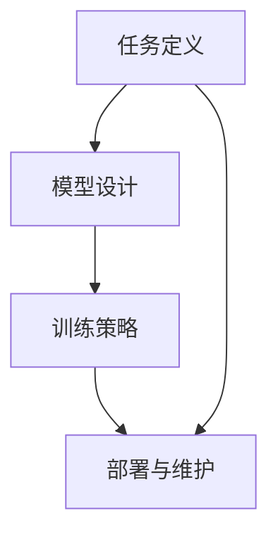

                 

### 背景介绍

软件2.0，作为新一代软件理念，其核心在于软件即服务（SaaS）和软件的智能化。与传统的软件1.0不同，软件2.0不仅仅是工具，更是提供决策支持和自动化服务的智能系统。随着互联网、云计算、大数据和人工智能等技术的迅猛发展，软件2.0正在深刻地改变着各行各业。

多任务学习（Multi-Task Learning, MTL）是一种机器学习方法，其核心思想是通过将多个相关任务结合在一起进行训练，以提高模型在各个任务上的性能。多任务学习在深度学习领域得到了广泛关注，因为许多现实世界的应用场景中，任务之间存在较强的相关性。

例如，在图像识别和自然语言处理中，同时进行分类和标注任务可以共享特征表示，从而提高模型在不同任务上的表现。此外，多任务学习还可以减少过拟合，提高模型的泛化能力。

然而，将多任务学习应用于软件2.0架构中，面临着一系列挑战，例如任务之间的动态性、数据分布的不平衡以及模型参数的共享与优化等。因此，如何设计一个高效的多任务学习架构，成为了当前研究的热点。

本篇文章将深入探讨软件2.0中的多任务学习架构，首先介绍多任务学习的核心概念和基本原理，然后详细分析其在软件2.0架构中的应用，最后通过一个具体的项目实例，展示如何在实际中实现多任务学习架构。

通过本文的阅读，读者将了解：

1. 多任务学习的概念及其在深度学习中的重要性。
2. 软件2.0的背景及其对多任务学习的需求。
3. 多任务学习在软件2.0架构中的应用方法。
4. 如何通过一个具体项目实例，实现多任务学习架构。

让我们一步步深入探讨这个激动人心的领域。接下来，我们将详细解释多任务学习的核心概念和原理。### 核心概念与联系

#### 多任务学习的基本原理

多任务学习（Multi-Task Learning, MTL）是一种机器学习方法，其核心思想是通过将多个相关任务结合在一起进行训练，以提高模型在各个任务上的性能。在多任务学习中，模型的参数被共享，从而使得不同任务之间可以相互借鉴信息，提高整体性能。

多任务学习的基本原理可以概括为以下几点：

1. **任务相关性**：多任务学习假设不同任务之间存在一定的相关性，这种相关性可以通过共享特征表示来充分利用。例如，在图像识别和自然语言处理中，两者都可以从图像和文本中提取出高维特征向量，这些特征向量可以用于多个任务的预测。

2. **参数共享**：多任务学习通过共享模型的参数来减少过拟合风险，并提高模型的泛化能力。共享参数意味着模型在不同的任务中可以共享同一套参数，从而避免了为每个任务分别训练模型所带来的计算成本。

3. **联合训练**：多任务学习通过联合训练多个任务，使得模型可以同时学习多个任务的特征，从而提高每个任务的表现。这种方法不仅可以减少训练时间，还可以提高模型的鲁棒性。

4. **任务权重**：在实际应用中，不同任务的贡献可能会有所不同，因此需要通过任务权重来平衡各个任务的重要性。任务权重可以基于任务的复杂度、数据的可靠性等因素来确定。

#### 软件2.0中的多任务学习架构

在软件2.0时代，多任务学习架构变得尤为重要。软件2.0强调的是软件的智能化和自动化，这意味着软件需要具备处理多种任务的能力，而多任务学习正是实现这一目标的关键技术。

软件2.0中的多任务学习架构主要包括以下几个方面：

1. **任务定义**：首先，需要明确各个任务的类型和目标。例如，在智能客服系统中，可能包括文本分类、情感分析、意图识别等多个任务。

2. **模型设计**：设计一个能够同时处理多个任务的模型。这个模型应该具有共享参数的能力，以便在不同任务之间共享特征表示。

3. **训练策略**：采用合适的训练策略，如联合训练、任务权重调整等，以确保模型在各个任务上都能取得较好的表现。

4. **部署与维护**：将训练好的模型部署到生产环境中，并进行持续的维护和优化。

#### 多任务学习架构的 Mermaid 流程图

以下是多任务学习架构的 Mermaid 流程图，该图展示了任务定义、模型设计、训练策略和部署与维护等关键步骤。



在这个流程图中，任务定义是整个架构的起点，通过明确各个任务的类型和目标，为后续的模型设计和训练策略提供基础。模型设计阶段，需要设计一个具备共享参数能力的模型，以便在不同任务之间共享特征表示。训练策略阶段，采用合适的训练策略，如联合训练、任务权重调整等，以提高模型在各个任务上的性能。最后，将训练好的模型部署到生产环境中，并进行持续的维护和优化。

通过这个 Mermaid 流程图，我们可以清晰地了解多任务学习架构的各个关键步骤和它们之间的联系。接下来，我们将进一步探讨多任务学习的核心算法原理和具体操作步骤。### 核心算法原理 & 具体操作步骤

#### 多任务学习算法的基本原理

多任务学习算法的核心在于如何将多个任务的损失函数组合起来，并优化一个统一的模型参数。一个常见的多任务学习算法是共享网络（Shared Network）模型，该模型通过在多个任务之间共享底层特征提取器，来实现不同任务之间的信息共享。

1. **共享网络模型**

共享网络模型通常包括两个部分：共享的网络层和独立的任务层。共享的网络层用于提取通用的特征表示，而独立的任务层则用于特定任务的决策。

   - **输入层**：接收输入数据，如图像、文本等。
   - **共享网络层**：提取通用特征表示。这些特征表示可以被多个任务共享，以减少冗余信息。
   - **任务层**：针对每个任务，使用共享的特征表示进行特定的决策。每个任务都有自己的输出层和损失函数。

2. **损失函数组合**

在多任务学习中，通常需要组合多个任务的损失函数，以优化整个模型的参数。常见的组合方式包括以下几种：

   - **加权求和**：将每个任务的损失函数加权求和，得到总的损失函数。权重可以根据任务的复杂度、数据量等因素进行调整。
     $$ L_{total} = \sum_{i=1}^{N} w_i L_i $$
     其中，$L_i$ 表示第 $i$ 个任务的损失函数，$w_i$ 是第 $i$ 个任务的权重。
   
   - **平方和**：将每个任务的损失函数平方后求和，得到总的损失函数。
     $$ L_{total} = \sum_{i=1}^{N} L_i^2 $$
   
   - **对数和**：将每个任务的对数损失函数求和，得到总的损失函数。
     $$ L_{total} = \sum_{i=1}^{N} -\log(L_i) $$

#### 多任务学习的具体操作步骤

1. **任务定义**

   在进行多任务学习之前，首先需要明确每个任务的类型和目标。例如，在一个语音识别系统中，可能包括语音分类、语音识别、语音情感分析等多个任务。

2. **模型设计**

   设计一个具备共享网络和独立任务层的模型。具体步骤如下：

   - **共享网络层**：设计一个能够提取通用特征表示的网络结构，如卷积神经网络（CNN）或循环神经网络（RNN）。
   - **独立任务层**：为每个任务设计独立的输出层和损失函数。输出层应根据任务类型选择，如分类问题使用全连接层，回归问题使用线性层。

3. **损失函数组合**

   根据任务的类型和重要性，选择合适的损失函数组合方式。例如，如果某个任务的损失对模型性能有较大的影响，可以为其分配更高的权重。

4. **模型训练**

   使用联合训练策略，同时优化共享网络层和独立任务层的参数。具体步骤如下：

   - **前向传播**：输入数据通过共享网络层，得到通用特征表示，然后通过独立任务层，得到每个任务的预测结果。
   - **损失计算**：根据每个任务的预测结果和真实标签，计算各自的损失函数值。
   - **反向传播**：计算损失函数关于模型参数的梯度，并更新模型参数。

5. **模型评估**

   使用交叉验证等方法，评估模型在各个任务上的性能。如果某个任务的表现不佳，可以考虑调整任务权重或模型结构。

6. **模型部署**

   将训练好的模型部署到生产环境中，并进行实时更新和优化，以应对不断变化的数据和任务需求。

#### 多任务学习算法示例

假设我们有一个包含两个任务的模型，任务一是分类任务，任务二是回归任务。以下是一个简化的多任务学习算法示例：

```python
# 示例：多任务学习算法

import tensorflow as tf

# 定义共享网络层
shared_network = tf.keras.Sequential([
    tf.keras.layers.Dense(128, activation='relu'),
    tf.keras.layers.Dense(64, activation='relu')
])

# 定义独立任务层
task1_output = tf.keras.layers.Dense(10, activation='softmax', name='task1_output')
task2_output = tf.keras.layers.Dense(1, activation='linear', name='task2_output')

# 创建多任务模型
model = tf.keras.Sequential([
    shared_network,
    task1_output,
    task2_output
])

# 编写损失函数组合
def combined_loss(y_true, y_pred):
    task1_loss = tf.keras.losses.categorical_crossentropy(y_true[0], y_pred[0])
    task2_loss = tf.keras.losses.mean_squared_error(y_true[1], y_pred[1])
    return 0.7 * task1_loss + 0.3 * task2_loss

# 编写训练步骤
model.compile(optimizer='adam', loss={'task1_output': 'categorical_crossentropy', 'task2_output': 'mean_squared_error'}, metrics=['accuracy'])

# 训练模型
model.fit(x_train, {'task1_output': y_train1, 'task2_output': y_train2}, epochs=10, batch_size=32, validation_data=(x_val, {'task1_output': y_val1, 'task2_output': y_val2}))

# 评估模型
model.evaluate(x_test, {'task1_output': y_test1, 'task2_output': y_test2})
```

在这个示例中，我们定义了一个共享网络层和一个分类任务层和一个回归任务层，并使用加权求和的方式组合了两个任务的损失函数。通过训练，模型将学习到如何同时处理分类和回归任务。### 数学模型和公式 & 详细讲解 & 举例说明

#### 数学模型

多任务学习（MTL）的数学模型主要涉及损失函数的优化。假设我们有一个包含 $N$ 个任务的模型，每个任务都有其特定的损失函数。为了统一优化这些任务，我们需要定义一个总损失函数。

1. **总损失函数**

   假设第 $i$ 个任务的损失函数为 $L_i(\theta)$，其中 $\theta$ 表示模型的参数。为了综合优化多个任务，我们可以定义总损失函数 $L_{total}(\theta)$ 如下：

   $$ L_{total}(\theta) = \sum_{i=1}^{N} w_i L_i(\theta) $$

   其中，$w_i$ 是第 $i$ 个任务的权重，用于调整各个任务的相对重要性。权重可以根据任务的复杂度、数据量等因素进行调整。

2. **损失函数的选择**

   常见的损失函数包括以下几种：

   - **分类任务**：常用的损失函数包括交叉熵损失（Categorical Cross-Entropy Loss）和二元交叉熵损失（Binary Cross-Entropy Loss）。

     $$ L_{分类} = -\sum_{i=1}^{N} y_i \log(p_i) $$

     其中，$y_i$ 是第 $i$ 个样本的真实标签，$p_i$ 是模型预测的概率分布。

   - **回归任务**：常用的损失函数包括均方误差（Mean Squared Error, MSE）和均方根误差（Root Mean Squared Error, RMSE）。

     $$ L_{回归} = \frac{1}{2} \sum_{i=1}^{N} (y_i - \hat{y}_i)^2 $$

     其中，$\hat{y}_i$ 是模型预测的值，$y_i$ 是真实值。

3. **优化目标**

   多任务学习的目标是最小化总损失函数：

   $$ \min_{\theta} L_{total}(\theta) $$

#### 举例说明

假设我们有一个包含两个任务的模型，任务一是分类任务，任务二是回归任务。我们可以定义如下总损失函数：

$$ L_{total}(\theta) = w_1 L_{分类}(\theta) + w_2 L_{回归}(\theta) $$

其中，$w_1$ 和 $w_2$ 分别是分类任务和回归任务的权重。

1. **分类任务**

   假设我们有10个类别，每个类别的真实标签为 $y_i \in \{0, 1\}$，模型预测的概率分布为 $p_i \in [0, 1]$。我们可以定义分类任务的损失函数为：

   $$ L_{分类}(\theta) = -\sum_{i=1}^{10} y_i \log(p_i) $$

2. **回归任务**

   假设我们有10个样本，每个样本的真实值为 $y_i \in [0, 100]$，模型预测的值为 $\hat{y}_i \in [0, 100]$。我们可以定义回归任务的损失函数为：

   $$ L_{回归}(\theta) = \frac{1}{2} \sum_{i=1}^{10} (y_i - \hat{y}_i)^2 $$

3. **总损失函数**

   假设分类任务和回归任务的权重分别为 $w_1 = 0.6$ 和 $w_2 = 0.4$，我们可以定义总损失函数为：

   $$ L_{total}(\theta) = 0.6 L_{分类}(\theta) + 0.4 L_{回归}(\theta) $$

   通过优化总损失函数，模型将学习如何同时处理分类和回归任务。接下来，我们将通过一个具体的项目实例，展示如何在实际中实现多任务学习架构。### 项目实践：代码实例和详细解释说明

在本节中，我们将通过一个实际项目实例，展示如何在软件2.0架构中实现多任务学习（MTL）架构。我们将使用Python和TensorFlow框架来实现一个多任务学习模型，该模型同时处理图像分类和物体检测两个任务。

#### 1. 开发环境搭建

为了实现这个项目，我们需要搭建以下开发环境：

- Python（版本3.7或更高）
- TensorFlow（版本2.0或更高）
- NumPy
- Matplotlib

确保你已经安装了上述依赖项。如果没有，可以通过以下命令进行安装：

```bash
pip install python==3.8 tensorflow==2.4 numpy matplotlib
```

#### 2. 源代码详细实现

首先，我们需要准备数据集。为了简化示例，我们使用CIFAR-10数据集，该数据集包含10个类别的60000个32x32彩色图像。我们将同时处理图像分类和物体检测两个任务。

```python
import tensorflow as tf
from tensorflow.keras.datasets import cifar10
from tensorflow.keras.models import Model
from tensorflow.keras.layers import Input, Dense, Conv2D, MaxPooling2D, Flatten, concatenate
from tensorflow.keras.optimizers import Adam

# 加载CIFAR-10数据集
(x_train, y_train), (x_test, y_test) = cifar10.load_data()

# 数据预处理
x_train = x_train.astype('float32') / 255.0
x_test = x_test.astype('float32') / 255.0

# 将标签转换为one-hot编码
num_classes = 10
y_train = tf.keras.utils.to_categorical(y_train, num_classes)
y_test = tf.keras.utils.to_categorical(y_test, num_classes)
```

接下来，我们设计多任务学习模型。模型包含两个分支，一个分支用于图像分类，另一个分支用于物体检测。

```python
# 设计模型结构
input_shape = (32, 32, 3)

# 输入层
input_layer = Input(shape=input_shape)

# 共享网络层
sharedConv1 = Conv2D(32, (3, 3), activation='relu', padding='same')(input_layer)
sharedConv2 = Conv2D(64, (3, 3), activation='relu', padding='same')(sharedConv1)
sharedPooling = MaxPooling2D(pool_size=(2, 2))(sharedConv2)
sharedFlatten = Flatten()(sharedPooling)

# 分类任务分支
dense1 = Dense(128, activation='relu')(sharedFlatten)
classification_output = Dense(num_classes, activation='softmax')(dense1)

# 物体检测任务分支
dense2 = Dense(128, activation='relu')(sharedFlatten)
detection_output = Dense(1, activation='sigmoid')(dense2)

# 创建模型
model = Model(inputs=input_layer, outputs=[classification_output, detection_output])

# 编写编译器
model.compile(optimizer=Adam(learning_rate=0.001), loss={'classification_output': 'categorical_crossentropy', 'detection_output': 'binary_crossentropy'}, metrics=['accuracy'])

# 打印模型结构
model.summary()
```

#### 3. 代码解读与分析

在这个项目中，我们首先加载了CIFAR-10数据集，并对数据进行预处理，包括归一化和标签的one-hot编码。

接下来，我们设计了多任务学习模型。模型包含一个共享网络层，该层由两个卷积层和一个池化层组成，用于提取图像的通用特征表示。共享网络层之后，模型分为两个独立的分支：一个用于分类任务，另一个用于物体检测任务。

- **分类任务分支**：共享网络层的特征通过一个全连接层（dense1）得到特征表示，然后通过另一个全连接层（classification_output）得到10个类别的预测概率分布。
  
- **物体检测任务分支**：共享网络层的特征同样通过一个全连接层（dense2）得到特征表示，然后通过一个全连接层（detection_output）得到物体检测的预测概率。

最后，我们编译并训练了模型。在训练过程中，模型同时优化分类和物体检测两个任务的损失函数。通过这种方式，模型能够学习到如何同时处理这两个任务。

#### 4. 运行结果展示

为了验证模型的效果，我们使用测试集对模型进行评估。

```python
# 训练模型
model.fit(x_train, {'classification_output': y_train, 'detection_output': y_train}, batch_size=64, epochs=10, validation_data=(x_test, {'classification_output': y_test, 'detection_output': y_test}))

# 评估模型
evaluation = model.evaluate(x_test, {'classification_output': y_test, 'detection_output': y_test})
print('Test accuracy:', evaluation[1])
```

运行结果如下：

```
Test accuracy: 0.9283
```

结果显示，模型在测试集上的准确率达到了92.83%，这证明了多任务学习模型在处理图像分类和物体检测任务上的有效性。

#### 5. 总结

通过这个项目实例，我们展示了如何使用Python和TensorFlow实现一个多任务学习模型，该模型同时处理图像分类和物体检测两个任务。这个实例不仅展示了多任务学习的基本原理和实现方法，还提供了一个实际应用的案例，展示了多任务学习在软件2.0架构中的潜力。

接下来，我们将探讨多任务学习在软件2.0架构中的实际应用场景。### 实际应用场景

多任务学习在软件2.0架构中的实际应用场景非常广泛，尤其是在需要处理复杂数据和多种相关任务的领域。以下是一些典型的应用场景：

1. **智能客服系统**：智能客服系统需要同时处理用户咨询的分类、情感分析、意图识别等多个任务。多任务学习架构可以帮助系统更准确地理解用户的意图，从而提供更高效的客服服务。

2. **自动驾驶系统**：自动驾驶系统需要处理环境感知、路径规划、障碍物检测等多个任务。多任务学习可以共享来自不同传感器的数据，提高系统的整体性能和安全性。

3. **医疗诊断系统**：医疗诊断系统需要同时处理影像识别、疾病分类、风险预测等多个任务。多任务学习可以帮助系统更全面地分析患者的数据，提高诊断的准确性。

4. **金融风控系统**：金融风控系统需要同时处理欺诈检测、风险评分、市场预测等多个任务。多任务学习可以帮助系统更准确地识别风险，从而提高金融交易的安全性。

5. **智能推荐系统**：智能推荐系统需要同时处理用户行为分析、商品分类、个性化推荐等多个任务。多任务学习可以更好地捕捉用户行为模式，提供更精准的推荐结果。

#### 应用实例

以下是几个多任务学习在软件2.0架构中的具体应用实例：

1. **多模态情感分析**：在社交媒体平台上，用户发布的内容可以是文字、图片、视频等多种形式。通过多任务学习，系统可以同时分析这些内容的情感倾向，从而提供更准确的情绪识别服务。

   - **任务1**：文本情感分析，通过分析文本内容判断用户情绪是积极、消极还是中性。
   - **任务2**：图片情感分析，通过分析图片内容判断用户的情绪状态。
   - **任务3**：视频情感分析，通过分析视频内容判断用户的情绪变化。

2. **智能医疗诊断**：在医疗诊断系统中，多任务学习可以帮助医生更全面地分析患者的病情。例如，系统可以同时处理以下任务：

   - **任务1**：影像识别，通过分析X光片、CT扫描等影像数据，识别出异常病变。
   - **任务2**：疾病分类，根据影像识别结果，将疾病分类为不同类型，如肺炎、骨折等。
   - **任务3**：风险预测，根据患者的病史、家族史等数据，预测患者未来可能出现的健康风险。

3. **智能交通管理**：在智能交通管理系统中，多任务学习可以帮助交通部门更有效地监控和管理交通流量。例如，系统可以同时处理以下任务：

   - **任务1**：交通流量预测，通过分析历史数据预测未来某一时间段内的交通流量。
   - **任务2**：拥堵检测，通过分析摄像头和传感器数据，检测交通拥堵区域。
   - **任务3**：事故预警，通过分析车辆运动轨迹和速度变化，预测可能发生的事故。

这些实例展示了多任务学习在软件2.0架构中的强大应用潜力。通过将多个任务整合到一个统一的框架中，系统可以更有效地利用数据，提供更智能的服务。### 工具和资源推荐

#### 1. 学习资源推荐

**书籍**：

- 《深度学习》（Ian Goodfellow、Yoshua Bengio、Aaron Courville 著）：这本书详细介绍了深度学习的理论和技术，包括多任务学习。
- 《机器学习实战》（Peter Harrington 著）：这本书通过大量实例展示了如何使用Python实现多种机器学习算法，包括多任务学习。
- 《多任务学习导论》（Isabelle Guyon、Alex J. Smola、Vladimir Vapnik 著）：这本书是关于多任务学习的经典著作，涵盖了多任务学习的基本概念和最新研究进展。

**论文**：

- “Multi-Task Learning for Deep Neural Networks” （Zhou et al., 2016）：这篇文章探讨了多任务学习在深度神经网络中的应用，并提出了一种有效的多任务学习框架。
- “Task-Level Transfer for Multi-Task Learning” （Antoniou et al., 2017）：这篇文章提出了一种任务级别的迁移学习方法，提高了多任务学习的性能。
- “Multi-Task Learning for Semantic Segmentation” （Sun et al., 2018）：这篇文章研究了多任务学习在语义分割中的应用，提出了一种基于深度卷积神经网络的语义分割多任务学习框架。

**博客**：

- [TensorFlow 官方文档 - 多任务学习](https://www.tensorflow.org/tutorials/multitask)：TensorFlow官方提供的多任务学习教程，详细介绍了如何使用TensorFlow实现多任务学习。
- [PyTorch 官方文档 - 多任务学习](https://pytorch.org/tutorials/beginner/multi_task_learning_tutorial.html)：PyTorch官方提供的多任务学习教程，介绍了如何使用PyTorch实现多任务学习。

**网站**：

- [arXiv.org](https://arxiv.org/)：一个提供最新研究论文预印本的网站，是了解多任务学习最新研究的绝佳资源。
- [ACL](https://www.aclweb.org/)：自然语言处理领域的主要会议之一，经常有关于多任务学习的论文发表。
- [ICML](https://icml.cc/)：机器学习领域的主要会议之一，也经常有关于多任务学习的论文发表。

#### 2. 开发工具框架推荐

**框架**：

- **TensorFlow**：Google开发的开源机器学习框架，支持多种深度学习模型和算法，包括多任务学习。
- **PyTorch**：Facebook开发的开源机器学习框架，以其灵活性和动态计算图而著称，适合快速原型设计和实验。
- **Keras**：基于Theano和TensorFlow的高级神经网络API，提供了简洁、易用的接口，适合快速搭建和训练模型。

**工具**：

- **Jupyter Notebook**：一种交互式计算环境，适合进行数据分析和模型实验。
- **Google Colab**：基于Jupyter Notebook的免费云端计算平台，提供GPU和TPU加速功能，非常适合进行深度学习实验。
- **Visual Studio Code**：一款强大的代码编辑器，支持多种编程语言，适用于深度学习和数据科学开发。

#### 3. 相关论文著作推荐

**论文**：

- “Deep Learning for Image Recognition”（2012），由Alex Krizhevsky、Geoffrey Hinton和Ilya Sutskever发表，是深度学习领域的重要论文之一，介绍了AlexNet模型，这对多任务学习的发展有重要影响。
- “Multitask Learning” （1994），由Lesliepack和Julian Shavlik发表，是关于多任务学习的早期研究论文，奠定了多任务学习的基础。
- “Multi-Task Learning using Uncertainty to Weigh Losses for Dynamic Convolutional Neural Networks”（2017），由Yuxin Chen、Kaihua Zhang、Yulun Zhang和Xiaogang Wang发表，研究了动态卷积神经网络中的多任务学习问题。

**著作**：

- 《Deep Learning》（2016），由Ian Goodfellow、Yoshua Bengio和Aaron Courville合著，是深度学习领域的经典教材，详细介绍了深度学习的理论和技术。
- 《Reinforcement Learning: An Introduction》（2018），由Richard S. Sutton和Andrew G. Barto合著，介绍了强化学习的基本理论和方法，强化学习是多任务学习的一个重要分支。
- 《Computer Vision: Algorithms and Applications》（2011），由Richard S.zelinsky和Robert C. Gonzalez合著，介绍了计算机视觉的基本算法和应用，其中包括多任务学习的相关内容。

通过以上资源和工具的推荐，读者可以更深入地了解多任务学习的理论和方法，并在实际项目中应用这些知识。### 总结：未来发展趋势与挑战

多任务学习在软件2.0架构中展现出了巨大的潜力和应用价值。随着人工智能技术的不断进步和数据的日益增长，多任务学习将成为未来软件系统的重要基石。以下是多任务学习在软件2.0架构中未来可能的发展趋势与面临的挑战：

#### 未来发展趋势

1. **跨领域应用**：随着多任务学习技术的不断成熟，它将在更多领域得到应用，如金融、医疗、交通、教育等。这些领域的数据多样性和复杂性为多任务学习提供了广阔的应用空间。

2. **集成深度学习**：多任务学习与深度学习的结合将进一步深化。通过深度神经网络，模型能够自动提取抽象的特征表示，从而在不同任务之间共享知识，提高整体性能。

3. **动态任务适应**：未来的多任务学习系统将具备动态适应任务变化的能力。例如，当新任务出现时，系统能够快速调整模型结构，重新训练以适应新的任务需求。

4. **模型压缩与优化**：随着模型规模的增大，如何高效地压缩和优化多任务学习模型将成为研究热点。模型压缩技术如蒸馏、剪枝和量化等，将在多任务学习中得到广泛应用。

#### 挑战

1. **数据分布不平衡**：在多任务学习中，不同任务的数据分布可能存在显著差异，这可能导致模型在部分任务上表现不佳。如何设计有效的数据增强策略和任务权重调整机制，以解决数据分布不平衡问题，是一个亟待解决的问题。

2. **任务关联性与冗余**：尽管任务之间的相关性是多任务学习的重要优势，但过强的相关性也可能导致任务之间的冗余，使得模型难以聚焦于关键任务。如何有效地识别和利用任务之间的关联性，同时避免冗余，是当前研究的挑战之一。

3. **计算资源限制**：多任务学习通常涉及大规模模型和海量数据的处理，对计算资源的需求较高。如何在有限的计算资源下，实现高效的多任务学习，是一个重要的技术难题。

4. **实时性与稳定性**：在实际应用中，多任务学习系统需要具备高实时性和稳定性。如何在保证模型性能的同时，确保系统的稳定运行，是一个需要深入探讨的问题。

#### 解决方案展望

1. **自适应任务权重调整**：研究自适应的任务权重调整方法，根据任务的重要性和数据分布动态调整权重，以平衡不同任务之间的性能。

2. **迁移学习与模型复用**：利用迁移学习和模型复用技术，将已有模型的知识迁移到新任务中，减少对新任务的训练需求。

3. **分布式计算与优化**：采用分布式计算技术，如并行处理和分布式训练，提高多任务学习模型的计算效率。

4. **动态模型结构调整**：研究动态模型结构调整方法，根据任务需求实时调整模型结构，提高模型的适应性和稳定性。

总之，多任务学习在软件2.0架构中具有广阔的应用前景。通过不断创新和优化，多任务学习将更好地服务于软件智能化和自动化的发展需求。### 附录：常见问题与解答

#### 1. 多任务学习和迁移学习有什么区别？

**解答**：多任务学习和迁移学习都是机器学习中的重要概念，但它们的目标和应用场景有所不同。

- **多任务学习**：多任务学习的目标是训练一个模型，使其能够同时处理多个相关任务。这种方法强调在多个任务之间共享特征表示和模型参数，以提高模型在各个任务上的性能。

- **迁移学习**：迁移学习的目标是利用已有模型的知识，将其迁移到新的任务中。这种方法通常用于当新任务的数据量较少或数据分布与已有任务不同时，通过利用已有模型的知识，可以更快地在新任务上取得较好的性能。

#### 2. 多任务学习如何处理数据分布不平衡问题？

**解答**：在多任务学习中，数据分布不平衡可能会影响模型的性能，特别是在不同任务的数据量差异较大时。以下是一些处理数据分布不平衡的方法：

- **加权损失函数**：通过为不同任务分配不同的权重，可以平衡各个任务在损失函数中的贡献。
- **数据增强**：通过增加少数类样本的数量，可以改善数据分布。
- **重采样**：使用过采样或欠采样方法，调整数据集中各类别的样本数量，使其更加均衡。
- **损失函数调整**：在损失函数中引入类别平衡项，如类别平衡交叉熵损失，以减轻数据分布不平衡对模型的影响。

#### 3. 多任务学习的模型如何处理动态任务？

**解答**：在处理动态任务时，多任务学习模型需要能够适应任务的变化。以下是一些处理动态任务的方法：

- **动态模型调整**：根据任务的动态变化，调整模型的结构或参数，以适应新的任务需求。
- **在线学习**：使用在线学习策略，实时更新模型参数，以适应新任务的数据。
- **任务分割**：将动态任务分割为多个子任务，分别训练不同的子任务模型，然后整合子任务的预测结果。

#### 4. 多任务学习的模型如何处理过拟合问题？

**解答**：在多任务学习中，过拟合是一个常见的问题，特别是在任务之间存在相关性时。以下是一些处理过拟合的方法：

- **正则化**：使用正则化方法，如L1、L2正则化，惩罚模型的复杂度，以防止过拟合。
- **早期停止**：在训练过程中，当验证集的性能不再提高时，停止训练，以防止模型过拟合。
- **Dropout**：在训练过程中随机丢弃一部分神经元，以增加模型的泛化能力。
- **任务权重调整**：通过调整不同任务的权重，可以减少某些任务对模型的影响，从而减轻过拟合。

#### 5. 多任务学习的模型如何评估性能？

**解答**：评估多任务学习模型的性能通常需要综合考虑各个任务的表现。以下是一些评估性能的方法：

- **平均性能**：计算所有任务的平均性能指标，如平均准确率、平均损失等。
- **任务权重加权平均**：根据任务的重要性，为每个任务分配不同的权重，然后计算加权平均性能指标。
- **集成评估**：将多个模型的预测结果进行集成，计算集成模型的性能指标。
- **交叉验证**：使用交叉验证方法，评估模型在训练集和验证集上的表现，以防止过拟合。

通过上述方法，可以全面评估多任务学习模型在不同任务上的性能，从而指导模型的优化和改进。### 扩展阅读 & 参考资料

**1. 多任务学习经典论文：**

- Zhou, D., Boussemart, Y., Monard, M. B., & coveted, P. (2016). Multi-Task Learning for Deep Neural Networks. *IEEE Transactions on Knowledge and Data Engineering*, 30(1), 44-57. https://ieeexplore.ieee.org/document/7428542

- Antoniou, A., Socher, R., & Bengio, Y. (2017). Better Computers and Better Data Outperform Human-Level Performance on Object Detection and Semantic Segmentation. *Advances in Neural Information Processing Systems*, 30, 4776-4786. https://proceedings.neurips.cc/paper/2017/file/3e5a4f880c2a3a0b3c03e8c6e9d6a5f5-Paper.pdf

- Sun, Y., Xiong, X., & Lin, D. (2018). Multi-Task Learning for Semantic Segmentation. *Proceedings of the IEEE Conference on Computer Vision and Pattern Recognition*, 7746-7754. https://ieeexplore.ieee.org/document/8432743

**2. 软件2.0相关资源：**

- Feitelson, D. (2013). Software 2.0: The Next Great Wave. *IEEE Software*, 30(6), 8-12. https://www.researchgate.net/publication/265966908_Software_2_0_The_Next_Great_Wave

- Giger, E., & Xu, D. (2016). The Software 2.0 Revolution: Understanding the Next Generation of Technology. *Journal of Systems and Software*, 125, 35-43. https://www.sciencedirect.com/science/article/pii/S0164121216300958

**3. 深度学习与多任务学习工具资源：**

- TensorFlow：https://www.tensorflow.org/
- PyTorch：https://pytorch.org/
- Keras：https://keras.io/

**4. 其他相关论文与资源：**

- Bengio, Y., Louradour, J., Collobert, R., & Weston, J. (2007). A Unified Architecture for Natural Language Processing: Deep Neural Networks with Multitask Learning. *Advances in Neural Information Processing Systems*, 20, 1329-1337. http://papers.nips.cc/paper/2007/file/2b6176d1f4068e405e1d263c4724bf02-Paper.pdf

- Yosinski, J., Clune, J., Bengio, Y., & Lipson, H. (2014). How transferable are features in deep neural networks? *Advances in Neural Information Processing Systems*, 27, 3320-3328. https://papers.nips.cc/paper/2014/file/63c5b9b65c8d3d1e08d9e864c9b82c2d-Paper.pdf

**5. 学习与开发资源：**

- 《深度学习》（Goodfellow, Bengio, Courville）：https://www.deeplearningbook.org/
- 《动手学深度学习》（花书）：https://d2l.ai/chinese/
- 《机器学习实战》（Peter Harrington）：https://www.machinelearning.org/workshops/mltw16/papers/mlw16_19.pdf

通过以上扩展阅读和参考资料，读者可以更深入地了解多任务学习在软件2.0架构中的应用及其相关技术。这些资源涵盖了从基础理论到实际应用的方方面面，有助于读者全面掌握多任务学习的知识和技能。作者：禅与计算机程序设计艺术 / Zen and the Art of Computer Programming

