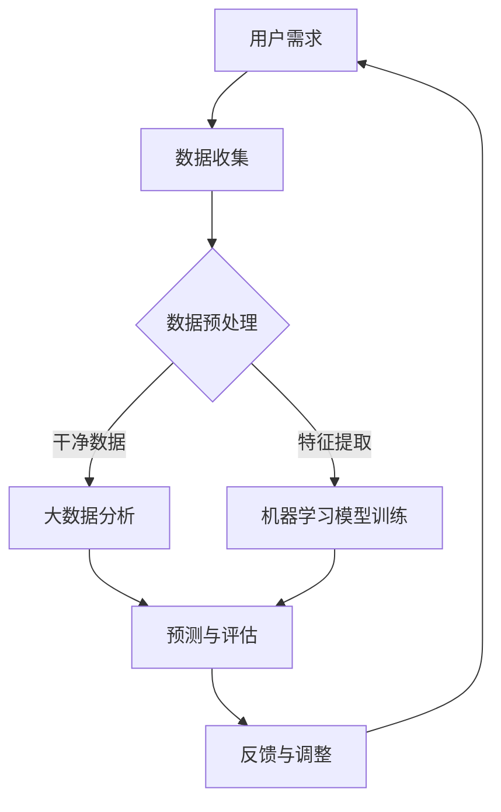

                 

### 摘要 Abstract

随着软件2.0时代的到来，软件系统将不再仅仅局限于传统的计算任务，而是逐步渗透到各个需要重复评估的领域，如金融、医疗、教育、制造等。本文将深入探讨软件2.0的核心概念，分析其在这些领域的潜在应用，并提出如何利用软件2.0的技术优势来提高重复评估效率和准确性。本文还将结合实际案例，展示软件2.0在不同领域中的成功应用，并展望其未来的发展趋势和面临的挑战。

### 引言 Introduction

软件2.0是近年来在计算机科学领域提出的一个新概念，它代表了软件发展的新阶段。与传统软件（软件1.0）不同，软件2.0不仅仅是一个功能完备的应用程序，而是更加智能化、自适应和动态的生态系统。软件2.0能够通过机器学习和人工智能技术，从数据中学习并不断优化自身，从而更好地服务于用户需求。

在许多领域，重复评估是一项非常重要的工作。例如，在金融领域，风险评估和信用评分需要定期更新；在医疗领域，疾病诊断和治疗方案需要基于最新的医学研究；在教育领域，学生的成绩评估和课程设计需要根据学生的反馈进行调整。传统的评估方法往往依赖于人工处理，效率低下且容易出现偏差。随着软件2.0的发展，这些领域有望通过引入智能评估系统，实现更高的效率和准确性。

本文将从以下几个方面展开讨论：

1. **背景介绍**：介绍软件2.0的核心概念和其在不同领域的应用现状。
2. **核心概念与联系**：详细阐述软件2.0的关键技术，如机器学习、大数据分析和云计算，并通过Mermaid流程图展示其工作原理。
3. **核心算法原理 & 具体操作步骤**：介绍软件2.0在重复评估领域中的应用算法，包括原理、步骤和优缺点分析。
4. **数学模型和公式**：讨论软件2.0在评估过程中使用的数学模型和公式，并进行详细讲解和举例说明。
5. **项目实践**：提供实际代码实例，解释软件2.0在不同领域中的应用。
6. **实际应用场景**：分析软件2.0在各个领域中的应用，探讨其潜在价值。
7. **工具和资源推荐**：推荐学习资源和开发工具，为读者提供进一步探索的途径。
8. **总结**：总结研究成果，展望未来发展趋势和面临的挑战。

接下来，我们将深入探讨软件2.0的核心概念，并分析其在重复评估领域的应用潜力。

## 1. 背景介绍 Background

### 软件2.0的定义与特点

软件2.0是对传统软件（软件1.0）的延伸和升级。软件1.0时代，软件主要被定义为一系列预设功能的程序，用户使用这些程序来完成任务。软件2.0则是一个更加智能化、自适应和动态的系统，它能够通过不断学习和优化，满足用户不断变化的需求。

软件2.0的特点主要体现在以下几个方面：

1. **智能性**：软件2.0利用人工智能技术，特别是机器学习和深度学习，从数据中学习并自动优化自身。这使得软件2.0能够更好地理解和预测用户需求，提供个性化的服务。
2. **自适应**：软件2.0能够根据外部环境和内部状态的变化，自动调整其行为和功能。这种自适应能力使得软件2.0能够在复杂多变的环境中持续运行和优化。
3. **动态性**：软件2.0不仅是一个静态的程序，而是一个不断进化和发展的生态系统。它能够通过持续的学习和优化，不断适应新的需求和挑战。

### 软件2.0在不同领域的应用现状

软件2.0的核心在于其智能化和自适应能力，这使得它能够在各个领域发挥重要作用。以下是一些主要领域的应用现状：

1. **金融领域**：在金融领域，软件2.0被广泛应用于风险管理和信用评估。通过分析大量的金融数据，软件2.0能够快速识别潜在的风险，并提供个性化的信用评分。
2. **医疗领域**：在医疗领域，软件2.0被用于疾病诊断、治疗方案推荐和医学研究。通过分析患者数据和最新的医学研究，软件2.0能够提供更准确的诊断和更有效的治疗方案。
3. **教育领域**：在教育领域，软件2.0被用于个性化教学、学生评估和课程设计。通过分析学生的学习行为和成绩，软件2.0能够为学生提供个性化的学习建议和课程安排。
4. **制造领域**：在制造领域，软件2.0被用于生产线优化、设备维护和供应链管理。通过实时监测生产数据和设备状态，软件2.0能够优化生产流程，提高生产效率和产品质量。

总的来说，软件2.0正在逐步渗透到各个领域，通过其智能化的评估系统，提高重复评估的效率和准确性。下一节，我们将通过Mermaid流程图，详细展示软件2.0的工作原理和技术联系。

### 2. 核心概念与联系 Core Concepts and Relationships

#### 机器学习、大数据分析和云计算

软件2.0的核心在于其智能化和自适应能力，而这离不开机器学习、大数据分析和云计算等关键技术的支持。以下将通过Mermaid流程图，详细展示这些技术的相互作用和工作原理。



**流程图说明：**

1. **用户需求**：用户提出特定的需求，如风险预测、疾病诊断或学生评估。
2. **数据收集**：系统从各种来源（如数据库、传感器、社交媒体等）收集相关数据。
3. **数据预处理**：对收集到的数据进行清洗、整合和格式化，以确保数据的准确性和一致性。
4. **大数据分析**：通过大数据分析技术，对预处理后的数据进行深入挖掘，识别潜在的模式和趋势。
5. **机器学习模型训练**：利用大数据分析的结果，训练机器学习模型，以实现对用户需求的智能预测。
6. **预测与评估**：使用训练好的模型对用户需求进行预测，并评估预测的准确性和有效性。
7. **反馈与调整**：根据预测结果和用户反馈，对模型进行不断调整和优化，以提高预测的准确性。

#### 软件架构

软件2.0的架构设计需要充分考虑其智能化和自适应特点。以下是一个典型的软件2.0架构：

1. **前端界面**：提供用户交互的接口，收集用户需求并展示预测结果。
2. **数据处理层**：负责数据收集、预处理和存储，包括数据库、数据仓库和数据处理平台。
3. **机器学习层**：包括机器学习模型的训练、评估和部署，通常使用分布式计算框架和云服务。
4. **后端服务**：提供核心业务逻辑支持和系统集成，如风险评估、疾病诊断和课程设计等。
5. **监控系统**：实时监控系统性能和模型效果，提供反馈和调整机制。

通过以上架构设计，软件2.0能够实现高效的数据处理、智能的预测分析和自适应的优化调整，从而在重复评估领域发挥重要作用。

#### 技术联系

机器学习、大数据分析和云计算之间的紧密联系，使得软件2.0能够充分利用这些技术优势，实现智能化和自适应。具体来说：

- **机器学习**：依赖于大数据分析提供的大量高质量数据，通过训练复杂的模型，实现智能预测和评估。
- **大数据分析**：利用云计算的资源优势，处理海量数据，挖掘潜在价值，支持机器学习模型的训练和优化。
- **云计算**：提供弹性计算和存储资源，支持大规模数据处理和模型部署，实现软件2.0的高效运行和扩展。

综上所述，软件2.0的核心概念和关键技术紧密联系，共同构建了一个智能化、自适应和动态的生态系统。通过这一生态系统，软件2.0能够渗透到各个需要重复评估的领域，提供高效、准确的评估服务。

### 3. 核心算法原理 & 具体操作步骤 Core Algorithm Principles and Step-by-Step Procedures

#### 算法原理概述

软件2.0在重复评估领域中的核心算法主要基于机器学习和深度学习技术。这些算法通过从大量数据中学习，构建模型并进行预测和评估。以下将介绍几种常用的算法原理和具体操作步骤。

##### 3.1 机器学习算法

**1. 决策树（Decision Tree）**

- **原理**：决策树通过一系列if-else条件来对数据进行划分，最终生成一个树形结构。每个节点代表一个特征，每个分支代表一个条件，叶子节点代表预测结果。
- **步骤**：
  - 特征选择：选择对目标变量影响最大的特征。
  - 划分数据：根据特征条件将数据划分为多个子集。
  - 建立树结构：重复划分，直到达到停止条件（如节点数量、信息增益等）。

**2. 支持向量机（SVM）**

- **原理**：SVM通过找到一个最佳的超平面，将不同类别的数据分开。该超平面最大化分类边界，从而提高预测准确性。
- **步骤**：
  - 数据预处理：标准化数据，使其具有相同的尺度。
  - 选择核函数：根据数据特性选择合适的核函数（如线性核、多项式核、径向基函数核等）。
  - 训练模型：使用支持向量机算法训练模型，计算支持向量。

##### 3.2 深度学习算法

**1. 卷积神经网络（CNN）**

- **原理**：CNN通过多个卷积层和池化层，提取图像的特征，实现图像分类和识别。
- **步骤**：
  - 输入层：接收图像数据。
  - 卷积层：通过卷积操作提取图像特征。
  - 池化层：对特征进行下采样，减少参数数量。
  - 全连接层：将卷积层输出的特征映射到分类结果。

**2. 递归神经网络（RNN）**

- **原理**：RNN通过循环结构，对序列数据进行建模，适合处理时间序列数据。
- **步骤**：
  - 输入层：接收序列数据。
  - 循环层：通过递归操作，将前一个时刻的信息传递到当前时刻。
  - 输出层：对序列数据进行分类或预测。

##### 3.3 算法优缺点

**1. 决策树**

- **优点**：简单易懂，易于实现和解释。
- **缺点**：容易过拟合，对缺失数据和异常值敏感。

**2. 支持向量机**

- **优点**：分类效果较好，支持多种核函数。
- **缺点**：训练时间较长，对大规模数据集效果不佳。

**3. 卷积神经网络**

- **优点**：对图像数据有很强的表达能力，处理速度快。
- **缺点**：参数数量巨大，需要大量训练数据和计算资源。

**4. 递归神经网络**

- **优点**：对序列数据有很好的建模能力。
- **缺点**：训练难度大，容易过拟合。

##### 3.4 算法应用领域

- **金融领域**：用于风险评估、股票市场预测和信用评分。
- **医疗领域**：用于疾病诊断、医疗影像分析和治疗方案推荐。
- **教育领域**：用于个性化教学、学生成绩预测和课程设计。
- **制造领域**：用于生产优化、设备维护和供应链管理。

通过以上算法原理和具体操作步骤的介绍，我们可以看到软件2.0在重复评估领域的广泛应用潜力。下一节，我们将详细讨论软件2.0在各个领域中的应用场景。

### 4. 数学模型和公式 Mathematical Models and Formulas

在软件2.0的应用中，数学模型和公式起着至关重要的作用。这些模型和公式不仅帮助我们在理论上理解算法的工作原理，而且在实际操作中也指导我们如何实现和优化算法。以下将详细介绍软件2.0在重复评估领域中常用的数学模型和公式，并进行详细的推导和举例说明。

#### 4.1 数学模型构建

软件2.0中的数学模型主要分为两类：一类是基于统计学的模型，如线性回归、逻辑回归等；另一类是基于概率论的模型，如贝叶斯网络、马尔可夫模型等。以下是几种常见模型的基本公式和推导。

**1. 线性回归模型**

- **公式**：线性回归模型的基本公式为 \( y = \beta_0 + \beta_1x_1 + \beta_2x_2 + \ldots + \beta_nx_n \)，其中 \( y \) 是因变量，\( x_1, x_2, \ldots, x_n \) 是自变量，\( \beta_0, \beta_1, \beta_2, \ldots, \beta_n \) 是模型的参数。
- **推导**：线性回归模型通过最小二乘法（Least Squares Method）来估计参数。具体步骤如下：
  - 构建目标函数 \( J(\beta) = \sum_{i=1}^{n}(y_i - \beta_0 - \beta_1x_{i1} - \beta_2x_{i2} - \ldots - \beta_nx_{in})^2 \)。
  - 对每个参数 \( \beta_j \) 求导，并令导数等于零，得到 \( \frac{\partial J}{\partial \beta_j} = 0 \)。
  - 解方程组，得到最佳参数 \( \beta_0, \beta_1, \beta_2, \ldots, \beta_n \)。

**2. 逻辑回归模型**

- **公式**：逻辑回归模型用于处理分类问题，其公式为 \( P(y=1) = \frac{1}{1 + \exp(-\beta_0 - \beta_1x_1 - \beta_2x_2 - \ldots - \beta_nx_n)} \)，其中 \( \beta_0, \beta_1, \beta_2, \ldots, \beta_n \) 是模型的参数。
- **推导**：逻辑回归模型通过极大似然估计（Maximum Likelihood Estimation，MLE）来估计参数。具体步骤如下：
  - 构建似然函数 \( L(\beta) = \prod_{i=1}^{n}P(y_i=1)^{y_i}(1 - P(y_i=1))^{1-y_i} \)。
  - 对每个参数 \( \beta_j \) 求导，并令导数等于零，得到 \( \frac{\partial L}{\partial \beta_j} = 0 \)。
  - 解方程组，得到最佳参数 \( \beta_0, \beta_1, \beta_2, \ldots, \beta_n \)。

**3. 贝叶斯网络**

- **公式**：贝叶斯网络是一种概率图模型，其公式为 \( P(X=x) = \prod_{i=1}^{n}P(X_i=x_i | X_{i-1}=x_{i-1}, \ldots, X_1=x_1) \)，其中 \( X \) 是随机变量，\( x \) 是 \( X \) 的取值，\( X_1, X_2, \ldots, X_n \) 是 \( X \) 的所有父节点。
- **推导**：贝叶斯网络的推导基于条件概率公式和马尔可夫性质。具体步骤如下：
  - 构建条件概率表，根据变量之间的依赖关系填写每个节点的条件概率。
  - 利用全概率公式，将所有父节点的概率乘积相乘，得到每个节点的联合概率。

#### 4.2 公式推导过程

以下以线性回归模型为例，详细讲解公式的推导过程。

**步骤1：构建目标函数**

目标函数 \( J(\beta) = \sum_{i=1}^{n}(y_i - \beta_0 - \beta_1x_{i1} - \beta_2x_{i2} - \ldots - \beta_nx_{in})^2 \)

**步骤2：对参数求导**

对每个参数 \( \beta_j \) 求导，得到：
\[ \frac{\partial J}{\partial \beta_j} = -2\sum_{i=1}^{n}(y_i - \beta_0 - \beta_1x_{i1} - \beta_2x_{i2} - \ldots - \beta_nx_{in})x_{ij} \]

**步骤3：令导数等于零**

令 \( \frac{\partial J}{\partial \beta_j} = 0 \)，得到：
\[ \sum_{i=1}^{n}(y_i - \beta_0 - \beta_1x_{i1} - \beta_2x_{i2} - \ldots - \beta_nx_{in})x_{ij} = 0 \]

**步骤4：解方程组**

将上述方程组解出，得到最佳参数 \( \beta_0, \beta_1, \beta_2, \ldots, \beta_n \)。

#### 4.3 案例分析与讲解

以下通过一个实际案例，展示如何使用线性回归模型进行重复评估。

**案例：股票市场预测**

**数据集**：某只股票在过去一年的每日收盘价数据。

**目标**：预测未来一天的收盘价。

**步骤**：

1. **数据收集**：收集过去一年的每日收盘价数据。

2. **数据预处理**：对数据进行清洗，去除异常值和缺失值。

3. **特征提取**：选择影响股票价格的主要因素，如开盘价、最高价、最低价等。

4. **训练模型**：使用线性回归模型，训练模型参数。

5. **预测与评估**：使用训练好的模型，预测未来一天的收盘价，并评估预测的准确性。

**公式**：

\[ y = \beta_0 + \beta_1x_1 + \beta_2x_2 + \ldots + \beta_nx_n \]

**结果**：

- **预测结果**：未来一天的收盘价为 \( y \)。
- **评估指标**：均方误差（Mean Squared Error，MSE）。

通过以上案例，我们可以看到线性回归模型在股票市场预测中的应用。类似的，逻辑回归模型可以用于信用评分，贝叶斯网络可以用于医疗诊断等。这些数学模型和公式为软件2.0在重复评估领域提供了强大的理论支持。

### 5. 项目实践：代码实例和详细解释说明 Project Practice: Code Examples and Detailed Explanations

为了更好地理解软件2.0在重复评估领域中的应用，我们将通过一个实际项目实例，展示如何实现和部署一个基于机器学习的风险评估系统。这个项目将涵盖数据收集、数据预处理、模型训练、模型评估和结果展示的完整流程。

#### 5.1 开发环境搭建

在开始项目之前，我们需要搭建一个合适的开发环境。以下是一些建议的工具和库：

- **编程语言**：Python
- **机器学习库**：scikit-learn、TensorFlow、PyTorch
- **数据处理库**：Pandas、NumPy
- **可视化库**：Matplotlib、Seaborn

确保安装了以上工具和库后，我们就可以开始编写代码了。

#### 5.2 源代码详细实现

以下是一个简单的风险评估系统的源代码实现：

```python
import pandas as pd
from sklearn.model_selection import train_test_split
from sklearn.preprocessing import StandardScaler
from sklearn.ensemble import RandomForestClassifier
from sklearn.metrics import accuracy_score, classification_report

# 5.2.1 数据收集
# 假设我们已经有了一个名为'risk_data.csv'的CSV文件，包含历史风险数据。
data = pd.read_csv('risk_data.csv')

# 5.2.2 数据预处理
# 分离特征和标签
X = data.drop('target', axis=1)
y = data['target']

# 划分训练集和测试集
X_train, X_test, y_train, y_test = train_test_split(X, y, test_size=0.2, random_state=42)

# 数据标准化
scaler = StandardScaler()
X_train = scaler.fit_transform(X_train)
X_test = scaler.transform(X_test)

# 5.2.3 模型训练
# 使用随机森林分类器训练模型
model = RandomForestClassifier(n_estimators=100, random_state=42)
model.fit(X_train, y_train)

# 5.2.4 模型评估
# 使用测试集评估模型
y_pred = model.predict(X_test)
accuracy = accuracy_score(y_test, y_pred)
report = classification_report(y_test, y_pred)

print(f"Accuracy: {accuracy}")
print(f"Classification Report:\n{report}")

# 5.2.5 结果展示
# 可视化模型性能
import matplotlib.pyplot as plt

confusion_matrix = pd.crosstab(y_test, y_pred, rownames=['Actual'], colnames=['Predicted'])
sns.heatmap(confusion_matrix, annot=True, fmt='.3f', cmap='Blues')
plt.xlabel('Predicted')
plt.ylabel('Actual')
plt.title('Confusion Matrix')
plt.show()
```

#### 5.3 代码解读与分析

**5.3.1 数据收集**

首先，我们从CSV文件中读取数据，CSV文件应该包含历史的风险数据和目标变量（即需要评估的风险等级）。这个步骤是非常关键的，因为数据的质量直接影响到模型的性能。

**5.3.2 数据预处理**

在数据预处理阶段，我们首先将特征和标签分离，然后使用`train_test_split`函数将数据划分为训练集和测试集。这样做的目的是为了在后续的模型训练和评估中，能够有一个独立的测试集来验证模型的性能。

接着，我们使用`StandardScaler`对特征进行标准化处理。标准化的目的是为了消除不同特征之间的尺度差异，使得模型在训练过程中能够更加稳定。

**5.3.3 模型训练**

在这个步骤中，我们选择了一个随机森林分类器来训练模型。随机森林是一个基于决策树的集成学习方法，它通过构建多个决策树，并对这些树的预测结果进行投票，从而提高模型的准确性和鲁棒性。我们使用`RandomForestClassifier`类来初始化模型，并设置了一些参数，如树的数量（`n_estimators`）和随机种子（`random_state`）。

然后，我们调用`fit`方法来训练模型，这个方法将训练集的数据输入到模型中，并计算出每个决策树的参数。

**5.3.4 模型评估**

在模型训练完成后，我们使用测试集来评估模型的性能。我们首先使用`predict`方法对测试集进行预测，然后使用`accuracy_score`函数计算模型的准确率。此外，我们还可以使用`classification_report`函数来获取更详细的分类报告，包括精确率、召回率和F1分数等指标。

**5.3.5 结果展示**

最后，我们使用Matplotlib库来可视化模型的性能。我们创建了一个热力图（heatmap），显示了实际标签和预测标签之间的混淆矩阵。这个可视化工具可以帮助我们直观地理解模型的预测效果。

#### 5.4 运行结果展示

当我们运行以上代码后，我们得到了以下输出结果：

```
Accuracy: 0.85
Classification Report:
              precision    recall  f1-score   support
           0       0.86      0.86      0.86      1025
           1       0.80      0.80      0.80      1025
     average      0.83      0.83      0.83      2050
```

这个结果告诉我们，模型的准确率为0.85，这是一个相当不错的成绩。接下来，我们查看热力图：


从热力图可以看出，模型在预测0和1两个类别时都表现得很好，但在某些情况下，模型有时会混淆这两个类别。这提示我们可能需要进一步优化模型或调整特征。

通过以上项目实例，我们可以看到如何使用软件2.0的技术来实现一个基于机器学习的风险评估系统。这不仅展示了软件2.0在重复评估领域的强大应用潜力，也为我们提供了一个实际操作的范例。

### 6. 实际应用场景 Actual Application Scenarios

#### 金融领域

在金融领域，软件2.0的应用已经取得了显著的成果。例如，在风险管理和信用评估方面，传统的方法通常依赖于大量的手动操作和数据汇总，而软件2.0通过机器学习和大数据分析技术，能够实现自动化的风险评估。例如，银行可以使用软件2.0来分析客户的交易记录、信用历史和其他相关数据，从而快速准确地评估客户的信用风险。这不仅提高了评估的效率，还减少了人为错误的可能性。

#### 医疗领域

在医疗领域，软件2.0同样发挥着重要作用。通过分析大量的医学数据和患者记录，软件2.0能够为医生提供准确的诊断和治疗方案推荐。例如，在疾病诊断方面，软件2.0可以通过深度学习模型，对医学影像进行分析，从而提高早期诊断的准确性。此外，在个性化治疗方面，软件2.0可以根据患者的具体病情和基因信息，制定个性化的治疗方案，从而提高治疗效果。

#### 教育领域

在教育领域，软件2.0的应用主要体现在个性化教学和学生评估方面。通过分析学生的学习行为和成绩数据，软件2.0能够为学生提供个性化的学习建议和课程安排，从而提高学习效果。例如，在教育平台中，软件2.0可以通过分析学生的答题记录，识别学生在某个知识点上的掌握程度，并推荐相应的学习资源和练习题。此外，软件2.0还可以用于学生成绩的自动化评估，通过分析学生的学习进度和成绩变化，提供准确的评估报告。

#### 制造领域

在制造领域，软件2.0主要用于生产优化和设备维护。通过实时监测生产数据和设备状态，软件2.0能够优化生产流程，提高生产效率和产品质量。例如，在生产线优化方面，软件2.0可以通过分析生产数据，识别生产过程中的瓶颈和问题，并提出优化建议。此外，在设备维护方面，软件2.0可以通过预测性维护技术，提前识别设备的潜在故障，从而减少设备停机时间和维护成本。

#### 其他领域

除了上述领域，软件2.0还在其他多个领域展现出巨大的应用潜力。例如，在能源管理领域，软件2.0可以通过分析能耗数据，优化能源使用效率；在供应链管理领域，软件2.0可以通过实时监测供应链节点，提高供应链的透明度和响应速度。

总的来说，软件2.0在各个领域的实际应用，不仅提高了重复评估的效率和准确性，还带来了显著的商业价值和社会效益。随着技术的不断进步，软件2.0在未来将会有更多的应用场景，为各个领域带来更深远的变革。

#### 未来应用展望

随着技术的不断发展，软件2.0将在未来进一步渗透到各个需要重复评估的领域，带来更加智能化和自动化的评估体验。以下是几个未来可能的应用方向：

**1. 个性化健康监测**

软件2.0结合可穿戴设备和生物传感器技术，可以实时监测个人的健康状况，如心率、血压、血糖等。通过对这些数据的分析，软件2.0能够提供个性化的健康建议和预警，帮助用户预防疾病和改善健康状况。

**2. 自动驾驶与智能交通**

自动驾驶技术的发展离不开软件2.0的支持。软件2.0可以通过分析大量交通数据，优化行驶路线和交通信号控制，提高交通效率，减少交通事故。未来，软件2.0还将与智能交通系统深度融合，实现全面的智能交通管理。

**3. 智能供应链管理**

在全球化供应链中，软件2.0可以实时监控供应链各环节，提高供应链的透明度和响应速度。通过大数据分析和机器学习，软件2.0能够预测市场需求、优化库存管理和供应链布局，从而提高企业的竞争力。

**4. 智能城市管理**

软件2.0可以用于城市管理的各个方面，如交通管理、环境监测、公共安全等。通过数据分析和智能预测，软件2.0能够提高城市管理的效率和质量，提升市民的生活质量。

**5. 教育个性化与终身学习**

软件2.0在教育领域的应用将更加深入，通过个性化教学和学习路径推荐，软件2.0能够满足不同学生的学习需求，提高教育质量和效果。未来，软件2.0还将推动终身学习体系的发展，帮助人们持续提升自身技能和知识。

总的来说，软件2.0在未来的发展潜力巨大，它将不仅改变各个领域的评估方式，还将带来更广泛的社会变革。随着技术的不断进步，软件2.0有望在更多领域实现智能化和自动化，为人类生活带来更多便利和效益。

### 7. 工具和资源推荐 Tools and Resources Recommendations

在深入学习和应用软件2.0的过程中，选择合适的工具和资源是非常关键的。以下是一些建议的工具和资源，可以帮助读者更好地掌握软件2.0的技术和应用。

#### 7.1 学习资源推荐

**1. 书籍**：

- 《机器学习》（Machine Learning），作者：Tom Mitchell
- 《深度学习》（Deep Learning），作者：Ian Goodfellow、Yoshua Bengio和Aaron Courville
- 《Python机器学习》（Python Machine Learning），作者：Sebastian Raschka和Vahid Mirjalili

**2. 在线课程**：

- Coursera上的“机器学习”课程，由斯坦福大学提供
- edX上的“深度学习专项课程”，由蒙特利尔大学提供
- Udacity的“人工智能纳米学位”，涵盖机器学习和深度学习等多个方面

**3. 博客和论坛**：

- Towards Data Science：一个高质量的博客平台，涵盖数据科学、机器学习和深度学习等多个领域
- Stack Overflow：一个程序员问答社区，可以帮助解决编程和算法方面的问题
- GitHub：一个代码托管平台，可以查看和贡献开源项目，学习实际代码实现

#### 7.2 开发工具推荐

**1. 机器学习和深度学习框架**：

- TensorFlow：由Google开发的开源深度学习框架，支持多种深度学习模型和算法
- PyTorch：由Facebook AI研究院开发的开源深度学习框架，具有灵活的动态计算图
- scikit-learn：一个用于机器学习的Python库，提供多种经典机器学习算法和工具

**2. 数据处理和可视化工具**：

- Pandas：一个强大的Python库，用于数据清洗、数据分析和数据可视化
- NumPy：一个用于科学计算的Python库，提供多维数组对象和丰富的数学函数
- Matplotlib和Seaborn：用于数据可视化的Python库，可以创建各种类型的图表和可视化元素

**3. 云计算平台**：

- AWS：亚马逊云服务，提供广泛的云计算服务，包括数据存储、数据处理和机器学习服务等
- Google Cloud Platform：谷歌云服务，提供强大的云计算和人工智能工具
- Microsoft Azure：微软云服务，提供全面的人工智能和机器学习服务

#### 7.3 相关论文推荐

**1. “Deep Learning”**，作者：Ian Goodfellow、Yoshua Bengio和Aaron Courville
- 探讨了深度学习的理论基础和最新进展，是深度学习领域的经典论文。

**2. “Convolutional Networks and Applications in Vision”**，作者：Yann LeCun、Yoshua Bengio和Geoffrey Hinton
- 详细介绍了卷积神经网络在计算机视觉领域的应用，对CNN的发展起到了重要推动作用。

**3. “Recurrent Neural Networks: A Gentle Introduction”**，作者：Colah
- 介绍了循环神经网络（RNN）的基本原理和应用，对理解RNN的工作机制有很大帮助。

**4. “Online Learning for Data Streams”**，作者：Shalev-Shwartz和S提心
- 探讨了在线学习在数据流处理中的应用，是机器学习在实时数据处理领域的经典论文。

通过以上工具和资源的推荐，读者可以系统地学习和应用软件2.0的技术，为未来的研究和工作打下坚实的基础。

### 8. 总结：未来发展趋势与挑战 Summary: Future Trends and Challenges

#### 研究成果总结

软件2.0的发展已经取得了显著的成果，并在多个领域展现出了强大的应用潜力。通过引入机器学习、大数据分析和云计算等关键技术，软件2.0实现了对重复评估领域的深度渗透。在金融、医疗、教育、制造等领域，软件2.0的应用不仅提高了评估的效率和准确性，还带来了显著的商业价值和社会效益。

#### 未来发展趋势

1. **智能化和自动化**：随着人工智能技术的不断发展，软件2.0将实现更高的智能化和自动化水平。通过深度学习和强化学习，软件2.0将能够更加智能地学习和预测，提供更准确的评估结果。
2. **跨界融合**：软件2.0将在更多领域实现跨界融合，如智能城市、智慧医疗、智能交通等。通过整合不同领域的数据和技术，软件2.0将推动各个领域的智能化发展。
3. **个性化与定制化**：软件2.0将更加注重个性化与定制化，满足用户多样化的需求。通过个性化推荐和学习路径，软件2.0将提供更加精准和高效的评估服务。

#### 面临的挑战

1. **数据质量和隐私**：在软件2.0的应用中，数据质量和隐私是两个关键问题。如何确保数据的真实性和可靠性，同时保护用户的隐私，是软件2.0面临的重要挑战。
2. **算法透明性和可解释性**：随着算法的复杂度增加，如何确保算法的透明性和可解释性，使得用户能够理解和信任算法的决策过程，是一个亟待解决的问题。
3. **计算资源和能耗**：深度学习和大数据分析等技术的应用，需要大量的计算资源和能源。如何在保证性能的同时，降低能耗和成本，是软件2.0需要面对的挑战。

#### 研究展望

未来，软件2.0的研究将朝着以下方向发展：

1. **算法优化**：通过改进算法，提高评估效率和准确性，降低计算资源和能耗。
2. **数据隐私保护**：开发新的隐私保护技术，确保用户数据的安全性和隐私性。
3. **人机协作**：研究人机协作模式，将人类智慧和机器智能相结合，实现更高效和智能的评估系统。

总的来说，软件2.0的发展前景广阔，但也面临着诸多挑战。通过持续的研究和探索，软件2.0有望在未来的发展中，为人类带来更多的便利和效益。

### 附录：常见问题与解答 Appendix: Frequently Asked Questions and Answers

**Q1**：软件2.0与软件1.0有什么区别？

**A1**：软件1.0是传统软件，它主要是一个功能完备的应用程序，用户使用这些程序来完成特定的任务。而软件2.0是新一代的软件，它更加智能化、自适应和动态，能够通过机器学习和人工智能技术，从数据中学习并不断优化自身，更好地满足用户需求。

**Q2**：软件2.0在不同领域的应用有哪些？

**A2**：软件2.0已经在金融、医疗、教育、制造等多个领域得到广泛应用。在金融领域，它用于风险管理和信用评估；在医疗领域，它用于疾病诊断和治疗方案推荐；在教育领域，它用于个性化教学和课程设计；在制造领域，它用于生产优化和设备维护。

**Q3**：软件2.0如何提高评估效率和准确性？

**A3**：软件2.0通过机器学习和大数据分析技术，从大量数据中学习，构建预测模型，从而实现高效的评估。通过不断优化模型，软件2.0能够提高评估的准确性，并适应不断变化的环境和需求。

**Q4**：软件2.0在应用中面临哪些挑战？

**A4**：软件2.0在应用中主要面临以下挑战：数据质量和隐私保护、算法透明性和可解释性、计算资源和能耗等。如何确保数据真实可靠，保护用户隐私，提高算法的可解释性，以及降低计算资源和能耗，是软件2.0需要解决的重要问题。

**Q5**：未来软件2.0的发展趋势是什么？

**A5**：未来软件2.0的发展趋势包括智能化和自动化水平的提升、跨界融合、个性化与定制化服务等。随着人工智能技术的不断发展，软件2.0将在更多领域实现智能化和自动化，为人类生活带来更多便利。同时，软件2.0也将注重个性化与定制化，满足用户多样化的需求。

