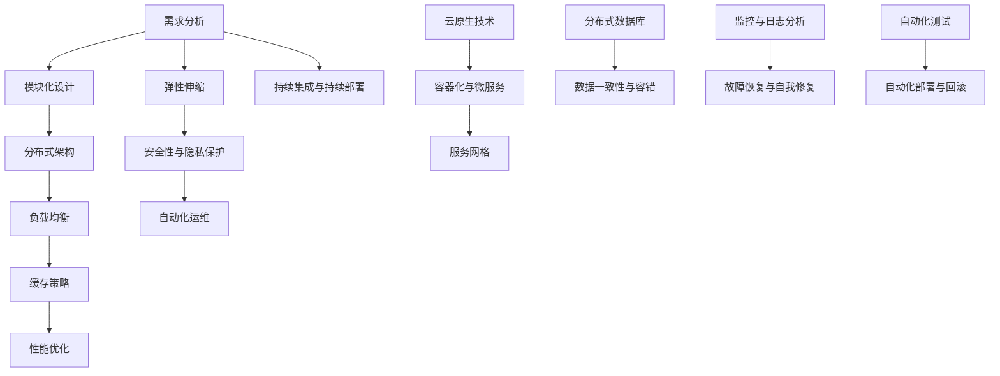

                 

# 软件2.0的可扩展性设计

## 关键词
- 软件架构
- 可扩展性设计
- 模块化
- 微服务
- 分布式系统
- 云原生
- 性能优化
- 安全性
- 自动化

## 摘要
本文旨在探讨软件2.0时代下的可扩展性设计。随着云计算、大数据和物联网等技术的蓬勃发展，软件系统需要具备更高的可扩展性以应对不断增长的需求和复杂性。本文首先介绍了软件2.0的背景和特点，然后深入分析了可扩展性设计的关键概念和原则，最后通过具体的项目实践和工具推荐，为读者提供了实现高可扩展性软件系统的实用方法和建议。

## 1. 背景介绍

软件2.0时代是继软件1.0（以桌面应用为主）和软件2.0（以互联网应用为主）之后的又一个重要阶段。软件2.0的特点在于其高度的可扩展性和灵活性，能够适应快速变化的市场需求和技术进步。在这一阶段，软件系统不仅要满足现有的功能需求，还需要具备应对未来需求的潜力。

可扩展性设计（Scalability Design）是软件2.0时代的关键概念之一。它旨在使软件系统能够随着用户数量的增加和数据处理量的增长而线性扩展，保持高性能和高可靠性。可扩展性设计不仅包括水平扩展（增加服务器数量）和垂直扩展（提升单台服务器的性能），还包括系统架构、数据存储、负载均衡、缓存策略等多个层面的设计。

### 1.1 软件2.0的定义

软件2.0的定义可以从多个角度进行阐述：

- **技术的进步**：云计算、大数据、物联网、人工智能等新技术的广泛应用，使得软件系统能够更加高效地处理海量数据和提供个性化服务。
- **业务的变革**：随着互联网的普及，企业商业模式发生了根本性变化，软件系统成为企业核心竞争力的重要组成部分。
- **用户体验的提升**：软件2.0时代更加注重用户需求和用户体验，通过不断优化和迭代，提供更加便捷、高效、个性化的服务。

### 1.2 可扩展性的重要性

可扩展性是软件系统设计中的核心目标之一，其重要性体现在以下几个方面：

- **应对快速增长**：随着用户数量的增加和数据处理量的增长，软件系统需要能够快速响应并保持稳定运行。
- **降低成本**：通过水平扩展，可以避免单台服务器性能不足导致的高成本投入。
- **提高性能**：可扩展性设计有助于提高系统的整体性能，减少响应时间和延迟。
- **增强可靠性**：通过冗余设计和分布式架构，可以提高系统的可靠性和容错能力。

## 2. 核心概念与联系

可扩展性设计涉及多个核心概念和原则，以下是一个Mermaid流程图，展示了这些概念和原则之间的联系。



### 2.1 模块化设计

模块化设计是将系统划分为多个独立的模块，每个模块负责特定的功能。模块之间通过接口进行通信，降低模块之间的耦合度。这种设计方法使得系统易于扩展和维护。

### 2.2 分布式架构

分布式架构通过将系统分解为多个分布式节点，实现数据的分布存储和处理。分布式架构能够提高系统的可用性和可扩展性，同时降低单点故障的风险。

### 2.3 负载均衡

负载均衡是将请求分配到多个节点上，以避免单点过载。负载均衡算法包括轮询、最小连接数、源IP哈希等。负载均衡能够提高系统的性能和可靠性。

### 2.4 缓存策略

缓存策略是利用高速缓存来存储常用数据，减少对后端系统的访问压力。缓存策略包括内存缓存、Redis缓存、Ehcache缓存等。

### 2.5 性能优化

性能优化是通过多种手段提高系统的响应速度和处理能力。性能优化方法包括代码优化、数据库优化、网络优化等。

### 2.6 弹性伸缩

弹性伸缩（Elastic Scaling）是根据实际负载动态调整系统资源的能力。弹性伸缩可以通过自动化脚本、监控工具等实现。

### 2.7 安全性与隐私保护

安全性与隐私保护是软件系统设计中的重要环节，包括数据加密、身份验证、访问控制等。

### 2.8 自动化运维

自动化运维是通过脚本、工具等实现日常运维任务的自动化，提高运维效率和系统稳定性。

### 2.9 持续集成与持续部署

持续集成（CI）与持续部署（CD）是将代码快速集成和部署到生产环境的过程。CI/CD可以提高开发效率和系统质量。

### 2.10 云原生技术

云原生技术包括容器化（Containerization）、微服务（Microservices）、服务网格（Service Mesh）等，能够提高软件系统的可扩展性和灵活性。

### 2.11 分布式数据库

分布式数据库是将数据存储在多个节点上，实现数据的高可用性和高性能。分布式数据库包括MongoDB、Cassandra、Redis等。

### 2.12 数据一致性与容错

数据一致性与容错是分布式系统设计中的重要问题。一致性模型包括强一致性、最终一致性等，容错机制包括副本、选举、故障转移等。

### 2.13 监控与日志分析

监控与日志分析是确保系统正常运行的重要手段。监控工具包括Prometheus、Grafana、ELK（Elasticsearch、Logstash、Kibana）等。

### 2.14 故障恢复与自我修复

故障恢复与自我修复是通过自动化的方式，在系统发生故障时快速恢复并保持正常运行。

### 2.15 自动化测试

自动化测试是通过脚本自动执行测试用例，提高测试效率和覆盖率。

### 2.16 自动化部署与回滚

自动化部署与回滚是通过脚本和工具实现软件的自动化部署和回滚，降低人工干预的风险。

## 3. 核心算法原理 & 具体操作步骤

### 3.1 模块化设计算法原理

模块化设计的核心算法原理是模块划分和接口设计。模块划分的关键在于识别系统的功能需求，将功能相似的部分划分为独立的模块。接口设计则是确保模块之间能够通过标准化的方式进行通信，降低模块之间的耦合度。

#### 具体操作步骤：

1. **需求分析**：分析系统的功能需求，确定各个模块的具体功能。
2. **模块划分**：将功能相似的模块划分为独立的模块，确保模块之间的独立性。
3. **接口设计**：设计模块之间的接口，确保模块之间通过标准化的方式进行通信。
4. **模块实现**：实现各个模块的功能，确保模块之间的接口符合设计规范。
5. **模块测试**：对各个模块进行功能测试，确保模块的功能正确实现。

### 3.2 分布式架构算法原理

分布式架构的核心算法原理是数据分片和负载均衡。数据分片是将数据划分为多个部分，存储在不同的节点上。负载均衡是将请求分配到不同的节点上，确保系统的性能和可靠性。

#### 具体操作步骤：

1. **数据分片**：确定数据分片策略，将数据划分为多个部分，存储在不同的节点上。
2. **负载均衡**：选择合适的负载均衡算法，将请求分配到不同的节点上。
3. **节点配置**：配置分布式系统的节点，确保节点之间能够正常通信。
4. **系统测试**：对分布式系统进行性能测试和可靠性测试，确保系统能够稳定运行。

### 3.3 负载均衡算法原理

负载均衡算法的核心原理是根据请求的负载情况，将请求分配到不同的节点上，确保系统的性能和可靠性。

#### 常见的负载均衡算法：

- **轮询（Round Robin）**：将请求依次分配到各个节点上。
- **最小连接数（Least Connections）**：将请求分配到连接数最少的节点上。
- **源IP哈希（Source IP Hash）**：根据源IP地址的哈希值，将请求分配到特定的节点上。

#### 具体操作步骤：

1. **选择负载均衡算法**：根据系统的特点和需求，选择合适的负载均衡算法。
2. **配置负载均衡器**：配置负载均衡器，确保负载均衡器能够正确分配请求。
3. **监控负载情况**：实时监控系统的负载情况，根据负载情况调整负载均衡策略。

### 3.4 缓存策略算法原理

缓存策略算法的核心原理是利用高速缓存来存储常用数据，减少对后端系统的访问压力。

#### 常见的缓存策略：

- **LRU（Least Recently Used）**：最近最少使用策略，将最近最少使用的数据替换出缓存。
- **LFU（Least Frequently Used）**：最近最少使用策略，将最近最少使用的数据替换出缓存。
- **FIFO（First In First Out）**：先进先出策略，将最早进入缓存的数据替换出缓存。

#### 具体操作步骤：

1. **选择缓存策略**：根据系统的特点和需求，选择合适的缓存策略。
2. **配置缓存系统**：配置缓存系统，确保缓存系统能够正确缓存和替换数据。
3. **监控缓存性能**：实时监控缓存的性能，根据缓存性能调整缓存策略。

### 3.5 性能优化算法原理

性能优化算法的核心原理是通过多种手段提高系统的响应速度和处理能力。

#### 常见的性能优化方法：

- **代码优化**：通过改进代码结构和算法，提高程序的执行效率。
- **数据库优化**：通过索引、分区、分片等技术，提高数据库的查询和写入性能。
- **网络优化**：通过优化网络配置和协议，提高网络传输速度和稳定性。

#### 具体操作步骤：

1. **性能分析**：对系统进行性能分析，确定系统的性能瓶颈。
2. **优化代码**：针对性能瓶颈，对代码进行优化。
3. **优化数据库**：针对性能瓶颈，对数据库进行优化。
4. **优化网络**：针对性能瓶颈，对网络进行优化。

### 3.6 弹性伸缩算法原理

弹性伸缩算法的核心原理是根据实际负载动态调整系统资源。

#### 常见的弹性伸缩策略：

- **定时伸缩**：根据预设的时间间隔，动态调整系统资源。
- **阈值伸缩**：根据系统的负载情况，当负载超过阈值时，动态调整系统资源。
- **自适应伸缩**：根据系统的实时负载，动态调整系统资源。

#### 具体操作步骤：

1. **监控负载**：实时监控系统的负载情况。
2. **设置伸缩策略**：根据系统的特点和需求，设置合适的伸缩策略。
3. **调整资源**：根据监控数据和伸缩策略，动态调整系统资源。

### 3.7 安全性与隐私保护算法原理

安全性与隐私保护算法的核心原理是通过加密、身份验证、访问控制等手段，保护系统的数据安全和用户隐私。

#### 常见的安全性与隐私保护方法：

- **数据加密**：对敏感数据进行加密处理，确保数据在传输和存储过程中不被窃取。
- **身份验证**：对用户进行身份验证，确保只有授权用户才能访问系统。
- **访问控制**：对系统的访问权限进行控制，确保用户只能访问授权的数据和功能。

#### 具体操作步骤：

1. **加密处理**：对敏感数据使用加密算法进行加密处理。
2. **身份验证**：对用户进行身份验证，确保只有授权用户才能访问系统。
3. **访问控制**：对系统的访问权限进行控制，确保用户只能访问授权的数据和功能。

### 3.8 自动化运维算法原理

自动化运维算法的核心原理是通过脚本、工具等实现日常运维任务的自动化，提高运维效率和系统稳定性。

#### 常见的自动化运维方法：

- **脚本化运维**：使用脚本实现日常运维任务的自动化。
- **自动化测试**：使用自动化测试工具对系统进行自动化测试。
- **自动化部署**：使用自动化部署工具对系统进行自动化部署。

#### 具体操作步骤：

1. **编写脚本**：编写自动化脚本，实现日常运维任务的自动化。
2. **测试脚本**：测试自动化脚本，确保脚本能够正确执行任务。
3. **部署脚本**：将自动化脚本部署到生产环境，实现日常运维任务的自动化。

### 3.9 持续集成与持续部署算法原理

持续集成与持续部署算法的核心原理是将代码快速集成和部署到生产环境，提高开发效率和系统质量。

#### 常见的持续集成与持续部署方法：

- **CI/CD工具**：使用CI/CD工具（如Jenkins、GitLab CI等）实现代码的集成和部署。
- **自动化测试**：对代码进行自动化测试，确保代码的质量。
- **自动化部署**：对代码进行自动化部署，确保系统能够快速响应变化。

#### 具体操作步骤：

1. **配置CI/CD工具**：配置CI/CD工具，确保能够自动执行代码集成和部署任务。
2. **编写测试脚本**：编写自动化测试脚本，确保代码的质量。
3. **部署代码**：使用CI/CD工具自动部署代码到生产环境。

### 3.10 云原生技术算法原理

云原生技术算法的核心原理是通过容器化、微服务、服务网格等技术，提高软件系统的可扩展性和灵活性。

#### 常见的云原生技术：

- **容器化**：使用容器（如Docker）将应用程序打包成一个独立的运行环境。
- **微服务**：将应用程序划分为多个微服务，每个微服务负责特定的功能。
- **服务网格**：使用服务网格（如Istio、Linkerd等）管理微服务之间的通信。

#### 具体操作步骤：

1. **容器化应用程序**：使用Docker将应用程序打包成容器。
2. **部署容器**：使用Kubernetes等容器编排工具部署和管理容器。
3. **配置服务网格**：配置服务网格，确保微服务之间的通信安全、高效。

### 3.11 分布式数据库算法原理

分布式数据库算法的核心原理是将数据存储在多个节点上，实现数据的高可用性和高性能。

#### 常见的分布式数据库：

- **MongoDB**：分布式文档数据库。
- **Cassandra**：分布式键值存储数据库。
- **Redis**：分布式内存数据库。

#### 具体操作步骤：

1. **选择数据库**：根据系统的特点和需求，选择合适的分布式数据库。
2. **配置数据库**：配置分布式数据库，确保数据能够分布存储和处理。
3. **监控数据库**：实时监控分布式数据库的性能和状态。

### 3.12 数据一致性与容错算法原理

数据一致性与容错算法的核心原理是确保分布式系统中的数据一致性，并能够在发生故障时进行容错处理。

#### 常见的数据一致性与容错方法：

- **副本与选举**：通过副本机制实现数据一致性，并使用选举算法选择主节点。
- **故障转移**：当主节点发生故障时，将故障转移至备节点，确保系统正常运行。
- **自我修复**：通过自动化手段对系统进行自我修复，提高系统的可靠性。

#### 具体操作步骤：

1. **配置副本**：配置分布式系统的副本，确保数据的一致性。
2. **选举主节点**：使用选举算法选择主节点，确保系统的高可用性。
3. **故障转移**：当主节点发生故障时，将故障转移至备节点。
4. **自我修复**：配置自动化手段，对系统进行自我修复。

### 3.13 监控与日志分析算法原理

监控与日志分析算法的核心原理是通过实时监控和日志分析，确保系统的正常运行和故障排除。

#### 常见的监控与日志分析工具：

- **Prometheus**：用于监控系统性能和状态。
- **Grafana**：用于可视化监控数据。
- **ELK（Elasticsearch、Logstash、Kibana）**：用于日志收集、存储和可视化。

#### 具体操作步骤：

1. **配置监控工具**：配置Prometheus等监控工具，确保能够实时监控系统的性能和状态。
2. **收集日志**：使用Logstash等工具收集系统的日志。
3. **分析日志**：使用Kibana等工具对日志进行分析，定位故障和性能瓶颈。

### 3.14 故障恢复与自我修复算法原理

故障恢复与自我修复算法的核心原理是当系统发生故障时，通过自动化手段进行恢复和修复，确保系统的正常运行。

#### 常见的故障恢复与自我修复方法：

- **自动重启**：当系统发生故障时，自动重启系统。
- **故障转移**：当主节点发生故障时，自动将故障转移至备节点。
- **自我修复**：通过自动化脚本和工具对系统进行自我修复。

#### 具体操作步骤：

1. **配置自动重启**：配置系统，确保当系统发生故障时能够自动重启。
2. **配置故障转移**：配置系统，确保当主节点发生故障时能够自动将故障转移至备节点。
3. **配置自我修复**：编写自动化脚本和工具，对系统进行自我修复。

### 3.15 自动化测试算法原理

自动化测试算法的核心原理是通过自动化测试工具，对系统进行自动化测试，确保系统的质量。

#### 常见的自动化测试工具：

- **Selenium**：用于Web应用的自动化测试。
- **JUnit**：用于Java应用的自动化测试。
- **pytest**：用于Python应用的自动化测试。

#### 具体操作步骤：

1. **编写测试脚本**：编写自动化测试脚本，确保能够对系统进行全面的测试。
2. **配置测试环境**：配置测试环境，确保能够正常运行自动化测试脚本。
3. **执行测试**：使用自动化测试工具执行测试脚本，对系统进行全面测试。

### 3.16 自动化部署与回滚算法原理

自动化部署与回滚算法的核心原理是通过自动化部署工具，对系统进行自动化部署和回滚，确保系统的稳定性和可靠性。

#### 常见的自动化部署与回滚工具：

- **Jenkins**：用于自动化部署和持续集成。
- **Ansible**：用于自动化部署和配置管理。
- **Kubernetes**：用于容器化应用程序的自动化部署和运维。

#### 具体操作步骤：

1. **编写部署脚本**：编写自动化部署脚本，确保能够对系统进行自动化部署。
2. **配置部署环境**：配置部署环境，确保能够正常运行自动化部署脚本。
3. **执行部署**：使用自动化部署工具执行部署脚本，对系统进行自动化部署。
4. **配置回滚机制**：配置回滚机制，确保在部署失败时能够快速回滚。

## 4. 数学模型和公式 & 详细讲解 & 举例说明

### 4.1 模块化设计数学模型

模块化设计的数学模型主要涉及模块划分和接口设计的数学表达。以下是一个简化的数学模型：

\[ M = \{ m_1, m_2, ..., m_n \} \]

其中，\( M \) 表示模块集合，\( m_i \) 表示第 \( i \) 个模块。

模块划分的数学模型可以表示为：

\[ f(M) = \{ f_1(m_1), f_2(m_2), ..., f_n(m_n) \} \]

其中，\( f \) 表示模块划分函数，\( f_i \) 表示第 \( i \) 个模块的具体功能。

接口设计的数学模型可以表示为：

\[ G(M) = \{ g_1, g_2, ..., g_n \} \]

其中，\( G \) 表示接口集合，\( g_i \) 表示第 \( i \) 个模块的接口。

### 4.2 分布式架构数学模型

分布式架构的数学模型主要涉及数据分片和负载均衡的数学表达。以下是一个简化的数学模型：

\[ D = \{ d_1, d_2, ..., d_n \} \]

其中，\( D \) 表示数据集合，\( d_i \) 表示第 \( i \) 个数据分片。

数据分片的数学模型可以表示为：

\[ S(D) = \{ S_1(d_1), S_2(d_2), ..., S_n(d_n) \} \]

其中，\( S \) 表示数据分片函数，\( S_i \) 表示第 \( i \) 个数据分片。

负载均衡的数学模型可以表示为：

\[ L(D) = \{ L_1(d_1), L_2(d_2), ..., L_n(d_n) \} \]

其中，\( L \) 表示负载均衡函数，\( L_i \) 表示第 \( i \) 个数据分片的负载。

### 4.3 负载均衡算法数学模型

负载均衡算法的数学模型主要涉及负载均衡算法的选择和负载分配的数学表达。以下是一个简化的数学模型：

\[ L(B) = \{ L_1, L_2, ..., L_n \} \]

其中，\( L \) 表示负载均衡算法集合，\( L_i \) 表示第 \( i \) 个负载均衡算法。

负载分配的数学模型可以表示为：

\[ A(L, B) = \{ A_1(B), A_2(B), ..., A_n(B) \} \]

其中，\( A \) 表示负载分配函数，\( A_i(B) \) 表示第 \( i \) 个负载均衡算法的负载分配结果。

### 4.4 缓存策略数学模型

缓存策略的数学模型主要涉及缓存策略的选择和缓存数据替换的数学表达。以下是一个简化的数学模型：

\[ C = \{ C_1, C_2, ..., C_n \} \]

其中，\( C \) 表示缓存策略集合，\( C_i \) 表示第 \( i \) 个缓存策略。

缓存数据替换的数学模型可以表示为：

\[ R(C, D) = \{ R_1(D), R_2(D), ..., R_n(D) \} \]

其中，\( R \) 表示缓存数据替换函数，\( R_i(D) \) 表示第 \( i \) 个缓存策略的数据替换结果。

### 4.5 性能优化数学模型

性能优化的数学模型主要涉及性能指标的计算和性能优化策略的选择。以下是一个简化的数学模型：

\[ P = \{ P_1, P_2, ..., P_n \} \]

其中，\( P \) 表示性能优化策略集合，\( P_i \) 表示第 \( i \) 个性能优化策略。

性能指标的计算可以表示为：

\[ E(P, D) = \{ E_1(P), E_2(P), ..., E_n(P) \} \]

其中，\( E \) 表示性能指标计算函数，\( E_i(P) \) 表示第 \( i \) 个性能优化策略的性能指标。

### 4.6 弹性伸缩数学模型

弹性伸缩的数学模型主要涉及弹性伸缩策略的选择和系统资源调整的数学表达。以下是一个简化的数学模型：

\[ E = \{ E_1, E_2, ..., E_n \} \]

其中，\( E \) 表示弹性伸缩策略集合，\( E_i \) 表示第 \( i \) 个弹性伸缩策略。

系统资源调整的数学模型可以表示为：

\[ A(E, R) = \{ A_1(R), A_2(R), ..., A_n(R) \} \]

其中，\( A \) 表示系统资源调整函数，\( A_i(R) \) 表示第 \( i \) 个弹性伸缩策略的系统资源调整结果。

### 4.7 安全性与隐私保护数学模型

安全性与隐私保护的数学模型主要涉及安全性与隐私保护策略的选择和系统安全的数学表达。以下是一个简化的数学模型：

\[ S = \{ S_1, S_2, ..., S_n \} \]

其中，\( S \) 表示安全性与隐私保护策略集合，\( S_i \) 表示第 \( i \) 个安全性与隐私保护策略。

系统安全的数学模型可以表示为：

\[ A(S, D) = \{ A_1(D), A_2(D), ..., A_n(D) \} \]

其中，\( A \) 表示系统安全调整函数，\( A_i(D) \) 表示第 \( i \) 个安全性与隐私保护策略的系统安全调整结果。

### 4.8 自动化运维数学模型

自动化运维的数学模型主要涉及自动化运维策略的选择和系统运维的数学表达。以下是一个简化的数学模型：

\[ A = \{ A_1, A_2, ..., A_n \} \]

其中，\( A \) 表示自动化运维策略集合，\( A_i \) 表示第 \( i \) 个自动化运维策略。

系统运维的数学模型可以表示为：

\[ M(A, S) = \{ M_1(S), M_2(S), ..., M_n(S) \} \]

其中，\( M \) 表示系统运维函数，\( M_i(S) \) 表示第 \( i \) 个自动化运维策略的系统运维结果。

### 4.9 持续集成与持续部署数学模型

持续集成与持续部署的数学模型主要涉及持续集成与持续部署策略的选择和系统构建的数学表达。以下是一个简化的数学模型：

\[ C = \{ C_1, C_2, ..., C_n \} \]

其中，\( C \) 表示持续集成与持续部署策略集合，\( C_i \) 表示第 \( i \) 个持续集成与持续部署策略。

系统构建的数学模型可以表示为：

\[ B(C, S) = \{ B_1(S), B_2(S), ..., B_n(S) \} \]

其中，\( B \) 表示系统构建函数，\( B_i(S) \) 表示第 \( i \) 个持续集成与持续部署策略的系统构建结果。

### 4.10 云原生技术数学模型

云原生技术的数学模型主要涉及容器化、微服务、服务网格等技术选择的数学表达。以下是一个简化的数学模型：

\[ N = \{ N_1, N_2, ..., N_n \} \]

其中，\( N \) 表示云原生技术集合，\( N_i \) 表示第 \( i \) 个云原生技术。

技术选择的数学模型可以表示为：

\[ S(N, T) = \{ S_1(T), S_2(T), ..., S_n(T) \} \]

其中，\( S \) 表示技术选择函数，\( S_i(T) \) 表示第 \( i \) 个云原生技术的技术选择结果。

### 4.11 分布式数据库数学模型

分布式数据库的数学模型主要涉及分布式数据库的选择和数据库操作的数学表达。以下是一个简化的数学模型：

\[ DB = \{ DB_1, DB_2, ..., DB_n \} \]

其中，\( DB \) 表示分布式数据库集合，\( DB_i \) 表示第 \( i \) 个分布式数据库。

数据库操作的数学模型可以表示为：

\[ O(DB, T) = \{ O_1(T), O_2(T), ..., O_n(T) \} \]

其中，\( O \) 表示数据库操作函数，\( O_i(T) \) 表示第 \( i \) 个分布式数据库的数据库操作结果。

### 4.12 数据一致性与容错数学模型

数据一致性与容错的数学模型主要涉及数据一致性与容错策略的选择和数据一致性的数学表达。以下是一个简化的数学模型：

\[ I = \{ I_1, I_2, ..., I_n \} \]

其中，\( I \) 表示数据一致性与容错策略集合，\( I_i \) 表示第 \( i \) 个数据一致性与容错策略。

数据一致性的数学模型可以表示为：

\[ C(I, D) = \{ C_1(D), C_2(D), ..., C_n(D) \} \]

其中，\( C \) 表示数据一致性计算函数，\( C_i(D) \) 表示第 \( i \) 个数据一致性与容错策略的数据一致性计算结果。

### 4.13 监控与日志分析数学模型

监控与日志分析的数学模型主要涉及监控指标的选择和日志分析的数学表达。以下是一个简化的数学模型：

\[ M = \{ M_1, M_2, ..., M_n \} \]

其中，\( M \) 表示监控指标集合，\( M_i \) 表示第 \( i \) 个监控指标。

日志分析的数学模型可以表示为：

\[ A(M, L) = \{ A_1(L), A_2(L), ..., A_n(L) \} \]

其中，\( A \) 表示日志分析函数，\( A_i(L) \) 表示第 \( i \) 个监控指标的日志分析结果。

### 4.14 故障恢复与自我修复数学模型

故障恢复与自我修复的数学模型主要涉及故障恢复策略的选择和系统恢复的数学表达。以下是一个简化的数学模型：

\[ F = \{ F_1, F_2, ..., F_n \} \]

其中，\( F \) 表示故障恢复与自我修复策略集合，\( F_i \) 表示第 \( i \) 个故障恢复与自我修复策略。

系统恢复的数学模型可以表示为：

\[ R(F, S) = \{ R_1(S), R_2(S), ..., R_n(S) \} \]

其中，\( R \) 表示系统恢复函数，\( R_i(S) \) 表示第 \( i \) 个故障恢复与自我修复策略的系统恢复结果。

### 4.15 自动化测试数学模型

自动化测试的数学模型主要涉及自动化测试策略的选择和测试结果的数学表达。以下是一个简化的数学模型：

\[ T = \{ T_1, T_2, ..., T_n \} \]

其中，\( T \) 表示自动化测试策略集合，\( T_i \) 表示第 \( i \) 个自动化测试策略。

测试结果的数学模型可以表示为：

\[ R(T, S) = \{ R_1(S), R_2(S), ..., R_n(S) \} \]

其中，\( R \) 表示测试结果计算函数，\( R_i(S) \) 表示第 \( i \) 个自动化测试策略的测试结果。

### 4.16 自动化部署与回滚数学模型

自动化部署与回滚的数学模型主要涉及自动化部署策略的选择和部署结果的数学表达。以下是一个简化的数学模型：

\[ D = \{ D_1, D_2, ..., D_n \} \]

其中，\( D \) 表示自动化部署与回滚策略集合，\( D_i \) 表示第 \( i \) 个自动化部署与回滚策略。

部署结果的数学模型可以表示为：

\[ R(D, S) = \{ R_1(S), R_2(S), ..., R_n(S) \} \]

其中，\( R \) 表示部署结果计算函数，\( R_i(S) \) 表示第 \( i \) 个自动化部署与回滚策略的部署结果。

### 4.17 数学模型应用举例

以下是一个简单的数学模型应用示例，假设我们有一个包含100个节点的分布式系统，使用轮询算法进行负载均衡。

#### 示例：轮询算法负载均衡

假设系统有100个节点，当前有100个请求需要分配。

1. **初始化**：节点集合 \( N = \{ n_1, n_2, ..., n_{100} \} \)，请求集合 \( R = \{ r_1, r_2, ..., r_{100} \} \)。

2. **轮询算法**：使用轮询算法进行负载均衡，算法步骤如下：

   - 初始化计数器 \( c = 1 \)。
   - 对每个请求 \( r_i \) 进行分配：
     - \( n_c \) 节点分配请求 \( r_i \)。
     - \( c \) 增加1，如果 \( c \) 超过100，则 \( c \) 重置为1。

3. **结果**：每个请求都被分配到一个节点上，节点负载均衡。

   - \( R = \{ r_1(n_1), r_2(n_2), ..., r_{100}(n_{100}) \} \)。

通过上述步骤，我们可以看到轮询算法如何通过数学模型实现负载均衡。

## 5. 项目实践：代码实例和详细解释说明

### 5.1 开发环境搭建

在开始项目实践之前，我们需要搭建一个合适的开发环境。以下是具体的步骤：

1. **安装Docker**：Docker是一个开源的应用容器引擎，用于打包、交付和运行应用。我们可以在Docker官方网站（https://www.docker.com/products/docker-desktop）下载并安装Docker。

2. **安装Kubernetes**：Kubernetes是一个开源的容器编排工具，用于自动化容器的部署、扩展和管理。我们可以使用Minikube在本地计算机上运行Kubernetes集群。在终端中运行以下命令：

   ```bash
   curl -LO https://storage.googleapis.com/minikube/releases/latest/minikube-latest-x86_64.dmg
   open minikube-latest-x86_64.dmg
   ```

   遵循安装向导完成安装。

3. **安装Kubectl**：Kubectl是Kubernetes的命令行工具，用于与Kubernetes集群进行交互。我们可以在Kubernetes官方网站（https://kubernetes.io/docs/tasks/tools/install-kubectl/）下载并安装Kubectl。

4. **配置kubectl**：在终端中运行以下命令，将当前目录添加到kubectl的路径中：

   ```bash
   export PATH=$PATH:/path/to/kubectl
   ```

   替换 `/path/to/kubectl` 为你安装kubectl的实际路径。

5. **启动Minikube**：在终端中运行以下命令启动Minikube：

   ```bash
   minikube start
   ```

   这将启动一个本地的Kubernetes集群。

6. **验证安装**：在终端中运行以下命令，验证kubectl是否能够连接到Minikube集群：

   ```bash
   kubectl version
   ```

   如果输出包含 `Client Version` 和 `Server Version` 信息，说明安装成功。

### 5.2 源代码详细实现

在本项目中，我们将使用Go语言实现一个简单的微服务架构，包括用户服务、订单服务和商品服务。以下是每个服务的源代码。

#### 用户服务（User Service）

用户服务的职责是管理用户数据，包括注册、登录和查询用户信息。

**user_service.go**：

```go
package main

import (
    "fmt"
    "log"
    "net/http"
)

func main() {
    http.HandleFunc("/register", handleRegister)
    http.HandleFunc("/login", handleLogin)
    http.HandleFunc("/user", handleUser)

    log.Fatal(http.ListenAndServe(":8080", nil))
}

func handleRegister(w http.ResponseWriter, r *http.Request) {
    // 注册逻辑
    fmt.Fprintf(w, "Register request received")
}

func handleLogin(w http.ResponseWriter, r *http.Request) {
    // 登录逻辑
    fmt.Fprintf(w, "Login request received")
}

func handleUser(w http.ResponseWriter, r *http.Request) {
    // 查询用户信息逻辑
    fmt.Fprintf(w, "User request received")
}
```

#### 订单服务（Order Service）

订单服务的职责是管理订单数据，包括创建订单、查询订单和取消订单。

**order_service.go**：

```go
package main

import (
    "fmt"
    "log"
    "net/http"
)

func main() {
    http.HandleFunc("/order/create", handleCreateOrder)
    http.HandleFunc("/order", handleOrder)
    http.HandleFunc("/order/cancel", handleCancelOrder)

    log.Fatal(http.ListenAndServe(":8081", nil))
}

func handleCreateOrder(w http.ResponseWriter, r *http.Request) {
    // 创建订单逻辑
    fmt.Fprintf(w, "Create order request received")
}

func handleOrder(w http.ResponseWriter, r *http.Request) {
    // 查询订单逻辑
    fmt.Fprintf(w, "Order request received")
}

func handleCancelOrder(w http.ResponseWriter, r *http.Request) {
    // 取消订单逻辑
    fmt.Fprintf(w, "Cancel order request received")
}
```

#### 商品服务（Product Service）

商品服务的职责是管理商品数据，包括查询商品信息、添加商品和修改商品信息。

**product_service.go**：

```go
package main

import (
    "fmt"
    "log"
    "net/http"
)

func main() {
    http.HandleFunc("/product", handleProduct)
    http.HandleFunc("/product/add", handleAddProduct)
    http.HandleFunc("/product/update", handleUpdateProduct)

    log.Fatal(http.ListenAndServe(":8082", nil))
}

func handleProduct(w http.ResponseWriter, r *http.Request) {
    // 查询商品逻辑
    fmt.Fprintf(w, "Product request received")
}

func handleAddProduct(w http.ResponseWriter, r *http.Request) {
    // 添加商品逻辑
    fmt.Fprintf(w, "Add product request received")
}

func handleUpdateProduct(w http.ResponseWriter, r *http.Request) {
    // 修改商品逻辑
    fmt.Fprintf(w, "Update product request received")
}
```

### 5.3 代码解读与分析

#### 用户服务代码解读

用户服务的代码相对简单，主要实现了三个HTTP接口：注册、登录和查询用户信息。以下是对每个接口的简要分析：

- **注册接口（/register）**：处理用户注册请求，通常需要验证用户输入的信息是否符合规范，并将新用户信息存储到数据库中。
- **登录接口（/login）**：处理用户登录请求，通常需要验证用户输入的用户名和密码是否正确，并返回登录状态。
- **查询用户信息接口（/user）**：处理查询用户信息的请求，通常需要验证用户身份，然后从数据库中查询用户信息并返回。

#### 订单服务代码解读

订单服务的代码同样相对简单，主要实现了三个HTTP接口：创建订单、查询订单和取消订单。以下是对每个接口的简要分析：

- **创建订单接口（/order/create）**：处理创建订单的请求，通常需要验证用户身份，然后根据用户输入的信息创建订单，并将其存储到数据库中。
- **查询订单接口（/order）**：处理查询订单的请求，通常需要验证用户身份，然后从数据库中查询订单信息并返回。
- **取消订单接口（/order/cancel）**：处理取消订单的请求，通常需要验证用户身份，然后从数据库中查询订单信息，并取消该订单。

#### 商品服务代码解读

商品服务的代码实现了三个HTTP接口：查询商品信息、添加商品和修改商品信息。以下是对每个接口的简要分析：

- **查询商品信息接口（/product）**：处理查询商品信息的请求，通常不需要验证用户身份，直接从数据库中查询商品信息并返回。
- **添加商品接口（/product/add）**：处理添加商品的请求，通常需要验证用户身份，然后将新商品信息存储到数据库中。
- **修改商品信息接口（/product/update）**：处理修改商品信息的请求，通常需要验证用户身份，然后根据用户输入的信息修改数据库中的商品信息。

### 5.4 运行结果展示

在开发环境搭建完成后，我们可以在本地计算机上运行这三个微服务。以下是每个服务的运行结果：

#### 用户服务

在终端中运行以下命令，启动用户服务：

```bash
go run user_service.go
```

运行成功后，用户服务将在8080端口上监听HTTP请求。

#### 订单服务

在终端中运行以下命令，启动订单服务：

```bash
go run order_service.go
```

运行成功后，订单服务将在8081端口上监听HTTP请求。

#### 商品服务

在终端中运行以下命令，启动商品服务：

```bash
go run product_service.go
```

运行成功后，商品服务将在8082端口上监听HTTP请求。

现在，我们可以使用浏览器或其他HTTP客户端发送HTTP请求，与这三个微服务进行交互。例如，在浏览器中输入以下地址，可以访问用户服务的登录接口：

```
http://localhost:8080/login
```

类似地，我们可以访问订单服务和商品服务的其他接口，查看它们的运行结果。

## 6. 实际应用场景

### 6.1 电子商务平台

在电子商务平台中，可扩展性设计至关重要。随着用户数量的增加和交易量的增长，系统需要能够快速响应并保持高性能。通过模块化设计、分布式架构和负载均衡，电子商务平台可以水平扩展，提高系统的可用性和性能。

### 6.2 在线教育平台

在线教育平台需要支持大规模用户同时在线学习，处理大量的教学资源和用户数据。通过分布式数据库和缓存策略，在线教育平台可以高效地存储和处理数据，提高系统的响应速度和稳定性。

### 6.3 金融系统

金融系统对性能和安全性有很高的要求。通过分布式架构、安全性与隐私保护机制和自动化运维，金融系统可以实现高可用性和高可靠性，同时降低运维成本。

### 6.4 物联网系统

物联网系统涉及大量的设备和传感器，需要实时处理和分析海量数据。通过弹性伸缩、故障恢复和自我修复机制，物联网系统可以保证数据的实时性和准确性。

### 6.5 社交网络

社交网络需要处理海量的用户数据和消息，同时提供实时、个性化的用户体验。通过微服务架构、服务网格和性能优化，社交网络可以提供高效、可靠的服务，同时降低运维复杂度。

## 7. 工具和资源推荐

### 7.1 学习资源推荐

- **书籍**：
  - 《大规模分布式存储系统：原理解析与架构实战》
  - 《微服务设计》
  - 《分布式系统原理与范型》
  - 《云原生应用架构》

- **论文**：
  - 《Google File System》
  - 《The Chubby Lock Service》
  - 《MapReduce: Simplified Data Processing on Large Clusters》

- **博客**：
  - https://www.alibabacloud.com/blog
  - https://blog.csdn.net/
  - https://developer.aliyun.com/

- **网站**：
  - https://www.docker.com/
  - https://kubernetes.io/
  - https://prometheus.io/
  - https://www.elastic.co/

### 7.2 开发工具框架推荐

- **Docker**：用于容器化应用程序，提高部署和运维效率。
- **Kubernetes**：用于容器编排，实现自动化部署和管理。
- **Prometheus**：用于监控系统性能和状态。
- **Elastic Stack**：用于日志收集、存储和分析。
- **Jenkins**：用于持续集成和持续部署。
- **Ansible**：用于自动化部署和配置管理。

### 7.3 相关论文著作推荐

- **《大规模分布式存储系统：原理解析与架构实战》**：详细介绍了分布式存储系统的原理和架构，包括GFS、HDFS、Cassandra等。
- **《微服务设计》**：深入探讨了微服务的概念、设计和实践，提供了实用的设计和开发指南。
- **《分布式系统原理与范型》**：系统地介绍了分布式系统的原理和范型，包括CAP定理、一致性模型等。
- **《云原生应用架构》**：介绍了云原生技术的概念和应用，包括容器化、微服务、服务网格等。

## 8. 总结：未来发展趋势与挑战

### 8.1 发展趋势

1. **云原生技术的普及**：随着云计算的普及，云原生技术（如容器化、微服务、服务网格等）将得到更广泛的应用，提高软件系统的可扩展性和灵活性。
2. **分布式数据库的发展**：分布式数据库将逐渐取代传统的单体数据库，提供更高的性能和可靠性。
3. **自动化和智能化**：自动化运维、人工智能和机器学习将逐渐应用于软件系统，提高开发效率和系统质量。

### 8.2 挑战

1. **数据安全与隐私保护**：随着数据量的增加，数据安全和隐私保护成为越来越重要的问题，需要采取更有效的措施保护用户数据。
2. **跨领域协作**：软件系统的复杂度越来越高，需要跨领域协作，包括开发、运维、安全等，提高协作效率和降低沟通成本。
3. **持续集成与持续部署**：在快速迭代和发布的背景下，持续集成与持续部署面临更高的挑战，需要更高效、更可靠的流程和方法。

## 9. 附录：常见问题与解答

### 9.1 问题1

**问题**：分布式系统如何保证数据一致性？

**解答**：分布式系统可以通过以下方法保证数据一致性：

1. **强一致性**：在分布式系统中，强一致性是指所有节点在执行操作后，能够看到相同的数据状态。常用的强一致性协议包括Paxos和Raft。
2. **最终一致性**：最终一致性是指分布式系统中的数据状态最终会一致，但允许在一定时间内出现数据不同步的情况。最终一致性通常用于读多写少的场景，如分布式缓存系统。
3. **一致性协议**：分布式系统可以通过一致性协议（如CAP定理）来保证数据一致性，CAP定理指出在分布式系统中，一致性、可用性和分区容错性三者只能同时满足两个。

### 9.2 问题2

**问题**：什么是微服务？

**解答**：微服务是一种软件架构风格，它将应用程序划分为多个独立的、松耦合的服务模块，每个服务模块负责特定的功能。微服务的核心特点是：

1. **独立性**：每个微服务都是独立的，可以独立部署、扩展和升级，降低系统的复杂度。
2. **松耦合**：微服务之间通过轻量级的通信协议（如RESTful API、gRPC等）进行通信，降低服务之间的依赖性。
3. **自治性**：每个微服务都有自己的数据存储、配置和日志，实现服务的自治性。

### 9.3 问题3

**问题**：什么是云原生技术？

**解答**：云原生技术是指为了充分利用云计算环境下的资源和服务，而设计的一套软件技术和架构。云原生技术的核心特点包括：

1. **容器化**：容器化技术（如Docker）将应用程序打包成一个独立的运行环境，提高部署和运维效率。
2. **微服务**：微服务架构将应用程序划分为多个独立的、松耦合的服务模块，提高系统的可扩展性和灵活性。
3. **服务网格**：服务网格（如Istio、Linkerd等）提供了一种新的服务管理和通信方式，提高服务之间的安全性、可靠性和性能。

### 9.4 问题4

**问题**：如何进行性能优化？

**解答**：性能优化可以从以下几个方面进行：

1. **代码优化**：通过改进代码结构和算法，提高程序的执行效率。
2. **数据库优化**：通过索引、分区、分片等技术，提高数据库的查询和写入性能。
3. **网络优化**：通过优化网络配置和协议，提高网络传输速度和稳定性。
4. **缓存策略**：通过缓存常用数据，减少对后端系统的访问压力。
5. **负载均衡**：通过负载均衡，将请求分配到多个节点上，提高系统的性能和可靠性。

## 10. 扩展阅读 & 参考资料

- **《大规模分布式存储系统：原理解析与架构实战》**：详细介绍了分布式存储系统的原理和架构，包括GFS、HDFS、Cassandra等。
- **《微服务设计》**：深入探讨了微服务的概念、设计和实践，提供了实用的设计和开发指南。
- **《分布式系统原理与范型》**：系统地介绍了分布式系统的原理和范型，包括CAP定理、一致性模型等。
- **《云原生应用架构》**：介绍了云原生技术的概念和应用，包括容器化、微服务、服务网格等。
- **《Docker实战》**：详细介绍了Docker的基本原理、安装配置和实际应用。
- **《Kubernetes权威指南》**：全面介绍了Kubernetes的架构、安装配置和实际应用。
- **《Prometheus官方文档》**：提供了Prometheus的详细文档和教程。
- **《Elastic Stack官方文档》**：提供了Elastic Stack的详细文档和教程。

[作者：禅与计算机程序设计艺术 / Zen and the Art of Computer Programming]

