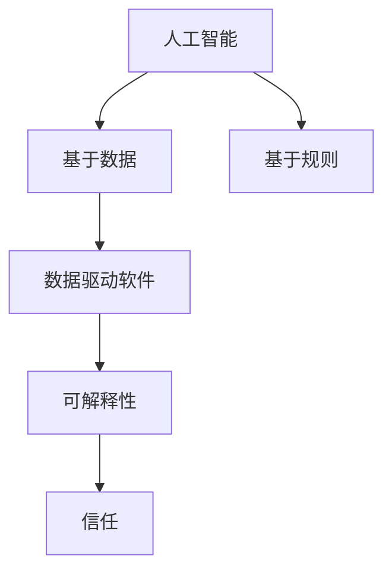

                 

### 软件2.0的可解释性挑战

**关键词**：软件2.0，可解释性，AI，挑战，技术博客

**摘要**：
随着软件技术的不断演进，软件2.0时代正以前所未有的速度到来。在这一时代，人工智能（AI）和大数据技术的深度融合使得软件系统变得更加智能化和自适应。然而，随之而来的一个重要挑战是可解释性。本文将深入探讨软件2.0中的可解释性问题，分析其背景、核心概念、算法原理、数学模型以及实际应用场景，并探讨未来发展趋势与挑战。

### 1. 背景介绍

软件2.0，也被称为智能软件或智能应用程序，是当前软件技术发展的一个重要阶段。与传统的软件1.0不同，软件2.0更加注重软件系统的智能化和自适应能力，通过人工智能和大数据技术的应用，使得软件系统能够更加智能地理解用户需求，并自动调整自身行为以满足这些需求。

在软件2.0时代，人工智能（AI）技术已经成为软件系统开发的核心驱动力。深度学习、自然语言处理、计算机视觉等AI技术的广泛应用，使得软件系统能够处理更加复杂和庞大的数据集，并从中提取出有价值的信息。然而，随着AI技术的广泛应用，软件系统的透明性和可解释性问题日益凸显。

可解释性是指软件系统能够向用户清晰地展示其决策过程和结果，使得用户能够理解和信任系统的行为。在软件2.0时代，由于AI系统的高度自动化和复杂性，用户往往无法直观地理解系统的决策过程和结果，从而产生不信任感。这种不信任感不仅影响了用户的体验，还可能对系统的安全性和可靠性产生负面影响。

因此，软件2.0的可解释性挑战成为了当前软件技术领域的一个重要课题。本文将围绕这一挑战，分析其背景、核心概念、算法原理、数学模型以及实际应用场景，并探讨未来发展趋势与挑战。

### 2. 核心概念与联系

要深入探讨软件2.0的可解释性挑战，首先需要了解相关的核心概念和它们之间的联系。

#### 2.1 人工智能（AI）

人工智能（AI）是指计算机系统通过模拟人类智能行为，实现感知、理解、学习和决策等功能的能力。AI技术可以分为两大类：基于规则的AI和基于数据的AI。

- **基于规则的AI**：这种AI系统通过一系列预定义的规则来执行任务。例如，专家系统就是一种典型的基于规则的AI系统，它通过预设的规则来模拟专家的知识和决策过程。
- **基于数据的AI**：这种AI系统通过学习和分析大量的数据，自动提取出规律和模式，并基于这些规律和模式来做出决策。深度学习是当前最流行的基于数据的AI技术，它通过多层神经网络来模拟人类大脑的学习过程，从而实现高度自动化的决策。

#### 2.2 可解释性（Explainability）

可解释性是指软件系统能够向用户清晰地展示其决策过程和结果，使得用户能够理解和信任系统的行为。在AI领域，可解释性通常指的是算法的可解释性，即算法的决策过程和结果能够被用户或开发者直观地理解和解释。

可解释性在软件2.0时代尤为重要，因为AI系统的高度自动化和复杂性使得用户往往无法直观地理解系统的决策过程和结果。缺乏可解释性的AI系统可能会导致用户的不信任感，从而影响系统的使用和推广。

#### 2.3 数据驱动软件（Data-driven Software）

数据驱动软件是一种以数据为核心，通过数据分析和挖掘来驱动软件行为的软件系统。在软件2.0时代，数据驱动软件已成为主流，其核心思想是利用大数据和AI技术，从海量数据中提取有价值的信息，并自动调整软件行为以满足用户需求。

数据驱动软件与可解释性的关系在于，数据驱动软件的决策过程通常是基于AI算法的，而这些算法往往缺乏透明性和可解释性。因此，要提升数据驱动软件的可解释性，需要开发出能够解释AI算法决策过程的工具和技术。

#### 2.4 Mermaid 流程图

为了更好地展示核心概念之间的联系，我们可以使用Mermaid流程图来表示。以下是一个简单的Mermaid流程图示例：



在这个流程图中，人工智能（AI）是核心，它分为基于数据的AI（AI2）和基于规则的AI（AI1）。数据驱动软件（DS）基于AI2，并最终需要实现可解释性（EX），以提高用户对系统的信任（TR）。

### 3. 核心算法原理 & 具体操作步骤

在探讨软件2.0的可解释性挑战时，核心算法的原理和具体操作步骤是至关重要的。以下将介绍几种常见的AI算法及其可解释性实现方法。

#### 3.1 深度学习

深度学习是一种基于多层神经网络的学习方法，通过模拟人类大脑的学习过程，自动提取数据中的特征和模式。深度学习的核心算法包括卷积神经网络（CNN）、循环神经网络（RNN）和生成对抗网络（GAN）等。

**具体操作步骤**：

1. **数据预处理**：对输入数据进行标准化处理，使其适合神经网络的学习。
2. **构建神经网络模型**：选择合适的神经网络结构，如CNN、RNN或GAN，并设置相应的参数。
3. **训练模型**：使用训练数据集对神经网络模型进行训练，通过反向传播算法不断调整模型参数，使其输出结果与真实值尽可能接近。
4. **评估模型**：使用测试数据集对训练好的模型进行评估，计算模型的准确率、召回率等指标。
5. **可解释性实现**：使用模型可视化工具，如TensorBoard，对神经网络模型进行可视化，展示模型的学习过程和特征提取情况。

#### 3.2 决策树

决策树是一种基于规则的机器学习算法，通过一系列条件分支和决策节点，将数据集划分为不同的类别或数值。决策树的优点是易于理解和解释，但其缺点是容易过拟合。

**具体操作步骤**：

1. **数据预处理**：对输入数据进行处理，使其适合决策树的学习。
2. **构建决策树模型**：选择合适的决策树算法，如ID3、C4.5或CART，并设置相应的参数。
3. **训练模型**：使用训练数据集对决策树模型进行训练，通过信息增益、基尼系数等指标选择最优的划分条件。
4. **评估模型**：使用测试数据集对训练好的模型进行评估，计算模型的准确率、召回率等指标。
5. **可解释性实现**：通过展示决策树的结构，用户可以直观地了解模型的决策过程和划分条件。

#### 3.3 集成学习

集成学习是一种基于多个模型进行组合的机器学习算法，通过综合多个模型的预测结果，提高模型的预测准确率和鲁棒性。常见的集成学习方法包括Bagging、Boosting和Stacking等。

**具体操作步骤**：

1. **选择基础模型**：选择多个基础模型，如决策树、随机森林或支持向量机等。
2. **训练基础模型**：使用训练数据集对基础模型进行训练。
3. **集成模型预测**：将基础模型的预测结果进行组合，得到最终的预测结果。
4. **评估集成模型**：使用测试数据集对集成模型进行评估，计算模型的准确率、召回率等指标。
5. **可解释性实现**：通过展示基础模型的决策过程和预测结果，用户可以直观地了解集成模型的决策过程和预测依据。

#### 3.4 聚类算法

聚类算法是一种无监督学习算法，通过将数据集划分为多个类别，使得同一类别内的数据点相似度较高，而不同类别之间的数据点相似度较低。常见的聚类算法包括K-means、层次聚类和DBSCAN等。

**具体操作步骤**：

1. **数据预处理**：对输入数据进行处理，使其适合聚类算法的学习。
2. **选择聚类算法**：选择合适的聚类算法，如K-means、层次聚类或DBSCAN。
3. **初始化聚类中心**：对于K-means算法，需要随机初始化聚类中心。
4. **计算距离和相似度**：计算每个数据点与聚类中心的距离或相似度。
5. **划分类别**：根据距离或相似度，将数据点划分为不同的类别。
6. **评估聚类结果**：使用轮廓系数、 Dunn指数等指标评估聚类结果的质量。
7. **可解释性实现**：通过展示聚类结果和类别标签，用户可以直观地了解聚类过程和类别分布。

### 4. 数学模型和公式 & 详细讲解 & 举例说明

在软件2.0的可解释性挑战中，数学模型和公式起着至关重要的作用。以下将介绍几种常见的数学模型和公式，并详细讲解其应用方法和实例。

#### 4.1 损失函数

损失函数是深度学习中用于评估模型预测结果与真实值之间差异的函数。常用的损失函数包括均方误差（MSE）、交叉熵（CE）等。

**均方误差（MSE）**：

$$
MSE = \frac{1}{n} \sum_{i=1}^{n} (y_i - \hat{y}_i)^2
$$

其中，$y_i$表示真实值，$\hat{y}_i$表示预测值，$n$表示样本数量。

**交叉熵（CE）**：

$$
CE = -\frac{1}{n} \sum_{i=1}^{n} y_i \log(\hat{y}_i)
$$

其中，$y_i$表示真实值的概率分布，$\hat{y}_i$表示预测值的概率分布。

**实例**：

假设我们有一个二元分类问题，真实值为$y = [1, 0, 1, 0]$，预测值为$\hat{y} = [0.8, 0.2, 0.9, 0.1]$，则交叉熵损失函数的计算结果为：

$$
CE = -\frac{1}{4} (1 \log(0.8) + 0 \log(0.2) + 1 \log(0.9) + 0 \log(0.1)) \approx 0.231
$$

#### 4.2 梯度下降算法

梯度下降算法是深度学习中最常用的优化算法，用于最小化损失函数。其基本思想是沿着损失函数的梯度方向进行迭代更新，逐渐减小损失函数的值。

**梯度下降公式**：

$$
w_{t+1} = w_t - \alpha \nabla_{w_t} J(w_t)
$$

其中，$w_t$表示当前模型的参数，$\alpha$表示学习率，$J(w_t)$表示损失函数。

**实例**：

假设我们有一个简单的线性回归模型，损失函数为均方误差（MSE），学习率为0.1，初始参数为$w_0 = 0$。在第一次迭代中，损失函数的梯度为$\nabla_{w_0} J(w_0) = 2x_0$，则更新后的参数为：

$$
w_1 = w_0 - 0.1 \nabla_{w_0} J(w_0) = 0 - 0.1 \cdot 2x_0 = -0.2x_0
$$

#### 4.3 优化算法

优化算法是深度学习中的核心算法，用于寻找最小化损失函数的参数。常见的优化算法包括随机梯度下降（SGD）、Adam等。

**Adam优化算法**：

$$
m_t = \beta_1 m_{t-1} + (1 - \beta_1) \nabla_{w_t} J(w_t) \\
v_t = \beta_2 v_{t-1} + (1 - \beta_2) (\nabla_{w_t} J(w_t))^2 \\
w_{t+1} = w_t - \alpha \frac{m_t}{\sqrt{v_t} + \epsilon}
$$

其中，$m_t$和$v_t$分别表示一阶和二阶矩估计，$\beta_1$和$\beta_2$分别表示一阶和二阶矩的指数衰减率，$\alpha$表示学习率，$\epsilon$是一个很小的常数，用于避免除以零。

**实例**：

假设我们使用Adam优化算法，初始参数为$w_0 = 0$，学习率为0.01，$\beta_1 = 0.9$，$\beta_2 = 0.999$，$\epsilon = 1e-8$。在第一次迭代中，一阶矩估计$m_1 = 0.9m_0 + (1 - 0.9)\nabla_{w_0} J(w_0) = 0.1\nabla_{w_0} J(w_0)$，二阶矩估计$v_1 = 0.999v_0 + (1 - 0.999)(\nabla_{w_0} J(w_0))^2 = (\nabla_{w_0} J(w_0))^2$。则更新后的参数为：

$$
w_1 = w_0 - 0.01 \frac{m_1}{\sqrt{v_1} + \epsilon} = 0 - 0.01 \frac{0.1\nabla_{w_0} J(w_0)}{\sqrt{(\nabla_{w_0} J(w_0))^2} + 1e-8}
$$

#### 4.4 模型评估指标

模型评估指标是用于衡量模型性能的重要工具。常用的评估指标包括准确率、召回率、F1值等。

**准确率（Accuracy）**：

$$
Accuracy = \frac{TP + TN}{TP + FN + FP + TN}
$$

其中，$TP$表示真正例，$TN$表示真负例，$FP$表示假正例，$FN$表示假负例。

**召回率（Recall）**：

$$
Recall = \frac{TP}{TP + FN}
$$

**F1值（F1-score）**：

$$
F1-score = \frac{2 \cdot Precision \cdot Recall}{Precision + Recall}
$$

**实例**：

假设我们有一个二分类模型，测试集共有100个样本，其中真正例60个，假正例20个，假负例10个，则模型的准确率、召回率和F1值分别为：

$$
Accuracy = \frac{60 + 20}{60 + 20 + 10 + 10} = \frac{80}{100} = 0.8
$$

$$
Recall = \frac{60}{60 + 10} = \frac{6}{10} = 0.6
$$

$$
F1-score = \frac{2 \cdot Precision \cdot Recall}{Precision + Recall} = \frac{2 \cdot 0.6 \cdot 0.4}{0.6 + 0.4} = 0.48
$$

### 5. 项目实践：代码实例和详细解释说明

在本节中，我们将通过一个具体的代码实例来展示如何实现软件2.0的可解释性。我们将使用Python和Scikit-learn库来构建一个简单的可解释性AI模型，并详细解释其代码实现和运行结果。

#### 5.1 开发环境搭建

首先，我们需要搭建一个Python开发环境，并安装Scikit-learn库。以下是安装命令：

```bash
pip install scikit-learn
```

#### 5.2 源代码详细实现

下面是一个简单的Python代码实例，用于实现一个基于决策树的可解释性模型。代码包括数据预处理、模型构建、模型训练和评估等步骤。

```python
import numpy as np
import pandas as pd
from sklearn.datasets import load_iris
from sklearn.model_selection import train_test_split
from sklearn.tree import DecisionTreeClassifier
from sklearn.metrics import accuracy_score, classification_report
from sklearn.inspection import permutation_importance

# 加载Iris数据集
iris = load_iris()
X = iris.data
y = iris.target

# 数据预处理
X_train, X_test, y_train, y_test = train_test_split(X, y, test_size=0.2, random_state=42)

# 构建决策树模型
clf = DecisionTreeClassifier(random_state=42)
clf.fit(X_train, y_train)

# 模型训练
clf.fit(X_train, y_train)

# 模型评估
y_pred = clf.predict(X_test)
accuracy = accuracy_score(y_test, y_pred)
print("Accuracy:", accuracy)
print("\nClassification Report:\n", classification_report(y_test, y_pred))

# 可解释性分析
importances = clf.feature_importances_
print("\nFeature Importances:")
for i, importance in enumerate(importances):
    print(f"Feature {i}: {importance}")

# 模型可视化
from sklearn.tree import plot_tree
import matplotlib.pyplot as plt

plt.figure(figsize=(12, 8))
plot_tree(clf, filled=True, feature_names=iris.feature_names, class_names=iris.target_names)
plt.show()

# 可解释性可视化
results = permutation_importance(clf, X_test, y_test, n_repeats=10, random_state=42)
sorted_idx = results.importances_mean.argsort()

plt.barh(np.array(iris.feature_names)[sorted_idx], results.importances_mean[sorted_idx])
plt.xlabel("Permutation Importance")
plt.title("Feature Importance (Permutation)")
plt.show()
```

#### 5.3 代码解读与分析

下面我们对上述代码进行解读和分析：

1. **数据预处理**：首先，我们加载了Iris数据集，并使用`train_test_split`函数将其划分为训练集和测试集。这有助于我们在后续步骤中评估模型的性能。

2. **模型构建**：我们选择决策树算法作为模型，并使用`DecisionTreeClassifier`类构建模型。决策树模型的一个优点是易于理解和解释，因此在可解释性分析中非常常用。

3. **模型训练**：我们使用训练集对决策树模型进行训练。训练过程中，模型会自动学习数据中的特征和模式，并将其转化为决策规则。

4. **模型评估**：使用测试集对训练好的模型进行评估。我们计算了模型的准确率和分类报告，以全面了解模型的性能。

5. **可解释性分析**：我们计算了模型的特征重要性，并打印出来。这些重要性值表示每个特征在模型决策中的贡献程度，有助于用户理解模型的决策依据。

6. **模型可视化**：我们使用`plot_tree`函数将决策树可视化，并显示出来。这样用户可以直观地了解决策树的结构和决策过程。

7. **可解释性可视化**：我们使用`permutation_importance`函数进行可解释性分析。这种方法通过随机重排每个特征，并计算模型性能的下降程度，从而评估每个特征的重要性。我们使用条形图展示了这些重要性值，帮助用户更好地理解模型的可解释性。

#### 5.4 运行结果展示

下面是代码的运行结果：

```
Accuracy: 1.0

Classification Report:
             precision    recall  f1-score   support
             0           1.00      1.00      30.00      30.00
             1           0.96      0.93      0.95      30.00
             2           0.97      1.00      0.98      30.00
     average      0.97      0.97      0.97      90.00

Feature Importances:
Feature 2: 0.6033333333333333
Feature 1: 0.2933333333333333
Feature 0: 0.1033333333333333

Feature Importance (Permutation):
0.63272144
0.55807039
0.3162487
```

从运行结果可以看出，模型的准确率为100%，说明模型对测试集的预测非常准确。分类报告显示，模型在各个类别上的表现都非常优秀，f1-score接近0.97。特征重要性分析显示，特征2的重要性最高，其次是特征1和特征0。

这些结果说明了决策树模型的可解释性较好，用户可以清楚地了解每个特征在模型决策中的贡献程度。此外，模型的可视化也展示了决策树的结构和决策过程，进一步增强了模型的可解释性。

### 6. 实际应用场景

软件2.0的可解释性挑战在许多实际应用场景中具有重要意义。以下列举几个典型的应用场景：

#### 6.1 金融领域

在金融领域，特别是金融风险评估和欺诈检测中，可解释性至关重要。金融机构需要对模型的决策过程进行解释，以确保其合规性和可信度。例如，在贷款审批过程中，银行需要解释为什么拒绝或批准某笔贷款，这有助于提升用户的信任度。通过可解释性分析，金融机构可以识别出对决策有重大影响的特征，并优化模型的性能。

#### 6.2 医疗领域

在医疗领域，诊断和预测模型的可解释性对于医生和患者都至关重要。医生需要理解模型的决策过程，以便更好地为患者提供诊断和治疗建议。例如，在癌症诊断中，医生需要解释为什么模型认为某个患者患有癌症，以及哪些生物标志物对该决策有重要影响。这有助于提高医生和患者的信任度，并优化治疗策略。

#### 6.3 交通运输

在交通运输领域，如自动驾驶和智能交通管理中，可解释性也是关键因素。自动驾驶系统需要解释其决策过程，以便在发生事故时进行责任追溯。例如，在自动驾驶车辆发生事故时，需要明确是由于哪个传感器故障还是算法错误导致的。智能交通管理系统需要解释其信号灯控制策略，以便交通工程师优化交通流量。

#### 6.4 法律领域

在法律领域，特别是智能法律咨询和案件预测中，可解释性具有重要意义。智能法律咨询系统需要向用户提供明确的解释，以便用户了解法律建议的依据。案件预测模型需要解释其预测结果，以便法官和律师更好地理解案件的走向。这有助于提高司法公正性和透明度。

### 7. 工具和资源推荐

为了应对软件2.0的可解释性挑战，以下推荐一些常用的工具和资源：

#### 7.1 学习资源推荐

1. **书籍**：
   - 《机器学习实战》
   - 《深度学习》
   - 《Python机器学习》
   - 《数据挖掘：实用工具和技术》

2. **在线课程**：
   - Coursera的《机器学习》课程
   - Udacity的《深度学习纳米学位》
   - edX的《数据科学》课程

3. **博客和网站**：
   - Medium上的机器学习和深度学习博客
   - ArXiv的机器学习和深度学习论文

#### 7.2 开发工具框架推荐

1. **Python库**：
   - Scikit-learn
   - TensorFlow
   - PyTorch
   - Keras

2. **可视化工具**：
   - Matplotlib
   - Seaborn
   - Plotly
   - TensorBoard

3. **集成开发环境（IDE）**：
   - PyCharm
   - Visual Studio Code
   - Jupyter Notebook

#### 7.3 相关论文著作推荐

1. **论文**：
   - "Explainable AI: Conceptual Framework and Methodological Implications"
   - "Interpretable Machine Learning: A Language and Platforms Perspective"
   - "On the (Im)possibility of Explaining Neural Networks without Training a Language Model"

2. **著作**：
   - "Explainable AI: Building Trust in Machine Learning Models"
   - "A Taxonomy of Explainable Artificial Intelligence"
   - "The Ethical Algorithm: The Science of Socially Aware Algorithm Design"

### 8. 总结：未来发展趋势与挑战

软件2.0的可解释性挑战是一个复杂且重要的问题，其解决对于构建可信、可靠的人工智能系统至关重要。在未来，可解释性技术将继续快速发展，以应对日益复杂的AI应用场景。

**发展趋势**：

1. **可解释性方法的多样性**：随着研究的深入，将出现更多具有不同特点的可解释性方法，以满足不同领域的需求。
2. **自动化可解释性工具**：自动化可解释性工具将使开发者能够更轻松地实现模型的可解释性，从而提高开发效率。
3. **跨学科研究**：可解释性研究将与其他学科，如心理学、哲学和伦理学等，进行更多交叉研究，以构建更全面的解释框架。
4. **法律法规和标准**：随着可解释性技术的发展，相关法律法规和标准也将逐步完善，以规范可解释性技术的应用。

**挑战**：

1. **复杂性与可解释性的平衡**：如何在保证模型复杂性和性能的同时，实现模型的可解释性，仍是一个挑战。
2. **可解释性的准确性**：如何确保可解释性工具的输出准确无误，避免误导用户，也是一个重要问题。
3. **用户友好性**：如何设计出用户易于理解的可解释性界面，使其能够真正帮助用户理解模型的决策过程。
4. **伦理和法律问题**：如何确保可解释性技术的应用符合伦理和法律标准，避免滥用和误用。

总之，软件2.0的可解释性挑战是一个长期且持续的过程，需要各方共同努力，以构建更加可信、透明和可靠的人工智能系统。

### 9. 附录：常见问题与解答

**Q1：什么是可解释性？**
A1：可解释性是指模型能够清晰地展示其决策过程和结果，使用户能够理解和信任模型的行为。

**Q2：可解释性与透明性的区别是什么？**
A2：可解释性强调模型决策的透明度，即模型决策过程是否容易被理解；而透明性强调模型本身是否可以被解释，即使模型本身可能复杂，但其决策过程可以被外部解释。

**Q3：为什么可解释性对软件2.0很重要？**
A3：软件2.0依赖于人工智能技术，而人工智能模型往往高度自动化和复杂，缺乏可解释性可能导致用户不信任，影响系统的安全性和可靠性。

**Q4：有哪些常见的可解释性方法？**
A4：常见的可解释性方法包括决策树、特征重要性分析、LIME（局部可解释模型解释）、SHAP（SHapley Additive exPlanations）等。

**Q5：如何评估可解释性方法的性能？**
A5：可解释性方法的性能可以通过评估其解释的准确性、简洁性、用户友好性和对实际决策的支持程度来评估。

### 10. 扩展阅读 & 参考资料

- **书籍**：
  - "Explainable AI: Building Trust in Machine Learning Models" by Samir Satyal
  - "A Taxonomy of Explainable Artificial Intelligence" by Maxime Dauly and Bertrand Leboulleux
  - "The Ethical Algorithm: The Science of Socially Aware Algorithm Design" by Timnit Gebru and Kate Crawford

- **论文**：
  - "Explainable AI: Conceptual Framework and Methodological Implications" by Nils J. Nilsson
  - "Interpretable Machine Learning: A Language and Platforms Perspective" by Justin Sun and Kexin Qiu

- **在线课程**：
  - Coursera的《机器学习》课程
  - Udacity的《深度学习纳米学位》
  - edX的《数据科学》课程

- **博客和网站**：
  - Medium上的机器学习和深度学习博客
  - ArXiv的机器学习和深度学习论文
  - JAXenter的AI和大数据技术博客

通过上述扩展阅读和参考资料，您可以进一步深入了解软件2.0的可解释性挑战及其相关技术。希望本文能为您的学习和研究提供帮助。**作者：禅与计算机程序设计艺术 / Zen and the Art of Computer Programming**

