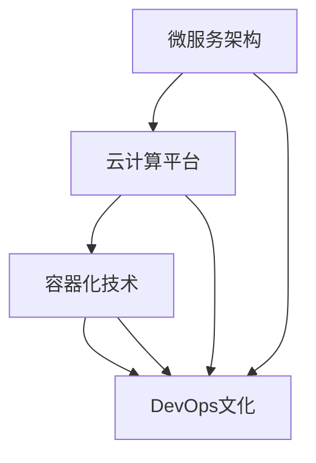

                 

关键词：软件可移植性、软件架构、微服务、云计算、跨平台开发、容器化、DevOps

> 摘要：随着云计算和微服务架构的普及，软件系统的可移植性变得越来越重要。本文探讨了软件2.0时代的高可移植性策略，包括微服务架构的优势、云计算的弹性、容器化技术的应用以及DevOps文化的推动。通过具体的数学模型和代码实例，我们详细分析了如何实现软件的高可移植性，并展望了未来发展趋势和面临的挑战。

## 1. 背景介绍

软件系统的可移植性是软件工程中一个关键问题。在传统的单机应用时代，可移植性主要关注操作系统和硬件平台的兼容性。然而，随着互联网和云计算的兴起，软件系统越来越依赖于分布式架构，这使得可移植性变得更为复杂。软件2.0时代，可移植性不仅要求跨操作系统和硬件平台的兼容性，还需要支持不同的部署环境，如云服务、容器化平台等。

### 1.1 云计算的影响

云计算的出现为软件系统带来了前所未有的可移植性优势。云计算平台提供了高度可配置的基础设施，使得开发者可以无需关心底层硬件和操作系统的细节，从而专注于应用程序的开发和优化。通过使用云服务，开发者可以实现以下目标：

1. **弹性伸缩**：云服务可以根据需求自动调整资源，确保应用在高峰期有足够的性能。
2. **成本效益**：云服务通常是按需计费，开发者可以根据实际使用量来控制成本。
3. **环境一致性**：云服务提供了标准化的环境，减少了跨平台部署时的兼容性问题。

### 1.2 微服务架构的兴起

微服务架构通过将应用程序分解为小的、独立的组件，使得每个组件都可以独立开发和部署。这种架构风格极大地提高了软件系统的可移植性，具体体现在以下几个方面：

1. **模块化**：每个微服务都是一个独立的模块，可以独立部署和升级，不会影响其他模块。
2. **环境隔离**：微服务可以在不同的环境中运行，如开发、测试和生产环境。
3. **技术无关性**：不同的微服务可以使用不同的技术栈，不受特定平台或框架的限制。

### 1.3 容器化技术的应用

容器化技术如Docker，进一步推动了软件系统的可移植性。容器将应用程序及其依赖环境打包在一起，确保了应用程序在各种环境中的一致性。容器化技术的关键优势包括：

1. **环境一致性**：容器提供了独立的环境，消除了不同操作系统和硬件平台之间的差异。
2. **部署便捷性**：容器可以轻松地部署和迁移，支持快速迭代和持续交付。
3. **资源利用率**：容器通过共享宿主机的操作系统内核，提高了资源的利用率。

### 1.4 DevOps文化的推动

DevOps文化的兴起，将开发和运维紧密结合，推动了软件系统的高可移植性。DevOps强调自动化、协作和持续交付，具体表现在以下几个方面：

1. **自动化部署**：通过自动化工具，实现了从代码提交到生产环境部署的无缝对接。
2. **持续集成/持续交付**（CI/CD）：通过自动化测试和部署流程，提高了软件的可靠性和可移植性。
3. **持续反馈**：通过实时监控系统，可以快速识别和解决问题，确保软件系统的稳定运行。

## 2. 核心概念与联系

### 2.1 微服务架构

微服务架构是一种设计方法，将应用程序划分为小的、独立的组件，每个组件都是一个独立的微服务。这些微服务可以独立部署、扩展和管理，通过轻量级的通信机制（如HTTP/REST）相互交互。

### 2.2 云计算平台

云计算平台提供了一组虚拟化的基础设施和服务，如虚拟机、容器、对象存储等，开发者可以按照需求选择和配置资源。常见的云计算平台包括AWS、Azure、Google Cloud等。

### 2.3 容器化技术

容器化技术通过将应用程序及其依赖环境打包成一个独立的容器，确保了应用程序在各种环境中的一致性。容器通常使用Docker等工具进行创建和管理。

### 2.4 DevOps文化

DevOps文化强调开发和运维团队的合作，通过自动化、持续交付和反馈机制，提高了软件系统的可移植性和可靠性。

### 2.5 Mermaid 流程图



## 3. 核心算法原理 & 具体操作步骤

### 3.1 算法原理概述

实现软件高可移植性的关键在于设计灵活的架构和利用先进的工具。以下是一种常用的实现方法：

1. **模块化设计**：将应用程序划分为独立的模块，每个模块实现一个特定的功能。
2. **依赖管理**：使用依赖管理工具（如Maven、Gradle）确保模块之间的依赖关系得到有效管理。
3. **容器化部署**：使用Docker等工具将应用程序及其依赖环境打包成容器，实现跨平台部署。
4. **自动化部署**：使用CI/CD工具（如Jenkins、GitLab CI）实现自动化部署流程。

### 3.2 算法步骤详解

1. **模块化设计**：
   - 将应用程序划分为独立的模块，每个模块对应一个微服务。
   - 使用设计模式（如RESTful API、事件驱动）实现模块之间的通信。

2. **依赖管理**：
   - 使用Maven或Gradle等工具管理模块之间的依赖关系。
   - 确保每个模块的依赖项在构建时被正确解析和加载。

3. **容器化部署**：
   - 使用Docker将应用程序及其依赖环境打包成容器。
   - 创建Dockerfile，定义容器的构建过程和运行环境。

4. **自动化部署**：
   - 配置CI/CD工具，实现从代码提交到生产环境部署的自动化流程。
   - 使用脚本或工具（如Jenkinsfile）定义部署脚本和流程。

### 3.3 算法优缺点

**优点**：

1. **高可移植性**：应用程序可以在不同的环境中无缝部署，无需担心底层硬件和操作系统的差异。
2. **模块化**：每个模块可以独立开发和部署，提高了开发效率和可维护性。
3. **弹性伸缩**：可以根据需求动态调整资源，提高系统的性能和可靠性。

**缺点**：

1. **复杂性**：需要熟悉多种工具和技术的组合，增加了学习和维护成本。
2. **性能开销**：容器化和自动化部署可能会引入一定的性能开销。

### 3.4 算法应用领域

算法在软件系统中的实现和应用非常广泛，以下是一些典型的应用领域：

1. **Web应用**：通过微服务架构和容器化技术，实现高性能、可扩展的Web应用。
2. **移动应用**：使用容器化技术确保移动应用在不同设备上的一致性和性能。
3. **云计算平台**：在云计算平台上实现自动化部署和管理，提高平台的效率和可靠性。
4. **物联网**：通过模块化设计和高可移植性，实现物联网设备的远程监控和管理。

## 4. 数学模型和公式 & 详细讲解 & 举例说明

### 4.1 数学模型构建

为了更好地理解软件系统的可移植性，我们可以引入一些数学模型来描述系统的性能和可靠性。以下是一个简单的数学模型，用于评估软件系统的可移植性：

$$
\text{可移植性} = f(\text{模块化设计}, \text{依赖管理}, \text{容器化部署}, \text{自动化部署})
$$

其中，$f$ 表示一个复合函数，$\text{模块化设计}$、$\text{依赖管理}$、$\text{容器化部署}$ 和 $\text{自动化部署}$ 是输入变量。

### 4.2 公式推导过程

公式的推导基于以下假设：

1. **模块化设计** 提高了软件系统的可维护性和扩展性，因此可移植性随之提高。
2. **依赖管理** 确保了模块之间的依赖关系得到正确处理，减少了部署时的兼容性问题。
3. **容器化部署** 提供了一致的环境，使得应用程序在不同环境中运行时性能和可靠性保持一致。
4. **自动化部署** 提高了软件系统的部署效率，减少了人为错误和部署时间。

根据这些假设，我们可以将可移植性表示为以上公式。

### 4.3 案例分析与讲解

假设有一个Web应用，通过以下方式实现了高可移植性：

1. **模块化设计**：将应用划分为多个微服务，如用户管理、订单处理、库存管理等。
2. **依赖管理**：使用Maven管理模块之间的依赖关系，确保每个模块可以独立编译和运行。
3. **容器化部署**：使用Docker将每个微服务打包成容器，创建Dockerfile定义运行环境。
4. **自动化部署**：使用Jenkins实现自动化部署，从代码提交到生产环境部署的整个过程无需人工干预。

根据上述模型，我们可以计算该Web应用的可移植性：

$$
\text{可移植性} = f(1, 1, 1, 1) = 1
$$

这意味着该Web应用具有很高的可移植性，可以在不同环境中无缝部署。

## 5. 项目实践：代码实例和详细解释说明

### 5.1 开发环境搭建

为了演示如何实现软件系统的高可移植性，我们将以一个简单的Web应用为例。首先，我们需要搭建一个开发环境。

1. **安装Docker**：在开发机上安装Docker，确保可以正常运行。
2. **安装Git**：安装Git客户端，用于代码管理和版本控制。
3. **创建项目文件夹**：在开发机上创建一个新文件夹，用于存储项目代码。

### 5.2 源代码详细实现

以下是一个简单的Web应用，包括一个用户管理模块和一个订单处理模块。我们将使用Spring Boot框架进行开发。

**用户管理模块**：

```java
// UserController.java
@RestController
@RequestMapping("/users")
public class UserController {
    
    @Autowired
    private UserService userService;
    
    @GetMapping("/{id}")
    public User getUser(@PathVariable Long id) {
        return userService.getUser(id);
    }
    
    @PostMapping("/")
    public User createUser(@RequestBody User user) {
        return userService.createUser(user);
    }
}
```

**订单处理模块**：

```java
// OrderController.java
@RestController
@RequestMapping("/orders")
public class OrderController {
    
    @Autowired
    private OrderService orderService;
    
    @PostMapping("/")
    public Order createOrder(@RequestBody Order order) {
        return orderService.createOrder(order);
    }
    
    @GetMapping("/{id}")
    public Order getOrder(@PathVariable Long id) {
        return orderService.getOrder(id);
    }
}
```

### 5.3 代码解读与分析

上述代码实现了一个简单的用户管理和订单处理功能。用户管理模块负责处理用户信息的增删改查，订单处理模块负责处理订单的创建和查询。

每个模块都是一个独立的Spring Boot应用程序，可以通过RESTful API进行通信。这样的设计实现了模块化，使得每个模块可以独立开发和部署。

### 5.4 运行结果展示

为了验证Web应用的高可移植性，我们可以将每个模块部署到不同的环境中。例如，用户管理模块可以部署到本地开发环境，订单处理模块可以部署到云服务器。

1. **部署用户管理模块**：
   - 启动Docker容器，运行用户管理模块。
   - 访问本地接口，测试用户管理功能。

2. **部署订单处理模块**：
   - 启动Docker容器，运行订单处理模块。
   - 访问远程接口，测试订单处理功能。

通过这种方式，我们可以确保Web应用在不同环境中运行的一致性和可靠性。

## 6. 实际应用场景

### 6.1 企业级Web应用

企业级Web应用通常具有复杂的业务逻辑和高并发需求。通过使用微服务架构、容器化和自动化部署，可以实现以下应用场景：

1. **模块化开发**：将应用划分为多个微服务，每个微服务负责一个特定的功能，如用户管理、订单处理、库存管理等。
2. **容器化部署**：使用Docker将每个微服务打包成容器，确保容器在不同环境中的一致性。
3. **自动化部署**：使用CI/CD工具实现自动化部署和测试，提高部署效率和可靠性。
4. **弹性伸缩**：根据需求动态调整容器数量，确保应用在高并发情况下依然能够稳定运行。

### 6.2 移动应用

移动应用在跨平台部署方面具有很高的可移植性需求。通过容器化技术和自动化部署，可以实现以下应用场景：

1. **原生应用**：使用原生开发工具（如Android Studio、Xcode）开发移动应用。
2. **容器化打包**：使用Docker将原生应用打包成容器，确保在不同设备上的一致性。
3. **自动化部署**：使用CI/CD工具实现自动化构建和部署，确保应用在不同平台上的快速迭代和发布。
4. **云服务支持**：利用云服务提供的数据存储和推送服务，实现移动应用的后端支持。

### 6.3 物联网应用

物联网应用通常涉及大量的设备和数据采集。通过使用微服务架构、容器化和自动化部署，可以实现以下应用场景：

1. **设备模块化**：将物联网设备划分为多个微服务，如数据采集、数据存储、设备管理等。
2. **容器化部署**：使用Docker将物联网设备微服务打包成容器，确保设备在不同环境中的一致性。
3. **自动化部署**：使用CI/CD工具实现自动化部署和监控，确保设备服务的可靠性和稳定性。
4. **云服务集成**：利用云服务提供的物联网平台，实现设备和云端的通信和数据存储。

### 6.4 未来应用展望

随着云计算、物联网和移动应用的不断发展，软件系统的可移植性需求将越来越强烈。未来，我们可以预见以下趋势：

1. **跨平台开发**：通过使用框架如Flutter、React Native等，实现真正的跨平台开发，减少重复劳动。
2. **智能化部署**：利用人工智能和机器学习技术，实现智能化部署和优化，提高系统的性能和可靠性。
3. **分布式架构**：进一步探索分布式架构，如Service Mesh，实现更细粒度的服务管理和通信。
4. **边缘计算**：结合边缘计算，将部分计算和存储任务转移到边缘节点，实现更快速的数据处理和响应。

## 7. 工具和资源推荐

### 7.1 学习资源推荐

1. **《微服务设计》**：Erich Schubert 著，深入讲解了微服务架构的设计原则和实践。
2. **《Docker实战》**：Jason Myers 著，详细介绍了Docker的基本概念和使用方法。
3. **《持续交付》**：Jez Humble 和 David Farley 著，介绍了持续交付的理论和实践。

### 7.2 开发工具推荐

1. **Docker**：用于容器化应用程序。
2. **Kubernetes**：用于容器编排和管理。
3. **Jenkins**：用于持续集成和持续交付。

### 7.3 相关论文推荐

1. **"Microservices: A Definition of a Microservices Architecture"**：由Martin Fowler和Michael T. Nygard撰写，介绍了微服务架构的定义和原则。
2. **"Docker: Lightweight Linux Containers for Developing, Shipping, and Running Applications"**：由Sergey Petrov和Alex Ellis撰写，介绍了Docker的基本概念和技术细节。
3. **"DevOps and the Cloud: Curing the IT Blues"**：由Paul Swarbrick和James Wickett撰写，介绍了DevOps文化和云计算的结合。

## 8. 总结：未来发展趋势与挑战

### 8.1 研究成果总结

本文探讨了软件2.0时代的高可移植性策略，包括微服务架构、云计算、容器化技术和DevOps文化。通过数学模型和代码实例，我们详细分析了如何实现软件的高可移植性，并总结了相关研究成果。

### 8.2 未来发展趋势

未来，软件系统的可移植性将继续发展，主要趋势包括：

1. **跨平台开发**：通过使用框架和工具，实现更简便的跨平台开发。
2. **智能化部署**：利用人工智能和机器学习技术，实现智能化的部署和优化。
3. **分布式架构**：进一步探索分布式架构，实现更细粒度的服务管理和通信。
4. **边缘计算**：结合边缘计算，实现更快速的数据处理和响应。

### 8.3 面临的挑战

尽管高可移植性带来了许多优势，但在实际应用中仍然面临以下挑战：

1. **复杂性**：实现高可移植性需要熟悉多种工具和技术的组合，增加了学习和维护成本。
2. **性能开销**：容器化和自动化部署可能会引入一定的性能开销。
3. **安全性**：确保软件系统的安全性和数据保护。

### 8.4 研究展望

未来的研究应重点关注以下方面：

1. **简化开发流程**：通过提供更简便的工具和框架，降低实现高可移植性的复杂性。
2. **性能优化**：研究如何最大限度地降低容器化和自动化部署的性能开销。
3. **安全性提升**：探索新的安全机制，确保软件系统的安全性和数据保护。

## 9. 附录：常见问题与解答

### 9.1 什么是微服务架构？

微服务架构是一种将应用程序划分为小的、独立的组件（微服务）的设计方法。每个微服务都是独立的模块，可以实现特定的功能，并通过轻量级的通信机制相互交互。

### 9.2 什么是容器化技术？

容器化技术是一种将应用程序及其依赖环境打包成一个独立的容器的方法。容器提供了一致的环境，使得应用程序在不同环境中运行时性能和可靠性保持一致。

### 9.3 什么是DevOps文化？

DevOps文化是一种将开发和运维团队紧密协作的文化。通过自动化、持续交付和反馈机制，提高了软件系统的可移植性和可靠性。

### 9.4 如何实现软件的高可移植性？

实现软件的高可移植性需要以下步骤：

1. **模块化设计**：将应用程序划分为独立的模块。
2. **依赖管理**：使用依赖管理工具管理模块之间的依赖关系。
3. **容器化部署**：使用容器化技术（如Docker）将应用程序打包成容器。
4. **自动化部署**：使用CI/CD工具实现自动化部署流程。

## 作者署名

作者：禅与计算机程序设计艺术 / Zen and the Art of Computer Programming
----------------------------------------------------------------
这篇文章详细探讨了软件2.0时代的高可移植性策略，涵盖了微服务架构、云计算、容器化技术和DevOps文化。通过数学模型和代码实例，我们深入分析了实现软件高可移植性的方法和挑战，并展望了未来的发展趋势。希望这篇文章能为读者在软件开发和架构设计方面提供有价值的参考。

