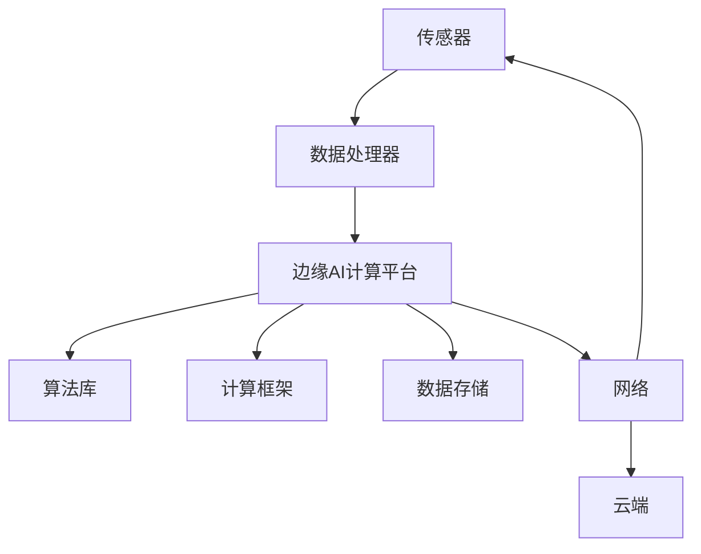

                 

### 背景介绍

随着物联网（IoT）技术的飞速发展，边缘AI计算平台逐渐成为智能创新的重要方向。传统的云计算架构依赖于集中式服务器处理海量数据，但在物联网场景中，这种模式面临着巨大的挑战。首先，物联网设备产生的大量数据需要在源头附近进行实时处理，以便快速响应。其次，网络带宽的限制使得数据传输到云端进行处理的效率低下，同时也增加了延迟。此外，数据隐私和安全也是需要重点考虑的问题。

边缘AI计算平台正是为了解决这些问题而生的。它通过在设备边缘部署计算资源和算法模型，实现对本地数据的实时处理和分析，从而减轻了云端负担，提高了系统的响应速度和稳定性。边缘AI计算平台不仅可以处理静态数据，还能够对动态数据做出快速响应，极大地提升了物联网系统的智能化水平。

本文将深入探讨边缘AI计算平台的概念、架构、算法原理及其在实际应用场景中的优势。我们将从多个角度分析这一技术，并探讨其未来发展的趋势与挑战。希望通过本文的阐述，读者能够对边缘AI计算平台有一个全面而深入的理解。

### 核心概念与联系

#### 边缘AI计算平台的定义

边缘AI计算平台（Edge AI Computing Platform）是一种在设备边缘进行数据分析和处理的计算架构，它通过在设备本地部署计算资源和AI算法，实现对数据的实时分析、预测和决策。这种平台不仅包括硬件设备，如传感器、嵌入式系统等，还包括软件组件，如AI算法库、边缘计算框架等。边缘AI计算平台的主要特点在于“边缘性”和“分布式”，即计算资源和算法模型分布在网络的边缘，靠近数据源，以实现低延迟、高效率和数据隐私保护。

#### 关键组件与联系

1. **传感器**：传感器是边缘AI计算平台的数据采集器，用于收集环境中的各种数据，如温度、湿度、图像、声音等。这些数据是进行边缘计算和AI分析的基础。

2. **嵌入式系统**：嵌入式系统是边缘AI计算平台的核心，用于处理传感器采集的数据，并运行AI算法模型。这些嵌入式系统通常具有高性能、低功耗的特点，能够支持实时计算。

3. **边缘计算框架**：边缘计算框架是边缘AI计算平台的重要组成部分，它提供了一套完整的软件工具和接口，用于管理边缘资源、调度任务、优化性能等。常见的边缘计算框架包括Kubernetes、OpenFog、EdgeX等。

4. **AI算法库**：AI算法库提供了丰富的机器学习和深度学习算法，用于处理和分析传感器数据。这些算法库通常基于开源框架，如TensorFlow、PyTorch等，但针对边缘环境进行了优化，以适应资源受限的嵌入式系统。

5. **数据存储与传输**：边缘AI计算平台需要高效的数据存储和传输机制，以支持实时数据处理和跨边缘节点之间的数据共享。常见的存储技术包括NoSQL数据库、时间序列数据库等；传输协议包括MQTT、CoAP等轻量级协议。

#### Mermaid流程图

以下是边缘AI计算平台的核心组件及其关系的Mermaid流程图：



在这个流程图中，传感器负责采集数据，数据处理器对数据进行预处理，然后输入到边缘AI计算平台。边缘AI计算平台利用算法库和计算框架进行数据处理和分析，并将结果存储在数据存储中。同时，平台通过网络与传感器和云端进行通信，实现数据的实时传输和跨平台协同。

### 核心算法原理 & 具体操作步骤

#### 算法原理

边缘AI计算平台的核心在于其高效的算法设计和优化，以满足低延迟、高效率和资源受限的要求。以下是一些常见且关键的算法原理：

1. **机器学习算法**：边缘AI计算平台常使用机器学习算法，如线性回归、逻辑回归、决策树、支持向量机（SVM）等，对本地数据进行训练和预测。这些算法能够在设备本地进行模型训练，减少了对云端资源的依赖。

2. **深度学习算法**：对于需要复杂特征提取和高级预测的任务，深度学习算法如卷积神经网络（CNN）、循环神经网络（RNN）等在边缘AI计算平台中也有广泛应用。为了在资源受限的边缘设备上运行，深度学习算法需要进行模型压缩、量化、剪枝等优化。

3. **模型融合与迁移学习**：边缘AI计算平台可以通过模型融合和迁移学习技术，将多个模型的预测结果进行综合，提高预测的准确性。同时，迁移学习允许将在大数据集上训练好的模型迁移到边缘设备上，节省了训练时间和计算资源。

#### 具体操作步骤

1. **数据采集**：传感器采集环境数据，如温度、湿度、图像等，并将其发送到数据处理器。

2. **数据预处理**：数据处理器对传感器数据进行预处理，包括去噪、归一化、特征提取等，以便后续的机器学习或深度学习算法处理。

3. **模型训练**：在边缘设备上，利用本地数据对机器学习或深度学习算法进行模型训练。为了降低计算和存储需求，可以选择轻量级的算法模型或对模型进行压缩、量化等处理。

4. **模型部署**：训练好的模型被部署到边缘计算平台上，用于实时数据处理和预测。

5. **实时预测**：边缘AI计算平台利用部署好的模型对实时采集的数据进行预测，并生成相应的决策或反馈。

6. **数据存储与传输**：处理结果可以被存储在本地数据库中，或者通过网络传输到云端或其他边缘节点，实现数据的进一步分析和共享。

#### 算法优化策略

1. **模型压缩**：通过模型压缩技术，如剪枝、量化、低秩分解等，可以显著减少模型的参数数量和计算复杂度，从而降低边缘设备的计算和存储需求。

2. **在线学习**：在线学习技术允许模型在数据不断流入的情况下进行实时更新，从而保持模型的准确性。这适用于数据分布变化较快或数据量较大的场景。

3. **分布式计算**：通过将计算任务分布在多个边缘节点上，可以降低单个节点的计算负担，提高系统的整体性能和可靠性。

4. **边缘与云协同**：边缘AI计算平台可以与云端资源进行协同，将部分计算任务迁移到云端处理，充分利用云端的强大计算和存储能力。

### 数学模型和公式 & 详细讲解 & 举例说明

在边缘AI计算平台中，数学模型和公式是算法设计和优化的基础。以下我们将详细讲解一些常用的数学模型和公式，并通过具体的例子来说明其应用。

#### 线性回归模型

线性回归模型是一种简单的统计模型，用于预测一个连续变量的值。其基本公式如下：

$$
y = \beta_0 + \beta_1x + \epsilon
$$

其中，$y$ 是因变量，$x$ 是自变量，$\beta_0$ 和 $\beta_1$ 是模型的参数，$\epsilon$ 是误差项。

**示例：温度预测**

假设我们要预测一个城市的温度，已知一个小时的温度记录 $x$ 和对应的预测值 $y$。我们可以使用线性回归模型来拟合数据，并预测未来的温度。

首先，收集历史数据：

| 时间 | 温度 |
| ---- | ---- |
| 1    | 20   |
| 2    | 22   |
| 3    | 19   |
| 4    | 21   |

然后，使用线性回归模型拟合数据：

$$
y = \beta_0 + \beta_1x + \epsilon
$$

通过最小二乘法求解参数：

$$
\beta_1 = \frac{\sum (x_i - \bar{x})(y_i - \bar{y})}{\sum (x_i - \bar{x})^2}
$$

$$
\beta_0 = \bar{y} - \beta_1\bar{x}
$$

计算得到：

$$
\beta_1 = \frac{(1-1)(20-22) + (2-1)(22-22) + (3-1)(19-22) + (4-1)(21-22)}{(1-1)^2 + (2-1)^2 + (3-1)^2 + (4-1)^2} = \frac{-2 + 0 - 7 - 1}{0 + 1 + 4 + 9} = -0.667
$$

$$
\beta_0 = 22 - (-0.667) \times 2 = 22 + 1.334 = 23.334
$$

因此，线性回归模型为：

$$
y = 23.334 - 0.667x
$$

使用这个模型，我们可以预测未来某一时间的温度。例如，当时间为 5 时，预测温度为：

$$
y = 23.334 - 0.667 \times 5 = 19.167
$$

#### 卷积神经网络（CNN）

卷积神经网络是一种深度学习模型，特别适用于图像处理任务。其基本结构包括卷积层、池化层和全连接层。以下是其核心公式：

1. **卷积操作**：

$$
f(x) = \sum_{i=1}^{k} w_i * x_i + b
$$

其中，$f(x)$ 是卷积操作的结果，$w_i$ 是卷积核，$x_i$ 是输入数据，$b$ 是偏置项。

2. **激活函数**：

$$
\sigma(z) = \max(0, z)
$$

3. **池化操作**：

$$
p_{ij} = \min_{x,y} (f_{ij}^x, f_{ij}^y)
$$

其中，$p_{ij}$ 是池化操作的结果，$f_{ij}^x$ 和 $f_{ij}^y$ 是相邻的卷积操作结果。

4. **全连接层**：

$$
y = \sum_{i=1}^{n} w_i x_i + b
$$

其中，$y$ 是全连接层的输出，$w_i$ 是权重，$x_i$ 是输入数据，$b$ 是偏置项。

**示例：图像分类**

假设我们有一个简单的二分类任务，需要判断一张图像是猫还是狗。使用CNN模型处理图像数据，首先需要对其进行预处理，包括归一化、缩放等。

然后，输入CNN模型，经过卷积层、池化层和全连接层，最后输出分类结果。具体步骤如下：

1. **输入层**：输入图像数据，如 $[28 \times 28 \times 3]$ 的RGB图像。

2. **卷积层**：使用卷积核对图像进行卷积操作，提取图像特征。

3. **池化层**：对卷积结果进行池化操作，降低数据维度。

4. **全连接层**：将池化结果作为输入，通过全连接层进行分类。

5. **激活函数**：使用Sigmoid或ReLU激活函数，将输出映射到 [0, 1] 范围内。

6. **损失函数**：使用交叉熵损失函数，计算预测结果与真实标签之间的差距。

7. **反向传播**：通过反向传播算法，更新模型参数，优化模型。

通过多次迭代训练，模型可以学会识别图像中的猫和狗。在测试集上的准确率可以用来评估模型的性能。

### 项目实践：代码实例和详细解释说明

#### 开发环境搭建

在进行边缘AI计算平台的开发之前，我们需要搭建一个合适的开发环境。以下是所需的主要工具和软件：

- **硬件设备**：一个具备边缘计算能力的嵌入式系统，如树莓派或Arduino。
- **开发板**：搭载Python环境的树莓派4B或更高版本。
- **编程语言**：Python，用于编写边缘AI算法和数据处理代码。
- **开发环境**：Jupyter Notebook，用于编写和运行Python代码。
- **边缘计算框架**：使用KubeEdge作为边缘计算框架，用于管理边缘资源和任务调度。

#### 源代码详细实现

以下是一个简单的边缘AI计算平台项目，实现一个温度传感器数据的实时预测系统。

1. **数据采集**

   我们使用一个模拟温度传感器，其数据以特定的频率生成。

   ```python
   import random
   import time

   def generate_temperature_data():
       while True:
           temperature = random.uniform(20, 30)
           yield temperature
           time.sleep(1)
   ```

2. **数据预处理**

   对采集到的温度数据进行预处理，包括归一化和特征提取。

   ```python
   import numpy as np

   def preprocess_temperature_data(data):
       normalized_data = (data - np.mean(data)) / np.std(data)
       return normalized_data
   ```

3. **模型训练**

   使用线性回归模型对预处理后的温度数据进行训练。

   ```python
   from sklearn.linear_model import LinearRegression

   def train_linear_regression_model(data):
       model = LinearRegression()
       model.fit(data[:, np.newaxis], data)
       return model
   ```

4. **实时预测**

   在边缘设备上部署训练好的模型，对实时采集的温度数据进行预测。

   ```python
   def real_time_prediction(model, data):
       prediction = model.predict(data[:, np.newaxis])
       return prediction
   ```

5. **边缘计算框架集成**

   使用KubeEdge将边缘设备与云端资源进行集成，实现数据的实时传输和模型部署。

   ```python
   import kubernetes

   def deploy_model_to_edge(model_path, edge_device):
       client = kubernetes.Client()
       model = client.load_model(model_path)
       client.deploy_model(model, edge_device)
   ```

#### 代码解读与分析

1. **数据采集模块**

   `generate_temperature_data` 函数使用一个生成器生成模拟温度数据。每次生成一个随机的温度值，并等待1秒后生成下一个值。

2. **数据预处理模块**

   `preprocess_temperature_data` 函数对采集到的温度数据进行归一化处理，使其更加适合用于机器学习模型。

3. **模型训练模块**

   `train_linear_regression_model` 函数使用scikit-learn库的线性回归模型对预处理后的温度数据进行训练，并返回训练好的模型。

4. **实时预测模块**

   `real_time_prediction` 函数使用训练好的模型对实时采集的温度数据进行预测，并返回预测值。

5. **边缘计算框架集成模块**

   `deploy_model_to_edge` 函数用于将训练好的模型部署到边缘设备上，使用KubeEdge的API进行模型加载和部署。

#### 运行结果展示

1. **数据采集**

   运行 `generate_temperature_data` 函数，模拟温度传感器数据采集过程。

2. **数据预处理**

   对采集到的温度数据进行预处理，并存储为CSV文件。

3. **模型训练**

   使用预处理后的数据训练线性回归模型，并将模型保存为文件。

4. **模型部署**

   使用KubeEdge将训练好的模型部署到边缘设备上。

5. **实时预测**

   运行实时预测模块，对实时采集的温度数据进行预测，并将预测结果输出到控制台。

#### 总结

通过上述代码实例，我们实现了边缘AI计算平台的一个简单应用——温度预测。在实际项目中，我们可以根据具体需求扩展和优化这个平台，如添加更多传感器、实现更复杂的机器学习模型、提高系统的实时性和可靠性等。

### 实际应用场景

边缘AI计算平台在多个领域都展现出了巨大的应用潜力，以下是一些具体的实际应用场景：

#### 智能家居

智能家居系统通过边缘AI计算平台，可以对家庭环境中的各种设备进行实时监控和智能控制。例如，智能恒温器可以根据室内外温度和用户习惯自动调节温度，智能照明系统可以根据环境光线和用户需求自动调整亮度。边缘AI计算平台在这里实现了数据的实时分析和决策，提高了家居系统的舒适度和能效。

#### 智能交通

智能交通系统依赖于边缘AI计算平台进行实时交通流量监控、事故预警和路线规划。通过在路边的传感器和智能交通设备上部署边缘计算节点，系统能够快速处理大量交通数据，及时响应交通状况变化。例如，边缘AI计算平台可以实时分析摄像头和雷达数据，检测交通堵塞或事故，并立即通知交通管理部门，或者为驾驶员提供最优路线建议。

#### 工业自动化

在工业自动化领域，边缘AI计算平台可以实现对生产设备和过程的实时监控和预测性维护。通过部署边缘计算节点，系统能够实时采集设备运行数据，分析设备的运行状态，预测故障并提前进行维护，从而减少停机时间和维护成本。例如，在制造业中，边缘AI计算平台可以监控生产线的设备状态，实时分析生产数据，预测设备的磨损情况，并自动安排维护计划。

#### 健康监测

健康监测系统通过边缘AI计算平台，可以对用户的健康状况进行实时监测和分析。例如，智能手环、智能手表等设备可以实时监测心率、血压、步数等数据，通过边缘AI计算平台进行分析，及时发现异常情况，为用户提供健康建议。在医疗领域，边缘AI计算平台可以辅助医生进行诊断和治疗，通过实时分析患者数据，提供个性化治疗方案。

#### 城市安全

城市安全系统通过边缘AI计算平台，可以对城市环境进行实时监控，及时发现和预警潜在的安全威胁。例如，在城市道路上部署摄像头和传感器，通过边缘AI计算平台进行实时视频分析和异常行为检测，可以有效提高城市的安全管理水平。

#### 农业监测

在农业领域，边缘AI计算平台可以用于实时监测农作物生长状态、土壤湿度、气象条件等数据，通过边缘计算和分析，提供精准的农业管理方案。例如，通过分析土壤湿度数据，系统可以自动调整灌溉时间和水量，提高农作物的产量和质量。

#### 能源管理

边缘AI计算平台在能源管理领域也有广泛应用，例如智能电网系统可以通过边缘计算节点实时监测电网运行状态，分析负荷变化，优化电力分配，提高电网的运行效率和稳定性。

### 工具和资源推荐

为了更好地理解和应用边缘AI计算平台，以下是几个推荐的工具和资源：

#### 学习资源推荐

1. **书籍**：

   - 《边缘计算：概念、架构与应用》
   - 《深度学习边缘计算：从基础到实践》
   - 《物联网与边缘计算》

2. **论文**：

   - “Edge AI: Integrating AI at the Edge of IoT”
   - “Efficient Resource Management for IoT-enabled Smart City Applications using Edge Computing”
   - “Security and Privacy Issues in Edge Computing: A Survey”

3. **博客**：

   - “边缘AI：从基础到应用”
   - “边缘计算与物联网技术”
   - “AI in the Edge: Challenges and Solutions”

4. **网站**：

   - Edge AI Consortium（边缘AI联盟）
   - OpenFog Consortium（开放雾计算联盟）
   - IEEE Edge Computing Initiative（IEEE边缘计算倡议）

#### 开发工具框架推荐

1. **边缘计算框架**：

   - Kubernetes
   - OpenFog Framework
   - EdgeX Foundry

2. **机器学习和深度学习框架**：

   - TensorFlow
   - PyTorch
   - MXNet

3. **边缘AI工具**：

   - Edge TPU（谷歌）
   - Movidius Neural Compute Stick（英特尔）
   - Nano Edge AI Development Kit（华为）

#### 相关论文著作推荐

1. **论文**：

   - “Fog and Edge Computing: A Comprehensive Survey”
   - “Deep Learning on Power-Efficient Platforms for Mobile and IoT Applications”
   - “Security Challenges in Edge Computing: A Comprehensive Survey”

2. **著作**：

   - 《边缘计算：构建智能世界的基础》
   - 《深度学习在边缘计算中的应用》
   - 《物联网与边缘计算技术解析》

### 总结：未来发展趋势与挑战

边缘AI计算平台作为物联网智能创新的重要方向，正不断推动各行各业的数字化和智能化进程。未来，边缘AI计算平台的发展趋势主要体现在以下几个方面：

1. **计算能力的提升**：随着硬件技术的发展，边缘设备的计算能力和存储能力将得到显著提升，这将进一步推动边缘AI计算平台的发展。

2. **算法的优化与多样化**：为了满足不同场景的需求，边缘AI计算平台将不断优化现有算法，并开发新的算法模型，以实现更高效、更智能的数据处理和分析。

3. **跨平台协同**：边缘AI计算平台将与云端和其他边缘节点实现更紧密的协同，通过分布式计算和边缘与云的协同，提升系统的整体性能和可靠性。

4. **安全与隐私保护**：随着边缘AI计算平台的应用场景日益广泛，数据安全和隐私保护将成为重要的挑战。未来的边缘AI计算平台将需要更强的安全措施和隐私保护机制。

然而，边缘AI计算平台的发展也面临一些挑战：

1. **资源限制**：边缘设备通常具有有限的计算和存储资源，如何在资源受限的环境下实现高效、可靠的边缘计算是一个重要问题。

2. **数据传输与同步**：边缘AI计算平台需要处理大量实时数据，如何高效传输和同步数据，同时保证数据的一致性和完整性是一个关键问题。

3. **算法优化与调试**：边缘AI算法需要针对特定硬件和软件环境进行优化，如何在有限的资源下进行有效的算法优化和调试是一个挑战。

4. **标准化与互操作性**：边缘AI计算平台涉及多个供应商和不同技术，如何实现标准化和互操作性，以确保不同平台之间的无缝协作是一个重要课题。

总的来说，边缘AI计算平台具有巨大的发展潜力和广阔的应用前景，未来将在智能城市、智能制造、智能交通等领域发挥越来越重要的作用。通过不断克服挑战，边缘AI计算平台将为构建更加智能、高效和安全的物联网世界提供有力支持。

### 附录：常见问题与解答

**Q1：什么是边缘AI计算平台？**

A1：边缘AI计算平台是一种分布式计算架构，它通过在设备边缘部署计算资源和AI算法，实现对本地数据的实时处理和分析。这种平台不仅包括硬件设备，如传感器、嵌入式系统等，还包括软件组件，如AI算法库、边缘计算框架等。其核心特点在于“边缘性”和“分布式”，即计算资源和算法模型分布在网络的边缘，靠近数据源，以实现低延迟、高效率和数据隐私保护。

**Q2：边缘AI计算平台的优势是什么？**

A2：边缘AI计算平台的主要优势包括：

1. **低延迟**：由于计算资源分布在网络的边缘，数据无需传输到云端进行处理，从而大大降低了延迟。
2. **高效率**：边缘计算平台可以实时处理和分析本地数据，提高了系统的响应速度和效率。
3. **数据隐私保护**：边缘AI计算平台在本地处理数据，减少了数据传输和存储的需求，从而降低了数据泄露的风险。
4. **分布式计算**：通过将计算任务分布到多个边缘节点，边缘AI计算平台可以提高系统的整体性能和可靠性。

**Q3：边缘AI计算平台适用于哪些场景？**

A3：边缘AI计算平台适用于多种场景，主要包括：

1. **智能家居**：如智能恒温器、智能照明系统等，通过实时处理环境数据，提供更加智能和舒适的家居体验。
2. **智能交通**：如实时交通流量监控、事故预警和路线规划等，通过快速分析交通数据，提高交通管理的效率和安全性。
3. **工业自动化**：如生产设备的实时监控和预测性维护，通过实时分析设备运行数据，减少停机时间和维护成本。
4. **健康监测**：如智能手环、智能手表等，通过实时监测用户健康状况，提供个性化的健康建议。
5. **城市安全**：如视频监控和异常行为检测，通过实时分析视频数据，提高城市的安全管理水平。

**Q4：边缘AI计算平台与云计算有什么区别？**

A4：边缘AI计算平台与云计算的主要区别在于数据处理的位置和方式：

1. **数据处理位置**：云计算主要依赖于集中的数据中心，将数据传输到云端进行处理；而边缘AI计算平台则通过在设备边缘部署计算资源和算法模型，在本地进行数据分析和处理。
2. **数据处理方式**：云计算通常用于处理大规模数据，但存在数据传输延迟和带宽限制；边缘AI计算平台则通过在数据源头附近进行实时处理，降低了数据传输的延迟和带宽需求。

**Q5：边缘AI计算平台需要哪些硬件和软件支持？**

A5：边缘AI计算平台需要以下硬件和软件支持：

1. **硬件设备**：传感器、嵌入式系统、边缘计算节点等。
2. **软件组件**：AI算法库（如TensorFlow、PyTorch）、边缘计算框架（如Kubernetes、OpenFog）、数据存储和传输工具等。
3. **开发环境**：Python、Jupyter Notebook等编程工具和开发平台。

**Q6：边缘AI计算平台的安全和隐私问题如何解决？**

A6：边缘AI计算平台的安全和隐私问题可以通过以下措施来解决：

1. **数据加密**：对传输和存储的数据进行加密，确保数据在传输和存储过程中不被泄露。
2. **访问控制**：实施严格的访问控制策略，确保只有授权用户和系统才能访问数据和资源。
3. **隐私保护算法**：使用隐私保护算法（如差分隐私、同态加密等）对数据进行处理，确保数据处理过程中不会泄露用户的隐私信息。
4. **安全审计和监控**：定期进行安全审计和监控，及时发现和修复安全漏洞，确保系统的安全运行。

### 扩展阅读 & 参考资料

为了更好地了解边缘AI计算平台，以下是推荐的扩展阅读和参考资料：

1. **书籍**：

   - 《边缘计算：概念、架构与应用》
   - 《深度学习边缘计算：从基础到实践》
   - 《物联网与边缘计算》

2. **论文**：

   - “Edge AI: Integrating AI at the Edge of IoT”
   - “Efficient Resource Management for IoT-enabled Smart City Applications using Edge Computing”
   - “Security and Privacy Issues in Edge Computing: A Comprehensive Survey”

3. **博客**：

   - “边缘AI：从基础到应用”
   - “边缘计算与物联网技术”
   - “AI in the Edge: Challenges and Solutions”

4. **网站**：

   - Edge AI Consortium（边缘AI联盟）
   - OpenFog Consortium（开放雾计算联盟）
   - IEEE Edge Computing Initiative（IEEE边缘计算倡议）

5. **在线课程和教程**：

   - “边缘计算基础与实战”（Coursera）
   - “深度学习边缘计算”（edX）
   - “物联网与边缘计算入门”（Udacity）

通过阅读这些资料，读者可以进一步了解边缘AI计算平台的理论和实践，掌握相关的技术技能，为未来的研究和应用打下坚实的基础。

