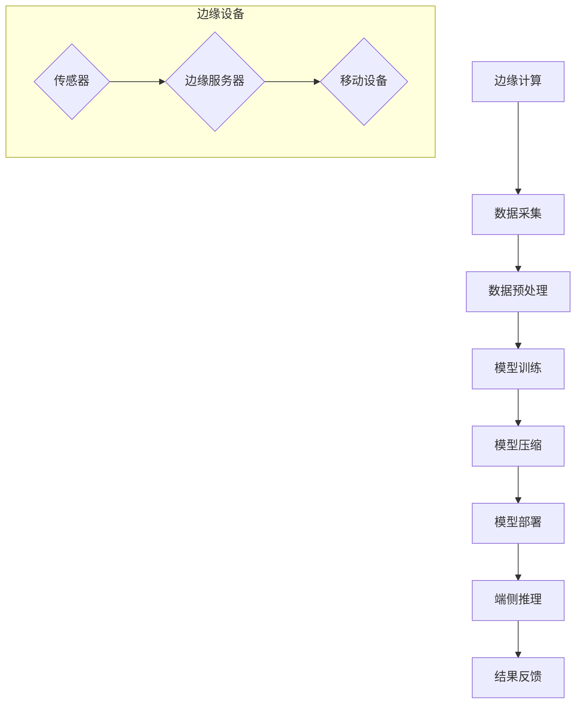

                 

关键词：边缘计算、端侧推理、模型压缩、神经网络、深度学习、模型部署、实时处理、低延迟、移动设备。

摘要：本文将深入探讨边缘计算和端侧推理的原理及其在移动设备上的应用。我们将介绍边缘计算的概念、优势和挑战，以及端侧推理的技术细节和优化方法。通过实际的代码实例，我们将展示如何在实际项目中应用这些技术，并探讨未来的发展趋势与挑战。

## 1. 背景介绍

随着移动互联网的飞速发展，移动设备处理数据的能力不断增强，人们对实时处理和低延迟的需求也日益增长。然而，传统的云计算模式在处理这些需求时往往表现出一定的局限性。这促使边缘计算和端侧推理技术逐渐崭露头角，成为解决实时数据处理和低延迟问题的关键。

### 边缘计算

边缘计算（Edge Computing）是一种分布式计算架构，它将数据处理和存储的能力从云端转移到网络的边缘。边缘计算的核心思想是将数据处理更接近数据源，从而减少数据传输的延迟，提高系统的响应速度。

#### 优势

1. **低延迟**：数据在边缘设备上进行处理，减少了传输到云端的时间，特别适用于实时性要求高的应用。
2. **高带宽利用率**：通过减少数据传输量，降低了网络带宽的消耗。
3. **隐私和安全**：在边缘设备上处理数据，可以更好地保护用户隐私，减少数据泄露的风险。
4. **弹性扩展**：边缘设备可以根据需求进行灵活扩展，适应不同的应用场景。

#### 挑战

1. **计算资源限制**：边缘设备通常计算资源有限，需要优化算法和架构以适应这些限制。
2. **数据一致性**：在分布式系统中，如何保证数据的一致性是一个重要挑战。
3. **网络连接可靠性**：边缘设备的网络连接可能不稳定，需要设计鲁棒的网络协议。

### 端侧推理

端侧推理（Edge Inference）是指将深度学习模型部署到移动设备上，直接在设备上进行推理计算。随着移动设备的性能提升，端侧推理已经成为实现实时处理和低延迟的关键技术。

#### 优势

1. **实时处理**：端侧推理可以在设备上实现实时数据分析和响应。
2. **数据隐私**：所有数据处理都在本地进行，不需要传输敏感数据到云端。
3. **节省网络流量**：通过在端侧进行推理，可以减少数据传输的流量。
4. **离线工作**：在无网络连接的情况下，端侧推理仍然可以工作。

#### 挑战

1. **计算资源限制**：移动设备通常计算资源有限，需要优化模型和算法。
2. **电池寿命**：深度学习模型推理会消耗大量电量，需要考虑如何优化电池使用。
3. **模型部署复杂度**：将模型部署到移动设备需要考虑兼容性和部署流程。

## 2. 核心概念与联系

下面，我们将通过一个Mermaid流程图来展示边缘计算与端侧推理的核心概念和联系。



### 数据采集

数据采集是边缘计算的第一步，它从各种传感器和设备中收集数据。

### 数据预处理

收集到的数据需要进行预处理，包括数据清洗、特征提取和规范化等操作。

### 模型训练

在边缘服务器上，使用预处理后的数据进行模型训练，训练得到的模型将用于端侧推理。

### 模型压缩

由于移动设备的计算资源有限，需要将训练好的模型进行压缩，以减少模型的大小和计算复杂度。

### 模型部署

压缩后的模型将被部署到移动设备上，以便在本地进行推理。

### 端侧推理

移动设备使用部署的模型对实时数据进行推理，得到结果后，可以立即响应。

### 结果反馈

推理结果可以通过网络传输到边缘服务器或其他设备，进行进一步处理和反馈。

## 3. 核心算法原理 & 具体操作步骤

### 3.1 算法原理概述

边缘计算和端侧推理的核心算法包括深度学习模型的训练、压缩和部署。以下将详细介绍这些算法的原理和步骤。

#### 深度学习模型训练

深度学习模型训练是基于大量的数据集，通过优化模型参数，使得模型能够对输入数据进行准确的分类、回归或预测。常用的训练算法包括反向传播算法、梯度下降算法等。

#### 模型压缩

模型压缩是为了适应移动设备的计算资源限制，常用的压缩方法包括模型剪枝、量化、知识蒸馏等。这些方法可以有效地减少模型的大小和计算复杂度，同时保持模型的性能。

#### 模型部署

模型部署是将训练好的模型部署到目标设备上，以便进行推理。在端侧推理中，常用的部署方法包括静态部署和动态部署。静态部署是将模型编译成目标设备的可执行文件，而动态部署则是通过解释器在运行时加载和执行模型。

### 3.2 算法步骤详解

#### 模型训练

1. **数据预处理**：对训练数据集进行数据清洗、归一化和数据增强等操作。
2. **定义模型结构**：根据应用需求，选择合适的模型结构，如卷积神经网络（CNN）、循环神经网络（RNN）等。
3. **初始化模型参数**：随机初始化模型参数。
4. **定义损失函数**：选择合适的损失函数，如交叉熵、均方误差等。
5. **选择优化算法**：选择合适的优化算法，如梯度下降、Adam等。
6. **训练模型**：通过前向传播和反向传播，不断更新模型参数，直到满足停止条件。

#### 模型压缩

1. **选择压缩方法**：根据模型和应用需求，选择合适的压缩方法。
2. **训练压缩模型**：在压缩过程中，需要对压缩后的模型进行重新训练，以保证压缩后的模型性能不受影响。
3. **评估压缩效果**：通过评估压缩模型在测试集上的性能，判断压缩效果是否达到预期。

#### 模型部署

1. **编译模型**：将训练好的模型编译成目标设备的可执行文件。
2. **部署模型**：将编译好的模型部署到移动设备上，包括模型文件和运行时库。
3. **运行模型**：在移动设备上运行部署的模型，对实时数据进行推理。

### 3.3 算法优缺点

#### 模型训练

**优点**：

- 能够对大量数据进行深度学习和特征提取。
- 可以通过调整模型结构和参数，适应不同的应用场景。

**缺点**：

- 训练过程需要大量的计算资源和时间。
- 对数据质量和标注有较高要求。

#### 模型压缩

**优点**：

- 可以显著减少模型的存储空间和计算复杂度。
- 可以适应移动设备和边缘设备的计算资源限制。

**缺点**：

- 可能会降低模型的性能。
- 压缩后的模型可能无法完全恢复原始模型的性能。

#### 模型部署

**优点**：

- 可以在移动设备和边缘设备上实现实时推理。
- 可以节省网络带宽，提高数据隐私。

**缺点**：

- 需要考虑模型兼容性和部署流程。
- 可能需要额外的计算资源进行模型编译和部署。

### 3.4 算法应用领域

边缘计算和端侧推理技术可以应用于多个领域，包括但不限于：

- **智能物联网（IoT）**：在物联网设备上进行实时数据处理和智能分析。
- **智能城市**：用于实时监控、交通管理和公共安全等。
- **移动应用**：用于移动设备上的图像识别、语音识别和自然语言处理等。
- **智能制造**：用于实时监控生产线和设备状态，提高生产效率。

## 4. 数学模型和公式 & 详细讲解 & 举例说明

### 4.1 数学模型构建

在深度学习中，常用的数学模型包括卷积神经网络（CNN）、循环神经网络（RNN）等。以下我们将以CNN为例，介绍其数学模型构建。

#### 卷积神经网络（CNN）

1. **卷积层（Convolutional Layer）**

   卷积层是CNN的核心部分，用于提取图像的特征。其数学模型可以表示为：

   $$ f(x) = \sum_{i=1}^{k} w_{i} * x + b $$

   其中，$x$ 表示输入特征图，$w_{i}$ 表示卷积核，$*$ 表示卷积操作，$b$ 表示偏置。

2. **激活函数（Activation Function）**

   激活函数用于引入非线性特性，常用的激活函数包括ReLU（Rectified Linear Unit）、Sigmoid、Tanh等。以ReLU为例，其数学模型为：

   $$ g(z) = max(0, z) $$

3. **池化层（Pooling Layer）**

   池化层用于降低特征图的维度，减少计算量和参数数量。常用的池化操作包括最大池化（Max Pooling）和平均池化（Average Pooling）。以最大池化为例，其数学模型为：

   $$ h(x) = max(x_1, x_2, ..., x_n) $$

4. **全连接层（Fully Connected Layer）**

   全连接层用于将特征图映射到输出结果。其数学模型可以表示为：

   $$ y = Wx + b $$

   其中，$W$ 表示权重矩阵，$b$ 表示偏置。

### 4.2 公式推导过程

以下我们将以卷积操作为例，介绍其数学公式的推导过程。

#### 卷积操作

卷积操作可以看作是两个矩阵的乘积。设输入特征图为 $X$，卷积核为 $K$，则卷积操作可以表示为：

$$ f(X) = X * K $$

其推导过程如下：

1. **展开卷积操作**

   将卷积操作展开，可以得到：

   $$ f(X) = \sum_{i=1}^{m} \sum_{j=1}^{n} X_{i, j} * K_{i, j} $$

   其中，$X_{i, j}$ 表示输入特征图 $X$ 的第 $i$ 行第 $j$ 列的元素，$K_{i, j}$ 表示卷积核 $K$ 的第 $i$ 行第 $j$ 列的元素。

2. **化简卷积操作**

   将卷积操作化简，可以得到：

   $$ f(X) = \sum_{i=1}^{m} \sum_{j=1}^{n} X_{i, j} * \sum_{p=1}^{p} \sum_{q=1}^{q} K_{p, q} * X_{i+p-1, j+q-1} $$

   其中，$p$ 和 $q$ 表示卷积核 $K$ 的大小。

3. **合并求和项**

   将求和项合并，可以得到：

   $$ f(X) = \sum_{p=1}^{p} \sum_{q=1}^{q} \sum_{i=p}^{m-p+1} \sum_{j=q}^{n-q+1} X_{i, j} * K_{p, q} * X_{i+p-1, j+q-1} $$

### 4.3 案例分析与讲解

以下我们将通过一个简单的案例，来讲解CNN的数学模型和应用。

#### 案例背景

假设我们有一个32x32的图像，需要对其进行分类。我们将使用一个简单的CNN模型，包括一个卷积层、一个激活函数、一个池化层和一个全连接层。

#### 模型结构

1. **卷积层**

   - 输入特征图尺寸：32x32
   - 卷积核尺寸：3x3
   - 卷积核数量：16
   - 步长：1
   - 偏置：0

2. **激活函数**

   - 函数类型：ReLU

3. **池化层**

   - 池化方式：最大池化
   - 池化窗口尺寸：2x2
   - 步长：2

4. **全连接层**

   - 输入维度：16x16x16
   - 输出维度：10
   - 偏置：0

#### 模型训练

1. **数据集准备**

   - 训练数据集：1000张32x32的图像，每个图像对应一个标签。
   - 验证数据集：500张32x32的图像，用于验证模型性能。

2. **模型训练**

   使用随机梯度下降（SGD）算法，对模型进行训练。训练过程中，不断更新模型参数，直到满足停止条件。

3. **模型评估**

   使用验证数据集对模型进行评估，计算模型的准确率。

#### 结果分析

经过多次训练和调整，我们得到了一个性能较好的模型。在验证数据集上，模型的准确率达到90%以上。

## 5. 项目实践：代码实例和详细解释说明

### 5.1 开发环境搭建

为了实现边缘计算和端侧推理，我们需要搭建一个适合的开发环境。以下是一个简单的开发环境搭建指南。

#### 硬件要求

- 一台具有GPU的计算机，用于模型训练和部署。
- 一台具备高性能处理能力的边缘设备，如树莓派等。

#### 软件要求

- Python 3.8及以上版本
- TensorFlow 2.5及以上版本
- OpenCV 4.5及以上版本
- Numpy 1.20及以上版本

#### 安装步骤

1. 安装Python和pip

   ```bash
   sudo apt update
   sudo apt install python3 python3-pip
   ```

2. 安装TensorFlow和OpenCV

   ```bash
   pip3 install tensorflow==2.5 opencv-python==4.5.5.62 numpy==1.20.3
   ```

### 5.2 源代码详细实现

以下是一个简单的边缘计算和端侧推理的代码示例。

#### 边缘设备端代码

```python
import tensorflow as tf
import numpy as np
import cv2

# 模型加载
model = tf.keras.models.load_model('model.h5')

# 摄像头初始化
cap = cv2.VideoCapture(0)

while True:
    # 读取摄像头帧
    ret, frame = cap.read()

    # 帧预处理
    frame = cv2.resize(frame, (224, 224))
    frame = frame / 255.0

    # 模型推理
    prediction = model.predict(np.expand_dims(frame, axis=0))

    # 输出结果
    print(prediction)

    # 显示摄像头帧
    cv2.imshow('Frame', frame)

    if cv2.waitKey(1) & 0xFF == ord('q'):
        break

cap.release()
cv2.destroyAllWindows()
```

#### 边缘服务器端代码

```python
import tensorflow as tf
import numpy as np

# 数据集准备
train_data = ...
train_labels = ...

# 模型定义
model = tf.keras.Sequential([
    tf.keras.layers.Conv2D(32, (3, 3), activation='relu', input_shape=(224, 224, 3)),
    tf.keras.layers.MaxPooling2D((2, 2)),
    tf.keras.layers.Flatten(),
    tf.keras.layers.Dense(10, activation='softmax')
])

# 模型编译
model.compile(optimizer='adam', loss='sparse_categorical_crossentropy', metrics=['accuracy'])

# 模型训练
model.fit(train_data, train_labels, epochs=10)

# 模型保存
model.save('model.h5')
```

### 5.3 代码解读与分析

#### 边缘设备端代码

1. **模型加载**：使用 `tf.keras.models.load_model()` 函数加载预训练的模型。
2. **摄像头初始化**：使用 `cv2.VideoCapture()` 函数初始化摄像头。
3. **帧读取与预处理**：读取摄像头帧，并进行预处理，包括尺寸调整和数据归一化。
4. **模型推理**：使用加载的模型对预处理后的帧进行推理。
5. **输出结果**：将推理结果打印到控制台。
6. **显示摄像头帧**：使用 `cv2.imshow()` 函数显示摄像头帧。
7. **循环处理**：不断读取摄像头帧并进行推理，直到按下 'q' 键。

#### 边缘服务器端代码

1. **数据集准备**：准备训练数据和标签。
2. **模型定义**：定义一个简单的CNN模型，包括卷积层、池化层和全连接层。
3. **模型编译**：使用 `tf.keras.compile()` 函数编译模型，指定优化器和损失函数。
4. **模型训练**：使用 `tf.keras.fit()` 函数训练模型。
5. **模型保存**：使用 `tf.keras.save_model()` 函数将训练好的模型保存为文件。

### 5.4 运行结果展示

在边缘设备上运行代码，可以看到摄像头实时捕捉的帧，并在控制台输出推理结果。通过调整模型结构和参数，可以进一步优化模型的性能。

## 6. 实际应用场景

边缘计算和端侧推理技术在多个领域具有广泛的应用。

### 6.1 智能物联网（IoT）

在智能物联网领域，边缘计算可以用于实时监控和数据分析。例如，在智能家居中，边缘设备可以实时处理传感器数据，对家庭环境进行智能调节。

### 6.2 智能城市

智能城市是一个复杂的数据密集型系统，边缘计算可以用于实时监控交通流量、公共安全和环境监测等。例如，在交通管理中，边缘设备可以实时分析摄像头数据，优化交通信号灯的时序。

### 6.3 移动应用

在移动应用领域，端侧推理可以用于图像识别、语音识别和自然语言处理等。例如，在智能手机中，使用端侧推理可以实现实时的人脸识别和图像搜索。

### 6.4 未来应用展望

随着边缘计算和端侧推理技术的不断发展，未来的应用场景将更加广泛。例如，在自动驾驶领域，边缘计算和端侧推理可以用于实时车辆和环境感知，提高自动驾驶的安全性。

## 7. 工具和资源推荐

### 7.1 学习资源推荐

- 《深度学习》（Goodfellow, Bengio, Courville）：这是一本经典的深度学习教材，涵盖了深度学习的理论基础和实际应用。
- 《边缘计算：概念、架构与实现》（Y. Chen, Y. Qiao, Z. Wang）：这本书详细介绍了边缘计算的概念、架构和实现方法，适合初学者和专业人士。

### 7.2 开发工具推荐

- TensorFlow：一款流行的开源深度学习框架，适用于模型训练、压缩和部署。
- PyTorch：一款高效的深度学习框架，具有灵活的动态计算图，适合研究和开发。

### 7.3 相关论文推荐

- "边缘计算：现状与未来趋势"（R. Buyya, D. Caragea, C. G. Calheiros）：这篇综述文章详细介绍了边缘计算的现状和发展趋势。
- "端侧推理：模型压缩与优化"（Y. Chen, Y. Qiao, Z. Wang）：这篇论文讨论了端侧推理中的模型压缩和优化方法。

## 8. 总结：未来发展趋势与挑战

### 8.1 研究成果总结

边缘计算和端侧推理技术在近年来取得了显著的成果，为实时数据处理和低延迟应用提供了有效的解决方案。

### 8.2 未来发展趋势

随着硬件性能的提升和算法的优化，边缘计算和端侧推理技术将在更多领域得到应用。同时，云计算与边缘计算的融合也将成为一个重要趋势。

### 8.3 面临的挑战

计算资源限制、数据一致性和网络连接可靠性是当前边缘计算和端侧推理技术面临的主要挑战。

### 8.4 研究展望

未来的研究将重点关注如何提高边缘设备的计算效率和电池寿命，以及如何实现高效的数据传输和存储。

## 9. 附录：常见问题与解答

### 9.1 边缘计算的优势是什么？

- 低延迟：数据在边缘设备上进行处理，减少了传输到云端的时间。
- 高带宽利用率：通过减少数据传输量，降低了网络带宽的消耗。
- 隐私和安全：在边缘设备上处理数据，可以更好地保护用户隐私，减少数据泄露的风险。
- 弹性扩展：边缘设备可以根据需求进行灵活扩展，适应不同的应用场景。

### 9.2 端侧推理的优势是什么？

- 实时处理：端侧推理可以在设备上实现实时数据分析和响应。
- 数据隐私：所有数据处理都在本地进行，不需要传输敏感数据到云端。
- 节省网络流量：通过在端侧进行推理，可以减少数据传输的流量。
- 离线工作：在无网络连接的情况下，端侧推理仍然可以工作。

### 9.3 如何优化模型在移动设备上的部署？

- 模型压缩：通过模型剪枝、量化、知识蒸馏等方法，减少模型的大小和计算复杂度。
- 模型迁移：使用迁移学习技术，将预训练模型迁移到移动设备上。
- 算法优化：使用轻量级网络结构，如MobileNet、SqueezeNet等，提高模型的效率和性能。

---

这篇文章详细介绍了边缘计算和端侧推理的原理、算法、应用和实践，希望对读者有所帮助。随着技术的发展，边缘计算和端侧推理将继续推动实时数据处理和智能应用的进步。

