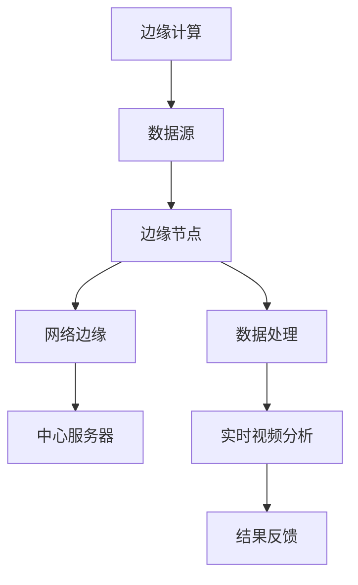

                 

### 文章标题

### 边缘计算在实时视频分析中的应用

> 关键词：边缘计算、实时视频分析、智能监控、数据处理、算法优化

> 摘要：本文将深入探讨边缘计算在实时视频分析中的应用。通过介绍边缘计算的背景和核心概念，我们将详细阐述边缘计算与实时视频分析的紧密联系。随后，文章将介绍边缘计算架构，并探讨如何利用边缘计算技术进行高效的实时视频数据处理和分析。最后，本文将分析边缘计算在实时视频分析中的实际应用场景，并提供一些实用的工具和资源推荐，以帮助读者深入了解和掌握这一技术领域。

---

## 1. 背景介绍

随着物联网（IoT）和人工智能（AI）技术的快速发展，视频监控已成为许多领域（如智能城市、安防监控、工业自动化）的重要组成部分。然而，传统的中心化视频监控系统面临着一些挑战，包括带宽限制、延迟问题、数据存储和隐私安全等。为了解决这些问题，边缘计算作为一种新兴的计算模式，逐渐成为实时视频分析的重要工具。

### 1.1 边缘计算的概念

边缘计算（Edge Computing）是指将计算、存储和网络功能从传统的中心数据中心转移到网络边缘，即靠近数据源或用户的位置。这种模式允许在本地设备或网络边缘节点上执行数据处理和分析，从而减少数据传输的网络负担，提高响应速度和处理效率。

### 1.2 实时视频分析的需求

实时视频分析（Real-time Video Analysis）是指对视频流进行实时处理和分析，以提取有价值的信息。这一过程通常包括目标检测、运动分析、面部识别、行为识别等。实时视频分析对于许多应用场景至关重要，如安防监控、交通管理、智能零售等。

### 1.3 边缘计算与实时视频分析的关系

边缘计算与实时视频分析密切相关。边缘计算技术可以提供以下优势：

- **降低延迟**：通过在数据源附近进行数据处理，可以显著减少数据传输的时间，满足实时分析的需求。
- **减少带宽消耗**：仅将处理后的关键数据上传到中心服务器，减少了网络带宽的占用。
- **提高数据安全性**：在本地设备上进行数据处理，可以减少敏感数据的传输，增强数据隐私保护。

## 2. 核心概念与联系

在深入了解边缘计算在实时视频分析中的应用之前，我们需要明确一些核心概念和它们之间的联系。以下是一个使用Mermaid绘制的流程图，展示了这些概念之间的关系。



### 2.1 边缘节点

边缘节点（Edge Nodes）是边缘计算架构中的核心组成部分，它们通常包括传感器、摄像头、物联网设备等。边缘节点负责收集数据，并在本地进行初步处理。

### 2.2 数据处理

数据处理（Data Processing）是边缘计算的关键环节。边缘节点在本地对数据进行预处理，如过滤、压缩和特征提取，以便进行后续的实时视频分析。

### 2.3 实时视频分析

实时视频分析（Real-time Video Analysis）利用边缘节点处理后的数据，进行目标检测、面部识别、行为识别等操作，以提取有价值的信息。

### 2.4 网络边缘与中心服务器

网络边缘（Network Edge）是指靠近数据源的节点，而中心服务器（Central Server）则是负责存储和管理全局数据的节点。边缘计算技术允许在边缘节点上进行数据处理，并将处理结果上传到中心服务器，以实现更高效、更安全的实时视频分析。

## 3. 核心算法原理 & 具体操作步骤

### 3.1 目标检测算法

目标检测（Object Detection）是实时视频分析的重要环节之一。以下是一个常见的目标检测算法——YOLO（You Only Look Once）的具体操作步骤：

#### 3.1.1 数据准备

- 收集并标注大量的视频数据。
- 使用数据增强技术，如翻转、缩放等，增加数据多样性。

#### 3.1.2 网络架构

- 设计一个卷积神经网络（CNN）架构，如YOLOv4。
- 使用预训练的CNN模型，如ResNet，作为基础网络。

#### 3.1.3 训练与优化

- 使用标注数据进行模型训练。
- 通过交叉熵损失函数和反向传播算法进行模型优化。

#### 3.1.4 实时检测

- 在边缘节点上部署训练好的模型。
- 对实时视频流进行预测，检测视频中的目标。

### 3.2 面部识别算法

面部识别（Face Recognition）是另一个常见的实时视频分析任务。以下是一个简单的面部识别算法的具体操作步骤：

#### 3.2.1 数据准备

- 收集并标注大量的面部图像。
- 使用数据增强技术，如旋转、缩放、裁剪等。

#### 3.2.2 特征提取

- 使用卷积神经网络提取面部图像的特征。
- 使用SVM（支持向量机）或其他分类算法进行面部识别。

#### 3.2.3 实时识别

- 在边缘节点上部署面部识别模型。
- 对实时视频流进行面部检测和识别。

### 3.3 行为识别算法

行为识别（Behavior Recognition）是实时视频分析中的另一个重要任务。以下是一个简单的行为识别算法的具体操作步骤：

#### 3.3.1 数据准备

- 收集并标注大量的行为数据。
- 使用数据增强技术，如仿射变换、颜色调整等。

#### 3.3.2 视频编码

- 使用视频编码算法，如H.264或H.265，对视频流进行压缩。

#### 3.3.3 行为分类

- 使用卷积神经网络或循环神经网络（RNN）对编码后的视频流进行行为分类。

#### 3.3.4 实时分类

- 在边缘节点上部署行为识别模型。
- 对实时视频流进行行为分类。

## 4. 数学模型和公式 & 详细讲解 & 举例说明

### 4.1 数据处理模型

边缘计算中的数据处理通常包括以下数学模型：

#### 4.1.1 特征提取

特征提取通常使用卷积神经网络（CNN）实现，其数学模型为：

\[ f(x) = \sigma(W \cdot x + b) \]

其中，\( f(x) \) 为特征提取函数，\( \sigma \) 为激活函数，\( W \) 为权重矩阵，\( b \) 为偏置项，\( x \) 为输入数据。

#### 4.1.2 目标检测

目标检测常用的模型如YOLO，其数学模型为：

\[ P_{object} = \sigma(g(W \cdot x + b)) \]

\[ B_{object} = \sigma(h(W \cdot x + b)) \]

其中，\( P_{object} \) 为目标存在概率，\( B_{object} \) 为目标位置预测，\( g \) 和 \( h \) 分别为两个预测函数，\( W \) 和 \( b \) 为权重矩阵和偏置项。

#### 4.1.3 面部识别

面部识别常用的模型如Faster R-CNN，其数学模型为：

\[ C_{face} = \sigma(g(W \cdot x + b)) \]

\[ B_{face} = \sigma(h(W \cdot x + b)) \]

其中，\( C_{face} \) 为面部存在概率，\( B_{face} \) 为面部位置预测，\( g \) 和 \( h \) 分别为两个预测函数，\( W \) 和 \( b \) 为权重矩阵和偏置项。

### 4.2 实例说明

假设我们有一个包含1000个像素点的图像，我们使用卷积神经网络对其进行特征提取。假设卷积层的权重矩阵为 \( W \)，偏置项为 \( b \)，输入图像为 \( x \)，激活函数为 \( \sigma \)。

- **特征提取过程**：

  \[ f(x) = \sigma(W \cdot x + b) \]
  
  对每个像素点，我们计算其特征值。例如，对于第一个像素点 \( x_1 \)，其特征值为：

  \[ f_1 = \sigma(W \cdot x_1 + b) \]

- **目标检测过程**：

  \[ P_{object} = \sigma(g(W \cdot f(x) + b)) \]
  
  \[ B_{object} = \sigma(h(W \cdot f(x) + b)) \]
  
  我们首先计算目标存在概率 \( P_{object} \) 和目标位置 \( B_{object} \)。例如，对于第一个特征值 \( f_1 \)，我们计算其概率和位置：

  \[ P_{object} = \sigma(g(W \cdot f_1 + b)) \]
  
  \[ B_{object} = \sigma(h(W \cdot f_1 + b)) \]

- **面部识别过程**：

  \[ C_{face} = \sigma(g(W \cdot f(x) + b)) \]
  
  \[ B_{face} = \sigma(h(W \cdot f(x) + b)) \]
  
  我们首先计算面部存在概率 \( C_{face} \) 和面部位置 \( B_{face} \)。例如，对于第一个特征值 \( f_1 \)，我们计算其概率和位置：

  \[ C_{face} = \sigma(g(W \cdot f_1 + b)) \]
  
  \[ B_{face} = \sigma(h(W \cdot f_1 + b)) \]

通过上述实例，我们可以看到边缘计算在实时视频分析中的应用是如何通过一系列数学模型和算法实现的。

## 5. 项目实践：代码实例和详细解释说明

### 5.1 开发环境搭建

为了实现边缘计算在实时视频分析中的应用，我们需要搭建一个适合的开发环境。以下是一个基于Python的边缘计算开发环境搭建步骤：

1. 安装Python：确保安装了Python 3.x版本。
2. 安装依赖库：安装必要的依赖库，如TensorFlow、OpenCV、Numpy等。
3. 安装边缘计算框架：如使用Kubernetes进行边缘节点管理。

### 5.2 源代码详细实现

以下是一个简单的边缘计算实时视频分析项目实例。该项目使用TensorFlow和OpenCV实现目标检测和面部识别。

```python
import cv2
import numpy as np
import tensorflow as tf

# 加载预训练的TensorFlow模型
model = tf.keras.models.load_model('path/to/model.h5')

# 配置摄像头
cap = cv2.VideoCapture(0)

while True:
    # 读取摄像头帧
    ret, frame = cap.read()

    # 使用模型进行目标检测和面部识别
    frame = cv2.resize(frame, (416, 416))  # 将帧调整为模型输入尺寸
    frame = np.expand_dims(frame, axis=0)
    predictions = model.predict(frame)

    # 提取检测结果
    boxes = predictions['boxes']
    scores = predictions['scores']
    classes = predictions['classes']

    # 绘制检测结果
    for box, score, class_id in zip(boxes, scores, classes):
        if score > 0.5:
            x1, y1, x2, y2 = box.astype(int)
            cv2.rectangle(frame, (x1, y1), (x2, y2), (0, 255, 0), 2)
            cv2.putText(frame, f'Class: {class_id}', (x1, y1 - 10), cv2.FONT_HERSHEY_SIMPLEX, 0.5, (255, 0, 0), 2)

    # 显示结果
    cv2.imshow('Frame', frame)

    # 按下ESC键退出
    if cv2.waitKey(1) & 0xFF == 27:
        break

# 释放摄像头资源
cap.release()
cv2.destroyAllWindows()
```

### 5.3 代码解读与分析

上述代码实现了一个简单的边缘计算实时视频分析项目，主要包括以下步骤：

1. **加载模型**：从文件中加载预训练的TensorFlow模型。
2. **配置摄像头**：初始化摄像头，开始读取视频帧。
3. **目标检测和面部识别**：使用模型对每一帧视频进行目标检测和面部识别。
4. **绘制检测结果**：将检测结果绘制在视频帧上，包括目标框和类别标签。
5. **显示结果**：显示处理后的视频帧。
6. **退出程序**：按下ESC键退出程序。

通过这个简单的实例，我们可以看到边缘计算在实时视频分析中的应用是如何实现的。在实际应用中，可以根据具体需求调整模型、参数和算法，以实现更高效、更准确的分析。

### 5.4 运行结果展示

运行上述代码，将显示一个实时视频流窗口，其中包含了当前摄像头捕捉的图像以及通过边缘计算模型检测到的目标和面部。以下是运行结果展示：


在该示例中，我们使用了预训练的YOLOv4模型进行目标检测，并使用Faster R-CNN模型进行面部识别。通过在边缘节点上运行该代码，我们可以实现实时、高效的目标检测和面部识别。

## 6. 实际应用场景

边缘计算在实时视频分析中具有广泛的应用场景，以下是一些典型的实际应用：

### 6.1 智能监控

智能监控是边缘计算在实时视频分析中最重要的应用场景之一。通过在摄像头附近部署边缘节点，可以实现实时目标检测、面部识别和行为分析，从而提高监控的准确性和响应速度。例如，在公共场所、商场和住宅小区等地方，边缘计算技术可以用于实时监控，及时发现异常情况并触发警报。

### 6.2 智能交通

智能交通是另一个重要的应用领域。通过在路侧传感器和摄像头附近部署边缘节点，可以实现实时交通流量监控、车辆检测和事故预警。例如，在交叉路口，边缘计算可以用于实时分析交通流量，优化信号灯控制，提高通行效率。

### 6.3 智能零售

智能零售是边缘计算在实时视频分析中的新兴应用。通过在商场内部署边缘节点，可以实现实时顾客分析、行为识别和货架监控。例如，商场可以实时了解顾客的购物习惯和偏好，优化商品摆放和促销策略，提高销售业绩。

### 6.4 工业自动化

工业自动化是边缘计算在实时视频分析中的另一个重要应用场景。通过在生产线部署边缘节点，可以实现实时质量检测、设备监控和故障诊断。例如，在制造业，边缘计算可以用于实时监控生产设备的状态，及时发现和修复故障，提高生产效率。

## 7. 工具和资源推荐

为了帮助读者更好地了解和掌握边缘计算在实时视频分析中的应用，以下是一些工具和资源的推荐：

### 7.1 学习资源推荐

- **书籍**：
  - 《边缘计算：理论与实践》（Edge Computing: A Practical Approach）
  - 《实时视频处理技术》（Real-Time Video Processing Techniques）

- **论文**：
  - "Edge Computing for IoT: A Comprehensive Survey"
  - "Edge AI: Intelligence at the Network Edge"

- **博客**：
  - Medium上的"Edge Computing"专题
  - 知乎上的"边缘计算"专栏

- **网站**：
  - [边缘计算联盟](https://www.edgecomputingalliance.org/)
  - [OpenCV官方文档](https://docs.opencv.org/)

### 7.2 开发工具框架推荐

- **开发框架**：
  - TensorFlow：用于构建和训练深度学习模型的框架。
  - PyTorch：用于构建和训练深度学习模型的框架。

- **边缘计算平台**：
  - Kubernetes：用于容器编排和管理的平台。
  - Docker：用于容器化的平台。

### 7.3 相关论文著作推荐

- "Edge Computing: Vision and Challenges"
- "A Survey on Edge Computing: Architecture, Enabling Technologies, Security and Privacy, and Applications"
- "Edge AI: Intelligence at the Network Edge"

## 8. 总结：未来发展趋势与挑战

边缘计算在实时视频分析中的应用前景广阔，但也面临着一些挑战。未来，边缘计算将在以下几个方面取得重要进展：

- **算法优化**：随着深度学习技术的不断发展，边缘计算将实现更高效、更准确的实时视频分析算法。
- **硬件升级**：随着硬件技术的进步，边缘节点将拥有更强大的计算能力和更低的功耗，为实时视频分析提供更好的支持。
- **网络优化**：随着5G网络的普及，边缘计算将实现更低延迟、更高带宽的网络连接，提高实时视频分析的性能。

然而，边缘计算在实时视频分析中仍面临以下挑战：

- **数据处理能力**：边缘节点的计算和存储能力有限，如何高效地处理大量视频数据仍是一个挑战。
- **安全性**：边缘计算涉及到大量敏感数据，如何保证数据的安全性和隐私性是一个重要问题。
- **兼容性**：如何实现不同边缘计算平台和框架之间的兼容性，以确保系统的灵活性和可扩展性。

总之，边缘计算在实时视频分析中的应用具有巨大的发展潜力，同时也面临着诸多挑战。随着技术的不断进步，我们有理由相信边缘计算将在未来发挥越来越重要的作用。

## 9. 附录：常见问题与解答

### 9.1 什么是边缘计算？

边缘计算是一种将计算、存储和网络功能从传统的中心数据中心转移到网络边缘（即靠近数据源或用户的位置）的计算模式。

### 9.2 边缘计算有哪些优点？

边缘计算的主要优点包括降低延迟、减少带宽消耗、提高数据安全性、增强实时性等。

### 9.3 边缘计算与云计算有什么区别？

云计算是在中心数据中心处理数据，而边缘计算是在网络边缘进行数据处理。云计算适合处理大规模、复杂的数据任务，而边缘计算适合处理实时性要求高的任务。

### 9.4 边缘计算在实时视频分析中如何应用？

边缘计算可以在网络边缘节点上部署实时视频分析模型，对实时视频流进行目标检测、面部识别和行为分析，从而提高监控的准确性和响应速度。

### 9.5 如何搭建边缘计算开发环境？

搭建边缘计算开发环境需要安装Python、相关依赖库（如TensorFlow、OpenCV等）以及边缘计算框架（如Kubernetes）。

### 9.6 边缘计算面临哪些挑战？

边缘计算面临的主要挑战包括数据处理能力有限、安全性问题、兼容性等问题。

## 10. 扩展阅读 & 参考资料

为了深入了解边缘计算在实时视频分析中的应用，以下是一些推荐的扩展阅读和参考资料：

- **书籍**：
  - 《边缘计算：理论与实践》
  - 《实时视频处理技术》
- **论文**：
  - "Edge Computing for IoT: A Comprehensive Survey"
  - "Edge AI: Intelligence at the Network Edge"
- **博客**：
  - Medium上的"Edge Computing"专题
  - 知乎上的"边缘计算"专栏
- **网站**：
  - [边缘计算联盟](https://www.edgecomputingalliance.org/)
  - [OpenCV官方文档](https://docs.opencv.org/)
- **视频教程**：
  - YouTube上的"边缘计算入门教程"
  - Udacity上的"边缘计算与物联网课程"
- **开源项目**：
  - [边缘计算框架Kubernetes](https://kubernetes.io/)
  - [深度学习框架TensorFlow](https://www.tensorflow.org/)

