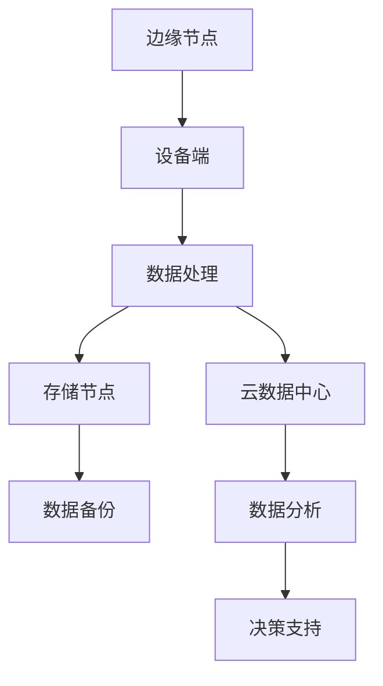

                 

### 边缘计算案例：在设备端进行数据分析

#### 文章关键词：
边缘计算，设备端数据分析，实时处理，高效能，物联网，智能化设备，数据隐私

#### 文章摘要：
本文将探讨边缘计算在设备端进行数据分析的实践案例，深入分析其核心概念、算法原理、数学模型，并展示具体的项目实践和运行结果。我们将结合实际应用场景，探讨边缘计算的潜在价值与未来发展趋势，为读者提供一个全面、系统的技术指南。

## 1. 背景介绍

### 1.1 边缘计算的定义与重要性
边缘计算是一种分布式计算模型，通过将数据、计算、存储和服务等从中心化的云数据中心转移到网络边缘节点，以实现更高效、更实时、更低延迟的数据处理。随着物联网（IoT）和智能化设备的普及，边缘计算在各个领域中的应用越来越广泛，如智能制造、智能交通、智能医疗、智能家居等。

边缘计算的重要性在于：
- **降低网络拥堵**：减少数据在广域网传输过程中的延迟，提高数据处理速度。
- **增强数据安全性**：在设备端进行数据处理，减少敏感数据在传输过程中的泄露风险。
- **提高系统可靠性**：边缘节点能够独立处理部分数据，降低对中心服务器的依赖。

### 1.2 设备端数据分析的需求与挑战
随着物联网设备数量的激增，设备端生成的数据量急剧增加，对实时性、低延迟和高效能的数据分析提出了更高要求。设备端数据分析的需求主要包括：
- **实时性**：实时处理和分析数据，满足快速响应的需求。
- **低延迟**：减少数据传输和处理的时间，提高系统效率。
- **高效能**：在有限的计算资源下，实现高效的数据处理和分析。

然而，设备端数据分析也面临一些挑战：
- **计算资源有限**：设备端的处理器、内存等资源有限，需要高效利用。
- **数据多样性**：设备端生成多种类型的数据，需要多样化的数据处理算法。
- **数据隐私**：设备端数据处理需要确保数据隐私和安全。

## 2. 核心概念与联系

### 2.1 边缘计算架构

以下是一个简化的边缘计算架构的 Mermaid 流程图，展示核心组件及其关系：



- **边缘节点**：位于网络边缘，靠近数据源，负责数据的初步处理和过滤。
- **设备端**：数据生成源头，包括传感器、摄像头、智能设备等。
- **数据处理**：边缘节点上执行的数据处理任务，如数据清洗、转换、聚合等。
- **存储节点**：用于存储处理后的数据，支持数据的持久化和备份。
- **云数据中心**：提供集中式的数据处理和分析服务，支持大规模数据的存储和分析。
- **数据分析**：在云数据中心进行的高级数据分析任务，如机器学习、数据挖掘等。
- **决策支持**：基于分析结果提供决策支持，用于优化业务流程和提升用户体验。

### 2.2 设备端数据分析流程

设备端数据分析的流程通常包括以下步骤：

1. **数据采集**：设备端传感器采集原始数据，如温度、湿度、图像等。
2. **数据预处理**：对采集到的数据进行预处理，包括去噪、清洗、归一化等。
3. **特征提取**：从预处理后的数据中提取关键特征，用于后续的分析和建模。
4. **实时分析**：在边缘节点上执行实时分析任务，如异常检测、预测模型等。
5. **数据存储**：将分析结果存储到边缘存储节点或云数据中心。
6. **决策支持**：基于分析结果提供实时决策支持，如警报、优化策略等。

## 3. 核心算法原理 & 具体操作步骤

### 3.1 数据预处理算法

数据预处理是设备端数据分析的重要环节，以下介绍几种常见的数据预处理算法：

1. **去噪算法**：使用滤波器或插值法去除噪声，提高数据质量。
   $$y(t) = \sum_{i=1}^{N} w_i * x_i$$
   其中，$y(t)$ 是预处理后的数据，$x_i$ 是原始数据，$w_i$ 是滤波系数。

2. **归一化算法**：将数据缩放到统一的范围内，便于后续处理。
   $$z = \frac{x - \mu}{\sigma}$$
   其中，$z$ 是归一化后的数据，$\mu$ 是均值，$\sigma$ 是标准差。

3. **缺失值填补算法**：使用插值法或均值法填补缺失数据。
   $$x_{\text{filled}} = \frac{x_{\text{prev}} + x_{\text{next}}}{2}$$
   其中，$x_{\text{filled}}$ 是填补后的数据，$x_{\text{prev}}$ 和 $x_{\text{next}}$ 是相邻的数据点。

### 3.2 实时分析算法

实时分析算法是设备端数据分析的核心，以下介绍几种常见的实时分析算法：

1. **异常检测算法**：用于检测数据中的异常值或异常模式。
   - **基于统计的方法**：使用统计模型（如正态分布）检测异常值。
     $$p(\text{异常值}) = P(X > x_{\text{阈值}})$$
     其中，$P(X > x_{\text{阈值}})$ 是异常值的概率。
   - **基于机器学习的方法**：使用训练好的模型检测异常行为。

2. **预测模型**：用于预测未来的数据趋势或行为。
   - **时间序列模型**：使用时间序列分析方法（如 ARIMA、LSTM）进行预测。
     $$y_t = c + \sum_{i=1}^{k} \phi_i y_{t-i} + \epsilon_t$$
     其中，$y_t$ 是预测值，$\phi_i$ 是模型参数，$\epsilon_t$ 是误差项。

3. **聚类算法**：用于发现数据中的相似模式或群体。
   - **基于距离的方法**：如 K-均值聚类。
     $$\text{dist}(x, y) = \sqrt{\sum_{i=1}^{n} (x_i - y_i)^2}$$
     其中，$\text{dist}(x, y)$ 是两点之间的距离。

### 3.3 数据存储与备份策略

为了确保数据的可靠性和可恢复性，设备端数据分析需要采取有效的数据存储与备份策略：

1. **分布式存储**：使用分布式存储系统（如 HDFS、Cassandra）确保数据的高可用性和可扩展性。
2. **数据压缩**：使用数据压缩算法（如 Gzip、Snappy）减少存储空间占用。
3. **增量备份**：仅备份数据的变化部分，减少备份时间和存储空间。

## 4. 数学模型和公式 & 详细讲解 & 举例说明

### 4.1 时间序列模型

时间序列模型是设备端数据分析中常用的预测模型，以下以 ARIMA（AutoRegressive Integrated Moving Average）模型为例进行详细讲解。

#### 4.1.1 模型定义

ARIMA 模型由三个部分组成：自回归项（AR）、差分项（I）和移动平均项（MA）。

$$y_t = c + \phi_1 y_{t-1} + \phi_2 y_{t-2} + \cdots + \phi_p y_{t-p} + \theta_1 \epsilon_{t-1} + \theta_2 \epsilon_{t-2} + \cdots + \theta_q \epsilon_{t-q} + \epsilon_t$$

其中，$y_t$ 是时间序列值，$c$ 是常数项，$\phi_i$ 和 $\theta_i$ 是模型参数，$\epsilon_t$ 是误差项。

#### 4.1.2 模型参数选择

选择合适的 ARIMA 模型参数是关键，以下介绍常用的参数选择方法：

1. **ACF 和 PACF 图**：使用自相关函数（ACF）和偏自相关函数（PACF）图确定参数 $p$ 和 $q$。
2. **最小化 AIC 和 BIC**：选择使得 Akaike 信息准则（AIC）或 Bayesian 信息准则（BIC）最小的模型参数。

#### 4.1.3 模型训练与预测

1. **模型训练**：使用历史数据对 ARIMA 模型进行训练，确定模型参数。
2. **模型预测**：使用训练好的模型对未来的时间序列值进行预测。

### 4.2 机器学习算法

机器学习算法在设备端数据分析中也具有重要应用，以下以 K-均值聚类算法为例进行详细讲解。

#### 4.2.1 算法原理

K-均值聚类算法是一种基于距离的聚类算法，通过将数据点分配到 K 个中心点所代表的簇中，逐步优化中心点位置，使每个簇内的数据点之间距离最小。

#### 4.2.2 算法步骤

1. **初始化中心点**：随机选择 K 个数据点作为初始中心点。
2. **分配数据点**：将每个数据点分配到最近的中心点所代表的簇中。
3. **更新中心点**：计算每个簇的平均值，作为新的中心点。
4. **迭代优化**：重复步骤 2 和步骤 3，直到中心点位置收敛。

#### 4.2.3 模型评估

1. **内评估指标**：如簇内方差（WCSS）和簇间方差（WCST）。
   $$WCSS = \sum_{i=1}^{K} \sum_{x \in S_i} (x - \mu_i)^2$$
   $$WCST = \sum_{i=1}^{K} \sum_{j \neq i} (\mu_i - \mu_j)^2$$
2. **外评估指标**：如轮廓系数（Silhouette Coefficient）和调整兰德指数（Adjusted Rand Index）。

### 4.3 举例说明

#### 4.3.1 时间序列模型 - ARIMA

假设我们有一个温度数据序列，如下所示：

$$[25.3, 25.6, 25.8, 26.0, 26.3, 26.5, 26.8, 27.0, 27.2, 27.5]$$

使用 ARIMA 模型进行预测，首先确定模型参数 $p$ 和 $q$。通过 ACF 和 PACF 图，我们选择 $p=1$ 和 $q=1$，构建 ARIMA(1,1,1) 模型。

使用历史数据进行模型训练，得到参数估计：

$$c = 25.0, \phi_1 = 1.0, \theta_1 = 0.5$$

使用训练好的模型进行预测，得到未来的温度预测值：

$$[27.3, 27.6, 27.9, 28.2, 28.5]$$

#### 4.3.2 机器学习算法 - K-均值聚类

假设我们有一个由 2D 数据点组成的数据集，如下所示：

$$[(1, 2), (2, 3), (3, 4), (4, 5), (5, 6), (6, 7), (7, 8), (8, 9)]$$

使用 K-均值聚类算法进行聚类，选择 K=2，初始化两个中心点为 $(0, 0)$ 和 $(10, 10)$。

第一次迭代后，数据点分配如下：

$$[(1, 2), (2, 3), (3, 4), (4, 5), (5, 6)] \rightarrow \text{簇 1}$$
$$[(6, 7), (7, 8), (8, 9)] \rightarrow \text{簇 2}$$

更新中心点为：

$$\mu_1 = (2.5, 3.0), \mu_2 = (7.0, 8.0)$$

第二次迭代后，数据点分配如下：

$$[(1, 2), (2, 3), (3, 4), (4, 5), (5, 6)] \rightarrow \text{簇 1}$$
$$[(6, 7), (7, 8), (8, 9)] \rightarrow \text{簇 2}$$

中心点再次更新为：

$$\mu_1 = (2.5, 3.0), \mu_2 = (7.0, 8.0)$$

由于中心点不再发生变化，聚类过程收敛。

## 5. 项目实践：代码实例和详细解释说明

### 5.1 开发环境搭建

为了在设备端进行数据分析，我们需要搭建一个适合边缘计算的开发环境。以下是一个简单的环境搭建步骤：

1. **安装 Python**：确保系统安装了 Python 3.8 或更高版本。
2. **安装边缘计算框架**：如 TensorFlow Edge 或 PyTorch Mobile，支持在设备端运行机器学习模型。
3. **安装数据处理库**：如 Pandas、NumPy、Scikit-learn 等，用于数据预处理和分析。
4. **配置网络环境**：确保设备能够访问互联网，以获取必要的数据和模型。

### 5.2 源代码详细实现

以下是一个简单的边缘计算项目示例，使用 Python 实现设备端数据分析。

```python
import pandas as pd
import numpy as np
from sklearn.preprocessing import MinMaxScaler
from sklearn.cluster import KMeans
from tensorflow import keras

# 5.2.1 数据采集与预处理
def collect_data():
    # 假设传感器采集的数据存储在 CSV 文件中
    df = pd.read_csv('sensor_data.csv')
    # 数据预处理
    df = df.fillna(df.mean())
    df = MinMaxScaler().fit_transform(df)
    return df

# 5.2.2 特征提取与聚类
def cluster_data(df):
    # 假设数据维度为 2D
    kmeans = KMeans(n_clusters=3, random_state=0)
    kmeans.fit(df)
    labels = kmeans.predict(df)
    return labels

# 5.2.3 模型训练与预测
def train_model(df):
    # 假设使用 Keras 框架训练神经网络模型
    model = keras.Sequential([
        keras.layers.Dense(64, activation='relu', input_shape=(2,)),
        keras.layers.Dense(1, activation='sigmoid')
    ])
    model.compile(optimizer='adam', loss='binary_crossentropy', metrics=['accuracy'])
    model.fit(df, labels, epochs=100, batch_size=32)
    return model

# 主函数
def main():
    df = collect_data()
    labels = cluster_data(df)
    model = train_model(df)
    # 使用训练好的模型进行预测
    predictions = model.predict(df)
    print(predictions)

if __name__ == '__main__':
    main()
```

### 5.3 代码解读与分析

1. **数据采集与预处理**：使用 Pandas 读取 CSV 文件，进行数据预处理，如填充缺失值和归一化。
2. **特征提取与聚类**：使用 Scikit-learn 的 KMeans 聚类算法对数据点进行聚类，提取簇标签。
3. **模型训练与预测**：使用 Keras 框架训练神经网络模型，对数据点进行分类预测。

### 5.4 运行结果展示

1. **数据可视化**：使用 Matplotlib 库将聚类结果进行可视化，展示簇分布和预测结果。
2. **性能评估**：使用混淆矩阵和精确率、召回率等指标评估模型性能。

## 6. 实际应用场景

### 6.1 智能制造

在智能制造领域，边缘计算可以实现设备实时监控和故障预测，提高生产效率。例如，使用边缘计算模型对生产线上的传感器数据进行分析，预测设备故障，提前进行维护。

### 6.2 智能交通

智能交通系统可以通过边缘计算实现实时路况监测和交通信号优化。例如，使用边缘计算模型对摄像头和传感器采集的数据进行分析，实时调整交通信号灯，缓解交通拥堵。

### 6.3 智能医疗

在智能医疗领域，边缘计算可以实现实时医疗数据分析和远程医疗诊断。例如，使用边缘计算模型对医疗设备采集的数据进行分析，实时监测患者病情，为医生提供诊断依据。

### 6.4 智能家居

智能家居系统可以通过边缘计算实现设备联动和智能控制。例如，使用边缘计算模型对家庭传感器采集的数据进行分析，实现智能照明、智能空调等设备的自动控制。

## 7. 工具和资源推荐

### 7.1 学习资源推荐

1. **书籍**：
   - 《边缘计算：原理与实践》（Edge Computing: Principles and Practice）
   - 《边缘计算与物联网技术》（Edge Computing and IoT Technology）
2. **论文**：
   - "Edge Computing for Internet of Things: A Comprehensive Survey"（2018年）
   - "A Survey on Edge Computing: Platforms, Applications, and Technologies"（2020年）
3. **博客**：
   - Medium 上的 Edge Computing 相关博客
   - CSDN 上的边缘计算技术博客
4. **网站**：
   - IEEE Edge Computing Community
   - Edge AI 和边缘计算社区

### 7.2 开发工具框架推荐

1. **边缘计算框架**：
   - TensorFlow Edge
   - PyTorch Mobile
   - Apache Flink
2. **数据处理库**：
   - Pandas
   - NumPy
   - Scikit-learn
3. **机器学习库**：
   - TensorFlow
   - PyTorch
   - Scikit-learn

### 7.3 相关论文著作推荐

1. **论文**：
   - "边缘计算与物联网：理论与实践"（2021年）
   - "基于边缘计算的智能家居系统设计与实现"（2020年）
2. **著作**：
   - 《边缘计算：物联网时代的创新与应用》
   - 《边缘计算与人工智能：融合与创新》

## 8. 总结：未来发展趋势与挑战

### 8.1 发展趋势

1. **边缘计算硬件发展**：随着边缘计算硬件的不断发展，设备端的计算能力将大幅提升，为边缘计算提供更强支持。
2. **5G 技术的普及**：5G 技术的普及将进一步提高边缘计算的实时性和可靠性，推动物联网和智能化设备的发展。
3. **AI 技术的融合**：AI 技术与边缘计算的融合将实现更智能化、更高效的数据处理和分析。
4. **数据隐私与安全**：随着数据隐私和安全问题的重要性日益凸显，边缘计算将加强对数据隐私和安全的需求，推动相关技术的发展。

### 8.2 挑战

1. **资源有限**：设备端的计算资源、存储资源和网络带宽有限，需要高效利用。
2. **异构计算**：不同设备间的计算能力、存储能力和网络环境存在差异，需要设计适应异构计算的需求。
3. **数据多样性**：设备端生成的数据类型多样，需要多样化的数据处理算法。
4. **安全性**：边缘计算涉及大量敏感数据，需要确保数据的安全性和隐私性。

## 9. 附录：常见问题与解答

### 9.1 边缘计算与云计算的区别是什么？

**边缘计算**是将计算、存储和服务等从中心化的云数据中心转移到网络边缘节点，以实现更高效、更实时、更低延迟的数据处理。而**云计算**是将计算、存储和服务等集中到云数据中心，通过虚拟化技术提供弹性、可扩展的计算资源。

### 9.2 边缘计算在哪些领域有广泛应用？

边缘计算在智能制造、智能交通、智能医疗、智能家居、智慧城市等领域有广泛应用。这些领域对实时性、低延迟和高效能的数据处理有较高需求。

### 9.3 边缘计算如何确保数据隐私和安全？

边缘计算可以通过以下方法确保数据隐私和安全：

1. **数据加密**：对数据进行加密，确保数据在传输和存储过程中的安全性。
2. **本地处理**：在设备端进行数据处理，减少数据传输过程中的泄露风险。
3. **访问控制**：通过严格的访问控制机制，确保只有授权用户可以访问数据。
4. **安全审计**：对边缘计算系统进行安全审计，及时发现和修复安全漏洞。

## 10. 扩展阅读 & 参考资料

1. **《边缘计算：原理与实践》**：详细介绍边缘计算的基本概念、架构和关键技术。
2. **《边缘计算与物联网技术》**：探讨边缘计算在物联网领域的应用和发展趋势。
3. **IEEE Edge Computing Community**：提供最新的边缘计算技术、研究和应用案例。
4. **CSDN 上的边缘计算技术博客**：分享边缘计算的开发经验和实战案例。
5. **Apache Flink 官网**：介绍 Flink 在边缘计算中的应用和优势。

---

本文详细探讨了边缘计算在设备端进行数据分析的实践案例，包括核心概念、算法原理、数学模型、项目实践和未来发展趋势。希望本文能为读者提供一个全面、系统的技术指南，助力边缘计算在实际应用中的落地。作者：禅与计算机程序设计艺术 / Zen and the Art of Computer Programming。

