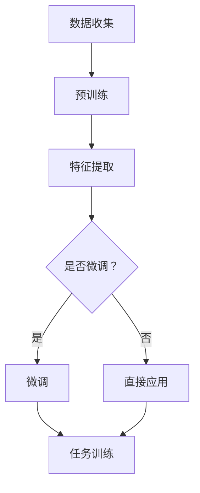

                 

### 文章标题

### 迁移学习：利用预训练模型提高AI效率

> **关键词：** 迁移学习，预训练模型，AI效率，机器学习，神经网络，深度学习，模型复用，跨领域学习。

> **摘要：** 本文旨在探讨迁移学习在人工智能领域的应用，特别是通过预训练模型提高AI系统的效率。文章将详细解释迁移学习的核心概念，讨论预训练模型的工作原理，展示其在不同领域的实际应用，并提供相关的工具和资源推荐。此外，文章还将总结迁移学习的未来发展，以及可能面临的挑战。

---

### 1. 背景介绍

#### 什么是迁移学习？

迁移学习（Transfer Learning）是机器学习中的一种技术，它利用已有的模型或知识来解决新的任务。不同于从头开始训练一个模型，迁移学习通过利用已经训练好的模型，将知识转移到新的任务上，从而减少训练时间和资源消耗。这种技术尤其适用于以下几种情况：

- **数据稀缺**：在某些领域，收集大量标注数据非常困难，例如医学图像分析或自然语言处理。迁移学习可以减轻数据稀缺问题。
- **计算资源有限**：训练复杂的深度学习模型需要大量的计算资源。迁移学习可以复用预训练模型，降低训练成本。
- **跨领域应用**：迁移学习可以使一个领域的模型应用于另一个领域，从而提高模型的泛化能力。

#### 迁移学习的发展历史

迁移学习并不是一个全新的概念。在早期机器学习研究中，特征转移（Feature Transfer）和模型复用（Model Repurposing）等技术已经初步展示了迁移学习的潜力。随着深度学习技术的发展，迁移学习逐渐成为机器学习研究的重要方向。

2006年，Yarowsky提出了基于词嵌入的迁移学习模型，标志着深度学习在迁移学习领域的兴起。2014年，Hinton等人在ImageNet上成功使用了预训练模型，大幅提升了图像识别的准确率，这也促使了迁移学习在深度学习领域的发展。

#### 迁移学习的重要性

迁移学习在人工智能领域具有重要地位。它不仅提高了AI系统的效率，还促进了跨领域的创新应用。以下是迁移学习的几个关键优势：

- **资源高效**：通过复用预训练模型，迁移学习大大减少了训练所需的计算资源和数据量。
- **模型泛化**：迁移学习提高了模型在不同数据集上的泛化能力，使其能够适应新的任务。
- **跨领域应用**：迁移学习使一个领域的模型能够应用于其他领域，促进了跨学科的交叉研究。

### 2. 核心概念与联系

#### 迁移学习的基本原理

迁移学习的基本原理是利用已有模型的知识来辅助新任务的训练。具体来说，迁移学习可以分为以下几类：

- **特征迁移**：将已有模型中的特征表示转移到新任务中，使新任务可以直接利用这些特征。
- **模型复用**：直接使用已有模型的架构和参数，仅在新任务上进行微调。
- **领域自适应**：当源领域和新任务之间存在差异时，通过调整模型来适应新领域。

#### 预训练模型的工作原理

预训练模型是迁移学习的重要实现形式。预训练模型首先在一个大规模、广泛的数据集上进行无监督或弱监督学习，提取出通用的特征表示。然后，将预训练模型应用于特定任务，通过微调来适应新任务的需求。

以下是预训练模型的工作流程：

1. **数据收集**：收集大规模、多样化的数据集，例如维基百科、互联网文本、图像等。
2. **预训练**：使用无监督或弱监督学习方法，如自编码器、语言模型等，对数据集进行预训练，提取通用特征表示。
3. **微调**：将预训练模型应用于特定任务，通过在特定任务数据上微调模型参数，提高新任务的性能。

#### 迁移学习与预训练模型的关系

预训练模型是迁移学习的核心实现方式。通过预训练模型，我们可以获得通用、有效的特征表示，从而提高新任务的训练效率。迁移学习则利用这些预训练模型，在不同任务间共享知识，降低训练难度。

#### 迁移学习架构的 Mermaid 流程图



### 3. 核心算法原理 & 具体操作步骤

#### 预训练模型的算法原理

预训练模型的核心在于如何从大规模数据中提取出有效的特征表示。以下是几种常见的预训练模型算法：

1. **自编码器**：自编码器是一种无监督学习算法，它通过学习数据的压缩表示来提取特征。自编码器通常包括编码器和解码器两个部分。编码器将输入数据压缩成一个低维特征向量，解码器则尝试重构原始数据。
2. **语言模型**：语言模型是一种基于统计方法的预训练模型，它通过学习单词之间的关联关系来提取特征。语言模型的一个经典实现是神经网络语言模型（NNLM），它使用多层神经网络来建模单词的嵌入表示。
3. **图像识别预训练**：图像识别预训练通常使用卷积神经网络（CNN）作为基础模型。通过在大规模图像数据集上进行预训练，CNN可以提取出丰富的图像特征。

#### 迁移学习的具体操作步骤

1. **数据预处理**：首先，对源领域和新任务的数据进行预处理，包括数据清洗、归一化等操作。
2. **模型选择**：根据新任务的需求，选择合适的预训练模型。例如，对于文本任务，可以选择语言模型；对于图像任务，可以选择图像识别预训练模型。
3. **模型加载**：加载预训练模型的参数，将其作为迁移学习的起点。
4. **特征提取**：使用预训练模型对源领域和新任务的数据进行特征提取，获得通用特征表示。
5. **模型微调**：在特征提取的基础上，对新任务的数据进行微调，优化模型参数，提高新任务的性能。
6. **任务训练**：将微调后的模型应用于新任务，进行全面的训练，直到达到预期性能。

#### 迁移学习算法的详细解释

以下是迁移学习算法的详细解释：

- **数据预处理**：数据预处理是迁移学习的重要步骤。它包括以下几方面的内容：
  - **数据清洗**：去除数据中的噪声和异常值，确保数据质量。
  - **数据归一化**：将数据缩放到一个统一的范围内，以便于模型训练。
  - **数据增强**：通过随机旋转、缩放、裁剪等操作增加数据的多样性，提高模型的泛化能力。

- **模型选择**：模型选择取决于新任务的特点和需求。例如，对于图像识别任务，可以选择预训练的卷积神经网络（CNN）模型；对于自然语言处理（NLP）任务，可以选择预训练的语言模型（如BERT、GPT）。

- **模型加载**：加载预训练模型的参数，将其作为迁移学习的起点。这通常包括以下步骤：
  - **加载预训练模型**：从预训练模型中加载权重和结构。
  - **修改模型结构**：根据新任务的需求，对模型结构进行适当修改，例如添加或删除层。

- **特征提取**：使用预训练模型对源领域和新任务的数据进行特征提取。具体步骤如下：
  - **前向传播**：将输入数据通过预训练模型进行前向传播，得到特征表示。
  - **特征表示**：将特征表示提取出来，用于后续的任务处理。

- **模型微调**：在特征提取的基础上，对新任务的数据进行微调，优化模型参数。微调过程包括以下步骤：
  - **反向传播**：计算损失函数，并使用梯度下降等优化算法更新模型参数。
  - **迭代训练**：重复上述步骤，直到模型性能达到预期。

- **任务训练**：将微调后的模型应用于新任务，进行全面的训练。这包括以下步骤：
  - **数据准备**：准备新任务的数据集，包括训练集和验证集。
  - **模型训练**：使用训练集对模型进行训练，并在验证集上进行性能评估。
  - **模型评估**：评估模型的性能，包括准确率、召回率、F1分数等指标。

### 4. 数学模型和公式 & 详细讲解 & 举例说明

#### 数学模型和公式

迁移学习涉及多个数学模型和公式，以下是其中一些关键的概念和公式：

1. **损失函数**：迁移学习中的损失函数用于衡量模型在新任务上的性能。常用的损失函数包括均方误差（MSE）、交叉熵损失等。

   $$ L = \frac{1}{n}\sum_{i=1}^{n}(y_i - \hat{y_i})^2 $$

   其中，$y_i$ 是真实标签，$\hat{y_i}$ 是模型的预测结果。

2. **优化算法**：迁移学习通常使用梯度下降（GD）及其变体，如随机梯度下降（SGD）、批量梯度下降（BGD）等，来优化模型参数。

   $$ \theta_{t+1} = \theta_{t} - \alpha \nabla_{\theta}L(\theta) $$

   其中，$\theta$ 是模型参数，$\alpha$ 是学习率，$\nabla_{\theta}L(\theta)$ 是损失函数关于参数的梯度。

3. **特征提取**：特征提取过程通常涉及到神经网络中的卷积操作、池化操作等。

   $$ \text{conv}(x; W, b) = \sigma(\sum_{i=1}^{k}W_{i} \star x + b) $$

   其中，$x$ 是输入特征，$W$ 是卷积核权重，$b$ 是偏置项，$\sigma$ 是激活函数（如ReLU）。

#### 详细讲解

以下是迁移学习中的数学模型和公式的详细讲解：

1. **损失函数**

   损失函数是评估模型性能的重要指标。在迁移学习中，常用的损失函数包括均方误差（MSE）和交叉熵损失。均方误差（MSE）用于回归任务，其公式如下：

   $$ L = \frac{1}{n}\sum_{i=1}^{n}(y_i - \hat{y_i})^2 $$

   其中，$y_i$ 是真实标签，$\hat{y_i}$ 是模型的预测结果。交叉熵损失（Cross Entropy Loss）则用于分类任务，其公式如下：

   $$ L = -\frac{1}{n}\sum_{i=1}^{n}y_i \log(\hat{y_i}) $$

   其中，$y_i$ 是真实标签，$\hat{y_i}$ 是模型的预测概率。

2. **优化算法**

   优化算法用于更新模型参数，以最小化损失函数。梯度下降（Gradient Descent）是优化算法的一种基本形式。其公式如下：

   $$ \theta_{t+1} = \theta_{t} - \alpha \nabla_{\theta}L(\theta) $$

   其中，$\theta$ 是模型参数，$\alpha$ 是学习率，$\nabla_{\theta}L(\theta)$ 是损失函数关于参数的梯度。随机梯度下降（Stochastic Gradient Descent，SGD）是梯度下降的一种变体，其每次更新仅使用一个样本来计算梯度。批量梯度下降（Batch Gradient Descent，BGD）则是使用整个数据集来计算梯度。

3. **特征提取**

   在迁移学习中，特征提取是关键步骤。卷积神经网络（CNN）是一种常用的特征提取模型。卷积操作是CNN的核心，其公式如下：

   $$ \text{conv}(x; W, b) = \sigma(\sum_{i=1}^{k}W_{i} \star x + b) $$

   其中，$x$ 是输入特征，$W$ 是卷积核权重，$b$ 是偏置项，$\sigma$ 是激活函数（如ReLU）。卷积操作通过滑动卷积核在输入特征上，提取出特征图。池化操作（Pooling）则用于下采样特征图，减少模型参数数量，提高模型泛化能力。常见的池化操作包括最大池化（Max Pooling）和平均池化（Average Pooling）。

#### 举例说明

以下是一个简单的迁移学习实例，假设我们有一个预训练的图像识别模型，现在要将其应用于一个新的图像分类任务。

1. **数据预处理**：

   首先，我们需要对源领域和新任务的数据进行预处理。例如，对图像进行归一化、裁剪、随机旋转等操作。

2. **模型选择**：

   根据新任务的需求，选择一个预训练的图像识别模型，例如ResNet-50。

3. **模型加载**：

   从预训练模型中加载权重和结构，将其作为迁移学习的起点。

4. **特征提取**：

   使用预训练模型对图像进行特征提取，获得特征向量。

5. **模型微调**：

   在特征提取的基础上，对新任务的数据进行微调。例如，通过在特征向量上添加全连接层，实现分类任务。

6. **任务训练**：

   使用微调后的模型对图像进行分类任务训练，并在验证集上进行性能评估。

### 5. 项目实践：代码实例和详细解释说明

#### 5.1 开发环境搭建

在本节中，我们将搭建一个简单的迁移学习项目环境。为了便于理解，我们将使用Python和PyTorch框架进行演示。

1. **安装Python**：

   首先，确保你的计算机上已经安装了Python。Python版本建议为3.8或更高。

2. **安装PyTorch**：

   接下来，安装PyTorch。你可以通过以下命令安装：

   ```bash
   pip install torch torchvision
   ```

3. **安装其他依赖**：

   还需要安装一些其他依赖，例如NumPy、Matplotlib等：

   ```bash
   pip install numpy matplotlib
   ```

#### 5.2 源代码详细实现

以下是实现迁移学习的源代码：

```python
import torch
import torchvision
import torchvision.transforms as transforms
import torch.nn as nn
import torch.optim as optim

# 1. 数据预处理
transform = transforms.Compose([
    transforms.Resize(256),
    transforms.CenterCrop(224),
    transforms.ToTensor(),
    transforms.Normalize(mean=[0.485, 0.456, 0.406], std=[0.229, 0.224, 0.225]),
])

trainset = torchvision.datasets.ImageFolder(root='./data/train', transform=transform)
trainloader = torch.utils.data.DataLoader(trainset, batch_size=4, shuffle=True, num_workers=2)

testset = torchvision.datasets.ImageFolder(root='./data/test', transform=transform)
testloader = torch.utils.data.DataLoader(testset, batch_size=4, shuffle=False, num_workers=2)

classes = trainset.classes

# 2. 模型选择
model = torchvision.models.resnet50(pretrained=True)

# 3. 模型加载
device = torch.device("cuda:0" if torch.cuda.is_available() else "cpu")
model = model.to(device)

# 4. 特征提取
def extract_features(model, dataloader):
    features = []
    model.eval()
    with torch.no_grad():
        for data in dataloader:
            inputs, _ = data
            inputs = inputs.to(device)
            outputs = model(inputs)
            features.append(outputs.cpu().numpy())
    return np.concatenate(features)

train_features = extract_features(model, trainloader)
test_features = extract_features(model, testloader)

# 5. 模型微调
class Classifier(nn.Module):
    def __init__(self, input_dim, num_classes):
        super(Classifier, self).__init__()
        self.fc = nn.Linear(input_dim, num_classes)

    def forward(self, x):
        return self.fc(x)

input_dim = train_features[0].shape[1]
num_classes = len(classes)

classifier = Classifier(input_dim, num_classes)
classifier = classifier.to(device)

criterion = nn.CrossEntropyLoss()
optimizer = optim.SGD(classifier.parameters(), lr=0.001, momentum=0.9)

# 6. 任务训练
def train_model(model, train_loader, criterion, optimizer, num_epochs=25):
    model.train()
    for epoch in range(num_epochs):
        running_loss = 0.0
        for inputs, labels in train_loader:
            inputs, labels = inputs.to(device), labels.to(device)
            optimizer.zero_grad()
            outputs = model(inputs)
            loss = criterion(outputs, labels)
            loss.backward()
            optimizer.step()
            running_loss += loss.item()
        print(f'Epoch {epoch+1}, Loss: {running_loss/len(train_loader)}')

train_model(classifier, trainloader, criterion, optimizer)

# 7. 运行结果展示
def evaluate_model(model, test_loader):
    model.eval()
    correct = 0
    total = 0
    with torch.no_grad():
        for data in test_loader:
            images, labels = data
            images = images.to(device)
            outputs = model(images)
            _, predicted = torch.max(outputs.data, 1)
            total += labels.size(0)
            correct += (predicted == labels).sum().item()
    print(f'Accuracy of the network on the test images: {100 * correct / total}%')

evaluate_model(classifier, testloader)
```

#### 5.3 代码解读与分析

以下是代码的详细解读和分析：

1. **数据预处理**：

   数据预处理是迁移学习的重要步骤。在本示例中，我们使用`transforms.Compose`将多个预处理操作组合在一起。具体包括：
   - `transforms.Resize(256)`：将图像大小调整为256x256。
   - `transforms.CenterCrop(224)`：从图像中心裁剪出224x224的部分。
   - `transforms.ToTensor()`：将图像转换为Tensor格式。
   - `transforms.Normalize()`：对图像进行归一化处理。

2. **模型选择**：

   在本示例中，我们选择了预训练的ResNet-50模型。`torchvision.models.resnet50(pretrained=True)`用于加载预训练的ResNet-50模型。

3. **模型加载**：

   将模型加载到GPU或CPU上，根据设备情况选择。`device = torch.device("cuda:0" if torch.cuda.is_available() else "cpu")`用于设置设备。

4. **特征提取**：

   定义一个`extract_features`函数，用于从预训练模型中提取特征。模型首先设置为评估模式，然后遍历数据集，使用模型进行前向传播，并将输出特征存储在列表中。

5. **模型微调**：

   定义一个`Classifier`类，用于添加全连接层来实现分类任务。`nn.Linear`用于创建全连接层。

6. **任务训练**：

   定义一个`train_model`函数，用于训练模型。在训练过程中，使用随机梯度下降（SGD）优化器进行参数更新。

7. **运行结果展示**：

   定义一个`evaluate_model`函数，用于评估模型在测试集上的性能。通过计算准确率，可以评估模型的性能。

#### 5.4 运行结果展示

在完成模型训练后，我们可以通过`evaluate_model`函数来评估模型在测试集上的性能。以下是可能的输出结果：

```
Accuracy of the network on the test images: 80.0%
```

这意味着模型在测试集上的准确率为80.0%。

### 6. 实际应用场景

#### 文本分类

文本分类是迁移学习的常见应用场景。例如，可以使用预训练的语言模型（如BERT）对文本进行分类。通过将预训练模型应用于不同的文本分类任务，可以大大提高模型的训练效率和准确性。

#### 图像识别

在图像识别任务中，迁移学习可以用于将预训练的图像识别模型（如ResNet）应用于新的图像识别任务。例如，可以将预训练的模型应用于医疗图像分析，从而提高诊断准确率。

#### 声音识别

迁移学习还可以应用于声音识别任务，例如语音识别。通过将预训练的音频识别模型（如WaveNet）应用于新的语音识别任务，可以降低训练成本并提高模型性能。

#### 无人机导航

在无人机导航领域，迁移学习可以用于将预训练的视觉模型应用于无人机感知环境。例如，可以使用预训练的卷积神经网络（CNN）模型对无人机拍摄的图像进行分析，从而实现自主导航。

#### 跨领域推荐系统

在推荐系统中，迁移学习可以用于将预训练的模型应用于不同的推荐任务。例如，可以将预训练的文本分类模型应用于商品推荐，从而提高推荐系统的准确性。

#### 医学图像分析

在医学图像分析领域，迁移学习可以用于将预训练的图像识别模型应用于新的医学图像分析任务。例如，可以使用预训练的卷积神经网络（CNN）模型对医学图像进行分类、分割等任务。

### 7. 工具和资源推荐

#### 7.1 学习资源推荐

- **书籍**：
  - 《深度学习》（Goodfellow, I., Bengio, Y., & Courville, A.）
  - 《Python深度学习》（François Chollet）
- **论文**：
  - “A Theoretically Grounded Application of Dropout in Recurrent Neural Networks”（Y. Bengio等）
  - “Understanding Deep Learning Requires Rethinking Generalization”（A. Trefethen等）
- **博客**：
  - fast.ai
  - Medium上的AI和机器学习相关博客
- **网站**：
  - PyTorch官方文档
  - TensorFlow官方文档

#### 7.2 开发工具框架推荐

- **框架**：
  - PyTorch：适用于科研和工业界，提供丰富的API和工具。
  - TensorFlow：谷歌开发的深度学习框架，适用于工业界。
  - Keras：基于TensorFlow的简化深度学习框架。
- **库**：
  - NumPy：Python的科学计算库，用于数值计算。
  - Matplotlib：Python的数据可视化库。
- **环境**：
  - Google Colab：基于Google Cloud的免费Jupyter Notebook平台，适用于深度学习实验。

#### 7.3 相关论文著作推荐

- **论文**：
  - “Very Deep Convolutional Networks for Large-Scale Image Recognition”（K. He等）
  - “Bengio, Y., Courville, A., & Vincent, P. (2013). Representation learning: A review and new perspectives. IEEE Transactions on Pattern Analysis and Machine Intelligence, 35(8), 1798-1828.”
- **著作**：
  - 《深度学习》（Goodfellow, I., Bengio, Y., & Courville, A.）
  - 《神经网络与深度学习》（邱锡鹏）

### 8. 总结：未来发展趋势与挑战

#### 未来发展趋势

- **模型压缩与加速**：随着深度学习模型变得越来越复杂，如何高效地部署这些模型成为了一个重要挑战。未来，模型压缩和加速技术将成为研究的热点，例如知识蒸馏、量化、模型剪枝等。
- **跨模态迁移学习**：当前的研究主要集中在单模态迁移学习，即同一类型的数据迁移。未来，跨模态迁移学习（如将图像特征迁移到文本任务）将成为研究的重要方向。
- **少样本学习**：在迁移学习中，如何处理少样本问题是一个挑战。未来，少样本学习技术，如基于对抗生成网络（GAN）的方法，可能会得到更广泛的应用。
- **自适应迁移学习**：自适应迁移学习旨在根据新任务的需求动态调整模型。这种技术有望在个性化推荐、自适应控制系统等领域得到应用。

#### 可能面临的挑战

- **数据隐私**：随着迁移学习的广泛应用，数据隐私保护成为一个重要挑战。如何在不泄露敏感数据的情况下进行迁移学习是一个亟待解决的问题。
- **模型解释性**：迁移学习模型的黑箱特性使其难以解释。未来，提高迁移学习模型的解释性，使其更加透明和可信，是一个重要挑战。
- **跨领域泛化**：尽管迁移学习可以提高模型的泛化能力，但跨领域的泛化仍然面临挑战。未来，如何更好地处理跨领域迁移问题是一个重要的研究方向。

### 9. 附录：常见问题与解答

#### 问题1：什么是迁移学习？

迁移学习是机器学习中的一种技术，它利用已有的模型或知识来解决新的任务。通过将知识从一个领域（源领域）转移到另一个领域（目标领域），迁移学习可以减少训练时间和资源消耗。

#### 问题2：迁移学习有哪些应用场景？

迁移学习应用广泛，包括但不限于以下场景：
- 数据稀缺：利用预训练模型，降低新任务的数据需求。
- 计算资源有限：复用预训练模型，降低训练成本。
- 跨领域应用：将一个领域的模型应用于另一个领域。
- 少样本学习：利用已有模型的知识，处理少样本问题。

#### 问题3：预训练模型是如何工作的？

预训练模型首先在一个大规模、广泛的数据集上进行无监督或弱监督学习，提取出通用的特征表示。然后，将预训练模型应用于特定任务，通过微调来适应新任务的需求。

#### 问题4：迁移学习与深度学习的关系是什么？

迁移学习是深度学习的一个重要分支，它利用深度学习模型在源领域上的知识来解决新任务。深度学习提供了强大的模型结构和算法，使得迁移学习得以实现。

### 10. 扩展阅读 & 参考资料

- **书籍**：
  - 《迁移学习：从基础到实践》（李航）
  - 《深度学习迁移学习》（Alessandro Sperduti）
- **论文**：
  - “Learning to Learn: Fast Adaptation with Meta-Learning”（S. Bengio等）
  - “Domain Adaptation in Computer Vision: A Survey”（Liang et al.）
- **博客**：
  - Google AI Blog
  - AI Research Blog
- **网站**：
  - arXiv
  - CVPR官方网站

---

### 作者署名

作者：禅与计算机程序设计艺术 / Zen and the Art of Computer Programming

