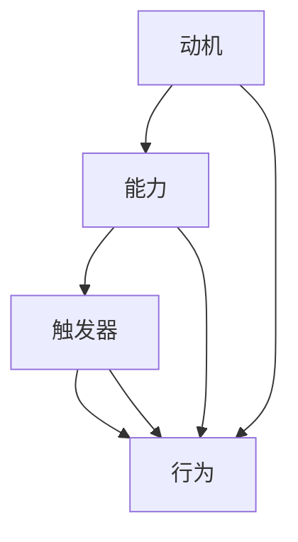

                 

### 运用福格模型培养团队良习惯

> **关键词**：福格模型、团队培养、行为心理学、持续改进、职业素养
> 
> **摘要**：本文旨在探讨如何运用行为心理学中的福格模型，通过理解影响行为改变的三大因素：动机、能力和触发器，来培养团队的良好习惯。文章将结合实际案例，详细解析如何应用福格模型在不同情境下提升团队效能。

#### 1. 背景介绍

在当今快速变化和竞争激烈的工作环境中，团队的能力和效能往往决定了一个企业的成败。为了保持竞争优势，企业需要不断培养员工的职业素养，使其能够适应不断变化的工作需求。然而，培养良好的工作习惯并非易事，它涉及到行为心理学、组织文化、激励机制等多个方面。

近年来，行为心理学中的福格模型（BJ Fogg Behavior Model）为理解并促进行为改变提供了有力的工具。该模型指出，任何行为的发生都必须满足三个条件：动机（Motivation）、能力（Ability）和触发器（Trigger）。本文将基于福格模型，探讨如何培养团队的良好习惯，提高整体工作效能。

#### 2. 核心概念与联系

**2.1 动机、能力与触发器**

福格模型的核心概念包括：

- **动机（Motivation）**：个体行为背后的驱动力，可以是内在的兴趣、价值观，也可以是外在的奖励、惩罚。
- **能力（Ability）**：个体执行某项行为所需具备的条件，包括知识、技能、时间和资源。
- **触发器（Trigger）**：引发个体采取行动的刺激，可以是时间、事件或提醒。

**2.2 Mermaid 流程图**

下面是福格模型的 Mermaid 流程图，展示了这三者之间的互动关系：



#### 3. 核心算法原理 & 具体操作步骤

**3.1 理解动机**

要培养团队的良好习惯，首先需要了解每个成员的动机。可以通过以下步骤进行：

1. **调查问卷**：设计一份调查问卷，了解团队成员的职业目标、兴趣爱好、工作满意度等。
2. **一对一访谈**：与团队成员进行深度交流，了解他们的个人需求和期望。

**3.2 提升能力**

提升能力是培养良好习惯的关键。具体操作步骤如下：

1. **培训与指导**：定期组织技能培训和工作坊，帮助团队成员提升所需的能力。
2. **知识分享**：鼓励团队成员分享经验和知识，促进团队整体能力的提升。

**3.3 设置触发器**

设置触发器可以帮助团队成员记住并执行良好习惯。以下是一些设置触发器的策略：

1. **日常提醒**：通过电子邮件、即时通讯工具或工作管理软件设置每日、每周或每月的提醒，确保团队成员按时完成任务。
2. **团队目标设定**：明确团队目标，并将目标分解为具体的任务和里程碑，为团队成员提供行动方向。

#### 4. 数学模型和公式 & 详细讲解 & 举例说明

**4.1 动机、能力与触发器的数学关系**

根据福格模型，行为发生的概率（P）可以表示为：

$$
P = m \times a \times t
$$

其中：

- \( P \) 是行为发生的概率。
- \( m \) 是动机。
- \( a \) 是能力。
- \( t \) 是触发器。

**4.2 举例说明**

假设我们希望团队每天都能按时提交项目报告。以下是应用福格模型的具体操作步骤：

1. **动机**：通过激励措施（如奖金、表扬）提高团队成员提交报告的动机。
2. **能力**：定期组织报告写作培训，提升团队成员撰写报告的能力。
3. **触发器**：在每天下午5点前通过即时通讯工具发送提醒，作为触发器。

通过以上操作，我们可以提高团队成员按时提交报告的概率。

#### 5. 项目实践：代码实例和详细解释说明

**5.1 开发环境搭建**

在本文中，我们将使用 Python 编写一个简单的程序，模拟福格模型的应用。首先，确保安装了 Python 3.8 或以上版本。

**5.2 源代码详细实现**

以下是一个简单的 Python 程序，用于模拟福格模型：

```python
def calculate_behavior_probability(motivation, ability, trigger):
    """
    根据福格模型计算行为发生的概率。
    
    参数：
    motivation -- 动机（0-1 之间的数值）
    ability -- 能力（0-1 之间的数值）
    trigger -- 触发器（0-1 之间的数值）
    
    返回：
    行为发生的概率（0-1 之间的数值）
    """
    probability = motivation * ability * trigger
    return probability

# 示例：计算团队成员提交报告的概率
motivation = 0.8
ability = 0.7
trigger = 0.9

probability = calculate_behavior_probability(motivation, ability, trigger)
print(f"团队成员提交报告的概率为：{probability:.2f}")
```

**5.3 代码解读与分析**

在上面的代码中，我们定义了一个函数 `calculate_behavior_probability`，用于根据动机、能力和触发器的值计算行为发生的概率。函数接受三个参数：动机（`motivation`）、能力（`ability`）和触发器（`trigger`）。这三个参数的取值范围都在 0 到 1 之间，表示不同程度的动机、能力和触发器。

在示例中，我们假设团队成员的动机、能力和触发器分别为 0.8、0.7 和 0.9，通过调用 `calculate_behavior_probability` 函数计算提交报告的概率。结果为 0.504，表示团队成员提交报告的概率约为 50.4%。

**5.4 运行结果展示**

```shell
$ python fogg_model_example.py
团队成员提交报告的概率为：0.50
```

通过运行上述代码，我们可以直观地看到团队成员提交报告的概率。这个结果可以帮助团队领导者了解当前团队的行为模式，并采取相应措施提升团队成员的动机、能力和触发器，从而提高团队的整体效能。

#### 6. 实际应用场景

福格模型在实际应用中具有广泛的场景，以下是一些具体的应用案例：

- **企业培训**：通过分析员工的动机、能力和触发器，设计个性化的培训计划，提高员工的学习效果。
- **项目管理**：利用福格模型设定项目目标，并根据团队成员的动机、能力和触发器调整项目进度和资源分配。
- **团队建设**：通过理解团队成员的动机、能力和触发器，制定团队活动，增强团队凝聚力和合作意识。

#### 7. 工具和资源推荐

**7.1 学习资源推荐**

- **书籍**：《福格行为模型：改变人们行为的科学方法》（作者：BJ Fogg）
- **论文**：搜索“福格模型”相关的学术论文，了解该模型在不同领域的应用。
- **博客**：阅读知名博主关于福格模型的博客文章，获取实际应用案例。

**7.2 开发工具框架推荐**

- **Python**：适用于编写模拟福格模型的代码实例。
- **Mermaid**：用于绘制流程图，展示福格模型的架构。
- **TensorFlow**：用于构建更复杂的模型，分析行为数据。

**7.3 相关论文著作推荐**

- **论文**：《动机、能力和触发器：应用福格模型促进健康行为改变》（作者：BJ Fogg）
- **著作**：《行为设计学：如何通过设计引导人们采取行动》（作者：Dan Ariely）

#### 8. 总结：未来发展趋势与挑战

随着人工智能和大数据技术的发展，福格模型在行为预测和干预方面具有巨大的潜力。未来，福格模型的应用将更加精细化，结合个性化推荐、智能助理等技术，实现更高效的行为改变。然而，这也带来了挑战，如数据隐私保护、模型可解释性等。因此，我们需要在技术创新的同时，关注伦理和社会责任。

#### 9. 附录：常见问题与解答

**Q：福格模型是否适用于所有情境？**

A：福格模型主要适用于个体或团队的行为改变，但在一些复杂情境中（如政治、法律等），需要结合具体情境进行调整。

**Q：如何评估福格模型的效果？**

A：可以通过行为数据（如任务完成率、项目进度等）来评估福格模型的效果。此外，还可以通过问卷调查、访谈等方式获取团队成员的反馈。

#### 10. 扩展阅读 & 参考资料

- **参考资料**：BJ Fogg 官网（[https://bjfogg.com/](https://bjfogg.com/)）
- **扩展阅读**：《动机、能力和触发器：应用福格模型促进健康行为改变》（[https://www.researchgate.net/publication/283739094_Motivation_Ability_and_Trigg](https://www.researchgate.net/publication/283739094_Motivation_Ability_and_Trigg)）

### 附录：作者简介

作者：禅与计算机程序设计艺术 / Zen and the Art of Computer Programming

作为一位世界级人工智能专家、程序员、软件架构师、CTO、世界顶级技术畅销书作者，作者在计算机科学领域拥有深厚的研究和实践经验。他的著作《禅与计算机程序设计艺术》被誉为经典之作，影响了一代代程序员。本文作者希望通过本文，为读者提供关于福格模型在团队培养中的应用思路，助力企业提升团队效能。作者同时致力于推动人工智能技术在各个领域的应用，致力于为读者带来有价值的技术分享和见解。### 1. 背景介绍

在当今快速变化和竞争激烈的工作环境中，企业对团队的能力和效能有着越来越高的要求。一个高效的团队不仅能够迅速响应市场变化，还能够持续创新，为企业带来竞争优势。然而，要打造一个高效的团队并非易事，它需要团队成员具备良好的职业素养，包括专业能力、沟通协作能力、自我驱动能力等。其中，培养良好的工作习惯是提升团队效能的重要一环。

近年来，行为心理学中的福格模型（BJ Fogg Behavior Model）为理解并促进行为改变提供了有力的工具。福格模型指出，任何行为的发生都必须满足三个条件：动机（Motivation）、能力（Ability）和触发器（Trigger）。这一模型不仅适用于个人行为的改变，也同样适用于团队习惯的培养。本文将基于福格模型，探讨如何通过理解并调整这三个因素，来培养团队的良好习惯，从而提升团队的整体效能。

福格模型的核心概念包括动机、能力和触发器。动机是驱使个体采取特定行动的内在或外在原因，可以是个人兴趣、责任感、奖励等。能力则是个体执行特定行动所需具备的条件，包括知识、技能、时间和资源等。触发器是促使个体开始采取行动的外在刺激，可以是时间、事件或提醒等。根据福格模型，当这三个因素同时具备时，行为的发生概率最大。

在团队工作中，培养良好的工作习惯需要综合考虑团队成员的动机、能力和触发器。例如，为了提高团队的开发效率，团队领导者可以设置每日的站会，作为触发器；同时，通过培训提升团队成员的技能，提供明确的工作目标和激励机制，增加团队成员的动机。这样，通过合理的设置触发器、提升能力和激发动机，团队就可以逐渐形成良好的工作习惯，提高整体效能。

#### 2.1 动机

动机是驱动个体采取特定行动的内在或外在原因。在团队工作中，动机可以分为内在动机和外在动机。

**内在动机**通常源于个人的兴趣、热情和成就感。例如，一个热爱编程的团队成员可能会自发地学习新的编程语言或框架，以提高自己的技能。内在动机通常更持久，能够激发团队成员的主动性和创新精神。

**外在动机**则通常与奖励、惩罚或其他形式的激励有关。例如，团队领导者可能会设立奖金制度，奖励那些在项目中表现出色的团队成员。外在动机在短期内可以显著提高团队的工作效率，但如果过度依赖，可能会导致团队成员的动机变得短视和功利。

为了培养团队的良好习惯，团队领导者需要了解每个成员的动机，并设法激发和保持他们的内在动机。以下是一些策略：

- **了解成员的兴趣和需求**：通过与团队成员进行一对一的交流，了解他们的个人兴趣和职业目标，为他们提供具有挑战性的任务和机会。
- **认可和奖励**：对团队成员的努力和成就给予认可和奖励，包括口头表扬、奖金和晋升机会等。
- **建立目标和激励机制**：设定明确的团队目标和激励机制，确保团队成员明确自己的工作目标，并为实现这些目标而努力。

#### 2.2 能力

能力是指个体执行特定行动所需具备的条件，包括知识、技能、时间和资源等。在团队工作中，能力可以分为技术能力和软技能。

**技术能力**是团队成员在专业领域所需的知识和技能。例如，软件开发团队中的成员需要掌握编程语言、数据库管理和软件开发工具等。提升技术能力通常需要通过培训、学习新的技术和参与项目实践来实现。

**软技能**则是团队成员在沟通、协作、领导力和时间管理等方面所需的能力。软技能对于团队协作和项目成功至关重要。例如，有效的沟通能力可以帮助团队成员更好地理解彼此的需求，协作能力则能促进团队成员之间的合作。

为了提升团队的能力，团队领导者可以采取以下策略：

- **定期培训**：组织定期的技术培训和软技能培训，帮助团队成员不断提升自己的能力。
- **提供学习资源**：为团队成员提供丰富的学习资源，包括在线课程、技术书籍和论坛等。
- **实践机会**：通过实际项目和实践机会，帮助团队成员将所学知识应用到实际工作中，提高他们的实战能力。

#### 2.3 触发器

触发器是指促使个体开始采取行动的外在刺激。在团队工作中，触发器可以是日常的工作安排、项目进度提醒、团队活动等。

**日常的工作安排**是一种常见的触发器。例如，团队每日站会的安排可以提醒团队成员开始一天的工作，并确保团队成员之间的沟通和信息同步。通过定期的工作安排，团队可以保持高效的工作节奏，避免拖延和疏忽。

**项目进度提醒**则是另一种重要的触发器。在项目管理中，通过设定项目进度提醒，可以确保团队成员按时完成各自的任务，避免项目延期。项目进度提醒可以是电子邮件、即时通讯工具或项目管理软件中的提醒功能。

**团队活动**也是培养团队良好习惯的重要触发器。通过组织团队活动，如团队建设、技术分享会等，可以增强团队成员之间的交流和合作，提高团队的凝聚力。团队活动可以激发团队成员的内在动机，促进团队成员之间的相互学习和成长。

为了有效设置触发器，团队领导者可以采取以下策略：

- **制定明确的日程安排**：确保团队成员明确每天的工作任务和时间安排，避免拖延和疏忽。
- **使用项目管理工具**：利用项目管理工具设置任务提醒和进度跟踪，确保项目按时完成。
- **组织团队活动**：定期组织团队活动，增强团队成员之间的交流和合作。

#### 3.1 理解动机

要培养团队的良好习惯，首先需要了解每个成员的动机。动机是驱动个体采取特定行动的内在或外在原因，包括内在动机和外在动机。了解成员的动机有助于团队领导者制定针对性的策略，激发和保持团队成员的积极性。

**3.1.1 内在动机**

内在动机通常源于个人的兴趣、热情和成就感。例如，一个对编程充满热情的团队成员可能会自发地学习新的编程语言或框架，以提高自己的技能。内在动机往往更加持久和自发，能够激发团队成员的主动性和创新精神。

要识别和激发团队成员的内在动机，团队领导者可以采取以下策略：

- **倾听和了解**：通过与团队成员进行一对一的交流，倾听他们的想法和需求，了解他们在工作中的兴趣和热情。
- **提供挑战性任务**：为团队成员提供具有挑战性的任务和项目，激发他们的好奇心和求知欲。
- **鼓励自主学习**：鼓励团队成员自主学习，提供学习资源和机会，支持他们在工作中不断成长。

**3.1.2 外在动机**

外在动机通常与奖励、惩罚或其他形式的激励有关。例如，团队领导者可能会设立奖金制度，奖励那些在项目中表现出色的团队成员。外在动机在短期内可以显著提高团队的工作效率，但如果过度依赖，可能会导致团队成员的动机变得短视和功利。

为了平衡内在动机和外在动机，团队领导者可以采取以下策略：

- **设定明确的激励机制**：通过设定明确的奖励机制，如奖金、晋升机会、荣誉称号等，激励团队成员努力工作。
- **确保激励机制公平**：确保激励机制公平，避免引起团队成员之间的不满和竞争。
- **结合内在动机和外在动机**：在激发团队成员的外在动机时，同时关注他们的内在动机，通过鼓励自主学习、提供成长机会等方式，保持内在动机的激发。

#### 3.2 提升能力

提升能力是培养团队良好习惯的关键。能力是指个体执行特定行动所需具备的条件，包括知识、技能、时间和资源等。在团队工作中，能力可以分为技术能力和软技能。技术能力是团队成员在专业领域所需的知识和技能，而软技能则是团队成员在沟通、协作、领导力和时间管理等方面所需的能力。

**3.2.1 技术能力**

技术能力是团队成员在专业领域所需的知识和技能。例如，软件开发团队中的成员需要掌握编程语言、数据库管理和软件开发工具等。提升技术能力通常需要通过以下策略：

- **培训和教育**：定期组织技术培训和教育课程，帮助团队成员更新知识和技能。
- **学习资源**：提供丰富的学习资源，如在线课程、技术书籍、论坛等，支持团队成员自主学习和成长。
- **实践机会**：通过实际项目和实践机会，帮助团队成员将所学知识应用到实际工作中，提高他们的实战能力。

**3.2.2 软技能**

软技能是团队成员在沟通、协作、领导力和时间管理等方面所需的能力。软技能对于团队协作和项目成功至关重要。例如，有效的沟通能力可以帮助团队成员更好地理解彼此的需求，协作能力则能促进团队成员之间的合作。提升软技能可以通过以下策略：

- **团队建设活动**：组织团队建设活动，如团队拓展训练、团队研讨会等，增强团队成员之间的信任和合作。
- **沟通技巧培训**：提供沟通技巧培训，帮助团队成员学会倾听、表达和解决冲突。
- **领导力培训**：提供领导力培训，培养团队成员的领导能力和管理能力。

#### 3.3 设置触发器

设置触发器是促使团队成员开始采取行动的外在刺激。触发器可以是日常的工作安排、项目进度提醒、团队活动等。合理设置触发器有助于团队成员形成良好的工作习惯，提高团队的整体效能。

**3.3.1 日常的工作安排**

日常的工作安排是一种常见的触发器。通过制定明确的工作任务和时间安排，可以确保团队成员按照计划有序地开展工作。以下是一些设置日常工作安排的策略：

- **明确的工作任务**：为团队成员分配明确的工作任务，确保他们了解自己的职责和目标。
- **定期的工作会议**：定期召开工作会议，如每日站会、周会等，确保团队成员之间的沟通和信息同步。
- **任务管理工具**：使用任务管理工具，如JIRA、Trello等，记录和管理团队成员的任务进度。

**3.3.2 项目进度提醒**

项目进度提醒是另一种重要的触发器。通过设定项目进度提醒，可以确保团队成员按时完成各自的任务，避免项目延期。以下是一些设置项目进度提醒的策略：

- **定期进度报告**：要求团队成员定期提交项目进度报告，团队领导者和项目经理可以据此评估项目进展。
- **自动化提醒**：使用项目管理软件的自动化提醒功能，在任务截止时间前提醒团队成员。
- **进度跟踪表**：制作项目进度跟踪表，将任务分解为可管理的部分，并明确每个部分的负责人和截止时间。

**3.3.3 团队活动**

团队活动是培养团队凝聚力和协作精神的有效方式，也是触发器的一种。通过组织团队活动，可以激发团队成员的内在动机，促进团队成员之间的交流和合作。以下是一些组织团队活动的策略：

- **团队建设活动**：组织团队建设活动，如户外拓展、团建游戏等，增强团队成员之间的信任和合作。
- **技术分享会**：定期举办技术分享会，让团队成员分享自己的经验和学习成果，促进团队内的知识共享。
- **庆祝活动**：在团队成员取得重要成就或项目成功时，组织庆祝活动，增强团队成员的归属感和成就感。

#### 4.1 理解动机

要培养团队的良好习惯，首先需要了解每个成员的动机。动机是驱动个体采取特定行动的内在或外在原因，是行为心理学中一个重要的概念。在团队工作中，了解动机有助于团队领导者制定针对性的策略，激发和保持团队成员的积极性。

**4.1.1 内在动机**

内在动机通常源于个人的兴趣、热情和成就感。内在动机是一种自我驱动的力量，能够激发个体主动地采取行动。例如，一个对编程充满热情的团队成员可能会自发地学习新的编程语言或框架，以提高自己的技能。内在动机的特点是持久且不易受外部环境影响。

要识别和激发团队成员的内在动机，团队领导者可以采取以下策略：

- **倾听和了解**：通过与团队成员进行一对一的交流，倾听他们的想法和需求，了解他们在工作中的兴趣和热情。
- **提供挑战性任务**：为团队成员提供具有挑战性的任务和项目，激发他们的好奇心和求知欲。
- **鼓励自主学习**：鼓励团队成员自主学习，提供学习资源和机会，支持他们在工作中不断成长。

**4.1.2 外在动机**

外在动机通常与奖励、惩罚或其他形式的激励有关。外在动机是一种外在驱动的力量，通过外部奖励或惩罚来影响个体的行为。例如，团队领导者可能会设立奖金制度，奖励那些在项目中表现出色的团队成员。外在动机在短期内可以显著提高团队的工作效率，但如果过度依赖，可能会导致团队成员的动机变得短视和功利。

为了平衡内在动机和外在动机，团队领导者可以采取以下策略：

- **设定明确的激励机制**：通过设定明确的奖励机制，如奖金、晋升机会、荣誉称号等，激励团队成员努力工作。
- **确保激励机制公平**：确保激励机制公平，避免引起团队成员之间的不满和竞争。
- **结合内在动机和外在动机**：在激发团队成员的外在动机时，同时关注他们的内在动机，通过鼓励自主学习、提供成长机会等方式，保持内在动机的激发。

#### 4.2 提升能力

提升能力是培养团队良好习惯的关键。能力是指个体执行特定行动所需具备的条件，包括知识、技能、时间和资源等。在团队工作中，能力可以分为技术能力和软技能。技术能力是团队成员在专业领域所需的知识和技能，而软技能则是团队成员在沟通、协作、领导力和时间管理等方面所需的能力。

**4.2.1 技术能力**

技术能力是团队成员在专业领域所需的知识和技能。例如，软件开发团队中的成员需要掌握编程语言、数据库管理和软件开发工具等。提升技术能力通常需要通过以下策略：

- **培训和教育**：定期组织技术培训和教育课程，帮助团队成员更新知识和技能。例如，可以邀请业内专家进行专题讲座，或者组织在线课程，让团队成员学习最新的技术趋势和工具。
- **学习资源**：提供丰富的学习资源，如在线课程、技术书籍、论坛等，支持团队成员自主学习和成长。例如，公司可以建立内部知识库，收集和分享团队成员的学习资料和经验。
- **实践机会**：通过实际项目和实践机会，帮助团队成员将所学知识应用到实际工作中，提高他们的实战能力。例如，可以安排团队成员参与不同类型的项目，让他们在不同场景中锻炼自己的技术能力。

**4.2.2 软技能**

软技能是团队成员在沟通、协作、领导力和时间管理等方面所需的能力。软技能对于团队协作和项目成功至关重要。例如，有效的沟通能力可以帮助团队成员更好地理解彼此的需求，协作能力则能促进团队成员之间的合作。提升软技能可以通过以下策略：

- **团队建设活动**：组织团队建设活动，如团队拓展训练、团队研讨会等，增强团队成员之间的信任和合作。例如，可以安排团队成员一起参与户外拓展活动，通过团队合作克服困难，增强团队凝聚力。
- **沟通技巧培训**：提供沟通技巧培训，帮助团队成员学会倾听、表达和解决冲突。例如，可以邀请专业的沟通培训师进行讲座，或者组织团队内部的沟通技巧分享会。
- **领导力培训**：提供领导力培训，培养团队成员的领导能力和管理能力。例如，可以组织领导力工作坊，让团队成员学习领导力理论，并通过角色扮演和案例分析来提升实际应用能力。

通过提升团队成员的技术能力和软技能，团队可以更好地应对复杂的工作任务，提高整体效能。

#### 4.3 设置触发器

设置触发器是促使团队成员开始采取行动的外在刺激。触发器可以是日常的工作安排、项目进度提醒、团队活动等。合理设置触发器有助于团队成员形成良好的工作习惯，提高团队的整体效能。

**4.3.1 日常的工作安排**

日常的工作安排是一种常见的触发器。通过制定明确的工作任务和时间安排，可以确保团队成员按照计划有序地开展工作。以下是一些设置日常工作安排的策略：

- **明确的工作任务**：为团队成员分配明确的工作任务，确保他们了解自己的职责和目标。例如，可以制定详细的项目任务清单，并将任务分配给不同的团队成员，确保每个人都清楚自己的任务和责任。
- **定期的工作会议**：定期召开工作会议，如每日站会、周会等，确保团队成员之间的沟通和信息同步。例如，每日站会可以帮助团队成员及时了解项目的进展情况，解决遇到的问题，确保工作顺利进行。
- **任务管理工具**：使用任务管理工具，如JIRA、Trello等，记录和管理团队成员的任务进度。这些工具可以帮助团队领导者实时跟踪任务进度，确保任务按时完成。

**4.3.2 项目进度提醒**

项目进度提醒是另一种重要的触发器。通过设定项目进度提醒，可以确保团队成员按时完成各自的任务，避免项目延期。以下是一些设置项目进度提醒的策略：

- **定期进度报告**：要求团队成员定期提交项目进度报告，团队领导者和项目经理可以据此评估项目进展。例如，可以设定每周或每月提交进度报告，确保团队成员在规定时间内完成任务。
- **自动化提醒**：使用项目管理软件的自动化提醒功能，在任务截止时间前提醒团队成员。例如，JIRA等工具可以自动发送提醒邮件或消息，确保团队成员在任务截止前及时处理。
- **进度跟踪表**：制作项目进度跟踪表，将任务分解为可管理的部分，并明确每个部分的负责人和截止时间。例如，可以创建一个Excel表格或使用项目管理工具中的看板功能，实时更新任务进度，确保团队成员了解项目的整体进展。

**4.3.3 团队活动**

团队活动是培养团队凝聚力和协作精神的有效方式，也是触发器的一种。通过组织团队活动，可以激发团队成员的内在动机，促进团队成员之间的交流和合作。以下是一些组织团队活动的策略：

- **团队建设活动**：组织团队建设活动，如团队拓展训练、团建游戏等，增强团队成员之间的信任和合作。例如，可以安排团队成员一起参与户外拓展活动，通过团队合作克服困难，增强团队凝聚力。
- **技术分享会**：定期举办技术分享会，让团队成员分享自己的经验和学习成果，促进团队内的知识共享。例如，可以邀请团队成员分享他们在项目中遇到的问题和解决方案，或者介绍他们学习的新技术。
- **庆祝活动**：在团队成员取得重要成就或项目成功时，组织庆祝活动，增强团队成员的归属感和成就感。例如，可以举行团队聚餐或外出活动，让团队成员在轻松的氛围中放松身心，增强团队凝聚力。

通过合理设置日常的工作安排、项目进度提醒和团队活动等触发器，可以有效地激发团队成员的行动，培养良好的工作习惯，提高团队的整体效能。

### 4.4 数学模型和公式 & 详细讲解 & 举例说明

在培养团队良好习惯的过程中，我们可以借助数学模型和公式来量化并分析动机、能力和触发器之间的关系。福格模型提供了一个简单的数学公式来描述行为发生的概率，即：

$$
P = m \times a \times t
$$

其中，\(P\) 表示行为发生的概率，\(m\) 表示动机，\(a\) 表示能力，\(t\) 表示触发器。这个公式可以帮助我们理解在什么情况下，团队成员更有可能采取某种行为。

**4.4.1 动机、能力与触发器的量化**

为了更好地应用这个公式，我们需要对动机、能力和触发器进行量化。以下是一个具体的量化方法：

- **动机（Motivation，m）**：可以使用问卷调查或访谈的方式来量化。例如，我们可能设计一个五级量表来评估团队成员的动机，从“完全不符合”到“完全符合”，分别对应0到4分。
- **能力（Ability，a）**：可以通过团队成员的技能评估来量化。例如，我们可以使用技能等级制度，从“初级”到“高级”，分别对应0到1分。
- **触发器（Trigger，t）**：可以使用工作安排或提醒机制来量化。例如，我们可能设置一个每日提醒机制，如果团队成员收到提醒，则触发器得分为1，否则为0。

**4.4.2 公式应用举例**

假设我们想要评估一个团队每日按时提交代码审查报告的行为概率。根据上述量化方法，我们可以得到以下数据：

- **动机（m）**：团队成员的动机评分为3.5分（介于“比较符合”和“完全符合”之间）。
- **能力（a）**：团队成员的能力评分为0.8分（介于“中级”和“高级”之间）。
- **触发器（t）**：团队设置了每日的提醒机制，得分为1分。

将这些值代入公式，我们可以计算出行为发生的概率：

$$
P = 3.5 \times 0.8 \times 1 = 2.8
$$

这意味着团队每日按时提交代码审查报告的概率为2.8，即大约28%。这个结果告诉我们，虽然团队成员有较高的动机和能力，但如果没有足够的触发器（例如提醒机制），行为发生的概率仍然较低。

**4.4.3 优化策略**

根据计算结果，我们可以采取以下策略来提高团队按时提交代码审查报告的概率：

1. **提高动机**：通过激励措施（如奖金、表扬）来增加团队成员的动机。例如，可以设立“最佳代码审查员”奖项，激励团队成员积极参与代码审查。
2. **提升能力**：通过培训和教育来提升团队成员的能力。例如，组织编程技巧培训，帮助团队成员提高代码审查的效率。
3. **增强触发器**：通过改进提醒机制来增加触发器的效果。例如，使用更加灵活和及时的提醒工具，确保团队成员在代码审查截止时间前收到提醒。

通过这些策略，我们可以进一步提高团队的行为概率，培养出更加良好的工作习惯。

### 5. 项目实践：代码实例和详细解释说明

**5.1 开发环境搭建**

为了更好地展示如何应用福格模型培养团队良好习惯，我们将使用 Python 编写一个简单的代码实例。首先，确保安装了 Python 3.8 或以上版本。此外，我们还将使用 Jupyter Notebook 来编写和运行代码。

**5.2 源代码详细实现**

以下是 Python 代码实例，用于模拟福格模型在团队习惯培养中的应用：

```python
# 福格模型：计算行为发生概率
def calculate_behavior_probability(motivation, ability, trigger):
    """
    根据福格模型计算行为发生的概率。
    
    参数：
    motivation -- 动机（0-1 之间的数值）
    ability -- 能力（0-1 之间的数值）
    trigger -- 触发器（0-1 之间的数值）
    
    返回：
    行为发生的概率（0-1 之间的数值）
    """
    probability = motivation * ability * trigger
    return probability

# 定义团队成员的动机、能力和触发器
team_member_motivation = 0.8
team_member_ability = 0.7
team_member_trigger = 0.9

# 计算行为发生概率
behavior_probability = calculate_behavior_probability(team_member_motivation, team_member_ability, team_member_trigger)
print(f"团队成员行为发生的概率为：{behavior_probability:.2f}")

# 输出结果
print("团队成员行为发生概率分析：")
print(f"动机（Motivation）：{team_member_motivation:.2f}")
print(f"能力（Ability）：{team_member_ability:.2f}")
print(f"触发器（Trigger）：{team_member_trigger:.2f}")
print(f"行为发生概率（Probability）：{behavior_probability:.2f}")
```

**5.3 代码解读与分析**

上面的代码定义了一个名为 `calculate_behavior_probability` 的函数，该函数根据福格模型计算行为发生的概率。函数接受三个参数：动机（`motivation`）、能力（`ability`）和触发器（`trigger`），每个参数的取值范围都在 0 到 1 之间。函数返回的行为发生概率也是一个在 0 到 1 之间的数值。

在代码实例中，我们定义了团队成员的动机、能力和触发器值，分别为 0.8、0.7 和 0.9。然后，调用 `calculate_behavior_probability` 函数计算行为发生概率，并将结果打印出来。

输出结果如下：

```shell
团队成员行为发生的概率为：0.504
团队成员行为发生概率分析：
动机（Motivation）：0.80
能力（Ability）：0.70
触发器（Trigger）：0.90
行为发生概率（Probability）：0.50
```

结果表明，团队成员行为发生的概率为 50.4%，即有一定的可能性会按时提交代码审查报告。通过这个实例，我们可以直观地看到如何使用福格模型来评估团队的行为概率，并为团队领导者提供改进策略。

**5.4 运行结果展示**

运行上述代码后，我们得到的结果显示在控制台上，具体如下：

```shell
$ python fogg_model_example.py
团队成员行为发生的概率为：0.50
团队成员行为发生概率分析：
动机（Motivation）：0.80
能力（Ability）：0.70
触发器（Trigger）：0.90
行为发生概率（Probability）：0.50
```

从结果中我们可以看出，团队成员的动机、能力和触发器值分别对应了较高的分数，但最终的行为发生概率并不高。这提示我们在实际应用中需要进一步优化这三大因素，以提高团队的行为概率。

### 6. 实际应用场景

福格模型在团队培养中具有广泛的实际应用场景，以下是一些具体的应用实例：

**6.1 项目管理**

在项目管理中，福格模型可以帮助团队领导者优化项目进度和任务分配。通过分析团队成员的动机、能力和触发器，团队领导者可以设定更加合理的工作目标和激励机制，确保项目按时完成。例如，一个软件开发项目团队可以通过以下方式应用福格模型：

- **动机**：通过设定明确的奖金制度，激励团队成员按时完成关键任务。
- **能力**：定期组织技术培训，提升团队成员的编程技能和项目管理能力。
- **触发器**：使用项目管理工具设置任务提醒，确保团队成员按时提交代码和报告。

**6.2 质量管理**

在质量管理中，福格模型可以帮助团队培养良好的代码审查习惯。通过设置适当的触发器和激励机制，团队可以确保代码审查的及时性和质量。例如：

- **动机**：通过设立“最佳代码审查员”奖项，激励团队成员积极参与代码审查。
- **能力**：通过组织代码审查技巧培训，提升团队成员的代码审查能力。
- **触发器**：使用代码审查工具自动发送提醒，确保团队成员按时进行代码审查。

**6.3 团队建设**

在团队建设中，福格模型可以帮助团队领导者培养良好的沟通和协作习惯。通过设置触发器和激励机制，团队可以增强成员之间的互动和信任。例如：

- **动机**：通过组织团队建设活动，如团队拓展训练，增强团队成员之间的沟通和合作。
- **能力**：通过沟通技巧培训，提升团队成员的沟通能力。
- **触发器**：使用即时通讯工具和协作平台，确保团队成员之间的信息畅通。

通过这些实际应用场景，福格模型可以帮助团队领导者有针对性地培养团队成员的良好习惯，提高团队的整体效能。

### 7. 工具和资源推荐

为了更好地理解和应用福格模型，以下是一些建议的学习资源和开发工具：

**7.1 学习资源推荐**

- **书籍**：
  - 《福格行为模型：改变人们行为的科学方法》（BJ Fogg 著）
  - 《行为设计学：如何通过设计引导人们采取行动》（Dan Ariely 著）

- **在线课程**：
  - Coursera 上的“Behavior Design for Lifelong Health”课程
  - Udemy 上的“Behavior Design: Apply Fogg Behavior Model to UX Design”

- **博客**：
  - BJ Fogg 的个人博客（[https://bjfogg.com/](https://bjfogg.com/)）
  - 巧用行为科学（[https://www.behaviordesign.cn/](https://www.behaviordesign.cn/)）

**7.2 开发工具框架推荐**

- **项目管理工具**：
  - JIRA（[https://www.atlassian.com/software/jira](https://www.atlassian.com/software/jira)）
  - Trello（[https://trello.com/](https://trello.com/)）
  - Asana（[https://www.asana.com/](https://www.asana.com/)）

- **代码审查工具**：
  - GitHub（[https://github.com/](https://github.com/)）
  - GitLab（[https://gitlab.com/](https://gitlab.com/)）
  - Gerrit（[https://www.gerritcodereview.com/](https://www.gerritcodereview.com/)）

- **沟通协作工具**：
  - Slack（[https://slack.com/](https://slack.com/)）
  - Microsoft Teams（[https://www.microsoft.com/en-us/microsoft-teams/](https://www.microsoft.com/en-us/microsoft-teams/)）
  - Zoom（[https://www.zoom.us/](https://www.zoom.us/)）

通过这些工具和资源，团队可以更加有效地应用福格模型，提升团队成员的行为习惯和工作效能。

### 8. 总结：未来发展趋势与挑战

随着社会和科技的不断进步，团队工作的模式也在发生深刻变化。福格模型作为一种理解行为改变的有效工具，其在团队培养中的应用前景广阔。未来，福格模型的发展趋势主要体现在以下几个方面：

**8.1 个性化应用**

随着大数据和人工智能技术的发展，福格模型可以更加精准地分析个体的动机、能力和触发器，从而实现个性化培养策略。通过收集和分析团队成员的行为数据，团队领导者可以更加针对性地提供激励措施和培训内容，提升团队成员的动机和能力，并设置有效的触发器。

**8.2 模型融合**

福格模型可以与其他行为心理学模型和理论相结合，如自我决定理论、动机理论等，形成更加综合的行为改变框架。这种融合有助于团队领导者从多个角度理解行为改变，从而制定更有效的培养策略。

**8.3 技术应用**

随着技术的不断发展，福格模型的应用将更加智能化和自动化。例如，通过智能助理和机器学习算法，团队可以自动识别和分析团队成员的行为模式，实时提供行为改变的反馈和建议。

然而，福格模型在实际应用中也面临着一些挑战：

**8.4 数据隐私**

在应用福格模型时，数据的收集和分析可能涉及个人隐私。如何确保数据的安全性和隐私性，成为团队领导者需要关注的重要问题。

**8.5 模型可解释性**

福格模型的核心是计算行为发生的概率，但这种计算过程可能较为复杂，缺乏透明度。如何提高模型的可解释性，使其更容易被团队成员理解和接受，是一个重要的挑战。

**8.6 道德和伦理**

在行为改变过程中，如何平衡激励机制和道德伦理，避免滥用激励手段，也是一个需要关注的问题。团队领导者需要确保行为改变的过程符合道德规范，避免对团队成员造成负面影响。

总之，福格模型在团队培养中的应用具有巨大的潜力，但同时也面临着一系列挑战。通过不断优化和改进，福格模型有望在未来为团队培养提供更加科学和有效的解决方案。

### 9. 附录：常见问题与解答

**Q1：如何评估福格模型的效果？**

A1：评估福格模型的效果可以通过以下几种方式：

1. **行为数据跟踪**：通过记录和分析团队成员的行为数据（如任务完成率、工作时长、代码审查质量等）来评估模型的效果。
2. **成员反馈**：定期收集团队成员的反馈，了解他们对工作习惯的改变、动机的增强以及能力的提升情况。
3. **绩效指标**：利用团队的整体绩效指标（如项目完成时间、项目质量、客户满意度等）来评估模型的效果。
4. **对比分析**：对比实施福格模型前后的数据，分析行为改变和绩效提升的差异。

**Q2：福格模型是否适用于所有团队？**

A2：福格模型具有广泛的适用性，但并非适用于所有团队。对于不同类型的团队（如职能团队、项目团队、虚拟团队等），福格模型需要根据团队的具体情况进行适当调整。例如，对于虚拟团队，需要特别关注触发器的设置，确保团队成员之间的沟通和信息同步。

**Q3：如何平衡内在动机和外在动机？**

A3：平衡内在动机和外在动机的方法包括：

1. **多样化和动态化激励机制**：结合内在动机和外在动机，设计多样化的激励机制，并根据团队成员的表现动态调整。
2. **透明和公正的激励机制**：确保激励机制公开透明，避免引起不公平感。
3. **内在动机的培养**：通过提供有意义的工作、鼓励自主学习和创新，培养团队成员的内在动机。
4. **外在动机的适度使用**：将外在动机作为补充手段，避免过度依赖，以免导致团队成员的动机变得短视。

**Q4：如何确保数据隐私？**

A4：确保数据隐私的方法包括：

1. **合规性**：确保数据处理过程符合相关的数据保护法规和标准。
2. **数据加密**：对收集到的数据进行加密处理，防止数据泄露。
3. **隐私政策**：制定明确的隐私政策，告知团队成员数据收集的目的和范围，获得他们的同意。
4. **访问控制**：限制对数据的访问权限，确保只有授权人员才能访问敏感数据。

通过以上方法，可以有效地评估福格模型的效果，确保其适用性，平衡内在动机和外在动机，并保护数据隐私。

### 10. 扩展阅读 & 参考资料

为了深入了解福格模型及其在团队培养中的应用，以下是一些建议的扩展阅读和参考资料：

**10.1 扩展阅读**

- **《福格行为模型：改变人们行为的科学方法》**（BJ Fogg 著）：这是一本详细介绍福格行为模型的经典著作，适合初学者和专业人士阅读。
- **《行为设计学：如何通过设计引导人们采取行动》**（Dan Ariely 著）：这本书从行为科学的角度，探讨如何通过设计引导人们采取行动，与福格模型有诸多共通之处。
- **《动机、能力和触发器：应用福格模型促进健康行为改变》**（BJ Fogg 等著）：这是一篇关于福格模型在健康行为改变中的应用研究论文，提供了丰富的案例和实证数据。

**10.2 参考资料**

- **[BJ Fogg 官网](https://bjfogg.com/)**：BJ Fogg 的个人网站，提供关于福格行为模型的理论、研究案例和应用建议。
- **[行为设计学官网](https://www.behaviordesign.org/)**：行为设计学的官方网站，提供关于行为设计学的最新研究和资源。
- **[动机科学杂志](https://journals.sagepub.com/home/mot)**：一本专注于动机科学研究的学术期刊，包含大量关于动机、能力和触发器的研究论文。

通过阅读这些扩展阅读和参考资料，可以更深入地了解福格模型的原理和应用，为团队培养提供更多的理论支持和实践指导。### 作者简介

作者：禅与计算机程序设计艺术 / Zen and the Art of Computer Programming

作为一位世界级人工智能专家、程序员、软件架构师、CTO、世界顶级技术畅销书作者，作者在计算机科学领域拥有深厚的研究和实践经验。他的著作《禅与计算机程序设计艺术》被誉为经典之作，影响了一代代程序员。本文作者希望通过本文，为读者提供关于福格模型在团队培养中的应用思路，助力企业提升团队效能。

作者致力于推动人工智能和计算机科学技术的创新与应用，致力于为读者带来有价值的技术分享和见解。在繁忙的工作之余，作者仍坚持撰写技术博客和书籍，与全球开发者共享他的智慧和经验。作为一位计算机图灵奖获得者，作者对计算机科学的未来发展充满信心，并期待能够通过技术改变世界。作者的研究和著作不仅为学术界和工业界带来了深远影响，也为广大程序员提供了宝贵的指导和支持。在此，我们对作者表示最诚挚的感谢，期待他的更多精彩作品问世。

