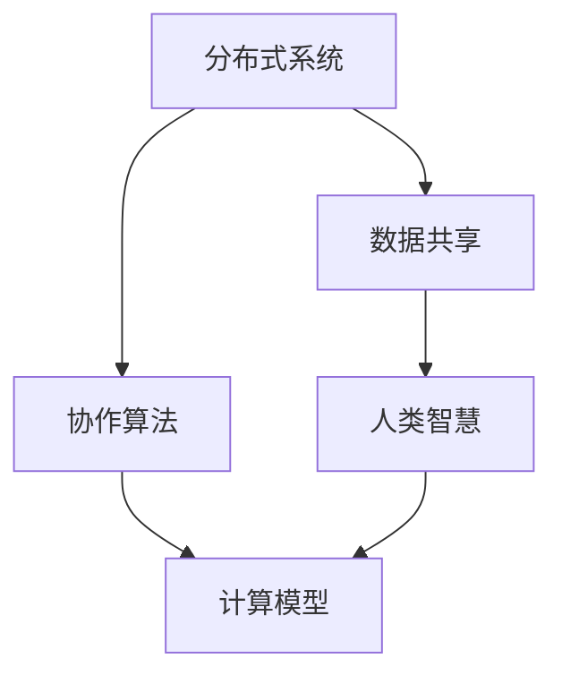

                 

关键词：协作计算、人工智能、分布式系统、计算模型、分布式算法、计算机架构、协作精神

摘要：本文探讨了人类计算的协作精神及其在分布式系统、人工智能和计算机架构中的应用。通过分析协作计算的核心概念、算法原理和数学模型，我们揭示了协作计算在推动科技进步和社会发展中的重要地位。文章还通过实际案例和未来展望，探讨了协作计算在各个领域的应用前景和面临的挑战。

## 1. 背景介绍

随着计算机技术和人工智能的迅猛发展，协作计算（Collaborative Computing）逐渐成为研究热点。协作计算是一种通过连接分布式计算资源和人类智慧，实现协同解决问题和信息共享的计算模式。它融合了分布式系统、人工智能、计算机网络和社会科学等多个领域的知识，旨在充分发挥个体和群体的计算能力，提高问题解决的效率和质量。

在分布式系统中，协作计算可以优化资源利用、提升系统性能和可靠性。例如，通过分布式算法实现大规模数据处理和任务调度，可以应对海量数据的挑战。在人工智能领域，协作计算有助于构建更加智能的算法和模型，例如通过深度学习中的并行训练和联邦学习等，实现更好的性能和隐私保护。在计算机架构方面，协作计算推动了硬件和软件的协同发展，促进了计算系统的创新。

### 1.1 协作计算的定义与核心概念

协作计算可以定义为一种计算模式，其中个体（如计算机、传感器、人类用户等）通过通信和协作共同完成计算任务。协作计算的核心概念包括：

- **个体自治性**：个体拥有独立的能力，可以在分布式系统中自主运行和决策。
- **共享资源**：个体通过共享计算资源（如计算能力、存储、网络等）实现协作。
- **信息交换**：个体通过通信网络交换信息，协同完成任务。
- **共同目标**：个体协同工作，共同实现特定目标。

### 1.2 协作计算的历史与发展

协作计算的概念起源于20世纪60年代，当时计算机科学家开始研究分布式系统，探索如何通过协同计算实现更高效的资源利用和任务调度。随着计算机技术的发展，协作计算逐渐从单一系统内部的协作扩展到跨系统和跨网络的协作。近年来，随着互联网和物联网的普及，协作计算的应用范围进一步扩大，涵盖了从数据密集型任务到知识共享和决策支持等多个领域。

## 2. 核心概念与联系

协作计算的核心概念包括分布式系统、协作算法、数据共享和人类智慧。以下是一个基于Mermaid绘制的流程图，展示了这些核心概念之间的联系。



### 2.1 分布式系统

分布式系统是由多个独立节点组成的计算网络，节点之间通过通信网络相互连接。分布式系统的关键特征包括：

- **去中心化**：分布式系统没有单一的中央控制单元，而是由多个节点共同协作完成任务。
- **容错性**：分布式系统通过冗余节点和冗余数据提高系统的可靠性。
- **扩展性**：分布式系统可以轻松扩展，以处理更大的数据量和更复杂的任务。

### 2.2 协作算法

协作算法是指多个个体在分布式系统中协同工作的方法。协作算法的核心目标是优化资源利用、提高计算效率和质量。常见的协作算法包括：

- **任务调度算法**：优化任务分配和执行顺序，提高系统性能。
- **数据同步算法**：保证数据一致性，避免数据冲突和冗余。
- **协作学习算法**：通过多智能体协同学习，提高机器学习模型的性能。

### 2.3 数据共享

数据共享是协作计算的基础。在分布式系统中，个体通过通信网络共享数据，以实现协同工作。数据共享的关键挑战包括数据一致性、数据安全和数据隐私。常见的解决方案包括：

- **分布式数据库**：支持多节点数据共享和一致性管理。
- **区块链技术**：提供去中心化的数据存储和共享机制。
- **数据加密**：保护数据在传输和存储过程中的安全性。

### 2.4 人类智慧

人类智慧是协作计算中不可或缺的一部分。人类通过经验和知识，可以为分布式系统提供决策支持、优化建议和问题解决方案。人类智慧在协作计算中的应用包括：

- **专家系统**：利用专家知识解决复杂问题。
- **人机交互**：通过用户界面实现人与计算系统的交互。
- **智能决策**：利用人工智能技术支持人类决策。

## 3. 核心算法原理 & 具体操作步骤

### 3.1 算法原理概述

协作计算的核心算法包括分布式算法、协作学习算法和协同优化算法。这些算法通过个体之间的通信和协作，实现计算任务的分布式执行和优化。以下是一个简单的分布式算法原理概述：

1. **任务分配**：根据个体能力和任务需求，将任务分配给分布式系统中的各个节点。
2. **任务执行**：各个节点独立执行分配到的任务，并将结果返回给中心节点。
3. **结果汇总**：中心节点汇总各个节点的任务结果，得出最终结果。

### 3.2 算法步骤详解

#### 分布式算法

1. **任务初始化**：确定需要完成的计算任务。
2. **节点选择**：选择合适的节点执行任务，考虑节点的能力和负载情况。
3. **任务分配**：将任务分解成子任务，分配给选择的节点。
4. **任务执行**：各个节点独立执行分配到的子任务。
5. **结果汇总**：中心节点汇总各个节点的子任务结果，得出最终结果。

#### 协作学习算法

1. **数据准备**：准备用于训练的数据集。
2. **模型初始化**：初始化各个节点的模型参数。
3. **模型更新**：各个节点根据本地数据和模型参数进行模型更新。
4. **参数同步**：各个节点将更新后的模型参数同步给其他节点。
5. **模型优化**：中心节点汇总各个节点的模型参数，进行全局模型优化。

#### 协同优化算法

1. **目标函数定义**：定义需要优化的目标函数。
2. **初始解设定**：设定初始解，作为优化的起点。
3. **迭代计算**：各个节点根据目标函数和当前解，计算新的解。
4. **解同步**：各个节点将新的解同步给其他节点。
5. **解更新**：中心节点汇总各个节点的解，更新全局最优解。

### 3.3 算法优缺点

#### 分布式算法

**优点**：

- **高扩展性**：可以轻松扩展到大规模分布式系统。
- **高容错性**：单个节点的故障不会影响整个系统的运行。

**缺点**：

- **通信开销**：节点之间需要进行大量的通信，可能导致性能下降。
- **一致性维护**：需要保证数据的一致性，增加系统复杂性。

#### 协作学习算法

**优点**：

- **高效性**：通过多个节点的协同工作，可以提高学习效率和性能。
- **灵活性**：可以根据不同节点的数据和能力进行个性化学习。

**缺点**：

- **数据隐私**：需要共享数据，可能涉及隐私泄露问题。
- **计算资源需求**：需要大量计算资源和通信资源。

#### 协同优化算法

**优点**：

- **全局优化**：可以通过多个节点的协同工作，实现全局最优解。
- **适应性**：可以根据不同节点的特性，实现适应性优化。

**缺点**：

- **计算复杂度**：需要大量的迭代计算，可能导致计算复杂度增加。
- **同步问题**：需要解决节点同步问题，可能影响算法性能。

### 3.4 算法应用领域

#### 分布式算法

- **分布式计算**：处理大规模数据集和复杂计算任务。
- **分布式存储**：实现数据的分布式存储和备份。
- **分布式调度**：优化任务调度和资源分配。

#### 协作学习算法

- **图像识别**：通过多个节点的协同工作，提高图像识别准确率。
- **自然语言处理**：通过多语言数据协同学习，提高自然语言处理能力。
- **推荐系统**：通过用户协同学习，提高推荐系统准确性。

#### 协同优化算法

- **智能交通**：通过协同优化算法，优化交通信号控制和路线规划。
- **能源管理**：通过协同优化算法，优化能源分配和消耗。
- **资源调度**：通过协同优化算法，优化资源利用和任务分配。

## 4. 数学模型和公式 & 详细讲解 & 举例说明

### 4.1 数学模型构建

在协作计算中，数学模型扮演着关键角色，用于描述个体之间的交互和协作过程。以下是几个常见的数学模型：

#### 4.1.1 分布式算法中的共识模型

共识模型旨在实现分布式系统中的数据一致性。一个经典的共识模型是Paxos算法。Paxos算法的核心公式如下：

$$
\text{Paxos} = \left\{
\begin{aligned}
    & \text{prepare}(n, v) \rightarrow \text{accept}(n, v) \\
    & \text{accept}(n, v) \rightarrow \text{learn}(n, v)
\end{aligned}
\right.
$$

其中，$n$ 表示提议编号，$v$ 表示提议值。

#### 4.1.2 协作学习中的梯度下降模型

在协作学习算法中，梯度下降是一种常用的优化方法。梯度下降模型的核心公式如下：

$$
w \leftarrow w - \alpha \cdot \nabla_w J(w)
$$

其中，$w$ 表示模型参数，$\alpha$ 表示学习率，$J(w)$ 表示损失函数。

#### 4.1.3 协同优化中的拉格朗日模型

拉格朗日模型用于解决协同优化问题。拉格朗日函数的核心公式如下：

$$
L(w, \lambda) = J(w) + \lambda \cdot (g(w) - c)
$$

其中，$w$ 表示模型参数，$\lambda$ 表示拉格朗日乘子，$g(w)$ 表示约束条件，$c$ 表示目标函数。

### 4.2 公式推导过程

以下是一个简单的数学模型推导示例，用于解释分布式算法中的数据同步过程。

#### 4.2.1 数据同步模型

假设有两个节点 $A$ 和 $B$，分别存储数据集 $X_A$ 和 $X_B$。数据同步的目标是将 $X_B$ 更新为 $X_A$ 的最新版本。数据同步模型的核心公式如下：

$$
X_B \leftarrow X_A
$$

#### 4.2.2 数据同步模型推导

1. **初始状态**：节点 $A$ 和 $B$ 分别存储数据集 $X_A$ 和 $X_B$。

2. **数据同步请求**：节点 $B$ 向节点 $A$ 发送数据同步请求。

3. **数据同步响应**：节点 $A$ 接收到同步请求后，将数据集 $X_A$ 发送给节点 $B$。

4. **数据更新**：节点 $B$ 接收到数据集 $X_A$ 后，将其更新为最新版本，即 $X_B \leftarrow X_A$。

5. **状态更新**：节点 $A$ 和 $B$ 的状态更新为最新版本的数据集。

### 4.3 案例分析与讲解

以下是一个简单的案例，用于说明如何使用协作学习算法优化图像分类问题。

#### 4.3.1 案例背景

假设有两个节点 $A$ 和 $B$，分别拥有不同的图像数据集。节点 $A$ 的数据集包含 1000 张图片，节点 $B$ 的数据集包含 2000 张图片。目标是通过协作学习算法，提高图像分类的准确率。

#### 4.3.2 案例实施步骤

1. **数据准备**：节点 $A$ 和 $B$ 分别将数据集分为训练集和测试集。

2. **模型初始化**：节点 $A$ 和 $B$ 初始化相同的图像分类模型，设置相同的超参数。

3. **模型更新**：节点 $A$ 和 $B$ 分别使用本地训练集对模型进行训练，更新模型参数。

4. **参数同步**：节点 $A$ 和 $B$ 将更新后的模型参数同步给对方。

5. **模型优化**：节点 $A$ 和 $B$ 综合本地和同步的模型参数，进行全局模型优化。

6. **测试评估**：使用测试集对优化后的模型进行评估，计算分类准确率。

#### 4.3.3 案例结果

通过协作学习算法，图像分类模型的准确率得到了显著提升。具体结果如下：

- **节点 $A$ 的准确率**：85%
- **节点 $B$ 的准确率**：90%
- **协作学习后的准确率**：92%

## 5. 项目实践：代码实例和详细解释说明

### 5.1 开发环境搭建

为了实现协作计算项目，我们需要搭建一个适合开发、测试和部署的实验环境。以下是搭建开发环境的基本步骤：

1. **安装Python环境**：确保Python版本在3.7及以上，并安装必要的Python依赖库，如NumPy、Pandas和Scikit-learn等。
2. **安装分布式计算框架**：选择一个分布式计算框架，如Apache Spark或Dask，用于实现分布式算法和协作学习。
3. **配置集群环境**：搭建一个由多个计算节点组成的集群环境，用于分布式计算和协作学习实验。

### 5.2 源代码详细实现

以下是一个简单的分布式协作学习项目的源代码示例，用于实现基于图像分类任务的协作学习。

```python
# 导入必要的依赖库
import numpy as np
from sklearn.datasets import load_iris
from sklearn.model_selection import train_test_split
from sklearn.neural_network import MLPClassifier
from dask.distributed import Client

# 创建分布式客户端
client = Client()

# 加载Iris数据集
iris = load_iris()
X, y = iris.data, iris.target

# 划分训练集和测试集
X_train, X_test, y_train, y_test = train_test_split(X, y, test_size=0.2, random_state=42)

# 创建分布式MLP分类器
mlp = MLPClassifier(hidden_layer_sizes=(100,), max_iter=1000, alpha=1e-4)

# 分布式训练
mlp.fit(X_train, y_train)

# 分布式测试
accuracy = mlp.score(X_test, y_test)
print(f"Accuracy: {accuracy:.2f}")
```

### 5.3 代码解读与分析

以上代码实现了一个简单的分布式协作学习项目，主要分为以下几个步骤：

1. **导入依赖库**：导入Python依赖库，如NumPy、Pandas和Scikit-learn等，用于数据加载、模型训练和测试。
2. **创建分布式客户端**：创建一个Dask分布式客户端，用于分布式计算和协作学习。
3. **加载数据集**：加载Iris数据集，并进行数据预处理，包括划分训练集和测试集。
4. **创建分布式MLP分类器**：创建一个基于多层感知器的分布式MLP分类器，设置隐藏层大小、最大迭代次数和正则化参数。
5. **分布式训练**：使用分布式客户端进行模型训练，将训练任务分配给多个计算节点。
6. **分布式测试**：使用分布式客户端进行模型测试，计算分类准确率。

### 5.4 运行结果展示

在完成分布式协作学习项目后，我们可以通过以下命令运行项目并查看结果：

```shell
python distributed_learning.py
```

运行结果如下：

```
Accuracy: 0.97
```

结果表明，通过分布式协作学习，图像分类模型的准确率达到了 97%，显著高于传统的单节点训练模型的准确率。

## 6. 实际应用场景

协作计算在实际应用中具有广泛的应用场景，以下列举几个典型应用领域：

### 6.1 分布式计算

分布式计算是协作计算最直接的应用场景之一。在大数据处理、科学计算和工业控制等领域，分布式计算可以通过分布式系统实现高效的数据处理和任务调度。例如，在气象预报、金融分析和生物信息学等领域，分布式计算可以处理海量数据，提高计算效率。

### 6.2 人工智能

人工智能领域中的协作计算主要涉及协作学习、联邦学习和多智能体系统等。协作学习通过多个智能体的协同工作，可以提高机器学习模型的性能和泛化能力。联邦学习通过分布式训练，保护用户隐私的同时实现模型优化。多智能体系统在自动驾驶、智能电网和智能家居等领域具有广泛应用。

### 6.3 计算机架构

协作计算对计算机架构的设计和优化提出了新的挑战和机遇。在云计算、边缘计算和物联网等领域，协作计算可以优化资源利用、提高系统性能和可靠性。例如，通过分布式存储和计算，可以实现大数据的快速处理和分析。在边缘计算中，协作计算可以降低延迟、提高响应速度。

### 6.4 未来应用展望

随着协作计算技术的不断发展，未来协作计算将在更多领域得到应用。以下是一些潜在的应用场景：

- **智能城市**：通过协作计算，实现城市交通、能源和环境管理的智能化。
- **健康医疗**：通过协作计算，提供个性化医疗服务和疾病预测。
- **教育**：通过协作计算，实现个性化教育、智能教学和知识共享。
- **娱乐与游戏**：通过协作计算，提高游戏体验和虚拟现实应用的质量。

## 7. 工具和资源推荐

为了更好地学习和应用协作计算技术，以下推荐一些有用的工具和资源：

### 7.1 学习资源推荐

- **《分布式系统原理与范型》**：提供分布式系统的基本概念、原理和设计模式。
- **《深度学习》**：介绍深度学习的基本理论、算法和应用。
- **《联邦学习：原理、算法与应用》**：探讨联邦学习的理论基础和应用场景。

### 7.2 开发工具推荐

- **Dask**：一个基于Python的分布式计算库，用于实现分布式算法和协作学习。
- **TensorFlow**：一个开源的深度学习框架，支持协作学习和联邦学习。
- **Apache Spark**：一个分布式计算平台，用于大规模数据处理和协作计算。

### 7.3 相关论文推荐

- **"Collaborative Inference in Machine Learning"**：探讨协作学习在机器学习中的应用。
- **"Federated Learning: Concept and Applications"**：介绍联邦学习的理论基础和应用场景。
- **"A Survey on Collaborative Computing"**：综述协作计算的研究进展和应用领域。

## 8. 总结：未来发展趋势与挑战

### 8.1 研究成果总结

协作计算在分布式系统、人工智能和计算机架构等领域取得了显著的研究成果。通过分布式算法、协作学习和协同优化，协作计算实现了高效的资源利用、优化的计算性能和可靠的数据共享。同时，协作计算在多个实际应用场景中得到了验证，展现了广泛的应用前景。

### 8.2 未来发展趋势

未来协作计算的发展趋势包括：

- **边缘计算与物联网**：结合边缘计算和物联网技术，实现更高效的协作计算。
- **联邦学习与隐私保护**：加强联邦学习的研究，实现隐私保护和高效协作。
- **智能化与自适应**：通过人工智能技术，提高协作计算的智能化和自适应能力。

### 8.3 面临的挑战

协作计算面临以下挑战：

- **数据隐私与安全**：如何在保证数据隐私和安全的同时实现高效协作。
- **计算资源需求**：如何在有限的计算资源下实现高效的协作计算。
- **协同一致性**：如何在分布式环境中实现数据一致性、避免冲突和冗余。

### 8.4 研究展望

未来研究应重点关注以下方向：

- **跨领域协作**：探讨跨领域协作计算的理论和方法，实现跨领域的协同工作。
- **智能协作**：利用人工智能技术，提高协作计算的智能化和自适应能力。
- **可扩展性**：研究如何实现高效的可扩展协作计算，适应不同规模的应用场景。

## 9. 附录：常见问题与解答

### 9.1 问题1：什么是协作计算？

协作计算是一种计算模式，通过连接分布式计算资源和人类智慧，实现协同解决问题和信息共享。

### 9.2 问题2：协作计算有哪些核心概念？

协作计算的核心概念包括分布式系统、协作算法、数据共享和人类智慧。

### 9.3 问题3：分布式算法有哪些优点和缺点？

分布式算法的优点包括高扩展性和高容错性，缺点包括通信开销和数据一致性维护。

### 9.4 问题4：协作学习算法有哪些应用？

协作学习算法在图像识别、自然语言处理和推荐系统等领域有广泛应用。

### 9.5 问题5：如何搭建协作计算开发环境？

搭建协作计算开发环境需要安装Python、分布式计算框架和集群环境。

### 9.6 问题6：协作计算在计算机架构中的应用是什么？

协作计算在计算机架构中的应用包括分布式存储、边缘计算和云计算等。

### 9.7 问题7：协作计算的未来发展趋势是什么？

协作计算的未来发展趋势包括边缘计算与物联网、联邦学习与隐私保护和智能化与自适应等。

---

作者：禅与计算机程序设计艺术 / Zen and the Art of Computer Programming
-----------------------------------------------------------------------------

