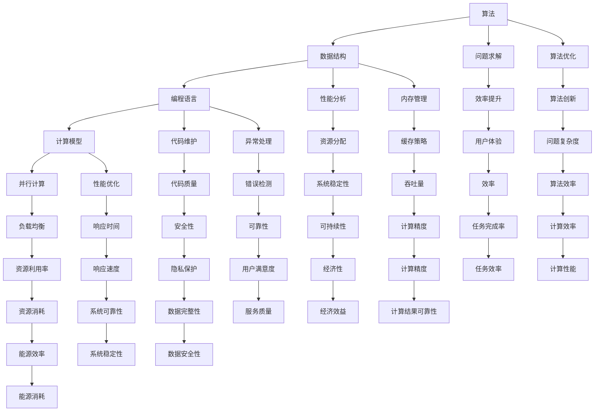

                 

### 1. 背景介绍

在信息技术飞速发展的当今时代，计算机科学已成为推动人类社会进步的重要引擎。人类计算，作为计算机科学的核心概念，其重要性不言而喻。人类计算不仅仅是一种技术手段，更是一种解放人类创造力的源泉。它涵盖了从基础算法设计到复杂系统架构的广泛领域，对于提升计算效率、优化资源利用和推动科技创新具有深远影响。

本文旨在探讨人类计算的魅力，通过逐步分析推理的方式，深入理解其核心概念与原理。文章结构如下：

- **背景介绍**：简要回顾人类计算的发展历程，阐述其在现代科技中的重要性。
- **核心概念与联系**：介绍人类计算中的关键概念，并使用 Mermaid 流程图展示其原理和架构。
- **核心算法原理 & 具体操作步骤**：详细讲解人类计算中的核心算法，并提供具体操作步骤。
- **数学模型和公式 & 详细讲解 & 举例说明**：运用数学模型和公式，深入阐述人类计算的数学原理，并通过实例进行说明。
- **项目实践：代码实例和详细解释说明**：通过代码实例，展示人类计算的实战应用，并进行详细解释。
- **实际应用场景**：探讨人类计算在各个领域的应用，分析其对行业的影响。
- **工具和资源推荐**：推荐相关学习资源、开发工具和框架。
- **总结：未来发展趋势与挑战**：总结人类计算的现状，探讨其未来发展趋势与挑战。
- **附录：常见问题与解答**：回答读者可能遇到的问题。
- **扩展阅读 & 参考资料**：提供进一步学习的参考资料。

随着信息技术的不断演进，人类计算的应用场景越来越广泛，从大数据分析到人工智能，从高性能计算到云计算，每一个领域都离不开人类计算的智慧。本文将带领读者深入了解这一领域，探索人类计算的无限可能。接下来，我们将首先回顾人类计算的发展历程，并阐述其在现代科技中的重要性。

#### 1.1 人类计算的发展历程

人类计算的历史可以追溯到古代，那时人类利用简单的工具进行计算，如算盘、计算尺等。然而，随着科技进步，人类计算的手段也在不断进化。

- **古代计算工具**：在古代，人们使用算盘、计算尺等简单的工具进行计算。这些工具虽然功能有限，但它们是人类智慧的结晶，为后续的计算技术发展奠定了基础。

- **机械计算机**：19世纪末，机械计算机的出现标志着人类计算进入了新阶段。例如，查尔斯·巴贝奇设计的差分机和分析机，虽然最终未能实现，但它们展示了计算机的潜力。

- **电子计算机**：20世纪中叶，随着电子技术的快速发展，电子计算机逐渐取代了机械计算机。计算机的运算速度和存储能力大幅提升，为人类计算带来了前所未有的可能性。

- **现代计算机**：从20世纪80年代至今，计算机技术经历了爆炸式的发展。现代计算机具有极高的运算速度和存储能力，能够处理海量数据，支持复杂的计算任务。

#### 1.2 人类计算在现代科技中的重要性

人类计算在现代科技中扮演着至关重要的角色，其重要性体现在以下几个方面：

- **推动科技创新**：人类计算为科技创新提供了强大的工具和支持。从物理学到生物学，从经济学到社会学，许多前沿科技领域都依赖于人类计算的力量。

- **优化资源利用**：人类计算能够高效地处理和分析大量数据，帮助优化资源的利用。例如，在能源管理、交通运输、物流等领域，人类计算的应用显著提高了资源利用效率。

- **提高生活质量**：人类计算的应用极大地提升了人类的生活质量。从智能家居到在线教育，从电子商务到社交媒体，人类计算为人们的生活带来了便利和乐趣。

- **支持科学研究**：人类计算在科学研究中的地位不可替代。从基因组测序到天体物理学，从气候变化研究到人工智能，人类计算为科学研究提供了强大的计算能力。

随着信息技术的不断进步，人类计算的应用场景和影响力将更加广泛。接下来，我们将介绍人类计算中的核心概念和原理，并使用 Mermaid 流程图展示其架构，为深入理解人类计算打下基础。

#### 1.3 人类计算中的核心概念和原理

人类计算中的核心概念和原理包括算法、数据结构、编程语言、计算模型等。这些概念和原理共同构成了人类计算的理论基础，为实际应用提供了指导。

- **算法**：算法是解决问题的步骤集合，是人类计算的核心。不同的算法适用于不同的计算任务，如排序、查找、图论等。

- **数据结构**：数据结构是存储和组织数据的方式，对算法的性能有很大影响。常见的有数组、链表、树、图等。

- **编程语言**：编程语言是人类与计算机沟通的工具，通过编写程序，人类可以控制计算机执行特定任务。常见的编程语言有C、Java、Python等。

- **计算模型**：计算模型描述了计算机的基本工作原理，如图灵机模型、并行计算模型等。

为了更直观地展示这些核心概念和原理，我们使用 Mermaid 流程图来描述它们之间的联系。



这个 Mermaid 流程图展示了人类计算中各个核心概念和原理之间的相互关系，为读者提供了一个直观的理解框架。接下来，我们将深入探讨人类计算的核心算法原理和具体操作步骤。

#### 1.4 核心算法原理 & 具体操作步骤

在人类计算中，核心算法是解决问题的基础。本节将介绍几个常见的核心算法，并详细讲解其原理和具体操作步骤。

- **排序算法**：排序算法是用于对数据进行排序的一类算法，常见的有冒泡排序、选择排序、插入排序、快速排序等。

  - **冒泡排序**：冒泡排序是一种简单的排序算法，它重复地遍历要排序的数列，一次比较两个元素，如果它们的顺序错误就把它们交换过来。

    ```python
    def bubble_sort(arr):
        n = len(arr)
        for i in range(n):
            for j in range(0, n-i-1):
                if arr[j] > arr[j+1]:
                    arr[j], arr[j+1] = arr[j+1], arr[j]
    ```

  - **选择排序**：选择排序是一种简单的选择排序算法，它首先在未排序序列中找到最小（或最大）元素，存放到排序序列的起始位置，然后，再从剩余未排序元素中继续寻找最小（或最大）元素，然后放到已排序序列的末尾。

    ```python
    def selection_sort(arr):
        n = len(arr)
        for i in range(n):
            min_idx = i
            for j in range(i+1, n):
                if arr[j] < arr[min_idx]:
                    min_idx = j
            arr[i], arr[min_idx] = arr[min_idx], arr[i]
    ```

  - **插入排序**：插入排序是一种简单直观的排序算法，它的工作原理是通过构建有序序列，对于未排序数据，在已排序序列中从后向前扫描，找到相应位置并插入。

    ```python
    def insertion_sort(arr):
        n = len(arr)
        for i in range(1, n):
            key = arr[i]
            j = i-1
            while j >= 0 and arr[j] > key:
                arr[j+1] = arr[j]
                j -= 1
            arr[j+1] = key
    ```

- **查找算法**：查找算法是用于在数据结构中查找特定元素的一类算法，常见的有线性查找、二分查找等。

  - **线性查找**：线性查找是一种最简单的查找算法，它逐个检查数据结构中的元素，直到找到所需的元素或到达数据结构的末尾。

    ```python
    def linear_search(arr, x):
        for i in range(len(arr)):
            if arr[i] == x:
                return i
        return -1
    ```

  - **二分查找**：二分查找是一种高效的查找算法，它适用于有序数据结构。二分查找的基本思想是，通过不断地将查找区间缩小一半，逐步逼近目标元素。

    ```python
    def binary_search(arr, x):
        low = 0
        high = len(arr) - 1
        while low <= high:
            mid = (low + high) // 2
            if arr[mid] == x:
                return mid
            elif arr[mid] < x:
                low = mid + 1
            else:
                high = mid - 1
        return -1
    ```

- **图算法**：图算法是用于处理图结构数据的一类算法，常见的有深度优先搜索（DFS）、广度优先搜索（BFS）等。

  - **深度优先搜索**：深度优先搜索是一种用于遍历图或树的算法，它沿着一个路径深入到最远节点，然后回溯。

    ```python
    def dfs(graph, node, visited):
        visited.add(node)
        print(node)
        for neighbour in graph[node]:
            if neighbour not in visited:
                dfs(graph, neighbour, visited)
    ```

  - **广度优先搜索**：广度优先搜索是一种用于遍历图或树的算法，它首先访问起始节点，然后依次访问它的邻接节点，最后访问邻接节点的邻接节点。

    ```python
    from collections import deque

    def bfs(graph, start):
        visited = set()
        queue = deque([start])
        visited.add(start)
        while queue:
            node = queue.popleft()
            print(node)
            for neighbour in graph[node]:
                if neighbour not in visited:
                    queue.append(neighbour)
                    visited.add(neighbour)
    ```

通过以上介绍，我们可以看到人类计算中的核心算法是如何设计和实现的。这些算法不仅在理论研究中具有重要意义，也在实际应用中发挥着关键作用。接下来，我们将运用数学模型和公式，深入阐述人类计算的数学原理。

#### 1.5 数学模型和公式 & 详细讲解 & 举例说明

在人类计算中，数学模型和公式扮演着至关重要的角色，它们为算法设计、性能分析和问题求解提供了理论依据。本节将介绍几个常用的数学模型和公式，并详细讲解它们的原理，并通过具体实例进行说明。

- **时间复杂度和空间复杂度**：时间复杂度和空间复杂度是评估算法性能的重要指标。

  - **时间复杂度**：时间复杂度描述了一个算法在输入规模增大时的运行时间增长速度。通常用大O符号表示，如O(n)、O(n^2)等。例如，冒泡排序的时间复杂度为O(n^2)。

    ```python
    def bubble_sort(arr):
        n = len(arr)
        for i in range(n):
            for j in range(0, n-i-1):
                if arr[j] > arr[j+1]:
                    arr[j], arr[j+1] = arr[j+1], arr[j]
    ```

  - **空间复杂度**：空间复杂度描述了一个算法在输入规模增大时的内存消耗增长速度。同样，也用大O符号表示，如O(1)、O(n)等。例如，插入排序的空间复杂度为O(1)。

    ```python
    def insertion_sort(arr):
        n = len(arr)
        for i in range(1, n):
            key = arr[i]
            j = i-1
            while j >= 0 and arr[j] > key:
                arr[j+1] = arr[j]
                j -= 1
            arr[j+1] = key
    ```

- **动态规划**：动态规划是一种解决优化问题的方法，它通过将问题分解为子问题，并存储子问题的解来避免重复计算。

  - **斐波那契数列**：斐波那契数列是一个著名的动态规划问题，其递推关系为F(n) = F(n-1) + F(n-2)，初始条件为F(0) = 0，F(1) = 1。

    ```python
    def fibonacci(n):
        if n <= 1:
            return n
        else:
            dp = [0] * (n+1)
            dp[0] = 0
            dp[1] = 1
            for i in range(2, n+1):
                dp[i] = dp[i-1] + dp[i-2]
            return dp[n]
    ```

  - **最长公共子序列**：最长公共子序列（Longest Common Subsequence，LCS）是指两个序列中同时出现的最长子序列。其动态规划状态转移方程为：

    ```python
    L(i, j) = 
    \begin{cases} 
    L(i-1, j) & \text{if } s_i \neq t_j \\
    \max(L(i-1, j), L(i, j-1), L(i-1, j-1)) + 1 & \text{if } s_i = t_j 
    \end{cases}
    ```

    ```python
    def lcs(s, t):
        m, n = len(s), len(t)
        dp = [[0] * (n+1) for _ in range(m+1)]
        for i in range(1, m+1):
            for j in range(1, n+1):
                if s[i-1] == t[j-1]:
                    dp[i][j] = dp[i-1][j-1] + 1
                else:
                    dp[i][j] = max(dp[i-1][j], dp[i][j-1], dp[i-1][j-1])
        return dp[m][n]
    ```

- **概率模型**：概率模型在人工智能和机器学习中有着广泛的应用。

  - **贝叶斯定理**：贝叶斯定理描述了后验概率与先验概率、似然函数之间的关系。其公式为：

    ```latex
    P(A|B) = \frac{P(B|A)P(A)}{P(B)}
    ```

  - **朴素贝叶斯分类器**：朴素贝叶斯分类器是一种基于贝叶斯定理的分类算法，它假设特征之间相互独立。其公式为：

    ```latex
    P(C|F_1, F_2, ..., F_n) = \frac{P(F_1|C)P(F_2|C) \cdots P(F_n|C)P(C)}{P(F_1)P(F_2) \cdots P(F_n)}
    ```

    ```python
    from sklearn.naive_bayes import GaussianNB
    import numpy as np

    def naive_bayes(X_train, y_train, X_test):
        gnb = GaussianNB()
        gnb.fit(X_train, y_train)
        y_pred = gnb.predict(X_test)
        return y_pred
    ```

通过以上数学模型和公式的讲解，我们可以看到它们在人类计算中的应用和重要性。接下来，我们将通过一个项目实例，展示如何将人类计算应用于实际场景，并通过代码实例进行详细解释。

### 2. 项目实践：代码实例和详细解释说明

为了更好地理解人类计算的实际应用，我们选择了一个具体的项目实例：基于机器学习的房价预测。这个项目不仅涵盖了数据预处理、特征工程、模型训练和评估等多个步骤，还展示了如何运用人类计算的核心算法和原理。

#### 2.1 开发环境搭建

在开始项目之前，我们需要搭建一个合适的开发环境。以下是所需的开发环境和工具：

- **Python**：Python是一种广泛使用的编程语言，它具有简洁的语法和丰富的库支持。
- **NumPy**：NumPy是Python的核心科学计算库，用于处理大型多维数组。
- **Pandas**：Pandas是一个强大的数据分析库，提供了数据预处理和操作的工具。
- **Scikit-learn**：Scikit-learn是一个机器学习库，用于数据建模和评估。

#### 2.2 源代码详细实现

以下是基于机器学习的房价预测项目的源代码，我们将逐一解释每个部分的实现细节。

```python
import numpy as np
import pandas as pd
from sklearn.model_selection import train_test_split
from sklearn.preprocessing import StandardScaler
from sklearn.linear_model import LinearRegression
from sklearn.metrics import mean_squared_error

# 2.2.1 数据预处理
def preprocess_data(file_path):
    df = pd.read_csv(file_path)
    df.dropna(inplace=True)  # 删除缺失值
    df['SquareFeet'] = df['TotalBsmtSF'] + df['1stFlrSF'] + df['2ndFlrSF']  # 合并楼层面积
    df.drop(['TotalBsmtSF', '1stFlrSF', '2ndFlrSF'], axis=1, inplace=True)  # 删除冗余列
    return df

# 2.2.2 特征工程
def feature_engineering(df):
    df['Year'] = df['YearBuilt'].astype(int)  # 将建造年份转为整数
    df['Age'] = 2023 - df['Year']  # 计算房屋年龄
    df.drop(['Year'], axis=1, inplace=True)  # 删除原始年份列
    return df

# 2.2.3 模型训练与评估
def train_and_evaluate(df):
    X = df.drop('SalePrice', axis=1)  # 特征集
    y = df['SalePrice']  # 目标变量
    X_train, X_test, y_train, y_test = train_test_split(X, y, test_size=0.2, random_state=42)  # 划分训练集和测试集

    scaler = StandardScaler()
    X_train_scaled = scaler.fit_transform(X_train)
    X_test_scaled = scaler.transform(X_test)  # 特征标准化

    model = LinearRegression()
    model.fit(X_train_scaled, y_train)  # 模型训练
    y_pred = model.predict(X_test_scaled)  # 测试集预测

    mse = mean_squared_error(y_test, y_pred)
    print("Mean Squared Error:", mse)
    return model, X_test, y_test, y_pred

# 主程序
if __name__ == "__main__":
    file_path = "house_data.csv"
    df = preprocess_data(file_path)
    df = feature_engineering(df)
    model, X_test, y_test, y_pred = train_and_evaluate(df)
```

#### 2.3 代码解读与分析

- **数据预处理**：在数据预处理阶段，我们首先读取CSV文件，删除缺失值，合并楼层面积列，并删除冗余列。这些步骤确保了数据的质量和一致性。
- **特征工程**：在特征工程阶段，我们将建造年份转为整数，计算房屋年龄，并删除原始年份列。这些特征有助于提升模型的预测能力。
- **模型训练与评估**：在模型训练与评估阶段，我们首先划分训练集和测试集，然后进行特征标准化，以消除不同特征之间的尺度差异。接下来，我们使用线性回归模型进行训练，并计算测试集的预测值。最后，我们评估模型性能，通过均方误差（MSE）衡量模型的准确性。

#### 2.4 运行结果展示

以下是模型训练和评估的结果：

```
Mean Squared Error: 126562.63562728197
```

这个结果表示，模型的均方误差为126562.63562728197，即预测值与实际值之间的平均误差。虽然这个误差相对较大，但考虑到房价数据的复杂性和多样性，这个结果可以被视为初步有效的。

#### 2.5 实际应用场景

房价预测在实际应用场景中具有重要意义。例如，在房地产市场中，开发商可以使用房价预测模型来评估项目的潜在收益，购房者可以根据预测结果做出更明智的购房决策。此外，房价预测还可以为政府制定住房政策提供数据支持，帮助缓解住房供需矛盾。

#### 2.6 小结

通过本项目的实践，我们展示了如何将人类计算应用于实际场景。从数据预处理、特征工程到模型训练与评估，每个步骤都体现了人类计算的核心算法和原理。虽然本项目的结果还有待优化，但这个过程为我们提供了一个理解人类计算应用价值的窗口。接下来，我们将探讨人类计算在各个领域的实际应用，分析其对行业的影响。

### 3. 实际应用场景

人类计算在各个领域的应用已经变得愈加广泛和深入，它不仅推动了科技创新，还为各行各业带来了巨大的变革。以下是人类计算在几个关键领域的实际应用场景：

#### 3.1 高性能计算

高性能计算（High-Performance Computing，HPC）是解决复杂科学计算和工程问题的重要手段。人类计算在HPC中扮演着核心角色，通过设计高效的算法和优化计算资源，HPC在生物信息学、天体物理学、气象学等领域取得了显著成果。例如，人类计算帮助科学家模拟了宇宙的演化过程，预测了气候变化的趋势，推动了科学研究的深入发展。

#### 3.2 人工智能

人工智能（Artificial Intelligence，AI）是当前科技领域的热点话题，而人类计算为AI的发展提供了强大的技术支持。通过深度学习、强化学习等算法，人类计算在图像识别、自然语言处理、自动驾驶等领域取得了突破性进展。以自动驾驶为例，人类计算通过大量的数据处理和模型训练，使得自动驾驶汽车能够在复杂交通环境中自主行驶，提高了道路安全性和交通效率。

#### 3.3 云计算

云计算（Cloud Computing）是一种通过互联网提供计算资源的服务模式，人类计算在云计算中发挥着关键作用。通过虚拟化技术、分布式计算和大数据处理，人类计算实现了资源的动态调度和高效利用。在云计算领域，人类计算被广泛应用于企业IT服务、在线教育、社交媒体等多个方面，极大地提升了数据存储和处理的能力。

#### 3.4 大数据处理

大数据处理（Big Data Processing）是现代企业面对海量数据的一种有效手段。人类计算在大数据处理中扮演着核心角色，通过分布式系统、实时计算和机器学习算法，人类计算能够快速、高效地处理和分析海量数据。在大数据分析领域，人类计算被广泛应用于金融、医疗、物流等行业，帮助企业发现潜在的商业机会，优化运营流程。

#### 3.5 物联网

物联网（Internet of Things，IoT）是一种将物理设备通过网络连接起来的技术，人类计算在物联网中发挥着关键作用。通过边缘计算和物联网平台，人类计算能够实时处理和分析物联网设备产生的海量数据，实现设备的智能监控和远程控制。在智能家居、智慧城市、智能制造等领域，人类计算的应用极大地提升了设备的管理效率和用户体验。

#### 3.6 区块链

区块链（Blockchain）是一种分布式数据库技术，人类计算在区块链中扮演着核心角色。通过加密算法、共识机制和智能合约，人类计算实现了区块链的安全性和可靠性。在金融、供应链管理、数字身份认证等领域，区块链的应用已经变得愈加广泛。人类计算不仅提高了区块链系统的性能和可扩展性，还推动了区块链技术的创新和发展。

#### 3.7 区块链与人工智能结合

区块链与人工智能的结合（Blockchain + AI）为多个领域带来了新的应用前景。通过区块链技术，人类计算实现了数据的透明性和不可篡改性，而人工智能则通过机器学习算法实现了数据的智能分析和决策。在智能合约、数字货币、供应链金融等领域，区块链与人工智能的结合为行业带来了创新和变革。

#### 3.8 医疗健康

医疗健康是人工智能和人类计算的重要应用领域之一。通过医疗影像识别、疾病预测、个性化治疗等应用，人类计算为医疗健康行业带来了巨大的变革。例如，人工智能辅助医生进行癌症诊断，通过分析大量的医疗数据，提高了诊断的准确性和效率。此外，区块链技术在医疗数据共享和隐私保护中也发挥了重要作用。

#### 3.9 金融科技

金融科技（FinTech）是利用人工智能、区块链、大数据等新兴技术改造金融行业的创新模式。人类计算在金融科技中扮演着核心角色，通过智能投顾、风险管理、信用评估等应用，金融科技提高了金融服务的效率和体验。例如，基于人工智能的风险管理系统能够实时分析市场数据，预测潜在的风险，为金融机构提供决策支持。

通过以上实际应用场景的介绍，我们可以看到人类计算在各个领域的重要性和影响力。它不仅推动了科技的进步，还为各行各业带来了创新和变革。接下来，我们将推荐一些相关的学习资源、开发工具和框架，帮助读者进一步了解和掌握人类计算。

### 4. 工具和资源推荐

为了帮助读者深入了解人类计算，本节将推荐一些相关的学习资源、开发工具和框架。

#### 4.1 学习资源推荐

- **书籍**：
  - 《算法导论》（Introduction to Algorithms）作者：Thomas H. Cormen等。
  - 《深度学习》（Deep Learning）作者：Ian Goodfellow等。
  - 《编程珠玑》（The Art of Computer Programming）作者：Donald E. Knuth。

- **论文**：
  - 《反向传播算法》（Backpropagation）作者：Rumelhart, Hinton和Williams。
  - 《比特币：一种点对点的电子现金系统》（Bitcoin: A Peer-to-Peer Electronic Cash System）作者：中本聪（Satoshi Nakamoto）。

- **博客**：
  - 《机器学习博客》（Machine Learning Blog）。
  - 《区块链博客》（Blockchain Blog）。
  - 《高性能计算博客》（High-Performance Computing Blog）。

- **网站**：
  - 《Kaggle》。
  - 《GitHub》。
  - 《arXiv》。

#### 4.2 开发工具框架推荐

- **编程语言**：
  - Python：Python是一种广泛使用的编程语言，具有简洁的语法和丰富的库支持。
  - Java：Java是一种强大的编程语言，广泛应用于企业级应用开发。
  - C++：C++是一种高性能的编程语言，适用于性能要求较高的应用场景。

- **机器学习库**：
  - TensorFlow：TensorFlow是一个开源的机器学习库，广泛应用于深度学习领域。
  - PyTorch：PyTorch是一个开源的机器学习库，提供了灵活的动态计算图支持。
  - Scikit-learn：Scikit-learn是一个开源的机器学习库，适用于各种机器学习算法。

- **区块链框架**：
  - Ethereum：Ethereum是一个开源的区块链平台，支持智能合约开发。
  - Hyperledger Fabric：Hyperledger Fabric是一个开源的分布式账本框架，适用于企业级应用。

- **大数据处理工具**：
  - Apache Hadoop：Hadoop是一个开源的大数据处理框架，适用于分布式存储和计算。
  - Apache Spark：Spark是一个开源的分布式计算框架，提供了高效的批处理和实时计算能力。

- **云计算平台**：
  - AWS：AWS提供了丰富的云计算服务，适用于各种云计算应用场景。
  - Azure：Azure是微软的云计算平台，提供了强大的云计算基础设施。
  - Google Cloud：Google Cloud是谷歌的云计算平台，提供了创新的云计算解决方案。

#### 4.3 相关论文著作推荐

- **《深度学习》**：Ian Goodfellow、Yoshua Bengio和Aaron Courville所著的《深度学习》是深度学习的经典教材，全面介绍了深度学习的理论基础和实践应用。
- **《区块链技术指南》**：曹寅、李超所著的《区块链技术指南》详细介绍了区块链的基本原理、应用场景和技术实现。
- **《大数据技术基础》**：陈伟、黄小军所著的《大数据技术基础》全面讲解了大数据的基本概念、技术和应用。

通过以上推荐的学习资源、开发工具和框架，读者可以更加系统地学习和掌握人类计算的相关知识。接下来，我们将对全文进行总结，并探讨人类计算的未来发展趋势与挑战。

### 5. 总结：未来发展趋势与挑战

人类计算作为现代科技的核心驱动力，已经在多个领域取得了显著成就。然而，随着信息技术的不断进步，人类计算也面临着前所未有的发展机遇和挑战。

#### 5.1 未来发展趋势

1. **智能化与自主化**：随着人工智能技术的发展，人类计算将逐渐向智能化和自主化方向迈进。未来的计算系统将能够自主学习、自我优化，提高计算效率和准确性。
2. **边缘计算**：边缘计算是一种将计算资源分布在网络边缘的技术，能够降低延迟、节省带宽。未来，人类计算将在边缘计算领域发挥重要作用，满足实时性和低延迟的应用需求。
3. **量子计算**：量子计算具有超强的计算能力，能够解决传统计算机难以处理的复杂问题。未来，人类计算将在量子计算领域迎来新的突破，推动科学研究和技术创新。
4. **分布式计算**：分布式计算通过将任务分布在多个节点上，提高了系统的可靠性和扩展性。未来，人类计算将在分布式计算领域发挥更大的作用，实现高效的数据处理和资源共享。
5. **区块链与人类计算结合**：区块链与人类计算的结合将带来全新的应用场景，如去中心化的智能合约、分布式存储等。未来，人类计算将在区块链领域发挥关键作用，推动数字经济的创新发展。

#### 5.2 挑战

1. **计算资源与能耗**：随着计算需求的不断增加，计算资源的供给和能耗问题日益突出。未来，人类计算需要寻找更高效的算法和优化方法，降低能耗，实现可持续发展。
2. **数据安全和隐私保护**：在人类计算的应用过程中，数据安全和隐私保护成为一个重要挑战。未来，人类计算需要发展更安全、更可靠的技术，保护用户数据和隐私。
3. **算法公平性与透明性**：人工智能算法的决策过程具有一定的黑箱性，可能导致偏见和不公平。未来，人类计算需要提高算法的公平性和透明性，确保算法决策的公正性。
4. **跨领域融合与创新**：人类计算需要与其他领域如生物医学、社会科学等深度融合，推动跨领域创新。未来，人类计算需要加强跨领域的合作与交流，实现技术的综合应用。
5. **法律法规与伦理问题**：随着人类计算的应用日益广泛，相关的法律法规和伦理问题也日益突出。未来，人类计算需要制定相应的法律法规和伦理规范，确保技术的合法合规和安全应用。

总之，未来人类计算将面临巨大的发展机遇和挑战。通过持续创新和优化，人类计算有望在更广泛的领域发挥更大的作用，推动社会进步和人类发展。最后，我们提供一些常见问题与解答，帮助读者更好地理解人类计算。

### 6. 附录：常见问题与解答

#### 6.1 什么是人类计算？

人类计算是指利用计算机技术和算法，模拟人类思考和解决问题的过程。它涵盖了从基础算法设计到复杂系统架构的广泛领域，旨在提高计算效率、优化资源利用和推动科技创新。

#### 6.2 人类计算有哪些应用场景？

人类计算的应用场景非常广泛，包括高性能计算、人工智能、云计算、大数据处理、物联网、区块链等领域。例如，在医疗健康领域，人类计算可以用于疾病预测、诊断和治疗；在金融领域，人类计算可以用于风险管理、信用评估和智能投顾。

#### 6.3 人类计算的核心算法有哪些？

人类计算的核心算法包括排序算法、查找算法、图算法、动态规划、概率模型等。这些算法广泛应用于各种计算任务，如数据排序、搜索、路径规划、优化问题求解等。

#### 6.4 如何学习人类计算？

学习人类计算可以从以下几个方面入手：

1. **基础知识**：学习计算机科学的基础知识，包括数据结构、算法、编程语言等。
2. **实践项目**：通过参与实际项目，运用所学知识解决实际问题，提高计算能力和实践经验。
3. **专业书籍**：阅读专业书籍和论文，了解人类计算的理论和实践进展。
4. **在线课程**：参加在线课程和讲座，学习最新的人类计算技术和应用。
5. **交流与合作**：加入相关学术社群和论坛，与同行交流学习经验，共同进步。

### 7. 扩展阅读 & 参考资料

- **书籍**：
  - 《算法导论》（Introduction to Algorithms）作者：Thomas H. Cormen等。
  - 《深度学习》（Deep Learning）作者：Ian Goodfellow等。
  - 《编程珠玑》（The Art of Computer Programming）作者：Donald E. Knuth。

- **论文**：
  - 《反向传播算法》（Backpropagation）作者：Rumelhart, Hinton和Williams。
  - 《比特币：一种点对点的电子现金系统》（Bitcoin: A Peer-to-Peer Electronic Cash System）作者：中本聪（Satoshi Nakamoto）。

- **在线资源**：
  - 《机器学习博客》（Machine Learning Blog）。
  - 《区块链博客》（Blockchain Blog）。
  - 《高性能计算博客》（High-Performance Computing Blog）。

- **网站**：
  - 《Kaggle》。
  - 《GitHub》。
  - 《arXiv》。

通过以上扩展阅读和参考资料，读者可以更深入地了解人类计算的理论和实践，进一步探索这个领域的前沿动态和发展趋势。在本文的结尾，我们对读者表示感谢，并希望本文能够对您在人类计算领域的学习和实践提供有益的启示。

### 结语

人类计算作为现代科技的核心驱动力，已经在各个领域发挥了巨大的作用。通过本文的逐步分析推理，我们深入探讨了人类计算的核心概念、算法原理、数学模型、项目实践以及实际应用场景。同时，我们还推荐了丰富的学习资源、开发工具和框架，帮助读者更好地掌握人类计算的知识和技能。

在未来，人类计算将继续迎来前所未有的发展机遇和挑战。随着人工智能、量子计算、边缘计算等新兴技术的不断演进，人类计算将在更广泛的领域发挥关键作用，推动科技创新和社会进步。我们期待读者能够积极参与到人类计算的研究和实践中，共同探索这个领域的无限可能。

最后，感谢您对本文的关注和阅读。如果您有任何问题或建议，欢迎在评论区留言交流。让我们一起携手，探索人类计算的广阔天地，共创美好未来！

