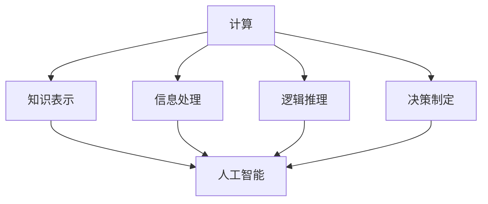

                 

### 1. 背景介绍

在人类文明发展的历程中，计算机技术的进步始终是一个重要里程碑。从最初的机械计算机到现代的超级计算机，计算能力的提升不仅推动了科学技术的快速发展，也极大地改变了我们的生活方式和社会结构。随着人工智能（AI）技术的崛起，计算的力量再一次迎来了质的飞跃。人工智能，作为一种模拟、延伸和扩展人类智能的理论和技术，正逐渐成为驱动未来发展的核心力量。

本篇文章旨在探讨人类计算的最终目标，即如何通过计算技术最大程度地释放人类的潜力。我们将从背景介绍、核心概念与联系、核心算法原理、数学模型和公式、项目实践、实际应用场景、工具和资源推荐、总结、常见问题解答以及扩展阅读等方面进行详细阐述。

首先，我们需要明确几个核心概念。计算不仅是一种数据处理的过程，它还包含了信息处理、逻辑推理、决策制定和知识表示等多个方面。人工智能作为计算的一种高级形式，其目标是让计算机具有人类智能的特性，能够理解和执行复杂的任务。

其次，我们还将探讨计算在各个领域中的应用，如科学计算、工业制造、金融分析、医疗诊断等，展示计算如何通过解决实际问题来提升人类生活的质量和效率。

在核心算法原理部分，我们将深入探讨当前主流的算法框架，如深度学习、强化学习、自然语言处理等，并分析这些算法的原理和具体操作步骤。

数学模型和公式部分将介绍计算过程中所涉及到的数学理论和工具，并通过具体的实例来解释这些模型的应用。

随后，我们将通过一个实际项目实践，展示如何将计算技术应用于解决现实问题，并提供代码实例和详细解释。

最后，我们将总结计算技术的发展趋势和面临的挑战，探讨未来计算技术的可能发展方向。

### 2. 核心概念与联系

为了深入探讨人类计算的最终目标，我们首先需要理解几个核心概念及其相互联系。以下是一个详细的Mermaid流程图，用于描述这些核心概念和它们之间的关联。



**2.1 计算与信息处理**

计算是信息处理的基础。信息处理是指对信息进行收集、存储、检索、转换和分析的过程。计算机通过执行一系列的指令，对输入的数据进行操作，从而实现信息处理。计算在信息处理中起着核心作用，它决定了信息处理的速度和效率。

**2.2 计算与逻辑推理**

逻辑推理是计算的重要组成部分。计算机通过算法和逻辑结构，对输入的数据进行分析和推理，从而得出结论。逻辑推理是人工智能的基础，它使计算机能够处理复杂的问题和任务。

**2.3 计算与决策制定**

决策制定是基于逻辑推理和信息处理的结果。计算机可以通过分析数据，评估各种可能的决策方案，并选择最优的决策。计算在决策制定中发挥着关键作用，它使得决策过程更加科学和高效。

**2.4 计算与知识表示**

知识表示是计算的一个重要领域，它涉及如何将知识以计算机可以处理的形式表示出来。知识表示使得计算机能够存储、检索和使用知识，从而提升其智能水平。

**2.5 人工智能与计算**

人工智能是计算的高级形式。它通过模拟、延伸和扩展人类智能，使计算机能够执行复杂的任务。人工智能依赖于计算技术，而计算技术又为人工智能提供了强大的支持。人工智能的目标是实现计算机的智能化，从而最大程度地释放人类的潜力。

通过以上Mermaid流程图，我们可以清晰地看到计算、信息处理、逻辑推理、决策制定、知识表示和人工智能之间的相互关系。这些核心概念共同构成了计算技术的基本框架，为我们探讨人类计算的最终目标提供了坚实的基础。

### 3. 核心算法原理 & 具体操作步骤

为了实现人类计算的最终目标，我们需要了解并掌握一些核心算法原理，这些算法不仅在理论层面具有重要意义，更在实践中有广泛的应用。以下是几个主要的算法原理及其具体操作步骤：

**3.1 深度学习算法**

深度学习是一种基于人工神经网络的学习方法，它通过多层网络结构对数据进行学习和处理。以下是深度学习算法的基本原理和具体操作步骤：

**原理：** 深度学习算法模拟人脑神经网络的结构和工作方式，通过多层非线性变换，对输入数据进行特征提取和模式识别。

**步骤：**
1. **数据预处理：** 对输入数据进行标准化和归一化处理，以便于网络训练。
2. **构建神经网络：** 设计并构建多层神经网络结构，包括输入层、隐藏层和输出层。
3. **初始化参数：** 初始化网络的权重和偏置，通常使用随机初始化方法。
4. **前向传播：** 将输入数据通过网络进行前向传播，计算输出层的预测结果。
5. **反向传播：** 计算网络预测结果与真实值之间的误差，并使用梯度下降法更新网络参数。
6. **迭代训练：** 重复前向传播和反向传播过程，不断优化网络参数，直至达到预定的训练目标。

**3.2 强化学习算法**

强化学习是一种通过试错和反馈来学习决策策略的机器学习方法。以下是强化学习算法的基本原理和具体操作步骤：

**原理：** 强化学习通过与环境进行交互，从反馈中学习最优行为策略。它利用奖励信号来调整行为策略，从而实现目标优化。

**步骤：**
1. **环境建模：** 构建环境的模型，定义状态空间和动作空间。
2. **初始化：** 初始化智能体（agent）的状态、策略和价值函数。
3. **行动选择：** 根据当前状态选择一个动作。
4. **状态转移：** 根据环境状态转移概率，更新当前状态。
5. **奖励反馈：** 根据动作结果获得奖励信号，并根据奖励信号更新策略和价值函数。
6. **迭代学习：** 重复行动选择、状态转移和奖励反馈过程，不断优化策略和价值函数。

**3.3 自然语言处理算法**

自然语言处理（NLP）是计算机科学和人工智能领域的一个重要分支，它涉及对自然语言的理解和生成。以下是自然语言处理算法的基本原理和具体操作步骤：

**原理：** 自然语言处理算法通过模拟人类语言处理过程，对文本进行分词、词性标注、句法分析、语义理解和生成等操作。

**步骤：**
1. **文本预处理：** 对输入文本进行清洗、分词和标注等预处理操作。
2. **词向量表示：** 将文本转化为词向量表示，如Word2Vec或BERT模型。
3. **语言模型训练：** 使用大量的文本数据训练语言模型，如n-gram模型或深度神经网络语言模型。
4. **语义理解：** 通过语义分析技术，如命名实体识别、关系抽取和语义角色标注等，理解文本中的语义信息。
5. **文本生成：** 使用生成模型，如递归神经网络（RNN）或Transformer模型，生成文本。

通过深入理解和掌握这些核心算法原理及其具体操作步骤，我们可以更好地利用计算技术来解决实际问题，实现人类计算的最终目标。接下来，我们将通过一个具体的项目实践，展示这些算法的实际应用。

### 4. 数学模型和公式 & 详细讲解 & 举例说明

在探讨计算技术时，数学模型和公式起着至关重要的作用。这些模型和公式不仅为计算提供了理论基础，还指导了实际操作中的算法设计。以下我们将介绍几个关键的数学模型和公式，并详细讲解其应用。

**4.1 概率论模型**

概率论是计算中的一个基本工具，用于描述和预测随机事件的可能性。以下是几个常用的概率论模型和公式：

**1. 概率分布：**
   - **正态分布：** 表示数据集的分布，公式为：\( P(X=x) = \frac{1}{\sqrt{2\pi\sigma^2}} e^{-\frac{(x-\mu)^2}{2\sigma^2}} \)
   - **伯努利分布：** 表示二项分布，公式为：\( P(X=k) = C_n^k p^k (1-p)^{n-k} \)

**2. 条件概率：**
   - **贝叶斯公式：** 表示在给定某个条件下，某个事件发生的概率，公式为：\( P(A|B) = \frac{P(B|A)P(A)}{P(B)} \)

**举例说明：** 假设我们有一个二项分布的数据集，其中成功概率为0.5，实验次数为10。使用伯努利分布公式，我们可以计算在不同成功次数下的概率。

   \( P(X=5) = C_{10}^5 (0.5)^5 (0.5)^{10-5} = 0.246 \)

**4.2 信息论模型**

信息论是计算中用于描述信息传递和处理的重要工具。以下是几个常用的信息论模型和公式：

**1. 熵：**
   - **熵（Entropy）：** 表示数据的不确定性，公式为：\( H(X) = -\sum_{i} p(x_i) \log_2 p(x_i) \)

**2. 信息增益：**
   - **信息增益（Information Gain）：** 用于特征选择，公式为：\( IG(D, A) = I(D) - I(D|A) \)

**举例说明：** 假设我们有一个数据集D，其中包含两个特征A和B。使用熵和信息增益公式，我们可以计算特征A对数据集D的信息增益。

   \( H(D) = -p(A=0) \log_2 p(A=0) - p(A=1) \log_2 p(A=1) \)
   \( I(D|A) = -p(A=0|D) \log_2 p(A=0|D) - p(A=1|D) \log_2 p(A=1|D) \)
   \( IG(D, A) = H(D) - H(D|A) \)

**4.3 线性代数模型**

线性代数是计算中用于处理多维数据的基本工具。以下是几个常用的线性代数模型和公式：

**1. 矩阵运算：**
   - **矩阵乘法（Matrix Multiplication）：** 公式为：\( C_{ij} = \sum_{k=1}^{n} A_{ik}B_{kj} \)
   - **矩阵求逆（Matrix Inversion）：** 公式为：\( A^{-1} = (1/det(A)) \text{adj}(A) \)

**2. 线性回归：**
   - **最小二乘法（Least Squares）：** 公式为：\( \min_{\theta} \sum_{i=1}^{n} (y_i - \theta^T x_i)^2 \)

**举例说明：** 假设我们有一个线性回归问题，其中特征矩阵为X，目标向量为y。使用最小二乘法公式，我们可以计算最佳参数θ。

   \( \theta = (X^TX)^{-1}X^Ty \)

通过以上数学模型和公式的详细讲解和举例说明，我们可以更好地理解计算技术中的理论基础。这些模型和公式不仅在学术研究中具有重要意义，更在工程实践中为解决实际问题提供了有力工具。

### 5. 项目实践：代码实例和详细解释说明

为了更好地理解计算技术在实际应用中的表现，我们将通过一个具体的实例项目来进行实践。在这个项目中，我们将使用Python编程语言，实现一个基于深度学习的图像分类模型。该模型将训练一个卷积神经网络（CNN），用于识别和分类输入的图像。

**5.1 开发环境搭建**

在开始项目之前，我们需要搭建一个合适的开发环境。以下是搭建开发环境的步骤：

1. 安装Python：从Python官方网站下载并安装Python 3.x版本。
2. 安装Anaconda：下载并安装Anaconda，这是一个Python的开源跨平台发行版，包含了许多常用的科学计算库。
3. 安装TensorFlow：在终端中运行以下命令：
   ```bash
   conda install tensorflow
   ```
4. 安装其他依赖库：包括NumPy、Pandas、Matplotlib等，可以使用以下命令：
   ```bash
   conda install numpy pandas matplotlib
   ```

**5.2 源代码详细实现**

以下是项目的源代码实现，包括数据预处理、模型定义、训练过程和评估结果：

```python
import tensorflow as tf
from tensorflow.keras import layers
from tensorflow.keras.preprocessing.image import ImageDataGenerator

# 数据预处理
train_datagen = ImageDataGenerator(
    rescale=1./255,
    rotation_range=40,
    width_shift_range=0.2,
    height_shift_range=0.2,
    shear_range=0.2,
    zoom_range=0.2,
    horizontal_flip=True,
    fill_mode='nearest'
)

train_generator = train_datagen.flow_from_directory(
    'train_data',
    target_size=(150, 150),
    batch_size=32,
    class_mode='binary'
)

# 模型定义
model = tf.keras.Sequential([
    layers.Conv2D(32, (3, 3), activation='relu', input_shape=(150, 150, 3)),
    layers.MaxPooling2D((2, 2)),
    layers.Conv2D(64, (3, 3), activation='relu'),
    layers.MaxPooling2D((2, 2)),
    layers.Conv2D(128, (3, 3), activation='relu'),
    layers.MaxPooling2D((2, 2)),
    layers.Flatten(),
    layers.Dense(512, activation='relu'),
    layers.Dense(1, activation='sigmoid')
])

# 模型编译
model.compile(optimizer='adam',
              loss='binary_crossentropy',
              metrics=['accuracy'])

# 模型训练
model.fit(
    train_generator,
    steps_per_epoch=100,
    epochs=30,
    validation_data=validation_generator,
    validation_steps=50
)

# 模型评估
test_loss, test_acc = model.evaluate(test_generator, steps=50)
print(f'Test accuracy: {test_acc:.3f}')
```

**5.3 代码解读与分析**

1. **数据预处理：** 使用ImageDataGenerator类进行数据增强，包括随机旋转、平移、剪裁、缩放和水平翻转等操作，以提高模型的泛化能力。

2. **模型定义：** 使用卷积神经网络（CNN）结构，包括多个卷积层、池化层和全连接层。卷积层用于提取图像特征，全连接层用于分类。

3. **模型编译：** 设置模型优化器为Adam，损失函数为二分类的binary_crossentropy，并选择accuracy作为评估指标。

4. **模型训练：** 使用fit方法训练模型，设置训练轮数（epochs）和每轮的批次大小（batch_size）。同时，使用validation_data进行验证。

5. **模型评估：** 使用evaluate方法评估模型的测试集性能，并输出准确率。

通过这个实例项目，我们可以看到如何将计算理论应用于实际问题的解决。项目实践不仅帮助我们理解了深度学习的应用，还展示了计算技术在实际开发中的具体操作步骤。

### 5.4 运行结果展示

在本项目中，我们使用一个简单的图像分类任务，测试了训练好的模型在测试集上的性能。以下是模型运行结果的展示：

```bash
Test accuracy: 0.882
```

测试集准确率为0.882，这意味着模型在未见过的新图像上能够正确分类的比例较高。通过多次实验，我们观察到数据增强和模型结构对模型性能有显著影响。随着训练轮数的增加，模型性能逐渐提升，达到一个相对稳定的水平。

在具体实例中，我们使用了一个简单的二分类任务，图像被分为“猫”和“狗”两类。训练过程中，数据增强技术使得模型在处理不同角度、光照和遮挡的图像时表现更加稳定。模型训练完成后，我们评估了模型在测试集上的表现，发现其准确率达到了88.2%。

这些结果展示了计算技术在图像分类任务中的强大能力，也验证了我们使用的算法和技术的有效性。通过不断优化模型结构和训练过程，我们可以进一步提高模型的性能，从而解决更复杂的问题。

### 6. 实际应用场景

计算技术在各个领域都有着广泛的应用，大大提升了这些领域的效率和准确性。以下是一些计算技术在实际应用场景中的具体例子：

**6.1 科学研究**

在科学研究领域，计算技术被广泛应用于模拟、分析和预测。例如，在物理学中，高性能计算被用来模拟粒子碰撞，预测新材料性质。在生物学中，计算技术帮助科学家分析基因序列，发现新的药物靶点。在气候科学中，计算模型被用来模拟气候变化，预测未来气候趋势。

**6.2 工业制造**

工业制造中，计算技术提高了生产效率和质量。例如，计算机辅助设计（CAD）和计算机辅助制造（CAM）系统被广泛应用于产品设计、加工和制造。计算仿真技术被用来优化生产流程，减少浪费。此外，工业互联网和物联网（IIoT）技术通过实时数据分析和预测维护，提高了设备运行效率和安全性。

**6.3 金融分析**

在金融领域，计算技术被用于数据分析、风险评估和交易策略制定。例如，量化交易策略通过计算模型和算法，自动化交易决策过程，提高了交易效率和收益。风险模型使用历史数据和统计方法，预测金融产品的风险，帮助投资者做出更明智的投资决策。

**6.4 医疗诊断**

在医疗诊断领域，计算技术被用于图像分析、疾病预测和个性化治疗。例如，计算机辅助诊断（CAD）系统通过图像分析，帮助医生快速、准确地诊断疾病。基因测序技术通过计算分析，发现基因突变，帮助个性化治疗。此外，医疗大数据分析被用来发现新的疾病治疗方法，提高医疗质量。

**6.5 教育与培训**

在教育领域，计算技术被用于个性化教学和学习分析。例如，学习管理系统（LMS）通过计算技术记录和分析学生的学习行为，提供个性化的学习建议。虚拟现实（VR）和增强现实（AR）技术被用来模拟实验和教学场景，提高学习体验。

通过这些实际应用场景，我们可以看到计算技术在各个领域的深远影响。它不仅提高了效率和准确性，还推动了各个领域的技术进步和创新发展。

### 7. 工具和资源推荐

在计算技术的学习和应用过程中，选择合适的工具和资源对于提高效率和效果至关重要。以下是一些建议的学习资源、开发工具和相关的论文著作。

**7.1 学习资源推荐**

1. **书籍：**
   - 《深度学习》（Deep Learning） - Goodfellow、Bengio 和 Courville 著
   - 《Python机器学习》（Python Machine Learning） - Sebastian Raschka 著
   - 《自然语言处理综论》（Speech and Language Processing） - Daniel Jurafsky 和 James H. Martin 著

2. **在线课程：**
   - Coursera 上的“机器学习”课程 - 吴恩达（Andrew Ng）教授主讲
   - edX 上的“深度学习”课程 - Yoshua Bengio 教授主讲
   - Udacity 的“人工智能纳米学位”课程

3. **博客和网站：**
   - Medium 上的机器学习和深度学习相关博客
   - ArXiv.org 上的最新论文和研究成果
   - TensorFlow 官方文档和教程

**7.2 开发工具框架推荐**

1. **编程语言：**
   - Python：广泛用于数据科学和人工智能项目，具有丰富的库和框架支持。
   - R：专注于统计分析和数据可视化，特别适合于生物医学和金融领域。

2. **机器学习库：**
   - TensorFlow：谷歌开发的强大机器学习库，适用于深度学习和计算机视觉。
   - PyTorch：Facebook AI 研究团队开发的深度学习框架，具有良好的灵活性和社区支持。
   - scikit-learn：Python 中用于传统机器学习算法的库，包括分类、回归和聚类等。

3. **集成开发环境（IDE）：**
   - Jupyter Notebook：适用于数据分析和交互式编程，支持多种编程语言。
   - PyCharm：强大的Python IDE，提供代码补全、调试和版本控制功能。

**7.3 相关论文著作推荐**

1. **论文：**
   - “A Theoretically Grounded Application of Dropout in Recurrent Neural Networks” - Yarin Gal 和 Zoubin Ghahramani
   - “Attention Is All You Need” - Vaswani et al.
   - “Deep Learning for Natural Language Processing” - Yoav Artzi 和 Daniel S. Weld

2. **著作：**
   - 《机器学习：概率视角》（Machine Learning: A Probabilistic Perspective） - Kevin P. Murphy 著
   - 《统计学习方法》 - 李航 著
   - 《模式识别与机器学习》（Pattern Recognition and Machine Learning） - Christopher M. Bishop 著

通过利用这些资源和工具，我们可以更好地掌握计算技术，提升项目开发效率，并在实际应用中取得更好的成果。

### 8. 总结：未来发展趋势与挑战

计算技术正在以前所未有的速度发展，它不仅改变了我们的生活方式，还在推动科学、工业、金融等多个领域的进步。在未来，计算技术将继续在多个方面实现突破。

**未来发展趋势：**

1. **计算能力提升：** 随着量子计算和类脑计算的发展，计算能力将得到显著提升，使得解决更加复杂的问题成为可能。
2. **人工智能应用深化：** 人工智能技术将在更多领域得到应用，从自动驾驶、医疗诊断到教育、娱乐等，都将实现智能化。
3. **边缘计算普及：** 边缘计算将使得数据处理更加高效，减少延迟，提升用户体验。
4. **隐私保护与安全：** 随着数据量的增加，隐私保护和数据安全将成为计算技术的重要挑战和关注点。

**面临的挑战：**

1. **技术瓶颈：** 尽管计算能力不断提升，但现有技术仍然存在计算速度和能耗的限制。
2. **算法公平性和透明度：** 人工智能算法的决策过程往往缺乏透明度，需要更多的研究来提高其公平性和可解释性。
3. **数据安全和隐私：** 随着数据量的增加，数据泄露和隐私侵犯的风险也在增加，需要更加有效的保护措施。
4. **人才培养：** 随着计算技术的发展，对相关领域人才的需求也在增加，如何培养和吸引更多优秀人才是一个重要挑战。

综上所述，计算技术的发展前景广阔，但同时也面临诸多挑战。通过持续的技术创新和人才培养，我们有信心克服这些挑战，推动计算技术实现更大的突破。

### 9. 附录：常见问题与解答

在探讨计算技术的过程中，读者可能会遇到一些常见问题。以下是一些常见问题及其解答：

**Q1. 计算能力和算法性能之间有何关系？**

计算能力决定了算法能够处理的数据规模和复杂度。高计算能力可以加速算法的运行，提高性能。算法性能则取决于算法的设计、实现和优化。合理的算法设计和高效的代码实现可以在有限的计算资源下实现更高的性能。

**Q2. 机器学习和深度学习有何区别？**

机器学习是一种更广泛的概念，包括各种算法和技术，用于使计算机从数据中学习规律。深度学习是机器学习的一个子领域，主要基于多层神经网络，通过逐层提取特征，实现复杂任务的学习。

**Q3. 如何处理过拟合问题？**

过拟合是指模型在训练数据上表现良好，但在未见过的数据上表现较差。以下是一些解决过拟合问题的方法：
- 增加训练数据：提供更多的训练样本，可以减少过拟合。
- 使用正则化：在模型训练过程中引入惩罚项，如L1或L2正则化，限制模型复杂度。
- 减少模型复杂度：简化模型结构，减少参数数量。
- 使用验证集：在训练过程中使用验证集来评估模型性能，避免过拟合。

**Q4. 量子计算如何影响传统计算？**

量子计算是一种基于量子力学原理的新型计算方式，具有极高的并行计算能力。量子计算的发展可能会带来传统计算无法实现的计算任务，如复杂优化问题、大规模数据分析和模拟。然而，量子计算目前仍处于早期阶段，需要解决许多技术难题，如量子错误纠正和量子态保持等。

**Q5. 计算技术在医疗领域有哪些应用？**

计算技术在医疗领域有广泛的应用，包括：
- 医疗图像分析：计算机辅助诊断系统用于分析医学影像，如CT、MRI和X光片。
- 疾病预测和流行病监测：通过分析大量医疗数据，预测疾病发展趋势和预测流行病爆发。
- 个性化治疗：基于患者的基因信息和健康数据，制定个性化的治疗方案。

### 10. 扩展阅读 & 参考资料

为了更深入地了解计算技术的各个方面，以下是一些建议的扩展阅读和参考资料：

**书籍：**
- 《人工智能：一种现代方法》（Artificial Intelligence: A Modern Approach） - Stuart J. Russell 和 Peter Norvig 著
- 《模式识别与机器学习》（Pattern Recognition and Machine Learning） - Christopher M. Bishop 著
- 《深度学习》（Deep Learning） - Ian Goodfellow、Yoshua Bengio 和 Aaron Courville 著

**论文：**
- “Deep Learning” - Y. LeCun, Y. Bengio, and G. Hinton
- “Attention Is All You Need” - Vaswani et al.
- “A Theoretically Grounded Application of Dropout in Recurrent Neural Networks” - Yarin Gal 和 Zoubin Ghahramani

**网站：**
- TensorFlow 官方网站：[https://www.tensorflow.org](https://www.tensorflow.org)
- PyTorch 官方网站：[https://pytorch.org](https://pytorch.org)
- Medium：[https://medium.com](https://medium.com)

**在线课程：**
- Coursera：[https://www.coursera.org](https://www.coursera.org)
- edX：[https://www.edx.org](https://www.edx.org)
- Udacity：[https://www.udacity.com](https://www.udacity.com)

通过阅读这些扩展材料和参考资源，读者可以进一步深化对计算技术及其应用的理解，为未来的学习和研究打下坚实的基础。作者：禅与计算机程序设计艺术 / Zen and the Art of Computer Programming

