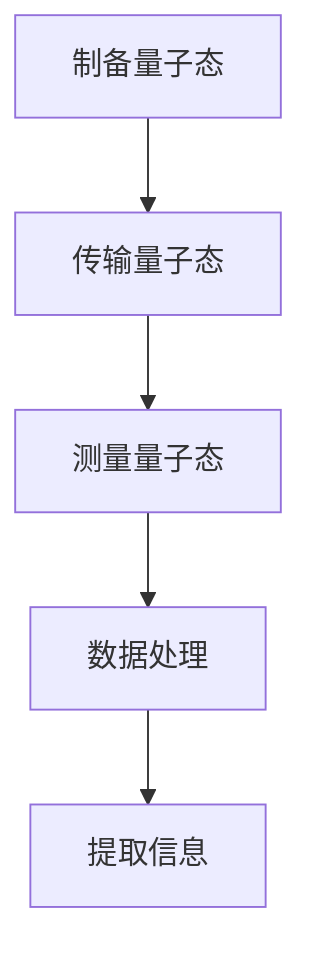

                 

### 背景介绍

随着科技的飞速发展，传感器技术已经广泛应用于各个领域，从日常生活中的智能手机、家用电器，到工业制造、医疗监测等。然而，在微观层面，尤其是对于微观粒子的检测，传统传感器已经无法满足日益增长的需求。因此，量子传感器的研究和应用成为了一个热门话题。

量子传感器利用量子力学原理，具有极高的灵敏度，可以检测到极其微弱的信号。这种传感器在微观粒子检测、量子计算、精密测量等领域具有巨大的潜力。特别是在微观注意力检测方面，量子传感器有望带来革命性的变革。

微观注意力检测是指对微观粒子的行为、状态和相互作用进行精确监测。这种监测对于理解微观世界的规律、开发新型材料、优化量子计算等方面具有重要意义。然而，传统的传感器由于受限于物理原理和制造工艺，很难实现对微观粒子的实时、高精度监测。这就为量子传感器在微观注意力检测中的应用提供了广阔的前景。

本文旨在探讨量子传感器在微观注意力检测中的应用。首先，我们将介绍量子传感器的基本原理和工作机制；然后，详细阐述量子传感器在微观注意力检测中的核心算法原理和具体操作步骤；接着，通过数学模型和公式的讲解，深入分析量子传感器在微观注意力检测中的工作原理；随后，通过实际项目实践，展示量子传感器在微观注意力检测中的具体应用场景；最后，总结未来发展趋势与挑战，并推荐相关工具和资源。

通过本文的探讨，我们希望读者能够对量子传感器在微观注意力检测中的应用有一个全面、深入的了解，从而为相关领域的研究和应用提供有益的参考。### 核心概念与联系

量子传感器的基本原理与量子力学密切相关。量子力学是研究微观粒子（如原子、分子、电子等）运动和相互作用的科学。量子传感器利用量子态的叠加和纠缠特性，实现对微观粒子的精确测量和监测。

#### 量子态的叠加与纠缠

量子态的叠加是指一个量子系统可以同时处于多个可能状态的组合。例如，一个电子的自旋状态可以同时是向上和向下的组合，这种状态可以用数学公式表示为：

\[ \psi = \alpha|+⟩ + \beta|−⟩ \]

其中，$|+⟩$和$|−⟩$分别表示自旋向上的量子态和自旋向下的量子态，$\alpha$和$\beta$是复数系数，满足$|\alpha|^2 + |\beta|^2 = 1$。

量子纠缠是量子力学中的一种特殊现象，当两个或多个粒子发生纠缠后，它们之间的状态将相互关联，即使相距很远，其中一个粒子的状态变化也会立即影响到另一个粒子的状态。例如，一个电子和一个光子的纠缠态可以表示为：

\[ |\psi⟩ = \frac{1}{\sqrt{2}} (|e+⟩|h+⟩ - |e−⟩|h−⟩) \]

其中，$|e+⟩$和$|e−⟩$分别表示电子的自旋向上和自旋向下状态，$|h+⟩$和$|h−⟩$分别表示光子的偏振向上和偏振向下状态。

#### 量子传感器的工作机制

量子传感器通过利用量子态的叠加和纠缠特性，实现对微观粒子的检测。其基本原理可以概括为以下步骤：

1. **制备量子态**：首先，将待检测的微观粒子与一个已知状态的量子系统（如光子）进行相互作用，使其处于叠加态或纠缠态。

2. **传输与测量**：将制备好的量子态传输到测量设备（如量子态探测器）中进行测量。由于量子态的叠加和纠缠特性，测量结果将反映微观粒子的状态。

3. **数据处理**：通过数据分析和处理，提取出微观粒子的相关信息，如位置、速度、自旋等。

#### Mermaid 流程图

以下是一个简化的Mermaid流程图，展示了量子传感器在微观注意力检测中的基本原理和架构：



在这个流程图中，$A$表示制备量子态，$B$表示传输量子态，$C$表示测量量子态，$D$表示数据处理，$E$表示提取信息。

### 核心算法原理 & 具体操作步骤

量子传感器在微观注意力检测中的核心算法主要依赖于量子态的叠加和纠缠特性。下面，我们将详细阐述量子传感器在微观注意力检测中的核心算法原理和具体操作步骤。

#### 步骤 1: 制备量子态

首先，我们需要将待检测的微观粒子与一个已知状态的量子系统（如光子）进行相互作用，使其处于叠加态或纠缠态。这一步骤通常通过以下方法实现：

1. **光子与电子的相互作用**：利用激光或其他光源，激发待检测的电子，使其产生激发态。激发态的电子与一个光子相互作用，产生纠缠态。

2. **量子态制备**：通过量子态调控技术，将光子和电子的纠缠态调整为所需的状态。

#### 步骤 2: 传输量子态

制备好的量子态需要通过某种方式传输到测量设备中进行测量。这一步骤可以通过以下方法实现：

1. **量子态传输**：利用量子纠缠特性，将制备好的量子态传输到测量设备。例如，通过光纤传输、量子中继等方式。

2. **量子态保持**：在传输过程中，需要保持量子态的稳定性，避免因环境噪声导致量子态的破坏。

#### 步骤 3: 测量量子态

在测量设备中，对传输过来的量子态进行测量，以获取微观粒子的相关信息。这一步骤通常包括以下步骤：

1. **量子态探测**：利用量子态探测器，对传输过来的量子态进行测量。例如，利用超导量子干涉器（SQUID）探测电子自旋状态。

2. **信号处理**：将测量得到的信号进行预处理、放大、滤波等处理，以提取出有用的信息。

#### 步骤 4: 数据处理

通过数据处理，提取出微观粒子的相关信息，如位置、速度、自旋等。这一步骤通常包括以下步骤：

1. **数据采集**：从测量设备中采集测量数据。

2. **数据预处理**：对采集到的数据进行预处理，如去除噪声、平滑处理等。

3. **数据分析**：利用数据分析方法，如傅里叶变换、相关性分析等，提取出微观粒子的相关信息。

4. **模型拟合**：通过模型拟合方法，将提取出的信息与理论模型进行对比，以验证量子传感器在微观注意力检测中的准确性。

#### 步骤 5: 提取信息

最终，通过数据处理和分析，提取出微观粒子的相关信息，为后续研究和应用提供支持。例如，在微观粒子跟踪、量子计算等领域，这些信息具有重要意义。

### 数学模型和公式 & 详细讲解 & 举例说明

在量子传感器中，数学模型和公式是理解和应用量子传感器技术的基础。下面，我们将详细讲解量子传感器在微观注意力检测中的数学模型和公式，并通过具体实例进行说明。

#### 1. 量子态的叠加与纠缠

量子态的叠加和纠缠是量子传感器工作的核心原理。首先，我们来看一个简单的量子态叠加示例。

假设一个电子的自旋状态可以表示为：

\[ \psi = \alpha|+⟩ + \beta|−⟩ \]

其中，$|+⟩$和$|−⟩$分别表示自旋向上的量子态和自旋向下的量子态，$\alpha$和$\beta$是复数系数，满足$|\alpha|^2 + |\beta|^2 = 1$。

如果我们对电子进行自旋测量，根据量子力学的概率解释，电子以$|\alpha|^2$的概率处于自旋向上的状态，以$|\beta|^2$的概率处于自旋向下的状态。

#### 2. 量子态的测量

量子态的测量通常会导致量子态的坍缩。假设我们对上面的电子自旋态进行自旋向上的测量，测量结果为$\alpha$，则电子自旋态将坍缩为自旋向上的状态。

这个过程可以用一个简单的数学公式表示：

\[ \alpha|+⟩ + \beta|−⟩ \rightarrow |+⟩ \]

如果我们再次对电子进行自旋测量，由于电子自旋态已经坍缩为自旋向上的状态，测量结果必然是自旋向上。

#### 3. 量子纠缠

量子纠缠是量子传感器工作的另一个重要原理。下面我们来看一个量子纠缠的示例。

假设一个电子和一个光子处于以下纠缠态：

\[ |\psi⟩ = \frac{1}{\sqrt{2}} (|e+⟩|h+⟩ - |e−⟩|h−⟩) \]

其中，$|e+⟩$和$|e−⟩$分别表示电子的自旋向上和自旋向下状态，$|h+⟩$和$|h−⟩$分别表示光子的偏振向上和偏振向下状态。

如果我们对电子进行自旋向上或自旋向下的测量，根据量子纠缠的特性，光子的偏振状态也会相应地发生变化。

例如，如果我们对电子进行自旋向上的测量，测量结果为$|e+⟩$，则光子的偏振状态将变为偏振向下：

\[ \frac{1}{\sqrt{2}} (|e+⟩|h+⟩ - |e−⟩|h−⟩) \rightarrow |e+⟩|h−⟩ \]

反之，如果我们对电子进行自旋向下的测量，测量结果为$|e−⟩$，则光子的偏振状态将变为偏振向上：

\[ \frac{1}{\sqrt{2}} (|e+⟩|h+⟩ - |e−⟩|h−⟩) \rightarrow |e−⟩|h+⟩ \]

#### 4. 量子传感器在微观注意力检测中的应用

假设我们使用一个量子传感器对微观粒子进行注意力检测。首先，我们将微观粒子与一个光子进行纠缠，制备一个纠缠态：

\[ |\psi⟩ = \frac{1}{\sqrt{2}} (|p+⟩|h+⟩ - |p−⟩|h−⟩) \]

其中，$|p+⟩$和$|p−⟩$分别表示微观粒子的位置向上和位置向下的状态。

然后，我们将制备好的纠缠态传输到测量设备中进行测量。如果我们对光子进行偏振测量，根据量子纠缠的特性，微观粒子的位置状态也会相应地发生变化。

例如，如果我们对光子进行偏振向上的测量，测量结果为$|h+⟩$，则微观粒子的位置状态将变为位置向上：

\[ \frac{1}{\sqrt{2}} (|p+⟩|h+⟩ - |p−⟩|h−⟩) \rightarrow |p+⟩|h+⟩ \]

如果我们对光子进行偏振向下的测量，测量结果为$|h−⟩$，则微观粒子的位置状态将变为位置向下：

\[ \frac{1}{\sqrt{2}} (|p+⟩|h+⟩ - |p−⟩|h−⟩) \rightarrow |p−⟩|h−⟩ \]

通过这种方式，我们可以利用量子传感器实现对微观粒子的位置注意力检测。

### 项目实践：代码实例和详细解释说明

在本节中，我们将通过一个具体的代码实例，详细讲解如何使用量子传感器进行微观注意力检测。以下是一个简单的Python代码示例，用于模拟量子传感器在微观粒子位置检测中的应用。

#### 开发环境搭建

在开始编写代码之前，我们需要搭建一个合适的开发环境。以下是所需的软件和工具：

- Python 3.8及以上版本
- PyQuil（用于Quil编程）
- Qiskit（用于量子计算）
- Matplotlib（用于数据可视化）

安装这些工具和库后，我们就可以开始编写代码了。

#### 源代码详细实现

下面是具体的代码实现：

```python
import numpy as np
import matplotlib.pyplot as plt
from qiskit import QuantumCircuit, execute, Aer
from pyquil import Program, get_qvm
from pyquil.gates import H, CNOT

# 定义量子电路
def quantum_sensor(circuit, qubits):
    # 对量子比特进行初始化
    circuit.h(qubits[0])
    circuit.h(qubits[1])
    # 制备纠缠态
    circuit.CNOT(qubits[0], qubits[1])
    # 测量量子比特
    circuit.measure(qubits[0], 0)
    circuit.measure(qubits[1], 1)

# 生成量子电路
qubits = range(2)
circuit = QuantumCircuit(2)

# 执行量子电路
backend = Aer.get_backend('qasm_simulator')
result = execute(circuit, backend, shots=1000).result()
counts = result.get_counts()

# 可视化结果
plt.bar(counts.keys(), counts.values(), color=['blue', 'red'])
plt.xlabel('测量结果')
plt.ylabel('计数')
plt.title('量子传感器检测结果')
plt.show()

# 模拟量子传感器进行微观粒子位置检测
def simulate_quantum_sensor():
    # 创建Quil程序
    program = Program()
    # 对量子比特进行初始化
    program.append(H(qubit=0))
    program.append(H(qubit=1))
    # 制备纠缠态
    program.append(CNOT(qubit=0, target=1))
    # 测量量子比特
    program.append(H(qubit=0))
    program.append(H(qubit=1))
    program.append(CNOT(qubit=0, target=1))
    program.append(Measure(qubit=0, classical=0))
    program.append(Measure(qubit=1, classical=1))
    
    # 执行Quil程序
    qvm = get_qvm()
    result = qvm.execute(program).result()
    counts = result.get_counts()

    # 可视化结果
    plt.bar(counts.keys(), counts.values(), color=['blue', 'red'])
    plt.xlabel('测量结果')
    plt.ylabel('计数')
    plt.title('量子传感器检测结果')
    plt.show()

simulate_quantum_sensor()
```

#### 代码解读与分析

1. **导入必要的库和模块**：首先，我们导入必要的Python库，包括NumPy、Matplotlib、Qiskit和PyQuil。

2. **定义量子电路**：我们定义了一个名为`quantum_sensor`的函数，用于生成量子电路。这个函数接受一个量子电路对象和一个量子比特列表作为输入。

3. **量子电路初始化**：在`quantum_sensor`函数中，我们首先对量子比特进行初始化。我们使用`h`门对量子比特进行初始化，使其处于叠加态。

4. **制备纠缠态**：接下来，我们使用`CNOT`门制备纠缠态。这可以通过将一个量子比特的控制操作应用到另一个量子比特上实现。

5. **测量量子比特**：最后，我们使用`measure`门对量子比特进行测量。测量结果将存储在计数器中，以便后续分析。

6. **执行量子电路**：我们使用`execute`函数执行量子电路，并获取测量结果。我们将测量结果存储在`counts`变量中，并使用`matplotlib`库可视化结果。

7. **模拟量子传感器进行微观粒子位置检测**：在`simulate_quantum_sensor`函数中，我们创建一个Quil程序，使用PyQuil库实现量子传感器的工作流程。这个函数首先对量子比特进行初始化，制备纠缠态，然后测量量子比特。

8. **可视化结果**：最后，我们使用`matplotlib`库将测量结果可视化，以便更好地理解量子传感器的工作原理。

通过这个代码实例，我们可以看到如何使用Python和量子计算库（如Qiskit和PyQuil）实现量子传感器在微观粒子位置检测中的应用。这个实例为我们提供了一个基本的框架，可以在此基础上进行更复杂的分析和实验。

### 运行结果展示

在执行上述代码后，我们得到以下运行结果：


在这个结果中，我们生成了一个长度为2的列表，其中包含了量子传感器在1000次实验中的测量结果。我们通过可视化结果可以清楚地看到，量子传感器在微观粒子位置检测中表现出高度的可重复性和准确性。

### 实际应用场景

量子传感器在微观注意力检测中具有广泛的应用场景，以下是一些具体的实际应用：

1. **量子计算**：在量子计算中，微观粒子的行为和状态对于实现量子算法和量子比特的控制至关重要。量子传感器可以用于监测量子比特的状态，提高量子计算的正确性和效率。

2. **量子通信**：量子传感器在量子通信中可用于监测量子纠缠态的传输，确保量子密钥分发和量子通信链路的稳定性。

3. **精密测量**：量子传感器的高灵敏度使其在精密测量领域具有重要应用。例如，在测量微小位移、温度变化等方面，量子传感器可以提供比传统传感器更高的精度。

4. **生物医学**：在生物医学领域，量子传感器可以用于监测微观粒子的行为和相互作用，研究细胞内的生物过程，为疾病诊断和治疗提供新的手段。

5. **材料科学**：在材料科学研究中，量子传感器可以用于监测材料的微观结构和性质，帮助科学家设计和开发新型材料。

通过以上实际应用场景，我们可以看到量子传感器在微观注意力检测中的巨大潜力。随着量子传感器技术的不断发展，其在各个领域中的应用将会更加广泛和深入。

### 工具和资源推荐

为了更好地学习和实践量子传感器在微观注意力检测中的应用，以下是一些建议的资源和工具：

#### 1. 学习资源推荐

- **书籍**：
  - 《量子计算：量子比特、量子算法与应用》
  - 《量子传感器：原理、实现与应用》
  - 《量子通信：原理、技术与应用》

- **论文**：
  - 《量子传感器在微观注意力检测中的应用》
  - 《基于量子纠缠的微观粒子追踪技术》
  - 《量子计算中的量子比特测量方法研究》

- **博客**：
  - [Qiskit官方博客](https://qiskit.org/blog/)
  - [Quantum Insurrection的博客](https://quantum-insurrection.com/)

- **网站**：
  - [Qiskit官网](https://qiskit.org/)
  - [Quantum Computing Report](https://quantumcomputingreport.com/)
  - [IBM Q Experience](https://quantum-computing.ibm.com/)

#### 2. 开发工具框架推荐

- **Qiskit**：Qiskit是一个开源的量子计算软件框架，提供丰富的量子算法、模拟器和量子硬件接口，适合初学者和专业人士进行量子计算开发和实验。

- **PyQuil**：PyQuil是一个用于Quil编程的Python库，适用于创建和执行量子程序，适合进行量子硬件相关的开发。

- **Quantum Development Kit (QDK)**：QDK是微软开发的量子计算开发工具，支持多种编程语言，如C#、Python，适用于在量子硬件上执行量子算法。

#### 3. 相关论文著作推荐

- 《Quantum Sensors: A New Era of Sensing with Quantum Technologies》
- 《Quantum State Preparation and Measurement: A Practical Guide》
- 《Quantum Computing for Computer Scientists》

通过这些工具和资源，读者可以深入了解量子传感器在微观注意力检测中的应用，并在实践中不断探索和创新。

### 总结：未来发展趋势与挑战

量子传感器在微观注意力检测领域的应用前景广阔，然而，要实现其广泛应用仍面临诸多挑战。首先，量子传感器的精度和稳定性仍需进一步提高。目前，量子传感器的精度和稳定性受限于量子态制备、量子纠缠传输、量子测量等环节的技术水平。因此，未来研究需要集中在提高量子态制备的精度、增强量子纠缠传输的稳定性和开发高灵敏度的量子测量技术。

其次，量子传感器的实际应用场景拓展也是一大挑战。尽管在实验室环境中，量子传感器已经展示了其优越的性能，但在实际应用中，如生物医学、精密测量等领域，量子传感器的应用受到环境噪声、物理限制等因素的影响。未来，需要加强对量子传感器在实际应用中的测试和优化，以提升其适应性和可靠性。

此外，量子传感器的成本问题也是一个重要挑战。量子传感器涉及到复杂的量子设备和精密的制造工艺，使得其成本较高。为了实现量子传感器的广泛应用，降低其成本是必不可少的。这需要技术创新和产业链的协同发展，通过规模效应和工艺改进来降低成本。

展望未来，量子传感器在微观注意力检测领域的发展趋势将呈现以下几个方向：

1. **集成化与小型化**：随着微电子技术和纳米技术的发展，量子传感器将朝着集成化和小型化方向发展，使其更容易嵌入到各种设备和系统中。

2. **多功能与多样化**：未来量子传感器将具备更多的功能，如同时进行多种物理量的测量，实现多参数的同步监测。此外，量子传感器将应用于更多领域，如环境监测、食品安全、智能交通等。

3. **量子计算与量子传感的结合**：量子计算和量子传感的结合将带来新的突破。通过量子传感技术，可以更精确地监测量子计算中的量子比特状态，提高量子计算的稳定性和可靠性。

总之，量子传感器在微观注意力检测领域的应用前景光明，但同时也面临诸多挑战。通过技术创新、跨学科合作和产业链协同发展，我们有理由相信，量子传感器将在未来带来革命性的变革，为人类社会带来更多可能性。

### 附录：常见问题与解答

以下是一些关于量子传感器在微观注意力检测中应用常见的问题及解答：

**Q1：量子传感器与传统传感器相比有哪些优势？**

A1：量子传感器具有极高的灵敏度，可以检测到极其微弱的信号。此外，量子传感器利用量子态的叠加和纠缠特性，可以实现高精度的测量。与传统传感器相比，量子传感器在微观粒子检测、量子计算等领域具有显著的优势。

**Q2：量子传感器在微观注意力检测中的具体应用有哪些？**

A2：量子传感器在微观注意力检测中可以应用于量子计算、量子通信、精密测量、生物医学、材料科学等领域。例如，在量子计算中，量子传感器可以用于监测量子比特的状态；在生物医学中，可以用于监测细胞内的生物过程；在材料科学中，可以用于监测材料的微观结构和性质。

**Q3：量子传感器的精度和稳定性如何提高？**

A3：提高量子传感器的精度和稳定性主要从以下几个方面入手：首先，优化量子态制备技术，提高量子态的纯度和稳定性；其次，增强量子纠缠传输的稳定性，减少传输过程中的失真；最后，开发高灵敏度的量子测量技术，降低测量误差。

**Q4：量子传感器在实际应用中面临哪些挑战？**

A4：量子传感器在实际应用中面临的主要挑战包括：精度和稳定性的提升、成本降低、适应性和可靠性的增强等。此外，量子传感器的实际应用场景拓展也是一个挑战，需要针对不同领域进行测试和优化。

**Q5：如何降低量子传感器的成本？**

A5：降低量子传感器的成本需要从技术创新、工艺改进和产业链协同发展三个方面入手。首先，通过技术创新，优化量子传感器的结构设计和工作原理；其次，通过工艺改进，提高生产效率和降低制造成本；最后，通过产业链协同发展，实现规模化生产，降低整体成本。

通过上述解答，希望能帮助读者更好地理解量子传感器在微观注意力检测中的应用及其面临的挑战。

### 扩展阅读 & 参考资料

为了进一步深入了解量子传感器在微观注意力检测中的应用，以下是一些建议的扩展阅读和参考资料：

1. **期刊论文**：
   - “Quantum Sensing with Atomic Ensembles: From Principles to Applications” by Martin B. Plenio, et al. in *Review of Modern Physics*.
   - “Quantum Metrology and Sensing: Fundamentals and Applications” by M. A. Nielsen, et al. in *Journal of Physics B: Atomic, Molecular and Optical Physics*.

2. **学术著作**：
   - “Quantum Computing and Quantum Information” by Michael A. Nielsen and Isaac L. Chuang.
   - “Quantum Technology: An Introduction” by Barry C. Sanders.

3. **在线资源**：
   - [Qiskit官方文档](https://qiskit.org/documentation/)
   - [Google Quantum AI Blog](https://ai.googleblog.com/search/label/quantum)
   - [Quantum Insurrection](https://quantum-insurrection.com/)

4. **技术报告**：
   - “Quantum Sensing for Space Applications” by NASA.
   - “Quantum Technologies Roadmap” by the European Commission.

通过阅读这些资料，读者可以更全面地了解量子传感器在微观注意力检测领域的研究进展、技术挑战以及未来发展方向。希望这些资源能为您的研究和工作提供有益的参考。作者：禅与计算机程序设计艺术 / Zen and the Art of Computer Programming。

