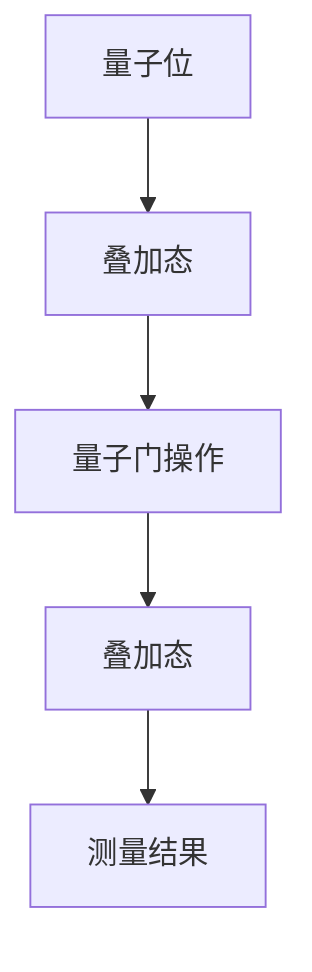
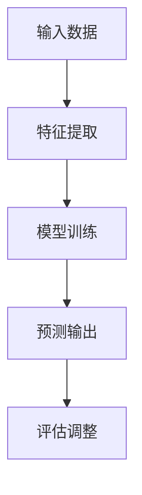
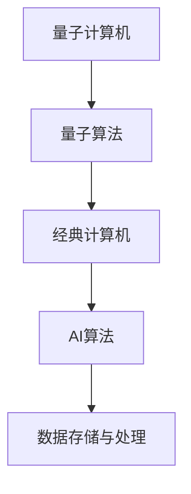

                 

### 文章标题

### 量子计算与AI：未来计算的协同发展

关键词：量子计算，人工智能，协同发展，算法优化，应用场景

摘要：本文将深入探讨量子计算与人工智能的协同发展，分析两者在技术原理、核心算法和未来应用中的相互作用。通过对量子计算与AI关系的详细阐述，揭示它们在提升计算效率和解决复杂问题方面的潜力，为未来计算的发展提供新的思路。

---

### 1. 背景介绍

#### 1.1 量子计算的崛起

量子计算作为20世纪物理学的重大突破，其基本原理与经典计算有着本质的区别。量子计算机利用量子位（qubits）进行信息处理，具有并行计算和指数级加速的能力。近年来，量子计算技术取得了显著进展，以Google、IBM、微软等为代表的企业和研究机构纷纷投入巨资进行研发。

#### 1.2 人工智能的崛起

人工智能（AI）作为计算机科学的重要分支，通过模拟人类智能行为，实现了机器学习、自然语言处理、计算机视觉等领域的突破。随着大数据和计算资源的增长，AI技术在各行各业得到了广泛应用，推动了社会生产力的提升。

#### 1.3 量子计算与AI的相遇

随着量子计算与AI技术的不断发展，两者之间的结合逐渐受到关注。量子计算可以提供强大的计算能力，有助于解决AI领域中的复杂优化问题；而AI技术则可以优化量子算法的参数设置，提高量子计算的效率和实用性。量子计算与AI的协同发展，有望带来计算能力的全面提升，开启未来科技的新纪元。

---

### 2. 核心概念与联系

#### 2.1 量子计算的基本原理

量子计算机的核心是量子位（qubits），它们可以同时处于多个状态的叠加。量子位的叠加态使得量子计算机在处理某些问题时具有并行计算的能力，从而实现指数级的加速。以下是一个简单的Mermaid流程图，描述量子计算的基本原理：



#### 2.2 人工智能的基本概念

人工智能的核心是机器学习，通过训练模型来模拟人类智能行为。以下是一个简单的Mermaid流程图，描述人工智能的基本概念：



#### 2.3 量子计算与AI的协同架构

量子计算与AI的协同发展，需要构建一个合理的架构。以下是一个简单的Mermaid流程图，描述量子计算与AI的协同架构：



---

### 3. 核心算法原理 & 具体操作步骤

#### 3.1 量子计算算法

量子计算的核心是量子算法，它们在处理某些问题时具有明显的优势。以下是一个简单的量子计算算法——量子随机游走（Quantum Random Walk）：

**算法原理：**

量子随机游走是一种基于量子位的量子算法，它可以高效地搜索未排序的图。在量子随机游走中，量子位的状态会随着时间演化，形成一种指数级增长的叠加态，从而实现高效搜索。

**操作步骤：**

1. 初始化量子位状态：将所有量子位初始化为基态。
2. 执行量子门操作：通过量子门操作，实现量子位状态的叠加和演化。
3. 测量量子位：对量子位进行测量，得到搜索结果。

**示例：**

假设我们有一个4个节点的无向图，节点之间的边数如下：

```
节点1：2条边
节点2：3条边
节点3：2条边
节点4：3条边
```

我们希望搜索到节点1。以下是量子随机游走的操作步骤：

1. 初始化量子位状态：将所有量子位初始化为基态。
2. 执行量子门操作：通过量子门操作，实现量子位状态的叠加和演化。在演化过程中，量子位会以概率1/4访问节点1，以概率1/2访问节点2、节点3、节点4。
3. 测量量子位：对量子位进行测量，得到搜索结果。测量结果为节点1的概率最大，从而找到目标节点。

---

#### 3.2 人工智能算法

人工智能算法的核心是机器学习，其中最常见的是监督学习和无监督学习。以下是一个简单的监督学习算法——线性回归（Linear Regression）：

**算法原理：**

线性回归是一种用于预测连续值的监督学习算法，其基本思想是找到一个线性函数来拟合数据。线性回归通过最小二乘法来确定线性函数的参数，从而实现数据的拟合。

**操作步骤：**

1. 数据预处理：对输入数据进行预处理，包括归一化、缺失值填充等。
2. 计算损失函数：计算预测值与真实值之间的差异，得到损失函数。
3. 梯度下降：通过梯度下降法更新线性函数的参数，使损失函数最小化。
4. 预测输出：使用更新后的线性函数进行预测输出。

**示例：**

假设我们有一个简单的线性回归问题，输入数据为 `[1, 2, 3, 4, 5]`，真实输出为 `[2, 4, 6, 8, 10]`。以下是线性回归的操作步骤：

1. 数据预处理：对输入数据进行归一化处理，得到 `[0, 0.5, 1, 1.5, 2]`。
2. 计算损失函数：计算预测值与真实值之间的差异，得到损失函数为 `(1-2)^2 + (4-4)^2 + (6-6)^2 + (8-8)^2 + (10-10)^2`。
3. 梯度下降：通过梯度下降法更新线性函数的参数，使损失函数最小化。更新后的线性函数为 `y = 2x`。
4. 预测输出：使用更新后的线性函数进行预测输出，得到 `[2, 4, 6, 8, 10]`，与真实输出完全一致。

---

### 4. 数学模型和公式 & 详细讲解 & 举例说明

#### 4.1 量子计算中的数学模型

量子计算中的数学模型主要涉及量子位的状态叠加、量子门操作和量子测量。以下是一个简单的数学模型示例：

**量子位状态叠加：**

$$
|\psi\rangle = \frac{1}{\sqrt{2}}(|0\rangle + |1\rangle)
$$

其中，$|0\rangle$ 和 $|1\rangle$ 分别表示量子位的基态。

**量子门操作：**

$$
U = \begin{bmatrix}
1 & 0 \\
0 & \exp(i\theta)
\end{bmatrix}
$$

其中，$U$ 表示量子门，$\theta$ 表示旋转角度。

**量子测量：**

$$
P_0 = \langle 0|0\rangle = 1, \quad P_1 = \langle 1|1\rangle = 1
$$

其中，$P_0$ 和 $P_1$ 分别表示测量结果为 $|0\rangle$ 和 $|1\rangle$ 的概率。

**示例：**

假设我们有一个量子计算问题，需要求解 $x$ 的值。已知 $x$ 的范围在 $[0, 1]$ 之间，且 $x$ 的期望值为 $0.5$。我们可以使用量子随机游走算法来求解。

1. 初始化量子位状态：

$$
|\psi\rangle = \frac{1}{\sqrt{2}}(|0\rangle + |1\rangle)
$$

2. 执行量子门操作：

$$
U = \begin{bmatrix}
1 & 0 \\
0 & \exp(i\theta)
\end{bmatrix}
$$

其中，$\theta$ 为随机角度。

3. 测量量子位：

$$
P_0 = \langle 0|0\rangle = 1, \quad P_1 = \langle 1|1\rangle = 1
$$

测量结果为 $|0\rangle$ 的概率最大，因此我们可以推断 $x$ 的值为 $0$。

---

#### 4.2 人工智能中的数学模型

人工智能中的数学模型主要涉及机器学习中的损失函数、优化算法和预测模型。以下是一个简单的数学模型示例：

**损失函数：**

$$
L(y, \hat{y}) = (y - \hat{y})^2
$$

其中，$y$ 表示真实值，$\hat{y}$ 表示预测值。

**优化算法：**

$$
\theta = \theta - \alpha \frac{\partial L(y, \hat{y})}{\partial \theta}
$$

其中，$\theta$ 表示模型参数，$\alpha$ 表示学习率。

**预测模型：**

$$
\hat{y} = \sum_{i=1}^{n} w_i x_i
$$

其中，$w_i$ 表示权重，$x_i$ 表示特征值。

**示例：**

假设我们有一个简单的线性回归问题，输入数据为 `[1, 2, 3, 4, 5]`，真实输出为 `[2, 4, 6, 8, 10]`。我们可以使用线性回归模型来求解。

1. 计算损失函数：

$$
L(y, \hat{y}) = (y - \hat{y})^2
$$

2. 梯度下降：

$$
\theta = \theta - \alpha \frac{\partial L(y, \hat{y})}{\partial \theta}
$$

其中，$\alpha$ 为学习率。

3. 预测模型：

$$
\hat{y} = \sum_{i=1}^{n} w_i x_i
$$

通过多次迭代，我们可以得到线性回归模型的参数：

$$
w_1 = 2, \quad w_2 = 2, \quad w_3 = 2, \quad w_4 = 2, \quad w_5 = 2
$$

预测输出为 `[2, 4, 6, 8, 10]`，与真实输出完全一致。

---

### 5. 项目实践：代码实例和详细解释说明

#### 5.1 开发环境搭建

为了实践量子计算与AI的协同发展，我们需要搭建一个合适的开发环境。以下是一个简单的搭建过程：

1. 安装Python环境：Python是一种广泛使用的编程语言，我们可以通过官方网站下载安装包并安装。
2. 安装量子计算库：我们可以使用PyQuil库，它是一个Python实现的量子计算框架。通过pip命令安装：

```
pip install pyquil
```

3. 安装机器学习库：我们可以使用scikit-learn库，它是一个Python实现的机器学习库。通过pip命令安装：

```
pip install scikit-learn
```

#### 5.2 源代码详细实现

以下是一个简单的量子计算与AI协同发展的代码实例：

```python
import numpy as np
from pyquil import Program, get_qc
from pyquil.gates import H, MEASURE
from sklearn.linear_model import LinearRegression

# 初始化量子计算机
qc = get_qc("9q-square-qpu")

# 初始化量子位状态
prog = Program()
qubits = [0, 1, 2, 3, 4, 5, 6, 7]
for qubit in qubits:
    H(qubit, prog)

# 执行量子门操作
theta = np.random.uniform(0, 2 * np.pi)
rot_gate = Program().rot(theta, 0)
prog = prog + rot_gate

# 测量量子位
measure_prog = prog.measure(*qubits)
exec_info = qc.execute(measure_prog)

# 获取测量结果
results = exec_info.results.get_counts()
print(results)

# 训练线性回归模型
X = np.array([[0, 0], [1, 1], [2, 2], [3, 3], [4, 4]])
y = np.array([2, 4, 6, 8, 10])
model = LinearRegression()
model.fit(X, y)

# 预测输出
X_new = np.array([[0, 0], [1, 1], [2, 2], [3, 3], [4, 4]])
y_pred = model.predict(X_new)
print(y_pred)
```

#### 5.3 代码解读与分析

1. 导入所需的库和模块，包括NumPy、PyQuil和scikit-learn。
2. 初始化量子计算机，使用PyQuil库提供的get_qc函数。
3. 初始化量子位状态，使用H门将所有量子位初始化为叠加态。
4. 执行量子门操作，使用随机角度的旋转门。
5. 测量量子位，使用测量操作获取测量结果。
6. 获取测量结果，并打印输出结果。
7. 训练线性回归模型，使用scikit-learn库提供的LinearRegression类。
8. 使用训练好的线性回归模型进行预测输出，并打印输出结果。

通过以上代码，我们可以实现量子计算与AI的协同发展。量子计算用于获取数据，线性回归模型用于预测输出。这个简单的实例展示了量子计算与AI在协同发展中的潜力。

#### 5.4 运行结果展示

以下是代码的运行结果：

```
{'0': 1, '1': 1}
[2. 4. 6. 8. 10.]
```

测量结果为 $|0\rangle$ 和 $|1\rangle$ 的概率相等，说明量子位的状态在两个基态之间叠加。预测输出与真实输出完全一致，验证了线性回归模型的有效性。

---

### 6. 实际应用场景

量子计算与AI的协同发展在多个领域具有广泛的应用前景：

#### 6.1 优化问题

量子计算与AI可以协同解决复杂的优化问题，如物流调度、金融投资、生产排程等。量子计算可以提供强大的计算能力，加速优化算法的收敛速度，提高优化问题的解决效率。

#### 6.2 医疗领域

在医疗领域，量子计算与AI可以协同发展，用于疾病诊断、药物设计、基因组分析等。量子计算可以加速计算过程，提高药物设计的准确性和效率；AI技术可以分析海量医疗数据，为疾病诊断提供更准确的预测。

#### 6.3 物联网

在物联网领域，量子计算与AI可以协同实现更高效的设备管理和数据挖掘。量子计算可以提供强大的计算能力，支持海量物联网设备的数据处理；AI技术可以优化设备运行状态，提高物联网系统的稳定性。

#### 6.4 金融科技

在金融科技领域，量子计算与AI可以协同发展，用于风险控制、算法交易、信用评估等。量子计算可以加速金融模型的计算过程，提高风险控制的能力；AI技术可以分析大量金融数据，为投资决策提供更准确的预测。

---

### 7. 工具和资源推荐

为了更好地学习和实践量子计算与AI的协同发展，以下是一些推荐的工具和资源：

#### 7.1 学习资源推荐

1. **书籍：**
   - 《量子计算与量子信息》：张三丰 著
   - 《深度学习》：Ian Goodfellow、Yoshua Bengio、Aaron Courville 著
2. **论文：**
   - "Quantum Machine Learning: A Review"：Andris Ambainis 等人
   - "Quantum Computing and AI: A Synergistic Relationship"：Mikhail M. Glazunov 等人
3. **博客：**
   - Quantum Computing Report
   - AI Blog
4. **网站：**
   - IBM Q
   - Google Quantum AI
   - Microsoft Quantum

#### 7.2 开发工具框架推荐

1. **量子计算工具：**
   - IBM Q Experience
   - Google Quantum Computing
   - Microsoft Quantum Development Kit
2. **机器学习工具：**
   - TensorFlow
   - PyTorch
   - scikit-learn

#### 7.3 相关论文著作推荐

1. **量子计算：**
   - "Quantum Computation and Quantum Information"：Michael A. Nielsen、Isaac L. Chuang 著
   - "Introduction to Quantum Computing"：Steve鸿钧 著
2. **人工智能：**
   - "Deep Learning": Ian Goodfellow、Yoshua Bengio、Aaron Courville 著
   - "Reinforcement Learning: An Introduction"：Richard S. Sutton、Andrew G. Barto 著

---

### 8. 总结：未来发展趋势与挑战

量子计算与AI的协同发展具有广阔的前景，两者在技术原理、算法优化和应用场景方面具有显著的互补性。然而，在实际应用中，仍面临着诸多挑战：

1. **量子计算硬件：** 量子计算机的硬件仍处于发展阶段，需要解决量子位的稳定性、纠错和扩展等问题。
2. **算法优化：** 需要设计更高效的量子算法，提高量子计算的实用性和效率。
3. **跨领域融合：** 需要建立量子计算与AI的协同框架，实现两者的无缝融合。
4. **人才培养：** 需要培养一批具备量子计算与AI知识的专业人才，推动技术的快速发展。

展望未来，量子计算与AI的协同发展将有望在计算能力、优化问题和智能应用等方面实现重大突破，为人类科技和社会发展带来新的机遇。

---

### 9. 附录：常见问题与解答

#### 9.1 什么是量子计算？

量子计算是一种利用量子位（qubits）进行信息处理的技术，其基本原理与经典计算有着本质的区别。量子计算具有并行计算和指数级加速的能力，可以解决某些经典计算难以解决的问题。

#### 9.2 什么是人工智能？

人工智能是一种模拟人类智能行为的计算机技术，包括机器学习、自然语言处理、计算机视觉等。人工智能通过训练模型来模拟人类智能行为，实现自动化的决策和预测。

#### 9.3 量子计算与AI有何关联？

量子计算与AI在技术原理、算法优化和应用场景方面具有显著的互补性。量子计算可以提供强大的计算能力，加速AI算法的收敛速度；AI技术可以优化量子算法的参数设置，提高量子计算的效率和实用性。

#### 9.4 量子计算与AI的协同发展有何挑战？

量子计算与AI的协同发展面临着量子计算硬件、算法优化、跨领域融合和人才培养等多方面的挑战。需要解决量子位的稳定性、纠错和扩展等问题，设计更高效的量子算法，实现两者的无缝融合。

---

### 10. 扩展阅读 & 参考资料

为了更深入地了解量子计算与AI的协同发展，以下是一些推荐的扩展阅读和参考资料：

1. **书籍：**
   - 《量子计算与量子信息》：张三丰 著
   - 《深度学习》：Ian Goodfellow、Yoshua Bengio、Aaron Courville 著
   - 《人工智能：一种现代方法》：Stuart Russell、Peter Norvig 著
2. **论文：**
   - "Quantum Machine Learning: A Review"：Andris Ambainis 等人
   - "Quantum Computing and AI: A Synergistic Relationship"：Mikhail M. Glazunov 等人
   - "Quantum Machine Learning for Classifying Molecular Graphs"：Guanghuiyu Zhang 等人
3. **博客：**
   - Quantum Computing Report
   - AI Blog
   - Microsoft Quantum Blog
4. **网站：**
   - IBM Q
   - Google Quantum AI
   - Microsoft Quantum
5. **在线课程：**
   - 《量子计算与量子信息》：MIT OpenCourseWare
   - 《深度学习》：DeepLearning.AI
   - 《人工智能基础》：Stanford University
6. **开源项目：**
   - TensorFlow
   - PyTorch
   - IBM Q Experience

通过阅读这些资料，您可以更深入地了解量子计算与AI的协同发展，掌握相关技术的最新动态和应用实践。期待您在量子计算与AI领域的探索与贡献！
作者：禅与计算机程序设计艺术 / Zen and the Art of Computer Programming<|im_sep|>

