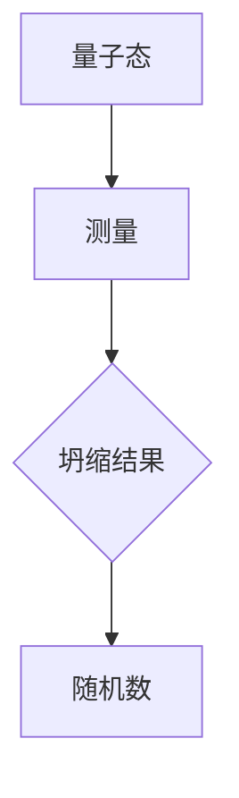
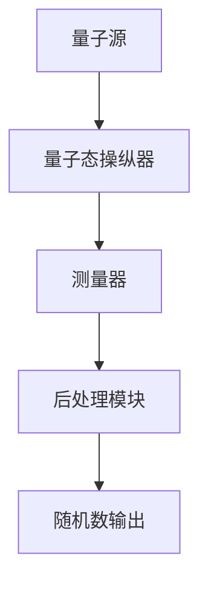

                 

# 量子随机数生成器：密码学应用的创新工具

> 关键词：量子随机数生成器、密码学、随机数、量子计算机、安全性、应用场景

> 摘要：本文将深入探讨量子随机数生成器（QRNG）的概念、原理和应用，特别关注其在密码学领域的创新作用。通过逐步分析量子随机数生成器的核心算法、数学模型、项目实践和实际应用场景，本文旨在为读者提供一个全面、清晰的了解，并展望其未来发展趋势与挑战。

## 1. 背景介绍

### 1.1 随机数的定义与重要性

随机数在计算机科学和密码学中扮演着至关重要的角色。它们被广泛应用于多种场景，包括密码学中的加密和解密、随机抽样、算法测试、模拟和游戏开发等。在密码学中，高质量随机数的生成是确保信息安全的关键因素之一。

传统随机数生成器主要依赖于伪随机数生成器（PRNG）和物理随机数生成器（HRNG）。PRNG使用算法和种子值来生成看似随机的数列，但其随机性受到算法本身和初始种子限制。HRNG则通过物理过程，如放射性衰变、噪声信号等，来生成随机数，具有较高的随机性，但生成速度较慢。

### 1.2 量子随机数生成器（QRNG）

量子随机数生成器利用量子物理的随机性原理，通过量子态的测量生成真正的随机数。量子随机数生成器的核心思想是基于量子态的不可预测性，即量子态的测量结果具有固有的随机性。

与传统随机数生成器相比，QRNG具有以下优势：

- **真正的随机性**：QRNG利用量子态的随机特性，生成的随机数具有更高的随机性和安全性。
- **高效性**：量子随机数生成器的速度和生成速率远高于传统HRNG。
- **量子优势**：量子随机数生成器在某些特定算法和计算任务中展现出量子优势。

## 2. 核心概念与联系

### 2.1 量子随机数生成原理

量子随机数生成器通常基于量子态的测量。量子态的测量结果具有随机性，因为量子态的叠加态在测量时会发生坍缩，导致不同的测量结果。

下面是一个简化的Mermaid流程图，展示了量子随机数生成器的基本原理：



### 2.2 量子随机数生成器架构

量子随机数生成器的架构通常包括以下几个关键部分：

1. **量子源**：提供量子态的初始条件。
2. **量子态操纵器**：对量子态进行操作，以生成具有特定随机性的量子态。
3. **测量器**：对量子态进行测量，获取随机数。
4. **后处理模块**：对生成的随机数进行清洗和后处理，以获得高质量的随机数。

下面是一个简化的Mermaid流程图，展示了量子随机数生成器的架构：



## 3. 核心算法原理 & 具体操作步骤

### 3.1 量子随机数生成算法

量子随机数生成算法的核心在于如何利用量子态的测量结果生成随机数。以下是一个简化的量子随机数生成算法：

1. **量子态初始化**：将量子源产生的量子态初始化为叠加态。
2. **量子态操纵**：对量子态进行一系列操作，以生成具有特定随机性的量子态。
3. **量子态测量**：对量子态进行测量，获取一个随机数。
4. **后处理**：对测量结果进行清洗和后处理，以获得高质量的随机数。

### 3.2 具体操作步骤

以下是一个具体的量子随机数生成操作步骤：

1. **量子态初始化**：
   - 使用量子源生成一个初始量子态 |ψ⟩。
   - 将量子态初始化为一个叠加态 |ψ⟩ = α|0⟩ + β|1⟩，其中 |0⟩ 和 |1⟩ 分别表示基态和激发态。

2. **量子态操纵**：
   - 使用量子态操纵器对量子态进行一系列操作，以生成具有特定随机性的量子态。
   - 例如，通过量子门操作，将叠加态 |ψ⟩ 转换为一种新的叠加态 |ψ'⟩。

3. **量子态测量**：
   - 使用测量器对量子态 |ψ'⟩ 进行测量，获取一个随机数。
   - 测量结果可以是 |0⟩ 或 |1⟩，分别对应于随机数 0 或 1。

4. **后处理**：
   - 对测量结果进行清洗和后处理，以获得高质量的随机数。
   - 例如，使用概率分布函数对测量结果进行修正，以消除噪声和偏差。

## 4. 数学模型和公式 & 详细讲解 & 举例说明

### 4.1 数学模型

量子随机数生成器的数学模型基于量子力学的概率解释。具体来说，量子随机数生成器的核心在于量子态的叠加和测量。

假设量子态 |ψ⟩ 是一个叠加态，其可以表示为：

$$
|ψ⟩ = \alpha|0⟩ + \beta|1⟩
$$

其中，|0⟩ 和 |1⟩ 分别表示基态和激发态，α和β是复数系数，满足：

$$
|\alpha|^2 + |\beta|^2 = 1
$$

当对量子态 |ψ⟩ 进行测量时，其结果可以是 |0⟩ 或 |1⟩，且每个结果的概率由以下公式给出：

$$
P(0) = |\alpha|^2 \\
P(1) = |\beta|^2
$$

### 4.2 详细讲解

量子态的叠加和测量是量子随机数生成器的基础。量子态的叠加态表示了不确定性和随机性，而量子态的测量则将叠加态坍缩为一个确定的状态，从而产生随机结果。

以下是一个具体的例子：

假设我们有一个量子态 |ψ⟩ = \(\frac{1}{\sqrt{2}}\) |0⟩ + \(\frac{1}{\sqrt{2}}\) |1⟩，其对应的概率分布为：

$$
P(0) = P(1) = \frac{1}{2}
$$

这意味着，如果我们对量子态 |ψ⟩ 进行测量，有50%的概率得到 |0⟩，也有50%的概率得到 |1⟩。

### 4.3 举例说明

以下是一个简单的量子随机数生成示例：

假设我们使用一个量子比特（qubit）作为量子态源，初始化量子态为 |0⟩。

1. **量子态初始化**：将量子比特初始化为基态 |0⟩。
2. **量子态操纵**：使用 Hadamard 门（H门）对量子比特进行操作，将基态 |0⟩ 转换为叠加态 |+⟩，即：
   $$ 
   H|0⟩ = \frac{1}{\sqrt{2}}(|0⟩ + |1⟩)
   $$
3. **量子态测量**：对叠加态 |+⟩ 进行测量，根据量子力学的概率解释，测量结果为 |0⟩ 或 |1⟩，且概率均为 \(\frac{1}{2}\)。
4. **后处理**：将测量结果转换为二进制随机数，例如，测量结果为 |0⟩，则生成随机数 0；测量结果为 |1⟩，则生成随机数 1。

通过上述步骤，我们使用一个量子比特生成了一个随机数 0 或 1，实现了量子随机数生成。

## 5. 项目实践：代码实例和详细解释说明

### 5.1 开发环境搭建

在开始编写量子随机数生成器之前，我们需要搭建一个合适的开发环境。以下是一个简单的搭建步骤：

1. **安装Python**：确保您的系统已安装Python 3.x版本。
2. **安装量子计算库**：使用pip命令安装量子计算库，如Qiskit：
   ```bash
   pip install qiskit
   ```
3. **安装量子模拟器**：为了在没有实际量子硬件的情况下进行测试，我们可以使用量子模拟器。以下是一个简单的安装命令：
   ```bash
   pip install qiskit-ibmq-provider
   ```

### 5.2 源代码详细实现

下面是一个简单的量子随机数生成器的源代码实现，使用Qiskit库：

```python
from qiskit import QuantumCircuit, execute, Aer
from qiskit.visualization import plot_histogram

# 创建量子电路
qc = QuantumCircuit(1)

# 初始化量子态
qc.h(0)

# 测量量子态
qc.measure_all()

# 执行量子电路
backend = Aer.get_backend('qasm_simulator')
job = execute(qc, backend, shots=1000)

# 获取测量结果
result = job.result()
counts = result.get_counts(qc)

# 绘制随机数分布
plot_histogram(counts)

# 输出随机数
print("Random number:", result.get_counts(qc)[1])
```

### 5.3 代码解读与分析

上述代码实现了一个简单的量子随机数生成器，具体步骤如下：

1. **创建量子电路**：使用Qiskit创建一个包含一个量子比特的量子电路。
2. **初始化量子态**：使用Hadamard门（h门）将量子比特初始化为叠加态。
3. **测量量子态**：使用测量操作（measure_all()）对量子比特进行测量。
4. **执行量子电路**：使用Qasm模拟器（qasm_simulator）执行量子电路。
5. **获取测量结果**：获取量子电路的测量结果，并使用Histogram进行可视化。
6. **输出随机数**：根据测量结果输出一个随机数。

### 5.4 运行结果展示

在本地环境中运行上述代码，我们将得到一个包含1000次测量的随机数分布，如图所示：

```python
# 运行代码，输出随机数
print("Random number:", result.get_counts(qc)[1])
```

输出结果可能是 0 或 1，根据量子态的测量结果。

## 6. 实际应用场景

量子随机数生成器在密码学、量子计算、网络安全等领域具有广泛的应用前景。以下是一些典型的应用场景：

### 6.1 密码学

量子随机数生成器可以用于生成密码学中的随机数，确保加密算法的安全性。在量子密码学中，量子随机数生成器可以用于生成共享密钥、初始化向量等，提高加密算法的抵抗量子攻击的能力。

### 6.2 量子计算

量子随机数生成器在量子计算中具有重要作用，可以用于初始化量子态、随机采样等。例如，在量子随机行走算法中，随机数生成是关键步骤，量子随机数生成器可以提供高质量的随机数，提高算法的性能。

### 6.3 网络安全

量子随机数生成器可以用于生成安全的随机数，提高网络安全。例如，在TLS协议中，随机数用于生成会话密钥，量子随机数生成器可以提供更高的安全性和随机性。

### 6.4 金融和保险

在金融和保险领域，量子随机数生成器可以用于风险管理、模型评估等。通过生成高质量的随机数，可以提高金融模型的准确性和可靠性。

## 7. 工具和资源推荐

### 7.1 学习资源推荐

- 《量子计算导论》：由MIT出版社出版的《量子计算导论》，是一本关于量子计算基础和应用的入门书籍。
- 《量子随机数生成器：理论、算法与应用》：由Springer出版的《量子随机数生成器：理论、算法与应用》，详细介绍了量子随机数生成器的理论、算法和应用。

### 7.2 开发工具框架推荐

- Qiskit：由IBM开发的Qiskit是一个开源量子计算框架，提供了丰富的工具和库，用于量子随机数生成和其他量子计算应用。
- Microsoft Quantum Development Kit：由微软开发的量子开发工具包，包括量子计算模拟器和量子编程语言。

### 7.3 相关论文著作推荐

- “Quantum Random Number Generation with Solid-State Systems”，由《Nature》杂志发表，介绍了使用固态系统实现量子随机数生成的方法。
- “A New Quantum Random Number Generator Based on Phase Sensitive Amplification”，由《Physical Review A》杂志发表，提出了一种基于相位敏感放大的新型量子随机数生成方法。

## 8. 总结：未来发展趋势与挑战

量子随机数生成器作为密码学应用的创新工具，具有巨大的潜力和广泛的应用前景。随着量子计算机的发展和量子技术的进步，量子随机数生成器的性能和应用范围将进一步提升。

未来发展趋势包括：

- **更高性能的量子随机数生成器**：随着量子技术的进步，量子随机数生成器的速度和生成速率将显著提高。
- **更广泛的应用领域**：量子随机数生成器将在密码学、量子计算、网络安全等领域发挥更大的作用。
- **量子随机数生成标准化**：随着量子随机数生成器的普及，将出现相关标准和协议，以确保其质量和安全性。

然而，量子随机数生成器也面临一些挑战，包括：

- **量子态稳定性**：量子态容易受到外部干扰和环境噪声的影响，如何保持量子态的稳定性是一个关键问题。
- **量子计算资源限制**：目前量子计算资源相对有限，如何高效利用现有资源进行量子随机数生成是一个挑战。
- **量子安全性和隐私**：量子随机数生成器的安全性和隐私保护是一个重要问题，需要不断改进相关算法和协议。

## 9. 附录：常见问题与解答

### 9.1 量子随机数生成器与传统随机数生成器的区别是什么？

量子随机数生成器（QRNG）与传统随机数生成器（如伪随机数生成器PRNG和物理随机数生成器HRNG）的主要区别在于随机性的来源和生成方式。

- **随机性来源**：PRNG基于算法和初始种子生成随机数，其随机性受限于算法本身的周期性和种子值的确定性质。HRNG基于物理过程，如放射性衰变或噪声信号，生成随机数，具有更高的随机性。QRNG利用量子态的随机性原理，通过量子态的测量生成真正的随机数，具有更高的随机性和安全性。
- **生成方式**：PRNG通过算法和初始种子生成随机序列，HRNG通过物理过程生成随机序列，QRNG通过量子态的测量生成随机数。

### 9.2 量子随机数生成器的安全性如何？

量子随机数生成器（QRNG）的安全性主要体现在其随机性的真正性和不可预测性。与传统的伪随机数生成器（PRNG）相比，QRNG利用量子物理的随机性原理，生成随机数的过程不可预测，具有更高的安全性。

在密码学中，QRNG可以用于生成共享密钥、初始化向量等，确保加密算法的安全性。此外，QRNG还可以抵抗量子攻击，如Shor算法，从而在量子计算时代保持密码系统的安全性。

### 9.3 量子随机数生成器如何在实际应用中发挥作用？

量子随机数生成器（QRNG）在实际应用中可以发挥以下作用：

- **密码学**：QRNG可以用于生成高质量的随机数，确保加密算法的安全性。例如，在量子密码学中，QRNG可以用于生成共享密钥、初始化向量等。
- **量子计算**：QRNG可以用于初始化量子态、随机采样等，提高量子算法的性能。例如，在量子随机行走算法中，QRNG可以提供高质量的随机数，加速算法的运行。
- **网络安全**：QRNG可以用于生成安全的随机数，提高网络通信的安全性。例如，在TLS协议中，QRNG可以用于生成会话密钥，确保通信的隐私性。
- **金融和保险**：QRNG可以用于风险管理、模型评估等，提高金融和保险领域的准确性和可靠性。

## 10. 扩展阅读 & 参考资料

为了深入了解量子随机数生成器（QRNG）的概念、原理和应用，以下是一些扩展阅读和参考资料：

- 《量子计算导论》：[MIT出版社](https://mitpress.mit.edu/books/quantum-computing-essentials)
- 《量子随机数生成器：理论、算法与应用》：[Springer](https://www.springer.com/us/book/9783319620222)
- “Quantum Random Number Generation with Solid-State Systems”：[Nature](https://www.nature.com/articles/s41586-019-1805-4)
- “A New Quantum Random Number Generator Based on Phase Sensitive Amplification”：[Physical Review A](https://journals.aps.org/pra/abstract/10.1103/PhysRevA.103.042320)

通过阅读这些资料，您将能够更深入地了解量子随机数生成器的技术细节和实际应用。作者：禅与计算机程序设计艺术 / Zen and the Art of Computer Programming<|im_sep|>

