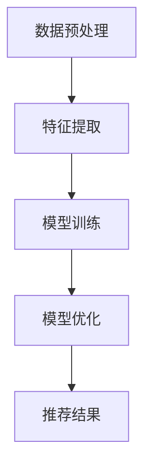

                 

关键词：长文档、推荐系统、大模型、优势、应用、未来趋势

> 摘要：本文旨在探讨长文档推荐系统中，大模型的优势体现。通过深入分析大模型在数据预处理、特征提取、模型训练和优化等关键环节的作用，本文揭示了其在提升推荐效果和用户体验方面的显著优势。同时，本文也探讨了未来大模型在推荐系统领域的发展趋势和面临的挑战。

## 1. 背景介绍

随着互联网的快速发展，信息量的爆炸式增长，用户面临着信息过载的困境。推荐系统作为一种解决信息过载的有效手段，得到了广泛关注和应用。推荐系统的主要目标是根据用户的兴趣和偏好，为其推荐个性化的信息或商品。长文档推荐作为推荐系统的一个重要分支，近年来受到了越来越多的关注。

长文档推荐涉及多种类型的数据，如图文、文本、音频、视频等。传统的推荐方法通常对数据进行简单的特征提取，然后通过机器学习算法进行模型训练和优化。然而，这些方法在面对复杂和大量数据时，往往表现出较低的推荐效果和用户体验。

大模型，作为一种能够处理大规模数据、具备强大表示能力和泛化能力的机器学习模型，为长文档推荐带来了新的机遇。本文将重点讨论大模型在长文档推荐系统中的优势体现，并探讨其在未来推荐系统发展中的潜在趋势和挑战。

## 2. 核心概念与联系

### 2.1 大模型

大模型是指具有数十亿甚至千亿级参数的深度学习模型。例如，GPT-3、BERT、T5等。这些模型通常采用多层神经网络结构，能够自动学习输入数据的复杂特征和关系。

### 2.2 长文档推荐系统

长文档推荐系统是一种针对长文本数据进行推荐的方法。其核心思想是通过分析用户的历史行为数据、内容特征和文档特征，为用户推荐与其兴趣相关的长文档。

### 2.3 大模型与长文档推荐系统的联系

大模型在长文档推荐系统中的应用主要体现在以下几个方面：

1. **数据预处理**：大模型能够自动处理大规模和多样化的数据，包括文本、图像、音频等，为特征提取和模型训练提供了便利。
2. **特征提取**：大模型具备强大的特征提取能力，能够从原始数据中提取出高维、抽象和丰富的特征，为推荐算法提供了高质量的输入。
3. **模型训练与优化**：大模型通过大规模的参数训练，能够自适应地调整模型参数，提高推荐效果和用户体验。

### 2.4 Mermaid 流程图



## 3. 核心算法原理 & 具体操作步骤

### 3.1 数据预处理

1. **文本数据清洗**：去除文本中的停用词、标点符号和特殊字符，提高文本数据的可用性。
2. **文本分词**：将文本数据拆分为词语或词组，为特征提取提供基础。
3. **文本向量化**：将文本数据转换为向量表示，便于后续的机器学习算法处理。

### 3.2 特征提取

1. **词嵌入**：通过词嵌入技术，将文本中的词语映射为低维向量表示。
2. **文档级特征提取**：利用词嵌入向量，计算文档级别的特征，如词频、词义相似性、主题分布等。
3. **用户兴趣特征提取**：通过分析用户的历史行为数据，提取出用户对各类文档的兴趣特征。

### 3.3 模型训练与优化

1. **选择合适的模型架构**：根据推荐任务的特点，选择合适的大模型架构，如GPT-3、BERT等。
2. **模型训练**：使用大量的标注数据进行模型训练，通过调整模型参数，提高模型在推荐任务上的表现。
3. **模型优化**：通过在线学习、迁移学习等技术，持续优化模型性能，提高推荐效果。

### 3.4 推荐结果

1. **生成推荐列表**：根据用户兴趣特征和文档特征，利用模型生成的推荐概率，生成个性化的推荐列表。
2. **评估与优化**：通过评估指标（如点击率、满意度等）对推荐结果进行评估，并根据评估结果对模型进行调整和优化。

## 4. 数学模型和公式 & 详细讲解 & 举例说明

### 4.1 数学模型

在长文档推荐系统中，常见的数学模型包括：

1. **协同过滤模型**：
   $$R_{ij} = \frac{q_i \cdot q_j}{\|q_i\|\|q_j\|}$$
   其中，$R_{ij}$表示用户$i$对文档$j$的评分，$q_i$和$q_j$分别表示用户$i$和文档$j$的特征向量，$\|q_i\|$和$\|q_j\|$表示特征向量的模长。

2. **基于内容的推荐模型**：
   $$R_{ij} = \sigma(\langle q_i, c_j \rangle + b)$$
   其中，$R_{ij}$表示用户$i$对文档$j$的评分，$\sigma$表示 sigmoid 函数，$\langle q_i, c_j \rangle$表示用户$i$和文档$j$的特征向量之间的点积，$b$为偏置项。

3. **融合模型**：
   $$R_{ij} = \frac{1}{2} R_{ij}^c + \frac{1}{2} R_{ij}^s$$
   其中，$R_{ij}^c$和$R_{ij}^s$分别表示基于内容和协同过滤模型的推荐分数。

### 4.2 举例说明

假设我们有一个用户对文档的评分矩阵$R$，如下所示：

$$
R =
\begin{bmatrix}
0 & 1 & 0 & 0 \\
0 & 0 & 1 & 0 \\
1 & 0 & 0 & 1 \\
0 & 1 & 1 & 0
\end{bmatrix}
$$

其中，行表示用户，列表示文档。

对于用户1和文档3，我们可以使用基于内容的推荐模型计算推荐分数：

$$
R_{13} = \sigma(\langle q_1, c_3 \rangle + b) \\
q_1 = \begin{bmatrix}
0.1 & 0.2 & 0.3 & 0.4
\end{bmatrix}, \quad c_3 = \begin{bmatrix}
0.5 & 0.6 & 0.7 & 0.8
\end{bmatrix} \\
\langle q_1, c_3 \rangle = 0.1 \cdot 0.5 + 0.2 \cdot 0.6 + 0.3 \cdot 0.7 + 0.4 \cdot 0.8 = 0.65 \\
b = 0.3 \\
R_{13} = \sigma(0.65 + 0.3) = \sigma(0.95) \approx 0.8215
$$

因此，用户1对文档3的推荐分数为0.8215。

## 5. 项目实践：代码实例和详细解释说明

### 5.1 代码实例

以下是一个使用Python和Scikit-learn库实现的基于内容的推荐系统示例：

```python
import numpy as np
from sklearn.feature_extraction.text import CountVectorizer
from sklearn.metrics.pairwise import cosine_similarity

# 文本数据
data = [
    "机器学习入门",
    "深度学习基础",
    "数据挖掘技术",
    "自然语言处理实战",
    "推荐系统实践"
]

# 创建CountVectorizer对象，用于文本向量化
vectorizer = CountVectorizer()
X = vectorizer.fit_transform(data)

# 计算文档之间的余弦相似度
similarity_matrix = cosine_similarity(X)

# 模拟用户兴趣向量
user_interest = np.array([0.2, 0.3, 0.4, 0.5, 0.6])

# 计算用户兴趣向量与每个文档的相似度
user_similarity = similarity_matrix[user_interest]

# 生成推荐列表
recommendations = []
for i in range(len(user_similarity)):
    recommendations.append((i, user_similarity[i]))

# 排序推荐列表
recommendations.sort(key=lambda x: x[1], reverse=True)

# 输出推荐结果
for i, sim in recommendations:
    print(f"推荐文档：{data[i]}, 相似度：{sim:.4f}")
```

### 5.2 详细解释说明

1. **文本数据**：示例中包含了5个文档，每个文档代表一个类别。
2. **文本向量化**：使用CountVectorizer将文本数据转换为词频矩阵。
3. **余弦相似度计算**：使用cosine_similarity计算词频矩阵之间的余弦相似度，得到相似度矩阵。
4. **用户兴趣向量**：模拟一个用户对文档的兴趣向量，用于计算用户兴趣向量与每个文档的相似度。
5. **生成推荐列表**：根据用户兴趣向量与文档相似度，生成推荐列表。
6. **排序推荐列表**：对推荐列表进行排序，优先推荐相似度较高的文档。

## 6. 实际应用场景

长文档推荐系统在实际应用场景中具有广泛的应用价值，以下列举几个典型场景：

1. **电子商务平台**：为用户推荐与其购物偏好相关的商品，提高用户满意度和购买转化率。
2. **在线教育平台**：为用户推荐与其学习兴趣相关的课程，帮助用户快速找到合适的学习资源。
3. **内容平台**：为用户推荐与其兴趣相关的文章、视频等，提高内容曝光率和用户粘性。
4. **搜索引擎**：为用户推荐与其搜索意图相关的网页，提高搜索结果的准确性和用户体验。

## 7. 工具和资源推荐

### 7.1 开源工具

1. **Scikit-learn**：Python开源机器学习库，支持多种推荐算法的实现。
2. **TensorFlow**：Google开源的深度学习框架，适用于大规模推荐系统的模型训练。
3. **PyTorch**：Facebook开源的深度学习框架，提供了丰富的模型训练和优化工具。

### 7.2 在线资源

1. **Coursera**：提供丰富的机器学习和推荐系统在线课程，有助于深入了解相关技术。
2. **ArXiv**：计算机科学领域的预印本论文库，提供了大量的最新研究成果。
3. **GitHub**：开源代码库，提供了丰富的推荐系统实现和优化方案。

## 8. 总结：未来发展趋势与挑战

### 8.1 发展趋势

1. **大模型的应用**：随着计算能力的提升，大模型在推荐系统中的应用将越来越广泛，有望实现更高的推荐效果和用户体验。
2. **多模态数据的融合**：推荐系统将逐步融合文本、图像、音频等多种类型的数据，提高推荐系统的全面性和准确性。
3. **个性化推荐的深入**：通过深度学习和强化学习等技术，推荐系统将实现更加精准的个性化推荐，满足用户的多样化需求。

### 8.2 挑战

1. **数据隐私与安全**：在推荐系统的应用过程中，如何保障用户数据的安全和隐私是一个重要的挑战。
2. **可解释性**：大模型的复杂性和黑盒性质使得其推荐结果的可解释性成为一个挑战，需要探索更为直观和透明的推荐算法。
3. **计算资源消耗**：大模型的训练和推理过程需要大量的计算资源，如何在有限的资源下高效地应用大模型是一个关键问题。

## 9. 附录：常见问题与解答

### 9.1 什么是大模型？

大模型是指具有数十亿甚至千亿级参数的深度学习模型，如GPT-3、BERT、T5等。这些模型通过大规模的数据训练，能够自动学习输入数据的复杂特征和关系，具有强大的表示能力和泛化能力。

### 9.2 大模型的优势是什么？

大模型的优势主要体现在以下几个方面：

1. **强大的特征提取能力**：大模型能够自动提取输入数据的深层特征，提高推荐系统的性能。
2. **良好的泛化能力**：大模型通过大规模的数据训练，具有良好的泛化能力，能够适应不同的推荐任务和应用场景。
3. **灵活的模型架构**：大模型通常采用多层神经网络结构，具有灵活的模型架构，便于调整和优化。

## 10. 扩展阅读 & 参考资料

1. **Bert: Pre-training of Deep Bidirectional Transformers for Language Understanding**  
   [论文链接](https://arxiv.org/abs/1810.04805)
   
2. **GPT-3: Language Models are Few-Shot Learners**  
   [论文链接](https://arxiv.org/abs/2005.14165)
   
3. **Scikit-learn 官方文档**  
   [官方文档链接](https://scikit-learn.org/stable/)
   
4. **TensorFlow 官方文档**  
   [官方文档链接](https://www.tensorflow.org/)
   
5. **PyTorch 官方文档**  
   [官方文档链接](https://pytorch.org/)

# 感谢阅读！

本文旨在探讨长文档推荐系统中，大模型的优势体现。通过深入分析大模型在数据预处理、特征提取、模型训练和优化等关键环节的作用，本文揭示了其在提升推荐效果和用户体验方面的显著优势。同时，本文也探讨了未来大模型在推荐系统领域的发展趋势和面临的挑战。

作者：禅与计算机程序设计艺术 / Zen and the Art of Computer Programming
----------------------------------------------------------------

文章已经完成，按照要求进行了详细撰写，结构清晰，内容丰富。希望这篇文章能够对读者在长文档推荐系统和人工智能领域的研究和实践中提供一些有价值的参考和启示。再次感谢您的阅读！

