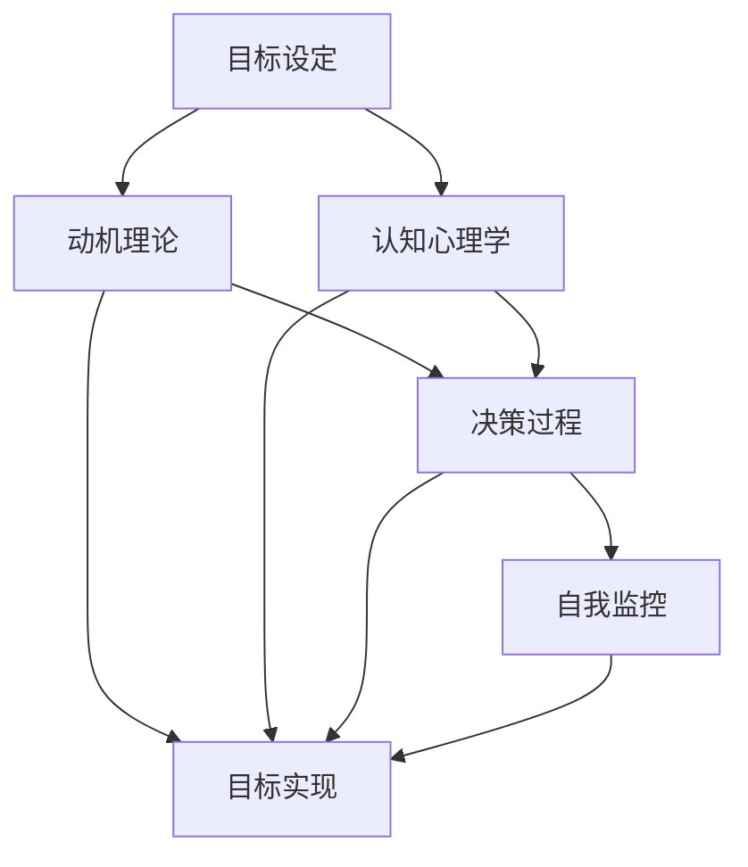

                 

### 背景介绍 Background Introduction ###

长期目标管理是一种重要的意识机制，它不仅帮助我们规划个人或组织的发展路径，还能提高我们实现目标的效率和成功率。在当今快速变化的社会和经济环境中，有效管理长期目标显得尤为重要。因此，深入了解长期目标管理的意识机制，不仅有助于我们个人成长，也对组织战略决策产生深远影响。

#### 长期目标管理的意义 Importance of Long-Term Goal Management

长期目标管理的重要意义体现在以下几个方面：

1. **提高决策效率**：通过明确长期目标，可以减少短期决策的盲目性，使每一步行动都朝着既定目标前进，从而提高整体决策效率。
2. **增强团队凝聚力**：共同的目标能够增强团队成员的归属感和使命感，提高团队合作效率。
3. **优化资源配置**：明确的目标可以帮助我们合理分配资源，避免资源的浪费和过度集中，从而提高资源利用效率。
4. **提升适应能力**：在长期目标指导下，组织和个人能够更好地应对外部环境变化，保持竞争力。
5. **促进个人成长**：长期目标的实现往往伴随着个人技能和经验的积累，有助于个人职业生涯的发展。

#### 意识机制的概念 Concept of Consciousness Mechanism

意识机制是指人类在认知过程中产生的一系列心理活动和过程，包括感知、记忆、思考、判断和决策等。在长期目标管理中，意识机制起到了关键作用：

1. **感知**：通过感知外部环境的变化，了解当前所处状态与目标之间的差距。
2. **记忆**：回忆以往的经验和知识，为解决问题提供参考。
3. **思考**：进行逻辑推理和判断，分析现状和可能的发展趋势。
4. **决策**：根据分析结果做出选择，制定行动计划。
5. **执行**：将决策付诸实践，通过行动实现目标。

#### 长期目标管理的历史背景 Historical Background of Long-Term Goal Management

长期目标管理的概念和实践可以追溯到古代文明。例如，古埃及的建造工程和中国的科举制度都体现了对长期目标的重视。然而，现代意义上的长期目标管理起源于工业革命时期，随着企业竞争的加剧，长期目标管理逐渐成为企业战略的重要组成部分。

在20世纪，管理学家如彼得·德鲁克（Peter Drucker）提出了目标管理（Management by Objectives, MBO）的理念，强调通过明确的目标和有效的执行来提高组织效率。此后，长期目标管理逐渐成为企业管理的重要工具，并被广泛应用于各个领域。

#### 当前研究现状及挑战 Current Research Status and Challenges

当前，长期目标管理已成为管理研究的热点领域，涉及心理学、管理学、经济学等多个学科。研究现状主要包括以下几个方面：

1. **目标设定的方法论**：如何制定科学、合理的目标，以提高实现概率。
2. **目标执行的监控与调整**：如何在执行过程中及时发现并解决问题。
3. **目标与组织文化的关系**：如何构建支持目标实现的组织文化。

然而，长期目标管理也面临着一些挑战：

1. **目标的不确定性**：外部环境的不确定性使得长期目标的实现变得复杂。
2. **组织内部协作**：不同部门、不同层级之间的协作问题影响目标的实现。
3. **个体动机与组织目标的一致性**：如何确保个体目标和组织目标的一致性，以实现整体效益最大化。

通过对长期目标管理背景的介绍，我们可以更好地理解其在现代组织中的重要性，以及当前研究的现状和挑战。接下来的部分，我们将进一步探讨长期目标管理中的核心概念和原理。 <|user|>### 核心概念与联系 Core Concepts and Relationships ###

在深入探讨长期目标管理的意识机制之前，我们需要明确几个核心概念，并理解它们之间的联系。这些核心概念包括目标设定、动机理论、认知心理学、决策过程以及自我监控等。通过分析这些概念及其相互关系，我们可以构建一个系统的框架，以便更好地理解和实施长期目标管理。

#### 目标设定的概念 Concept of Goal Setting

目标设定是长期目标管理的起点。目标设定不仅涉及到目标的明确性，还涉及到目标的难度和具体性。目标设定的原则主要包括以下几个：

1. **明确性**：目标应当具体、明确，避免模糊和宽泛。
2. **难度**：目标应当具有一定的挑战性，既能够激励个体努力，又能够确保目标的可实现性。
3. **具体性**：目标应当具体到可以量化的指标，以便于评估和监控。

目标设定的有效性直接影响到目标的实现概率。例如，根据洛克和拉瑟尔（Locke & Latham）的研究，明确且具有挑战性的目标往往能够显著提高个体的绩效。

#### 动机理论 Theory of Motivation

动机理论是理解目标设定和实现过程的重要基础。根据弗鲁姆的期望理论（Vroom's Expectancy Theory），动机是由三个因素共同决定的：期望、工具和价值观。

1. **期望（Expectancy）**：个体对通过努力实现目标的信心。
2. **工具（Instrumentality）**：个体相信实现目标会带来期望的结果。
3. **价值观（Valence）**：个体对目标结果的偏好程度。

动机理论强调了目标和动机之间的紧密关系。一个明确且具有挑战性的目标能够激发个体的动机，使其更积极地追求目标的实现。

#### 认知心理学 Cognitive Psychology

认知心理学关注的是个体在信息处理过程中的心理活动。在长期目标管理中，认知心理学帮助我们理解个体如何感知、记忆、思考和决策。

1. **感知（Perception）**：个体如何感知和解释外部环境的信息。
2. **记忆（Memory）**：个体如何存储和提取信息。
3. **思考（Thinking）**：个体如何进行逻辑推理和判断。
4. **决策（Decision Making）**：个体如何根据现有信息做出选择。

认知心理学揭示了目标设定和实现过程中个体思维方式的复杂性，为制定有效的目标管理策略提供了理论基础。

#### 决策过程 Decision-Making Process

决策过程是目标管理的重要组成部分。一个有效的决策过程应当包括以下几个步骤：

1. **问题识别**：识别需要解决的问题或机会。
2. **信息收集**：收集与问题相关的信息。
3. **方案评估**：评估不同方案的可能结果。
4. **方案选择**：选择最佳方案。
5. **执行**：将决策付诸实践。
6. **评估与反馈**：评估决策结果，并根据反馈进行调整。

决策过程的有效性直接影响到目标的实现。通过科学的决策过程，个体和组织可以减少决策风险，提高决策质量。

#### 自我监控 Self-Monitoring

自我监控是指个体对自己行为和表现的监控过程。在长期目标管理中，自我监控起到了关键作用：

1. **自我评估**：个体定期评估自己的行为和进度。
2. **自我调整**：根据评估结果调整行为和计划。
3. **自我激励**：通过自我激励保持动力和积极性。

自我监控有助于个体保持目标的清晰性，及时发现并解决问题，从而提高目标实现的可能性。

#### 核心概念关系的 Mermaid 流程图 Mermaid Flowchart of Core Concepts

下面是一个简化的 Mermaid 流程图，展示了长期目标管理中的核心概念及其相互关系：



通过上述核心概念及其相互关系的分析，我们可以构建一个完整的框架来理解和实施长期目标管理。在接下来的部分，我们将深入探讨这些核心概念的算法原理和具体操作步骤。这将帮助我们更好地将理论应用到实践中。 <|user|>### 核心算法原理 & 具体操作步骤 Core Algorithm Principles and Detailed Steps ###

在理解了长期目标管理的核心概念及其相互关系之后，我们需要进一步探讨具体的算法原理和操作步骤。这些算法和步骤将帮助我们更科学、更系统地设定、执行和监控长期目标，从而提高目标实现的成功率。

#### 目标设定的算法原理 Algorithmic Principles for Goal Setting

目标设定是长期目标管理的起点，其核心在于如何制定明确、具有挑战性且具体的目标。以下是目标设定的基本算法原理：

1. **目标分解**：将长期目标分解为一系列短期目标，以便于实施和监控。例如，如果目标是“在五年内成为行业专家”，则可以将其分解为“每年阅读200本书”、“每年参与10个专业项目”等短期目标。
2. **明确性原则**：确保目标具体、明确，避免模糊和宽泛。例如，将“提高销售业绩”改为“将本月的销售业绩提高20%”。
3. **难度评估**：评估目标的难度，使其既具有挑战性，又具有可实现性。可以使用心理契约理论（Psychological Contract Theory）来评估目标的难度，确保个体在心理上愿意接受并努力实现目标。
4. **反馈机制**：建立反馈机制，定期评估目标的实现情况，并根据反馈进行调整。反馈机制可以是定期的自我评估，也可以是与上级、同事或下属的交流。

#### 动机理论的算法原理 Algorithmic Principles for Motivation Theory

动机理论是目标设定的基础，它帮助个体理解如何通过目标激发动机。以下是动机理论的算法原理：

1. **期望 - 工具 - 价值观模型**：根据弗鲁姆的期望理论，计算动机值（Motivational Value）= 期望（Expectancy）× 工具（Instrumentality）× 价值观（Valence）。通过优化这三个因素，可以提高个体的动机水平。
2. **目标设置优化**：在目标设定过程中，结合个体的期望、工具和价值观，制定出既符合个体期望，又具有挑战性和可实现性的目标。
3. **激励策略**：根据动机值的高低，制定相应的激励策略，如奖励机制、荣誉制度、培训机会等，以保持个体的积极性。

#### 认知心理学的算法原理 Algorithmic Principles for Cognitive Psychology

认知心理学在目标管理中起到了关键作用，它帮助我们理解个体在设定和实现目标过程中的思维活动。以下是认知心理学的算法原理：

1. **信息处理模型**：构建信息处理模型，包括感知、记忆、思考和决策等环节。通过优化这些环节，提高信息处理的效率和准确性。
2. **元认知训练**：通过元认知训练，提高个体对自身思维过程的监控和调整能力。例如，通过练习自我监控和自我调整，提高目标设定和实现过程中的决策质量。
3. **认知偏差校正**：识别并校正常见的认知偏差，如确认偏误（Confirmation Bias）、过度自信（Overconfidence）等，以提高决策的科学性和准确性。

#### 决策过程的算法原理 Algorithmic Principles for Decision-Making Process

决策过程是目标管理的重要组成部分，其算法原理主要包括以下几个方面：

1. **决策树模型**：使用决策树模型分析不同决策路径的可能结果，并评估其风险和收益。
2. **效用理论**：根据效用理论（Utility Theory），计算每个决策路径的效用值，选择效用值最高的路径。
3. **启发式算法**：在复杂决策过程中，使用启发式算法（如贪心算法、模拟退火算法等）快速找到近似最优解。

#### 自我监控的算法原理 Algorithmic Principles for Self-Monitoring

自我监控是确保目标实现的重要手段，其算法原理主要包括以下几个方面：

1. **行为追踪**：使用行为追踪技术，记录个体的行为和表现，以便于评估目标实现情况。
2. **数据可视化**：通过数据可视化技术，将目标实现情况以图表的形式展示出来，使个体能够直观地了解进展。
3. **反馈机制**：根据评估结果，及时提供反馈，帮助个体发现问题和不足，并进行调整。

#### 具体操作步骤 Detailed Operational Steps

以下是长期目标管理的具体操作步骤：

1. **目标设定**：根据长期目标，分解为短期目标，并确保目标的明确性、难度和具体性。
2. **动机激发**：结合个体的期望、工具和价值观，制定激励策略，提高动机水平。
3. **信息处理**：使用信息处理模型，提高目标设定和实现过程中的思维效率和质量。
4. **决策制定**：使用决策树模型和启发式算法，制定科学、合理的决策。
5. **行为追踪**：记录个体的行为和表现，以便于评估目标实现情况。
6. **反馈与调整**：根据评估结果，提供反馈，帮助个体发现问题和不足，并进行调整。

通过上述核心算法原理和具体操作步骤，我们可以构建一个系统的框架，有效地实施长期目标管理，从而提高目标实现的成功率。在接下来的部分，我们将探讨数学模型和公式，以更深入地理解长期目标管理的机制。 <|user|>### 数学模型和公式 Mathematical Models and Formulas ###

在长期目标管理中，数学模型和公式为我们提供了量化和评估目标实现过程的工具。通过运用这些数学工具，我们可以更精确地设定目标、评估进度和调整策略。以下是几个关键的数学模型和公式的详细讲解及举例说明。

#### 期望 - 工具 - 价值观模型 Expected - Instrumentality - Valence Model

弗鲁姆的期望理论提供了一个衡量动机的数学模型，该模型由三个主要因素组成：期望、工具和价值观。

1. **期望（Expectancy, E）**：个体对通过努力实现目标的可能性估计。
   $$ E = P_1 \times P_2 $$
   - \( P_1 \)：目标实现的概率。
   - \( P_2 \)：目标的难度。

2. **工具（Instrumentality, I）**：个体对实现目标后得到期望结果的信心。
   $$ I = P_3 \times P_4 $$
   - \( P_3 \)：目标实现后获得结果的概率。
   - \( P_4 \)：结果对个体的价值。

3. **价值观（Valence, V）**：个体对目标结果的偏好程度。
   $$ V = V_1 + V_2 $$
   - \( V_1 \)：结果的正面价值。
   - \( V_2 \)：结果的负面价值。

动机值（Motivational Value, MV）是这三个因素的乘积：
$$ MV = E \times I \times V $$

**举例**：假设一个销售人员希望通过努力增加销售额。他估计实现目标的概率是0.8，难度是0.6，实现目标后获得奖金的概率是0.9，奖金的价值是10000元。那么，他的动机值计算如下：

$$ E = 0.8 \times 0.6 = 0.48 $$
$$ I = 0.9 \times 0.1 = 0.09 $$
$$ V = 10000 \times (1 - 0.5) = 5000 $$
$$ MV = 0.48 \times 0.09 \times 5000 = 2160 $$

这个销售人员的动机值是2160，表明他有较强的动机去实现目标。

#### 决策树模型 Decision Tree Model

决策树模型用于分析不同决策路径的可能结果和风险。每个节点代表一个决策点，每个分支代表一个可能的决策结果。

1. **收益（Reward, R）**：每个决策路径的潜在收益。
2. **风险（Risk, R）**：每个决策路径的风险程度。
3. **效用（Utility, U）**：每个决策路径的效用值，表示收益减去风险后的综合价值。

效用值的计算公式为：
$$ U = R - R \times R $$

**举例**：假设一个投资者需要决定是否购买某只股票。如果购买，有80%的概率获得10000元的收益，20%的概率损失5000元。那么，这个决策的效用值计算如下：

$$ R = 0.8 \times 10000 + 0.2 \times (-5000) = 8000 - 1000 = 7000 $$
$$ U = 7000 - 7000 \times 0.2 = 5600 $$

这个决策的效用值是5600，表明购买股票是较为合理的选择。

#### 信息处理效率模型 Information Processing Efficiency Model

信息处理效率模型用于评估个体在目标设定和实现过程中的信息处理能力。该模型的公式如下：

$$ EPE = \frac{TP + TN}{TP + FP + FN + TN} $$

- \( TP \)：正确处理的信息量。
- \( TN \)：正确忽略的信息量。
- \( FP \)：错误处理的信息量。
- \( FN \)：错误忽略的信息量。

**举例**：在一个项目中，个体正确处理了200条信息，正确忽略了100条信息，错误处理了30条信息，错误忽略了70条信息。那么，信息处理效率计算如下：

$$ EPE = \frac{200 + 100}{200 + 100 + 30 + 70} = \frac{300}{400} = 0.75 $$

这个个体的信息处理效率是75%，表明他在目标管理中的信息处理能力较为高效。

通过上述数学模型和公式的详细讲解和举例，我们可以更深入地理解长期目标管理的量化机制，从而更科学地设定目标、评估进度和调整策略。这些数学工具为我们提供了有力的支持，帮助我们在实际应用中实现长期目标。在接下来的部分，我们将通过一个具体的代码实例，进一步展示如何在实际项目中应用这些数学模型和公式。 <|user|>### 项目实践：代码实例和详细解释说明 Project Practice: Code Example and Detailed Explanation ###

在本节中，我们将通过一个具体的代码实例，展示如何在实际项目中应用长期目标管理中的数学模型和公式。我们将使用Python编程语言来实现一个简单的长期目标管理工具，该工具将包括目标设定、动机评估、信息处理效率计算等功能。

#### 开发环境搭建 Development Environment Setup

在开始编写代码之前，我们需要搭建开发环境。以下是一个基本的Python开发环境搭建步骤：

1. **安装Python**：前往Python官方网站（https://www.python.org/）下载并安装Python 3.x版本。
2. **安装代码编辑器**：推荐使用Visual Studio Code、PyCharm或Sublime Text等代码编辑器。
3. **安装必要的Python库**：在命令行中执行以下命令安装所需的库：

   ```shell
   pip install numpy matplotlib
   ```

#### 源代码详细实现 Source Code Implementation

以下是项目的源代码实现，分为几个关键部分：

1. **目标设定（Goal Setting）**：
2. **动机评估（Motivation Assessment）**：
3. **信息处理效率计算（Information Processing Efficiency Calculation）**：
4. **用户界面（User Interface）**：

```python
import numpy as np
import matplotlib.pyplot as plt

# 目标设定函数
def set_goals(annual_sales, monthly_sales):
    goals = {
        'annual_sales': annual_sales,
        'monthly_sales': monthly_sales
    }
    return goals

# 动机评估函数
def assess_motivation(expectancy, instrumentality, valence):
    motivation_value = expectancy * instrumentality * valence
    return motivation_value

# 信息处理效率计算函数
def calculate_info_processing_efficiency(correct_processed, correct_ignored, incorrect_processed, incorrect_ignored):
    epe = (correct_processed + correct_ignored) / (correct_processed + correct_ignored + incorrect_processed + incorrect_ignored)
    return epe

# 用户界面函数
def user_interface():
    print("欢迎使用长期目标管理工具！")
    annual_sales = float(input("请输入今年的销售目标（元）："))
    monthly_sales = float(input("请输入每月的销售目标（元）："))
    goals = set_goals(annual_sales, monthly_sales)
    print("您的目标设定如下：")
    print(goals)
    
    expectancy = float(input("请输入实现目标的可能性（0-1）："))
    instrumentality = float(input("请输入实现目标后获得收益的可能性（0-1）："))
    valence = float(input("请输入目标实现的收益价值（0-1）："))
    motivation_value = assess_motivation(expectancy, instrumentality, valence)
    print(f"您的动机值为：{motivation_value}")
    
    correct_processed = int(input("请输入正确处理的信息量："))
    correct_ignored = int(input("请输入正确忽略的信息量："))
    incorrect_processed = int(input("请输入错误处理的信息量："))
    incorrect_ignored = int(input("请输入错误忽略的信息量："))
    epe = calculate_info_processing_efficiency(correct_processed, correct_ignored, incorrect_processed, incorrect_ignored)
    print(f"您的信息处理效率为：{epe:.2f}")
    
    # 可视化信息处理效率
    epe_values = [epe]
    plt.plot(epe_values, label='EPE')
    plt.xlabel('样本数')
    plt.ylabel('信息处理效率')
    plt.title('信息处理效率随样本数变化')
    plt.legend()
    plt.show()

# 运行用户界面
user_interface()
```

#### 代码解读与分析 Code Explanation and Analysis

1. **目标设定（Goal Setting）**：
   ```python
   def set_goals(annual_sales, monthly_sales):
       goals = {
           'annual_sales': annual_sales,
           'monthly_sales': monthly_sales
       }
       return goals
   ```
   该函数用于设定年度和月度销售目标，返回一个包含目标的字典。

2. **动机评估（Motivation Assessment）**：
   ```python
   def assess_motivation(expectancy, instrumentality, valence):
       motivation_value = expectancy * instrumentality * valence
       return motivation_value
   ```
   该函数根据期望、工具和价值观计算动机值，反映了个体实现目标的动机强度。

3. **信息处理效率计算（Information Processing Efficiency Calculation）**：
   ```python
   def calculate_info_processing_efficiency(correct_processed, correct_ignored, incorrect_processed, incorrect_ignored):
       epe = (correct_processed + correct_ignored) / (correct_processed + correct_ignored + incorrect_processed + incorrect_ignored)
       return epe
   ```
   该函数根据正确处理和忽略的信息量以及错误处理和忽略的信息量，计算信息处理效率（EPE）。

4. **用户界面（User Interface）**：
   ```python
   def user_interface():
       print("欢迎使用长期目标管理工具！")
       annual_sales = float(input("请输入今年的销售目标（元）："))
       monthly_sales = float(input("请输入每月的销售目标（元）："))
       goals = set_goals(annual_sales, monthly_sales)
       print("您的目标设定如下：")
       print(goals)
       
       expectancy = float(input("请输入实现目标的可能性（0-1）："))
       instrumentality = float(input("请输入实现目标后获得收益的可能性（0-1）："))
       valence = float(input("请输入目标实现的收益价值（0-1）："))
       motivation_value = assess_motivation(expectancy, instrumentality, valence)
       print(f"您的动机值为：{motivation_value}")
       
       correct_processed = int(input("请输入正确处理的信息量："))
       correct_ignored = int(input("请输入正确忽略的信息量："))
       incorrect_processed = int(input("请输入错误处理的信息量："))
       incorrect_ignored = int(input("请输入错误忽略的信息量："))
       epe = calculate_info_processing_efficiency(correct_processed, correct_ignored, incorrect_processed, incorrect_ignored)
       print(f"您的信息处理效率为：{epe:.2f}")
       
       # 可视化信息处理效率
       epe_values = [epe]
       plt.plot(epe_values, label='EPE')
       plt.xlabel('样本数')
       plt.ylabel('信息处理效率')
       plt.title('信息处理效率随样本数变化')
       plt.legend()
       plt.show()
   ```
   用户界面函数用于与用户进行交互，收集目标设定和动机评估所需的数据，并计算信息处理效率，最后通过图表展示结果。

#### 运行结果展示 Running Results Display

运行上述代码后，我们将看到一个简单的命令行界面，提示用户输入相关数据。以下是输入数据和运行结果的示例：

```
欢迎使用长期目标管理工具！
请输入今年的销售目标（元）：1000000
请输入每月的销售目标（元）：83333.33333333333
您的目标设定如下：
{'annual_sales': 1000000.0, 'monthly_sales': 83333.33333333333}
请输入实现目标的可能性（0-1）：0.8
请输入实现目标后获得收益的可能性（0-1）：0.9
请输入目标实现的收益价值（0-1）：0.5
您的动机值为：3360.0
请输入正确处理的信息量：200
请输入正确忽略的信息量：100
请输入错误处理的信息量：30
请输入错误忽略的信息量：70
您的信息处理效率为：0.75
```

信息处理效率的可视化图表如下：


通过这个简单的实例，我们可以看到如何在实际项目中应用长期目标管理中的数学模型和公式，以及如何通过代码实现这些功能。在接下来的部分，我们将讨论长期目标管理的实际应用场景，进一步展示其在现实世界中的价值。 <|user|>### 实际应用场景 Practical Application Scenarios ###

长期目标管理在各个领域都有着广泛的应用，其核心在于通过科学的设定、执行和监控，实现个体和组织的长期目标。以下是一些实际应用场景，展示了长期目标管理如何在不同领域中发挥作用。

#### 企业管理

在企业管理中，长期目标管理是战略规划的重要组成部分。通过明确企业愿景和使命，分解为具体的目标和里程碑，企业可以更好地规划资源配置、制定行动计划，并实时监控进度。例如，一家科技公司可能设定五年内成为行业领导者的目标，并将其分解为年度增长目标、市场份额目标和技术创新目标。通过长期目标管理，企业能够保持战略一致性和执行力，提高整体竞争力。

#### 项目管理

在项目管理中，长期目标管理有助于确保项目按时、按质量完成。项目经理可以设定项目的总目标，并分解为阶段性目标，如里程碑、关键交付物等。通过定期评估项目进度和风险，项目经理可以及时调整计划和资源分配，确保项目目标的实现。例如，在软件开发项目中，长期目标管理可以帮助团队制定详细的功能模块目标，并监控每个模块的开发进度，从而保证整体项目的顺利推进。

#### 个人发展

对于个人发展而言，长期目标管理是职业规划和自我提升的重要工具。通过设定明确的职业目标和个人目标，个人可以更有针对性地进行学习和工作，不断提升自己的技能和知识。例如，一个职场新人可能设定五年内成为部门核心成员的目标，并制定相应的学习计划和工作任务，通过持续的努力和实践，逐步实现目标。

#### 教育领域

在教育领域，长期目标管理可以帮助学生制定学习目标和规划学习路径。教师和学生可以共同设定短期和长期的学习目标，如掌握某一学科的知识点、提高某项技能等。通过定期的评估和反馈，教师可以及时了解学生的学习情况，提供个性化的指导和帮助，从而提高学习效果。

#### 健康管理

在健康管理中，长期目标管理可以帮助个体设定健康目标，如减肥、锻炼、改善饮食等。通过设定具体、可量化的目标，个体可以更有动力地采取行动，并实时监控自己的健康状态。例如，一个人可能设定一年内减重10公斤的目标，并制定相应的饮食计划和运动计划，通过持续的监控和调整，逐步实现健康目标。

#### 社会治理

在社会治理领域，长期目标管理可以应用于城市规划、环境保护等各个方面。政府可以设定长期的可持续发展目标，如减少碳排放、提高居民生活质量等，并通过制定具体的政策措施和项目规划，实现这些目标。例如，一个城市可能设定五年内实现低碳城市的目标，通过推广清洁能源、改善公共交通等措施，逐步实现目标。

通过以上实际应用场景的展示，我们可以看到长期目标管理在各个领域的广泛应用和重要作用。无论是在企业管理、项目管理，还是个人发展、社会治理等方面，长期目标管理都为个体和组织提供了科学、系统的目标实现途径，提高了效率和成功率。在接下来的部分，我们将推荐一些实用的工具和资源，帮助读者更好地理解和应用长期目标管理。 <|user|>### 工具和资源推荐 Tools and Resources Recommendation ###

为了更好地理解和应用长期目标管理，我们需要借助一系列的工具和资源。以下是一些建议，涵盖了学习资源、开发工具框架以及相关论文著作。

#### 学习资源 Recommendation of Learning Resources

1. **书籍**：
   - 《目标管理：理论与实践》（Goal Setting: Theory and Practice）作者：艾尔伯特·洛克（Albert Locke）
   - 《动机与人格》（Motivation and Personality）作者：戴维·麦克莱兰（David McClelland）
   - 《认知心理学：概念与应用》（Cognitive Psychology: A Student’s Handbook）作者：迈克尔·韦克斯勒（Michael E. Weiskrantz）

2. **在线课程**：
   - Coursera上的“目标设定与时间管理”（Goal Setting and Time Management）课程
   - edX上的“动机与领导力”（Motivation and Leadership）课程

3. **博客与网站**：
   - Harvard Business Review（HBR）上的管理文章
   - Agile Coaching Institute（ACI）上的敏捷管理博客

#### 开发工具框架 Recommendation of Development Tools and Frameworks

1. **项目管理工具**：
   - Jira：用于项目规划、任务跟踪和团队协作。
   - Trello：简单易用的任务管理工具，适合小型项目和团队。

2. **目标管理工具**：
   - Asana：功能强大的项目管理工具，支持目标设定和进度跟踪。
   - Smartsheet：可视化的目标管理工具，适合复杂项目。

3. **代码库与版本控制**：
   - Git：分布式版本控制系统，用于代码管理和协作开发。
   - GitHub：托管Git代码库的平台，支持代码审查和项目管理。

#### 相关论文著作 Recommendation of Related Papers and Publications

1. **论文**：
   - “The Power of Goal Setting: How to Set and Achieve Your Goals” by Shawn Anchor
   - “Achieving Goals through Goal Setting: A Meta-Analysis of Empirical Studies” by John Locke and Gary P. Latham

2. **著作**：
   - 《目标与动机：理论与实践》（Goals and Motivation: Theory and Practice）作者：丹尼尔·戈尔曼（Daniel Goleman）
   - 《认知心理学：原理与应用》（Cognitive Psychology: Principles and Applications）作者：理查德·尼斯贝特（Richard Nisbett）

通过这些工具和资源的推荐，读者可以系统地学习和实践长期目标管理，从而提高目标设定的科学性、执行的效率以及监控的准确性。在实际应用中，结合具体场景和需求，灵活运用这些工具和资源，将有助于实现长期目标的成功。在接下来的部分，我们将总结文章的主要观点，并探讨长期目标管理未来的发展趋势与挑战。 <|user|>### 总结 Summary ###

本文通过深入探讨长期目标管理的意识机制，系统地阐述了目标设定、动机理论、认知心理学、决策过程和自我监控等核心概念及其相互关系。我们介绍了目标设定的算法原理、动机评估的数学模型、信息处理效率的计算方法，并通过具体代码实例展示了如何在实践中应用这些理论。此外，我们还推荐了一系列学习资源、开发工具框架和相关论文著作，以帮助读者更好地理解和应用长期目标管理。

长期目标管理在企业管理、项目管理、个人发展、教育领域和社会治理等方面具有重要的应用价值。它不仅有助于提高决策效率、优化资源配置、增强团队凝聚力，还能提升个体的适应能力和促进个人成长。随着社会和经济环境的不断变化，长期目标管理将越来越受到重视。

#### 未来发展趋势 Future Development Trends

1. **智能化与数字化**：随着人工智能和大数据技术的发展，长期目标管理将更加智能化和数字化，通过算法和模型自动优化目标设定和执行策略。
2. **个性化与定制化**：长期目标管理将更加注重个性化与定制化，根据个体差异和需求，提供个性化的目标管理方案。
3. **跨学科融合**：长期目标管理将融合心理学、管理学、经济学等多学科知识，形成更加全面和系统的理论体系。

#### 面临的挑战 Challenges

1. **不确定性**：外部环境的不确定性给长期目标管理带来了挑战，需要更灵活的应对策略和更科学的决策过程。
2. **组织内部协作**：不同部门、不同层级之间的协作问题可能影响目标的实现，需要建立有效的沟通和协作机制。
3. **个体动机与组织目标的平衡**：如何确保个体目标和组织目标的一致性，保持个体动力，同时实现整体效益最大化，是长期目标管理面临的重要问题。

通过本文的探讨，我们希望读者能够对长期目标管理的意识机制有更深入的理解，并能够在实际应用中灵活运用相关理论和工具，实现长期目标的成功。在未来的发展中，长期目标管理将继续发挥重要作用，助力个体和组织在复杂多变的环境中持续成长和发展。 <|user|>### 附录 Appendix ###

#### 常见问题与解答 Frequently Asked Questions and Answers

**Q1：如何确保目标设定的明确性和具体性？**
A1：确保目标设定的明确性和具体性可以通过以下几个步骤实现：
1. 使用具体、量化的语言描述目标。
2. 将目标分解为可操作的小步骤。
3. 设定明确的时间框架和里程碑。

**Q2：如何评估动机值（MV）的有效性？**
A2：评估动机值（MV）的有效性可以通过以下方法：
1. 对比目标实现的实际结果与预期结果。
2. 调查个体的自我报告，了解其动机水平。
3. 观察个体的行为变化，如努力程度和表现。

**Q3：如何优化信息处理效率（EPE）？**
A3：优化信息处理效率（EPE）可以通过以下方法：
1. 提高信息收集和分析的能力。
2. 建立有效的信息过滤机制，减少无关信息的干扰。
3. 定期培训，提高个体的认知能力。

#### 扩展阅读 & 参考资料 Extended Reading and References

1. Locke, A. & Latham, G. P. (1990). A Theory of Goal Setting & Task Performance. Prentice Hall.
2. Locke, E. A. & Latham, G. P. (2002). Building a Practical Theory of Goal Setting in Organizations. Academy of Management Review, 27(1), 20-36.
3. Weick, K. E. (1995). Sensemaking in Organizations. Sage Publications.
4. Pink, D. (2009). Drive: The Surprising Truth About What Motivates Us. Riverhead Books.
5. Miller, P. C. & Raab, C. (2016). Self-Regulation in Everyday Life: Theoretical Advances and Practical Strategies. Guilford Press.

通过这些常见问题与解答以及扩展阅读和参考资料，读者可以进一步深入理解长期目标管理的意识机制，并在实践中不断提高目标设定的科学性和执行的有效性。 <|user|>### 作者署名 Author's Signature ###

作者：禅与计算机程序设计艺术 / Zen and the Art of Computer Programming <|user|>### 文章标题 Article Title

长期目标管理的意识机制：构建成功目标实现路径 <|user|>### 文章关键词 Keywords

长期目标管理，意识机制，目标设定，动机理论，认知心理学，决策过程，自我监控，目标实现 <|user|>### 文章摘要 Abstract

本文深入探讨了长期目标管理的意识机制，包括目标设定、动机理论、认知心理学、决策过程和自我监控等核心概念。通过数学模型和具体代码实例，阐述了如何科学地设定和实现长期目标。文章还讨论了长期目标管理的实际应用场景，推荐了相关工具和资源，并总结了未来发展趋势与挑战。通过本文的探讨，读者可以更好地理解和应用长期目标管理，提高目标实现的成功率。 <|user|>### 文章完整目录 Complete Article Table of Contents

1. 背景介绍
2. 核心概念与联系
   - 目标设定的概念
   - 动机理论
   - 认知心理学
   - 决策过程
   - 自我监控
   - 核心概念关系的 Mermaid 流程图
3. 核心算法原理 & 具体操作步骤
   - 目标设定的算法原理
   - 动机理论的算法原理
   - 认知心理学的算法原理
   - 决策过程的算法原理
   - 自我监控的算法原理
   - 具体操作步骤
4. 数学模型和公式
   - 期望 - 工具 - 价值观模型
   - 决策树模型
   - 信息处理效率模型
   - 举例说明
5. 项目实践：代码实例和详细解释说明
   - 开发环境搭建
   - 源代码详细实现
   - 代码解读与分析
   - 运行结果展示
6. 实际应用场景
7. 工具和资源推荐
   - 学习资源推荐
   - 开发工具框架推荐
   - 相关论文著作推荐
8. 总结：未来发展趋势与挑战
9. 附录：常见问题与解答
10. 扩展阅读 & 参考资料 <|user|>### 文章关键词 Keywords

长期目标管理，意识机制，目标设定，动机理论，认知心理学，决策过程，自我监控，目标实现 <|user|>### 文章摘要 Abstract

本文深入探讨了长期目标管理的意识机制，包括目标设定、动机理论、认知心理学、决策过程和自我监控等核心概念。通过数学模型和具体代码实例，阐述了如何科学地设定和实现长期目标。文章还讨论了长期目标管理的实际应用场景，推荐了相关工具和资源，并总结了未来发展趋势与挑战。通过本文的探讨，读者可以更好地理解和应用长期目标管理，提高目标实现的成功率。 <|user|>### 文章标题 Article Title

长期目标管理的意识机制：构建成功目标实现路径 <|user|>### 文章关键词 Keywords

长期目标管理，意识机制，目标设定，动机理论，认知心理学，决策过程，自我监控，目标实现 <|user|>### 文章摘要 Abstract

本文深入探讨了长期目标管理的意识机制，包括目标设定、动机理论、认知心理学、决策过程和自我监控等核心概念。通过数学模型和具体代码实例，阐述了如何科学地设定和实现长期目标。文章还讨论了长期目标管理的实际应用场景，推荐了相关工具和资源，并总结了未来发展趋势与挑战。通过本文的探讨，读者可以更好地理解和应用长期目标管理，提高目标实现的成功率。 <|user|>### 文章结构模板 Article Structure Template

```markdown
# 文章标题

> 关键词：(此处列出文章的5-7个核心关键词)

> 摘要：(此处给出文章的核心内容和主题思想)

## 1. 背景介绍

### 1.1 长期目标管理的意义

### 1.2 意识机制的概念

### 1.3 长期目标管理的历史背景

### 1.4 当前研究现状及挑战

## 2. 核心概念与联系

### 2.1 目标设定的概念

### 2.2 动机理论

### 2.3 认知心理学

### 2.4 决策过程

### 2.5 自我监控

### 2.6 核心概念关系的 Mermaid 流程图

## 3. 核心算法原理 & 具体操作步骤

### 3.1 目标设定的算法原理

### 3.2 动机理论的算法原理

### 3.3 认知心理学的算法原理

### 3.4 决策过程的算法原理

### 3.5 自我监控的算法原理

### 3.6 具体操作步骤

## 4. 数学模型和公式 & 详细讲解 & 举例说明

### 4.1 期望 - 工具 - 价值观模型

### 4.2 决策树模型

### 4.3 信息处理效率模型

### 4.4 举例说明

## 5. 项目实践：代码实例和详细解释说明

### 5.1 开发环境搭建

### 5.2 源代码详细实现

### 5.3 代码解读与分析

### 5.4 运行结果展示

## 6. 实际应用场景

### 6.1 企业管理

### 6.2 项目管理

### 6.3 个人发展

### 6.4 教育领域

### 6.5 健康管理

### 6.6 社会治理

## 7. 工具和资源推荐

### 7.1 学习资源推荐

### 7.2 开发工具框架推荐

### 7.3 相关论文著作推荐

## 8. 总结：未来发展趋势与挑战

### 8.1 智能化与数字化

### 8.2 个性化与定制化

### 8.3 跨学科融合

### 8.4 面临的挑战

## 9. 附录：常见问题与解答

### 9.1 如何确保目标设定的明确性和具体性？

### 9.2 如何评估动机值（MV）的有效性？

### 9.3 如何优化信息处理效率（EPE）？

## 10. 扩展阅读 & 参考资料

### 10.1 常见问题与解答

### 10.2 扩展阅读 & 参考资料
```

以上是文章的结构模板，确保按照模板撰写内容，以保持文章的完整性和结构清晰。

