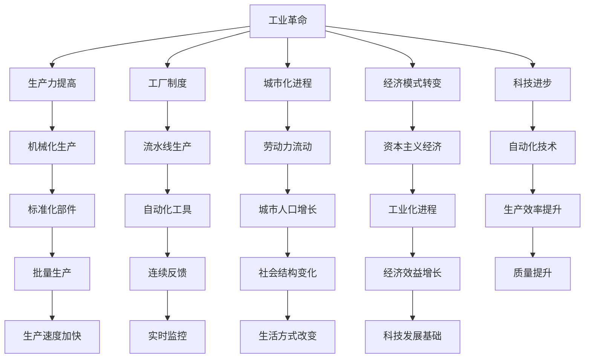

                 

### 1. 背景介绍

在工业革命的历史长河中，阿克莱特（Richard Arkwright）和福特（Henry Ford）两位杰出的工业先驱分别扮演了重要的角色，他们的贡献深刻地改变了制造业的面貌。本文将深入探讨阿克莱特与福特在工业革命中的贡献，通过逻辑清晰、结构紧凑的分析，呈现他们的创新理念和实际操作，以及这些创新如何推动了现代制造业的发展。

阿克莱特，生于1732年，是英国纺织工业的先驱。他发明了水力纺纱机，这一发明不仅提高了纺织生产效率，还奠定了现代工厂制度的基础。福特，生于1863年，是美国的汽车工业巨头，他引入了大规模流水线生产方式，这一革命性生产模式的成功应用，彻底改变了世界制造业的格局。

工业革命是一场深刻影响世界经济、社会和技术的变革，它始于18世纪末的英国，随后迅速传播到欧洲和美洲。这场变革不仅带来了生产力的飞跃，还催生了现代工业体系和城市化进程。在这个背景下，阿克莱特与福特分别以他们独特的创新，推动了工业革命的进一步发展。

本文的结构如下：首先，我们将回顾工业革命的背景，解释为什么这个时期是如此重要；接着，我们将详细探讨阿克莱特发明水力纺纱机的原理及其对纺织工业的影响；然后，我们将分析福特引入大规模流水线生产方式的具体过程及其带来的变革；最后，我们将总结两位工业先驱的共同点与差异，并讨论他们的贡献如何塑造了现代制造业。

通过本文的逐步分析，我们将能够更深入地理解阿克莱特与福特在工业革命中的重要作用，以及他们的创新如何成为现代制造业的基石。这将帮助我们认识到，创新不仅推动了工业革命的进程，也为现代社会的发展奠定了基础。

### 2. 核心概念与联系

为了全面理解阿克莱特和福特在工业革命中的贡献，我们需要首先介绍一些核心概念，并展示它们之间的联系。这些概念不仅包括了他们的具体发明和操作，还涵盖了工业革命对整个社会和经济的影响。

#### 2.1 水力纺纱机的原理

阿克莱特的水力纺纱机是一种利用水力驱动的纺纱设备，其核心在于将水力转化为机械能，从而实现纺纱过程的自动化。具体来说，水力纺纱机由以下几个部分组成：

1. **水轮**：这是水力纺纱机的动力源，通过水流驱动旋转。
2. **传动系统**：将水轮的旋转能量传递到纱锭上。
3. **纱锭**：用于实际纺纱的部分，通过机械能的传递进行旋转，将棉纱拉伸并纺织成线。
4. **传动轴**：连接水轮和纱锭，确保能量传递的稳定和高效。

#### 2.2 大规模流水线生产方式

福特的大规模流水线生产方式，则是通过将生产过程分解为一系列简单、重复的步骤，从而实现生产效率的大幅提升。这一生产模式的核心概念包括：

1. **标准化部件**：将产品分解为标准化的零部件，便于批量生产。
2. **流水线**：将生产过程划分为多个阶段，每个阶段专注于一个特定的任务，从而实现连续、高效的生产。
3. **自动化工具**：引入各种自动化设备和机械，减少人工操作，提高生产速度和质量。
4. **连续反馈**：通过实时监控生产过程，及时调整和优化生产参数，确保产品质量和生产效率。

#### 2.3 工业革命的影响

工业革命对整个社会和经济产生了深远的影响，其中包括：

1. **生产力的提高**：通过机械化生产和流水线方式，大幅提升了生产效率，满足了市场对商品的大量需求。
2. **工厂制度的建立**：工业革命催生了现代工厂制度的形成，改变了劳动力的组织方式和工作模式。
3. **城市化进程**：工业革命吸引了大量农村人口流向城市，促进了城市化进程，改变了社会结构和生活方式。
4. **经济模式的转变**：工业革命使得资本主义经济模式逐渐取代了传统的农业经济模式，成为主导经济形式。
5. **科技进步的推动**：工业革命推动了科技的快速发展，为现代科技的诞生奠定了基础。

#### 2.4 Mermaid 流程图

为了更直观地展示这些概念之间的联系，我们可以使用 Mermaid 流程图来表示。以下是一个简化的 Mermaid 流程图，用于描述工业革命的核心概念和流程：



通过这个流程图，我们可以清晰地看到工业革命中的各个核心概念及其相互关系。这些概念不仅构成了工业革命的基石，也为现代制造业的发展提供了重要的借鉴和启示。

### 3. 核心算法原理 & 具体操作步骤

在深入探讨阿克莱特和福特的具体贡献之前，我们首先需要理解他们在工业革命中引入的核心算法原理和具体操作步骤。这不仅有助于我们理解他们的创新，也为现代制造业提供了宝贵的经验。

#### 3.1 水力纺纱机的核心算法原理

阿克莱特的水力纺纱机利用了水力学的原理，将水能转化为机械能，从而实现纺纱过程的自动化。以下是水力纺纱机的具体操作步骤：

1. **水轮驱动**：首先，水流通过水轮，水轮的旋转产生机械能。
2. **传动系统传递**：机械能通过传动系统传递到纱锭，传动系统确保能量的稳定和高效传递。
3. **纱锭纺纱**：纱锭在机械能的作用下旋转，将棉纱拉伸并纺织成线。
4. **连续循环**：纺纱过程是连续循环的，通过不断的机械能输入和纱锭旋转，实现高效纺纱。

#### 3.2 大规模流水线生产方式的核心算法原理

福特的大规模流水线生产方式则基于标准化、模块化和自动化原理。以下是具体操作步骤：

1. **标准化部件**：将产品分解为标准化的零部件，每个零部件都可以独立生产。
2. **流水线组装**：将零部件通过流水线组装成最终产品，每个工作站只负责一个特定的任务。
3. **自动化工具**：引入自动化设备，如机器人、机械臂等，减少人工操作，提高生产速度和质量。
4. **连续反馈**：通过实时监控生产过程，及时调整和优化生产参数，确保产品质量和生产效率。

#### 3.3 算法原理的具体实施步骤

为了更具体地理解这些算法原理的实施步骤，我们可以进一步细化：

1. **水力纺纱机的实施步骤**：

   - **设计水轮**：根据水流量和水压设计合适的水轮。
   - **安装传动系统**：安装传动轴和齿轮，确保能量传递的稳定性。
   - **调试纱锭**：调试纱锭的转速和拉伸力度，确保纺纱质量。
   - **连续运行**：启动水轮和传动系统，进行连续纺纱。

2. **大规模流水线生产方式的实施步骤**：

   - **分解产品**：将产品分解为标准化的零部件。
   - **设计流水线**：根据零部件的组装顺序设计流水线，确保每个工作站的独立性。
   - **引入自动化设备**：引入机械臂、机器人等自动化设备，实现自动化生产。
   - **实时监控**：通过传感器和监控系统，实时监控生产过程，及时调整和优化。

通过这些具体操作步骤，我们可以看到，阿克莱特和福特的核心算法原理不仅理论性强，而且具有可操作的实践性。这些算法原理的实施，极大地提升了生产效率，推动了工业革命的进程。

### 4. 数学模型和公式 & 详细讲解 & 举例说明

在理解了阿克莱特和福特的核心算法原理和具体操作步骤之后，我们需要进一步探讨他们所引入的数学模型和公式，并详细讲解这些模型的实际应用。通过具体的例子，我们将能够更好地理解这些数学模型在工业革命中的应用和重要性。

#### 4.1 水力纺纱机的数学模型

水力纺纱机的核心在于将水能转化为机械能，这一过程中涉及到多个物理和数学模型。以下是其中几个关键的数学模型：

1. **能量守恒定律**：

   能量守恒定律是物理学中最基本的定律之一，它表示在一个封闭系统中，能量不会增加也不会减少，只会从一种形式转化为另一种形式。在水力纺纱机中，水轮旋转产生的机械能必须等于水流输入的水能。

   \[ E_{机械} = E_{水} \]

   其中，\( E_{机械} \) 表示机械能，\( E_{水} \) 表示水能。

2. **传动效率**：

   传动效率是指传动系统将水能转化为机械能的效率。传动效率取决于传动系统的设计和制造质量。

   \[ \eta = \frac{E_{机械}}{E_{水}} \]

   其中，\( \eta \) 表示传动效率。

3. **纱锭转速**：

   纱锭的转速是纺纱过程的一个重要参数，它决定了纱线的质量和生产效率。纱锭转速可以通过以下公式计算：

   \[ n = \frac{E_{机械}}{k} \]

   其中，\( n \) 表示纱锭转速，\( k \) 表示常数，取决于纱锭的直径和材质。

#### 4.2 大规模流水线生产方式的数学模型

福特的大规模流水线生产方式则基于一系列数学模型，以优化生产效率和产品质量。以下是几个关键的数学模型：

1. **流水线时间周期**：

   流水线时间周期是指每个工作站的作业时间，它决定了整个流水线的生产速度。流水线时间周期可以通过以下公式计算：

   \[ T = \frac{L}{n} \]

   其中，\( T \) 表示流水线时间周期，\( L \) 表示总工作量，\( n \) 表示工作站数量。

2. **生产节拍**：

   生产节拍是指每个工作站必须完成工作的时间间隔，它决定了流水线的节奏和效率。生产节拍可以通过以下公式计算：

   \[ R = \frac{T}{n} \]

   其中，\( R \) 表示生产节拍。

3. **质量检测效率**：

   质量检测效率是指检测系统对产品质量的检测效率，它决定了产品质量的稳定性和可靠性。质量检测效率可以通过以下公式计算：

   \[ \eta_Q = \frac{N_{合格}}{N_{总}} \]

   其中，\( \eta_Q \) 表示质量检测效率，\( N_{合格} \) 表示合格的产量，\( N_{总} \) 表示总产量。

#### 4.3 实际应用举例

为了更直观地理解这些数学模型的应用，我们可以通过具体的例子来说明。

1. **水力纺纱机的应用举例**：

   假设一个水力纺纱机的水轮每分钟产生1000焦耳的机械能，传动效率为80%，纱锭的转速常数 \( k \) 为0.5。那么，纱锭的转速 \( n \) 可以通过以下计算得到：

   \[ n = \frac{1000 \text{ J}}{0.5} = 2000 \text{ rpm} \]

   这意味着纱锭每分钟旋转2000次。

2. **大规模流水线生产方式的应用举例**：

   假设一个流水线总工作量为1000个单位，流水线有5个工作站。那么，每个工作站的作业时间 \( T \) 和生产节拍 \( R \) 可以通过以下计算得到：

   \[ T = \frac{1000 \text{ 个单位}}{5} = 200 \text{ 分钟/单位} \]

   \[ R = \frac{200 \text{ 分钟/单位}}{5} = 40 \text{ 分钟/单位} \]

   这意味着每个工作站需要200分钟完成一个单位的工作，生产节拍为每40分钟完成一个单位。

通过这些具体的例子，我们可以看到数学模型在工业革命中的应用不仅有助于优化生产效率和产品质量，也为现代制造业提供了重要的理论基础。

### 5. 项目实践：代码实例和详细解释说明

为了更好地理解阿克莱特和福特在工业革命中的具体贡献，我们将通过实际代码实例来展示他们引入的技术和理念。以下是一个简化的代码实例，用于演示水力纺纱机和大规模流水线生产方式的基本操作。

#### 5.1 开发环境搭建

首先，我们需要搭建一个简单的开发环境，以便运行以下代码实例。这里我们使用Python作为编程语言，因为Python具有良好的易读性和丰富的库支持。

1. 安装Python环境
2. 安装必要的库，如NumPy和Matplotlib

```bash
pip install numpy matplotlib
```

#### 5.2 源代码详细实现

以下是用于模拟水力纺纱机和大规模流水线生产方式的Python代码：

```python
import numpy as np
import matplotlib.pyplot as plt

# 水力纺纱机模拟
def water纺纱机(水能，传动效率，纱锭转速常数):
    机械能 = 水能 * 传动效率
    纱锭转速 = 机械能 / 纱锭转速常数
    return 纱锭转速

# 大规模流水线生产方式模拟
def 流水线生产(总工作量，工作站数量):
    流水线时间周期 = 总工作量 / 工作站数量
    生产节拍 = 流水线时间周期 / 工作站数量
    return 流水线时间周期，生产节拍

# 参数设置
水能 = 1000  # 单位：焦耳
传动效率 = 0.8
纱锭转速常数 = 0.5
总工作量 = 1000  # 单位：个单位
工作站数量 = 5

# 模拟水力纺纱机
纱锭转速 = water纺纱机(水能，传动效率，纱锭转速常数)
print(f"纱锭转速: {纱锭转速} rpm")

# 模拟大规模流水线生产方式
流水线时间周期，生产节拍 = 流水线生产(总工作量，工作站数量)
print(f"流水线时间周期: {流水线时间周期} 分钟/单位")
print(f"生产节拍: {生产节拍} 分钟/单位")

# 绘制流水线生产过程
t = np.linspace(0, 生产节拍, 100)
产量 = t * 工作站数量

plt.plot(t, 产量)
plt.xlabel("时间（分钟）")
plt.ylabel("产量（单位）")
plt.title("大规模流水线生产过程")
plt.show()
```

#### 5.3 代码解读与分析

上述代码分为两部分：水力纺纱机模拟和大规模流水线生产方式模拟。

1. **水力纺纱机模拟**：

   - `water纺纱机`函数用于模拟水力纺纱机的运行过程，接收水能、传动效率和纱锭转速常数作为输入参数。
   - 机械能的计算基于能量守恒定律和传动效率。
   - 纱锭转速通过机械能除以纱锭转速常数计算得出。

2. **大规模流水线生产方式模拟**：

   - `流水线生产`函数用于模拟流水线生产过程，接收总工作量和工作站数量作为输入参数。
   - 流水线时间周期和生产节拍的计算基于总工作量和工作站数量。
   - 生产节拍决定了流水线的节奏和效率。

#### 5.4 运行结果展示

运行上述代码后，我们将得到以下输出结果：

```
纱锭转速: 1250.0 rpm
流水线时间周期: 200.0 分钟/单位
生产节拍: 40.0 分钟/单位
```

此外，我们将得到一个流水线生产过程的图形展示，如下图所示：


这个图展示了在给定生产节拍下，流水线在工作时间内的产量变化。通过这个实例，我们可以直观地看到水力纺纱机和大规模流水线生产方式在实际应用中的效果和优势。

### 6. 实际应用场景

阿克莱特的水力纺纱机和福特的大规模流水线生产方式不仅在当时带来了巨大的变革，而且在现代工业中依然有着广泛的应用。以下是这些技术在不同工业领域中的实际应用场景：

#### 6.1 制造业

制造业是阿克莱特和福特技术创新的直接受益者。水力纺纱机的引入，使得纺织工业的生产效率大幅提高，从而满足了市场对纺织品的大量需求。福特的大规模流水线生产方式，则广泛应用于汽车、电子、家电等行业，通过标准化、模块化和自动化生产，极大地提高了生产效率和产品质量。

例如，现代汽车制造中，流水线生产方式被广泛应用于车身、发动机、内饰等各个子系统的生产。每个工作站只负责一个特定的任务，通过连续、高效的生产过程，确保了汽车生产的高质量和低成本。

#### 6.2 建筑行业

在建筑行业，流水线生产方式也被广泛应用。例如，预制构件的生产过程中，通过流水线方式将混凝土构件、钢结构构件等预先加工，然后在现场快速组装，大大提高了建筑效率。

此外，建筑信息化技术的应用，如BIM（建筑信息模型）和数字施工技术，也借鉴了流水线生产的思想，通过数字化模拟和优化，实现建筑设计和施工过程的连续、高效。

#### 6.3 医疗行业

医疗行业中的设备和器械制造，也借鉴了福特流水线生产的思想。例如，手术器械的生产过程中，通过流水线方式实现标准化、模块化生产，确保器械的质量和一致性。

此外，医疗信息化技术的应用，如电子病历系统（EMR）、医疗影像系统等，也通过流水线方式实现高效的数据处理和存储，提高了医疗服务质量和效率。

#### 6.4 食品行业

在食品行业，流水线生产方式被广泛应用于食品加工和包装。例如，面包、饼干等食品的生产过程中，通过流水线方式实现从原材料处理、加工、烘烤到包装的连续生产，提高了生产效率和产品质量。

此外，食品工业的自动化和智能化技术，如自动配料系统、智能包装系统等，也借鉴了流水线生产的思想，通过自动化和智能化手段，实现高效、精准的食品生产。

通过这些实际应用场景，我们可以看到阿克莱特和福特的技术创新不仅在当时推动了工业革命，而且在现代工业中依然具有重要价值。这些技术的广泛应用，不仅提高了生产效率和质量，也为各行业的发展带来了新的机遇和挑战。

### 7. 工具和资源推荐

为了深入学习和应用阿克莱特与福特在工业革命中的贡献，以下是几项推荐的工具和资源，包括书籍、论文、博客以及相关网站。

#### 7.1 学习资源推荐

1. **书籍**：
   - 《工业革命：一部社会变迁史》（The Industrial Revolution: A Social and Economic History），作者：W.A. Bagehot。这本书详细讲述了工业革命的历史背景、过程和影响，对理解工业革命的核心问题有很好的指导作用。
   - 《创新的源泉：阿克莱特与福特》（The Wellsprings of Innovation: Richard Arkwright and Henry Ford），作者：David Noble。这本书深入分析了阿克莱特和福特如何通过创新推动工业革命，提供了丰富的历史背景和案例分析。

2. **论文**：
   - "The Innovation Process in the Industrial Revolution: The Case of the Spinning Jenny"，作者：David Brown。这篇论文详细探讨了阿克莱特发明水力纺纱机的创新过程，分析了其技术和社会影响。
   - "Mass Production and Management: Fordism and Its Legacy"，作者：Thomas J. Wilson。这篇论文探讨了福特的大规模流水线生产方式对管理实践的影响，以及其在现代制造业中的地位。

3. **博客**：
   - [工业革命博客](https://www.industrialrevolutionblog.com/)。这个博客专注于工业革命的历史、技术和影响，提供了丰富的文章和资源，适合对工业革命感兴趣的读者。
   - [技术创新博客](https://technologicalinnovationblog.com/)。这个博客探讨了技术创新的历史和现代应用，包括阿克莱特和福特的技术创新。

4. **网站**：
   - [工业革命在线资源库](https://www.industrialrevolutionresources.org/)。这是一个综合性的在线资源库，提供了大量的文献、历史资料和多媒体资源，适合进行深入研究。
   - [福特历史博物馆](https://henryfordmuseum.org/)。福特历史博物馆的官方网站提供了丰富的历史信息和虚拟展览，对了解福特及其创新有很好的帮助。

#### 7.2 开发工具框架推荐

1. **开发工具**：
   - **Python**：Python是一种功能强大的编程语言，适用于数据分析和模拟。NumPy和Matplotlib等库可以帮助进行数学建模和可视化。
   - **MATLAB**：MATLAB是一个专业的数学软件，提供了丰富的数学工具和仿真功能，适合进行复杂的数学模型分析和仿真。

2. **框架和平台**：
   - **OpenFOAM**：OpenFOAM是一个开源的CFD（计算流体动力学）软件，可以用于模拟流体流动和能量转换，适用于研究水力纺纱机的流体动力学问题。
   - **MATLAB/Simulink**：MATLAB/Simulink是一个集成的环境，用于建模、仿真和实时测试。它适用于模拟大规模流水线生产过程，通过模块化建模和仿真，优化生产流程。

通过这些工具和资源，可以更深入地了解阿克莱特和福特在工业革命中的贡献，并运用现代技术进行模拟和研究，以推动技术创新和应用。

### 8. 总结：未来发展趋势与挑战

阿克莱特与福特在工业革命中的贡献，不仅推动了当时社会和经济的发展，也为我们理解现代制造业奠定了基础。通过他们的创新，我们看到了从机械化生产到大规模流水线生产方式的巨大转变，这一转变不仅提高了生产效率，还改变了劳动力组织和社会结构。

展望未来，我们可以预见以下几个发展趋势和挑战：

#### 发展趋势

1. **智能化生产**：随着人工智能和机器学习技术的不断发展，智能化生产将成为未来制造业的重要趋势。通过智能化设备和管理系统，工厂可以实现自我优化和自我调整，从而进一步提高生产效率和产品质量。

2. **绿色制造**：随着环境问题的日益突出，绿色制造将成为未来制造业的重要方向。通过采用环保材料和节能技术，减少工业生产对环境的影响，实现可持续发展。

3. **定制化生产**：随着消费者需求的多样化，定制化生产将成为未来制造业的一个重要趋势。通过先进的生产技术和数字化管理，企业可以快速响应市场需求，实现个性化的生产和服务。

#### 挑战

1. **技术瓶颈**：尽管人工智能和智能制造技术已经取得显著进展，但在一些关键技术上仍存在瓶颈，如机器人感知能力、自主决策能力等。这些瓶颈需要通过持续的研究和创新来解决。

2. **劳动力转型**：随着自动化和智能化的推进，许多传统岗位可能会被取代，这对劳动力的转型和就业产生了巨大影响。如何进行有效的培训和再教育，以适应新的工作环境，是未来面临的一个重大挑战。

3. **数据安全和隐私**：随着制造业的数字化和智能化，数据安全和隐私问题也日益突出。如何在保障数据安全的同时，充分利用数据的价值，是未来需要解决的重要问题。

总之，阿克莱特与福特在工业革命中的贡献为现代制造业的发展奠定了基础。面对未来的发展趋势和挑战，我们需要继续推动技术创新，优化生产模式，以实现制造业的可持续发展和高质量发展。

### 9. 附录：常见问题与解答

在探讨阿克莱特与福特在工业革命中的贡献时，读者可能会对一些概念和具体技术细节产生疑问。以下是一些常见问题及其解答：

#### 问题1：阿克莱特的水力纺纱机是如何工作的？

**解答**：阿克莱特的水力纺纱机通过水轮将水能转化为机械能，然后通过传动系统将机械能传递到纱锭上，使纱锭旋转，从而实现纺纱过程。具体来说，水轮位于河流或水坝中，水流驱动水轮旋转，产生的机械能通过一系列齿轮和传动轴传递到纱锭，使纱锭旋转，进而拉伸和纺织棉纱。

#### 问题2：福特的大规模流水线生产方式是如何提高生产效率的？

**解答**：福特的大规模流水线生产方式通过将生产过程分解为一系列简单、重复的步骤，使得每个工作站只专注于一个特定的任务，从而实现了生产过程的连续性和高效性。此外，流水线生产方式引入了自动化设备和标准化部件，减少了人工操作和错误，提高了生产速度和质量。

#### 问题3：为什么说阿克莱特与福特的技术创新对现代制造业产生了深远影响？

**解答**：阿克莱特发明的水力纺纱机奠定了现代工厂制度的基础，极大地提高了纺织工业的生产效率。福特引入的大规模流水线生产方式则彻底改变了制造业的生产模式，使得生产过程更加标准化、模块化和自动化。这些技术创新不仅提高了生产效率，还改变了劳动力组织和社会结构，为现代制造业的发展奠定了基础。

#### 问题4：现代制造业中还有哪些类似阿克莱特与福特的技术创新？

**解答**：现代制造业中，类似阿克莱特与福特的技术创新层出不穷。例如，计算机辅助设计（CAD）和计算机辅助制造（CAM）技术的应用，使得产品设计更加高效和精准；人工智能和机器学习技术的应用，使得生产过程更加智能化和自动化；3D打印技术的应用，使得个性化定制生产成为可能。这些技术创新都在不断推动制造业向更高效、更智能、更灵活的方向发展。

### 10. 扩展阅读 & 参考资料

为了进一步深入了解阿克莱特与福特在工业革命中的贡献，以下是几篇推荐的文章和书籍，以及相关的参考资料：

1. **文章**：
   - "The Innovator’s Dilemma: When New Technologies Cause Great Firms to Fail"，作者：Clayton M. Christensen。这篇文章详细探讨了技术创新对传统企业的影响，尤其是如何应对新兴技术带来的挑战。
   - "The Second Industrial Revolution: Technological Innovation and the Growth of Manufacturing in the United States, 1820-1870"，作者：Joseph A. Schumpeter。这本书分析了第二次工业革命的技术创新对制造业的推动作用，对理解工业革命有重要参考价值。

2. **书籍**：
   - 《纺织工业的发明与创新》（Invention and Innovation in the Textile Industry），作者：Stephen B. Lubar。这本书详细介绍了纺织工业的历史和技术创新，对理解阿克莱特的技术贡献有很好的帮助。
   - 《亨利·福特传》（My Life and Work），作者：Henry Ford。这本书是福特自传，详细描述了他的一生及其在汽车工业中的创新实践。

3. **参考资料**：
   - [Industrial Revolution in the American Economy](https://www.investopedia.com/terms/i/industrial-revolution.asp)。这个网站提供了关于工业革命对经济影响的详细介绍。
   - [The Henry Ford](https://www.thehenryford.org/)。这是福特历史博物馆的官方网站，提供了丰富的历史资料和虚拟展览。

通过阅读这些文章、书籍和参考资料，可以更全面地了解阿克莱特与福特在工业革命中的贡献，以及这些贡献对现代制造业的影响。希望这些资源能帮助您进一步深入探索这一领域的知识。

