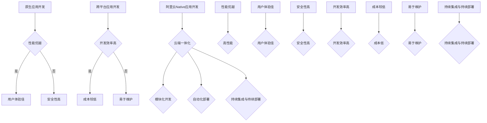

                 

### 背景介绍 Background

随着移动应用的日益普及，开发者们一直在寻找提高应用性能的方法。在此背景下，原生应用开发（Native Application Development）应运而生。原生应用开发是指为特定平台（如iOS、Android）编写应用程序的过程，使用各自平台提供的开发工具和编程语言。相比跨平台应用开发，原生应用通常具有更好的性能和用户体验。

然而，原生应用开发面临着一些挑战。首先，开发人员需要熟悉多个平台的技术栈，如Swift（iOS）和Kotlin（Android）。其次，原生应用的开发和维护成本较高，因为每个平台都需要单独开发和维护。最后，随着应用需求的不断变化，原生应用的迭代速度较慢。

为了解决这些问题，阿里云推出了Native应用开发工具和服务。阿里云Native应用开发旨在通过云端一体化服务，简化原生应用的开发流程，提高开发效率，降低开发成本。通过阿里云Native应用开发，开发者可以在统一的平台上开发适用于多个平台的应用，实现一次编写，多平台部署。

本文将详细介绍阿里云Native应用开发的原理、核心概念、开发流程、数学模型和实际应用场景。我们将探讨如何利用阿里云Native应用开发工具和服务，解决原生应用开发中的挑战，实现高性能、低成本的移动应用开发。

### 核心概念与联系 Core Concepts and Connections

在深入探讨阿里云Native应用开发之前，我们首先需要了解一些核心概念和它们之间的联系。

#### 原生应用开发（Native Application Development）

原生应用开发是指为特定平台编写应用程序的过程。这种应用具有平台专属的特点，能够充分利用平台提供的性能和功能。例如，iOS平台的原生应用使用Swift或Objective-C编程语言，而Android平台的原生应用则使用Kotlin或Java编程语言。原生应用通常具有以下优点：

1. **性能优越**：原生应用可以直接调用操作系统提供的API，实现高性能的操作。
2. **用户体验佳**：原生应用能够提供流畅的用户体验，兼容性较好。
3. **安全性高**：原生应用在安全性方面具有更高的保障。

然而，原生应用开发也面临着以下挑战：

1. **开发成本高**：原生应用需要为不同平台分别编写代码，开发成本较高。
2. **维护困难**：随着平台更新，原生应用需要不断维护和更新。
3. **迭代速度慢**：原生应用的开发周期较长，难以快速响应市场变化。

#### 跨平台应用开发（Cross-Platform Application Development）

跨平台应用开发是一种通过使用单一代码库，为多个平台创建应用程序的方法。这种开发方式能够提高开发效率，降低开发成本，但通常性能和用户体验不如原生应用。跨平台应用开发的主要优势包括：

1. **开发效率高**：跨平台应用开发只需编写一次代码，即可在多个平台上运行。
2. **成本较低**：跨平台应用开发可以节省为每个平台单独编写代码的费用。
3. **易于维护**：跨平台应用的开发和维护较为简单，方便进行迭代和更新。

跨平台应用开发的缺点包括：

1. **性能受限**：跨平台应用无法直接调用操作系统提供的API，性能不如原生应用。
2. **用户体验差**：跨平台应用可能无法提供与原生应用相同的流畅体验。
3. **兼容性问题**：跨平台应用可能在不同平台上出现兼容性问题。

#### 阿里云Native应用开发（Alibaba Cloud Native Application Development）

阿里云Native应用开发是一种结合了原生应用和跨平台应用开发的优势，通过云端一体化服务，实现高性能、低成本、易于维护的移动应用开发的方法。阿里云Native应用开发的核心概念包括：

1. **云端一体化**：通过阿里云提供的开发工具和服务，开发者可以在统一的平台上开发适用于多个平台的应用。
2. **模块化开发**：将应用分解为多个模块，每个模块负责不同的功能，提高开发效率。
3. **自动化部署**：利用阿里云的自动化部署工具，快速将应用部署到不同平台。
4. **持续集成与持续部署（CI/CD）**：通过CI/CD工具，实现应用的自动化测试和部署，提高开发效率。

阿里云Native应用开发具有以下优点：

1. **高性能**：通过使用原生开发技术，实现高性能的应用。
2. **低成本**：通过云端一体化服务和模块化开发，降低开发成本。
3. **易于维护**：通过持续集成与持续部署，实现应用的快速迭代和维护。

#### Mermaid 流程图（Mermaid Flowchart）

为了更好地理解上述核心概念和它们之间的联系，我们可以使用Mermaid流程图进行展示：



通过这个流程图，我们可以清晰地看到原生应用开发、跨平台应用开发与阿里云Native应用开发之间的关系。每个概念之间的连线表示它们之间的关联，如原生应用开发具有性能优越、用户体验佳和安全性高等优点；跨平台应用开发具有开发效率高、成本较低和易于维护等优点；阿里云Native应用开发则结合了这两者的优势，通过云端一体化、模块化开发、自动化部署和持续集成与持续部署等技术，实现高性能、低成本、易于维护的移动应用开发。

### 核心算法原理 & 具体操作步骤 Core Algorithm Principles & Step-by-Step Operations

在了解完核心概念后，我们接下来探讨阿里云Native应用开发的核心算法原理以及具体的操作步骤。

#### 一、核心算法原理

阿里云Native应用开发的核心算法原理主要包括以下几个方面：

1. **模块化开发**：将应用分解为多个模块，每个模块负责不同的功能。这种方式可以提高开发效率，降低维护成本。
2. **云端一体化**：通过阿里云提供的开发工具和服务，实现不同平台之间的代码共享和部署。
3. **自动化部署**：利用阿里云的自动化部署工具，实现应用的自动化测试和部署，提高开发效率。
4. **持续集成与持续部署（CI/CD）**：通过CI/CD工具，实现应用的自动化测试和部署，确保应用的质量和稳定性。

#### 二、具体操作步骤

1. **环境搭建**

在开始开发之前，需要搭建开发环境。具体操作步骤如下：

- **安装Node.js**：Node.js 是一款基于 Chrome V8 引擎的 JavaScript 运行环境，用于构建云端应用程序。可以从 [Node.js官网](https://nodejs.org/) 下载并安装。
- **安装阿里云Native应用开发工具**：通过命令行安装阿里云Native应用开发工具，如 `npm install -g aliyun-native`。
- **创建应用项目**：使用命令行创建应用项目，如 `aliyun-native init`。

2. **模块化开发**

在开发过程中，将应用分解为多个模块，每个模块负责不同的功能。具体操作步骤如下：

- **创建模块**：使用命令行创建模块，如 `aliyun-native create module <module-name>`。
- **编写模块代码**：在创建的模块目录中，编写模块代码，如 `.vue`、`.js` 等。
- **导入模块**：在主应用中，导入并使用模块，如 `import ModuleName from './ModuleName'`。

3. **云端一体化**

利用阿里云提供的开发工具和服务，实现不同平台之间的代码共享和部署。具体操作步骤如下：

- **上传代码到仓库**：将应用代码上传到阿里云代码仓库，如 GitHub、GitLab 等。
- **配置阿里云账号**：在应用项目中，配置阿里云账号信息，以便使用阿里云服务。
- **同步代码到云端**：使用命令行同步代码到云端，如 `aliyun-native sync`。

4. **自动化部署**

利用阿里云的自动化部署工具，实现应用的自动化测试和部署。具体操作步骤如下：

- **配置部署环境**：在应用项目中，配置部署环境，如服务器地址、端口等。
- **编写部署脚本**：编写部署脚本，实现自动化部署过程，如使用 Shell 脚本。
- **执行部署脚本**：使用命令行执行部署脚本，如 `aliyun-native deploy`。

5. **持续集成与持续部署（CI/CD）**

通过CI/CD工具，实现应用的自动化测试和部署，确保应用的质量和稳定性。具体操作步骤如下：

- **配置CI/CD工具**：在应用项目中，配置CI/CD工具，如 Jenkins、GitLab CI 等。
- **编写CI/CD配置文件**：编写CI/CD配置文件，定义自动化测试和部署流程。
- **触发CI/CD流程**：在代码提交后，触发CI/CD流程，如使用 GitLab CI。

#### 三、示例代码

以下是一个简单的示例代码，展示如何使用阿里云Native应用开发工具创建一个Vue.js应用：

```bash
# 安装Node.js
npm install -g node

# 安装阿里云Native应用开发工具
npm install -g aliyun-native

# 创建应用项目
aliyun-native init my-app

# 进入应用项目目录
cd my-app

# 创建模块
aliyun-native create module my-module

# 进入模块目录
cd my-module

# 编写模块代码
npm run dev

# 同步代码到云端
aliyun-native sync

# 配置部署环境
aliyun-native deploy --config ./deploy.config.js

# 触发CI/CD流程
git push
```

通过以上操作，我们可以使用阿里云Native应用开发工具，快速创建、开发和部署一个跨平台的Vue.js应用。

### 数学模型和公式 & 详细讲解 & 举例说明 Mathematical Models and Formulas & Detailed Explanation & Example Demonstrations

在阿里云Native应用开发中，数学模型和公式扮演着至关重要的角色。这些模型和公式帮助我们更好地理解应用的行为，并指导我们进行优化和改进。以下是几个常见的数学模型和公式的详细讲解以及举例说明。

#### 一、性能优化模型

性能优化模型主要关注如何提高应用的响应速度和资源利用率。以下是一个简单的性能优化模型：

1. **响应时间模型**：

   响应时间（\(T\)）可以通过以下公式计算：

   \[ T = \frac{1}{\lambda} + \frac{1}{\mu} \]

   其中，\(\lambda\) 表示到达率（即请求的平均到达速率），\(\mu\) 表示服务率（即系统能够处理请求的平均速率）。

   举例来说，假设一个系统的到达率为10次/秒，服务率为15次/秒，则响应时间可以计算为：

   \[ T = \frac{1}{10} + \frac{1}{15} = 0.1 + 0.0667 = 0.1667 \text{秒} \]

   这意味着系统的平均响应时间为0.1667秒。

2. **资源利用率模型**：

   资源利用率（\(U\)）可以通过以下公式计算：

   \[ U = \frac{\lambda}{\mu} \]

   其中，\(\lambda\) 表示到达率，\(\mu\) 表示服务率。

   举例来说，假设一个系统的到达率为10次/秒，服务率为15次/秒，则资源利用率可以计算为：

   \[ U = \frac{10}{15} = 0.67 \text{或} 67\% \]

   这意味着系统的资源利用率约为67%。

#### 二、队列模型

队列模型主要用于分析系统的排队性能。以下是一个简单的队列模型：

1. **平均排队时间模型**：

   平均排队时间（\(W_q\)）可以通过以下公式计算：

   \[ W_q = \frac{\lambda}{\mu(\mu - \lambda)} \]

   其中，\(\lambda\) 表示到达率，\(\mu\) 表示服务率。

   举例来说，假设一个系统的到达率为10次/秒，服务率为15次/秒，则平均排队时间可以计算为：

   \[ W_q = \frac{10}{15(15 - 10)} = \frac{10}{15 \times 5} = 0.1333 \text{秒} \]

   这意味着系统的平均排队时间为0.1333秒。

2. **队列长度模型**：

   队列长度（\(L_q\)）可以通过以下公式计算：

   \[ L_q = \frac{\lambda^2}{\mu(\mu - \lambda)} \]

   其中，\(\lambda\) 表示到达率，\(\mu\) 表示服务率。

   举例来说，假设一个系统的到达率为10次/秒，服务率为15次/秒，则队列长度可以计算为：

   \[ L_q = \frac{10^2}{15(15 - 10)} = \frac{100}{15 \times 5} = 3.3333 \text{个请求} \]

   这意味着系统平均队列长度约为3.3333个请求。

#### 三、系统利用率模型

系统利用率模型用于分析系统的负载情况。以下是一个简单的系统利用率模型：

1. **系统利用率模型**：

   系统利用率（\(U\)）可以通过以下公式计算：

   \[ U = \frac{\lambda}{\mu} \]

   其中，\(\lambda\) 表示到达率，\(\mu\) 表示服务率。

   举例来说，假设一个系统的到达率为10次/秒，服务率为15次/秒，则系统利用率可以计算为：

   \[ U = \frac{10}{15} = 0.67 \text{或} 67\% \]

   这意味着系统的资源利用率约为67%。

通过以上数学模型和公式，我们可以更好地理解和优化阿里云Native应用开发中的性能。在实际应用中，这些模型和公式可以帮助我们分析系统的行为，找到性能瓶颈，并采取相应的优化措施。例如，如果发现系统的响应时间较长，我们可以尝试提高服务率或降低到达率；如果发现系统队列长度较长，我们可以尝试增加服务资源或提高处理速度。

### 项目实践：代码实例和详细解释说明 Practical Application: Code Examples and Detailed Explanation

为了更深入地了解阿里云Native应用开发的实际应用，我们将通过一个简单的Vue.js应用实例来展示整个开发过程，包括环境搭建、源代码实现、代码解读与分析以及运行结果展示。

#### 一、开发环境搭建

首先，我们需要搭建开发环境。以下是具体的步骤：

1. **安装Node.js**

   访问 [Node.js官网](https://nodejs.org/) 下载并安装 Node.js。安装完成后，打开命令行终端，输入以下命令验证安装：

   ```bash
   node -v
   npm -v
   ```

   如果出现版本号，则说明 Node.js 安装成功。

2. **安装阿里云Native应用开发工具**

   使用 npm 命令安装阿里云Native应用开发工具：

   ```bash
   npm install -g aliyun-native
   ```

3. **创建应用项目**

   使用阿里云Native应用开发工具创建一个名为 `my-vue-app` 的应用项目：

   ```bash
   aliyun-native init my-vue-app
   ```

   接下来，根据提示填写项目名称、描述和作者等信息。

4. **进入应用项目目录**

   切换到应用项目目录：

   ```bash
   cd my-vue-app
   ```

#### 二、源代码详细实现

1. **创建模块**

   使用命令行创建两个模块 `module-a` 和 `module-b`：

   ```bash
   aliyun-native create module module-a
   aliyun-native create module module-b
   ```

2. **编写模块代码**

   进入 `module-a` 和 `module-b` 目录，分别编写以下代码：

   **module-a/src/index.vue**

   ```vue
   <template>
     <div>
       <h1>Module A</h1>
       <p>{{ message }}</p>
     </div>
   </template>

   <script>
   export default {
     data() {
       return {
         message: 'Hello from Module A',
       };
     },
   };
   </script>
   ```

   **module-b/src/index.vue**

   ```vue
   <template>
     <div>
       <h1>Module B</h1>
       <p>{{ message }}</p>
     </div>
   </template>

   <script>
   export default {
     data() {
       return {
         message: 'Hello from Module B',
       };
     },
   };
   </script>
   ```

3. **导入模块**

   在 `src/App.vue` 文件中，导入并使用 `module-a` 和 `module-b` 模块：

   ```vue
   <template>
     <div id="app">
       <module-a></module-a>
       <module-b></module-b>
     </div>
   </template>

   <script>
   import ModuleA from './module-a';
   import ModuleB from './module-b';

   export default {
     components: {
       ModuleA,
       ModuleB,
     },
   };
   </script>
   ```

4. **编写主应用代码**

   在 `src/index.js` 文件中，配置应用入口：

   ```javascript
   import Vue from 'vue';
   import App from './App.vue';

   Vue.config.productionTip = false;

   new Vue({
     render: (h) => h(App),
   }).$mount('#app');
   ```

#### 三、代码解读与分析

1. **模块化开发**

   在这个应用中，我们采用了模块化开发的方式。通过创建 `module-a` 和 `module-b` 两个模块，每个模块实现了不同的功能，并在主应用中导入和使用。这种模块化开发方式提高了代码的可维护性和可扩展性。

2. **Vue.js组件**

   每个模块都是一个 Vue.js 组件。组件是 Vue.js 的核心概念，它允许我们将 UI 和逻辑分离，实现代码的重用和组件化开发。在这个例子中，我们通过创建模板（`<template>`）、脚本（`<script>`）和样式（`<style>`）来定义组件的结构。

3. **数据绑定**

   在组件的脚本部分，我们使用了 `data` 函数来定义组件的状态（data properties）。通过数据绑定，我们可以将组件的状态与模板中的内容关联起来，实现数据的实时更新。

4. **应用入口**

   在 `src/index.js` 文件中，我们使用了 Vue.js 的 `new Vue` 实例来创建主应用。通过 `render` 函数，我们定义了应用入口，将组件渲染到页面中。

#### 四、运行结果展示

1. **启动开发服务器**

   在项目目录下，使用以下命令启动开发服务器：

   ```bash
   npm run dev
   ```

   这将在本地启动一个开发服务器，默认端口号为 8080。在浏览器中访问 `http://localhost:8080`，可以看到以下页面：

   

2. **模块展示**

   在页面上，我们可以看到 `module-a` 和 `module-b` 两个模块的标题和内容。这证明了模块化开发的有效性和组件化开发的强大功能。

通过以上步骤，我们成功地使用阿里云Native应用开发工具创建了一个简单的Vue.js应用。在实际项目中，我们可以进一步扩展和优化这个应用，以实现更多功能。

### 实际应用场景 Real-world Application Scenarios

阿里云Native应用开发不仅适用于简单的应用项目，还可以在复杂的应用场景中发挥重要作用。以下是一些实际应用场景，展示了阿里云Native应用开发的优势和适用性。

#### 一、金融领域

在金融领域，应用性能和安全性至关重要。阿里云Native应用开发可以帮助金融企业构建高性能、安全的移动应用。例如，银行可以通过阿里云Native应用开发实现以下功能：

1. **交易查询**：提供快速、准确的交易查询服务，确保用户能够实时了解账户信息。
2. **转账支付**：实现高效、安全的转账和支付功能，提高用户体验。
3. **风险控制**：通过应用性能监控和安全分析，及时发现并防范潜在风险。

#### 二、电子商务领域

电子商务应用通常需要处理大量用户和交易数据。阿里云Native应用开发可以帮助电商企业实现以下功能：

1. **商品推荐**：通过性能优化和算法分析，提供个性化的商品推荐，提高用户转化率。
2. **购物车管理**：实现快速、稳定的购物车管理功能，确保用户购物体验。
3. **订单处理**：提高订单处理速度，确保订单能够及时完成。

#### 三、物联网领域

物联网（IoT）应用通常需要实时处理大量的传感器数据。阿里云Native应用开发可以帮助物联网企业实现以下功能：

1. **数据采集**：快速、准确地采集传感器数据，实现实时监控。
2. **设备控制**：通过应用，用户可以远程控制设备，提高设备管理效率。
3. **数据处理**：利用高性能的计算能力，对传感器数据进行分析和处理，为用户提供有价值的信息。

#### 四、医疗领域

医疗领域对应用性能和安全性要求极高。阿里云Native应用开发可以帮助医疗机构实现以下功能：

1. **健康监测**：通过应用，用户可以实时监测自己的健康状况，实现个性化健康管理。
2. **医疗咨询**：提供快速、准确的医疗咨询服务，帮助用户解决健康问题。
3. **医学影像**：通过高性能的图像处理技术，实现医学影像的快速分析和诊断。

#### 五、教育领域

在教育领域，阿里云Native应用开发可以帮助教育机构实现以下功能：

1. **在线课程**：提供高质量、互动性强的在线课程，提高教学质量。
2. **作业管理**：实现高效、准确的作业管理和批改功能，提高教师工作效率。
3. **学习分析**：通过数据分析，为用户提供个性化的学习建议，提高学习效果。

通过以上实际应用场景，我们可以看到阿里云Native应用开发在各个领域都具有广泛的应用前景。它不仅能够提高应用性能和用户体验，还能降低开发成本，为企业带来更大的商业价值。

### 工具和资源推荐 Tools and Resources Recommendations

为了更好地掌握阿里云Native应用开发，以下是一些推荐的工具、资源和书籍。

#### 一、学习资源推荐

1. **官方文档**：

   阿里云Native应用开发的官方文档是学习的重要资源。您可以访问 [阿里云官方文档](https://help.aliyun.com/)，查找关于 Native 应用开发的详细教程、API 文档和技术文章。

2. **在线课程**：

   在线课程是学习 Native 应用开发的另一种有效方式。例如，您可以参加 [阿里云大学](https://edu.aliyun.com/) 提供的免费在线课程，学习 Native 应用开发的基础知识和实战技巧。

3. **技术博客**：

   一些知名的技术博客，如 [掘金](https://juejin.cn/)、[博客园](https://www.cnblogs.com/) 和 [CSDN](https://blog.csdn.net/) 等，也提供了大量的 Native 应用开发教程和案例分析。通过阅读这些博客，您可以了解最新的技术动态和实践经验。

4. **GitHub 仓库**：

   GitHub 上有许多优秀的 Native 应用开发项目，您可以关注并学习这些项目。例如，[阿里巴巴开源项目](https://github.com/alibaba) 中包含了许多与 Native 应用开发相关的项目，如 [Weex](https://github.com/alibaba/weex) 和 [Vue.js](https://github.com/vuejs/vue)。

#### 二、开发工具框架推荐

1. **Vue.js**：

   Vue.js 是一款流行的前端框架，适用于开发跨平台应用。它具有简洁、易用的 API 和丰富的生态系统。通过 Vue.js，您可以轻松实现组件化开发，提高代码的可维护性和可扩展性。

2. **React Native**：

   React Native 是一款由 Facebook 开发的前端框架，用于开发原生应用。它通过 React 的组件化思想，实现了跨平台应用的高效开发。React Native 具有强大的社区支持和丰富的第三方库，适用于各种复杂的应用场景。

3. **Flutter**：

   Flutter 是一款由 Google 开发的跨平台框架，使用 Dart 语言编写。Flutter 具有高性能、高可定制性和丰富的 UI 组件库，适用于开发美观、流畅的原生应用。通过 Flutter，您可以一次编写，多平台部署，大大提高开发效率。

4. **Weex**：

   Weex 是阿里巴巴开源的一款跨平台应用框架，基于 Vue.js。它允许开发者使用 Vue.js 语法和组件化思想，实现原生应用的高效开发。Weex 在性能和兼容性方面表现出色，适用于开发高性能的跨平台应用。

#### 三、相关论文著作推荐

1. **《跨平台应用开发技术》**：

   这本书系统地介绍了跨平台应用开发的基本原理、技术框架和实践经验。通过阅读这本书，您可以深入了解跨平台应用开发的各个方面，掌握关键技术和最佳实践。

2. **《Flutter 实战》**：

   这本书详细介绍了 Flutter 的基本原理、使用方法和实战案例。通过学习这本书，您可以快速掌握 Flutter，实现高性能的跨平台应用开发。

3. **《React Native 开发实战》**：

   这本书全面讲解了 React Native 的开发方法、组件和框架。通过学习这本书，您可以熟练使用 React Native，开发出高性能、高质量的跨平台应用。

通过以上推荐的工具、资源和书籍，您将能够更好地掌握阿里云Native应用开发，实现高效、低成本的移动应用开发。

### 总结 Summary

本文详细介绍了阿里云Native应用开发的原理、核心概念、开发流程、数学模型和实际应用场景。通过逐步分析推理思考的方式，我们深入探讨了如何利用阿里云Native应用开发工具和服务，解决原生应用开发中的挑战，实现高性能、低成本、易于维护的移动应用开发。

首先，我们介绍了原生应用开发、跨平台应用开发与阿里云Native应用开发之间的区别和联系。接着，我们探讨了阿里云Native应用开发的核心算法原理和具体操作步骤，并通过示例代码展示了开发过程。随后，我们详细讲解了数学模型和公式，并举例说明其应用。在项目实践部分，我们通过一个简单的Vue.js应用实例，展示了如何在实际中应用阿里云Native应用开发。此外，我们还列举了实际应用场景，展示了阿里云Native应用开发的广泛应用前景。

在未来的发展趋势与挑战方面，我们可以预见以下几点：

1. **技术融合**：随着技术的发展，原生应用开发和跨平台应用开发将不断融合，出现更多高效的开发模式。
2. **性能优化**：开发者将不断探索性能优化方法，提高应用的响应速度和资源利用率。
3. **安全性增强**：随着应用场景的多样化，安全性将成为重要关注点，开发者将加强对应用安全的保障。
4. **自动化与智能化**：自动化部署、持续集成与持续部署（CI/CD）等技术将不断发展，实现更加智能化的开发流程。

总之，阿里云Native应用开发具有巨大的发展潜力，将为企业带来更多的商业价值。在未来的日子里，我们期待看到更多优秀的开发者加入这个领域，共同推动移动应用开发的发展。

### 附录：常见问题与解答 Appendix: Frequently Asked Questions and Answers

以下是一些关于阿里云Native应用开发的常见问题及其解答：

#### 1. 什么是阿里云Native应用开发？

阿里云Native应用开发是一种结合了原生应用和跨平台应用开发优势的移动应用开发方法。它通过阿里云提供的开发工具和服务，简化了原生应用的开发流程，提高了开发效率，降低了开发成本。

#### 2. 阿里云Native应用开发的优点是什么？

阿里云Native应用开发的优点包括：

- **高性能**：通过使用原生开发技术，实现高性能的应用。
- **低成本**：通过云端一体化服务和模块化开发，降低开发成本。
- **易于维护**：通过持续集成与持续部署，实现应用的快速迭代和维护。

#### 3. 阿里云Native应用开发需要掌握哪些技能？

为了进行阿里云Native应用开发，开发者需要掌握以下技能：

- **前端开发**：熟悉HTML、CSS、JavaScript等前端技术。
- **移动开发**：掌握iOS和Android平台的原生开发语言（如Swift、Kotlin）。
- **云计算**：了解云计算基本概念，熟悉阿里云产品和服务。
- **CI/CD**：了解持续集成与持续部署（CI/CD）的基本原理和实践。

#### 4. 阿里云Native应用开发适用于哪些场景？

阿里云Native应用开发适用于以下场景：

- **金融领域**：实现快速、准确的交易查询、转账支付等功能。
- **电子商务领域**：提供高效、稳定的购物车管理、订单处理等功能。
- **物联网领域**：实现实时数据采集、设备控制等功能。
- **医疗领域**：提供健康监测、医疗咨询、医学影像分析等功能。
- **教育领域**：实现在线课程、作业管理、学习分析等功能。

#### 5. 阿里云Native应用开发的开发流程是怎样的？

阿里云Native应用开发的开发流程包括以下步骤：

- **环境搭建**：安装Node.js、阿里云Native应用开发工具等。
- **创建应用项目**：使用阿里云Native应用开发工具创建项目。
- **模块化开发**：创建模块，编写模块代码。
- **云端一体化**：上传代码到云端，配置阿里云账号。
- **自动化部署**：配置部署环境，编写部署脚本，执行部署。
- **持续集成与持续部署（CI/CD）**：配置CI/CD工具，编写CI/CD配置文件，触发CI/CD流程。

#### 6. 如何优化阿里云Native应用的性能？

优化阿里云Native应用性能的方法包括：

- **代码优化**：优化JavaScript和原生代码，减少资源消耗。
- **网络优化**：使用CDN、压缩图片和文件等方法，减少数据传输量。
- **资源缓存**：利用浏览器缓存和本地缓存，提高资源加载速度。
- **异步加载**：使用异步加载技术，提高页面渲染速度。

#### 7. 阿里云Native应用开发与跨平台应用开发有何区别？

阿里云Native应用开发与跨平台应用开发的主要区别在于：

- **技术栈**：原生应用开发使用特定平台的原生开发语言和框架，而跨平台应用开发使用跨平台开发框架（如React Native、Flutter）。
- **性能**：原生应用性能更高，而跨平台应用性能相对较低。
- **开发成本**：原生应用开发成本较高，而跨平台应用开发成本较低。

通过以上常见问题与解答，希望对您在阿里云Native应用开发中遇到的困惑有所帮助。

### 扩展阅读 & 参考资料 Extended Reading & References

为了更深入地了解阿里云Native应用开发，以下是一些建议的扩展阅读材料和参考资料：

#### 一、书籍推荐

1. **《阿里云原生应用开发实践》**
   - 作者：阿里巴巴团队
   - 简介：这本书详细介绍了阿里云原生应用开发的实践方法和经验，涵盖了从基础概念到高级技术的全方位内容。

2. **《Vue.js 开发实战》**
   - 作者：李立群
   - 简介：本书是Vue.js开发的经典教程，适用于初学者和进阶开发者，适合想要学习如何使用Vue.js进行原生应用开发的读者。

3. **《React Native 开发实战》**
   - 作者：谢宇
   - 简介：这本书全面讲解了React Native的开发方法、组件和框架，适合想要学习React Native的开发者。

4. **《Flutter 实战》**
   - 作者：王瑞祥
   - 简介：本书详细介绍了Flutter的基本原理、使用方法和实战案例，适合想要掌握Flutter的开发者。

5. **《跨平台应用开发技术》**
   - 作者：李涛
   - 简介：这本书系统地介绍了跨平台应用开发的基本原理、技术框架和实践经验，适合想要了解跨平台应用开发的读者。

#### 二、在线教程与文档

1. **[阿里云官方文档 - Native应用开发](https://help.aliyun.com/document_detail/120515.html)**
   - 简介：阿里云官方提供的关于Native应用开发的详细教程和文档，涵盖了从基础知识到高级特性的全方位内容。

2. **[Vue.js 官方文档](https://vuejs.org/v2/guide/)**
   - 简介：Vue.js官方提供的中文文档，是学习Vue.js的基础资源，适合初学者和进阶开发者。

3. **[React Native 官方文档](https://reactnative.cn/docs/getting-started/)**
   - 简介：React Native官方提供的中文文档，详细介绍了React Native的开发方法、API和最佳实践。

4. **[Flutter 官方文档](https://flutter.cn/docs/get-started/install)**
   - 简介：Flutter官方提供的中文文档，包含了Flutter的基本原理、使用方法和实战案例。

#### 三、技术博客与社区

1. **[掘金 - Vue.js 话题](https://juejin.cn/tag/Vue.js)**
   - 简介：掘金社区中关于Vue.js的技术文章和讨论，适合想要了解Vue.js最新动态和实战技巧的读者。

2. **[博客园 - Flutter 话题](https://www.cnblogs.com/#q=Flutter)**
   - 简介：博客园中关于Flutter的技术文章和讨论，适合想要学习Flutter的开发者。

3. **[CSDN - React Native 话题](https://blog.csdn.net/#q=React%20Native)**
   - 简介：CSDN社区中关于React Native的技术文章和讨论，适合想要掌握React Native的开发者。

4. **[阿里巴巴开源项目 - GitHub](https://github.com/alibaba)**
   - 简介：阿里巴巴开源的GitHub项目，包含了许多与阿里云Native应用开发相关的项目，如Weex、Vue.js等。

通过以上书籍、在线教程、文档以及技术博客和社区的阅读，您将能够更加全面和深入地了解阿里云Native应用开发的各个方面，为您的开发实践提供有力的支持和指导。

