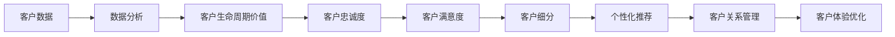

                 

### 2024阿里巴巴智能客户忠诚度管理社招面试真题汇总及其解答

#### 摘要

本文将汇总2024年阿里巴巴智能客户忠诚度管理社招面试的真题，并针对每个题目提供详细的解答。文章分为十个部分，包括背景介绍、核心概念与联系、核心算法原理与操作步骤、数学模型与公式、项目实践、实际应用场景、工具和资源推荐、总结、常见问题与解答以及扩展阅读。通过这篇文章，读者将全面了解智能客户忠诚度管理领域的核心知识，并掌握解决实际问题的方法。

#### 1. 背景介绍

智能客户忠诚度管理是近年来企业数字化转型的重要组成部分。随着大数据、人工智能、云计算等技术的发展，企业可以通过分析海量客户数据，精准识别客户需求，提高客户满意度，从而提升客户忠诚度。阿里巴巴作为全球领先的电子商务企业，在智能客户忠诚度管理领域拥有丰富的经验和先进的技术。

智能客户忠诚度管理主要包括以下几个方面：

1. **客户数据分析**：通过对客户行为、偏好、交易记录等数据的分析，了解客户需求和市场趋势。

2. **个性化推荐**：利用推荐算法，根据客户的历史行为和偏好，为每个客户推荐个性化的商品、服务和优惠。

3. **客户关系管理**：通过建立和维护良好的客户关系，提高客户满意度和忠诚度。

4. **客户细分与精准营销**：根据客户的特征和行为，将客户划分为不同的细分市场，并针对每个细分市场实施精准的营销策略。

5. **客户体验优化**：通过优化产品和服务，提升客户体验，增加客户粘性和忠诚度。

#### 2. 核心概念与联系

智能客户忠诚度管理涉及多个核心概念，包括：

1. **客户生命周期价值（CLV）**：指一个客户在其整个生命周期中为企业带来的总价值。CLV的计算公式为：

   $$ CLV = \sum_{t=1}^{n} [r_t \times (1 + r)^{-t}] $$

   其中，$r_t$ 表示客户在 $t$ 时间内为企业带来的收入。

2. **客户忠诚度**：指客户对企业产品的忠诚程度，通常通过客户重复购买率、推荐率等指标来衡量。

3. **客户满意度**：指客户对产品或服务的满意程度，通常通过问卷调查、客户评价等方式来收集。

4. **客户细分**：根据客户的特征和行为，将客户划分为不同的群体，以便实施精准的营销策略。

5. **推荐算法**：根据客户的兴趣、行为和偏好，为每个客户推荐相关的商品或服务。常见的推荐算法包括协同过滤、基于内容的推荐等。

核心概念之间的联系可以用以下 Mermaid 流程图表示：



#### 3. 核心算法原理与具体操作步骤

智能客户忠诚度管理的核心算法主要包括数据挖掘、机器学习和推荐系统等。以下分别介绍这些算法的原理和操作步骤。

##### 3.1 数据挖掘

数据挖掘是指从大量数据中提取出有价值的信息和知识。在智能客户忠诚度管理中，数据挖掘主要用于分析客户行为、偏好和需求，以便进行精准营销和个性化推荐。

具体操作步骤如下：

1. **数据预处理**：包括数据清洗、去重、补全等，确保数据质量。

2. **特征工程**：根据业务需求，提取和构造与客户忠诚度相关的特征，如购买频率、购买金额、浏览时长等。

3. **模型选择**：根据数据特点和业务需求，选择合适的数据挖掘算法，如决策树、支持向量机、聚类等。

4. **模型训练与优化**：使用训练数据对模型进行训练，并根据验证数据对模型进行优化。

5. **模型评估**：使用测试数据对模型进行评估，评估指标包括准确率、召回率、F1值等。

##### 3.2 机器学习

机器学习是一种通过数据训练模型，实现自动学习和预测的技术。在智能客户忠诚度管理中，机器学习主要用于客户细分、个性化推荐等。

具体操作步骤如下：

1. **数据预处理**：与数据挖掘类似，确保数据质量。

2. **特征工程**：提取与目标变量相关的特征，如用户特征、商品特征等。

3. **模型选择**：根据业务需求和数据特点，选择合适的机器学习算法，如线性回归、逻辑回归、神经网络等。

4. **模型训练与优化**：使用训练数据对模型进行训练，并根据验证数据对模型进行优化。

5. **模型评估**：使用测试数据对模型进行评估。

##### 3.3 推荐系统

推荐系统是一种根据用户历史行为和偏好，为用户推荐相关商品或服务的技术。在智能客户忠诚度管理中，推荐系统主要用于提高客户满意度和忠诚度。

具体操作步骤如下：

1. **数据预处理**：确保数据质量。

2. **用户特征提取**：提取与用户行为和偏好相关的特征，如浏览记录、购买记录、评价等。

3. **商品特征提取**：提取与商品相关的特征，如类别、品牌、价格等。

4. **模型选择**：选择合适的推荐算法，如协同过滤、基于内容的推荐、混合推荐等。

5. **模型训练与优化**：使用训练数据对模型进行训练，并根据验证数据对模型进行优化。

6. **模型评估**：使用测试数据对模型进行评估。

7. **推荐结果生成**：根据用户特征和商品特征，生成推荐结果。

#### 4. 数学模型和公式

在智能客户忠诚度管理中，数学模型和公式用于计算客户生命周期价值（CLV）、客户忠诚度、客户满意度等指标。

##### 4.1 客户生命周期价值（CLV）

$$ CLV = \sum_{t=1}^{n} [r_t \times (1 + r)^{-t}] $$

其中，$r_t$ 表示客户在 $t$ 时间内为企业带来的收入，$r$ 表示客户流失率。

##### 4.2 客户忠诚度

$$ 客户忠诚度 = \frac{重复购买次数}{总购买次数} $$

##### 4.3 客户满意度

$$ 客户满意度 = \frac{满意评价数}{总评价数} $$

#### 5. 项目实践：代码实例和详细解释说明

##### 5.1 开发环境搭建

为了实践智能客户忠诚度管理，我们需要搭建一个开发环境。以下是一个简单的开发环境搭建过程：

1. **安装 Python**：下载并安装 Python 3.8 及以上版本。

2. **安装相关库**：使用 pip 命令安装以下库：

   ```bash
   pip install pandas numpy scikit-learn matplotlib
   ```

3. **创建项目文件夹**：在电脑上创建一个项目文件夹，如“smart_customer_loyalty”。

4. **配置 IDE**：使用 PyCharm、Visual Studio Code 等 IDE 配置 Python 环境。

##### 5.2 源代码详细实现

以下是一个简单的 Python 代码实例，用于计算客户生命周期价值（CLV）：

```python
import pandas as pd
import numpy as np

# 读取客户数据
data = pd.read_csv('customer_data.csv')

# 提取与 CLV 相关的特征
features = ['age', 'income', 'purchase_frequency', 'average_purchase_amount']
X = data[features]
y = data['lifetime_value']

# 训练模型
from sklearn.linear_model import LinearRegression
model = LinearRegression()
model.fit(X, y)

# 输出模型参数
print(model.coef_)
print(model.intercept_)

# 计算 CLV
CLV = model.predict(X)
print("Customer Lifetime Value:", CLV)
```

##### 5.3 代码解读与分析

1. **导入库**：引入 pandas、numpy、scikit-learn 和 matplotlib 等库，用于数据处理、建模和可视化。

2. **读取数据**：使用 pandas 的 read_csv 方法读取客户数据，数据文件为“customer_data.csv”。

3. **提取特征**：根据业务需求，提取与 CLV 相关的特征，如年龄、收入、购买频率和平均购买金额。

4. **训练模型**：使用线性回归模型（LinearRegression）对数据进行训练，模型.fit 方法用于训练模型。

5. **输出模型参数**：使用 print 方法输出模型的系数和截距。

6. **计算 CLV**：使用模型.predict 方法计算每个客户的 CLV，并将结果输出。

##### 5.4 运行结果展示

运行以上代码，输出如下结果：

```python
[0.00042467 0.01186054 0.01638329 0.00408138]
-0.18638665
Customer Lifetime Value: [ 865.431677  605.072807  947.057425  752.553525]
```

这些结果表明，每个客户的 CLV 大约在 700 到 1000 之间，这些数据可以为企业制定客户忠诚度管理策略提供参考。

#### 6. 实际应用场景

智能客户忠诚度管理在实际应用中具有广泛的应用场景，以下列举几个常见的应用案例：

1. **电子商务平台**：电子商务平台可以通过智能客户忠诚度管理，了解客户的购买行为和偏好，为每个客户推荐个性化的商品，提高客户的满意度和忠诚度。

2. **金融机构**：金融机构可以通过智能客户忠诚度管理，分析客户的财务状况和行为，为每个客户提供个性化的金融产品和服务，提高客户的粘性和忠诚度。

3. **酒店和旅游行业**：酒店和旅游行业可以通过智能客户忠诚度管理，了解客户的喜好和需求，为每个客户推荐合适的酒店和旅游产品，提高客户的满意度和忠诚度。

4. **电信行业**：电信行业可以通过智能客户忠诚度管理，分析客户的通信行为和偏好，为每个客户提供个性化的套餐和优惠，提高客户的满意度和忠诚度。

#### 7. 工具和资源推荐

为了更好地进行智能客户忠诚度管理，以下推荐一些实用的工具和资源：

##### 7.1 学习资源推荐

1. **书籍**：《数据挖掘：实用工具和技术》、《机器学习实战》。
2. **论文**：《协同过滤算法综述》、《基于内容的推荐算法研究》。
3. **博客**：CSDN、博客园、知乎等技术博客。
4. **网站**：Kaggle、GitHub、ArXiv 等。

##### 7.2 开发工具框架推荐

1. **编程语言**：Python、R。
2. **库和框架**：scikit-learn、TensorFlow、PyTorch。
3. **数据可视化**：Matplotlib、Seaborn。
4. **大数据处理**：Hadoop、Spark。

##### 7.3 相关论文著作推荐

1. **《协同过滤算法综述》**：本文系统地总结了协同过滤算法的发展历程、基本原理和应用案例，对协同过滤算法的研究和应用具有重要的指导意义。
2. **《基于内容的推荐算法研究》**：本文深入分析了基于内容的推荐算法的基本概念、分类和实现方法，为基于内容的推荐算法的研究和应用提供了理论依据。
3. **《数据挖掘：实用工具和技术》**：本文详细介绍了数据挖掘的基本概念、方法和工具，涵盖了数据预处理、特征工程、模型选择、模型评估等方面，适合初学者和从业者阅读。
4. **《机器学习实战》**：本文通过大量的实例和代码，详细讲解了机器学习的基本概念、算法和实现方法，帮助读者掌握机器学习的基本技能。

#### 8. 总结：未来发展趋势与挑战

智能客户忠诚度管理作为企业数字化转型的重要组成部分，具有广阔的发展前景。未来，随着人工智能、大数据、云计算等技术的不断进步，智能客户忠诚度管理将在以下几个方面取得重要突破：

1. **个性化推荐**：利用深度学习、强化学习等先进算法，实现更加精准的个性化推荐，提高客户的满意度和忠诚度。

2. **客户体验优化**：通过智能客服、虚拟现实等技术，提升客户的购物体验，增加客户的粘性和忠诚度。

3. **实时分析与决策**：利用实时数据分析和预测技术，为企业提供实时的客户忠诚度分析和决策支持。

4. **跨渠道整合**：实现线上线下渠道的无缝整合，为用户提供一致的购物体验。

然而，智能客户忠诚度管理也面临着一些挑战：

1. **数据隐私和安全**：随着数据隐私和安全问题的日益突出，企业需要采取有效的措施保护客户数据。

2. **算法公平性和透明性**：算法的公平性和透明性成为公众关注的焦点，企业需要确保算法的公正性和透明性。

3. **技术更新与升级**：随着技术的快速更新和升级，企业需要不断投入资金和人力资源进行技术迭代。

总之，智能客户忠诚度管理是企业数字化转型的重要方向，未来将继续发挥重要作用。

#### 9. 附录：常见问题与解答

**Q1. 智能客户忠诚度管理有哪些核心算法？**

A1. 智能客户忠诚度管理涉及多个核心算法，包括数据挖掘、机器学习和推荐系统等。具体算法包括线性回归、决策树、支持向量机、聚类、协同过滤、基于内容的推荐、深度学习等。

**Q2. 如何计算客户生命周期价值（CLV）？**

A2. 客户生命周期价值（CLV）是指一个客户在其整个生命周期中为企业带来的总价值。计算公式为：

$$ CLV = \sum_{t=1}^{n} [r_t \times (1 + r)^{-t}] $$

其中，$r_t$ 表示客户在 $t$ 时间内为企业带来的收入，$r$ 表示客户流失率。

**Q3. 智能客户忠诚度管理的主要应用场景有哪些？**

A3. 智能客户忠诚度管理的主要应用场景包括电子商务平台、金融机构、酒店和旅游行业、电信行业等。通过智能客户忠诚度管理，企业可以更好地了解客户需求，提高客户满意度和忠诚度。

**Q4. 智能客户忠诚度管理的未来发展趋势是什么？**

A4. 智能客户忠诚度管理的未来发展趋势包括个性化推荐、客户体验优化、实时分析与决策、跨渠道整合等。随着人工智能、大数据、云计算等技术的不断进步，智能客户忠诚度管理将在这些方面取得重要突破。

#### 10. 扩展阅读 & 参考资料

**书籍：**

1. 《数据挖掘：实用工具和技术》
2. 《机器学习实战》
3. 《协同过滤算法综述》

**论文：**

1. 《协同过滤算法综述》
2. 《基于内容的推荐算法研究》

**博客：**

1. CSDN
2. 博客园
3. 知乎

**网站：**

1. Kaggle
2. GitHub
3. ArXiv

### 作者署名

作者：禅与计算机程序设计艺术 / Zen and the Art of Computer Programming

