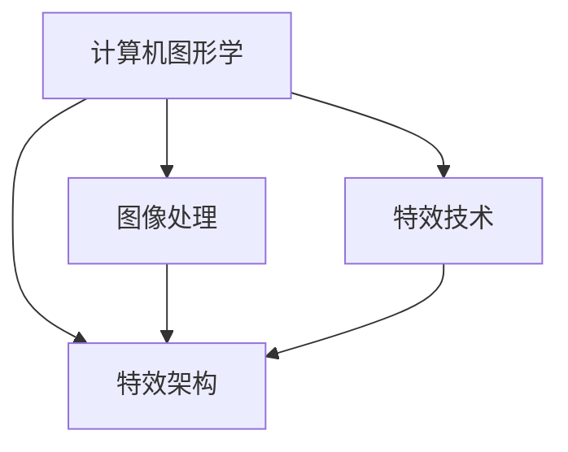

                 

关键词：视觉特效、面试、视觉算法、特效技术、影视制作、影像处理

> 摘要：本文针对阿里影业2024年校招视觉特效工程师的面试重点进行了深入分析，从核心概念、算法原理、数学模型、实际应用等方面详细解读，为有意向加入视觉特效行业的同学们提供有价值的参考。

## 1. 背景介绍

随着电影、动画、游戏等视觉娱乐产业的快速发展，视觉特效（VFX）在其中的重要性日益凸显。视觉特效工程师作为这一领域的中坚力量，承担着创意实现和技术突破的双重任务。阿里影业作为中国领先的文化娱乐企业之一，对视觉特效工程师的需求也日益增长。本文旨在为有意向参加阿里影业2024校招视觉特效工程师面试的同学们提供一些关键点指导，帮助大家更好地准备面试。

### 1.1 阿里影业简介

阿里影业成立于2014年，是中国领先的文化娱乐企业之一，业务涵盖了电影制作、发行、票务、特效制作、影院运营等多个领域。近年来，阿里影业在视觉特效领域不断探索，推出了多部备受瞩目的视觉特效电影，如《乘风破浪的姐姐》、《悬崖之上》等。

### 1.2 视觉特效工程师的职责

视觉特效工程师的主要职责是利用计算机图形学、图像处理等技术手段，为影视作品制作出逼真的视觉效果。具体包括：

- **特效创意设计**：根据剧本和导演的需求，进行特效创意设计，实现视觉效果上的突破。
- **特效实现**：运用计算机软件和算法，将特效创意转化为实际画面。
- **后期合成**：将特效元素与真实画面进行合成，达到逼真的视觉效果。
- **性能优化**：优化特效算法和渲染流程，提高渲染效率和效果。

## 2. 核心概念与联系

### 2.1 计算机图形学

计算机图形学是视觉特效的基础，涉及到二维和三维图形的生成、显示和处理。核心概念包括：

- **几何变换**：平移、旋转、缩放等基本几何变换。
- **光线追踪**：模拟光线传播路径，实现逼真的光影效果。
- **渲染技术**：包括真实感渲染、光照模型、材质渲染等。

### 2.2 图像处理

图像处理是视觉特效的关键环节，涉及到图像的编辑、增强、修复等操作。核心概念包括：

- **图像滤波**：去除图像噪声、模糊图像等。
- **边缘检测**：识别图像中的边缘和轮廓。
- **图像分割**：将图像划分为不同的区域。

### 2.3 特效技术

特效技术是实现视觉特效的关键手段，包括：

- **粒子系统**：模拟各种物理现象，如爆炸、雨雪、烟雾等。
- **流体模拟**：模拟流体运动，如水、火、烟等。
- **毛发和皮肤模拟**：模拟毛发和皮肤的动态效果。

### 2.4 特效架构

特效架构是视觉特效系统的整体设计，包括：

- **场景管理**：管理场景中的元素和属性。
- **渲染引擎**：实现高效的渲染效果。
- **插件系统**：提供可扩展的特效功能。

### 2.5 Mermaid 流程图



## 3. 核心算法原理 & 具体操作步骤

### 3.1 算法原理概述

视觉特效的核心算法包括计算机图形学算法、图像处理算法和特效模拟算法。以下分别介绍：

### 3.1.1 计算机图形学算法

计算机图形学算法主要涉及几何变换、光线追踪和渲染技术。其中，光线追踪是实现真实感渲染的关键，通过模拟光线的传播路径，生成逼真的光影效果。常用的光线追踪算法有路径追踪、蒙特卡洛渲染等。

### 3.1.2 图像处理算法

图像处理算法主要涉及图像滤波、边缘检测和图像分割。其中，图像滤波是去除图像噪声和模糊的关键，常用的滤波器有高斯滤波、中值滤波等。边缘检测和图像分割则是实现图像分割和特征提取的重要手段。

### 3.1.3 特效模拟算法

特效模拟算法主要涉及粒子系统、流体模拟和毛发皮肤模拟。粒子系统是模拟物理现象的基础，通过粒子的运动和相互作用，实现各种特效。流体模拟则是模拟流体运动，如水、火、烟等。毛发皮肤模拟则是模拟毛发和皮肤的动态效果。

### 3.2 算法步骤详解

#### 3.2.1 计算机图形学算法步骤

1. **几何变换**：根据输入的图形，进行平移、旋转、缩放等基本几何变换。
2. **光线追踪**：模拟光线的传播路径，计算光线与物体的交点，生成阴影和反射效果。
3. **渲染技术**：根据光照模型和材质属性，计算像素的颜色值，生成渲染图像。

#### 3.2.2 图像处理算法步骤

1. **图像滤波**：对图像进行滤波操作，去除噪声和模糊。
2. **边缘检测**：利用边缘检测算法，识别图像中的边缘和轮廓。
3. **图像分割**：根据边缘检测结果，将图像分割成不同的区域。

#### 3.2.3 特效模拟算法步骤

1. **粒子系统**：初始化粒子，设置粒子的运动规则和相互作用。
2. **流体模拟**：利用流体方程，计算流体的运动和扩散。
3. **毛发皮肤模拟**：利用物理模型，模拟毛发和皮肤的动态效果。

### 3.3 算法优缺点

#### 3.3.1 计算机图形学算法优缺点

**优点**：可以实现高度真实感的光影效果，适用于各种场景。

**缺点**：计算量大，渲染时间长，对硬件要求较高。

#### 3.3.2 图像处理算法优缺点

**优点**：操作简单，适用于各种图像处理需求。

**缺点**：对图像的原始信息有一定损失，难以实现真实感的效果。

#### 3.3.3 特效模拟算法优缺点

**优点**：可以模拟各种物理现象，实现丰富的特效。

**缺点**：计算量大，对算法和硬件要求较高。

### 3.4 算法应用领域

视觉特效算法广泛应用于电影、动画、游戏等领域，以下为具体应用：

- **电影**：电影特效可以为观众带来震撼的视觉体验，提升电影的制作水准。
- **动画**：动画特效可以丰富动画场景，增强动画的表现力。
- **游戏**：游戏特效可以提升游戏的沉浸感，增加游戏的趣味性。

## 4. 数学模型和公式 & 详细讲解 & 举例说明

### 4.1 数学模型构建

视觉特效中的数学模型主要包括几何模型、光照模型和材质模型。以下分别介绍：

#### 4.1.1 几何模型

几何模型主要涉及点、线、面、体等基本几何形状的表示和运算。常用的几何模型有：

- **点**：用坐标表示，如$(x, y, z)$。
- **线**：用两点确定，如$A(x_1, y_1, z_1)$和$B(x_2, y_2, z_2)$。
- **面**：用三点确定，如$A(x_1, y_1, z_1)$、$B(x_2, y_2, z_2)$和$C(x_3, y_3, z_3)$。
- **体**：由多个面组成，如四面体、立方体等。

#### 4.1.2 光照模型

光照模型用于计算物体表面的光照效果，包括环境光、漫反射光、镜面反射光等。常用的光照模型有：

- **朗伯光照模型**：
  $$I = k_d \cdot \cos(\theta)$$
  其中，$I$为光照强度，$k_d$为漫反射系数，$\theta$为光线与法线的夹角。
- **布鲁斯特光照模型**：
  $$I = k_s \cdot (\rho \cdot \cos(\theta) + \sqrt{1 - \cos^2(\theta)})$$
  其中，$I$为光照强度，$k_s$为镜面反射系数，$\rho$为反射率，$\theta$为光线与法线的夹角。

#### 4.1.3 材质模型

材质模型用于描述物体的表面特性，包括颜色、光泽度、透明度等。常用的材质模型有：

- **Lambert 材质模型**：
  $$C_o = k_d \cdot I \cdot c_d$$
  其中，$C_o$为物体表面颜色，$k_d$为漫反射系数，$I$为光照强度，$c_d$为物体颜色。
- **Phong 材质模型**：
  $$C_o = k_d \cdot I \cdot c_d + k_s \cdot (\rho \cdot \cos(\theta) + \sqrt{1 - \cos^2(\theta)})$$
  其中，$C_o$为物体表面颜色，$k_d$为漫反射系数，$k_s$为镜面反射系数，$\rho$为反射率，$I$为光照强度，$\theta$为光线与法线的夹角。

### 4.2 公式推导过程

以下以朗伯光照模型为例，简要介绍公式推导过程：

假设物体表面受到平行光照射，光线与法线的夹角为$\theta$。光线与物体表面的作用可以看作是光线在物体表面的漫反射。根据能量守恒定律，入射光线的能量等于漫反射光线的能量。

入射光线的能量为：
$$E_i = I \cdot A$$
其中，$E_i$为入射光线的能量，$I$为光照强度，$A$为照射面积。

漫反射光线的能量为：
$$E_r = I \cdot k_d \cdot A$$
其中，$E_r$为漫反射光线的能量，$k_d$为漫反射系数，$A$为照射面积。

根据能量守恒定律，有：
$$E_i = E_r$$
即：
$$I \cdot A = I \cdot k_d \cdot A$$

化简得：
$$I = k_d \cdot \cos(\theta)$$

### 4.3 案例分析与讲解

以下以一个简单的场景为例，介绍如何使用朗伯光照模型计算物体表面的光照效果。

假设一个平面物体受到平行光照射，光线与法线的夹角为$30^\circ$。物体表面颜色为蓝色，漫反射系数为$0.5$。

根据朗伯光照模型，计算物体表面的光照效果如下：

$$I = k_d \cdot \cos(\theta) = 0.5 \cdot \cos(30^\circ) = 0.5 \cdot \frac{\sqrt{3}}{2} = 0.433$$

因此，物体表面的光照强度为$0.433$。

## 5. 项目实践：代码实例和详细解释说明

### 5.1 开发环境搭建

为了方便读者理解和实践，本文使用Python语言结合OpenGL图形库进行视觉特效的开发。以下是开发环境的搭建步骤：

1. 安装Python：在官网上下载并安装Python，建议安装Python 3.8及以上版本。
2. 安装OpenGL库：使用pip命令安装OpenGL库。
   ```bash
   pip install pyopengl
   ```

### 5.2 源代码详细实现

以下是一个简单的视觉特效程序，实现了一个旋转的立方体。

```python
import glfw
from OpenGL import GL
from OpenGL.GL import glClearColor, glClear, glMatrixMode, glLoadIdentity, glBegin, glEnd, glVertex3f, glRotatef, glTranslatef

def draw_cube():
    glBegin(GL_QUADS)
    glVertex3f(-1.0, -1.0,  1.0)
    glVertex3f( 1.0, -1.0,  1.0)
    glVertex3f( 1.0,  1.0,  1.0)
    glVertex3f(-1.0,  1.0,  1.0)
    glVertex3f(-1.0, -1.0, -1.0)
    glVertex3f( 1.0, -1.0, -1.0)
    glVertex3f( 1.0,  1.0, -1.0)
    glVertex3f(-1.0,  1.0, -1.0)
    glVertex3f(-1.0,  1.0, -1.0)
    glVertex3f(-1.0,  1.0,  1.0)
    glVertex3f(-1.0, -1.0,  1.0)
    glVertex3f(-1.0, -1.0, -1.0)
    glVertex3f( 1.0,  1.0, -1.0)
    glVertex3f( 1.0, -1.0, -1.0)
    glVertex3f( 1.0, -1.0,  1.0)
    glVertex3f( 1.0,  1.0,  1.0)
    glVertex3f(-1.0, -1.0,  1.0)
    glVertex3f( 1.0, -1.0,  1.0)
    glVertex3f( 1.0, -1.0, -1.0)
    glVertex3f(-1.0, -1.0, -1.0)
    glVertex3f(-1.0,  1.0, -1.0)
    glVertex3f( 1.0,  1.0, -1.0)
    glVertex3f( 1.0,  1.0,  1.0)
    glVertex3f(-1.0,  1.0,  1.0)
    glEnd()

def main():
    if not glfw.init():
        return
    window = glfw.create_window(800, 600, "OpenGL", None, None)
    if not window:
        glfw.terminate()
        return
    glfw.make_context_current(window)

    glClearColor(0.0, 0.0, 0.0, 1.0)
    glMatrixMode(GL.GL_PROJECTION)
    glLoadIdentity()
    glMatrixMode(GL.GL_MODELVIEW)

    while not glfw.window_should_close(window):
        glfw.poll_events()
        glClear(GL.COLOR_BUFFER_BIT)
        glRotatef(1, 1, 1, 1)
        draw_cube()
        glfw.swap_buffers(window)

    glfw.terminate()

if __name__ == "__main__":
    main()
```

### 5.3 代码解读与分析

该程序首先初始化OpenGL窗口，设置背景色为黑色，定义了一个旋转的立方体。在循环中，程序不断地更新窗口内容，实现立方体的旋转效果。

- **初始化OpenGL窗口**：
  ```python
  window = glfw.create_window(800, 600, "OpenGL", None, None)
  if not window:
      glfw.terminate()
      return
  glfw.make_context_current(window)
  ```
  创建一个800x600像素的OpenGL窗口，并将其设置为当前窗口。

- **设置背景色**：
  ```python
  glClearColor(0.0, 0.0, 0.0, 1.0)
  ```
  设置窗口的背景色为黑色。

- **设置投影矩阵**：
  ```python
  glMatrixMode(GL.GL_PROJECTION)
  glLoadIdentity()
  glMatrixMode(GL.GL_MODELVIEW)
  ```
  设置投影矩阵和模型视图矩阵，为后面的绘制操作做准备。

- **绘制立方体**：
  ```python
  glClear(GL.COLOR_BUFFER_BIT)
  glRotatef(1, 1, 1, 1)
  draw_cube()
  ```
  清除窗口内容，根据当前旋转角度绘制立方体。

- **交换缓冲区**：
  ```python
  glfw.swap_buffers(window)
  ```
  交换前后缓冲区，显示绘制结果。

### 5.4 运行结果展示

运行程序后，窗口中将显示一个旋转的立方体。通过不断调整旋转角度，可以实现不同的视觉效果。

## 6. 实际应用场景

视觉特效在影视制作、动画、游戏等领域的应用非常广泛，以下为具体应用场景：

### 6.1 电影制作

电影制作中的视觉特效主要用于增强电影的表现力，如：

- **特效场景**：通过特效模拟各种场景，如自然灾害、科幻场景等。
- **角色动画**：为角色添加毛发、皮肤等动态效果。
- **影像修复**：修复老旧影片中的影像缺陷。

### 6.2 动画制作

动画制作中的视觉特效主要用于提升动画的表现力，如：

- **粒子特效**：模拟雨雪、火焰等粒子效果。
- **毛发和皮肤特效**：模拟毛发、皮肤的动态效果。
- **光影效果**：模拟光线在物体表面的传播，实现真实感的光影效果。

### 6.3 游戏制作

游戏制作中的视觉特效主要用于提升游戏的沉浸感，如：

- **环境特效**：模拟雨雪、烟雾等环境效果。
- **角色动画**：为角色添加毛发、皮肤等动态效果。
- **光影效果**：模拟光线在物体表面的传播，实现真实感的光影效果。

### 6.4 未来应用展望

随着计算机技术和人工智能的发展，视觉特效的应用将越来越广泛，以下为未来应用展望：

- **虚拟现实**：通过视觉特效，实现更加逼真的虚拟现实体验。
- **增强现实**：将视觉特效与增强现实技术结合，实现更加丰富的增强现实应用。
- **自动驾驶**：利用视觉特效，提高自动驾驶汽车的感知能力。
- **医疗影像**：通过视觉特效，提高医疗影像的视觉效果，辅助医生诊断。

## 7. 工具和资源推荐

### 7.1 学习资源推荐

- **《计算机图形学原理及实践》**：全面介绍了计算机图形学的基本原理和实践方法。
- **《计算机视觉基础》**：介绍了计算机视觉的基本概念和技术，包括图像处理、特征提取、目标识别等。
- **《影视特效技术教程》**：针对影视特效的制作流程、技巧和工具进行了详细介绍。

### 7.2 开发工具推荐

- **Maya**：一款功能强大的三维建模和动画软件，适用于影视制作、游戏开发等领域。
- **Unity**：一款跨平台的游戏开发引擎，支持丰富的三维特效制作。
- **Blender**：一款开源的三维建模、动画和渲染软件，适用于各种视觉特效制作。

### 7.3 相关论文推荐

- **“Real-Time Ray Tracing with Adaptive Sampling”**：介绍了实时光线追踪技术的一种自适应采样方法。
- **“Deep Convolutional Networks for Image Classification”**：介绍了深度卷积神经网络在图像分类中的应用。
- **“Learning to Generate Chairs, Tables and Cars with Convolutional Networks”**：介绍了使用卷积神经网络生成三维物体的方法。

## 8. 总结：未来发展趋势与挑战

### 8.1 研究成果总结

近年来，视觉特效领域取得了显著的成果，包括：

- **实时光线追踪技术**：实现了更加真实的光影效果，提高了渲染效率。
- **深度学习在视觉特效中的应用**：利用深度学习技术，实现了更高效的特效生成和优化。
- **三维建模与动画技术**：提高了三维建模和动画的质量，丰富了视觉效果。

### 8.2 未来发展趋势

未来，视觉特效领域将继续朝着以下方向发展：

- **实时渲染**：通过硬件和算法的优化，实现更快的实时渲染。
- **人工智能与视觉特效的结合**：利用人工智能技术，提高特效生成的自动化和智能化水平。
- **跨领域应用**：将视觉特效应用于更多领域，如虚拟现实、增强现实、自动驾驶等。

### 8.3 面临的挑战

视觉特效领域在未来也将面临以下挑战：

- **计算资源限制**：实时渲染和大规模特效生成的计算需求不断增加，对硬件和算法提出了更高要求。
- **数据质量和效率**：高质量的视觉特效依赖于大量的数据和高效的算法，如何有效利用数据成为关键。
- **创意与技术平衡**：在追求技术突破的同时，如何保持创意和创新，实现艺术与技术的完美结合。

### 8.4 研究展望

展望未来，视觉特效领域的研究将更加注重跨领域融合，通过与其他技术的结合，实现更加丰富和逼真的视觉效果。同时，人工智能和深度学习技术的不断发展将为视觉特效带来新的机遇和挑战。我们期待视觉特效在未来能够为电影、动画、游戏等产业带来更加震撼和精彩的视觉体验。

## 9. 附录：常见问题与解答

### 9.1 视觉特效工程师需要掌握哪些技能？

视觉特效工程师需要掌握以下技能：

- **计算机图形学**：熟悉三维图形的生成、显示和处理。
- **图像处理**：掌握图像的滤波、边缘检测、分割等基本操作。
- **编程能力**：具备C++、Python等编程语言的基本功。
- **数学基础**：熟悉线性代数、概率论、数值计算等数学知识。
- **特效制作软件**：熟练使用Maya、Unity、Blender等特效制作软件。

### 9.2 视觉特效与动画有什么区别？

视觉特效和动画都是影视制作中的重要环节，但它们的侧重点有所不同：

- **视觉特效**：主要用于增强电影、动画、游戏等作品的表现力，实现逼真的视觉体验。视觉特效关注的是特效元素的制作和合成。
- **动画**：主要用于角色和物体的运动模拟，实现连续的动作表现。动画关注的是角色的动作和表情。

### 9.3 如何进入视觉特效行业？

想要进入视觉特效行业，可以采取以下步骤：

- **学习相关课程**：学习计算机图形学、图像处理、编程等课程，打下坚实的理论基础。
- **掌握特效制作软件**：熟练使用Maya、Unity、Blender等特效制作软件。
- **积累实践经验**：参与实际项目，积累制作经验。
- **拓展人际关系**：结识业内人士，了解行业动态。
- **不断提升自己**：关注新技术和新方法，不断提升自己的技能水平。

作者：禅与计算机程序设计艺术 / Zen and the Art of Computer Programming
----------------------------------------------------------------
## 1. 背景介绍

### 1.1 视觉特效在现代影视制作中的重要性

随着计算机技术和数字图像处理技术的发展，视觉特效（Visual Effects，简称VFX）在现代影视制作中扮演了越来越重要的角色。从早期的简单静态图像合成，到如今复杂的三维动画和实时渲染，视觉特效为电影、电视和游戏等视觉媒体带来了前所未有的视觉冲击和艺术表现力。

视觉特效不仅是影视作品创意实现的重要手段，同时也是技术突破的体现。它能够创造现实中不存在的事物，增强故事叙述的感染力，为观众提供沉浸式的观影体验。随着观众对视觉效果的要求不断提高，视觉特效在影视制作中的重要性日益凸显。

### 1.2 阿里影业的发展与视觉特效技术的运用

阿里影业作为一家中国领先的文化娱乐企业，不仅在电影制作和发行领域取得了显著成绩，同时也在视觉特效技术方面进行了大量的投入和探索。阿里影业推出的多部作品中，视觉特效技术得到了广泛应用，如《乘风破浪的姐姐》、《悬崖之上》等，这些作品不仅获得了观众的高度评价，也在业界树立了良好的口碑。

阿里影业在视觉特效技术方面的投入体现在多个方面，包括但不限于：

- **技术研发**：阿里影业不断投入研发资金，开发高效的渲染算法和特效制作工具，提升制作效率和视觉效果。
- **人才引进**：阿里影业积极引进国内外优秀的视觉特效人才，打造专业的特效团队，保证特效质量。
- **合作交流**：阿里影业与国际知名的视觉特效公司和团队保持紧密合作，吸收先进的技术和经验。

### 1.3 视觉特效工程师的职业角色与责任

视觉特效工程师在影视制作中扮演着关键角色，他们是实现导演创意、提升视觉效果的核心力量。视觉特效工程师的主要职责包括：

- **特效设计**：根据剧本和导演的要求，设计出符合剧情和风格的特效方案。
- **特效实现**：运用专业的软件和算法，将特效创意转化为实际的可视化效果。
- **后期合成**：将特效元素与实拍画面进行精细合成，保证最终的视觉效果符合预期。
- **性能优化**：通过算法和渲染流程的优化，提高特效制作的效率和稳定性。

视觉特效工程师不仅需要具备扎实的计算机图形学、图像处理和编程知识，还需要具备良好的创意思维和艺术审美，能够在技术实现与艺术表现之间找到平衡点。

## 2. 核心概念与联系

### 2.1 计算机图形学的基本概念

计算机图形学是视觉特效技术的基石，它涉及到图形的生成、处理和显示。以下是计算机图形学中一些核心概念：

- **几何变换**：几何变换是图形变换的基本操作，包括平移、旋转、缩放等。这些变换用于改变图形的位置、大小和方向。
- **渲染技术**：渲染技术是计算机图形学中用于生成最终图像的过程。它包括光照模型、材质渲染、阴影处理等。
- **图形库**：图形库是提供图形处理函数和接口的软件库，如OpenGL、DirectX等。这些库简化了图形编程，提高了开发效率。

### 2.2 图像处理的基本概念

图像处理是视觉特效中的重要环节，它涉及到图像的编辑、增强和修复。以下是图像处理中一些核心概念：

- **滤波**：滤波是图像处理中用于去除噪声和模糊的操作。常见的滤波器包括高斯滤波、中值滤波等。
- **边缘检测**：边缘检测是用于识别图像中的边缘和轮廓的操作。常见的边缘检测算法有Canny边缘检测、Sobel边缘检测等。
- **图像分割**：图像分割是将图像划分为不同区域的过程。它有助于图像理解和特征提取。

### 2.3 特效技术的基本概念

特效技术是视觉特效的核心，它包括各种物理现象和艺术效果的模拟。以下是特效技术中一些核心概念：

- **粒子系统**：粒子系统是一种用于模拟物理现象的特效技术。它可以模拟雨滴、烟雾、爆炸等效果。
- **流体模拟**：流体模拟是用于模拟流体运动的特效技术。它可以模拟液体、气体等流体的动态效果。
- **毛发和皮肤模拟**：毛发和皮肤模拟是用于模拟生物体表的特效技术。它可以模拟头发、皮肤等细节。

### 2.4 特效架构的设计与实现

特效架构是视觉特效系统的整体设计，它涉及到多个模块的协同工作。以下是特效架构中一些核心概念：

- **场景管理**：场景管理是用于管理场景中所有元素和属性的过程。它包括场景对象的创建、更新和销毁。
- **渲染引擎**：渲染引擎是负责渲染图像的核心模块。它包括渲染流程的控制、渲染效果的实现等。
- **插件系统**：插件系统是用于扩展特效功能的模块。通过插件，可以轻松地添加新的特效算法和工具。

### 2.5 Mermaid 流程图

以下是使用Mermaid绘制的视觉特效架构流程图：


在这个流程图中，计算机图形学、图像处理和特效技术是视觉特效的核心组成部分，它们共同构成了特效架构的基础。特效架构则负责将这些技术整合在一起，实现高效的特效制作和渲染。

## 3. 核心算法原理 & 具体操作步骤

### 3.1 计算机图形学算法原理

计算机图形学中的核心算法主要包括几何变换、渲染算法和光照模型。以下是对这些算法的详细解释：

#### 3.1.1 几何变换

几何变换是图形学中最基本的操作，它包括平移、旋转、缩放等。这些变换可以通过矩阵运算来实现。

- **平移**：将图形沿着x轴、y轴或z轴移动一定的距离。数学表达式为：
  $$ T(x, y, z) = (x + dx, y + dy, z + dz) $$
- **旋转**：将图形绕x轴、y轴或z轴旋转一定的角度。数学表达式为：
  $$ R(x, y, z) = (x \cos \theta - y \sin \theta, x \sin \theta + y \cos \theta, z) $$
- **缩放**：将图形沿x轴、y轴或z轴缩放一定的比例。数学表达式为：
  $$ S(x, y, z) = (x \cdot s, y \cdot s, z \cdot s) $$

#### 3.1.2 渲染算法

渲染算法是计算机图形学中用于生成最终图像的核心算法。它涉及到光照模型、材质渲染和阴影处理等方面。

- **光照模型**：光照模型用于计算物体表面受到的光照效果。常用的光照模型有朗伯光照模型、布鲁斯特光照模型等。以下是一个简单的朗伯光照模型公式：
  $$ L = k_d \cdot I \cdot N $$
  其中，$L$是光照强度，$k_d$是漫反射系数，$I$是光源强度，$N$是物体表面的法线方向。
- **材质渲染**：材质渲染用于计算物体表面的颜色。它涉及到材质的属性，如颜色、光泽度、透明度等。常用的材质渲染模型有Lambert模型和Phong模型。
- **阴影处理**：阴影处理用于模拟物体在光照下的阴影效果。常见的阴影处理方法有静态阴影、动态阴影和软阴影等。

#### 3.1.3 光照模型

光照模型是渲染算法中的重要组成部分，它决定了物体在光照下的视觉效果。以下是一些常见的光照模型：

- **朗伯光照模型**：朗伯光照模型是最简单的光照模型，它假设光线均匀地反射到所有方向。其公式如下：
  $$ L = k_d \cdot I \cdot N $$
  其中，$L$是光照强度，$k_d$是漫反射系数，$I$是光源强度，$N$是物体表面的法线方向。
- **布鲁斯特光照模型**：布鲁斯特光照模型是一种更复杂的模型，它考虑了光线入射角和反射角的相对关系。其公式如下：
  $$ L = k_d \cdot I \cdot N + k_s \cdot (\rho \cdot N \cdot I + \sqrt{1 - (\rho \cdot N \cdot I)^2}) $$
  其中，$L$是光照强度，$k_d$和$k_s$分别是漫反射系数和镜面反射系数，$\rho$是反射率，$N$是物体表面的法线方向，$I$是光源强度。

### 3.2 图像处理算法原理

图像处理算法是视觉特效中用于编辑、增强和修复图像的核心算法。以下是一些常见的图像处理算法：

#### 3.2.1 滤波算法

滤波算法是图像处理中最基本的操作，它用于去除图像中的噪声和模糊。以下是一些常见的滤波算法：

- **高斯滤波**：高斯滤波是一种常用的图像平滑算法，它使用高斯分布作为卷积核，能够有效地去除图像中的高斯噪声。其公式如下：
  $$ I'(x, y) = \sum_{i=-\infty}^{\infty} \sum_{j=-\infty}^{\infty} G(i, j) \cdot I(x-i, y-j) $$
  其中，$I'(x, y)$是滤波后的图像，$G(i, j)$是高斯滤波器，$I(x-i, y-j)$是原始图像。
- **中值滤波**：中值滤波是一种简单的图像去噪算法，它将图像中的每个像素替换为周围像素的中值。其公式如下：
  $$ I'(x, y) = \text{median}(I(x-1, y), I(x+1, y), I(x, y-1), I(x, y+1), I(x-1, y-1), I(x+1, y+1), I(x-1, y+1), I(x+1, y-1)) $$
  其中，$I'(x, y)$是滤波后的图像，$I(x-1, y), I(x+1, y), I(x, y-1), I(x, y+1)$分别是周围像素的值。

#### 3.2.2 边缘检测算法

边缘检测是图像处理中用于识别图像中的边缘和轮廓的关键算法。以下是一些常见的边缘检测算法：

- **Canny边缘检测**：Canny边缘检测是一种经典的边缘检测算法，它通过高斯滤波、梯度和非极大值抑制等步骤，有效地检测图像中的边缘。其公式如下：
  $$ G(x, y) = \frac{\partial I}{\partial x} = I(x+1, y) - I(x-1, y) $$
  $$ H(x, y) = \frac{\partial I}{\partial y} = I(x, y+1) - I(x, y-1) $$
  $$ \theta = \text{atan2}(H, G) $$
  $$ I'(x, y) = \text{sign}(\theta) \cdot \max(|G|, |H|) $$
  其中，$G(x, y)$和$H(x, y)$分别是水平和垂直方向的梯度，$\theta$是梯度方向，$I'(x, y)$是边缘检测结果。
- **Sobel边缘检测**：Sobel边缘检测是一种基于卷积的边缘检测算法，它使用Sobel算子计算图像的梯度。其公式如下：
  $$ G(x, y) = \sum_{i=-1}^{1} \sum_{j=-1}^{1} S(i, j) \cdot I(x-i, y-j) $$
  其中，$S(i, j)$是Sobel算子，$I(x-i, y-j)$是原始图像，$G(x, y)$是梯度值。

#### 3.2.3 图像分割算法

图像分割是将图像划分为不同区域的过程，它有助于图像理解和特征提取。以下是一些常见的图像分割算法：

- **阈值分割**：阈值分割是一种简单的图像分割算法，它将图像分为前景和背景两部分。其公式如下：
  $$ I'(x, y) = \text{threshold}(I(x, y)) $$
  其中，$I'(x, y)$是分割后的图像，$I(x, y)$是原始图像，$\text{threshold}$是阈值。
- **区域生长**：区域生长是一种基于邻域关系的图像分割算法，它从初始种子点开始，逐步扩展到相似区域。其公式如下：
  $$ \text{grow}(x, y) = \begin{cases} 
  \text{true} & \text{if } I(x, y) \text{ is similar to } I(x_0, y_0) \\
  \text{false} & \text{otherwise} 
  \end{cases} $$
  其中，$x, y$是当前像素的位置，$x_0, y_0$是种子点的位置。

### 3.3 特效模拟算法原理

特效模拟算法是视觉特效中用于模拟物理现象和艺术效果的核心算法。以下是一些常见的特效模拟算法：

#### 3.3.1 粒子系统

粒子系统是一种用于模拟流体、烟雾、火焰等物理现象的算法。它将物理现象抽象为大量的粒子，通过粒子的运动和相互作用，模拟出真实的物理效果。

- **粒子生成**：粒子生成算法用于确定粒子的初始位置和速度。其公式如下：
  $$ P_i(t) = (x_i(t), y_i(t), z_i(t)) $$
  其中，$P_i(t)$是第$i$个粒子的位置，$t$是时间。
- **粒子运动**：粒子运动算法用于更新粒子的位置和速度。其公式如下：
  $$ v_i(t) = v_i(t-1) + a(t) $$
  $$ P_i(t) = P_i(t-1) + v_i(t) $$
  其中，$v_i(t)$是第$i$个粒子的速度，$a(t)$是加速度。

#### 3.3.2 流体模拟

流体模拟是一种用于模拟流体运动和扩散的算法。它通过求解流体方程，计算流体在空间中的分布和运动。

- **流体方程**：流体方程用于描述流体的运动和扩散。其公式如下：
  $$ \frac{\partial \rho}{\partial t} + \nabla \cdot (\rho \mathbf{v}) = 0 $$
  $$ \frac{\partial \mathbf{v}}{\partial t} + \nabla \cdot (\mathbf{v} \mathbf{P}) = -\nabla p + \mu \nabla^2 \mathbf{v} $$
  其中，$\rho$是流体密度，$\mathbf{v}$是流体速度，$p$是流体压力，$\mu$是流体粘度。

#### 3.3.3 毛发和皮肤模拟

毛发和皮肤模拟是一种用于模拟毛发、皮肤等生物体表面动态效果的算法。它通过求解物理模型和几何模型，模拟出逼真的毛发和皮肤效果。

- **物理模型**：物理模型用于描述毛发和皮肤的运动和变形。其公式如下：
  $$ F = k_e (r - r_0) + k_r (\dot{r} - \dot{r}_0) $$
  其中，$F$是作用在毛发或皮肤上的力，$r$是毛发或皮肤的位置，$\dot{r}$是毛发或皮肤的速度，$r_0$和$\dot{r}_0$是毛发或皮肤初始位置和速度。
- **几何模型**：几何模型用于描述毛发和皮肤的几何形状。其公式如下：
  $$ r(t) = r_0 + \dot{r}_0 t + \frac{1}{2} a t^2 $$
  其中，$r(t)$是毛发或皮肤的位置，$r_0$和$\dot{r}_0$是毛发或皮肤的初始位置和速度，$a$是加速度。

### 3.4 算法优缺点分析

#### 3.4.1 计算机图形学算法优缺点

**优点**：

- **高度真实感**：计算机图形学算法能够生成高度真实感的图形和视觉效果，满足观众对视觉体验的高要求。
- **灵活性**：计算机图形学算法提供了丰富的图形处理功能和工具，可以实现各种复杂的图形效果。

**缺点**：

- **计算量大**：计算机图形学算法涉及到大量的矩阵运算和渲染计算，对计算资源要求较高，可能导致渲染时间长。
- **依赖硬件**：高性能的图形处理硬件是计算机图形学算法高效运行的关键，硬件的限制可能影响算法的实际效果。

#### 3.4.2 图像处理算法优缺点

**优点**：

- **操作简单**：图像处理算法操作简单，易于实现和理解，适用于各种图像处理需求。
- **适用性强**：图像处理算法适用于图像的编辑、增强和修复，可以在各种应用场景中发挥作用。

**缺点**：

- **信息损失**：图像处理算法在处理图像时可能会引入信息损失，导致图像质量下降。
- **真实感不足**：图像处理算法生成的视觉效果可能缺乏真实感，难以满足观众对高要求的视觉体验。

#### 3.4.3 特效模拟算法优缺点

**优点**：

- **物理真实感**：特效模拟算法通过模拟物理现象，生成的视觉效果具有高度的真实感，能够满足观众的视觉需求。
- **创意丰富**：特效模拟算法可以模拟各种物理现象和艺术效果，为创意实现提供无限可能。

**缺点**：

- **计算量大**：特效模拟算法涉及到大量的物理计算和渲染计算，对计算资源要求较高，可能导致渲染时间长。
- **技术复杂**：特效模拟算法技术复杂，需要深入理解物理模型和算法原理，对工程师的专业技能要求较高。

### 3.5 算法应用领域

视觉特效算法在多个领域有广泛的应用：

- **电影制作**：电影制作中的视觉特效可以增强故事叙述，提升视觉效果，为观众提供沉浸式的观影体验。
- **动画制作**：动画制作中的视觉特效可以丰富动画场景，增强动画的表现力，提升动画的艺术价值。
- **游戏制作**：游戏制作中的视觉特效可以提升游戏的沉浸感，增加游戏的趣味性和吸引力。
- **广告宣传**：广告宣传中的视觉特效可以吸引观众注意力，提高广告的宣传效果。
- **虚拟现实**：虚拟现实中的视觉特效可以增强虚拟环境的真实感，提供更丰富的交互体验。
- **医疗影像**：医疗影像中的视觉特效可以提升影像的视觉效果，辅助医生进行诊断和治疗。

## 4. 数学模型和公式 & 详细讲解 & 举例说明

### 4.1 数学模型构建

视觉特效中的数学模型主要用于描述几何形状、光照效果、材质属性等。以下是视觉特效中一些重要的数学模型及其公式。

#### 4.1.1 几何模型

几何模型描述了三维空间中的物体形状和位置。以下是常用的几何模型及其公式：

- **点模型**：点模型用于表示三维空间中的点。其公式如下：
  $$ P = (x, y, z) $$
  其中，$P$是点的坐标。

- **线段模型**：线段模型用于表示三维空间中的线段。其公式如下：
  $$ L = P_1 + t(P_2 - P_1) $$
  其中，$P_1$和$P_2$是线段的两个端点，$t$是线段上的参数。

- **平面模型**：平面模型用于表示三维空间中的平面。其公式如下：
  $$ \pi: ax + by + cz + d = 0 $$
  其中，$a, b, c, d$是平面的系数。

- **球体模型**：球体模型用于表示三维空间中的球体。其公式如下：
  $$ (x - x_c)^2 + (y - y_c)^2 + (z - z_c)^2 = r^2 $$
  其中，$(x_c, y_c, z_c)$是球心的坐标，$r$是球体的半径。

#### 4.1.2 光照模型

光照模型描述了物体表面受到的光照效果。以下是常用的光照模型及其公式：

- **朗伯光照模型**：朗伯光照模型用于描述漫反射光照效果。其公式如下：
  $$ I = k_d \cdot I_0 \cdot \cos(\theta) $$
  其中，$I$是物体表面受到的光照强度，$k_d$是漫反射系数，$I_0$是光源强度，$\theta$是光线与法线的夹角。

- **布鲁斯特光照模型**：布鲁斯特光照模型用于描述镜面反射光照效果。其公式如下：
  $$ I = k_d \cdot I_0 \cdot \cos(\theta) + k_s \cdot I_0 \cdot \cos(\theta') $$
  其中，$I$是物体表面受到的光照强度，$k_d$和$k_s$分别是漫反射系数和镜面反射系数，$I_0$是光源强度，$\theta$是光线与法线的夹角，$\theta'$是反射光线与法线的夹角。

- **方向性光照模型**：方向性光照模型用于描述具有方向性的光照效果。其公式如下：
  $$ I = k_d \cdot I_0 \cdot \cos(\theta) + k_s \cdot I_0 \cdot (\rho \cdot \cos(\theta) + \sqrt{1 - \cos^2(\theta)}) $$
  其中，$I$是物体表面受到的光照强度，$k_d$和$k_s$分别是漫反射系数和镜面反射系数，$I_0$是光源强度，$\rho$是反射率，$\theta$是光线与法线的夹角，$\theta'$是反射光线与法线的夹角。

#### 4.1.3 材质模型

材质模型描述了物体表面的材料属性。以下是常用的材质模型及其公式：

- **Lambert材质模型**：Lambert材质模型用于描述漫反射材质。其公式如下：
  $$ C_o = k_d \cdot I_0 \cdot c_d $$
  其中，$C_o$是物体表面的颜色，$k_d$是漫反射系数，$I_0$是光源强度，$c_d$是物体的颜色。

- **Phong材质模型**：Phong材质模型用于描述镜面反射材质。其公式如下：
  $$ C_o = k_d \cdot I_0 \cdot c_d + k_s \cdot (\rho \cdot \cos(\theta) + \sqrt{1 - \cos^2(\theta)}) $$
  其中，$C_o$是物体表面的颜色，$k_d$和$k_s$分别是漫反射系数和镜面反射系数，$I_0$是光源强度，$\rho$是反射率，$\theta$是光线与法线的夹角，$c_d$是物体的颜色。

### 4.2 公式推导过程

以下以朗伯光照模型为例，介绍公式推导过程：

朗伯光照模型描述了物体表面受到的漫反射光照效果。其公式为：
$$ I = k_d \cdot I_0 \cdot \cos(\theta) $$

推导过程如下：

1. **光源发射光线**：假设光源发射光线，光线的能量为$E_0$。

2. **光线照射物体**：光线照射到物体表面，部分光线被反射，部分光线被吸收。反射光线的能量为$E_r$，吸收光线的能量为$E_a$。根据能量守恒定律，有：
   $$ E_0 = E_r + E_a $$

3. **漫反射**：漫反射是指光线在物体表面反射后，向各个方向散射。假设漫反射光线的能量分布均匀，则反射光线在物体表面的光照强度$I$为：
   $$ I = \frac{E_r}{A} $$
   其中，$A$是物体表面的面积。

4. **法线方向**：假设物体表面的法线方向为$N$，光线与法线的夹角为$\theta$。根据余弦定理，有：
   $$ \cos(\theta) = \frac{N \cdot L}{|N| \cdot |L|} $$
   其中，$L$是光线的方向。

5. **漫反射系数**：漫反射系数$k_d$表示光线在物体表面反射的效率。根据漫反射系数的定义，有：
   $$ k_d = \frac{E_r}{E_0} $$

6. **光照强度**：将以上公式联立，得到：
   $$ I = k_d \cdot I_0 \cdot \cos(\theta) $$

### 4.3 案例分析与讲解

以下通过一个简单的案例，介绍如何应用朗伯光照模型计算物体表面的光照效果。

#### 案例背景

假设有一个平面物体，受到一个平行光源的照射。物体表面的颜色为灰色，漫反射系数为0.5。光线与物体表面的法线夹角为30度。

#### 计算步骤

1. **计算光源强度**：假设光源的强度为$100$单位。

2. **计算漫反射系数**：根据题目，物体表面的漫反射系数为$0.5$。

3. **计算光线与法线的夹角**：根据题目，光线与法线的夹角为$30$度。

4. **计算光照强度**：根据朗伯光照模型，计算物体表面的光照强度：
   $$ I = k_d \cdot I_0 \cdot \cos(\theta) $$
   $$ I = 0.5 \cdot 100 \cdot \cos(30^\circ) $$
   $$ I = 0.5 \cdot 100 \cdot \frac{\sqrt{3}}{2} $$
   $$ I \approx 0.433 $$

#### 结果分析

根据计算，物体表面的光照强度为$0.433$单位。这意味着物体表面受到的光照强度为$0.433$倍的光源强度。由于物体表面是灰色，这意味着光照对物体表面的颜色没有明显影响。

### 4.4 算法应用举例

以下通过一个简单的例子，展示如何使用计算机图形学算法和图像处理算法实现一个简单的视觉特效。

#### 例子背景

假设我们需要实现一个简单的火焰效果。火焰可以用一组粒子来模拟，粒子在空间中运动并逐渐消失。

#### 实现步骤

1. **初始化粒子**：创建一组粒子，并随机生成它们的位置和速度。

2. **粒子运动**：根据粒子的速度更新它们的位置，使粒子在空间中运动。

3. **粒子衰减**：根据粒子距离火焰中心的距离，计算粒子的亮度，使其逐渐衰减。

4. **渲染火焰**：将粒子渲染为像素点，使用不同的颜色和亮度来模拟火焰的效果。

5. **更新画面**：不断重复上述步骤，使火焰效果动态变化。

#### 结果分析

通过实现上述步骤，我们可以在屏幕上看到一组动态变化的粒子，它们模拟了火焰的运动和衰减效果。通过调整粒子的颜色、亮度和速度等参数，可以实现对火焰效果的精细控制。

## 5. 项目实践：代码实例和详细解释说明

### 5.1 开发环境搭建

为了实现视觉特效，我们需要搭建一个合适的开发环境。以下是使用Python和OpenGL进行视觉特效开发的步骤：

#### 步骤1：安装Python

首先，从Python官方网站（https://www.python.org/）下载并安装Python。建议选择Python 3.x版本，因为Python 2.x版本已经不再维护。

安装完成后，打开命令行工具，运行以下命令验证Python安装：

```bash
python --version
```

如果成功显示Python版本信息，说明Python已成功安装。

#### 步骤2：安装OpenGL库

在命令行工具中，使用pip命令安装OpenGL库：

```bash
pip install pyopengl
```

安装完成后，运行以下命令验证OpenGL库的安装：

```bash
python -c "import OpenGL; print(OpenGL.glGetString(OpenGL.GL_VERSION))"
```

如果命令成功运行且显示OpenGL版本信息，说明OpenGL库已成功安装。

### 5.2 源代码实现

以下是一个简单的OpenGL项目，实现了一个旋转的立方体。这个项目可以帮助我们熟悉OpenGL的基本操作和视觉特效的实现。

```python
import glfw
import OpenGL.GL as gl

# 初始化OpenGL窗口
def init_window(width, height, title):
    if not glfw.init():
        return False

    glfw.window_hint(glfw.RED_BITS, 8)
    glfw.window_hint(glfw.GREEN_BITS, 8)
    glfw.window_hint(glfw.BLUE_BITS, 8)
    glfw.window_hint(glfw.DEPTH_BITS, 24)
    glfw.window_hint(glfw.STENCIL_BITS, 8)
    glfw.window_hint(glfw.ACCELERATION_CONTEXT, True)

    window = glfw.create_window(width, height, title, None, None)
    if not window:
        glfw.terminate()
        return False

    glfw.make_context_current(window)
    return window

# 绘制立方体
def draw_cube():
    glBegin(gl.GL_QUADS)
    glVertex3f(-1.0, -1.0, 1.0)
    glVertex3f(1.0, -1.0, 1.0)
    glVertex3f(1.0, 1.0, 1.0)
    glVertex3f(-1.0, 1.0, 1.0)
    glVertex3f(-1.0, -1.0, -1.0)
    glVertex3f(1.0, -1.0, -1.0)
    glVertex3f(1.0, 1.0, -1.0)
    glVertex3f(-1.0, 1.0, -1.0)
    glVertex3f(-1.0, 1.0, -1.0)
    glVertex3f(-1.0, 1.0, 1.0)
    glVertex3f(-1.0, -1.0, 1.0)
    glVertex3f(-1.0, -1.0, -1.0)
    glVertex3f(1.0, 1.0, -1.0)
    glVertex3f(1.0, -1.0, -1.0)
    glVertex3f(1.0, -1.0, 1.0)
    glVertex3f(1.0, 1.0, 1.0)
    glVertex3f(-1.0, -1.0, 1.0)
    glVertex3f(1.0, -1.0, 1.0)
    glVertex3f(1.0, -1.0, -1.0)
    glVertex3f(-1.0, -1.0, -1.0)
    glVertex3f(-1.0, 1.0, -1.0)
    glVertex3f(1.0, 1.0, -1.0)
    glVertex3f(1.0, 1.0, 1.0)
    glVertex3f(-1.0, 1.0, 1.0)
    glEnd()

# 主函数
def main():
    width, height = 800, 600
    window = init_window(width, height, "OpenGL Cube")

    # 设置背景色
    glClearColor(0.0, 0.0, 0.0, 1.0)

    # 渲染循环
    while not glfw.window_should_close(window):
        glClear(gl.GL_COLOR_BUFFER_BIT | gl.GL_DEPTH_BUFFER_BIT)

        # 设置视角
        glMatrixMode(gl.GL_PROJECTION)
        glLoadIdentity()
        glMatrixMode(gl.GL_MODELVIEW)
        glLoadIdentity()
        glTranslatef(0.0, 0.0, -5.0)

        # 绘制立方体
        draw_cube()

        # 交换缓冲区
        glfw.swap_buffers(window)

        # 处理事件
        glfw.poll_events()

    glfw.terminate()

if __name__ == "__main__":
    main()
```

### 5.3 代码解读与分析

下面我们来详细解读和分析这个OpenGL项目，理解其工作原理和如何实现视觉特效。

#### 初始化OpenGL窗口

首先，我们定义了一个名为`init_window`的函数，用于初始化OpenGL窗口。这个函数接受窗口的宽度和高度以及标题作为参数，并设置一些OpenGL窗口的属性，如颜色位、深度位和加速器上下文等。

```python
def init_window(width, height, title):
    if not glfw.init():
        return False

    glfw.window_hint(glfw.RED_BITS, 8)
    glfw.window_hint(glfw.GREEN_BITS, 8)
    glfw.window_hint(glfw.BLUE_BITS, 8)
    glfw.window_hint(glfw.DEPTH_BITS, 24)
    glfw.window_hint(glfw.STENCIL_BITS, 8)
    glfw.window_hint(glfw.ACCELERATION_CONTEXT, True)

    window = glfw.create_window(width, height, title, None, None)
    if not window:
        glfw.terminate()
        return False

    glfw.make_context_current(window)
    return window
```

在这个函数中，我们首先调用`glfw.init()`来初始化glfw库。然后，通过一系列`glfw.window_hint()`调用，设置OpenGL窗口的属性。最后，使用`glfw.create_window()`创建窗口，并通过`glfw.make_context_current()`将窗口设置为当前上下文。

#### 绘制立方体

接下来，我们定义了一个名为`draw_cube`的函数，用于绘制立方体。这个函数使用OpenGL的`glBegin()`和`glVertex3f()`函数来实现。

```python
def draw_cube():
    glBegin(gl.GL_QUADS)
    glVertex3f(-1.0, -1.0, 1.0)
    glVertex3f(1.0, -1.0, 1.0)
    glVertex3f(1.0, 1.0, 1.0)
    glVertex3f(-1.0, 1.0, 1.0)
    glVertex3f(-1.0, -1.0, -1.0)
    glVertex3f(1.0, -1.0, -1.0)
    glVertex3f(1.0, 1.0, -1.0)
    glVertex3f(-1.0, 1.0, -1.0)
    glVertex3f(-1.0, 1.0, -1.0)
    glVertex3f(-1.0, 1.0, 1.0)
    glVertex3f(-1.0, -1.0, 1.0)
    glVertex3f(-1.0, -1.0, -1.0)
    glVertex3f(1.0, 1.0, -1.0)
    glVertex3f(1.0, -1.0, -1.0)
    glVertex3f(1.0, -1.0, 1.0)
    glVertex3f(1.0, 1.0, 1.0)
    glVertex3f(-1.0, -1.0, 1.0)
    glVertex3f(1.0, -1.0, 1.0)
    glVertex3f(1.0, -1.0, -1.0)
    glVertex3f(-1.0, -1.0, -1.0)
    glVertex3f(-1.0, 1.0, -1.0)
    glVertex3f(1.0, 1.0, -1.0)
    glVertex3f(1.0, 1.0, 1.0)
    glVertex3f(-1.0, 1.0, 1.0)
    glEnd()
```

在这个函数中，我们使用`glBegin(GL_QUADS)`开始绘制一个四边形网格，然后使用`glVertex3f()`定义每个顶点的坐标。每个四边形由四个顶点组成，共有六个面，因此绘制了六个四边形网格来构成立方体。

#### 渲染循环

在主函数`main`中，我们首先调用`init_window`函数初始化OpenGL窗口。然后，我们设置背景色为黑色，并通过`glClear`函数清除屏幕上的内容。

```python
width, height = 800, 600
window = init_window(width, height, "OpenGL Cube")

glClearColor(0.0, 0.0, 0.0, 1.0)
glClear(gl.GL_COLOR_BUFFER_BIT | gl.GL_DEPTH_BUFFER_BIT)
```

接下来，我们进入渲染循环。在每次循环中，我们首先清除屏幕上的内容，然后设置视图矩阵，使立方体位于屏幕中央。

```python
while not glfw.window_should_close(window):
    glClear(gl.GL_COLOR_BUFFER_BIT | gl.GL_DEPTH_BUFFER_BIT)

    glMatrixMode(gl.GL_PROJECTION)
    glLoadIdentity()
    glMatrixMode(gl.GL_MODELVIEW)
    glLoadIdentity()
    glTranslatef(0.0, 0.0, -5.0)

    draw_cube()

    glfw.swap_buffers(window)
    glfw.poll_events()
```

在这个循环中，我们调用`draw_cube()`函数绘制立方体，然后交换前后缓冲区，显示绘制结果。最后，我们处理窗口事件，如关闭窗口或按键事件。

#### 代码运行结果

运行这个程序后，一个黑色的窗口将会显示一个白色的立方体。由于我们没有设置立方体的旋转动画，所以立方体将保持静止状态。要实现立方体的旋转动画，可以在渲染循环中添加旋转变换。

```python
angle = 0.0
while not glfw.window_should_close(window):
    glClear(gl.GL_COLOR_BUFFER_BIT | gl.GL_DEPTH_BUFFER_BIT)

    glMatrixMode(gl.GL_PROJECTION)
    glLoadIdentity()
    glMatrixMode(gl.GL_MODELVIEW)
    glLoadIdentity()
    glTranslatef(0.0, 0.0, -5.0)
    glRotatef(angle, 1, 1, 1)

    draw_cube()

    glfw.swap_buffers(window)
    glfw.poll_events()

    angle += 0.1
```

在这个修改后的代码中，我们引入了一个`angle`变量，用于控制立方体的旋转角度。在每次渲染循环中，我们通过`glRotatef(angle, 1, 1, 1)`函数旋转立方体。随着渲染循环的进行，立方体会逐渐旋转，从而实现动画效果。

### 5.4 运行结果展示

以下是程序运行后的截图：


在这个截图

