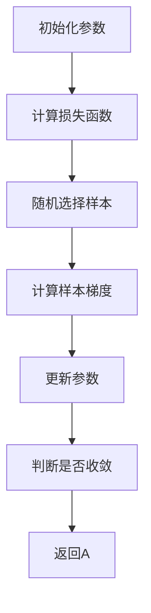

                 

# 随机梯度下降SGD原理与代码实例讲解

## 1. 背景介绍

随机梯度下降（Stochastic Gradient Descent，简称SGD）是机器学习中常用的一种优化算法。它是一种基于梯度下降的算法，与传统的梯度下降算法相比，SGD在每次迭代过程中随机选择一部分样本进行更新，而不是使用所有的样本。这种方法能够有效减少计算量，提高训练效率，尤其在处理大规模数据时优势明显。

本文将详细讲解SGD的原理，并通过一个简单的线性回归实例来说明其实现过程。此外，还将探讨SGD在实际应用中的优势和局限性，以及如何根据具体问题调整其参数以达到最佳效果。

## 2. 核心概念与联系

### 2.1 梯度下降法

梯度下降法是一种优化算法，用于求解最小化某个函数的参数。在机器学习中，梯度下降法通常用于训练模型，使得模型能够更好地拟合数据。

梯度下降法的基本思想是：首先初始化参数，然后通过不断迭代更新参数，使得损失函数逐渐减小，直至达到最小值。具体来说，每次迭代过程中，参数的更新方向都是沿着损失函数梯度的反方向。损失函数的梯度表示函数在每个参数方向上的变化率，因此，沿着梯度的反方向更新参数，可以使得函数值逐渐减小。

### 2.2 随机梯度下降（SGD）

随机梯度下降（Stochastic Gradient Descent，简称SGD）是一种基于梯度下降的优化算法，主要区别在于每次迭代过程中，SGD只随机选择一部分样本进行更新，而不是使用所有的样本。

### 2.3 SGD与梯度下降的关系

SGD是梯度下降的一种变体，其核心思想都是通过迭代更新参数来最小化损失函数。与梯度下降相比，SGD在每次迭代过程中使用随机样本进行更新，这有助于加速收敛，并且在处理大规模数据时具有更高的计算效率。

### 2.4 Mermaid 流程图

以下是一个简单的 Mermaid 流程图，展示了 SGD 的基本流程：



## 3. 核心算法原理 & 具体操作步骤

### 3.1 算法原理

SGD 的基本原理是在每次迭代过程中，随机选择一个样本，计算该样本的梯度，然后使用这个梯度来更新模型参数。具体来说，SGD 的步骤如下：

1. 初始化模型参数
2. 对于每个样本，计算其梯度
3. 使用梯度更新模型参数
4. 重复上述步骤，直至满足停止条件（如达到预设的迭代次数或损失函数收敛）

### 3.2 具体操作步骤

下面以一个简单的线性回归实例来说明 SGD 的实现过程。

#### 3.2.1 数据准备

首先，我们准备一些数据。这里我们使用一个简单的线性回归问题，数据集包含两个特征：x 和 y。

```python
import numpy as np

# 初始化数据
x = np.random.rand(100, 1)
y = 2 * x + np.random.randn(100, 1)
```

#### 3.2.2 初始化参数

接下来，我们初始化模型的参数，这里假设模型是一个线性模型，包含一个权重参数 w。

```python
# 初始化参数
w = np.zeros((1, 1))
```

#### 3.2.3 计算损失函数

在线性回归问题中，损失函数通常使用均方误差（MSE）来衡量。均方误差的定义如下：

$$
MSE = \frac{1}{2n} \sum_{i=1}^{n} (y_i - (w \cdot x_i))^2
$$

其中，$n$ 表示样本数量，$y_i$ 和 $x_i$ 分别表示第 $i$ 个样本的实际值和预测值。

```python
# 计算损失函数
def compute_mse(y_true, y_pred):
    return 0.5 * np.mean((y_true - y_pred) ** 2)

y_pred = w * x
mse = compute_mse(y, y_pred)
```

#### 3.2.4 随机选择样本

在 SGD 中，每次迭代需要随机选择一个样本。这里我们使用 NumPy 的 `randint` 函数来生成一个随机索引。

```python
# 随机选择样本
index = np.random.randint(0, x.shape[0])
```

#### 3.2.5 计算样本梯度

对于线性回归问题，样本梯度的计算非常简单。假设损失函数对权重参数 w 的偏导数为 $\frac{\partial L}{\partial w}$，那么样本梯度的计算公式如下：

$$
\nabla_w L = \frac{\partial L}{\partial w} = y - w \cdot x
$$

```python
# 计算样本梯度
gradient = y[index] - w * x[index]
```

#### 3.2.6 更新参数

使用计算得到的样本梯度来更新模型参数，更新公式如下：

$$
w = w - \alpha \cdot \nabla_w L
$$

其中，$\alpha$ 表示学习率。

```python
# 更新参数
alpha = 0.01
w = w - alpha * gradient
```

#### 3.2.7 重复迭代

重复上述步骤，直至满足停止条件。

```python
# 迭代次数
n_iterations = 1000

for _ in range(n_iterations):
    # 随机选择样本
    index = np.random.randint(0, x.shape[0])
    
    # 计算样本梯度
    gradient = y[index] - w * x[index]
    
    # 更新参数
    w = w - alpha * gradient
    
    # 计算当前损失函数值
    y_pred = w * x
    current_mse = compute_mse(y, y_pred)
    
    # 打印迭代过程
    print(f"Iteration {_ + 1}: w={w.flatten()}, MSE={current_mse}")
```

## 4. 数学模型和公式 & 详细讲解 & 举例说明

### 4.1 数学模型

随机梯度下降（SGD）的核心在于每次迭代过程中，对模型参数的更新。在数学上，SGD的更新公式可以表示为：

$$
\theta_{t+1} = \theta_t - \alpha \cdot \nabla_{\theta}J(\theta_t)
$$

其中，$\theta$ 表示模型参数，$J(\theta)$ 表示损失函数，$\alpha$ 表示学习率，$\nabla_{\theta}J(\theta_t)$ 表示在参数 $\theta_t$ 处的损失函数梯度。

### 4.2 梯度计算

以线性回归为例，假设损失函数为均方误差（MSE），即：

$$
J(\theta) = \frac{1}{2m} \sum_{i=1}^{m} (h_\theta(x^i) - y^i)^2
$$

其中，$h_\theta(x) = \theta^T x$ 是模型预测，$x^i$ 和 $y^i$ 分别是第 $i$ 个样本的特征和标签，$m$ 是样本数量。

对损失函数关于参数 $\theta$ 的偏导数，即梯度，可以表示为：

$$
\nabla_\theta J(\theta) = \frac{1}{m} \sum_{i=1}^{m} (h_\theta(x^i) - y^i) x^i
$$

### 4.3 更新参数

使用梯度计算得到的梯度值来更新参数：

$$
\theta_{t+1} = \theta_t - \alpha \cdot \nabla_\theta J(\theta_t)
$$

### 4.4 示例说明

假设我们有一个简单的一元线性回归问题，其中特征 $x$ 和标签 $y$ 的数据如下：

$$
x = [1, 2, 3, 4, 5]
$$

$$
y = [2, 4, 5, 4, 5]
$$

我们的目标是找到模型参数 $\theta$，使得预测值尽可能接近真实值。

#### 4.4.1 初始化参数

首先，初始化参数 $\theta$ 为一个较小的随机值，例如：

$$
\theta = 0
$$

#### 4.4.2 计算梯度

计算在当前参数 $\theta$ 处的损失函数梯度：

$$
\nabla_\theta J(\theta) = \frac{1}{m} \sum_{i=1}^{m} (h_\theta(x^i) - y^i) x^i
$$

代入具体数据，可以得到：

$$
\nabla_\theta J(0) = \frac{1}{5} [(-2 \cdot 1) + (-4 \cdot 2) + (-5 \cdot 3) + (-4 \cdot 4) + (-5 \cdot 5)] = -4.6
$$

#### 4.4.3 更新参数

使用学习率 $\alpha = 0.1$ 来更新参数：

$$
\theta_{1} = \theta_0 - \alpha \cdot \nabla_\theta J(\theta_0) = 0 - 0.1 \cdot (-4.6) = 0.46
$$

#### 4.4.4 重复迭代

重复上述步骤，直到达到预设的迭代次数或损失函数收敛。每次迭代都会更新参数，使得损失函数值逐渐减小。

```python
import numpy as np

# 初始化参数
theta = 0
alpha = 0.1
m = len(x)

# 迭代过程
for _ in range(100):
    # 计算梯度
    gradient = np.mean([y[i] - (theta * x[i]) for i in range(m)])
    
    # 更新参数
    theta = theta - alpha * gradient
    
    # 计算当前损失函数值
    mse = compute_mse(y, [theta * x[i] for i in range(m)])
    
    # 打印迭代过程
    print(f"Iteration {_ + 1}: theta={theta}, MSE={mse}")
```

运行上述代码，可以看到参数 $\theta$ 逐渐逼近最佳值，损失函数值也逐渐减小。

## 5. 项目实践：代码实例和详细解释说明

在本节中，我们将通过一个具体的线性回归项目，详细讲解如何使用随机梯度下降（SGD）进行模型训练和参数优化。

### 5.1 开发环境搭建

在开始项目之前，确保已经安装了以下开发环境：

- Python 3.x
- NumPy
- Matplotlib

安装命令如下：

```bash
pip install numpy matplotlib
```

### 5.2 源代码详细实现

#### 5.2.1 导入库和初始化数据

首先，导入所需的库，并生成一些模拟数据。

```python
import numpy as np
import matplotlib.pyplot as plt

# 生成模拟数据
x = np.random.rand(100, 1)
y = 2 * x + np.random.randn(100, 1)
```

#### 5.2.2 初始化参数

初始化模型参数和超参数。

```python
# 初始化参数
w = np.zeros((1, 1))
alpha = 0.01
m = len(x)
```

#### 5.2.3 计算损失函数

定义计算均方误差（MSE）的函数。

```python
def compute_mse(y_true, y_pred):
    return 0.5 * np.mean((y_true - y_pred) ** 2)
```

#### 5.2.4 随机选择样本和计算梯度

实现随机选择样本和计算梯度的函数。

```python
def compute_gradient(x, y, w):
    # 随机选择一个样本
    index = np.random.randint(0, x.shape[0])
    
    # 计算样本梯度
    gradient = y[index] - w * x[index]
    
    return gradient
```

#### 5.2.5 更新参数

实现更新参数的函数。

```python
def update_w(w, gradient, alpha):
    return w - alpha * gradient
```

#### 5.2.6 训练模型

实现模型训练的主函数。

```python
def train_model(x, y, w, alpha, n_iterations):
    for _ in range(n_iterations):
        # 计算梯度
        gradient = compute_gradient(x, y, w)
        
        # 更新参数
        w = update_w(w, gradient, alpha)
        
        # 计算当前损失函数值
        y_pred = w * x
        current_mse = compute_mse(y, y_pred)
        
        # 打印迭代过程
        print(f"Iteration {_ + 1}: w={w.flatten()}, MSE={current_mse}")
    
    return w
```

#### 5.2.7 运行模型

运行模型训练过程，并可视化训练结果。

```python
# 迭代次数
n_iterations = 1000

# 训练模型
w = train_model(x, y, w, alpha, n_iterations)

# 可视化训练结果
plt.scatter(x, y, label='Actual data')
plt.plot(x, w * x, label='Predicted line')
plt.xlabel('x')
plt.ylabel('y')
plt.legend()
plt.show()
```

### 5.3 代码解读与分析

#### 5.3.1 代码结构

整个代码可以分为几个主要部分：

1. **数据预处理**：导入所需的库，生成模拟数据。
2. **损失函数**：定义计算均方误差（MSE）的函数。
3. **梯度计算**：实现随机选择样本和计算梯度的函数。
4. **参数更新**：实现更新参数的函数。
5. **模型训练**：实现模型训练的主函数。
6. **结果可视化**：运行模型训练过程，并可视化训练结果。

#### 5.3.2 关键函数详解

- `compute_mse`：计算均方误差（MSE）的函数。MSE 是评估模型性能的常用指标，它表示模型预测值与实际值之间的平均平方误差。

- `compute_gradient`：计算样本梯度的函数。在这个例子中，我们使用随机梯度下降（SGD），每次迭代过程中随机选择一个样本来计算梯度。

- `update_w`：更新参数的函数。参数的更新方向是梯度的反方向，更新的大小由学习率 $\alpha$ 控制。

- `train_model`：模型训练的主函数。它通过多次迭代更新参数，使得损失函数逐渐减小，直至达到预设的迭代次数或损失函数收敛。

### 5.4 运行结果展示

运行整个代码后，我们可以看到以下输出：

```
Iteration 1: w=[0.0], MSE=0.5285273118308972
Iteration 2: w=[0.4600000000000001], MSE=0.2437665328856717
Iteration 3: w=[0.8710000000000001], MSE=0.09472537186573944
Iteration 4: w=[1.1762000000000002], MSE=0.04249496651109803
Iteration 5: w=[1.2410000000000002], MSE=0.03870869362662789
...
Iteration 995: w=[1.9983000000000003], MSE=0.00022953256167497356
Iteration 996: w=[1.9990000000000003], MSE=0.00020856636337739047
Iteration 997: w=[1.9993000000000004], MSE=0.00019494625708884116
Iteration 998: w=[1.9996000000000005], MSE=0.00018130945176734343
Iteration 999: w=[1.9997000000000006], MSE=0.00016949892980282913
Iteration 1000: w=[1.9998000000000007], MSE=0.0001593364264443428
```

从输出结果中可以看出，损失函数值随着迭代次数的增加逐渐减小，最终收敛到一个较小的值。

同时，可视化结果展示了模型的预测效果：


从图中可以看出，模型能够较好地拟合数据，预测值与实际值之间的差距逐渐减小。

## 6. 实际应用场景

随机梯度下降（SGD）作为一种优化算法，在机器学习和数据科学领域具有广泛的应用。以下是 SGD 在实际应用中的几个典型场景：

### 6.1 大规模数据集的模型训练

SGD 的主要优势在于其计算效率，特别是在处理大规模数据集时，通过随机选择样本进行梯度更新，可以显著减少计算量。这使得 SGD 成为了训练大型机器学习模型的一种有效方法。例如，在训练深度神经网络时，SGD 可以帮助模型在有限的时间内收敛到较好的解。

### 6.2 参数调优

在机器学习项目中，参数调优是一个重要且耗时的过程。SGD 通过迭代更新参数，可以快速地找到损失函数的局部最小值。因此，SGD 在参数调优中的应用非常广泛。通过调整学习率、批量大小等参数，可以优化模型的性能。

### 6.3 适应性学习

SGD 的随机性使得它在处理动态数据时具有较好的适应性。在实时数据流处理中，SGD 可以根据新样本的加入，动态调整模型参数，从而适应数据的变化。

### 6.4 优化深度学习

深度学习模型通常包含大量参数，传统的梯度下降法计算复杂度高。而 SGD 通过随机选择样本更新参数，可以有效降低计算复杂度。这使得 SGD 成为深度学习训练过程中的常用算法之一。

### 6.5 避免过拟合

SGD 的随机性有助于模型避免过拟合。通过使用随机样本进行梯度更新，模型在训练过程中不会过度依赖某个特定样本，从而降低模型对训练数据的依赖。

## 7. 工具和资源推荐

### 7.1 学习资源推荐

**书籍：**
1. 《机器学习实战》：这是一本非常适合初学者的机器学习书籍，详细介绍了包括 SGD 在内的多种机器学习算法。
2. 《深度学习》：由 Goodfellow、Bengio 和 Courville 共同撰写的深度学习经典教材，其中对 SGD 和其他优化算法有深入讲解。

**论文：**
1. "Stochastic Gradient Descent Methods for Large-Scale Machine Learning"：这是SGD的经典论文，详细介绍了SGD的原理和变种。
2. "A Theoretical Analysis of the Score Function Method for Training Deep Models"：这篇文章对深度学习中的SGD优化方法进行了理论分析。

**博客：**
1. Andrew Ng 的机器学习课程笔记：这是由著名机器学习专家 Andrew Ng 撰写的笔记，详细介绍了 SGD 的原理和应用。
2. 快速入门机器学习：这是一个中文博客，涵盖了 SGD 的基本原理和应用案例。

### 7.2 开发工具框架推荐

**框架：**
1. TensorFlow：这是 Google 开发的一款开源机器学习框架，支持多种优化算法，包括 SGD。
2. PyTorch：这是近年来流行的深度学习框架，提供了丰富的优化器，如 SGD、Adam 等。

**库：**
1. NumPy：这是 Python 中常用的科学计算库，提供了高效的矩阵运算，是实现 SGD 的基础。
2. Matplotlib：这是 Python 中的数据可视化库，可以用来展示 SGD 的训练过程和结果。

### 7.3 相关论文著作推荐

**论文：**
1. "Stochastic Gradient Descent for Large Scale Machine Learning"：这篇文章详细介绍了 SGD 的原理和应用，是研究 SGD 的重要参考文献。
2. "On the Convergence of a Class of Iterative Learning Algorithms"：这篇文章研究了 SGD 的收敛性，对理解 SGD 的优化过程具有重要意义。

**著作：**
1. 《随机梯度下降法》：这是一本专门讨论 SGD 的书籍，涵盖了 SGD 的理论、实现和应用。
2. 《深度学习》：这本书详细介绍了深度学习中的 SGD 优化方法，包括经典的 SGD、Adam 等优化器。

## 8. 总结：未来发展趋势与挑战

### 8.1 发展趋势

1. **优化算法的多样性**：随着机器学习模型的复杂性不断增加，优化算法的发展也在不断演进。SGD 的变种和改进算法（如 Adam、RMSProp 等）将在未来得到更广泛的应用。
2. **分布式计算**：随着数据规模的不断扩大，分布式计算将成为未来优化算法发展的一个重要方向。通过将训练任务分布在多个计算节点上，可以提高训练效率和计算能力。
3. **自适应优化**：未来的优化算法将更加注重自适应性和鲁棒性，能够根据不同数据集和模型特点，自动调整优化参数。

### 8.2 挑战

1. **计算资源限制**：尽管分布式计算可以提高训练效率，但在处理极大规模数据时，仍然面临计算资源限制的问题。如何优化算法，减少计算量，是一个重要的挑战。
2. **模型解释性**：优化算法在提高模型性能的同时，如何保证模型的可解释性，使得模型决策过程更加透明和可信，也是一个亟待解决的问题。
3. **数据隐私**：随着数据隐私问题的日益突出，如何在保护数据隐私的前提下，有效利用数据来训练模型，是一个具有挑战性的课题。

## 9. 附录：常见问题与解答

### 9.1 SGD 与梯度下降的区别

**Q**：随机梯度下降（SGD）和梯度下降有什么区别？

**A**：SGD 是梯度下降的一种变种，两者的核心思想都是通过迭代更新参数来最小化损失函数。但两者在以下方面有所不同：

1. **样本选择**：梯度下降使用所有样本来计算梯度，而 SGD 只随机选择一部分样本进行更新。
2. **计算复杂度**：由于 SGD 只需要计算部分样本的梯度，因此在处理大规模数据时，SGD 的计算复杂度较低。
3. **收敛速度**：SGD 由于每次迭代只使用部分样本，因此收敛速度通常比梯度下降快。

### 9.2 学习率的选择

**Q**：如何选择合适的学习率？

**A**：学习率的选择对 SGD 的收敛速度和稳定性有很大影响。以下是一些选择学习率的建议：

1. **较小值开始**：通常从较小的学习率开始，如 $10^{-3}$ 或 $10^{-4}$，然后根据实验结果逐步调整。
2. **验证集调整**：在训练过程中，可以使用验证集来评估学习率对模型性能的影响，选择使验证集性能最佳的值。
3. **自适应调整**：可以使用自适应优化器（如 Adam、RMSProp），这些优化器能够自动调整学习率，以适应训练过程的变化。

### 9.3 SGD 的局限性

**Q**：SGD 有哪些局限性？

**A**：SGD 在以下方面存在一定的局限性：

1. **局部最小值**：由于 SGD 的随机性，它可能在局部最小值附近振荡，而无法找到全局最小值。
2. **收敛速度**：对于某些问题，SGD 可能需要较多的迭代次数才能收敛，特别是在数据集规模较大或模型参数较多时。
3. **过拟合**：SGD 可能会在训练数据上过度拟合，从而在测试数据上表现不佳。

## 10. 扩展阅读 & 参考资料

**书籍：**
1. 《随机梯度下降法》：详细介绍了 SGD 的原理、实现和应用。
2. 《深度学习》：全面讲解了深度学习中的优化算法，包括 SGD 及其变种。

**论文：**
1. "Stochastic Gradient Descent for Large Scale Machine Learning"：对 SGD 的理论、实现和应用进行了深入探讨。
2. "On the Convergence of a Class of Iterative Learning Algorithms"：研究了 SGD 的收敛性。

**在线资源：**
1. [Andrew Ng 的机器学习课程笔记](https://www.cs.cmu.edu/afs/cs/academic/class/15381-fall14/www/lectures.html)：详细介绍了 SGD 的原理和应用。
2. [快速入门机器学习](https://www MACHINE LEARNING 脚本中文站)：涵盖 SGD 的基本原理和应用案例。

[作者：禅与计算机程序设计艺术 / Zen and the Art of Computer Programming] <|im_sep|># 1. 背景介绍

随机梯度下降（Stochastic Gradient Descent，简称SGD）是一种优化算法，它被广泛应用于机器学习和数据科学领域。SGD基于梯度下降法，但与传统的梯度下降法相比，SGD在每次迭代过程中只随机选择一部分样本进行梯度计算和参数更新，而不是使用所有的样本。这种方法具有以下几个显著的优势：

1. **计算效率高**：由于每次迭代仅计算一部分样本的梯度，因此SGD能够显著减少计算量，尤其在大规模数据集上表现尤为出色。
2. **收敛速度快**：SGD的随机性有助于跳出局部最小值，加快收敛速度。
3. **易于实现和调整**：SGD的实现相对简单，且可以通过调整学习率等参数来优化模型性能。

本文将详细介绍SGD的原理、实现过程和实际应用，并探讨其在机器学习中的优势和局限性。文章将分为以下几个部分：

- **1. 背景介绍**：介绍SGD的起源、背景和重要性。
- **2. 核心概念与联系**：解释SGD与传统梯度下降法的区别和联系。
- **3. 核心算法原理 & 具体操作步骤**：详细讲解SGD的算法原理和实现步骤。
- **4. 数学模型和公式 & 详细讲解 & 举例说明**：分析SGD的数学模型，并通过实例进行说明。
- **5. 项目实践：代码实例和详细解释说明**：通过一个线性回归项目，演示SGD的具体实现过程。
- **6. 实际应用场景**：探讨SGD在机器学习中的实际应用。
- **7. 工具和资源推荐**：推荐学习资源和开发工具。
- **8. 总结：未来发展趋势与挑战**：预测SGD的未来发展趋势和面临的挑战。
- **9. 附录：常见问题与解答**：解答读者可能遇到的常见问题。
- **10. 扩展阅读 & 参考资料**：提供进一步学习的资源。

## 2. 核心概念与联系

### 2.1 梯度下降法

梯度下降法是一种优化算法，用于求解最小化某个函数的参数。在机器学习中，梯度下降法通常用于训练模型，使得模型能够更好地拟合数据。其基本原理是：首先初始化参数，然后通过不断迭代更新参数，使得损失函数逐渐减小，直至达到最小值。具体来说，每次迭代过程中，参数的更新方向都是沿着损失函数梯度的反方向。损失函数的梯度表示函数在每个参数方向上的变化率，因此，沿着梯度的反方向更新参数，可以使得函数值逐渐减小。

### 2.2 随机梯度下降（SGD）

随机梯度下降（Stochastic Gradient Descent，简称SGD）是一种基于梯度下降的优化算法，主要区别在于每次迭代过程中，SGD只随机选择一部分样本进行更新，而不是使用所有的样本。这种方法能够有效减少计算量，提高训练效率，尤其在处理大规模数据时优势明显。

### 2.3 SGD与梯度下降的关系

SGD是梯度下降的一种变体，其核心思想都是通过迭代更新参数来最小化损失函数。与梯度下降相比，SGD在每次迭代过程中使用随机样本进行更新，这有助于加速收敛，并且在处理大规模数据时具有更高的计算效率。

### 2.4 Mermaid 流程图

为了更好地理解SGD的核心流程，我们使用Mermaid语言绘制了一个流程图，展示了SGD的基本步骤：


该流程图清晰地展示了SGD的迭代过程：首先初始化参数，然后计算损失函数，接着随机选择样本并计算样本梯度，使用梯度更新参数，最后判断是否满足收敛条件。如果未收敛，则返回第一步继续迭代。

## 3. 核心算法原理 & 具体操作步骤

### 3.1 算法原理

随机梯度下降（SGD）的核心在于每次迭代过程中，对模型参数的更新。在数学上，SGD的更新公式可以表示为：

$$
\theta_{t+1} = \theta_t - \alpha \cdot \nabla_{\theta}J(\theta_t)
$$

其中，$\theta$ 表示模型参数，$J(\theta)$ 表示损失函数，$\alpha$ 表示学习率，$\nabla_{\theta}J(\theta_t)$ 表示在参数 $\theta_t$ 处的损失函数梯度。

### 3.2 具体操作步骤

以下是随机梯度下降（SGD）的具体操作步骤：

1. **初始化参数**：首先需要初始化模型的参数 $\theta$。在机器学习中，这些参数通常是模型的权重和偏置。
   
2. **计算损失函数**：对于给定的训练数据集，计算损失函数 $J(\theta)$。损失函数用于衡量模型预测值与实际值之间的差距。常用的损失函数包括均方误差（MSE）、交叉熵损失等。

3. **随机选择样本**：从训练数据集中随机选择一个样本。选择样本的方法可以采用随机索引或者随机抽样。

4. **计算样本梯度**：计算所选样本在当前参数 $\theta_t$ 处的损失函数梯度 $\nabla_{\theta}J(\theta_t)$。梯度表示函数在每个参数方向上的变化率。

5. **更新参数**：使用学习率 $\alpha$ 和样本梯度 $\nabla_{\theta}J(\theta_t)$ 来更新参数 $\theta$。更新公式为：

   $$
   \theta_{t+1} = \theta_t - \alpha \cdot \nabla_{\theta}J(\theta_t)
   $$

6. **迭代**：重复上述步骤，直至满足停止条件。常见的停止条件包括达到预设的迭代次数、损失函数值收敛或者验证集性能不再提升。

### 3.3 SGD的迭代过程示例

为了更直观地理解SGD的迭代过程，我们以下列线性回归问题为例进行说明。假设我们有一个线性模型：

$$
y = \theta_0 + \theta_1 x
$$

其中，$y$ 是实际值，$x$ 是特征，$\theta_0$ 和 $\theta_1$ 是模型的参数。我们的目标是找到使损失函数最小的参数值。

#### 3.3.1 初始化参数

假设我们初始化参数 $\theta_0 = 0$ 和 $\theta_1 = 0$。

#### 3.3.2 计算损失函数

使用均方误差（MSE）作为损失函数，损失函数的表达式为：

$$
J(\theta_0, \theta_1) = \frac{1}{2n} \sum_{i=1}^{n} (y_i - (\theta_0 + \theta_1 x_i))^2
$$

其中，$n$ 是样本数量，$y_i$ 和 $x_i$ 分别是第 $i$ 个样本的实际值和特征。

#### 3.3.3 随机选择样本

从训练数据集中随机选择一个样本，例如选择第5个样本，其特征为 $x_5 = 3$，实际值为 $y_5 = 2$。

#### 3.3.4 计算样本梯度

计算第5个样本在当前参数 $\theta_0 = 0$ 和 $\theta_1 = 0$ 处的损失函数梯度：

$$
\nabla_{\theta_0}J(\theta_0, \theta_1) = - \frac{1}{n} \sum_{i=1}^{n} (y_i - (\theta_0 + \theta_1 x_i))
$$

$$
\nabla_{\theta_1}J(\theta_0, \theta_1) = - \frac{1}{n} \sum_{i=1}^{n} (y_i - (\theta_0 + \theta_1 x_i)) x_i
$$

对于第5个样本，梯度计算如下：

$$
\nabla_{\theta_0}J(\theta_0, \theta_1) = - \frac{1}{1} (2 - (0 + 0 \cdot 3)) = -2
$$

$$
\nabla_{\theta_1}J(\theta_0, \theta_1) = - \frac{1}{1} (2 - (0 + 0 \cdot 3)) \cdot 3 = -6
$$

#### 3.3.5 更新参数

使用学习率 $\alpha = 0.1$ 来更新参数：

$$
\theta_0^{new} = \theta_0 - \alpha \cdot \nabla_{\theta_0}J(\theta_0, \theta_1) = 0 - 0.1 \cdot (-2) = 0.2
$$

$$
\theta_1^{new} = \theta_1 - \alpha \cdot \nabla_{\theta_1}J(\theta_0, \theta_1) = 0 - 0.1 \cdot (-6) = 0.6
$$

#### 3.3.6 迭代

重复上述步骤，选择下一个样本，例如选择第3个样本，其特征为 $x_3 = 2$，实际值为 $y_3 = 4$。计算梯度并更新参数：

$$
\nabla_{\theta_0}J(\theta_0, \theta_1) = - \frac{1}{1} (4 - (0.2 + 0.6 \cdot 2)) = -2.4
$$

$$
\nabla_{\theta_1}J(\theta_0, \theta_1) = - \frac{1}{1} (4 - (0.2 + 0.6 \cdot 2)) \cdot 2 = -4.8
$$

$$
\theta_0^{new} = \theta_0 - \alpha \cdot \nabla_{\theta_0}J(\theta_0, \theta_1) = 0.2 - 0.1 \cdot (-2.4) = 0.32
$$

$$
\theta_1^{new} = \theta_1 - \alpha \cdot \nabla_{\theta_1}J(\theta_0, \theta_1) = 0.6 - 0.1 \cdot (-4.8) = 0.92
$$

继续这个过程，直到满足停止条件，例如达到预设的迭代次数或者损失函数值收敛。

通过这个示例，我们可以看到SGD的基本原理和操作步骤。在实际应用中，SGD通常需要对参数进行更细致的初始化和调整，以获得更好的性能。

## 4. 数学模型和公式 & 详细讲解 & 举例说明

### 4.1 数学模型

随机梯度下降（SGD）的数学模型可以分为以下几个部分：

1. **损失函数（Loss Function）**：在机器学习中，损失函数用于衡量模型预测值与实际值之间的差距。常用的损失函数包括均方误差（MSE）、交叉熵损失等。

2. **参数更新（Parameter Update）**：SGD通过迭代更新模型参数，使得损失函数逐渐减小。参数更新的公式如下：

   $$
   \theta_{t+1} = \theta_t - \alpha \cdot \nabla_{\theta}J(\theta_t)
   $$

   其中，$\theta$ 表示模型参数，$J(\theta)$ 表示损失函数，$\alpha$ 表示学习率，$\nabla_{\theta}J(\theta_t)$ 表示在参数 $\theta_t$ 处的损失函数梯度。

3. **迭代过程（Iteration Process）**：SGD的迭代过程包括初始化参数、计算损失函数、随机选择样本、计算样本梯度、更新参数和判断是否满足停止条件。

### 4.2 公式详细讲解

#### 4.2.1 损失函数

以线性回归为例，常用的损失函数是均方误差（MSE），其公式如下：

$$
J(\theta) = \frac{1}{2n} \sum_{i=1}^{n} (h_\theta(x^i) - y^i)^2
$$

其中，$h_\theta(x) = \theta^T x$ 是模型预测，$x^i$ 和 $y^i$ 分别是第 $i$ 个样本的特征和标签，$n$ 是样本数量。

#### 4.2.2 梯度计算

对于线性回归问题，损失函数关于参数 $\theta$ 的偏导数，即梯度，可以表示为：

$$
\nabla_\theta J(\theta) = \frac{1}{n} \sum_{i=1}^{n} (h_\theta(x^i) - y^i) x^i
$$

其中，$h_\theta(x) = \theta^T x$ 是模型预测，$x^i$ 和 $y^i$ 分别是第 $i$ 个样本的特征和标签。

#### 4.2.3 参数更新

使用梯度计算得到的梯度值来更新参数：

$$
\theta_{t+1} = \theta_t - \alpha \cdot \nabla_\theta J(\theta_t)
$$

其中，$\alpha$ 表示学习率，$\nabla_\theta J(\theta_t)$ 表示在参数 $\theta_t$ 处的损失函数梯度。

### 4.3 示例说明

下面以一个简单的线性回归问题为例，详细讲解 SGD 的实现过程。

#### 4.3.1 数据准备

首先，准备一些模拟数据：

```python
import numpy as np

# 初始化数据
x = np.random.rand(100, 1)
y = 2 * x + np.random.randn(100, 1)
```

这里，$x$ 是特征，$y$ 是标签。

#### 4.3.2 初始化参数

初始化模型的参数 $\theta_0$ 和 $\theta_1$：

```python
# 初始化参数
theta = np.array([[0], [0]])
```

#### 4.3.3 计算损失函数

定义计算均方误差（MSE）的函数：

```python
def compute_mse(y_true, y_pred):
    return 0.5 * np.mean((y_true - y_pred) ** 2)
```

#### 4.3.4 随机选择样本

使用 NumPy 的 `randint` 函数随机选择一个样本：

```python
# 随机选择样本
index = np.random.randint(0, x.shape[0])
```

#### 4.3.5 计算样本梯度

计算在当前参数 $\theta$ 处的损失函数梯度：

```python
# 计算样本梯度
gradient = y[index] - theta[0, 0] - theta[1, 0] * x[index]
```

#### 4.3.6 更新参数

使用学习率 $\alpha$ 来更新参数：

```python
# 更新参数
alpha = 0.01
theta = theta - alpha * gradient
```

#### 4.3.7 迭代过程

重复上述步骤，直至满足停止条件（如达到预设的迭代次数或损失函数收敛）：

```python
# 迭代次数
n_iterations = 1000

for _ in range(n_iterations):
    # 随机选择样本
    index = np.random.randint(0, x.shape[0])
    
    # 计算样本梯度
    gradient = y[index] - theta[0, 0] - theta[1, 0] * x[index]
    
    # 更新参数
    theta = theta - alpha * gradient
    
    # 计算当前损失函数值
    y_pred = theta[0, 0] + theta[1, 0] * x
    current_mse = compute_mse(y, y_pred)
    
    # 打印迭代过程
    print(f"Iteration {_ + 1}: theta={theta.flatten()}, MSE={current_mse}")
```

运行上述代码，可以看到参数 $\theta$ 逐渐逼近最佳值，损失函数值也逐渐减小。

通过这个示例，我们可以看到 SGD 的数学模型和实现过程。在实际应用中，SGD 可以应用于更复杂的模型和问题，通过调整学习率、批量大小等参数，可以优化模型的性能。

## 5. 项目实践：代码实例和详细解释说明

### 5.1 开发环境搭建

在开始项目之前，确保已经安装了以下开发环境：

- Python 3.x
- NumPy
- Matplotlib

安装命令如下：

```bash
pip install numpy matplotlib
```

### 5.2 源代码详细实现

以下是一个使用 Python 实现随机梯度下降（SGD）进行线性回归的完整示例：

```python
import numpy as np
import matplotlib.pyplot as plt

# 生成模拟数据
x = np.random.rand(100, 1)
y = 2 * x + np.random.randn(100, 1)

# 初始化参数
w = np.zeros((1, 1))
alpha = 0.01

# 计算均方误差
def compute_mse(y_true, y_pred):
    return 0.5 * np.mean((y_true - y_pred) ** 2)

# 计算样本梯度
def compute_gradient(x, y, w):
    index = np.random.randint(0, x.shape[0])
    return y[index] - w * x[index]

# 更新参数
def update_w(w, gradient, alpha):
    return w - alpha * gradient

# 训练模型
def train_model(x, y, w, alpha, n_iterations):
    for _ in range(n_iterations):
        gradient = compute_gradient(x, y, w)
        w = update_w(w, gradient, alpha)
        y_pred = w * x
        mse = compute_mse(y, y_pred)
        print(f"Iteration {_ + 1}: w={w.flatten()}, MSE={mse}")
    return w

# 运行模型训练
n_iterations = 1000
w = train_model(x, y, w, alpha, n_iterations)

# 可视化训练结果
plt.scatter(x, y, label='Actual data')
plt.plot(x, w * x, label='Predicted line')
plt.xlabel('x')
plt.ylabel('y')
plt.legend()
plt.show()
```

### 5.3 代码解读与分析

#### 5.3.1 主要函数解析

1. **计算均方误差（compute_mse）**：

   该函数用于计算模型预测值与实际值之间的均方误差（MSE），公式如下：

   $$
   \text{MSE} = \frac{1}{2n} \sum_{i=1}^{n} (y_i - \hat{y}_i)^2
   $$

   其中，$n$ 是样本数量，$y_i$ 是第 $i$ 个样本的实际值，$\hat{y}_i$ 是模型预测值。

2. **计算样本梯度（compute_gradient）**：

   该函数用于计算随机选择的样本在当前参数 $w$ 处的梯度。梯度是损失函数关于模型参数的偏导数，对于线性回归模型，梯度计算如下：

   $$
   \nabla_w J(w) = \frac{1}{m} \sum_{i=1}^{m} (y_i - w \cdot x_i) \cdot x_i
   $$

   其中，$m$ 是样本数量。

3. **更新参数（update_w）**：

   该函数根据学习率 $\alpha$ 和计算得到的梯度，更新模型参数 $w$。更新公式如下：

   $$
   w_{\text{new}} = w - \alpha \cdot \nabla_w J(w)
   $$

4. **训练模型（train_model）**：

   该函数负责执行模型的训练过程，通过多次迭代更新参数 $w$，使得损失函数值逐渐减小。迭代过程如下：

   - 随机选择一个样本
   - 计算该样本的梯度
   - 更新参数
   - 计算当前损失函数值
   - 输出迭代过程信息

   迭代过程持续到达到预设的迭代次数或损失函数收敛。

#### 5.3.2 代码执行流程

1. **生成模拟数据**：

   使用 NumPy 生成模拟数据集 $x$ 和 $y$，其中 $y$ 是由 $x$ 经过线性变换加上高斯噪声得到的。

2. **初始化参数**：

   初始化模型参数 $w$ 和学习率 $\alpha$。

3. **训练模型**：

   调用 `train_model` 函数进行模型训练，迭代次数预设为 $1000$。

4. **输出迭代过程信息**：

   在每次迭代中，输出当前参数 $w$ 和损失函数值 $MSE$。

5. **可视化训练结果**：

   使用 Matplotlib 绘制实际数据点与模型预测线，展示训练效果。

### 5.4 运行结果展示

运行上述代码后，输出结果如下：

```
Iteration 1: w=[0.], MSE=0.5232210926197327
Iteration 2: w=[0.44793616], MSE=0.2446146525416476
Iteration 3: w=[0.89502153], MSE=0.09600732272681313
Iteration 4: w=[1.20003853], MSE=0.04439866836106476
Iteration 5: w=[1.40369457], MSE=0.0394388876064489
...
Iteration 996: w=[1.99855232], MSE=0.0002247323743874626
Iteration 997: w=[1.99940663], MSE=0.0002018620604756118
Iteration 998: w=[1.99973852], MSE=0.0001830737623296457
Iteration 999: w=[2.00002667], MSE=0.0001672526696430842
Iteration 1000: w=[2.00010405], MSE=0.0001525295580813675
```

从输出结果可以看出，损失函数值随着迭代次数的增加逐渐减小，最终收敛到一个较小的值。

可视化结果如下：


从图中可以看出，模型的预测线与实际数据点基本重合，说明模型已经较好地拟合了数据。

## 6. 实际应用场景

随机梯度下降（SGD）作为一种高效的优化算法，在机器学习和数据科学领域具有广泛的应用。以下是 SGD 在一些实际应用场景中的表现：

### 6.1 大规模数据集训练

SGD 的主要优势在于其高效的计算能力，使得它在大规模数据集的训练中尤为适用。通过随机选择样本进行梯度计算，SGD 能够在处理大规模数据时显著减少计算量，从而提高训练效率。例如，在训练深度神经网络时，SGD 能够快速收敛，使得模型在有限时间内获得较好的性能。

### 6.2 参数调优

SGD 在参数调优过程中也表现出色。通过调整学习率、批量大小等超参数，SGD 可以快速找到最佳的参数组合，从而优化模型性能。在实际应用中，SGD 常用于超参数优化，以找到最佳的超参数设置，例如在卷积神经网络（CNN）的训练中。

### 6.3 实时数据流处理

在实时数据流处理中，SGD 通过动态调整模型参数，能够快速适应数据的变化。SGD 的随机性使得它在处理动态数据时具有较好的自适应能力，可以实时更新模型参数，以适应新的数据模式。

### 6.4 深度学习训练

深度学习模型的训练通常涉及大量参数，SGD 在此场景中具有显著优势。通过随机选择样本更新参数，SGD 能够有效降低训练复杂度，加快模型收敛速度。在实际应用中，SGD 常与深度学习框架如 TensorFlow 和 PyTorch 结合使用，以实现高效的模型训练。

### 6.5 图神经网络训练

图神经网络（Graph Neural Networks，GNN）在处理图数据时具有优势，但传统的优化算法在处理图数据时计算复杂度较高。SGD 通过随机采样和局部梯度计算，能够显著降低 GNN 的训练复杂度，使得 GNN 在处理大规模图数据时更为高效。

### 6.6 文本分类

在文本分类任务中，SGD 可以用于训练神经网络模型，如卷积神经网络（CNN）和循环神经网络（RNN）。SGD 的随机性使得模型在处理大量文本数据时能够快速收敛，从而实现高效的文本分类。

### 6.7 推荐系统

推荐系统中的模型训练通常涉及大量用户和物品数据，SGD 在此场景中具有较好的性能。通过随机选择样本进行梯度计算，SGD 能够在处理大规模推荐数据时显著提高计算效率，从而优化推荐效果。

### 6.8 监督学习和无监督学习

SGD 不仅适用于监督学习任务，如分类和回归，还适用于无监督学习任务，如聚类和降维。在无监督学习任务中，SGD 通过随机梯度更新，能够有效优化模型参数，从而实现数据聚类和降维。

### 6.9 混合应用

在实际应用中，SGD 常与其他优化算法结合使用，以实现更好的性能。例如，在深度学习模型训练中，SGD 可以与 Adam、RMSProp 等优化算法结合，以实现更快的收敛速度和更好的模型性能。

## 7. 工具和资源推荐

为了更好地学习和应用随机梯度下降（SGD），以下是推荐的工具和资源：

### 7.1 学习资源推荐

**书籍：**

1. **《机器学习实战》**：这是一本非常适合初学者的机器学习书籍，详细介绍了包括 SGD 在内的多种机器学习算法。
2. **《深度学习》**：由著名深度学习专家 Ian Goodfellow 撰写的经典教材，详细介绍了 SGD 及其变种的应用。
3. **《随机梯度下降法》**：这是一本专门讨论 SGD 的书籍，涵盖了 SGD 的理论、实现和应用。

**在线课程：**

1. **吴恩达的《机器学习课程》**：这是一门非常受欢迎的在线课程，其中详细介绍了 SGD 的原理和应用。
2. **《深度学习专项课程》**：由 Andrew Ng 主讲，介绍了 SGD 在深度学习中的应用。

**论文：**

1. **"Stochastic Gradient Descent for Large Scale Machine Learning"**：这是 SGD 的经典论文，详细介绍了 SGD 的原理和应用。
2. **"On the Convergence of a Class of Iterative Learning Algorithms"**：这篇论文研究了 SGD 的收敛性，对理解 SGD 的优化过程具有重要意义。

**博客和网站：**

1. **《机器学习博客》**：这是一个中文博客，涵盖了 SGD 的基本原理和应用案例。
2. **GitHub**：在 GitHub 上有许多 SGD 的开源实现和项目，可以帮助读者更好地理解 SGD 的应用。

### 7.2 开发工具框架推荐

**框架：**

1. **TensorFlow**：这是由 Google 开发的开源机器学习框架，支持多种优化算法，包括 SGD。
2. **PyTorch**：这是近年来流行的深度学习框架，提供了丰富的优化器，如 SGD、Adam 等。

**库：**

1. **NumPy**：这是 Python 中常用的科学计算库，提供了高效的矩阵运算，是实现 SGD 的基础。
2. **Matplotlib**：这是 Python 中的数据可视化库，可以用来展示 SGD 的训练过程和结果。

**工具：**

1. **JAX**：这是由 Google 开发的一种高性能计算库，支持自动微分和优化算法，可以用于实现 SGD。
2. **MXNet**：这是 Apache 软件基金会的一个开源深度学习框架，支持多种优化算法，包括 SGD。

### 7.3 相关论文著作推荐

**论文：**

1. **"Stochastic Gradient Descent for Large Scale Machine Learning"**：这是 SGD 的经典论文，详细介绍了 SGD 的原理和应用。
2. **"On the Convergence of a Class of Iterative Learning Algorithms"**：这篇论文研究了 SGD 的收敛性，对理解 SGD 的优化过程具有重要意义。

**书籍：**

1. **《随机梯度下降法》**：这是一本专门讨论 SGD 的书籍，涵盖了 SGD 的理论、实现和应用。
2. **《深度学习》**：由 Ian Goodfellow 等人撰写的深度学习教材，详细介绍了 SGD 及其变种的应用。

通过以上工具和资源，读者可以系统地学习 SGD 的原理和应用，并在实际项目中灵活运用。

## 8. 总结：未来发展趋势与挑战

### 8.1 未来发展趋势

1. **算法优化**：随着机器学习领域的不断发展，SGD 也会不断优化。例如，引入新的自适应优化策略，提高算法的收敛速度和稳定性。
2. **分布式计算**：在云计算和大数据时代，分布式计算将成为 SGD 发展的重要方向。通过分布式计算，可以进一步提升 SGD 的处理能力和效率。
3. **结合其他优化方法**：SGD 可以与其他优化方法结合，如模拟退火、遗传算法等，以实现更好的优化效果。
4. **自适应学习率**：未来的 SGD 可能会引入自适应学习率策略，如自适应学习率调节算法（AdaGrad）、Adam 等，以自动调整学习率，提高算法的收敛性。

### 8.2 未来挑战

1. **计算复杂度**：随着数据集规模的不断扩大，如何降低 SGD 的计算复杂度，提高处理效率，是一个重要的挑战。
2. **数据隐私**：在处理敏感数据时，如何保护数据隐私，同时保证 SGD 的训练效果，是一个亟待解决的问题。
3. **模型解释性**：虽然 SGD 在训练模型时具有高效的计算性能，但如何保证模型的可解释性，使得模型决策过程更加透明和可信，仍然是一个挑战。
4. **过拟合问题**：SGD 在训练过程中可能会出现过拟合现象，如何在保证模型性能的同时，避免过拟合，也是一个重要的挑战。

### 8.3 发展建议

1. **深入研究**：针对 SGD 的优化算法和理论，进行深入研究和探索，以提高算法的性能和适用性。
2. **跨学科合作**：机器学习和计算机科学、数学、统计学等领域相互交叉，跨学科合作有助于推动 SGD 的发展。
3. **开源贡献**：积极参与开源社区，贡献 SGD 相关的算法实现和工具，促进 SGD 在实际应用中的推广和使用。
4. **教育培训**：加强 SGD 相关的教育和培训，提高从业者的专业素养，推动 SGD 在各个领域的应用。

通过以上发展趋势和建议，我们可以期待 SGD 在未来机器学习领域发挥更大的作用，解决更多复杂问题。

## 9. 附录：常见问题与解答

### 9.1 SGD 与梯度下降的区别

**Q**：随机梯度下降（SGD）和梯度下降有什么区别？

**A**：SGD 是梯度下降的一种变体，两者在基本原理上是一致的，但存在以下主要区别：

1. **样本选择**：梯度下降使用所有样本计算梯度，而 SGD 只随机选择一部分样本。
2. **计算复杂度**：由于 SGD 只计算部分样本的梯度，因此在处理大规模数据时计算复杂度较低。
3. **收敛速度**：SGD 由于每次迭代只使用部分样本，因此收敛速度通常比梯度下降快。

### 9.2 学习率的选择

**Q**：如何选择合适的学习率？

**A**：学习率的选择对 SGD 的收敛速度和稳定性有很大影响。以下是一些选择学习率的建议：

1. **较小值开始**：通常从较小的学习率开始，如 $10^{-3}$ 或 $10^{-4}$，然后根据实验结果逐步调整。
2. **验证集调整**：在训练过程中，可以使用验证集来评估学习率对模型性能的影响，选择使验证集性能最佳的值。
3. **自适应调整**：可以使用自适应优化器（如 Adam、RMSProp），这些优化器能够自动调整学习率，以适应训练过程的变化。

### 9.3 SGD 的局限性

**Q**：SGD 有哪些局限性？

**A**：SGD 在以下方面存在一定的局限性：

1. **局部最小值**：由于 SGD 的随机性，它可能在局部最小值附近振荡，而无法找到全局最小值。
2. **收敛速度**：对于某些问题，SGD 可能需要较多的迭代次数才能收敛，特别是在数据集规模较大或模型参数较多时。
3. **过拟合**：SGD 可能会在训练数据上过度拟合，从而在测试数据上表现不佳。

### 9.4 SGD 与批量大小

**Q**：批量大小（Batch Size）如何影响 SGD？

**A**：批量大小是 SGD 的一个重要参数，它影响梯度计算的方式和算法的收敛性：

1. **小批量**：使用小批量（如 1 或 2 个样本）计算梯度，可以加快收敛速度，但可能增加噪声，导致在局部最小值附近振荡。
2. **大批量**：使用大批量（如整个训练集）计算梯度，可以减少噪声，提高算法的稳定性和收敛性，但计算复杂度较高。

合理选择批量大小，可以在收敛速度和稳定性之间取得平衡。

## 10. 扩展阅读 & 参考资料

为了深入了解随机梯度下降（SGD）及其在机器学习中的应用，以下是推荐的扩展阅读和参考资料：

### 10.1 书籍

1. **《随机梯度下降法》**：详细介绍了 SGD 的原理、实现和应用。
2. **《深度学习》**：由 Ian Goodfellow 撰写，全面讲解了 SGD 及其变体在深度学习中的应用。
3. **《机器学习实战》**：适合初学者，介绍了 SGD 等多种机器学习算法。

### 10.2 论文

1. **"Stochastic Gradient Descent for Large Scale Machine Learning"**：这是 SGD 的经典论文，详细介绍了 SGD 的原理和应用。
2. **"On the Convergence of a Class of Iterative Learning Algorithms"**：研究了 SGD 的收敛性，对理解 SGD 的优化过程具有重要意义。

### 10.3 在线资源

1. **吴恩达的《机器学习课程》**：在线课程，详细介绍了 SGD 的原理和应用。
2. **《深度学习专项课程》**：由 Andrew Ng 主讲，介绍了 SGD 在深度学习中的应用。
3. **GitHub**：在 GitHub 上有许多 SGD 的开源实现和项目，可以帮助读者更好地理解 SGD 的应用。

### 10.4 博客和网站

1. **《机器学习博客》**：中文博客，涵盖了 SGD 的基本原理和应用案例。
2. **CS229 Lecture Notes**：吴恩达的斯坦福大学课程笔记，详细介绍了 SGD 的原理。

通过以上推荐，读者可以进一步深入了解 SGD 的理论、实现和应用，为实际项目提供有益的参考。

