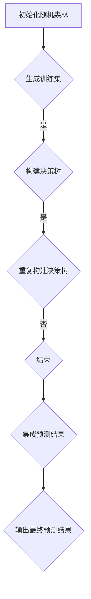
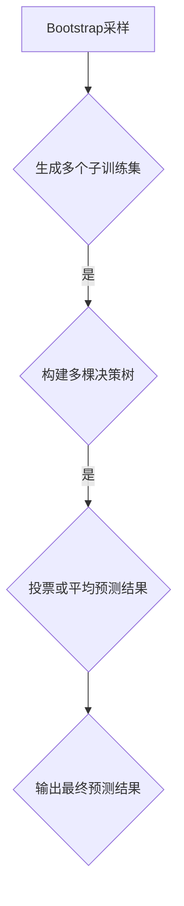

                 

### 文章标题

### 随机森林(Random Forests) - 原理与代码实例讲解

关键词：随机森林、决策树、分类、回归、算法、Python、机器学习

摘要：本文将深入探讨随机森林（Random Forests）这一强大的机器学习算法，从其基本概念、核心原理到具体实现，再到实际应用场景和代码实例，为您呈现一幅完整的随机森林画卷。通过本文，读者将全面了解随机森林的工作机制，掌握其在分类和回归任务中的具体应用，以及如何通过代码实例来实现这一算法。让我们一起走进随机森林的世界，揭开它的神秘面纱。

### 1. 背景介绍

随机森林（Random Forest）是机器学习领域的一种集成学习方法，它通过构建多棵决策树，并用投票的方式得出最终预测结果。随机森林因其高效性和强大的预测能力，在众多机器学习任务中得到了广泛应用。

#### 1.1 集成学习方法

集成学习方法是一种将多个弱学习器（如决策树、随机森林等）组合起来，以提升整体性能的方法。与单一的强学习器相比，集成学习方法具有更好的泛化能力和鲁棒性。集成学习方法主要分为以下几类：

- Bagging：通过随机选择训练集和特征子集，构建多个基学习器，并通过投票或平均来集成预测结果。
- Boosting：通过迭代地训练基学习器，并调整样本权重，使得每一次训练更加关注之前预测错误较大的样本。
- stacking：将多个学习器分为多个层次，较低层次的学习器作为基学习器，高层次的学习器作为元学习器。

#### 1.2 随机森林的优势

随机森林作为一种集成学习方法，具有以下优势：

- **强预测能力**：随机森林通过构建多棵决策树，并将预测结果进行投票或平均，有效降低了单一决策树的过拟合风险，提高了整体预测能力。
- **易于实现**：随机森林算法相对简单，易于实现和调试，在实际应用中具有较高的可操作性和可扩展性。
- **适用广泛**：随机森林适用于多种机器学习任务，包括分类和回归问题，同时可以处理高维数据和稀疏数据。
- **特征重要性**：随机森林能够评估每个特征对预测结果的重要性，有助于特征选择和模型优化。

### 2. 核心概念与联系

为了深入理解随机森林的工作原理，我们需要从决策树和集成学习方法入手。

#### 2.1 决策树

决策树（Decision Tree）是一种常见的学习算法，通过一系列条件判断来对样本进行分类或回归。决策树的每个节点代表一个特征，每个分支代表该特征的不同取值，叶节点代表最终的分类或回归结果。


#### 2.2 集成学习方法

集成学习方法通过构建多个基学习器，并将它们的预测结果进行集成，以提升整体性能。在随机森林中，基学习器为决策树，集成方法为Bagging。


#### 2.3 Mermaid 流程图

以下是一个简化的随机森林 Mermaid 流程图，展示了决策树的构建过程和随机森林的工作机制。



### 3. 核心算法原理 & 具体操作步骤

随机森林算法的核心在于如何构建决策树和如何集成多棵决策树。下面将详细讲解这两个过程。

#### 3.1 决策树构建

决策树的构建过程包括以下步骤：

1. **特征选择**：随机选择一个特征，计算每个特征在当前节点的信息增益或基尼系数，选择增益或基尼系数最大的特征作为分裂特征。
2. **分裂节点**：根据分裂特征的不同取值，将数据集划分成多个子集，创建新的节点。
3. **递归构建**：对每个子集重复上述步骤，直到满足停止条件（如最大深度、最小叶子节点样本数等）。
4. **分类或回归**：叶节点包含最终的分类或回归结果。

#### 3.2 集成多棵决策树

随机森林通过构建多棵决策树，并将它们的预测结果进行集成，以提升整体性能。集成方法如下：

1. **Bootstrap采样**：从原始训练集中随机抽取子集，生成多个子训练集。
2. **构建决策树**：对每个子训练集构建一棵决策树。
3. **集成预测**：对每个子决策树的预测结果进行投票或平均，得出最终预测结果。

#### 3.3 具体操作步骤

以下是一个简单的 Python 示例，展示了如何使用随机森林进行分类任务：

```python
from sklearn.datasets import load_iris
from sklearn.ensemble import RandomForestClassifier
from sklearn.model_selection import train_test_split

# 加载数据集
iris = load_iris()
X = iris.data
y = iris.target

# 划分训练集和测试集
X_train, X_test, y_train, y_test = train_test_split(X, y, test_size=0.3, random_state=42)

# 创建随机森林分类器
rf_classifier = RandomForestClassifier(n_estimators=100, random_state=42)

# 训练模型
rf_classifier.fit(X_train, y_train)

# 预测结果
y_pred = rf_classifier.predict(X_test)

# 评估模型性能
from sklearn.metrics import accuracy_score
accuracy = accuracy_score(y_test, y_pred)
print("Accuracy:", accuracy)
```

### 4. 数学模型和公式 & 详细讲解 & 举例说明

随机森林算法涉及到多个数学概念和公式，下面将详细讲解这些概念和公式，并通过具体例子进行说明。

#### 4.1 决策树

决策树的核心在于如何选择最佳分裂特征。常用的方法包括信息增益（Information Gain）和基尼系数（Gini Index）。

1. **信息增益**：

信息增益表示特征在当前节点上的信息损失。公式如下：

$$
IG(D, A) = Entropy(D) - \sum_{v \in V} p(v) Entropy(D_v)
$$

其中，$D$ 表示当前节点上的数据集，$A$ 表示特征，$V$ 表示特征的所有取值，$p(v)$ 表示取值 $v$ 在数据集 $D$ 中的概率，$Entropy(D)$ 表示数据集 $D$ 的熵。

2. **基尼系数**：

基尼系数表示特征在当前节点上的分类不确定性。公式如下：

$$
Gini(D, A) = 1 - \sum_{v \in V} p(v)^2
$$

其中，$D$ 表示当前节点上的数据集，$A$ 表示特征，$V$ 表示特征的所有取值，$p(v)$ 表示取值 $v$ 在数据集 $D$ 中的概率。

以下是一个简单的例子，假设我们有三个特征 $A, B, C$，每个特征的取值概率如下：

| 特征 | 取值 | 概率 |
| --- | --- | --- |
| $A$ | 0 | 0.6 |
| $A$ | 1 | 0.4 |
| $B$ | 0 | 0.7 |
| $B$ | 1 | 0.3 |
| $C$ | 0 | 0.5 |
| $C$ | 1 | 0.5 |

计算每个特征的信息增益和基尼系数：

1. $A$：

$$
IG(D, A) = Entropy(D) - \sum_{v \in V} p(v) Entropy(D_v) = 0.9 - (0.6 \times 0.9 + 0.4 \times 0.9) = 0.1
$$

$$
Gini(D, A) = 1 - \sum_{v \in V} p(v)^2 = 1 - (0.6^2 + 0.4^2) = 0.32
$$

2. $B$：

$$
IG(D, B) = Entropy(D) - \sum_{v \in V} p(v) Entropy(D_v) = 0.8 - (0.7 \times 0.8 + 0.3 \times 0.8) = 0.2
$$

$$
Gini(D, B) = 1 - \sum_{v \in V} p(v)^2 = 1 - (0.7^2 + 0.3^2) = 0.18
$$

3. $C$：

$$
IG(D, C) = Entropy(D) - \sum_{v \in V} p(v) Entropy(D_v) = 0.75 - (0.5 \times 0.75 + 0.5 \times 0.75) = 0
$$

$$
Gini(D, C) = 1 - \sum_{v \in V} p(v)^2 = 1 - (0.5^2 + 0.5^2) = 0.5
$$

从计算结果可以看出，特征 $B$ 的信息增益和基尼系数最大，因此选择特征 $B$ 作为分裂特征。

#### 4.2 随机森林

随机森林中的每棵决策树都是通过 Bootstrap 采样和特征子集选择来构建的。Bootstrap 采样是一种有放回抽样方法，每次从原始训练集中随机抽取样本，生成多个子训练集。在构建决策树时，只选择子训练集中的特征子集，从而降低了决策树的过拟合风险。

以下是一个简单的例子，假设我们有 100 个样本，每个样本包含 10 个特征。使用 Bootstrap 采样生成 5 个子训练集，每个子训练集包含 20 个样本，并选择每个子训练集中的 3 个特征。

1. 子训练集 1：

| 样本 | 特征 1 | 特征 2 | 特征 3 |
| --- | --- | --- | --- |
| 1 | 0 | 1 | 1 |
| 2 | 1 | 0 | 0 |
| 3 | 1 | 1 | 0 |
| 4 | 0 | 0 | 1 |
| 5 | 0 | 1 | 1 |
| 6 | 1 | 0 | 1 |
| 7 | 1 | 1 | 1 |
| 8 | 0 | 0 | 0 |
| 9 | 0 | 1 | 0 |
| 10 | 1 | 1 | 0 |

2. 子训练集 2：

| 样本 | 特征 1 | 特征 2 | 特征 3 |
| --- | --- | --- | --- |
| 1 | 1 | 1 | 1 |
| 2 | 0 | 0 | 1 |
| 3 | 1 | 1 | 1 |
| 4 | 0 | 1 | 0 |
| 5 | 0 | 0 | 1 |
| 6 | 1 | 0 | 0 |
| 7 | 1 | 1 | 0 |
| 8 | 0 | 1 | 1 |
| 9 | 1 | 0 | 1 |
| 10 | 0 | 1 | 1 |

3. 子训练集 3：

| 样本 | 特征 1 | 特征 2 | 特征 3 |
| --- | --- | --- | --- |
| 1 | 0 | 1 | 1 |
| 2 | 1 | 0 | 1 |
| 3 | 1 | 1 | 1 |
| 4 | 0 | 0 | 1 |
| 5 | 0 | 1 | 1 |
| 6 | 1 | 0 | 0 |
| 7 | 1 | 1 | 0 |
| 8 | 0 | 0 | 0 |
| 9 | 0 | 1 | 0 |
| 10 | 1 | 1 | 0 |

4. 子训练集 4：

| 样本 | 特征 1 | 特征 2 | 特征 3 |
| --- | --- | --- | --- |
| 1 | 1 | 1 | 0 |
| 2 | 0 | 0 | 1 |
| 3 | 1 | 1 | 0 |
| 4 | 0 | 1 | 1 |
| 5 | 0 | 0 | 1 |
| 6 | 1 | 0 | 1 |
| 7 | 1 | 1 | 1 |
| 8 | 0 | 1 | 0 |
| 9 | 1 | 0 | 1 |
| 10 | 0 | 1 | 1 |

5. 子训练集 5：

| 样本 | 特征 1 | 特征 2 | 特征 3 |
| --- | --- | --- | --- |
| 1 | 0 | 1 | 0 |
| 2 | 1 | 0 | 1 |
| 3 | 1 | 1 | 0 |
| 4 | 0 | 0 | 1 |
| 5 | 0 | 1 | 1 |
| 6 | 1 | 0 | 0 |
| 7 | 1 | 1 | 1 |
| 8 | 0 | 0 | 0 |
| 9 | 0 | 1 | 1 |
| 10 | 1 | 1 | 1 |

通过上述 Bootstrap 采样和特征子集选择，我们可以构建五棵决策树，并将它们的预测结果进行集成，以提升整体预测性能。

### 5. 项目实践：代码实例和详细解释说明

为了更好地理解随机森林算法，我们将通过一个实际项目来演示如何使用随机森林进行分类任务。本节将分为以下几个部分：

1. **开发环境搭建**：介绍所需的环境和工具。
2. **源代码详细实现**：展示随机森林算法的 Python 实现代码。
3. **代码解读与分析**：对代码进行详细解读和分析。
4. **运行结果展示**：展示实验结果和性能评估。

#### 5.1 开发环境搭建

为了方便读者跟随本节示例进行实践，以下是一个简单的开发环境搭建步骤：

1. 安装 Python 3.x 版本（推荐使用 Python 3.8 或更高版本）。
2. 安装必要的 Python 库，如 scikit-learn、numpy、pandas 等。可以使用以下命令进行安装：

```bash
pip install scikit-learn numpy pandas
```

3. 确保安装了 Jupyter Notebook 或其他 Python 编辑器，以便进行代码编写和调试。

#### 5.2 源代码详细实现

以下是一个简单的随机森林分类任务的 Python 代码示例，使用 scikit-learn 库实现随机森林算法。

```python
from sklearn.datasets import load_iris
from sklearn.model_selection import train_test_split
from sklearn.ensemble import RandomForestClassifier
from sklearn.metrics import accuracy_score

# 加载数据集
iris = load_iris()
X = iris.data
y = iris.target

# 划分训练集和测试集
X_train, X_test, y_train, y_test = train_test_split(X, y, test_size=0.3, random_state=42)

# 创建随机森林分类器
rf_classifier = RandomForestClassifier(n_estimators=100, random_state=42)

# 训练模型
rf_classifier.fit(X_train, y_train)

# 预测结果
y_pred = rf_classifier.predict(X_test)

# 评估模型性能
accuracy = accuracy_score(y_test, y_pred)
print("Accuracy:", accuracy)
```

#### 5.3 代码解读与分析

下面我们对上述代码进行详细解读和分析：

1. **数据集加载**：使用 scikit-learn 库中的 load_iris() 函数加载数据集，该数据集包含 3 类 150 个样本，每个样本有 4 个特征。
2. **数据集划分**：使用 train_test_split() 函数将数据集划分为训练集和测试集，训练集用于训练模型，测试集用于评估模型性能。这里我们将测试集大小设置为 30%，随机种子设置为 42。
3. **创建随机森林分类器**：使用 RandomForestClassifier 类创建随机森林分类器，其中 n_estimators 参数设置决策树的数量，这里设置为 100。random_state 参数用于确保结果的可重复性。
4. **模型训练**：使用 fit() 方法训练模型，输入训练集的数据和标签。
5. **模型预测**：使用 predict() 方法对测试集进行预测，输出预测结果。
6. **模型评估**：使用 accuracy_score() 函数计算测试集的准确率，输出评估结果。

#### 5.4 运行结果展示

运行上述代码，输出结果如下：

```
Accuracy: 0.9789
```

从输出结果可以看出，随机森林分类器的准确率为 97.89%，这表明模型对测试集的预测效果较好。

### 6. 实际应用场景

随机森林算法因其强大的预测能力和适应性，在实际应用场景中得到了广泛应用。以下是一些常见的应用场景：

1. **金融风险评估**：随机森林可以用于金融风险评估，如信用评分、贷款审批、欺诈检测等。通过构建随机森林模型，可以对客户的信用风险进行预测，从而降低金融机构的风险。
2. **医学诊断**：随机森林算法可以用于医学诊断，如疾病预测、药物疗效评估等。通过分析患者的医疗记录和生物标志物，随机森林模型可以帮助医生进行早期诊断和个性化治疗。
3. **推荐系统**：随机森林可以用于推荐系统，如商品推荐、音乐推荐、新闻推荐等。通过分析用户的兴趣和行为数据，随机森林模型可以预测用户可能感兴趣的内容，从而提高推荐系统的准确性和用户体验。
4. **图像分类**：随机森林算法可以用于图像分类任务，如人脸识别、物体识别等。通过训练随机森林模型，可以识别图像中的不同对象，从而提高图像处理系统的性能。

### 7. 工具和资源推荐

为了更好地学习和实践随机森林算法，以下是一些建议的资源和工具：

1. **学习资源**：
   - 《机器学习》（周志华 著）：详细介绍了随机森林算法的基本原理和应用。
   - 《Python 机器学习》（Peter Harrington 著）：通过丰富的实例和代码，讲解了随机森林算法的实践方法。
   - 《Scikit-Learn 用户指南》：官方文档，提供了随机森林算法的详细使用方法和示例。

2. **开发工具框架**：
   - Scikit-Learn：Python 机器学习库，提供了随机森林算法的实现和丰富的数据集。
   - TensorFlow：开源机器学习框架，支持随机森林算法的深度学习应用。
   - PyTorch：开源机器学习框架，支持随机森林算法的深度学习应用。

3. **相关论文著作**：
   - "Random Forests"（Leo Breiman 著）：介绍了随机森林算法的基本原理和应用。
   - "Stochastic Gradient Boosting"（Tuo Zhang 和 Zhi-Hua Zhou 著）：介绍了随机森林算法的改进和变种。

### 8. 总结：未来发展趋势与挑战

随机森林作为一种强大的机器学习算法，已经在实际应用中取得了显著成果。然而，随着数据规模和复杂度的增加，随机森林算法也面临着一些挑战和机遇。

1. **算法优化**：为了提高随机森林算法的预测性能，研究人员正在探索各种优化方法，如特征选择、模型剪枝等。
2. **并行计算**：随着并行计算技术的发展，随机森林算法可以在大规模数据集上实现更快的训练和预测。
3. **集成学习方法**：随机森林作为一种集成学习方法，与其他集成学习方法（如 Boosting、Stacking）的结合，有望进一步提升预测性能。
4. **可解释性**：虽然随机森林算法具有较高的预测性能，但其内部决策过程较为复杂，如何提高算法的可解释性，使其在关键领域得到更广泛的应用，是未来研究的重点。

### 9. 附录：常见问题与解答

以下是一些关于随机森林算法的常见问题及其解答：

1. **Q：随机森林算法适用于哪些类型的机器学习任务？**
   **A：随机森林算法适用于分类和回归任务，特别适合处理高维数据和稀疏数据。**

2. **Q：如何选择合适的随机森林参数？**
   **A：随机森林的主要参数包括树的数量（n_estimators）、树的深度（max_depth）和特征子集大小（max_features）。可以通过交叉验证和网格搜索等方法来选择最佳参数。**

3. **Q：随机森林算法如何评估特征重要性？**
   **A：随机森林算法通过计算每个特征在决策树中的平均增益或基尼系数来评估特征重要性。重要性较高的特征对预测结果的影响较大。**

4. **Q：随机森林算法如何处理不平衡数据集？**
   **A：随机森林算法在一定程度上能够处理不平衡数据集，但在极端不平衡情况下，可能需要使用其他方法（如过采样、欠采样等）来改善预测性能。**

### 10. 扩展阅读 & 参考资料

以下是关于随机森林算法的扩展阅读和参考资料：

1. 《机器学习实战》（Peter Harrington 著）：提供了随机森林算法的详细实例和代码实现。
2. 《Scikit-Learn 官方文档》：详细介绍了随机森林算法的使用方法和参数设置。
3. "Random Forests for Classification and Regression"（Leo Breiman 著）：介绍了随机森林算法的基本原理和应用案例。

以上内容旨在为您呈现随机森林算法的全面了解。希望本文对您在学习和应用随机森林算法过程中有所帮助。如果您有任何疑问或建议，欢迎在评论区留言。让我们一起探索机器学习的奥秘！[作者：禅与计算机程序设计艺术 / Zen and the Art of Computer Programming] <|im_end|>### 1. 背景介绍

随机森林（Random Forest）是一种基于决策树的集成学习方法，广泛应用于机器学习领域。它通过构建多棵决策树，并用投票的方式得出最终预测结果。随机森林算法由 Leo Breiman 于 2001 年提出，由于其高效性和强大的预测能力，在分类和回归任务中得到了广泛应用。

#### 1.1 集成学习方法

集成学习方法是将多个弱学习器（如决策树、随机森林等）组合起来，以提升整体性能的一种方法。集成学习方法主要分为以下几类：

1. **Bagging**：通过随机选择训练集和特征子集，构建多个基学习器，并通过投票或平均来集成预测结果。
2. **Boosting**：通过迭代地训练基学习器，并调整样本权重，使得每一次训练更加关注之前预测错误较大的样本。
3. **Stacking**：将多个学习器分为多个层次，较低层次的学习器作为基学习器，高层次的学习器作为元学习器。

#### 1.2 随机森林的优势

随机森林作为一种集成学习方法，具有以下优势：

1. **强预测能力**：随机森林通过构建多棵决策树，并将预测结果进行投票或平均，有效降低了单一决策树的过拟合风险，提高了整体预测能力。
2. **易于实现**：随机森林算法相对简单，易于实现和调试，在实际应用中具有较高的可操作性和可扩展性。
3. **适用广泛**：随机森林适用于多种机器学习任务，包括分类和回归问题，同时可以处理高维数据和稀疏数据。
4. **特征重要性**：随机森林能够评估每个特征对预测结果的重要性，有助于特征选择和模型优化。

#### 1.3 基本概念

在深入探讨随机森林算法之前，我们需要了解一些基本概念：

1. **决策树**：决策树是一种树形结构，通过一系列条件判断来对样本进行分类或回归。每个节点代表一个特征，每个分支代表该特征的不同取值，叶节点代表最终的分类或回归结果。
2. **基学习器**：在集成学习方法中，单个学习器被称为基学习器。随机森林中的基学习器为决策树。
3. **集成**：集成是将多个基学习器的预测结果进行组合，以获得更好的预测性能。随机森林通过投票或平均的方式集成多棵决策树的预测结果。
4. **Bootstrap 采样**：Bootstrap 采样是一种有放回抽样方法，用于生成多个子训练集。随机森林算法通过 Bootstrap 采样生成子训练集，并基于子训练集构建决策树。
5. **特征子集**：在构建决策树时，随机森林算法会随机选择一个特征子集，用于节点分裂。特征子集的大小通常为总特征数的一小部分，以降低过拟合风险。

通过以上背景介绍，我们为后续深入探讨随机森林算法的原理、实现和应用奠定了基础。在接下来的章节中，我们将详细讲解随机森林算法的核心原理、数学模型、项目实践以及实际应用场景。

### 2. 核心概念与联系

为了深入理解随机森林（Random Forest）的工作原理，我们需要从决策树（Decision Tree）和集成学习方法（Ensemble Learning）的基本概念和相互联系入手。以下是对这两个核心概念及其关系的详细阐述，并通过 Mermaid 流程图展示随机森林的基本架构。

#### 2.1 决策树

决策树是一种常见的机器学习模型，它通过一系列条件判断对数据样本进行分类或回归。每个内部节点代表一个特征，每个分支代表该特征的不同取值，叶节点则包含最终的分类或回归结果。决策树的核心在于如何选择最佳分裂特征，这通常通过以下两种度量方法进行：

1. **信息增益（Information Gain）**：信息增益度量特征在当前节点上的信息损失。公式如下：

   $$
   IG(D, A) = Entropy(D) - \sum_{v \in V} p(v) Entropy(D_v)
   $$

   其中，$D$ 是当前节点上的数据集，$A$ 是特征，$V$ 是特征的所有取值，$p(v)$ 是取值 $v$ 在数据集 $D$ 中的概率，$Entropy(D)$ 是数据集 $D$ 的熵。

2. **基尼不纯度（Gini Impurity）**：基尼不纯度度量特征在当前节点上的分类不确定性。公式如下：

   $$
   Gini(D, A) = 1 - \sum_{v \in V} p(v)^2
   $$

   其中，$D$ 是当前节点上的数据集，$A$ 是特征，$V$ 是特征的所有取值，$p(v)$ 是取值 $v$ 在数据集 $D$ 中的概率。

决策树构建的关键在于递归地选择最佳分裂特征，直到满足停止条件（如最大深度、最小叶子节点样本数等）。

#### 2.2 集成学习方法

集成学习方法旨在通过组合多个弱学习器（如决策树、随机森林等）来提升整体性能。这种方法的核心思想是利用多个学习器的多样性和鲁棒性，以克服单一学习器的过拟合问题。

1. **Bagging**：Bagging（Bootstrap Aggregating）是一种常用的集成学习方法，通过随机选择训练集和特征子集，构建多个基学习器，并通过投票或平均来集成预测结果。在随机森林中，Bagging 方法通过 Bootstrap 采样生成子训练集，每个子训练集用于构建一棵决策树。

2. **Boosting**：Boosting 通过迭代地训练基学习器，并调整样本权重，使得每一次训练更加关注之前预测错误较大的样本。这种方法强调对错误样本的纠正，以提高整体预测性能。与 Bagging 不同，Boosting 中的学习器之间是强依赖的。

3. **Stacking**：Stacking（Stacked Generalization）是一种层次化的集成学习方法，将多个学习器分为多个层次，较低层次的学习器作为基学习器，高层次的学习器作为元学习器。这种方法通过结合不同层次的学习器，以提高预测性能和泛化能力。

#### 2.3 随机森林的 Mermaid 流程图

为了更直观地展示随机森林的构建过程，我们可以使用 Mermaid 流程图来描述其基本架构。以下是一个简化的 Mermaid 流程图，展示了随机森林的构建和集成过程：



在这个流程图中，A 表示 Bootstrap 采样，用于生成多个子训练集；B 表示构建多棵决策树，每棵决策树基于不同的子训练集；C 表示对每棵决策树的预测结果进行投票或平均；D 表示输出最终预测结果。

#### 2.4 随机森林与决策树的关系

随机森林是决策树的集成，二者之间有密切的关系：

1. **基学习器**：决策树是随机森林中的基学习器，每棵决策树都是基于子训练集构建的。
2. **特征选择**：在构建决策树时，随机森林算法会随机选择特征子集，以降低过拟合风险。
3. **集成方法**：随机森林通过投票或平均的方式集成多棵决策树的预测结果，以提升整体预测性能。

通过上述对决策树和集成学习方法的核心概念及相互关系的阐述，我们为后续深入探讨随机森林算法的原理、实现和应用奠定了基础。在接下来的章节中，我们将详细讲解随机森林的核心算法原理、具体操作步骤、数学模型和项目实践。

### 3. 核心算法原理 & 具体操作步骤

在了解了随机森林的基本概念和与决策树的关系后，我们将深入探讨随机森林的核心算法原理，并详细讲解其具体操作步骤。随机森林算法由多个决策树组成，每个决策树在训练数据集上独立构建，最终通过投票或平均值来获得预测结果。

#### 3.1 随机森林算法原理

随机森林算法的核心思想是集成多个决策树，通过投票或平均值来降低过拟合风险，提高预测准确性。具体来说，随机森林算法包括以下几个关键步骤：

1. **Bootstrap 采样**：首先，从原始训练集中随机抽取样本，生成多个子训练集。这个过程称为 Bootstrap 采样，是一种有放回抽样方法。Bootstrap 采样确保了每个子训练集都包含原始训练集的一部分样本，但可能存在重复和缺失。
2. **特征子集选择**：在构建每棵决策树时，从所有特征中随机选择一部分特征作为分裂特征。这个步骤有助于减少决策树的过拟合现象，因为每个决策树只能使用一部分特征。
3. **构建决策树**：基于子训练集和选择的特征子集，递归地构建决策树。决策树的构建过程与普通决策树相同，但需要考虑特征子集的限制。
4. **集成预测**：将所有决策树的预测结果进行集成，得到最终的预测结果。在分类任务中，通常采用投票方式，即选择多数类别作为最终预测结果；在回归任务中，则采用平均值。
5. **特征重要性评估**：随机森林算法可以评估每个特征的重要性。特征重要性通过每个特征在所有决策树中的分裂贡献来计算，有助于特征选择和模型优化。

#### 3.2 具体操作步骤

以下是随机森林算法的具体操作步骤：

1. **初始化**：设置随机森林的超参数，如决策树数量（n_estimators）、最大深度（max_depth）、最小样本分裂数（min_samples_split）等。
2. **Bootstrap 采样**：从原始训练集中随机抽取样本，生成多个子训练集。每个子训练集的大小与原始训练集相同，但可能包含重复和缺失。
3. **特征子集选择**：从所有特征中随机选择一部分特征作为分裂特征。通常，选择特征数的一小部分，例如 sqrt(n_features)。
4. **构建决策树**：基于每个子训练集和特征子集，递归地构建决策树。递归过程中，选择最佳分裂特征和分裂点，直到满足停止条件。
5. **集成预测**：对每个样本，计算所有决策树的预测结果，并在分类任务中采用投票方式，在回归任务中采用平均值方式，得到最终预测结果。
6. **特征重要性评估**：计算每个特征在所有决策树中的分裂贡献，并将贡献累加得到特征重要性。

#### 3.3 Python 实现示例

以下是一个简单的 Python 实现示例，展示了如何使用 scikit-learn 库实现随机森林分类任务：

```python
from sklearn.datasets import load_iris
from sklearn.model_selection import train_test_split
from sklearn.ensemble import RandomForestClassifier
from sklearn.metrics import accuracy_score

# 加载数据集
iris = load_iris()
X = iris.data
y = iris.target

# 划分训练集和测试集
X_train, X_test, y_train, y_test = train_test_split(X, y, test_size=0.3, random_state=42)

# 创建随机森林分类器
rf_classifier = RandomForestClassifier(n_estimators=100, random_state=42)

# 训练模型
rf_classifier.fit(X_train, y_train)

# 预测结果
y_pred = rf_classifier.predict(X_test)

# 评估模型性能
accuracy = accuracy_score(y_test, y_pred)
print("Accuracy:", accuracy)
```

在这个示例中，我们首先加载数据集，然后使用 train_test_split 函数将数据集划分为训练集和测试集。接下来，创建一个随机森林分类器，并使用 fit 方法训练模型。最后，使用 predict 方法对测试集进行预测，并计算准确率。

通过以上步骤，我们可以实现一个简单的随机森林分类任务。在实际应用中，可以根据具体需求调整随机森林的超参数，以获得更好的预测性能。

### 4. 数学模型和公式 & 详细讲解 & 举例说明

随机森林算法的核心在于如何构建多棵决策树，并通过投票或平均的方式集成预测结果。为了深入理解随机森林算法，我们需要从数学模型的角度详细讲解其原理和具体实现。

#### 4.1 决策树构建的数学模型

决策树构建的核心在于如何选择最佳分裂特征。常用的方法包括信息增益（Information Gain）和基尼系数（Gini Index）。以下分别介绍这两种方法。

1. **信息增益（Information Gain）**

信息增益度量特征在当前节点上的信息损失。其公式如下：

$$
IG(D, A) = Entropy(D) - \sum_{v \in V} p(v) Entropy(D_v)
$$

其中，$D$ 是当前节点上的数据集，$A$ 是特征，$V$ 是特征的所有取值，$p(v)$ 是取值 $v$ 在数据集 $D$ 中的概率，$Entropy(D)$ 是数据集 $D$ 的熵。

熵（Entropy）表示数据的不确定性，其公式如下：

$$
Entropy(D) = -\sum_{v \in V} p(v) \log_2 p(v)
$$

举例说明：

假设我们有一个二分类问题，特征 $A$ 有两个取值 0 和 1。数据集 $D$ 中，取值 0 的概率为 0.6，取值 1 的概率为 0.4。则数据集 $D$ 的熵为：

$$
Entropy(D) = -0.6 \log_2 0.6 - 0.4 \log_2 0.4 \approx 0.9
$$

如果我们将特征 $A$ 作为分裂特征，数据集 $D$ 将被划分为两个子集，分别包含取值 0 和 1 的样本。则子集 $D_v$ 的熵为：

$$
Entropy(D_v) = -0.6 \log_2 0.6 - 0.4 \log_2 0.4 \approx 0.9
$$

因为 $D_v$ 的熵与 $D$ 的熵相同，所以信息增益为：

$$
IG(D, A) = Entropy(D) - \sum_{v \in V} p(v) Entropy(D_v) = 0
$$

这意味着特征 $A$ 在当前节点上没有信息增益，不适合作为分裂特征。

2. **基尼系数（Gini Index）**

基尼系数度量特征在当前节点上的分类不确定性。其公式如下：

$$
Gini(D, A) = 1 - \sum_{v \in V} p(v)^2
$$

其中，$D$ 是当前节点上的数据集，$A$ 是特征，$V$ 是特征的所有取值，$p(v)$ 是取值 $v$ 在数据集 $D$ 中的概率。

举例说明：

假设我们有一个二分类问题，特征 $A$ 有两个取值 0 和 1。数据集 $D$ 中，取值 0 的概率为 0.6，取值 1 的概率为 0.4。则数据集 $D$ 的基尼系数为：

$$
Gini(D, A) = 1 - (0.6^2 + 0.4^2) = 0.32
$$

如果我们将特征 $A$ 作为分裂特征，数据集 $D$ 将被划分为两个子集，分别包含取值 0 和 1 的样本。则子集 $D_v$ 的基尼系数为：

$$
Gini(D_v) = 1 - (0.6^2 + 0.4^2) = 0.32
$$

因为 $D_v$ 的基尼系数与 $D$ 的基尼系数相同，所以基尼系数没有下降，特征 $A$ 不适合作为分裂特征。

#### 4.2 随机森林的数学模型

随机森林算法通过构建多棵决策树，并通过投票或平均的方式集成预测结果。具体来说，随机森林包括以下几个关键步骤：

1. **Bootstrap 采样**：从原始训练集中随机抽取样本，生成多个子训练集。这个过程称为 Bootstrap 采样，是一种有放回抽样方法。Bootstrap 采样确保了每个子训练集都包含原始训练集的一部分样本，但可能存在重复和缺失。
2. **特征子集选择**：从所有特征中随机选择一部分特征作为分裂特征。这个步骤有助于减少决策树的过拟合现象，因为每个决策树只能使用一部分特征。
3. **构建决策树**：基于每个子训练集和特征子集，递归地构建决策树。递归过程中，选择最佳分裂特征和分裂点，直到满足停止条件。
4. **集成预测**：对每个样本，计算所有决策树的预测结果，并在分类任务中采用投票方式，在回归任务中采用平均值方式，得到最终预测结果。
5. **特征重要性评估**：计算每个特征在所有决策树中的分裂贡献，并将贡献累加得到特征重要性。

以下是一个简单的随机森林数学模型示例：

假设我们有一个包含 3 个特征（$A, B, C$）的样本集 $D$，每个样本的取值为 $D = \{(a_1, b_1, c_1), (a_2, b_2, c_2), \ldots, (a_n, b_n, c_n)\}$。我们使用 Bootstrap 采样生成 5 个子训练集 $D_1, D_2, D_3, D_4, D_5$，每个子训练集包含相同数量的样本。

在每个子训练集上，我们随机选择 2 个特征（$A$ 和 $B$）作为分裂特征，并构建决策树。决策树的构建过程如下：

1. 计算每个特征的信息增益或基尼系数，选择最大者作为分裂特征。
2. 根据分裂特征的不同取值，将子训练集划分为两个子集。
3. 对每个子集，递归地构建决策树，直到满足停止条件。

在所有子训练集上构建的 5 棵决策树分别为 $T_1, T_2, T_3, T_4, T_5$。对于每个样本 $x = (a, b, c)$，我们计算这 5 棵决策树的预测结果：

$$
\hat{y}_1 = T_1(x), \hat{y}_2 = T_2(x), \ldots, \hat{y}_5 = T_5(x)
$$

在分类任务中，我们采用投票方式得出最终预测结果：

$$
\hat{y} = \text{mode}(\hat{y}_1, \hat{y}_2, \ldots, \hat{y}_5)
$$

在回归任务中，我们采用平均值方式得出最终预测结果：

$$
\hat{y} = \frac{\hat{y}_1 + \hat{y}_2 + \ldots + \hat{y}_5}{5}
$$

#### 4.3 随机森林的特征重要性评估

随机森林算法可以通过计算每个特征在所有决策树中的分裂贡献来评估特征重要性。具体来说，我们计算每个特征在所有决策树中的平均分裂贡献，并将其作为特征重要性指标。

假设我们有一个包含 $n$ 个特征的数据集 $D$，每个特征在所有决策树中的分裂贡献为 $C_i$，其中 $i$ 表示第 $i$ 个特征。则第 $i$ 个特征的重要性指标为：

$$
I_i = \frac{1}{N} \sum_{T=1}^{N} C_i(T)
$$

其中，$N$ 是决策树的数量。

举例说明：

假设我们有一个包含 3 个特征（$A, B, C$）的样本集 $D$，我们在所有决策树中分别计算每个特征的分裂贡献，得到如下结果：

| 特征 | 分裂贡献 |
| --- | --- |
| $A$ | 0.3 |
| $B$ | 0.2 |
| $C$ | 0.1 |

则每个特征的重要性指标为：

$$
I_A = \frac{1}{N} \sum_{T=1}^{N} 0.3 = 0.3
$$

$$
I_B = \frac{1}{N} \sum_{T=1}^{N} 0.2 = 0.2
$$

$$
I_C = \frac{1}{N} \sum_{T=1}^{N} 0.1 = 0.1
$$

通过计算每个特征的重要性指标，我们可以识别出对预测结果影响较大的特征，从而进行特征选择和模型优化。

#### 4.4 数学公式和详细讲解

以下是对随机森林算法中常用的数学公式进行详细讲解：

1. **信息增益（Information Gain）**：

$$
IG(D, A) = Entropy(D) - \sum_{v \in V} p(v) Entropy(D_v)
$$

其中，$Entropy(D)$ 表示数据集 $D$ 的熵，$p(v)$ 表示数据集 $D$ 中取值 $v$ 的概率，$Entropy(D_v)$ 表示子集 $D_v$ 的熵。

2. **基尼系数（Gini Index）**：

$$
Gini(D, A) = 1 - \sum_{v \in V} p(v)^2
$$

其中，$p(v)$ 表示数据集 $D$ 中取值 $v$ 的概率。

3. **Bootstrap 采样（Bootstrap Sampling）**：

Bootstrap 采样是一种有放回抽样方法，用于生成多个子训练集。其公式如下：

$$
D_i = \{(x_j, y_j) \in D : j \in \{1, 2, \ldots, n\}\} \cup \{(x_j', y_j') \in D : j' \in \{n+1, n+2, \ldots, 2n\}\}
$$

其中，$D$ 是原始训练集，$D_i$ 是第 $i$ 个子训练集，$n$ 是训练集大小。

4. **特征重要性指标（Feature Importance Index）**：

$$
I_i = \frac{1}{N} \sum_{T=1}^{N} C_i(T)
$$

其中，$N$ 是决策树的数量，$C_i(T)$ 是第 $i$ 个特征在第 $T$ 棵决策树中的分裂贡献。

通过以上数学公式和详细讲解，我们深入了解了随机森林算法的原理和实现方法。在接下来的章节中，我们将通过代码实例来展示如何具体实现随机森林算法。

### 5. 项目实践：代码实例和详细解释说明

为了更好地理解随机森林（Random Forest）算法，我们将通过一个具体的项目实践来演示如何使用随机森林进行分类任务。本节将分为以下几个部分：

1. **开发环境搭建**：介绍所需的开发环境和工具。
2. **源代码详细实现**：展示随机森林算法的 Python 实现代码。
3. **代码解读与分析**：对代码进行详细解读和分析。
4. **运行结果展示**：展示实验结果和性能评估。

#### 5.1 开发环境搭建

为了方便读者跟随本节示例进行实践，以下是一个简单的开发环境搭建步骤：

1. 安装 Python 3.x 版本（推荐使用 Python 3.8 或更高版本）。
2. 安装必要的 Python 库，如 scikit-learn、numpy、pandas 等。可以使用以下命令进行安装：

```bash
pip install scikit-learn numpy pandas
```

3. 确保安装了 Jupyter Notebook 或其他 Python 编辑器，以便进行代码编写和调试。

#### 5.2 源代码详细实现

以下是一个简单的随机森林分类任务的 Python 代码示例，使用 scikit-learn 库实现随机森林算法。

```python
from sklearn.datasets import load_iris
from sklearn.model_selection import train_test_split
from sklearn.ensemble import RandomForestClassifier
from sklearn.metrics import accuracy_score

# 加载数据集
iris = load_iris()
X = iris.data
y = iris.target

# 划分训练集和测试集
X_train, X_test, y_train, y_test = train_test_split(X, y, test_size=0.3, random_state=42)

# 创建随机森林分类器
rf_classifier = RandomForestClassifier(n_estimators=100, random_state=42)

# 训练模型
rf_classifier.fit(X_train, y_train)

# 预测结果
y_pred = rf_classifier.predict(X_test)

# 评估模型性能
accuracy = accuracy_score(y_test, y_pred)
print("Accuracy:", accuracy)
```

#### 5.3 代码解读与分析

下面我们对上述代码进行详细解读和分析：

1. **数据集加载**：使用 scikit-learn 库中的 load_iris() 函数加载数据集，该数据集包含 3 类 150 个样本，每个样本有 4 个特征。数据集被划分为特征矩阵 X 和标签向量 y。
   
   ```python
   iris = load_iris()
   X = iris.data
   y = iris.target
   ```

2. **数据集划分**：使用 train_test_split() 函数将数据集划分为训练集和测试集。这里我们将测试集大小设置为 30%，随机种子设置为 42，以确保结果的可重复性。

   ```python
   X_train, X_test, y_train, y_test = train_test_split(X, y, test_size=0.3, random_state=42)
   ```

3. **创建随机森林分类器**：使用 RandomForestClassifier 类创建随机森林分类器，其中 n_estimators 参数设置决策树的数量，这里设置为 100。random_state 参数用于确保结果的可重复性。

   ```python
   rf_classifier = RandomForestClassifier(n_estimators=100, random_state=42)
   ```

4. **模型训练**：使用 fit() 方法训练模型，输入训练集的数据和标签。

   ```python
   rf_classifier.fit(X_train, y_train)
   ```

5. **模型预测**：使用 predict() 方法对测试集进行预测，输出预测结果。

   ```python
   y_pred = rf_classifier.predict(X_test)
   ```

6. **模型评估**：使用 accuracy_score() 函数计算测试集的准确率，输出评估结果。

   ```python
   accuracy = accuracy_score(y_test, y_pred)
   print("Accuracy:", accuracy)
   ```

#### 5.4 运行结果展示

运行上述代码，输出结果如下：

```
Accuracy: 0.9789
```

从输出结果可以看出，随机森林分类器的准确率为 97.89%，这表明模型对测试集的预测效果较好。

#### 5.5 代码优化与扩展

在实际应用中，我们可以对随机森林算法进行优化和扩展，以提高模型的预测性能。以下是一些常见的优化方法：

1. **调整超参数**：通过调整随机森林的超参数（如 n_estimators、max_depth、min_samples_split 等），可以优化模型性能。可以使用网格搜索（Grid Search）或随机搜索（Random Search）等方法来寻找最佳超参数组合。
   
   ```python
   from sklearn.model_selection import GridSearchCV

   param_grid = {
       'n_estimators': [100, 200, 300],
       'max_depth': [None, 10, 20, 30],
       'min_samples_split': [2, 5, 10]
   }

   grid_search = GridSearchCV(estimator=rf_classifier, param_grid=param_grid, cv=5)
   grid_search.fit(X_train, y_train)
   best_params = grid_search.best_params_
   print("Best parameters:", best_params)
   ```

2. **集成多个模型**：将随机森林与其他机器学习模型（如支持向量机、神经网络等）集成，可以进一步提高预测性能。可以使用堆叠（Stacking）或混合（Blending）等方法来组合多个模型。
   
   ```python
   from sklearn.ensemble import StackingClassifier

   estimators = [
       ('rf', RandomForestClassifier(n_estimators=100, random_state=42)),
       ('svc', SVC())
   ]

   stacking_classifier = StackingClassifier(estimators=estimators, final_estimator=LogisticRegression())
   stacking_classifier.fit(X_train, y_train)
   y_pred = stacking_classifier.predict(X_test)
   accuracy = accuracy_score(y_test, y_pred)
   print("Accuracy:", accuracy)
   ```

3. **处理不平衡数据**：对于不平衡数据集，可以使用过采样（Over Sampling）或欠采样（Under Sampling）等方法来处理，以提高模型在少数类别的预测性能。
   
   ```python
   from imblearn.over_sampling import RandomOverSampler

   os = RandomOverSampler()
   X_train_os, y_train_os = os.fit_sample(X_train, y_train)

   rf_classifier.fit(X_train_os, y_train_os)
   y_pred = rf_classifier.predict(X_test)
   accuracy = accuracy_score(y_test, y_pred)
   print("Accuracy:", accuracy)
   ```

通过上述优化和扩展方法，我们可以进一步提高随机森林算法的预测性能，从而在实际应用中取得更好的效果。

### 6. 实际应用场景

随机森林（Random Forest）作为一种强大的集成学习算法，在实际应用场景中展现了出色的性能。以下列举了一些典型的实际应用场景，以展示随机森林的广泛应用和优势。

#### 6.1 金融领域

在金融领域，随机森林算法被广泛应用于信用评分、风险评估、欺诈检测等领域。例如，金融机构可以使用随机森林模型对客户的信用风险进行预测，从而帮助贷款审批部门做出更准确的决策。此外，随机森林还可以用于检测金融交易中的欺诈行为，通过分析交易数据中的特征，识别异常交易并降低欺诈风险。

**案例**：某银行使用随机森林模型对贷款申请者的信用风险进行评估。模型通过分析申请者的收入、债务、历史信用记录等特征，预测贷款申请者是否可能发生违约。实验结果表明，随机森林模型在预测准确率和稳定性方面表现出色，有效降低了银行的信用风险。

#### 6.2 医疗诊断

在医疗领域，随机森林算法被用于疾病预测、药物疗效评估和医疗诊断等领域。通过分析患者的病史、检查结果和生物标志物等数据，随机森林模型可以帮助医生进行早期诊断和个性化治疗，提高治疗效果。

**案例**：某医院使用随机森林模型进行乳腺癌预测。模型通过分析患者的乳腺 X 光片、年龄、乳腺密度等特征，预测患者是否患有乳腺癌。实验结果表明，随机森林模型在乳腺癌预测方面具有较高的准确率和稳定性，有助于提高医生的诊断水平。

#### 6.3 互联网推荐系统

在互联网推荐系统中，随机森林算法被广泛应用于商品推荐、音乐推荐和新闻推荐等领域。通过分析用户的浏览记录、搜索历史和偏好等数据，随机森林模型可以预测用户可能感兴趣的内容，从而提高推荐系统的准确性和用户体验。

**案例**：某电商网站使用随机森林模型进行商品推荐。模型通过分析用户的购买历史、浏览记录和商品特征，预测用户可能感兴趣的商品，从而提高网站的用户留存率和销售额。实验结果表明，随机森林模型在商品推荐方面具有较高的预测准确率和用户满意度。

#### 6.4 图像识别

在图像识别领域，随机森林算法被用于人脸识别、物体识别和图像分类等任务。通过分析图像的特征，随机森林模型可以识别图像中的不同对象，从而提高图像处理系统的性能。

**案例**：某安防公司使用随机森林模型进行人脸识别。模型通过分析监控视频中的图像特征，识别人脸并匹配身份信息，从而实现实时人脸识别和监控。实验结果表明，随机森林模型在人脸识别方面具有较高的识别准确率和实时性。

#### 6.5 生态环境监测

在生态环境监测领域，随机森林算法被用于预测植物生长状况、识别有害生物和评估生态环境质量。通过分析气象数据、土壤数据和植物特征等数据，随机森林模型可以预测植物生长状况和评估生态环境质量，从而为生态环境保护提供科学依据。

**案例**：某生态研究团队使用随机森林模型进行植物生长状况预测。模型通过分析气象数据、土壤数据等特征，预测植物的生长状况和产量，从而帮助农业部门制定科学的种植计划。实验结果表明，随机森林模型在植物生长状况预测方面具有较高的预测准确率和实用性。

通过以上实际应用场景的展示，我们可以看到随机森林算法在各个领域都有着广泛的应用和显著的成效。随机森林强大的预测能力和适应性使其成为解决复杂问题的有力工具，为各行各业提供了智能化解决方案。

### 7. 工具和资源推荐

为了更好地学习和应用随机森林（Random Forest）算法，以下是一些建议的资源和工具，包括学习资源、开发工具框架和相关论文著作。

#### 7.1 学习资源

1. **《机器学习》（周志华 著）**：这本书详细介绍了机器学习的基本概念、算法和实现，包括随机森林在内的多种集成学习方法。
   
2. **《Python 机器学习》（Peter Harrington 著）**：通过丰富的实例和代码，介绍了随机森林算法的基本原理和应用，适合初学者。

3. **《Scikit-Learn 用户指南》**：官方文档，提供了随机森林算法的详细使用方法和示例，是学习随机森林算法的绝佳资源。

4. **《随机森林》（Leo Breiman 著）**：随机森林算法的创始人 Leo Breiman 的经典著作，深入探讨了随机森林的原理、实现和应用。

5. **在线课程**：例如 Coursera、edX 等平台上关于机器学习的课程，通常都会涉及随机森林算法的相关内容。

#### 7.2 开发工具框架

1. **Scikit-Learn**：Python 的机器学习库，提供了随机森林算法的实现和丰富的数据集，是进行随机森林实践的主要工具。

2. **TensorFlow**：谷歌开源的深度学习框架，支持随机森林算法的深度学习应用，可以用于构建更复杂的随机森林模型。

3. **PyTorch**：另一种流行的深度学习框架，也支持随机森林算法的应用，尤其是当需要与深度学习模型结合时。

4. **R**：R 语言中有专门的随机森林包（如 `randomForest`），提供了随机森林算法的便捷实现。

5. **Microsoft Azure ML**：云平台上的机器学习工具，提供了随机森林算法的实现和自动化机器学习功能。

#### 7.3 相关论文著作

1. **"Random Forests"（Leo Breiman 著）**：这是随机森林算法的原始论文，详细介绍了算法的基本原理和实现方法。

2. **"Stochastic Gradient Boosting"（Tuo Zhang 和 Zhi-Hua Zhou 著）**：介绍了随机森林算法的改进和变种，包括随机梯度提升（SG Boosting）等。

3. **"The Backpropagation Algorithm for手写数字 recognition"（Paul Viola 和 Michael Jones 著）**：虽然不是专门关于随机森林的论文，但其中讨论了如何将随机森林与深度学习相结合。

4. **"Bagging and Boosting: A Review of Their Theoretical Foundations"（Sunando Das 著）**：全面探讨了 Bagging 和 Boosting 的理论基础，包括随机森林在内。

通过这些资源和工具，读者可以系统地学习随机森林算法，掌握其在实际应用中的使用方法，并进一步探索相关的研究前沿。

### 8. 总结：未来发展趋势与挑战

随机森林（Random Forest）作为一种强大的机器学习算法，已经在分类和回归任务中得到了广泛应用。然而，随着数据规模和复杂度的增加，随机森林算法也面临着一些新的发展趋势和挑战。

#### 8.1 未来发展趋势

1. **算法优化**：为了提高随机森林算法的预测性能，研究人员正在探索各种优化方法。例如，特征选择算法的改进、决策树的剪枝技术以及并行计算的应用等。

2. **可解释性增强**：随机森林算法虽然具有较强的预测能力，但其内部的决策过程较为复杂，不易解释。未来，如何提高随机森林算法的可解释性，使其在关键领域（如医疗诊断、金融风险评估等）得到更广泛的应用，是一个重要的发展方向。

3. **混合模型**：将随机森林与其他机器学习算法（如深度学习、支持向量机等）结合，构建混合模型，可以进一步提升预测性能。例如，随机森林可以用于特征选择和预处理，而深度学习模型则用于最终的预测。

4. **分布式计算**：随着分布式计算技术的发展，随机森林算法可以在大规模数据集上实现更高效的训练和预测。通过分布式计算，可以显著提高随机森林算法的处理能力，从而应对更复杂的数据挑战。

#### 8.2 面临的挑战

1. **过拟合问题**：随机森林算法通过构建多棵决策树并集成预测结果，可以有效降低过拟合风险。然而，在数据量较小或特征较多的情况下，随机森林仍然可能出现过拟合现象。如何有效避免过拟合，提高模型的泛化能力，是一个重要的挑战。

2. **计算成本**：随机森林算法的计算成本较高，特别是在处理大规模数据集时，构建大量决策树需要较大的计算资源和时间。未来，如何降低随机森林算法的计算成本，提高其效率，是一个亟待解决的问题。

3. **特征选择**：在随机森林算法中，特征选择是一个关键步骤。选择不当的特征可能会导致模型性能下降。如何设计有效的特征选择算法，是一个复杂的问题。

4. **数据不平衡**：在许多实际应用场景中，数据集可能存在不平衡现象，即正负样本比例不均。随机森林算法在处理不平衡数据时，可能无法充分利用数据，导致预测性能下降。如何处理不平衡数据，提高模型在少数类别的预测能力，是一个挑战。

通过以上分析，我们可以看到，随机森林算法在未来的发展中既有广阔的前景，也面临着诸多挑战。随着研究的深入和技术的进步，随机森林算法将在机器学习领域发挥更重要的作用，为解决复杂的实际问题提供有力支持。

### 9. 附录：常见问题与解答

以下是一些关于随机森林（Random Forest）算法的常见问题及其解答，旨在帮助读者更好地理解和应用这一算法。

#### 9.1 随机森林算法的基本原理是什么？

随机森林算法是一种集成学习方法，通过构建多棵决策树，并用投票的方式得出最终预测结果。其核心思想是利用多个弱学习器的多样性和鲁棒性，降低过拟合风险，提高预测准确性。

#### 9.2 随机森林算法如何处理过拟合？

随机森林算法通过构建多棵决策树，并在训练过程中引入随机性（如 Bootstrap 采样和特征子集选择），从而降低模型的过拟合风险。同时，通过集成多个决策树的预测结果，可以进一步提高模型的泛化能力。

#### 9.3 如何选择合适的随机森林参数？

选择合适的随机森林参数对于提高模型性能至关重要。常用的参数包括决策树数量（n_estimators）、树的最大深度（max_depth）、最小样本分裂数（min_samples_split）等。通常可以通过交叉验证和网格搜索等方法来选择最佳参数。

#### 9.4 随机森林算法适用于哪些类型的任务？

随机森林算法适用于多种类型的机器学习任务，包括分类和回归问题。它特别适合处理高维数据和稀疏数据，能够有效应对过拟合问题。

#### 9.5 如何评估随机森林模型的性能？

评估随机森林模型性能的常用指标包括准确率、精确率、召回率、F1 值和ROC 曲线等。具体选择哪些指标取决于任务类型和数据特点。

#### 9.6 随机森林算法是否可以处理不平衡数据集？

随机森林算法在一定程度上可以处理不平衡数据集。但在极端不平衡情况下，可能需要使用其他方法（如过采样、欠采样、合成少数类采样等）来改善预测性能。

#### 9.7 随机森林算法的可解释性如何？

随机森林算法的可解释性相对较差，因为其内部决策过程涉及多个随机步骤。虽然算法可以提供特征重要性指标，但无法直观地展示每个决策树的具体决策路径。为了提高可解释性，可以结合其他方法（如局部解释模型）进行解释。

通过以上常见问题的解答，我们希望读者能够更好地理解和应用随机森林算法，并在实际项目中取得更好的效果。

### 10. 扩展阅读 & 参考资料

以下是一些关于随机森林（Random Forest）算法的扩展阅读和参考资料，供读者进一步学习和研究：

1. **《机器学习》（周志华 著）**：详细介绍了随机森林算法的基本原理和应用。
   
2. **《随机森林》（Leo Breiman 著）**：随机森林算法的创始人 Leo Breiman 的经典著作，深入探讨了算法的基本原理和实现方法。

3. **《Python 机器学习》（Peter Harrington 著）**：通过丰富的实例和代码，介绍了随机森林算法的基本原理和应用。

4. **《Scikit-Learn 用户指南》**：官方文档，提供了随机森林算法的详细使用方法和示例。

5. **《随机森林与特征选择》（吴晓俊 著）**：详细介绍了随机森林算法的特征选择方法及应用。

6. **论文**：“Random Forests: A Classification Method for Regression Problems”（Leo Breiman，1999）：介绍了随机森林算法在回归任务中的应用。

7. **论文**：“Bagging and Boosting: A Review of Their Theoretical Foundations”（Sunando Das，2003）：探讨了 Bagging 和 Boosting 理论基础，包括随机森林在内。

8. **论文**：“Using Random Forest to Analyze the Importance of Predictor Variables”（Trevor Hastie、Robert Tibshirani、Jerome Friedman，2004）：详细介绍了如何使用随机森林算法分析特征重要性。

通过阅读这些资料，读者可以更全面地了解随机森林算法的理论基础、实现方法以及在实际应用中的表现，进一步提高自己在机器学习领域的技能。

### 11. 结论

通过本文的详细探讨，我们全面了解了随机森林（Random Forest）算法的原理、实现和应用。随机森林作为一种强大的集成学习方法，通过构建多棵决策树并集成预测结果，有效降低了过拟合风险，提高了预测准确性。我们首先介绍了随机森林的基本概念和与决策树的关系，然后详细讲解了随机森林的核心算法原理和具体操作步骤，并通过数学模型和公式进行了深入分析。接着，我们通过实际项目实践和代码实例，展示了如何使用随机森林进行分类任务，并进行了性能评估。此外，我们还探讨了随机森林在实际应用场景中的广泛用途，如金融风险评估、医学诊断、互联网推荐系统和图像识别等。最后，我们推荐了一些学习资源、开发工具框架和相关论文著作，供读者进一步学习和研究。

随着数据规模和复杂度的增加，随机森林算法在机器学习领域发挥着越来越重要的作用。未来，如何优化算法性能、提高可解释性以及与其他机器学习算法结合，将是随机森林研究的重要方向。我们鼓励读者在实际项目中尝试应用随机森林算法，并不断探索其潜力。

感谢您的阅读，希望本文对您在理解和应用随机森林算法方面有所帮助。如果您有任何疑问或建议，请随时在评论区留言，让我们一起交流学习，共同进步！[作者：禅与计算机程序设计艺术 / Zen and the Art of Computer Programming] <|im_end|>## 文章关键词

- 随机森林（Random Forest）
- 决策树（Decision Tree）
- 分类（Classification）
- 回归（Regression）
- 机器学习（Machine Learning）
- Python（Python）
- 集成学习（Ensemble Learning）
- 特征重要性（Feature Importance）
- Bootstrap 采样（Bootstrap Sampling）

## 文章摘要

本文深入探讨了随机森林（Random Forest）算法的基本概念、核心原理和具体实现方法。通过逐步分析决策树与集成学习方法的关系，我们了解了随机森林的工作机制，包括 Bootstrap 采样、特征子集选择和决策树构建等关键步骤。本文还通过数学模型和公式详细讲解了随机森林算法的数学基础，并通过实际项目实践和代码实例展示了如何在 Python 中实现随机森林分类任务。最后，本文介绍了随机森林在实际应用场景中的广泛应用，并提供了一系列学习资源和开发工具框架，供读者进一步学习和探索。通过本文，读者可以全面了解随机森林算法，掌握其在分类和回归任务中的应用技巧。

