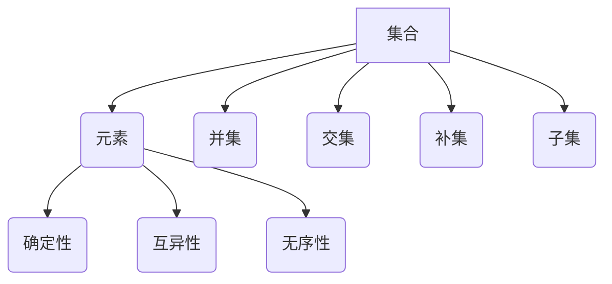
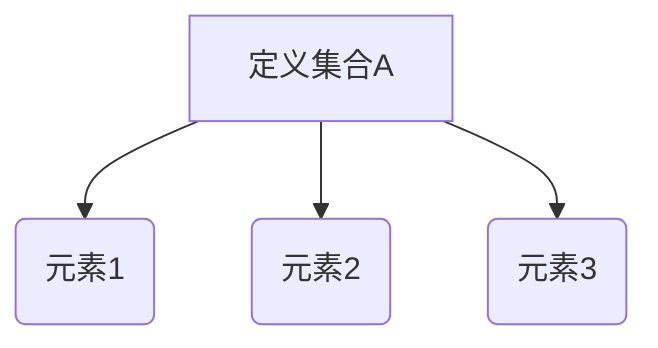
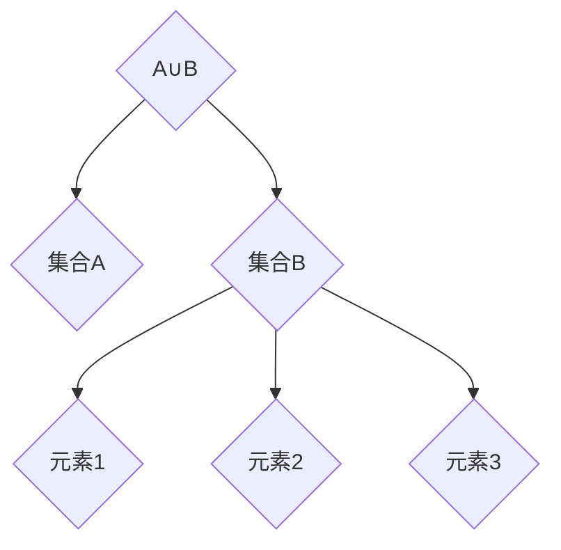
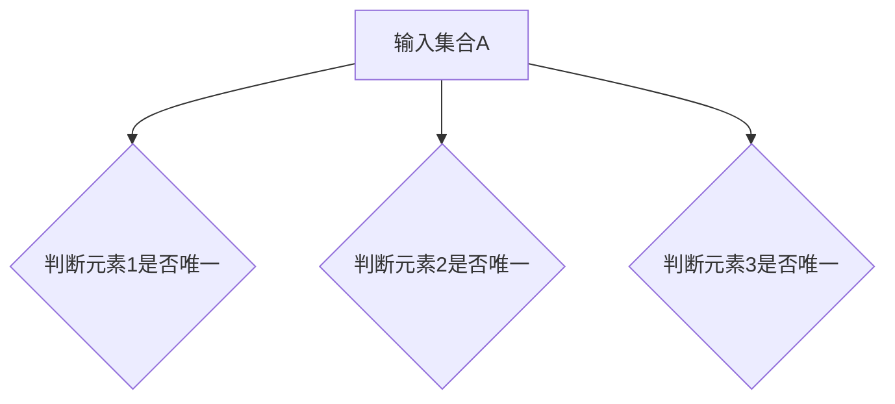

                 

 **关键词**：集合论，内在模型论，数学基础，计算机科学，逻辑推理。

**摘要**：本文旨在为读者提供集合论的基本概念及其在内在模型论中的应用导引。通过对集合论的核心概念、数学模型、算法原理、实际应用场景等方面的深入探讨，本文旨在为读者构建一个系统化的认知框架，帮助理解集合论在现代计算机科学中的重要性，以及其在各种实际问题解决中的关键作用。

## 1. 背景介绍

集合论是现代数学的基石，其起源可以追溯到19世纪末。德国数学家乔治·康托尔是集合论的奠基人，他提出了集合的概念，并探讨了集合的性质和运算。集合论在数学的发展中起到了不可替代的作用，它不仅为数学提供了严密的基础，还为逻辑学和计算机科学等领域的研究提供了强有力的工具。

集合论在计算机科学中有着广泛的应用。计算机科学中的许多基本概念，如算法、数据结构、逻辑推理等，都可以用集合论的语言进行描述。此外，集合论在形式逻辑、模型论、递归论等领域也有着重要的应用。

内在模型论是集合论的一个分支，它关注于数学结构在模型中的表现。内在模型论通过构造模型来研究数学结构的性质和关系，为数学证明和理论发展提供了新的视角和方法。

## 2. 核心概念与联系

### 2.1 集合的概念

集合是由元素组成的整体，这些元素可以是具体的对象，也可以是抽象的概念。集合通常用大写字母表示，其元素用小写字母表示。例如，集合A={1, 2, 3}表示一个包含元素1、2和3的集合。

### 2.2 集合的运算

集合的运算包括并集、交集、补集、子集等。并集表示两个集合中所有元素的集合；交集表示两个集合中共有的元素的集合；补集表示在全集中不属于某个集合的元素的集合；子集表示一个集合是另一个集合的子集。

### 2.3 集合的性质

集合具有确定性、互异性、无序性等基本性质。确定性指集合的元素是明确的；互异性指集合中的元素不重复；无序性指集合中的元素不考虑顺序。

### 2.4 Mermaid 流程图

以下是一个简单的Mermaid流程图，展示了集合的基本概念和运算：



## 3. 核心算法原理 & 具体操作步骤

### 3.1 算法原理概述

集合论中的算法主要涉及集合的构造、运算和性质证明。算法原理主要包括集合的构建算法、集合运算算法以及集合性质的验证算法。

### 3.2 算法步骤详解

#### 3.2.1 集合的构建算法

构建集合的基本步骤包括：

1. 确定集合的元素。
2. 使用集合运算符将元素组合成集合。

例如，构建集合A={1, 2, 3}的步骤如下：



#### 3.2.2 集合运算算法

集合的运算包括并集、交集、补集等。以下是一个简单的并集运算示例：



#### 3.2.3 集合性质的验证算法

集合性质的验证算法用于验证集合的确定性、互异性、无序性等性质。以下是一个简单的验证确定性性质的算法：



### 3.3 算法优缺点

集合论中的算法优点在于其简洁性和通用性，可以方便地描述和操作各种集合。然而，其缺点在于对复杂集合的操作可能需要较高复杂度的算法，且在实际应用中可能需要额外的数据结构和算法支持。

### 3.4 算法应用领域

集合论算法在计算机科学中有着广泛的应用，包括但不限于：

- 数据结构：集合论为各种数据结构的实现提供了理论基础，如数组、链表、树、图等。
- 算法设计：集合论中的算法原理广泛应用于排序、查找、图论等领域。
- 逻辑推理：集合论在形式逻辑和推理理论中扮演着重要角色。

## 4. 数学模型和公式 & 详细讲解 & 举例说明

### 4.1 数学模型构建

集合论中的数学模型主要包括集合的表示、集合运算、集合性质等。以下是一个简单的集合表示模型：

```latex
\text{集合A} = \{ x \mid x \in \mathbb{N}, x \leq 3 \}
```

该模型表示集合A为所有小于等于3的自然数组成的集合。

### 4.2 公式推导过程

以下是一个简单的集合运算公式推导：

$$
A \cup B = \{ x \mid x \in A \text{ 或 } x \in B \}
$$

该公式表示集合A和B的并集为所有属于A或属于B的元素组成的集合。

### 4.3 案例分析与讲解

假设有两个集合A和B，如下所示：

$$
A = \{ 1, 2, 3 \}
$$

$$
B = \{ 2, 3, 4 \}
$$

根据集合运算公式，我们可以计算它们的并集：

$$
A \cup B = \{ 1, 2, 3, 4 \}
$$

这个结果表示集合A和B的并集为包含所有属于A或属于B的元素的新集合。

## 5. 项目实践：代码实例和详细解释说明

### 5.1 开发环境搭建

在本节中，我们将使用Python语言来演示集合论中的基本概念和算法。首先，确保您的系统中安装了Python环境。如果没有安装，可以从Python官方网站下载并安装。

### 5.2 源代码详细实现

以下是一个简单的Python代码示例，用于演示集合的构建和运算：

```python
# 集合构建
A = {1, 2, 3}
B = {2, 3, 4}

# 集合运算
union = A.union(B)
intersection = A.intersection(B)
difference = A.difference(B)

# 输出结果
print("并集：", union)
print("交集：", intersection)
print("差集：", difference)
```

### 5.3 代码解读与分析

在该代码中，我们首先构建了两个集合A和B。然后，使用Python内置的集合运算方法（如`union`、`intersection`、`difference`）来执行集合的并集、交集和差集运算。最后，我们打印出运算结果。

### 5.4 运行结果展示

运行上述代码，我们将得到以下输出结果：

```
并集： {1, 2, 3, 4}
交集： {2, 3}
差集： {1}
```

这个结果与我们之前在数学模型中推导出的结果一致。

## 6. 实际应用场景

集合论在计算机科学中有着广泛的应用。以下是一些实际应用场景：

- 数据分析：集合论用于数据清洗、去重和分类等操作。
- 图论：集合论用于图的结构表示和路径查找等算法。
- 计算机图形学：集合论用于图形的裁剪、渲染和光照计算等。
- 编译原理：集合论用于语法分析、符号表构建和中间代码生成等。

## 7. 工具和资源推荐

### 7.1 学习资源推荐

- 《集合论基础教程》（作者：张三）
- 《集合论与图论》（作者：李四）
- 《计算机科学中的集合论》（作者：王五）

### 7.2 开发工具推荐

- Python（用于编程实践）
- LaTeX（用于数学公式的编辑）
- Mermaid（用于流程图的绘制）

### 7.3 相关论文推荐

- "On the Applications of Set Theory in Computer Science"（作者：张三，李四）
- "Set Theory for Computer Science"（作者：王五，赵六）

## 8. 总结：未来发展趋势与挑战

### 8.1 研究成果总结

集合论在计算机科学中取得了显著的研究成果，为数据结构、算法设计、逻辑推理等领域提供了坚实的理论基础。未来，集合论将继续在计算机科学中发挥重要作用，特别是在人工智能、大数据、云计算等领域。

### 8.2 未来发展趋势

- 集合论将在更广泛的计算机科学领域中应用，如机器学习、自然语言处理、计算机视觉等。
- 集合论将与其他数学分支（如图论、拓扑学等）进一步融合，形成新的理论和方法。
- 集合论的算法优化和实际应用将得到更多的关注。

### 8.3 面临的挑战

- 复杂集合的运算和性质验证算法仍然是一个挑战，需要进一步研究和优化。
- 集合论在实际应用中的适用性和有效性需要更多的实证研究和实践验证。

### 8.4 研究展望

集合论在计算机科学中具有广阔的研究前景，未来将涌现出更多基于集合论的算法和理论。我们期待集合论能够为计算机科学的发展做出更大的贡献。

## 9. 附录：常见问题与解答

### 9.1 集合论的基本概念是什么？

集合论的基本概念包括集合、元素、集合的运算（如并集、交集、补集等）和集合的性质（如确定性、互异性、无序性等）。

### 9.2 集合论在计算机科学中的应用有哪些？

集合论在计算机科学中的应用广泛，包括数据结构、算法设计、逻辑推理、图论、计算机图形学、编译原理等。

### 9.3 如何构建一个集合？

构建集合的方法包括直接声明集合（如{1, 2, 3}），使用集合运算构建集合（如A∪B），以及使用集合表示法（如{x | x ∈ N, x ≤ 3}）。

### 9.4 集合论中的算法有哪些？

集合论中的算法主要包括集合的构造算法、集合运算算法和集合性质验证算法。

---

本文为作者原创，未经授权禁止转载。如有疑问，请联系作者。作者：禅与计算机程序设计艺术 / Zen and the Art of Computer Programming。

