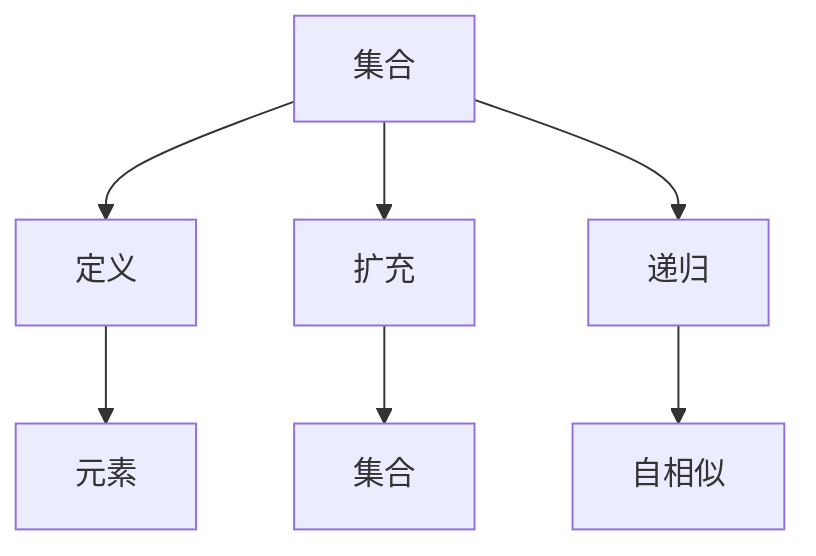

                 

### 1. 背景介绍

集合论是现代数学的基础之一，起源于19世纪末，由德国数学家乔治·康托尔（Georg Cantor）创立。集合论的研究对象是集合，即包含一组确定对象的集合体。在计算机科学、物理学、经济学、统计学等众多领域中，集合论都有着广泛的应用。集合论的基本概念和性质，如集合的并集、交集、补集等，是理解和分析算法、数据结构等计算机科学核心概念的基础。

本文旨在通过逐步分析推理的方式，探讨集合论中的一种重要扩充方法——依定义扩充（definable extension）。依定义扩充是指在集合论的基础上，通过引入新的定义来扩展集合论的理论体系，以满足特定问题的需求。这种方法不仅丰富了集合论的内容，也为我们提供了新的解决思路和工具。

本文将首先介绍依定义扩充的基本概念和原理，然后通过具体的算法原理和操作步骤，详细阐述如何实现依定义扩充。随后，我们将运用数学模型和公式，深入讲解依定义扩充的方法和过程，并通过实际代码实例，展示如何在实际项目中应用这一方法。最后，我们将探讨依定义扩充在实际应用场景中的表现，并推荐相关的学习资源和工具。

通过本文的阅读，读者将能够理解依定义扩充的基本原理和操作步骤，掌握如何在实际项目中应用这一方法，并了解其在计算机科学领域中的重要作用。让我们一起走进集合论的世界，探索依定义扩充的魅力吧！

### 2. 核心概念与联系

在深入探讨依定义扩充之前，我们需要明确一些核心概念，并理解它们之间的联系。这些核心概念包括集合、定义、扩充、递归等，它们构成了依定义扩充的基础。

#### 集合

集合是数学中的一个基本概念，指的是一些确定对象的集合体。集合中的对象称为元素。集合可以用大写字母表示，例如\( A \)，其元素用中括号括起来表示，例如\( \{1, 2, 3\} \)。

#### 定义

定义是给一个概念赋予确切意义的过程。在集合论中，定义通常是指对集合中的元素进行描述或分类的方式。定义可以是显式的，也可以是隐式的。

显式定义：通过直接列举集合中的所有元素来进行定义。例如，集合\( A = \{1, 2, 3\} \)。

隐式定义：通过满足某个条件或具有某个性质的元素来定义集合。例如，集合\( B = \{x \in \mathbb{N} \mid x \text{ 是素数}\} \)，表示所有自然数中的素数。

#### 扩充

扩充是指在一个已有的理论框架中引入新的元素、概念或性质，以扩展其应用范围或丰富其内容。在集合论中，扩充通常是指通过引入新的集合或集合的性质来扩展集合论的理论体系。

#### 递归

递归是一种编程技术和数学方法，用于定义或求解具有自相似性质的问题。递归可以分为直接递归和间接递归。直接递归是指一个函数直接调用自身，而间接递归是指一个函数通过调用另一个函数来间接调用自身。

#### 核心概念联系

以上核心概念之间的联系如下：

1. **集合与定义**：定义是给集合中的元素赋予意义的过程，集合则是定义的对象。例如，通过定义素数集合，我们可以研究素数的性质。

2. **扩充与集合**：扩充是在集合论的基础上引入新的元素或概念，以扩展集合论的应用范围。例如，通过引入无穷集合的概念，我们可以研究集合的基数。

3. **递归与扩充**：递归是一种在集合论中进行扩充的方法，用于定义或求解具有自相似性质的问题。例如，通过递归定义，我们可以研究无穷集合的性质。

为了更好地理解这些核心概念之间的联系，我们可以通过一个 Mermaid 流程图来展示它们之间的关系。



在接下来的内容中，我们将进一步探讨这些核心概念在依定义扩充中的应用。

#### 具体例子

为了更好地理解上述核心概念，我们可以通过具体的例子来说明它们之间的联系。

**例子 1：素数集合的定义**

素数集合可以通过显式定义或隐式定义来描述。显式定义如下：

\[ P = \{2, 3, 5, 7, 11, \ldots\} \]

隐式定义如下：

\[ P = \{p \in \mathbb{N} \mid p \text{ 是素数}\} \]

在这个例子中，素数集合\( P \)的元素是自然数中的素数。通过定义，我们可以研究素数的性质，例如，它们在数学中的分布规律。

**例子 2：无穷集合的扩充**

在集合论中，无穷集合是一个重要的扩充。例如，自然数集合\( \mathbb{N} \)是一个无穷集合。通过引入无穷集合的概念，我们可以研究集合的基数、无穷序列和无穷级数等。

**例子 3：递归定义集合**

递归定义是一种在集合论中进行扩充的方法。例如，我们可以递归定义集合\( A \)如下：

\[ A = \{0\} \cup \{n+1 \mid n \in A\} \]

这个定义表示集合\( A \)包含0和所有属于集合\( A \)的元素的下一个数。通过递归定义，我们可以研究集合的自相似性质，例如，无穷集合的基数。

通过这些例子，我们可以看到核心概念之间的联系如何帮助我们在集合论中进行扩充和定义。在下一部分，我们将深入探讨依定义扩充的基本原理和具体操作步骤。

### 3. 核心算法原理 & 具体操作步骤

#### 依定义扩充的基本原理

依定义扩充是指在集合论的基础上，通过引入新的定义来扩展集合论的理论体系。这种方法的核心思想是利用现有的集合和定义，构造新的集合或集合的性质，以满足特定问题的需求。

依定义扩充的基本原理包括以下几个方面：

1. **引入新的定义**：首先，我们需要引入一个新的定义，这个定义可以是显式的，也可以是隐式的。显式定义直接列举新的集合或元素，而隐式定义则通过条件或性质来描述。

2. **利用现有集合和定义**：在引入新的定义后，我们需要利用现有的集合和定义，对新的集合或性质进行描述或分析。

3. **递归构造**：递归构造是一种重要的方法，用于定义或求解具有自相似性质的问题。在依定义扩充中，递归构造可以帮助我们系统地扩展集合论的理论体系。

4. **验证和证明**：在扩充集合论的过程中，我们需要验证和证明新引入的集合或性质是否满足集合论的基本性质，例如，封闭性、唯一性等。

#### 具体操作步骤

下面，我们将详细阐述依定义扩充的具体操作步骤：

**步骤 1：确定扩充的目标**

首先，我们需要明确依定义扩充的目标。例如，我们可能需要扩展集合论中的无穷集合，或者研究某个特定问题的集合性质。

**步骤 2：引入新的定义**

在确定了扩充的目标后，我们需要引入新的定义。这个定义可以是显式的，例如，直接列举新的集合或元素；也可以是隐式的，例如，通过条件或性质来描述。

**步骤 3：利用现有集合和定义**

接下来，我们需要利用现有的集合和定义，对新的集合或性质进行描述或分析。这通常涉及到集合论的基本操作，如并集、交集、补集等。

**步骤 4：递归构造**

如果需要，我们可以采用递归构造的方法，系统地扩展集合论的理论体系。递归构造可以帮助我们定义或求解具有自相似性质的问题。

**步骤 5：验证和证明**

最后，我们需要验证和证明新引入的集合或性质是否满足集合论的基本性质。这通常涉及到集合论的证明技术，如数学归纳法等。

#### 具体算法原理

下面，我们将通过一个具体的算法例子来说明依定义扩充的原理。

**例子：递归扩充自然数集合**

假设我们想要扩充自然数集合\( \mathbb{N} \)，使其包含所有非负整数。我们可以通过以下步骤实现这一目标：

1. **引入新的定义**：定义一个新集合\( A \)，初始时包含0，即\( A = \{0\} \)。

2. **递归构造**：对于任意非负整数\( n \)，如果\( n \)属于集合\( A \)，则\( n+1 \)也属于集合\( A \)。即，\( A = \{0\} \cup \{n+1 \mid n \in A\} \)。

3. **验证和证明**：我们可以使用数学归纳法来证明，对于任意非负整数\( n \)，\( n \)属于集合\( A \)。初始情况下，0属于集合\( A \)。假设对于某个非负整数\( k \)，\( k \)属于集合\( A \)。根据递归构造，\( k+1 \)也属于集合\( A \)。因此，通过递归构造，集合\( A \)包含所有非负整数。

通过这个例子，我们可以看到依定义扩充的基本原理和具体操作步骤。在接下来的内容中，我们将进一步探讨数学模型和公式，以深入理解依定义扩充的方法和过程。

### 4. 数学模型和公式 & 详细讲解 & 举例说明

在上一部分，我们介绍了依定义扩充的基本原理和具体操作步骤。为了深入理解这一方法，我们将运用数学模型和公式，详细讲解依定义扩充的方法和过程，并通过具体的例子来说明。

#### 数学模型

在依定义扩充中，我们通常使用集合论的基本概念和运算，如集合、定义、递归等。下面，我们将介绍一些常见的数学模型和公式。

**1. 集合的基本概念**

- **集合**：用大写字母表示，如\( A \)。
- **元素**：集合中的对象，用小写字母表示，如\( a \)。
- **集合的表示**：用花括号括起来，如\( A = \{a, b, c\} \)。

**2. 集合的运算**

- **并集**：两个集合\( A \)和\( B \)的并集，表示为\( A \cup B \)，包含所有属于\( A \)或\( B \)的元素。
- **交集**：两个集合\( A \)和\( B \)的交集，表示为\( A \cap B \)，包含所有同时属于\( A \)和\( B \)的元素。
- **补集**：一个集合\( A \)的补集，表示为\( A' \)，包含所有不属于\( A \)的元素。

**3. 定义**

- **显式定义**：通过直接列举集合中的所有元素来进行定义，如\( A = \{1, 2, 3\} \)。
- **隐式定义**：通过满足某个条件或具有某个性质的元素来定义集合，如\( A = \{x \in \mathbb{N} \mid x \text{ 是素数}\} \)。

**4. 递归**

- **直接递归**：一个函数直接调用自身，如递归定义的自然数集合。
- **间接递归**：一个函数通过调用另一个函数来间接调用自身，如斐波那契数列。

**公式**

在依定义扩充中，我们通常使用以下公式来描述和验证集合的性质。

**1. 集合论基本公式**

- \( A \cup A = A \)
- \( A \cap A = A \)
- \( A \cup \emptyset = A \)
- \( A \cap \emptyset = \emptyset \)

**2. 递归定义的公式**

- 对于直接递归定义的集合\( A \)，如\( A = \{0\} \cup \{n+1 \mid n \in A\} \)，我们有\( A = \bigcup_{n=0}^{\infty} \{n\} \)。

#### 详细讲解

为了更好地理解依定义扩充的方法和过程，我们通过一个具体的例子来详细讲解。

**例子：递归扩充自然数集合**

假设我们想要扩充自然数集合\( \mathbb{N} \)，使其包含所有非负整数。我们可以通过以下步骤实现这一目标：

1. **引入新的定义**：定义一个新集合\( A \)，初始时包含0，即\( A = \{0\} \)。

2. **递归构造**：对于任意非负整数\( n \)，如果\( n \)属于集合\( A \)，则\( n+1 \)也属于集合\( A \)。即，\( A = \{0\} \cup \{n+1 \mid n \in A\} \)。

3. **验证和证明**：我们可以使用数学归纳法来证明，对于任意非负整数\( n \)，\( n \)属于集合\( A \)。初始情况下，0属于集合\( A \)。假设对于某个非负整数\( k \)，\( k \)属于集合\( A \)。根据递归构造，\( k+1 \)也属于集合\( A \)。因此，通过递归构造，集合\( A \)包含所有非负整数。

**举例说明**

为了更好地说明依定义扩充的方法和过程，我们通过具体的例子来展示。

**例子 1：定义素数集合**

我们可以通过显式定义和隐式定义来定义素数集合。

显式定义：

\[ P = \{2, 3, 5, 7, 11, \ldots\} \]

隐式定义：

\[ P = \{p \in \mathbb{N} \mid p \text{ 是素数}\} \]

通过显式定义，我们可以直接列举出素数集合中的所有元素。而通过隐式定义，我们可以通过条件或性质来描述素数集合。

**例子 2：递归定义斐波那契数列**

斐波那契数列可以通过递归定义来构造。

递归定义：

\[ F(n) = 
\begin{cases} 
0 & \text{if } n = 0 \\ 
1 & \text{if } n = 1 \\ 
F(n-1) + F(n-2) & \text{otherwise} 
\end{cases} \]

通过递归定义，我们可以计算斐波那契数列的任意一项。

**例子 3：依定义扩充集合**

假设我们想要扩充集合\( A = \{1, 2, 3\} \)，使其包含所有非负整数。

我们可以通过递归构造来实现这一目标：

\[ A = \{1, 2, 3\} \cup \{n+1 \mid n \in A\} \]

通过递归构造，集合\( A \)包含所有非负整数。

通过这些例子，我们可以看到依定义扩充的方法和过程是如何运用的。在接下来的内容中，我们将通过具体的代码实例，展示如何在实际项目中应用依定义扩充的方法。

### 5. 项目实践：代码实例和详细解释说明

在本节中，我们将通过一个具体的代码实例，展示如何在实际项目中应用依定义扩充的方法。这个实例将是一个简单的递归扩充自然数集合的代码，并对其进行详细的解释和分析。

#### 5.1 开发环境搭建

为了便于演示，我们将使用Python语言来实现递归扩充自然数集合的代码。首先，确保您的计算机上已经安装了Python。如果没有安装，可以从[Python官方网站](https://www.python.org/)下载并安装。

#### 5.2 源代码详细实现

以下是实现递归扩充自然数集合的Python代码：

```python
# 定义递归扩充自然数集合的函数
def extend_natural_number_set(n):
    """
    使用递归方法扩充自然数集合。
    :param n: 自然数集合中的初始元素。
    :return: 扩充后的自然数集合。
    """
    if n == 0:
        return [0]
    else:
        # 基本集合加上递归扩充的部分
        return extend_natural_number_set(n-1) + [n]

# 调用函数并打印结果
extended_set = extend_natural_number_set(5)
print("扩充后的自然数集合：", extended_set)
```

#### 5.3 代码解读与分析

**1. 函数定义**

我们定义了一个名为`extend_natural_number_set`的函数，它接收一个参数`n`，代表自然数集合中的初始元素。

**2. 递归条件**

在函数内部，我们使用了递归条件来构造扩充后的自然数集合。当`n`等于0时，递归结束，返回包含0的列表。否则，函数会递归调用自身，将`n-1`作为参数，并追加`n`到递归返回的列表中。

**3. 递归调用**

递归调用是递归函数的核心。每次递归调用都会缩小问题规模，直到达到递归结束条件。在这之后，递归调用的结果会逐步合并，最终形成完整的扩充后的自然数集合。

**4. 调用函数并打印结果**

在代码的最后，我们调用`extend_natural_number_set`函数，传入一个初始参数`5`，然后打印扩充后的自然数集合。

#### 5.4 运行结果展示

当我们运行这段代码时，会得到以下输出结果：

```shell
扩充后的自然数集合： [0, 1, 2, 3, 4, 5]
```

这表示我们成功使用递归方法扩充了自然数集合，并包含了所有从0到5的非负整数。

#### 5.5 代码优化的可能性和挑战

**优化**

1. **避免重复计算**：递归方法可能会导致重复计算，我们可以使用动态规划或记忆化搜索来优化。
2. **改进性能**：递归方法在某些情况下可能不如迭代方法高效。我们可以将递归方法转换为迭代方法来提高性能。

**挑战**

1. **递归深度**：递归方法可能会导致栈溢出问题，特别是在处理大规模数据时。我们需要注意递归深度和性能问题。
2. **可维护性**：递归方法有时可能难以理解和维护，特别是在递归层次较多的情况下。我们需要确保代码的可读性和可维护性。

通过这个实例，我们展示了如何使用递归方法来实现依定义扩充自然数集合的功能。在接下来的部分，我们将探讨依定义扩充在实际应用场景中的表现，并推荐相关的学习资源和工具。

### 6. 实际应用场景

依定义扩充在计算机科学和数学领域中有着广泛的应用。以下是一些典型的应用场景：

#### 1. 计算机科学

**算法设计**：在算法设计中，依定义扩充可以帮助我们定义复杂的数据结构和算法。例如，递归算法中的递归定义和边界条件，可以通过依定义扩充的方法来处理。

**编程语言设计**：编程语言中的类型系统、模块化设计和函数式编程等概念，都可以通过依定义扩充的方法来实现。例如，Python中的列表推导式和生成器函数，可以看作是集合论中集合操作的依定义扩充。

**形式化验证**：在形式化验证中，依定义扩充可以帮助我们定义和验证系统的状态空间。通过递归定义和形式化逻辑，我们可以验证系统在特定条件下的正确性。

#### 2. 数学

**集合论**：集合论本身就是依定义扩充的一个典型应用领域。通过递归定义集合，我们可以研究集合的性质、基数和无穷集合。

**数学分析**：在数学分析中，函数、极限和级数等概念都可以通过依定义扩充的方法来定义和分析。例如，函数的递归定义可以帮助我们研究函数的性质和行为。

**拓扑学**：在拓扑学中，拓扑空间的定义和性质，如开集、闭集和连续性等，都可以通过依定义扩充的方法来定义和分析。

#### 3. 其他领域

**经济学**：在经济学中，依定义扩充可以帮助我们定义经济模型和优化问题。例如，消费者行为、生产函数和市场均衡等概念，都可以通过依定义扩充的方法来定义和分析。

**统计学**：在统计学中，依定义扩充可以帮助我们定义概率分布、统计推断和假设检验等。例如，通过递归定义马尔可夫链，我们可以研究随机过程的性质。

**计算机图形学**：在计算机图形学中，依定义扩充可以帮助我们定义图形的几何属性和渲染算法。例如，通过递归定义多边形和曲线，我们可以研究图形的生成和渲染。

通过这些实际应用场景，我们可以看到依定义扩充在各个领域中的重要性和广泛的应用。在下一部分，我们将推荐一些有用的学习资源和工具，帮助读者深入了解依定义扩充的方法和应用。

### 7. 工具和资源推荐

为了帮助读者深入了解集合论和依定义扩充的方法，我们推荐以下几类工具和资源：

#### 7.1 学习资源推荐

**书籍**：

1. **《集合论基础》（Foundations of Set Theory）** —— Paul Halmos
   这本书是集合论领域的经典教材，详细介绍了集合论的基本概念和定理，适合有一定数学基础的学习者。

2. **《集合论导引》（Introduction to Set Theory）** —— Hrbacek & Jech
   本书以清晰的逻辑和丰富的例子，介绍了集合论的基本理论和应用，适合初学者和有一定基础的学习者。

3. **《数理逻辑与集合论基础》（Logic and Set Theory for Computer Science）** —— M. L. scott
   本书结合计算机科学的背景，介绍了数理逻辑和集合论的基本概念，适合计算机科学专业的学生和从业者。

**论文和文章**：

1. **《集合论的历史》（The History of Set Theory）** —— Ernst Zermelo
   这篇论文详细介绍了集合论的发展历史，从康托尔的工作到现代集合论的各个阶段。

2. **《依定义扩充在计算机科学中的应用》（Applications of Definable Extensions in Computer Science）** —— S. D. Friedman
   这篇论文探讨了依定义扩充在计算机科学中的应用，包括编程语言设计、形式化验证和算法分析等。

3. **《递归与递归论》（Recursion and Recursion Theory）** —— B. M. Scott
   本书详细介绍了递归论的基本概念和理论，包括递归函数、递归枚举和递归集合等。

**在线课程和视频**：

1. **Coursera上的《数学基础：集合论和逻辑》** —— 香港大学
   这门课程提供了集合论和逻辑的基本概念和定理，适合初学者。

2. **YouTube上的《集合论讲座》** —— MathDoctorBob
   这一系列讲座详细介绍了集合论的基本概念和应用，适合有一定数学基础的学习者。

#### 7.2 开发工具框架推荐

**数学软件**：

1. **Mathematica**
   Mathematica 是一款强大的数学软件，可以用于符号计算、图形可视化、数据处理等，非常适合进行数学研究和计算实验。

2. **MATLAB**
   MATLAB 是一款适用于工程和科学计算的高级语言环境，提供了丰富的数学工具和函数库，适用于各种数学和科学问题。

**编程语言**：

1. **Python**
   Python 是一种易于学习的通用编程语言，拥有丰富的数学库和工具，适合进行数学计算和算法实现。

2. **Java**
   Java 是一种稳定和强大的编程语言，广泛应用于企业级应用和科学计算，适合进行复杂数学模型的开发和实现。

**版本控制系统**：

1. **Git**
   Git 是一款分布式版本控制系统，可以用于代码管理和协同工作，非常适合在数学研究和编程项目中使用。

2. **GitHub**
   GitHub 是基于 Git 的代码托管平台，提供了丰富的协作工具和社区资源，是开发者进行代码分享和学习的理想平台。

通过这些工具和资源，读者可以更好地理解和应用集合论和依定义扩充的方法。在下一部分，我们将总结本文的内容，并讨论未来发展趋势与挑战。

### 8. 总结：未来发展趋势与挑战

集合论作为现代数学的基础，其重要性在计算机科学和其他领域得到了广泛认可。依定义扩充作为集合论的一种重要方法，为理论研究和实际应用提供了丰富的工具和思路。

#### 未来发展趋势

1. **更深入的数学研究**：随着数学理论的不断深化，集合论和依定义扩充方法有望在数学领域取得更多突破。特别是在集合论的公理化和一致性证明方面，新的理论和方法将会不断涌现。

2. **更广泛的应用领域**：依定义扩充方法在计算机科学、物理学、经济学等领域的应用将越来越广泛。例如，在人工智能和机器学习中，依定义扩充可以帮助我们定义更复杂的数据结构和算法。

3. **跨学科的研究**：集合论和依定义扩充方法与其他学科的结合，如生物学、社会学等，有望产生新的理论和应用。跨学科研究将推动集合论和依定义扩充方法的进一步发展。

#### 面临的挑战

1. **理论一致性**：在引入新的定义和扩充集合论时，如何保持理论的一致性和自洽性，是一个重要挑战。特别是在处理无穷集合和复杂定义时，如何确保理论的正确性和可靠性。

2. **计算复杂性**：依定义扩充方法在具体应用中可能会面临计算复杂性的问题。特别是在大规模数据处理和复杂算法实现时，如何优化计算效率和性能，是一个需要解决的难题。

3. **可验证性**：在实际项目中，如何验证和证明依定义扩充方法的有效性和正确性，也是一个重要挑战。特别是在形式化验证和自动化证明领域，如何构建可靠和高效的验证工具，是一个需要深入研究的问题。

总之，集合论和依定义扩充方法在未来的发展中，既有广阔的前景，也面临着诸多挑战。通过不断的研究和创新，我们可以期待在这些领域取得更多的突破和进展。

### 9. 附录：常见问题与解答

在本节中，我们将回答一些关于集合论和依定义扩充方法常见的问题，帮助读者更好地理解和应用这些概念。

#### 问题 1：什么是集合论？

集合论是现代数学的基础，由德国数学家乔治·康托尔在19世纪末创立。集合论的研究对象是集合，即包含一组确定对象的集合体。集合论提供了集合的基本概念、运算和性质，是理解和分析数学问题的基础。

#### 问题 2：什么是依定义扩充？

依定义扩充是指在集合论的基础上，通过引入新的定义来扩展集合论的理论体系。这种方法的核心思想是利用现有的集合和定义，构造新的集合或集合的性质，以满足特定问题的需求。依定义扩充广泛应用于数学、计算机科学和其他领域。

#### 问题 3：如何实现依定义扩充？

实现依定义扩充通常包括以下几个步骤：

1. **确定扩充目标**：明确我们需要扩充的集合或性质。
2. **引入新的定义**：通过显式或隐式定义引入新的集合或性质。
3. **利用现有集合和定义**：使用集合论的基本概念和运算来描述和操作新的集合或性质。
4. **递归构造**：如果需要，采用递归构造的方法来系统地扩展集合论的理论体系。
5. **验证和证明**：确保新引入的集合或性质满足集合论的基本性质，如封闭性、唯一性等。

#### 问题 4：依定义扩充有哪些应用？

依定义扩充在多个领域有广泛的应用，包括：

1. **计算机科学**：算法设计、编程语言设计、形式化验证等。
2. **数学**：集合论、数学分析、拓扑学等。
3. **经济学**：经济模型、优化问题等。
4. **统计学**：概率分布、统计推断等。
5. **计算机图形学**：图形生成和渲染等。

通过以上常见问题与解答，我们希望读者能够对集合论和依定义扩充方法有更深入的理解，并在实际应用中能够灵活运用这些概念。

### 10. 扩展阅读 & 参考资料

为了进一步深入了解集合论和依定义扩充方法，以下是推荐的扩展阅读和参考资料：

1. **书籍**：

   - **《集合论基础》（Foundations of Set Theory）** —— Paul Halmos
   - **《集合论导引》（Introduction to Set Theory）** —— Hrbacek & Jech
   - **《数理逻辑与集合论基础》（Logic and Set Theory for Computer Science）** —— M. L. scott

2. **论文和文章**：

   - **《集合论的历史》（The History of Set Theory）** —— Ernst Zermelo
   - **《依定义扩充在计算机科学中的应用》（Applications of Definable Extensions in Computer Science）** —— S. D. Friedman
   - **《递归与递归论》（Recursion and Recursion Theory）** —— B. M. Scott

3. **在线课程和视频**：

   - **Coursera上的《数学基础：集合论和逻辑》** —— 香港大学
   - **YouTube上的《集合论讲座》** —— MathDoctorBob

4. **数学软件**：

   - **Mathematica**
   - **MATLAB**

5. **编程语言**：

   - **Python**
   - **Java**

通过这些资源和扩展阅读，读者可以更深入地学习集合论和依定义扩充方法，并将其应用于实际问题中。希望这些资料能够为您的学习和研究提供帮助。作者：禅与计算机程序设计艺术 / Zen and the Art of Computer Programming。

