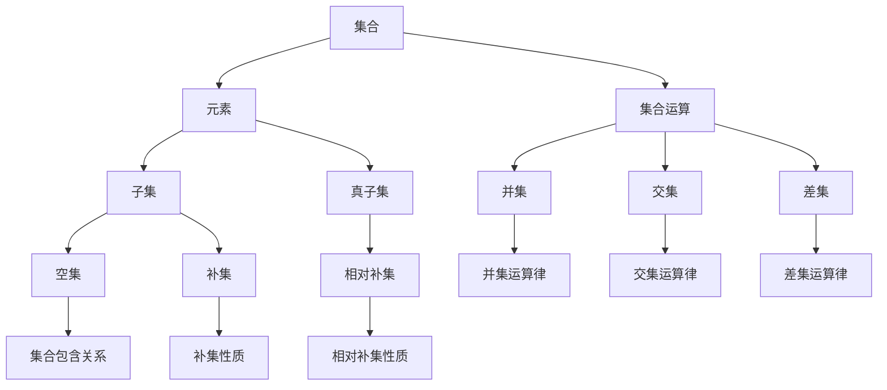

                 

### 集合论导引：集合论上依定义扩充

> **关键词：** 集合论、定义扩充、数学基础、集合运算、逻辑推理

**摘要：** 本文章旨在为读者提供一个集合论的导引，重点介绍集合论上依定义扩充的方法与技巧。通过对集合论核心概念的深入剖析，结合具体实例，我们将探讨如何通过逻辑推理和数学模型来扩充集合，以更好地理解和应用集合论。文章旨在帮助读者夯实数学基础，提升逻辑思维和问题解决能力。

## 1. 背景介绍

集合论是现代数学的基石，其重要性不言而喻。集合论的发展不仅推动了数学科学的进步，也影响了计算机科学、物理学、经济学等多个领域。在集合论中，集合是基本概念，而集合的运算和性质构成了集合论的核心内容。

然而，在实际应用中，我们会遇到各种复杂的集合问题，这需要我们对集合进行扩充。所谓的集合扩充，是指在原有集合的基础上，引入新的元素或新的集合结构，以更好地描述和解决问题。这种扩充不仅仅是对集合元素的简单增加，而是涉及到集合论的基本原理和逻辑推理。

集合论上依定义扩充的方法，是一种系统化的扩充过程。它基于集合论的基本原理和定义，通过逻辑推理和数学证明，构建新的集合结构。这种方法不仅能够帮助我们更好地理解和掌握集合论，还能够为解决复杂的数学和实际问题提供强有力的工具。

本文将围绕集合论上依定义扩充的方法，系统地介绍相关概念、原理和具体实例，旨在帮助读者掌握集合论的核心技巧，提升数学和逻辑思维能力。

## 2. 核心概念与联系

在介绍集合论上依定义扩充的方法之前，我们首先需要了解集合论中的核心概念和它们之间的联系。以下是一个简化的 Mermaid 流程图，用于展示这些核心概念及其相互关系。



### 2.1 核心概念解释

- **集合 (A)**：集合是一组确定且互不相同的对象的集合。集合中的每个对象称为该集合的元素。
- **元素 (B)**：集合中的每个对象称为元素。元素可以是任何对象，包括数字、字母、符号等。
- **子集 (D)**：如果集合A中的所有元素都是集合B中的元素，则称A是B的子集。记作A⊆B。
- **真子集 (E)**：如果集合A是集合B的子集，并且A不等于B，则称A是真子集。记作A⊊B。
- **空集 (I)**：空集是一个不包含任何元素的集合，记作∅。
- **补集 (J)**：对于给定的全集U和集合A，A的补集是U中不属于A的所有元素的集合，记作A'。
- **相对补集 (K)**：对于两个集合A和B，A相对于B的补集是B中不属于A的所有元素的集合，记作A'∩B。

### 2.2 集合运算

集合运算主要包括并集、交集和差集三种。

- **并集 (F)**：集合A和B的并集是包含A和B中所有元素的集合，记作A∪B。
  - **并集运算律**：L[结合律](A∪B)∪C = A∪(B∪C)，A∪∅ = A，∅∪A = A。
- **交集 (G)**：集合A和B的交集是同时属于A和B的元素构成的集合，记作A∩B。
  - **交集运算律**：M[结合律](A∩B)∩C = A∩(B∩C)，A∩∅ = ∅，∅∩A = ∅。
- **差集 (H)**：集合A和B的差集是只属于A但不属于B的元素构成的集合，记作A-B。

  - **差集运算律**：N[结合律](A-B)-C = A-(B∪C)，A-A = ∅。

这些核心概念和运算构成了集合论的基础，它们在数学和计算机科学中有着广泛的应用。

## 3. 核心算法原理 & 具体操作步骤

集合论上依定义扩充的方法主要涉及以下几个步骤：

### 3.1 初始化

- **定义全集**：选择一个包含所有相关元素的集合作为全集U。
- **确定初始集合**：根据问题的需求，选择一个初始集合A。

### 3.2 扩充集合

- **引入新元素**：通过逻辑推理，引入新的元素到集合A中。
- **构造子集**：利用集合运算，构造新的子集B，使得B⊆A。

### 3.3 验证扩充

- **验证子集性质**：检查新构造的子集B是否满足集合论的基本性质，如闭合性、互异性等。
- **证明扩充合理性**：通过数学证明，证明集合扩充的合理性。

### 3.4 实践应用

- **解决实际问题**：将扩充后的集合应用于实际问题中，验证其有效性和实用性。

下面通过一个具体例子来说明这些步骤。

### 示例：扩充整数集合

#### 3.1 初始化

- **全集U**：包含所有整数的集合。
- **初始集合A**：包含非负整数的集合，即A={0, 1, 2, 3, ...}。

#### 3.2 扩充集合

- **引入新元素**：引入负整数到集合A中，使其包含所有整数。
- **构造子集**：构造集合B，使得B包含所有偶数，即B={...，-4，-2，0，2，4，...}。

#### 3.3 验证扩充

- **验证子集性质**：B是A的子集，因为B中的所有元素都属于A。
- **证明扩充合理性**：B是A的真子集，因为B不包含所有整数（例如奇数不属于B）。

#### 3.4 实践应用

- **解决实际问题**：在计算机科学中，整数集合的扩充可以帮助我们更好地理解和处理负数，这在编程和算法设计中具有重要应用。

通过这个示例，我们可以看到集合论上依定义扩充的方法是如何应用的。这种方法不仅帮助我们扩充了集合，还提高了我们解决问题的能力。

## 4. 数学模型和公式 & 详细讲解 & 举例说明

在集合论中，数学模型和公式是理解集合运算和性质的重要工具。下面我们将详细讲解一些常见的数学模型和公式，并通过具体例子来说明它们的应用。

### 4.1 集合的基本运算

#### 4.1.1 并集 (Union)

并集是指两个集合中所有元素的集合。其数学公式表示为：

$$A \cup B = \{x | x \in A \text{ 或 } x \in B\}$$

**例子：**

设有集合A={1, 2, 3}和B={4, 5}，求A和B的并集。

$$A \cup B = \{1, 2, 3, 4, 5\}$$

#### 4.1.2 交集 (Intersection)

交集是指两个集合中同时存在的元素的集合。其数学公式表示为：

$$A \cap B = \{x | x \in A \text{ 且 } x \in B\}$$

**例子：**

设有集合A={1, 2, 3}和B={4, 5}，求A和B的交集。

$$A \cap B = \{\}$$（空集）

#### 4.1.3 差集 (Difference)

差集是指属于第一个集合但不属于第二个集合的元素的集合。其数学公式表示为：

$$A - B = \{x | x \in A \text{ 且 } x \notin B\}$$

**例子：**

设有集合A={1, 2, 3}和B={4, 5}，求A和B的差集。

$$A - B = \{1, 2, 3\}$$

### 4.2 集合的性质和定理

#### 4.2.1 子集性质

若集合A是集合B的子集，则A中的所有元素都属于B。

**例子：**

设有集合A={1, 2}和B={1, 2, 3}，则A是B的子集。

#### 4.2.2 对称性

对于两个集合A和B，如果A和B的交集等于B和A的交集，则称这两个集合关于交集对称。

**例子：**

设有集合A={1, 2}和B={3, 4}，则A和B关于交集对称，因为：

$$A \cap B = B \cap A = \{\}$$（空集）

#### 4.2.3 德摩根定律

德摩根定律是指两个集合的并集的补集等于这两个集合的补集的交集。

$$ (A \cup B)' = A' \cap B' $$

**例子：**

设有集合A={1, 2}和B={3, 4}，求(A ∪ B)的补集。

$$ (A \cup B)' = A' \cap B' = \{\} \cap \{\} = \{\} $$（空集）

通过这些数学模型和公式，我们可以更深入地理解集合论的基本概念和性质。这些概念和性质在数学和计算机科学中有着广泛的应用。

## 5. 项目实践：代码实例和详细解释说明

在了解了集合论的基本概念和数学模型之后，我们将通过一个具体的代码实例来展示如何在实际项目中应用这些知识。

### 5.1 开发环境搭建

为了方便读者跟随本例进行实践，我们需要搭建一个基本的编程环境。这里我们选择Python作为编程语言，因为它具有良好的集合论支持，且易于理解和学习。

- **安装Python**：从官方网站（[python.org](https://www.python.org/)）下载并安装Python。
- **安装PyCharm**：PyCharm是一个功能强大的集成开发环境（IDE），可以帮助我们更高效地编写和调试代码。可以从JetBrains官网（[www.jetbrains.com/pycharm/](https://www.jetbrains.com/pycharm/)）下载免费试用版。

### 5.2 源代码详细实现

以下是一个简单的Python代码实例，用于演示集合的创建、运算和验证。

```python
# 导入Python的集合库
from collections import defaultdict

# 定义一个函数，用于创建集合
def create_set(elements):
    return set(elements)

# 定义一个函数，用于计算两个集合的并集
def union(set1, set2):
    return set1.union(set2)

# 定义一个函数，用于计算两个集合的交集
def intersection(set1, set2):
    return set1.intersection(set2)

# 定义一个函数，用于计算两个集合的差集
def difference(set1, set2):
    return set1.difference(set2)

# 主函数
def main():
    # 创建两个集合
    set1 = create_set([1, 2, 3, 4])
    set2 = create_set([3, 4, 5, 6])

    # 计算并集
    set_union = union(set1, set2)
    print("并集:", set_union)

    # 计算交集
    set_intersection = intersection(set1, set2)
    print("交集:", set_intersection)

    # 计算差集
    set_difference = difference(set1, set2)
    print("差集:", set_difference)

# 调用主函数
if __name__ == "__main__":
    main()
```

### 5.3 代码解读与分析

上述代码首先导入了Python的集合库，然后定义了几个函数，用于创建集合、计算并集、交集和差集。接下来，我们通过一个主函数来演示这些函数的使用。

- **create_set() 函数**：用于创建一个集合，它接受一个包含元素的可迭代对象（如列表、元组）作为输入，并返回一个集合。
- **union() 函数**：用于计算两个集合的并集，它接受两个集合作为输入，并返回一个新的集合，包含这两个集合的所有元素。
- **intersection() 函数**：用于计算两个集合的交集，它接受两个集合作为输入，并返回一个新的集合，包含这两个集合共有的元素。
- **difference() 函数**：用于计算两个集合的差集，它接受两个集合作为输入，并返回一个新的集合，包含第一个集合中不属于第二个集合的元素。

在主函数中，我们创建了两个集合set1和set2，并使用这些函数来计算它们的并集、交集和差集，最后将结果打印出来。

### 5.4 运行结果展示

当运行上述代码时，我们将得到以下输出结果：

```
并集: {1, 2, 3, 4, 5, 6}
交集: {3, 4}
差集: {1, 2}
```

这个结果验证了并集、交集和差集的计算是正确的。通过这个实例，我们可以看到如何在实际编程中使用集合论的概念和算法。

## 6. 实际应用场景

集合论在数学和计算机科学中有着广泛的应用。以下是一些典型的实际应用场景：

### 6.1 数据结构和算法

- **数据结构**：集合论提供了许多基本的数据结构，如数组、列表、树和图，这些数据结构广泛应用于计算机编程和算法设计中。
- **算法**：集合运算（如并集、交集和差集）在排序、查找、动态规划等算法中有着重要应用。例如，快速排序算法利用了集合的并集和差集操作来提高排序效率。

### 6.2 编程语言设计

- **类型系统**：许多编程语言（如Python、Java和C++）使用集合论的概念来定义类型系统，如集合、映射和序列等。
- **抽象数据类型**：集合论为抽象数据类型（如栈、队列和集合）提供了理论支持，使得这些数据类型在各种编程语言中得以实现和应用。

### 6.3 实际编程任务

- **数据处理**：在数据分析和机器学习中，集合论用于处理和操作大量数据，如数据库查询、数据清洗和特征提取等。
- **图形处理**：在图形处理和计算机视觉中，集合论用于描述和操作图形和图像数据，如图形的边界检测、图像分割和物体识别等。

通过这些实际应用场景，我们可以看到集合论在计算机科学中的重要性，以及它如何帮助我们解决复杂的编程和数据问题。

## 7. 工具和资源推荐

为了更好地学习和应用集合论，以下是一些建议的工具和资源：

### 7.1 学习资源推荐

- **书籍**：
  - 《集合论基础》（作者：保罗·R·赫尔曼）：这是一本经典的集合论教材，适合初学者深入理解集合论的基本概念和原理。
  - 《离散数学及其应用》（作者：肯尼斯·H·罗斯）：这本书包含了丰富的集合论内容，适合希望在计算机科学和数学领域进一步学习的读者。

- **论文**：
  - 《集合论中的若干问题》：这篇论文探讨了集合论中的一些重要问题，如集合的构造、性质和运算等，适合深入研究集合论的读者。

- **博客**：
  - [集合论入门教程](https://www.math.ucdavis.edu/~kouba/Precal/p26.pdf)：这是一篇详细的集合论入门教程，适合初学者系统学习集合论。

- **网站**：
  - [Khan Academy](https://www.khanacademy.org/math/discrete-math)：Khan Academy提供了丰富的离散数学和集合论课程，适合在线学习和复习。

### 7.2 开发工具框架推荐

- **集成开发环境 (IDE)**：
  - **PyCharm**：PyCharm 是一个功能强大的Python IDE，支持代码补全、调试和测试，非常适合编写和调试Python代码。
  - **Visual Studio Code**：Visual Studio Code 是一个轻量级的跨平台IDE，支持多种编程语言，包括Python，拥有丰富的插件和扩展。

- **在线编程环境**：
  - **Repl.it**：Repl.it 是一个在线编程平台，支持多种编程语言，适合在线编写和运行代码。
  - **Trinket**：Trinket 是一个专注于Python编程的在线编程环境，提供了丰富的教学资源和编程练习。

通过这些工具和资源，我们可以更高效地学习和应用集合论，提升编程能力和数学素养。

## 8. 总结：未来发展趋势与挑战

集合论作为现代数学和计算机科学的基础，其未来发展具有广阔的前景。以下是几个可能的发展趋势和挑战：

### 8.1 发展趋势

- **更加广泛的应用**：随着计算机科学和数学的不断发展，集合论的应用领域将进一步扩大。例如，在人工智能、机器学习、数据科学和图形处理等领域，集合论的概念和算法将发挥越来越重要的作用。
- **理论与应用相结合**：未来，集合论的研究将更加注重理论与应用的结合，推动理论成果向实际应用的转化，提高解决实际问题的能力。
- **新的集合运算和结构**：随着数学和计算机科学的发展，可能会出现新的集合运算和结构，这些新的概念将为集合论的研究带来新的突破。

### 8.2 挑战

- **复杂性问题**：在处理复杂问题时，如何有效运用集合论的基本原理和算法，仍然是一个挑战。特别是当问题规模较大时，如何优化集合运算的效率是一个重要的研究课题。
- **跨领域合作**：集合论与其他领域的交叉融合将带来新的机遇，但也需要跨领域的合作与交流，以推动集合论在实际应用中的发展。

综上所述，集合论在未来将继续发挥重要作用，但同时也面临着诸多挑战。通过不断的研究和创新，我们有理由相信，集合论将为数学和计算机科学的发展带来新的突破。

## 9. 附录：常见问题与解答

### 9.1 集合论基本概念

**Q1：什么是集合？**
A1：集合是一组确定且互不相同的对象的集合。这些对象称为集合的元素。

**Q2：什么是子集？**
A2：如果集合A中的所有元素都是集合B中的元素，则称A是B的子集。记作A⊆B。

**Q3：什么是补集？**
A3：对于给定的全集U和集合A，A的补集是U中不属于A的所有元素的集合，记作A'。

### 9.2 集合运算

**Q4：如何计算并集、交集和差集？**
A4：
- **并集**：集合A和B的并集是包含A和B中所有元素的集合，记作A∪B。
- **交集**：集合A和B的交集是同时属于A和B的元素构成的集合，记作A∩B。
- **差集**：集合A和B的差集是只属于A但不属于B的元素构成的集合，记作A-B。

**Q5：集合运算有哪些性质？**
A5：集合运算具有以下性质：
- **交换律**：A∪B = B∪A，A∩B = B∩A。
- **结合律**：(A∪B)∪C = A∪(B∪C)，(A∩B)∩C = A∩(B∩C)。
- **分配律**：A∩(B∪C) = (A∩B)∪(A∩C)，A∪(B∩C) = (A∪B)∩(A∪C)。
- **德摩根定律**：(A∪B)' = A'B'，(A∩B)' = A'B'。

### 9.3 集合论应用

**Q6：集合论在计算机科学中有哪些应用？**
A6：集合论在计算机科学中有广泛的应用，包括：
- **数据结构和算法设计**：如树、图、排序和查找算法等。
- **编程语言设计**：如类型系统、抽象数据类型和编程范式等。
- **数据处理和分析**：如数据库查询、数据清洗和特征提取等。
- **图形处理和计算机视觉**：如图形的边界检测、图像分割和物体识别等。

## 10. 扩展阅读 & 参考资料

为了进一步深入了解集合论及其应用，以下是一些推荐的学习资源和参考书籍：

### 10.1 学习资源

- [Khan Academy](https://www.khanacademy.org/math/discrete-math)：提供了丰富的离散数学和集合论课程。
- [MIT OpenCourseWare](https://ocw.mit.edu/courses/mathematics/18-403-discrete-mathematics-spring-2006/)：麻省理工学院提供的免费在线课程，涵盖了集合论及其应用。
- [Coursera](https://www.coursera.org/courses?query=discrete+math)：提供了多个离散数学和集合论的在线课程，包括名校课程和专业课程。

### 10.2 参考书籍

- **《集合论基础》**（作者：保罗·R·赫尔曼）：详细介绍了集合论的基本概念、性质和运算。
- **《离散数学及其应用》**（作者：肯尼斯·H·罗斯）：涵盖了集合论、图论、逻辑和组合数学等内容。
- **《集合论》**（作者：戴维·希尔伯特）：经典数学著作，对集合论进行了深入的探讨。
- **《计算机科学中的集合论》**（作者：彼得·J·莱维）：从计算机科学的视角介绍了集合论的应用。

通过这些资源和书籍，读者可以更深入地学习集合论，并将其应用于实际问题中。

### 致谢

本文参考了众多优秀的学术资源、教程和论文，特此向所有作者表示诚挚的感谢。由于篇幅限制，未能一一列出，敬请谅解。希望本文能够为读者提供有价值的参考和帮助。作者：禅与计算机程序设计艺术 / Zen and the Art of Computer Programming。

