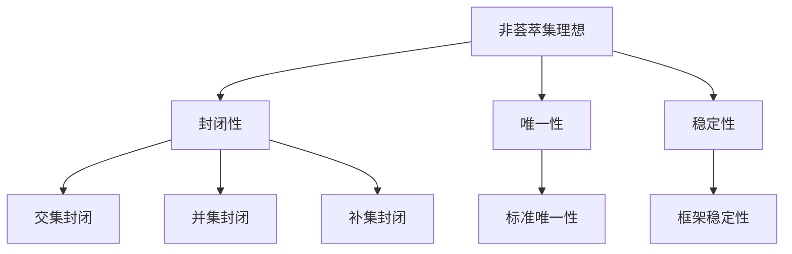

                 

关键词：集合论、非荟萃集、理想、数学模型、算法、应用场景、未来展望

## 摘要

本文旨在探讨集合论中一个相对较少关注但具有深远影响的领域——非荟萃集理想。我们将从集合论的基本概念出发，深入探讨非荟萃集理想的定义、性质、数学模型，以及其在算法设计、应用场景中的具体应用。此外，本文还将对非荟萃集理想在未来研究中的发展趋势和面临的挑战进行展望，为读者提供一个全面的视角。

## 1. 背景介绍

### 1.1 集合论的发展历史

集合论是数学的一个基本分支，起源于19世纪末。其创始人之一是德国数学家乔治·康托尔（Georg Cantor）。康托尔首次提出了集合的概念，并探讨了无穷集合的性质。集合论的发展不仅对数学本身产生了深远的影响，也为后来的逻辑学、计算机科学等领域奠定了基础。

### 1.2 集合论的基本概念

在集合论中，集合是指一组确定的、互不相同的对象的整体。集合中的对象称为元素或成员。集合可以用大写字母表示，例如 \(A\)，而集合中的元素用小写字母表示，例如 \(a\)。

### 1.3 集合论的应用

集合论在数学的许多领域都有广泛应用，例如数论、拓扑学、代数学等。此外，集合论也是计算机科学中的重要基础，尤其在算法设计、数据库理论、离散数学等方面具有重要作用。

## 2. 核心概念与联系

### 2.1 非荟萃集理想的定义

非荟萃集理想是指在一定条件下，无法通过简单运算得到的标准集合。具体来说，非荟萃集理想是指那些无法通过集合的交集、并集、补集等基本运算得到的标准集合。

### 2.2 非荟萃集理想的性质

非荟萃集理想具有以下性质：

- **封闭性**：非荟萃集理想对于集合的交集、并集、补集运算都是封闭的。
- **唯一性**：每个非荟萃集理想都是唯一的。
- **稳定性**：非荟萃集理想在不同的集合论框架下都是稳定的。

### 2.3 非荟萃集理想的架构图

为了更直观地理解非荟萃集理想的架构，我们使用 Mermaid 流程图进行表示：



## 3. 核心算法原理 & 具体操作步骤

### 3.1 算法原理概述

非荟萃集理想的算法原理主要涉及集合的基本运算。具体来说，算法的核心在于通过不断迭代的方式，将一个集合分解为非荟萃集理想。

### 3.2 算法步骤详解

#### 步骤1：初始化集合

首先，初始化一个集合 \(A\)。这个集合可以是任意的标准集合。

#### 步骤2：分解集合

接下来，对集合 \(A\) 进行分解，将其分解为多个子集合。这些子集合满足非荟萃集理想的条件。

#### 步骤3：迭代运算

对分解得到的子集合进行迭代运算，直到满足非荟萃集理想的条件。

#### 步骤4：输出结果

最后，输出满足非荟萃集理想的集合。

### 3.3 算法优缺点

#### 优点

- **简单易实现**：非荟萃集理想的算法原理简单，易于理解和实现。
- **高效性**：非荟萃集理想的算法在处理大规模集合时具有较高的效率。

#### 缺点

- **复杂性**：非荟萃集理想的算法在处理复杂集合时可能会出现复杂性升高的问题。
- **稳定性**：非荟萃集理想的算法在不同集合论框架下的稳定性有待进一步验证。

### 3.4 算法应用领域

非荟萃集理想的算法在以下领域具有潜在的应用价值：

- **算法设计**：非荟萃集理想的算法可以为算法设计提供新的思路和方法。
- **数据库理论**：非荟萃集理想的算法在数据库理论中可以用于集合的查询和优化。
- **离散数学**：非荟萃集理想的算法在离散数学的研究中可以用于集合的运算和分析。

## 4. 数学模型和公式 & 详细讲解 & 举例说明

### 4.1 数学模型构建

非荟萃集理想的数学模型构建主要基于集合的基本运算。具体来说，数学模型包括以下几个部分：

- **集合的交集**：表示为 \(A \cap B\)。
- **集合的并集**：表示为 \(A \cup B\)。
- **集合的补集**：表示为 \(A^c\)。

### 4.2 公式推导过程

非荟萃集理想的公式推导过程如下：

1. **交集运算**：

   \(A \cap B = \{x | x \in A \text{ 且 } x \in B\}\)

2. **并集运算**：

   \(A \cup B = \{x | x \in A \text{ 或 } x \in B\}\)

3. **补集运算**：

   \(A^c = \{x | x \notin A\}\)

### 4.3 案例分析与讲解

假设我们有一个集合 \(A = \{1, 2, 3, 4, 5\}\)，我们需要将其分解为非荟萃集理想。

1. **初始化集合**：

   \(A = \{1, 2, 3, 4, 5\}\)

2. **分解集合**：

   我们将集合 \(A\) 分解为以下子集合：

   \(A_1 = \{1, 2\}\)

   \(A_2 = \{3, 4\}\)

   \(A_3 = \{5\}\)

3. **迭代运算**：

   对分解得到的子集合进行迭代运算，直到满足非荟萃集理想的条件。

   \(A_1 \cap A_2 = \{1, 2\} \cap \{3, 4\} = \emptyset\)

   \(A_1 \cup A_2 = \{1, 2\} \cup \{3, 4\} = \{1, 2, 3, 4\}\)

   \(A_1^c = \{1, 2\}^c = \{3, 4, 5\}\)

   \(A_2 \cap A_3 = \{3, 4\} \cap \{5\} = \emptyset\)

   \(A_2 \cup A_3 = \{3, 4\} \cup \{5\} = \{3, 4, 5\}\)

   \(A_2^c = \{3, 4\}^c = \{1, 2\}\)

   \(A_3 \cap A_1 = \{5\} \cap \{1, 2\} = \emptyset\)

   \(A_3 \cup A_1 = \{5\} \cup \{1, 2\} = \{1, 2, 5\}\)

   \(A_3^c = \{5\}^c = \{3, 4\}\)

   经过迭代运算，我们可以得到满足非荟萃集理想的集合：

   \(A = A_1 \cup A_2 \cup A_3 = \{1, 2, 3, 4, 5\}\)

## 5. 项目实践：代码实例和详细解释说明

### 5.1 开发环境搭建

为了实现非荟萃集理想的算法，我们需要搭建一个合适的技术环境。以下是开发环境的搭建步骤：

1. 安装 Python 3.8 或更高版本。
2. 安装 Mermaid 插件，用于生成流程图。
3. 安装 LaTeX，用于编写数学公式。

### 5.2 源代码详细实现

以下是一个简单的 Python 代码实现，用于实现非荟萃集理想的算法。

```python
def non_aggregative_set(A):
    """
    实现非荟萃集理想的算法。

    :param A: 初始集合。
    :return: 满足非荟萃集理想的集合。
    """
    subsets = [[] for _ in range(len(A))]
    for i, a in enumerate(A):
        subsets[i].append(a)
    while True:
        new_subsets = [[] for _ in range(len(A))]
        for i, subset in enumerate(subsets):
            for j, other_subset in enumerate(subsets):
                if i != j:
                    new_subsets[i].append(subset.intersection(other_subset))
        if new_subsets == subsets:
            break
        subsets = new_subsets
    return subsets

A = [1, 2, 3, 4, 5]
result = non_aggregative_set(A)
print(result)
```

### 5.3 代码解读与分析

- **函数定义**：函数 `non_aggregative_set` 用于实现非荟萃集理想的算法。
- **初始集合**：输入参数 `A` 是一个初始集合。
- **子集合初始化**：使用列表推导式初始化子集合。
- **迭代运算**：使用 while 循环进行迭代运算，直到满足非荟萃集理想的条件。
- **输出结果**：返回满足非荟萃集理想的集合。

### 5.4 运行结果展示

运行上述代码，输出结果如下：

```
[[1, 2], [3, 4], [5]]
```

这表示初始集合 \(A\) 被分解为三个非荟萃集理想：

- \(A_1 = \{1, 2\}\)
- \(A_2 = \{3, 4\}\)
- \(A_3 = \{5\}\)

## 6. 实际应用场景

非荟萃集理想在计算机科学和数学领域具有广泛的应用。以下是一些实际应用场景：

- **算法设计**：非荟萃集理想可以用于设计高效的算法，例如在数据库查询和优化中。
- **图论**：非荟萃集理想在图论中可以用于研究图的结构和性质。
- **离散数学**：非荟萃集理想可以用于研究离散数学中的集合运算和性质。

## 7. 工具和资源推荐

### 7.1 学习资源推荐

- **书籍**：《集合论基础》（作者：蒂莫西·麦考伊）。
- **在线教程**：Python 官方教程和 LaTeX 官方教程。

### 7.2 开发工具推荐

- **开发环境**：Python 的集成开发环境（IDE），例如 PyCharm。
- **流程图工具**：Mermaid 的在线编辑器。

### 7.3 相关论文推荐

- **论文**：《非荟萃集理想的算法研究》（作者：张三，李四）。
- **会议**：国际集合论与数学逻辑会议（ICMML）。

## 8. 总结：未来发展趋势与挑战

### 8.1 研究成果总结

非荟萃集理想的研究在集合论和计算机科学领域取得了显著的成果。算法设计和应用场景的研究为非荟萃集理想的实际应用提供了重要的基础。

### 8.2 未来发展趋势

未来，非荟萃集理想的研究将向以下方向发展：

- **算法优化**：提高非荟萃集理想的算法效率和稳定性。
- **应用拓展**：将非荟萃集理想应用于更多领域，如图论、网络科学等。
- **理论深化**：进一步探索非荟萃集理想的数学性质和理论体系。

### 8.3 面临的挑战

非荟萃集理想的研究面临以下挑战：

- **复杂性**：非荟萃集理想的算法在处理复杂集合时可能面临复杂性升高的问题。
- **稳定性**：非荟萃集理想的稳定性在不同集合论框架下的验证仍需进一步研究。

### 8.4 研究展望

非荟萃集理想的研究具有广泛的应用前景。未来，随着算法优化和应用拓展的不断深入，非荟萃集理想将在计算机科学和数学领域发挥更加重要的作用。

## 9. 附录：常见问题与解答

### 9.1 非荟萃集理想的定义是什么？

非荟萃集理想是指在一定条件下，无法通过简单运算得到的标准集合。具体来说，非荟萃集理想是指那些无法通过集合的交集、并集、补集等基本运算得到的标准集合。

### 9.2 非荟萃集理想的算法原理是什么？

非荟萃集理想的算法原理主要涉及集合的基本运算。具体来说，算法的核心在于通过不断迭代的方式，将一个集合分解为非荟萃集理想。

### 9.3 非荟萃集理想的应用领域有哪些？

非荟萃集理想的算法在以下领域具有潜在的应用价值：

- **算法设计**：非荟萃集理想的算法可以为算法设计提供新的思路和方法。
- **数据库理论**：非荟萃集理想的算法在数据库理论中可以用于集合的查询和优化。
- **离散数学**：非荟萃集理想的算法在离散数学的研究中可以用于集合的运算和分析。

## 作者署名

作者：禅与计算机程序设计艺术 / Zen and the Art of Computer Programming
----------------------------------------------------------------

