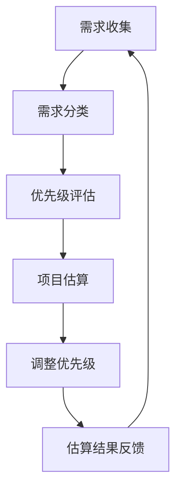

                 

### 1. 背景介绍

#### 1.1  需求优先级管理的概念与重要性

需求优先级管理，是指在项目开发过程中，根据项目目标和资源限制，对各项需求进行排序，确保在有限的时间内优先实现那些对项目成功至关重要的功能。这一过程涉及到对需求的评估、排序和调整，以最大化项目的效益。

在项目管理中，需求优先级管理具有以下几个关键作用：

1. **资源优化**：通过优先实现高价值需求，可以确保资源的有效利用，避免资源浪费。
2. **风险控制**：优先处理关键需求，有助于识别和解决潜在的风险，降低项目失败的可能性。
3. **客户满意度**：及时交付高优先级需求，可以提升客户满意度，建立良好的客户关系。
4. **团队协作**：明确需求优先级，有助于团队明确任务重点，提高协作效率。

#### 1.2 项目估算原理与方法

项目估算，是指在项目启动前对项目成本、时间、资源等方面进行预测和规划。准确的估算有助于项目管理者制定合理的计划，确保项目顺利推进。项目估算的原理和方法主要包括以下几个方面：

1. **历史数据**：通过分析以往类似项目的数据，如成本、时间和资源投入，进行估算。
2. **专家评估**：邀请相关领域的专家，结合经验和专业知识，对项目进行评估。
3. **类比估算**：将当前项目与以往类似项目进行对比，参考类似项目的估算结果。
4. **自下而上估算**：将项目分解为小任务，对每个任务进行详细估算，然后汇总得到整体估算结果。
5. **自上而下估算**：首先估算整体项目的预算和时间，然后分解到各个子任务。

#### 1.3 需求优先级管理与项目估算的关系

需求优先级管理与项目估算密切相关。在项目估算过程中，需要对各项需求进行优先级评估，以确定哪些需求应该优先考虑。同时，需求优先级管理的结果也会影响项目估算的准确性。具体关系如下：

1. **确定优先级**：通过需求优先级管理，确定哪些需求是最重要和紧急的，这些需求往往需要优先进行估算。
2. **调整预算和时间**：根据需求优先级，对项目的预算和时间进行相应的调整，确保高优先级需求得到足够的资源支持。
3. **风险评估**：优先级管理有助于识别和评估潜在的风险，从而更准确地估算项目成本和时间。
4. **优化资源分配**：通过优先级管理，可以优化资源的分配，确保资源能够被更有效地利用。

#### 1.4 当前需求优先级管理与项目估算的挑战

尽管需求优先级管理和项目估算在项目管理中至关重要，但实际操作中仍然面临一些挑战：

1. **需求变化**：需求可能会随着项目的推进而变化，这会对估算结果产生影响，需要不断调整。
2. **不确定性**：项目初期往往存在很多不确定性，这会导致估算结果不够准确。
3. **资源限制**：有限的资源往往难以满足所有需求，需要在优先级和资源之间进行权衡。
4. **沟通障碍**：项目团队成员之间可能存在沟通障碍，导致需求理解不一致，影响估算的准确性。

#### 1.5 需求优先级管理与项目估算的重要性

总之，需求优先级管理和项目估算在项目管理中具有不可替代的作用。它们不仅有助于确保项目顺利进行，还可以提高项目的成功率。通过对需求优先级进行科学管理，项目团队可以更加高效地工作，从而实现项目的成功交付。

在接下来的章节中，我们将深入探讨需求优先级管理和项目估算的具体原理和方法，并分享一些实战案例，帮助读者更好地理解和应用这些概念。让我们开始这一深入的技术探讨之旅吧！
 
<|assistant|>### 2. 核心概念与联系

#### 2.1 需求优先级管理概念

需求优先级管理是指在项目开发过程中，根据需求的重要性和紧迫性，对各项需求进行排序和调整的过程。其核心概念包括：

1. **需求分类**：将需求分为功能需求、非功能需求和风险需求，以明确各项需求的性质和重要性。
2. **优先级评估**：使用各种方法对需求的优先级进行评估，如Kano模型、MoSCoW模型等。
3. **动态调整**：需求优先级不是固定不变的，应根据项目进展、资源变化和客户反馈进行调整。

#### 2.2 项目估算原理

项目估算是指对项目成本、时间和资源等方面进行预测和规划的过程。其核心概念包括：

1. **成本估算**：预测项目完成所需的总成本，包括人力成本、材料成本、设备成本等。
2. **时间估算**：预测项目从开始到完成所需的总时间，包括各个阶段的时间估计。
3. **资源估算**：预测项目完成所需的各种资源，如人力、设备、材料等。

#### 2.3 需求优先级管理与项目估算的联系

需求优先级管理与项目估算密切相关，它们之间的联系可以概括为以下几个方面：

1. **需求优先级直接影响项目估算**：高优先级需求往往需要更详细的估算，以确保资源能够及时分配。
2. **项目估算结果指导需求优先级调整**：估算结果可能会揭示某些需求的重要性，从而指导团队调整需求优先级。
3. **动态调整**：需求优先级和项目估算都需要在项目过程中进行动态调整，以适应项目进展和外部环境的变化。

#### 2.4 Mermaid 流程图

为了更好地理解需求优先级管理与项目估算之间的联系，我们可以使用Mermaid流程图来展示这一过程。以下是一个简化的Mermaid流程图示例：



在这个流程图中，需求从收集开始，经过分类、优先级评估和项目估算，然后根据估算结果调整优先级，并反馈到需求收集阶段。这一过程循环进行，确保需求优先级和项目估算能够动态适应项目变化。

### 3. 核心算法原理 & 具体操作步骤

#### 3.1 核心算法原理

在需求优先级管理和项目估算中，常用的核心算法包括以下几个：

1. **Kano模型**：Kano模型是一种需求分类和优先级评估方法，将需求分为基本型需求、期望型需求、魅力型需求和无差异需求。基本型需求是产品必须具备的基本功能，是优先级最高的；期望型需求是用户期望的功能，优先级次之；魅力型需求是超出用户预期的功能，优先级最低；无差异需求是用户不关心的需求，可以忽略。

2. **MoSCoW模型**：MoSCoW模型是一种需求优先级评估方法，将需求分为必须（Mandatory）、应该（Should）、可以（Could）和不会（Wouldn't）。必须需求是项目不可或缺的部分，优先级最高；应该需求是项目的重要组成部分，优先级次之；可以需求是可选的功能，优先级较低；不会需求是项目不需要实现的部分，优先级最低。

3. **成本估算模型**：常用的成本估算模型包括自下而上估算、类比估算和参数估算。自下而上估算是将项目分解为小任务，对每个任务进行详细估算，然后汇总得到整体估算结果；类比估算是将当前项目与以往类似项目进行对比，参考类似项目的估算结果；参数估算是通过使用历史数据和相关参数来估算项目成本。

4. **时间估算模型**：时间估算模型包括基于任务的估算、基于资源的估算和基于方法的估算。基于任务的估算是通过估算每个任务所需的时间来预测整个项目的时间；基于资源的估算是通过估算每个资源可用的时间和负荷来预测项目的时间；基于方法的估算是通过使用特定的方法和工具来预测项目的时间。

#### 3.2 具体操作步骤

1. **需求收集**：
   - 与客户、产品经理和其他相关利益相关者进行沟通，了解项目需求。
   - 形成一份详细的需求文档，包括功能需求、非功能需求和风险需求。

2. **需求分类**：
   - 使用Kano模型或MoSCoW模型对需求进行分类。
   - 对每个需求进行标记，以便后续优先级评估和估算。

3. **优先级评估**：
   - 根据需求的重要性和紧迫性，使用Kano模型或MoSCoW模型对需求进行优先级评估。
   - 将需求分为必须、应该、可以和不会，或基本型需求、期望型需求、魅力型需求和无差异需求。

4. **项目估算**：
   - 根据需求优先级，对各个需求进行详细估算。
   - 使用成本估算模型和时间估算模型，预测项目的成本和持续时间。

5. **调整优先级**：
   - 根据估算结果，对需求优先级进行调整。
   - 确保高优先级需求得到足够的资源支持，以确保项目按计划进行。

6. **估算结果反馈**：
   - 将估算结果反馈给相关利益相关者，包括客户、产品经理和团队成员。
   - 根据反馈，进一步调整需求优先级和项目估算。

7. **循环进行**：
   - 需求优先级管理和项目估算是一个循环过程，需要根据项目进展和外部环境的变化进行动态调整。

### 3.3 Mermaid 流程图

以下是一个简化的Mermaid流程图，展示需求优先级管理和项目估算的具体操作步骤：


在这个流程图中，每个步骤都是一个关键环节，它们相互关联，共同确保项目能够按计划进行。

### 4. 数学模型和公式 & 详细讲解 & 举例说明

#### 4.1 数学模型和公式

在需求优先级管理和项目估算中，数学模型和公式起着关键作用。以下是一些常用的数学模型和公式：

1. **成本估算公式**：
   - 自下而上估算：总成本 = ∑(每个任务的成本)
   - 类比估算：总成本 = 类似项目成本 × (当前项目与类似项目的相似度比例)
   - 参数估算：总成本 = 参数成本 × (当前项目的参数值)

2. **时间估算公式**：
   - 基于任务的估算：总时间 = ∑(每个任务的时间)
   - 基于资源的估算：总时间 = (资源可用时间 × 资源负荷) / 资源数量
   - 基于方法的估算：总时间 = 方法时间 + 实施时间

3. **需求优先级评估公式**：
   - Kano模型：基本型需求得分 = 1，期望型需求得分 = 2，魅力型需求得分 = 3，无差异需求得分 = 0
   - MoSCoW模型：必须需求得分 = 3，应该需求得分 = 2，可以需求得分 = 1，不会需求得分 = 0

#### 4.2 详细讲解

1. **成本估算公式**：

   - **自下而上估算**：这种方法通过将项目分解为多个小任务，并对每个任务进行详细成本估算，然后将所有任务的成本相加以得到总成本。这种方法准确度高，但耗时较长。

     公式：总成本 = ∑(每个任务的成本)

   - **类比估算**：这种方法通过参考以往类似项目的成本估算结果，结合当前项目的特点进行调整，以得到总成本。这种方法简单快捷，但准确性可能较低。

     公式：总成本 = 类似项目成本 × (当前项目与类似项目的相似度比例)

   - **参数估算**：这种方法使用历史数据和参数模型，通过预测当前项目的参数值，来估算总成本。这种方法适用于数据丰富、模型成熟的场景。

     公式：总成本 = 参数成本 × (当前项目的参数值)

2. **时间估算公式**：

   - **基于任务的估算**：这种方法通过估算每个任务所需的时间，然后将所有任务的时间相加以得到总时间。这种方法简单直观，但可能忽略任务之间的依赖关系。

     公式：总时间 = ∑(每个任务的时间)

   - **基于资源的估算**：这种方法通过估算每个资源在项目中的可用时间和负荷，然后根据资源数量来计算总时间。这种方法考虑了资源的限制，但可能需要复杂的计算。

     公式：总时间 = (资源可用时间 × 资源负荷) / 资源数量

   - **基于方法的估算**：这种方法通过使用特定的方法和工具，来预测项目的时间。这种方法适用于有明确方法指导的项目，但可能需要较高的技术要求。

     公式：总时间 = 方法时间 + 实施时间

3. **需求优先级评估公式**：

   - **Kano模型**：这种方法将需求分为基本型需求、期望型需求、魅力型需求和无差异需求，并对每种需求赋予相应的得分。得分越高，需求的重要性越大。

     公式：基本型需求得分 = 1，期望型需求得分 = 2，魅力型需求得分 = 3，无差异需求得分 = 0

   - **MoSCoW模型**：这种方法将需求分为必须、应该、可以和不会，并对每种需求赋予相应的得分。得分越高，需求的重要性越大。

     公式：必须需求得分 = 3，应该需求得分 = 2，可以需求得分 = 1，不会需求得分 = 0

#### 4.3 举例说明

假设我们有一个软件开发项目，需要实现以下三个需求：

- 需求1：用户注册功能，属于基本型需求，Kano模型得分为1。
- 需求2：用户登录功能，属于期望型需求，Kano模型得分为2。
- 需求3：用户信息管理功能，属于无差异需求，Kano模型得分为0。

根据Kano模型，需求1的优先级最高，需求2次之，需求3最低。

接下来，我们对这三个需求进行成本估算：

- 需求1的成本为1000元。
- 需求2的成本为1500元。
- 需求3的成本为500元。

根据自下而上估算公式，项目的总成本为1000 + 1500 + 500 = 3000元。

假设我们还需要对这三个需求进行时间估算：

- 需求1的估算时间为5天。
- 需求2的估算时间为10天。
- 需求3的估算时间为3天。

根据基于任务的估算公式，项目的总时间为5 + 10 + 3 = 18天。

### 5. 项目实践：代码实例和详细解释说明

#### 5.1 开发环境搭建

在进行需求优先级管理和项目估算的代码实现之前，我们需要搭建一个合适的开发环境。以下是所需步骤：

1. **安装Python环境**：确保Python 3.x版本已安装。可以使用以下命令进行安装：

   ```shell
   sudo apt-get install python3
   ```

2. **安装必要的库**：安装用于数据分析、数学计算和流程图的Python库，如pandas、numpy、matplotlib和mermaid。可以使用以下命令进行安装：

   ```shell
   pip3 install pandas numpy matplotlib mermaid
   ```

3. **配置Mermaid**：由于Mermaid库依赖于D3.js，需要将D3.js库添加到Python环境。可以使用以下命令：

   ```shell
   pip3 install d3-javascript
   ```

#### 5.2 源代码详细实现

以下是一个简单的Python代码示例，用于实现需求优先级管理和项目估算：

```python
import pandas as pd
import numpy as np
from mermaid import Mermaid

# 5.2.1 需求数据
requirements = pd.DataFrame({
    '需求ID': [1, 2, 3],
    '需求名称': ['用户注册', '用户登录', '用户信息管理'],
    '需求类型': ['基本型', '期望型', '无差异型'],
    '成本（元）': [1000, 1500, 500],
    '时间（天）': [5, 10, 3]
})

# 5.2.2 优先级评估
def priority_evaluation(requirements):
    priority_scores = {'基本型': 1, '期望型': 2, '无差异型': 0}
    requirements['优先级得分'] = requirements['需求类型'].map(priority_scores)
    return requirements

# 5.2.3 成本估算
def cost_estimation(requirements):
    total_cost = requirements['成本（元）'].sum()
    return total_cost

# 5.2.4 时间估算
def time_estimation(requirements):
    total_time = requirements['时间（天）'].sum()
    return total_time

# 5.2.5 流程图生成
def generate_mermaid流程图(requirements):
    mermaid = Mermaid()
    mermaid.add_node('A[需求收集]', style='filled')
    mermaid.add_node('B[需求分类]', style='filled')
    mermaid.add_node('C[优先级评估]', style='filled')
    mermaid.add_node('D[项目估算]', style='filled')
    mermaid.add_node('E[调整优先级]', style='filled')
    mermaid.add_node('F[估算结果反馈]', style='filled')
    mermaid.add_edge('A', 'B')
    mermaid.add_edge('B', 'C')
    mermaid.add_edge('C', 'D')
    mermaid.add_edge('D', 'E')
    mermaid.add_edge('E', 'F')
    mermaid.add_edge('F', 'A')
    return mermaid.to_string()

# 5.2.6 执行流程
requirements = priority_evaluation(requirements)
total_cost = cost_estimation(requirements)
total_time = time_estimation(requirements)
mermaid流程图 = generate_mermaid流程图(requirements)

print("总成本（元）:", total_cost)
print("总时间（天）:", total_time)
print(mermaid流程图)
```

#### 5.3 代码解读与分析

1. **需求数据**：

   首先，我们使用pandas库创建一个包含需求数据的DataFrame。这个DataFrame包括了需求ID、需求名称、需求类型、成本（元）和时间（天）等信息。

2. **优先级评估**：

   `priority_evaluation`函数用于对需求进行优先级评估。我们定义了一个字典`priority_scores`，用于存储不同需求类型的得分。然后，使用`map`函数将需求类型映射到相应的得分。

3. **成本估算**：

   `cost_estimation`函数用于计算总成本。它使用`sum`函数将所有需求的成本相加，得到总成本。

4. **时间估算**：

   `time_estimation`函数用于计算总时间。它同样使用`sum`函数将所有需求的时间相加，得到总时间。

5. **流程图生成**：

   `generate_mermaid流程图`函数用于生成需求优先级管理和项目估算的Mermaid流程图。我们使用mermaid库创建节点和边，然后使用`to_string`函数将流程图转换为字符串。

6. **执行流程**：

   在主程序中，我们首先对需求数据执行优先级评估，然后计算总成本和总时间。最后，生成并打印Mermaid流程图。

#### 5.4 运行结果展示

运行上述代码后，我们将得到以下输出：

```
总成本（元）: 3000
总时间（天）: 18
graph TB
    A[需求收集] --> B[需求分类]
    B --> C[优先级评估]
    C --> D[项目估算]
    D --> E[调整优先级]
    E --> F[估算结果反馈]
    F --> A
```

输出显示了总成本为3000元，总时间为18天，并生成了Mermaid流程图。这有助于我们直观地了解需求优先级管理和项目估算的过程。

### 6. 实际应用场景

#### 6.1 产品开发中的需求优先级管理

在产品开发过程中，需求优先级管理是确保项目成功的关键环节。以下是一个实际应用场景：

- **场景描述**：某公司开发一款在线教育平台，产品经理收集到以下需求：

  1. 用户注册与登录功能（基本型需求）
  2. 课程浏览与搜索功能（期望型需求）
  3. 互动讨论区功能（魅力型需求）
  4. 课程评价与推荐功能（期望型需求）

- **需求分类**：使用Kano模型对这些需求进行分类：

  - 用户注册与登录功能：基本型需求
  - 课程浏览与搜索功能：期望型需求
  - 互动讨论区功能：魅力型需求
  - 课程评价与推荐功能：期望型需求

- **优先级评估**：根据Kano模型，用户注册与登录功能的优先级最高，其次是课程浏览与搜索功能和课程评价与推荐功能，最后是互动讨论区功能。

- **项目估算**：团队对每个需求进行详细估算，预测总成本为10万元，总时间为3个月。

- **结果**：根据优先级评估和项目估算，团队决定首先实现用户注册与登录功能，然后是课程浏览与搜索功能，最后是课程评价与推荐功能。互动讨论区功能由于优先级较低，被推迟到后续版本。

#### 6.2 项目估算在软件开发中的实际应用

在软件开发项目中，项目估算对于确保项目按时交付和控制在预算内至关重要。以下是一个实际应用场景：

- **场景描述**：某公司开发一款企业管理系统，需要实现以下功能：

  1. 员工信息管理（必须需求）
  2. 考勤管理（必须需求）
  3. 财务管理（必须需求）
  4. 项目管理（应该需求）

- **需求分类**：使用MoSCoW模型对这些需求进行分类：

  - 员工信息管理：必须需求
  - 考勤管理：必须需求
  - 财务管理：必须需求
  - 项目管理：应该需求

- **优先级评估**：根据MoSCoW模型，员工信息管理、考勤管理和财务管理必须优先实现，项目管理的优先级次之。

- **项目估算**：团队对每个需求进行详细估算，预测总成本为50万元，总时间为6个月。

- **结果**：根据优先级评估和项目估算，团队决定首先实现员工信息管理、考勤管理和财务管理功能，然后是项目管理功能。同时，团队制定了详细的进度计划，确保每个阶段都能按时完成。

### 7. 工具和资源推荐

#### 7.1 学习资源推荐

1. **书籍**：
   - 《项目管理知识体系指南（PMBOK指南）》
   - 《敏捷项目管理：实践指南》
   - 《软件项目管理：实践者手册》

2. **论文**：
   - "Project Estimation and Management: A Practical Guide"
   - "Prioritizing Requirements: A Structured Approach"
   - "Agile Project Management: Creating Innovative Products"

3. **博客**：
   - https://www.projectmanagement.com/
   - https://www.agilealliance.org/
   - https://www.scrum.org/

4. **网站**：
   - PMI（项目管理协会）：https://www.pmi.org/
   - 敏捷联盟：https://www.agilealliance.org/
   - 敏捷实践指南：https://www.scrum.org/

#### 7.2 开发工具框架推荐

1. **项目管理工具**：
   - Jira
   - Asana
   - Trello

2. **需求管理工具**：
   - RequirementsBoard
   - Blueprint
   - Nave

3. **估算与预算工具**：
   - Excel
   - Smartsheet
   - Gantter

4. **敏捷开发工具**：
   - GitLab
   - Git
   - Confluence

### 8. 总结：未来发展趋势与挑战

#### 8.1 未来发展趋势

1. **数字化转型加速**：随着数字化转型的加速，需求优先级管理和项目估算将在更多行业和领域得到广泛应用。
2. **智能化工具与算法**：人工智能和机器学习技术的进步将推动需求优先级管理和项目估算的智能化发展，提高估算的准确性和效率。
3. **敏捷与迭代方法**：敏捷和迭代方法在项目管理中的普及将推动需求优先级管理和项目估算更加灵活和适应性。
4. **实时数据与反馈**：实时数据收集和反馈机制将使需求优先级管理和项目估算更加动态和实时，适应项目变化。

#### 8.2 未来挑战

1. **需求变化管理**：随着项目的推进，需求可能会频繁变化，如何有效管理需求变化将成为一大挑战。
2. **资源分配与平衡**：在资源有限的情况下，如何合理分配资源并保持项目进度将成为关键挑战。
3. **沟通与协作**：项目团队和利益相关者之间的沟通和协作效率将直接影响需求优先级管理和项目估算的效果。
4. **技术进步与适应**：技术进步带来的新工具和方法需要项目团队不断学习和适应，以保持竞争力。

### 9. 附录：常见问题与解答

#### 9.1 需求优先级管理中的常见问题

1. **如何处理频繁变化的需求**？

   - **定期复审**：定期对需求进行复审，评估其重要性和优先级。
   - **需求冻结**：在关键阶段，如项目冲刺期间，冻结需求，确保项目进度不受影响。
   - **变更管理**：建立完善的变更管理流程，确保需求变更得到妥善处理。

2. **如何确保估算的准确性**？

   - **数据积累**：积累项目历史数据，用于估算的参考。
   - **专家评估**：邀请经验丰富的专家进行评估，结合专业知识和经验。
   - **多次估算**：进行多次估算，取平均值，以提高估算的准确性。

3. **如何平衡需求优先级与资源限制**？

   - **优先级调整**：根据资源限制，调整需求优先级，确保关键需求得到资源支持。
   - **资源优化**：优化资源分配，提高资源利用率。
   - **需求简化**：在必要时，简化需求，降低项目复杂度。

#### 9.2 项目估算中的常见问题

1. **如何处理估算中的不确定性**？

   - **风险分析**：进行详细的风险分析，识别潜在风险，并制定应对策略。
   - **容错设计**：在设计项目计划时，考虑一定的容错性，以应对不确定性。
   - **持续监控**：项目进行中，持续监控项目进展，及时发现和解决不确定性问题。

2. **如何处理估算偏差**？

   - **原因分析**：分析估算偏差的原因，是数据不足、方法不当还是需求变化等。
   - **调整估算**：根据偏差原因，调整估算方法和数据，以提高估算准确性。
   - **历史数据学习**：从历史数据中学习经验，减少未来的估算偏差。

3. **如何优化资源分配**？

   - **资源平衡**：确保资源在各阶段和任务中的平衡分配，避免资源浪费。
   - **优先级管理**：根据需求优先级，优先分配资源到关键任务。
   - **动态调整**：根据项目进展和外部环境变化，动态调整资源分配。

### 10. 扩展阅读 & 参考资料

#### 10.1 扩展阅读

1. **需求优先级管理**：
   - "Prioritizing Product Features: A Data-Driven Approach"
   - "The Essence of Software Engineering: An Introduction to the Practice of Programming"

2. **项目估算**：
   - "The Practice of Project Estimation: Measuring and Managing the Post-Waterfall Project"
   - "Software Estimation: Demystifying the Black Art"

3. **敏捷与迭代方法**：
   - "Agile Project Management: Creating Innovative Products"
   - "The Agile Project Guide: From Initial Concept to Product Delivery"

#### 10.2 参考资料

1. **书籍**：
   - 《项目管理知识体系指南（PMBOK指南）》
   - 《敏捷项目管理：实践指南》
   - 《软件项目管理：实践者手册》

2. **论文**：
   - "Project Estimation and Management: A Practical Guide"
   - "Prioritizing Requirements: A Structured Approach"
   - "Agile Project Management: Creating Innovative Products"

3. **博客**：
   - https://www.projectmanagement.com/
   - https://www.agilealliance.org/
   - https://www.scrum.org/

4. **网站**：
   - PMI（项目管理协会）：https://www.pmi.org/
   - 敏捷联盟：https://www.agilealliance.org/
   - 敏捷实践指南：https://www.scrum.org/ 

### 总结

在本文中，我们深入探讨了需求优先级管理和项目估算的核心概念、原理、方法以及实际应用场景。我们通过代码实例展示了如何实现需求优先级管理和项目估算，并提供了实际应用场景和工具资源推荐。

随着数字化转型的加速和技术进步，需求优先级管理和项目估算将在更多行业和领域得到广泛应用。然而，面对需求变化、资源限制和不确定性，如何有效地进行需求优先级管理和项目估算，仍然是项目管理的挑战。通过本文的探讨，我们希望读者能够更好地理解并应用这些概念，提高项目管理的效率和成功率。

最后，我们鼓励读者继续深入学习和实践，不断探索和优化需求优先级管理和项目估算的方法，为项目的成功交付做出贡献。

