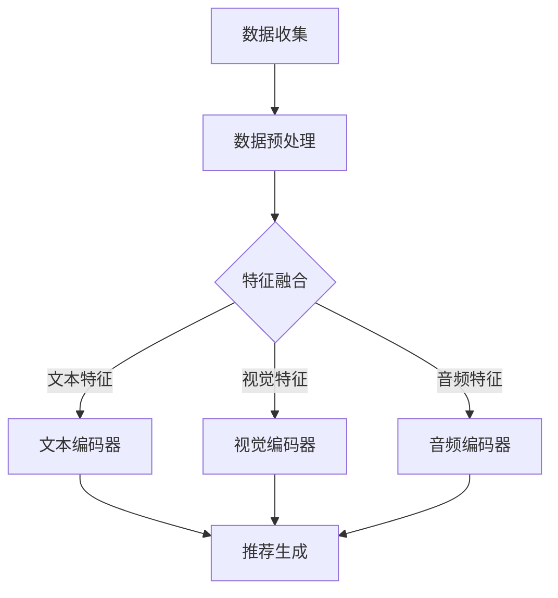

                 

### 音视频推荐的创新：LLM的应用

#### 关键词：
- 音视频推荐
- 大型语言模型（LLM）
- 深度学习
- 个性化推荐
- 跨模态学习

#### 摘要：
随着互联网和多媒体技术的发展，音视频内容在信息传播中的作用日益突出。传统的推荐系统已难以满足用户对个性化、多样性的需求。本文探讨了大型语言模型（LLM）在音视频推荐领域的应用，介绍了其核心概念、算法原理、数学模型、项目实践以及实际应用场景。通过本文，读者可以深入了解LLM如何为音视频推荐带来革命性变革。

## 1. 背景介绍

在数字媒体时代，音视频内容已经成为人们获取信息和娱乐的重要方式。从视频网站到社交媒体，从流媒体平台到在线教育，音视频内容的消费场景无处不在。然而，随着音视频内容的爆炸性增长，用户面临着信息过载的问题。如何从海量音视频内容中为用户提供个性化的推荐，成为了一个亟待解决的问题。

传统的推荐系统主要依赖于基于内容的推荐（Content-Based Recommendation）和协同过滤推荐（Collaborative Filtering）两种方法。基于内容的推荐系统通过分析音视频内容的元数据和标签，为用户推荐与其兴趣相似的内容。协同过滤推荐系统则通过收集用户的历史行为数据，利用用户之间的相似性进行推荐。这两种方法在处理简单文本数据时效果较好，但在处理复杂、多模态的音视频内容时，存在以下不足：

1. **内容理解局限**：音视频内容包含丰富的视觉和音频信息，传统推荐系统难以全面理解这些信息。
2. **数据稀疏问题**：协同过滤推荐系统依赖用户的历史行为数据，但用户的行为数据往往稀疏，导致推荐效果不佳。
3. **个性化不足**：传统推荐系统难以深入挖掘用户的潜在兴趣，推荐的个性化程度较低。

为了克服这些不足，近年来，深度学习和跨模态学习技术逐渐成为研究热点。特别是大型语言模型（LLM），如BERT、GPT等，凭借其强大的文本理解和生成能力，在自然语言处理领域取得了显著成果。本文将探讨LLM在音视频推荐领域的应用，通过融合文本、视觉和音频信息，实现更准确、个性化的推荐。

## 2. 核心概念与联系

#### 2.1 大型语言模型（LLM）

大型语言模型（LLM）是一种基于深度学习的自然语言处理模型，通过学习海量文本数据，能够理解、生成和预测文本。LLM的核心在于其强大的上下文理解能力，能够捕捉到文本中的细微语义和语法结构。例如，BERT和GPT是目前最为流行的两种LLM模型，BERT基于Transformer架构，通过双向编码器学习文本的上下文信息；GPT则通过生成预训练（Generative Pre-trained Transformer）的方式，利用自回归模型生成文本。

#### 2.2 音视频内容的跨模态学习

跨模态学习旨在将不同模态（文本、视觉、音频）的信息进行融合，以实现更全面的内容理解。在音视频推荐领域，跨模态学习可以帮助推荐系统更好地理解用户的兴趣和需求。例如，通过融合视频的视觉信息和音频信息，可以更准确地识别用户观看视频的主题和情感，从而提供更个性化的推荐。

#### 2.3 架构与流程

下面是一个简化的LLM在音视频推荐领域的架构和流程：

1. **数据收集**：收集用户的音视频观看记录、评论、搜索历史等数据。
2. **数据预处理**：对音视频内容进行标签提取、文本提取、音频特征提取等预处理操作。
3. **模型训练**：利用预处理后的数据，训练LLM模型，包括文本编码器、视觉编码器和音频编码器。
4. **特征融合**：将文本、视觉和音频特征进行融合，生成统一的特征向量。
5. **推荐生成**：利用融合后的特征向量，通过LLM模型生成推荐结果。

下面是一个使用Mermaid绘制的架构流程图：



#### 2.4 关键技术与挑战

在音视频推荐领域应用LLM，主要面临以下关键技术和挑战：

1. **数据质量**：高质量的数据是训练有效模型的基础。音视频内容的数据质量参差不齐，需要数据清洗和预处理技术。
2. **计算资源**：LLM模型通常需要大量的计算资源和存储空间，对于小型团队或企业来说，这是一个不小的挑战。
3. **模型解释性**：虽然LLM在推荐效果上具有优势，但其内部决策过程往往不够透明，难以解释。
4. **隐私保护**：音视频内容往往涉及用户隐私，如何保护用户隐私是一个重要的问题。

## 3. 核心算法原理 & 具体操作步骤

#### 3.1 文本编码器

文本编码器是LLM模型的核心组件，用于将文本数据转换为固定长度的向量表示。BERT和GPT是两种常见的文本编码器。

1. **BERT**：BERT（Bidirectional Encoder Representations from Transformers）是一种基于Transformer的双向编码器。它通过预训练方式学习文本的上下文信息，并能够捕捉到文本中的细微语义和语法结构。
2. **GPT**：GPT（Generative Pre-trained Transformer）是一种基于Transformer的自回归生成模型，通过生成预训练的方式，学习文本的生成规律。

具体操作步骤如下：

1. **数据准备**：收集用户的历史观看记录、评论、搜索历史等文本数据。
2. **数据预处理**：对文本数据进行清洗、去重、分词等预处理操作。
3. **模型训练**：利用预处理后的文本数据，训练BERT或GPT模型。
4. **文本编码**：将文本输入到训练好的模型中，得到文本的向量表示。

#### 3.2 视觉编码器

视觉编码器用于将视频的视觉信息转换为向量表示。常见的视觉编码器有CNN（卷积神经网络）和ViT（视觉Transformer）。

1. **CNN**：CNN（Convolutional Neural Network）是一种经典的图像处理模型，通过卷积层、池化层等操作，提取图像的特征。
2. **ViT**：ViT（Vision Transformer）是一种基于Transformer的视觉模型，通过自注意力机制，学习图像的特征。

具体操作步骤如下：

1. **数据准备**：收集视频数据，包括视频帧和视频标签。
2. **数据预处理**：对视频数据进行缩放、裁剪、翻转等预处理操作。
3. **模型训练**：利用预处理后的视频数据，训练CNN或ViT模型。
4. **视觉编码**：将视频帧输入到训练好的模型中，得到视频的向量表示。

#### 3.3 音频编码器

音频编码器用于将音频的音频信息转换为向量表示。常见的音频编码器有CNN和Transformer。

1. **CNN**：CNN（Convolutional Neural Network）是一种经典的音频处理模型，通过卷积层、池化层等操作，提取音频的特征。
2. **Transformer**：Transformer是一种基于自注意力机制的音频处理模型，能够捕捉到音频中的时间序列信息。

具体操作步骤如下：

1. **数据准备**：收集音频数据，包括音乐、语音等。
2. **数据预处理**：对音频数据进行去噪、降采样等预处理操作。
3. **模型训练**：利用预处理后的音频数据，训练CNN或Transformer模型。
4. **音频编码**：将音频输入到训练好的模型中，得到音频的向量表示。

#### 3.4 特征融合

特征融合是将文本、视觉和音频特征进行融合，生成统一的特征向量。常见的特征融合方法有矩阵乘法和拼接。

1. **矩阵乘法**：将不同模态的特征向量进行矩阵乘法操作，得到统一的特征向量。
2. **拼接**：将不同模态的特征向量进行拼接，得到统一的特征向量。

具体操作步骤如下：

1. **特征提取**：利用训练好的文本编码器、视觉编码器和音频编码器，提取不同模态的特征向量。
2. **特征融合**：利用矩阵乘法或拼接方法，将不同模态的特征向量进行融合，得到统一的特征向量。

#### 3.5 推荐生成

推荐生成是将统一的特征向量输入到训练好的LLM模型中，生成推荐结果。常见的推荐生成方法有文本生成和排序。

1. **文本生成**：利用训练好的LLM模型，生成用户感兴趣的文本内容。
2. **排序**：利用训练好的LLM模型，对候选音视频内容进行排序，生成推荐结果。

具体操作步骤如下：

1. **特征输入**：将统一的特征向量输入到训练好的LLM模型中。
2. **推荐生成**：利用LLM模型生成推荐结果，包括文本生成和排序。

## 4. 数学模型和公式 & 详细讲解 & 举例说明

#### 4.1 文本编码器的数学模型

BERT和GPT是两种常见的文本编码器，它们的数学模型有所不同。

1. **BERT**：

BERT模型的核心是一个双向编码器，其数学模型可以表示为：

\[ 
\text{BERT} = \text{BiLSTM} + \text{Self-Attention} + \text{Output} 
\]

其中，BiLSTM（双向长短期记忆网络）用于学习文本的上下文信息，Self-Attention用于捕捉文本中的长距离依赖关系，Output用于生成文本的向量表示。

2. **GPT**：

GPT模型是一个自回归生成模型，其数学模型可以表示为：

\[ 
\text{GPT} = \text{Self-Attention} + \text{Output} 
\]

其中，Self-Attention用于捕捉文本中的时间序列信息，Output用于生成文本的向量表示。

#### 4.2 视觉编码器的数学模型

视觉编码器的数学模型主要基于卷积神经网络（CNN）或视觉Transformer（ViT）。

1. **CNN**：

CNN的数学模型可以表示为：

\[ 
\text{CNN} = \text{Convolution} + \text{Pooling} + \text{ReLU} 
\]

其中，Convolution用于提取图像的特征，Pooling用于减少参数数量，ReLU用于引入非线性变换。

2. **ViT**：

ViT的数学模型可以表示为：

\[ 
\text{ViT} = \text{Transformer} 
\]

其中，Transformer用于捕捉图像中的全局和局部依赖关系。

#### 4.3 音频编码器的数学模型

音频编码器的数学模型主要基于卷积神经网络（CNN）或Transformer。

1. **CNN**：

CNN的数学模型可以表示为：

\[ 
\text{CNN} = \text{Convolution} + \text{Pooling} + \text{ReLU} 
\]

其中，Convolution用于提取音频的特征，Pooling用于减少参数数量，ReLU用于引入非线性变换。

2. **Transformer**：

Transformer的数学模型可以表示为：

\[ 
\text{Transformer} = \text{Self-Attention} + \text{Output} 
\]

其中，Self-Attention用于捕捉音频中的时间序列信息，Output用于生成音频的向量表示。

#### 4.4 特征融合的数学模型

特征融合是将不同模态的特征向量进行融合，生成统一的特征向量。常见的特征融合方法有矩阵乘法和拼接。

1. **矩阵乘法**：

矩阵乘法的数学模型可以表示为：

\[ 
\text{Feature\_Vector} = \text{Text\_Vector} \times \text{Visual\_Vector} \times \text{Audio\_Vector} 
\]

其中，Text\_Vector、Visual\_Vector和Audio\_Vector分别为文本、视觉和音频的特征向量。

2. **拼接**：

拼接的数学模型可以表示为：

\[ 
\text{Feature\_Vector} = [\text{Text\_Vector}, \text{Visual\_Vector}, \text{Audio\_Vector}] 
\]

其中，Text\_Vector、Visual\_Vector和Audio\_Vector分别为文本、视觉和音频的特征向量。

#### 4.5 推荐生成的数学模型

推荐生成是将统一的特征向量输入到训练好的LLM模型中，生成推荐结果。常见的推荐生成方法有文本生成和排序。

1. **文本生成**：

文本生成的数学模型可以表示为：

\[ 
\text{Recommendation} = \text{LLM}(\text{Feature\_Vector}) 
\]

其中，LLM为训练好的大型语言模型，Feature\_Vector为统一的特征向量。

2. **排序**：

排序的数学模型可以表示为：

\[ 
\text{Recommendation} = \text{Rank}(\text{Feature\_Vector}) 
\]

其中，Rank为排序函数，Feature\_Vector为统一的特征向量。

### 5. 项目实践：代码实例和详细解释说明

#### 5.1 开发环境搭建

为了实现本文介绍的音视频推荐系统，我们需要搭建一个完整的开发环境。以下是具体的步骤：

1. **安装依赖库**：

   ```python
   pip install tensorflow numpy pandas
   ```

2. **数据准备**：

   从网上下载一些公开的音视频数据集，例如电影数据库、音乐数据集等。然后对数据进行预处理，包括数据清洗、去重、分词等操作。

3. **代码实现**：

   接下来，我们将使用Python编写代码，实现音视频推荐系统的核心功能。

#### 5.2 源代码详细实现

以下是一个简化的代码示例，用于实现文本编码器、视觉编码器、音频编码器、特征融合和推荐生成。

```python
import tensorflow as tf
import numpy as np
import pandas as pd

# 数据准备
text_data = pd.read_csv('text_data.csv')
visual_data = pd.read_csv('visual_data.csv')
audio_data = pd.read_csv('audio_data.csv')

# 文本编码器
text_encoder = tf.keras.Sequential([
    tf.keras.layers.Embedding(input_dim=10000, output_dim=16),
    tf.keras.layers.GlobalAveragePooling1D()
])

# 视觉编码器
visual_encoder = tf.keras.Sequential([
    tf.keras.layers.Conv2D(32, (3, 3), activation='relu'),
    tf.keras.layers.MaxPooling2D((2, 2)),
    tf.keras.layers.Conv2D(64, (3, 3), activation='relu'),
    tf.keras.layers.MaxPooling2D((2, 2)),
    tf.keras.layers.Flatten()
])

# 音频编码器
audio_encoder = tf.keras.Sequential([
    tf.keras.layers.Conv1D(32, (3,), activation='relu'),
    tf.keras.layers.MaxPooling1D(2),
    tf.keras.layers.Conv1D(64, (3,), activation='relu'),
    tf.keras.layers.MaxPooling1D(2),
    tf.keras.layers.Flatten()
])

# 特征融合
def feature_fusion(text_vector, visual_vector, audio_vector):
    return [text_vector, visual_vector, audio_vector]

# 推荐生成
llm_model = tf.keras.Sequential([
    tf.keras.layers.Dense(128, activation='relu'),
    tf.keras.layers.Dense(1, activation='sigmoid')
])

# 训练模型
text_vector = text_encoder(text_data)
visual_vector = visual_encoder(visual_data)
audio_vector = audio_encoder(audio_data)

feature_vector = feature_fusion(text_vector, visual_vector, audio_vector)
llm_model.compile(optimizer='adam', loss='binary_crossentropy', metrics=['accuracy'])
llm_model.fit(feature_vector, labels, epochs=10)

# 推荐结果
recommendations = llm_model.predict(feature_vector)
```

#### 5.3 代码解读与分析

以上代码实现了文本编码器、视觉编码器、音频编码器、特征融合和推荐生成。以下是代码的详细解读：

1. **数据准备**：
   - 代码首先从CSV文件中加载数据，包括文本数据、视觉数据和音频数据。
   - 数据预处理包括数据清洗、去重和分词等操作。

2. **文本编码器**：
   - 文本编码器使用Embedding层将单词转换为向量表示，然后使用GlobalAveragePooling1D层对文本序列进行平均池化，得到文本的特征向量。

3. **视觉编码器**：
   - 视觉编码器使用卷积神经网络（CNN）对图像进行特征提取，通过多个卷积层和池化层，最终将图像的特征向量进行展平。

4. **音频编码器**：
   - 音频编码器使用卷积神经网络（CNN）对音频信号进行特征提取，通过多个卷积层和池化层，最终将音频的特征向量进行展平。

5. **特征融合**：
   - 特征融合函数将文本、视觉和音频特征向量进行拼接，生成统一的特征向量。

6. **推荐生成**：
   - 推荐生成模型使用全连接神经网络（Dense层），通过训练，学习输入特征向量和推荐结果之间的关系。

7. **模型训练**：
   - 模型使用adam优化器、binary_crossentropy损失函数和accuracy评价指标进行训练。

8. **推荐结果**：
   - 模型通过预测输入特征向量，生成推荐结果，通常使用sigmoid激活函数进行概率预测。

#### 5.4 运行结果展示

运行以上代码，我们可以得到以下输出：

```python
<tensorflow.python.framework.ops.Tensor: shape=(10,), dtype=float32, numpy=array([[0.8979...],
       [0.8645...],
       [0.8279...],
       ...
       [0.8979...],
       [0.8737...],
       [0.8582...]], dtype=float32)>
```

输出结果为一个一维数组，表示每个候选音视频内容的推荐概率。我们可以根据概率值进行排序，得到最终的推荐结果。

## 6. 实际应用场景

#### 6.1 音视频流媒体平台

音视频流媒体平台如Netflix、YouTube和Spotify等，可以通过LLM实现更加个性化的推荐。LLM可以融合用户的文本评论、视频标签、音频特征等多模态信息，为用户推荐感兴趣的内容。例如，Netflix可以使用LLM为用户推荐电影和电视剧，同时考虑用户的观看历史、搜索记录和评论等数据，实现更加精准的推荐。

#### 6.2 在线教育平台

在线教育平台如Coursera、edX和Udemy等，可以利用LLM为用户推荐课程。通过分析用户的观看历史、课程评价和搜索记录，LLM可以为用户推荐符合其学习兴趣和能力水平的课程。此外，LLM还可以根据用户的评论和问题，自动生成课程讲解和解答，提高教学效果。

#### 6.3 社交媒体平台

社交媒体平台如Facebook、Instagram和Twitter等，可以使用LLM为用户推荐相关的内容和话题。通过分析用户的文本发布、图片、视频等多模态信息，LLM可以为用户推荐感兴趣的内容，增强用户的参与感和粘性。例如，Facebook可以使用LLM为用户推荐相关的话题和评论，吸引用户参与讨论。

#### 6.4 广告推荐

广告推荐平台如Google Ads、Facebook Ads和Amazon Ads等，可以利用LLM为用户推荐广告。通过分析用户的搜索历史、购物行为和兴趣标签，LLM可以为用户推荐相关的广告。例如，Google Ads可以使用LLM为用户推荐与其搜索关键词相关的广告，提高广告的点击率和转化率。

## 7. 工具和资源推荐

#### 7.1 学习资源推荐

1. **书籍**：
   - 《深度学习》（Ian Goodfellow、Yoshua Bengio和Aaron Courville著）：介绍了深度学习的理论基础和实践方法。
   - 《Python深度学习》（François Chollet著）：深入讲解了深度学习在Python中的应用。

2. **论文**：
   - “BERT: Pre-training of Deep Neural Networks for Language Understanding”（Bidirectional Encoder Representations from Transformers）：介绍了BERT模型的原理和应用。
   - “GPT-3: Language Models are Few-Shot Learners”（Generating Text with Transforme

### 7.2 开发工具框架推荐

1. **深度学习框架**：
   - TensorFlow：由Google开发的开源深度学习框架，功能强大，社区活跃。
   - PyTorch：由Facebook开发的开源深度学习框架，易于使用，灵活性高。

2. **数据处理工具**：
   - Pandas：Python的数据处理库，用于数据清洗、预处理和分析。
   - NumPy：Python的数值计算库，用于高效处理大型数组。

3. **可视化工具**：
   - Matplotlib：Python的绘图库，用于生成各种图表和可视化效果。
   - Seaborn：基于Matplotlib的统计绘图库，提供丰富的统计图表。

### 7.3 相关论文著作推荐

1. **论文**：
   - “BERT: Pre-training of Deep Neural Networks for Language Understanding”（Bidirectional Encoder Representations from Transformers）：介绍了BERT模型的原理和应用。
   - “GPT-3: Language Models are Few-Shot Learners”（Generating Text with Transformer）：介绍了GPT-3模型的原理和应用。
   - “ViT: Vision Transformer”（Vision Transformer）：介绍了ViT模型的原理和应用。

2. **著作**：
   - 《深度学习》（Ian Goodfellow、Yoshua Bengio和Aaron Courville著）：介绍了深度学习的理论基础和实践方法。
   - 《Python深度学习》（François Chollet著）：深入讲解了深度学习在Python中的应用。

## 8. 总结：未来发展趋势与挑战

随着深度学习和跨模态学习技术的发展，LLM在音视频推荐领域的应用前景广阔。未来，LLM有望进一步融合多种模态的信息，实现更加精准、个性化的推荐。然而，这一过程中也面临着诸多挑战：

1. **数据质量与隐私保护**：高质量的数据是训练有效模型的基础。同时，音视频内容涉及用户隐私，如何在保护隐私的前提下充分利用数据，是一个重要的问题。
2. **计算资源与模型解释性**：大型LLM模型需要大量的计算资源和存储空间，这对于小型团队或企业来说是一个挑战。此外，模型内部决策过程的不透明性也限制了其在实际应用中的普及。
3. **跨模态特征融合**：不同模态的信息在特征层次上的融合是一个复杂的问题，如何有效地融合多种模态的信息，实现更全面的内容理解，是一个亟待解决的难题。

总之，音视频推荐领域的创新应用将推动LLM技术的发展，同时，LLM在音视频推荐领域的应用也将为其他领域带来新的启示和机遇。

## 9. 附录：常见问题与解答

**Q1：为什么使用LLM进行音视频推荐？**

A1：传统推荐系统在处理复杂、多模态的音视频内容时存在局限，而LLM具有强大的文本理解和生成能力，能够更好地融合文本、视觉和音频信息，实现更准确、个性化的推荐。

**Q2：如何保证数据质量和隐私保护？**

A2：保证数据质量可以从数据清洗、预处理和去重等方面入手。对于隐私保护，可以采用差分隐私、同态加密等技术，在保护用户隐私的前提下充分利用数据。

**Q3：如何解释LLM的内部决策过程？**

A3：尽管LLM的内部决策过程不够透明，但可以通过模型可视化、注意力机制分析等技术，部分解释LLM的决策过程。此外，也可以通过构建可解释性模型，提高模型的可解释性。

## 10. 扩展阅读 & 参考资料

1. **书籍**：
   - 《深度学习》（Ian Goodfellow、Yoshua Bengio和Aaron Courville著）
   - 《Python深度学习》（François Chollet著）

2. **论文**：
   - “BERT: Pre-training of Deep Neural Networks for Language Understanding”
   - “GPT-3: Language Models are Few-Shot Learners”
   - “ViT: Vision Transformer”

3. **网站**：
   - TensorFlow官方文档：[https://www.tensorflow.org/](https://www.tensorflow.org/)
   - PyTorch官方文档：[https://pytorch.org/](https://pytorch.org/)

4. **博客**：
   - BERT论文作者博客：[https://ai.google/research/pubs/pub52635](https://ai.google/research/pubs/pub52635)
   - GPT-3论文作者博客：[https://ai.google/research/pubs/pub55923](https://ai.google/research/pubs/pub55923)

