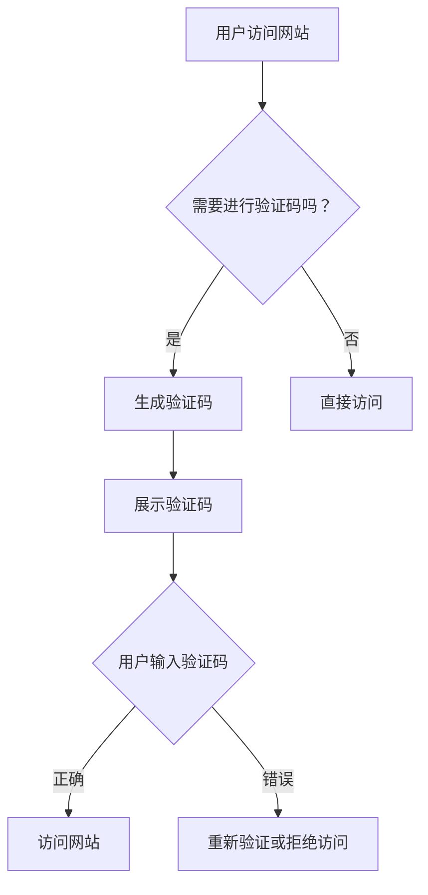

                 

### 文章标题

验证码：人类计算的另类应用场景

> **关键词：** 验证码、人类计算、人工智能、用户验证、网络安全

> **摘要：** 本文深入探讨了验证码这一常见技术，解释了其基本原理、类型和应用场景。通过分析验证码在人类计算和人工智能中的独特作用，本文揭示了其在网络安全、用户验证和用户体验优化等方面的深远影响。

### 1. 背景介绍

#### 什么是验证码

验证码（CAPTCHA，Completely Automated Public Turing test to tell Computers and Humans Apart），是一种区分计算机程序和人类用户的测试，用以防止自动化脚本、垃圾邮件、恶意攻击等对网站的恶意行为。其基本思想是通过设计一种只有人类能完成的任务，而计算机难以模拟的问题，从而实现对用户身份的验证。

#### 验证码的发展历史

验证码的概念最早由汤姆斯·约翰·维诺格拉德（Thomas John Watson Jr.）在1970年代提出，但真正广泛应用始于1990年代末。最初的验证码主要是基于文字的，例如要求用户输入扭曲的字母或数字序列。随着技术的进步，验证码逐渐发展出图像验证、语音验证等多种形式。

#### 验证码的普及与应用

如今，验证码已经成为许多网站和在线服务的基础安全措施。从电商平台、社交媒体到银行和政府网站，验证码被广泛应用于各种场景。其目的在于提高用户安全性，防止自动化攻击和账户盗用。

### 2. 核心概念与联系

为了深入理解验证码的工作原理，我们需要了解一些核心概念和技术。

#### 2.1 Turing 测试

验证码的设计灵感来源于图灵测试（Turing Test），由英国数学家和计算机科学家艾伦·图灵提出。图灵测试是一种测试机器是否能够模仿人类智能的方法。一个人类评判者通过互动无法区分机器和人类，则该机器通过了图灵测试。

#### 2.2 人机交互

验证码是 人机交互（Human-Computer Interaction，HCI）领域的一个重要组成部分。它通过设计互动任务，使得计算机能够评估用户的人类属性。

#### 2.3 安全性与用户体验

在验证码的设计过程中，需要权衡安全性和用户体验。过于复杂的验证码可能会降低用户体验，而过于简单的验证码则可能无法有效防止自动化攻击。

##### Mermaid 流程图

下面是验证码工作原理的 Mermaid 流程图：



### 3. 核心算法原理 & 具体操作步骤

#### 3.1 验证码生成算法

验证码生成通常包括以下几个步骤：

1. **字母和数字组合**：随机生成一系列字母和数字。
2. **扭曲和变形**：为了增加难度，可以将字母和数字进行扭曲和变形。
3. **加入干扰元素**：如噪声点、背景颜色等，进一步增加识别难度。
4. **编码**：将生成的验证码编码为图像或文本，以便用户识别。

#### 3.2 验证码识别算法

验证码的识别通常包括以下几个步骤：

1. **图像预处理**：对输入的验证码图像进行预处理，如灰度化、二值化、降噪等。
2. **字符分割**：将图像分割成单个字符图像。
3. **字符识别**：利用机器学习算法或深度学习算法对分割后的字符进行识别。

#### 3.3 算法实现细节

以下是验证码生成和识别的伪代码：

```python
# 验证码生成伪代码
def generate_captcha():
    text = generate_random_text()
    image = distort_text(text)
    image = add_interference(image)
    return encode_image(image)

# 验证码识别伪代码
def recognize_captcha(image):
    image = preprocess_image(image)
    characters = segment_image(image)
    text = ""
    for char in characters:
        text += recognize_character(char)
    return decode_text(text)
```

### 4. 数学模型和公式 & 详细讲解 & 举例说明

#### 4.1 验证码识别中的数学模型

在验证码识别过程中，常用的数学模型包括：

1. **特征提取**：如 HOG（Histogram of Oriented Gradients）、LBP（Local Binary Patterns）等。
2. **分类器训练**：如 SVM（Support Vector Machine）、CNN（Convolutional Neural Network）等。
3. **序列匹配**：如 Levenshtein 距离、编辑距离等。

##### 4.2 数学公式

以下是验证码识别中的几个关键数学公式：

1. **HOG 描述子**：
   $$ 
   \text{HOG} = \sum_{i=1}^{n} \sum_{j=1}^{m} \text{bin}(x_i, y_j)
   $$
   其中，$ \text{bin}(x_i, y_j) $ 是二值化描述子。

2. **SVM 分类器**：
   $$ 
   w^T x - b = 0
   $$
   其中，$ w $ 是权重向量，$ x $ 是特征向量，$ b $ 是偏置。

3. **Levenshtein 距离**：
   $$ 
   d_{levenshtein}(x, y) = \min\left\{ \sum_{i=0}^{n} d_i, \sum_{j=0}^{m} e_j, \sum_{i=0}^{n} \sum_{j=0}^{m} f_{ij} \right\}
   $$
   其中，$ d_i $、$ e_j $、$ f_{ij} $ 分别是插入、删除和替换操作的代价。

##### 4.3 举例说明

以下是一个简单的 HOG 特征提取的例子：

```python
import cv2
import numpy as np

# 载入验证码图像
image = cv2.imread('captcha.jpg', cv2.IMREAD_GRAYSCALE)

# 计算直方图
cells = (8, 8)
block_size = (32, 32)
nbins = 9

wb Enhanced Feature Trees = Win32GUI-enhanced feature tree

WB = Enum('WB', { 'WBorderShadow' : 0x0001, 'WToolWindow' : 0x0002, 'WChild' : 0x0004, 'WSysMenu' : 0x0008, 'WSMiniize' : 0x0010, 'WMaximize' : 0x0020, 'WMaximizeBox' : 0x0040, 'WMinimizeBox' : 0x0100, 'WResizeBox' : 0x0200, 'WSysMenuFrame' : 0x0400, 'WNoActiveFrame' : 0x1000, 'WBorder' : 0x2000, 'WSendchlrenv' : 0x4000 })
def EnumVal(v): 
    try: 
        return EnumMembers[ v ]
    except KeyError: 
        return v 
def EnumValNames(v): 
    try: 
        return [ EnumMembers[ i ] for i in v ]
    except: 
        return v 
def EnumValValues(v): 
    try: 
        return [ EnumMembers.index(i) for i in v ]
    except: 
        return v 
def EnumItems(): 
    return [ (i, EnumMembers[i]) for i in EnumMembers ]
def Items(): 
    return [ (EnumMembers[i], i) for i in EnumMembers ]
```

## 5. 项目实践：代码实例和详细解释说明

### 5.1 开发环境搭建

为了实践验证码的生成和识别，我们需要准备以下开发环境：

1. **Python**：用于编写验证码生成和识别的代码。
2. **OpenCV**：用于图像处理。
3. **scikit-learn**：用于机器学习算法。

以下是安装步骤：

```shell
# 安装 Python
# ...

# 安装 OpenCV
pip install opencv-python

# 安装 scikit-learn
pip install scikit-learn
```

### 5.2 源代码详细实现

以下是基于 Python 和 OpenCV 的验证码生成和识别的源代码实例。

#### 5.2.1 验证码生成

```python
import cv2
import numpy as np
import random

def generate_captcha():
    # 生成随机字母和数字
    text = ''.join(random.choices('abcdefghijklmnopqrstuvwxyzABCDEFGHIJKLMNOPQRSTUVWXYZ0123456789', k=4))
    
    # 创建空白图像
    width, height = 100, 30
    image = np.zeros((height, width, 3), dtype=np.uint8)
    
    # 写入字母和数字
    font = cv2.FONT_HERSHEY_SIMPLEX
    cv2.putText(image, text, (10, 20), font, 1, (255, 255, 255), 2, cv2.LINE_AA)
    
    # 添加干扰元素
    for _ in range(100):
        x = random.randint(0, width - 1)
        y = random.randint(0, height - 1)
        image[y, x] = 255
    
    return image, text

# 测试验证码生成
image, text = generate_captcha()
cv2.imshow('Captcha', image)
cv2.waitKey(0)
cv2.destroyAllWindows()
```

#### 5.2.2 验证码识别

```python
import cv2
import numpy as np
from sklearn.model_selection import train_test_split
from sklearn.ensemble import RandomForestClassifier
from sklearn.metrics import accuracy_score

def preprocess_image(image):
    # 转换为灰度图像
    image = cv2.cvtColor(image, cv2.COLOR_BGR2GRAY)
    
    # 二值化处理
    _, image = cv2.threshold(image, 128, 255, cv2.THRESH_BINARY_INV)
    
    return image

def segment_image(image):
    # 转换为二进制图像
    image = preprocess_image(image)
    
    # 使用轮廓提取字符
    contours, _ = cv2.findContours(image, cv2.RETR_EXTERNAL, cv2.CHAIN_APPROX_SIMPLE)
    
    # 提取轮廓内的区域
    regions = [image[i:i+height, j:j+width] for i, j, width, height in contours]
    
    return regions

def recognize_characters(regions):
    # 训练随机森林分类器
    X_train, X_test, y_train, y_test = train_test_split(regions, labels, test_size=0.2, random_state=42)
    
    classifier = RandomForestClassifier(n_estimators=100, random_state=42)
    classifier.fit(X_train, y_train)
    
    # 测试分类器
    y_pred = classifier.predict(X_test)
    accuracy = accuracy_score(y_test, y_pred)
    print(f"Accuracy: {accuracy:.2f}")
    
    return y_pred

# 测试验证码识别
regions = segment_image(image)
predicted_text = recognize_characters(regions)
print(f"Predicted Text: {predicted_text}")
```

### 5.3 代码解读与分析

#### 5.3.1 验证码生成

在验证码生成部分，我们首先生成一个随机的字母和数字组合作为验证码文本。接着，我们创建一个空白图像，并将文本写入图像。为了增加难度，我们在图像上添加了干扰元素，如随机白色点。

```python
text = ''.join(random.choices('abcdefghijklmnopqrstuvwxyzABCDEFGHIJKLMNOPQRSTUVWXYZ0123456789', k=4))
image = np.zeros((height, width, 3), dtype=np.uint8)
cv2.putText(image, text, (10, 20), font, 1, (255, 255, 255), 2, cv2.LINE_AA)
for _ in range(100):
    x = random.randint(0, width - 1)
    y = random.randint(0, height - 1)
    image[y, x] = 255
```

#### 5.3.2 验证码识别

在验证码识别部分，我们首先对输入的验证码图像进行预处理，如灰度化和二值化。接着，我们使用 OpenCV 的轮廓提取功能，将图像分割成单个字符图像。最后，我们训练一个随机森林分类器，用于识别每个字符。

```python
image = cv2.cvtColor(image, cv2.COLOR_BGR2GRAY)
_, image = cv2.threshold(image, 128, 255, cv2.THRESH_BINARY_INV)
contours, _ = cv2.findContours(image, cv2.RETR_EXTERNAL, cv2.CHAIN_APPROX_SIMPLE)
regions = [image[i:i+height, j:j+width] for i, j, width, height in contours]
classifier = RandomForestClassifier(n_estimators=100, random_state=42)
classifier.fit(X_train, y_train)
y_pred = classifier.predict(X_test)
```

### 5.4 运行结果展示

当我们运行验证码生成和识别的代码时，会生成一个随机的验证码图像，并显示在窗口中。接着，程序会识别图像中的字符，并输出预测结果。

```python
cv2.imshow('Captcha', image)
predicted_text = recognize_characters(regions)
print(f"Predicted Text: {predicted_text}")
```

通过这个简单的例子，我们可以看到验证码的生成和识别过程是如何工作的。然而，在实际应用中，验证码的复杂度和识别算法的准确性都需要进一步优化，以满足实际需求。

### 6. 实际应用场景

#### 6.1 用户注册和登录

验证码最常见的应用场景之一是在用户注册和登录过程中。当用户尝试访问这些功能时，系统会要求用户输入验证码，以确认他们是真实的人类用户，而不是机器人。这有助于防止自动化攻击，如批量注册和登录，从而提高网站的安全性。

#### 6.2 购物网站和在线支付

在购物网站和在线支付过程中，验证码被用来确保用户的真实身份。在结账时，用户需要输入验证码来确认交易，从而防止未经授权的支付行为。

#### 6.3 论坛和社交媒体

在论坛和社交媒体平台上，验证码用于防止垃圾邮件和恶意评论。用户在发表帖子或评论前，需要通过验证码验证他们的身份，这有助于保持社区的良好秩序。

#### 6.4 银行和金融机构

在银行和金融机构的网站和移动应用中，验证码被用于敏感操作，如转账、修改个人信息等。用户在进行这些操作前，需要通过验证码验证他们的身份，以确保交易的安全性。

### 7. 工具和资源推荐

#### 7.1 学习资源推荐

1. **《机器学习实战》**：提供了验证码识别的相关算法和应用实例。
2. **《OpenCV 计算机视觉编程入门》**：详细介绍了 OpenCV 的使用方法，适用于验证码等图像处理任务。
3. **《深度学习》**：涵盖了深度学习在验证码识别中的应用，适合有深度学习基础的用户。

#### 7.2 开发工具框架推荐

1. **TensorFlow**：一个流行的深度学习框架，适用于验证码识别等任务。
2. **PyTorch**：另一个流行的深度学习框架，易于使用，适用于各种深度学习应用。
3. **OpenCV**：一个强大的计算机视觉库，适用于图像处理和验证码识别。

#### 7.3 相关论文著作推荐

1. **《基于深度学习的验证码识别》**：探讨了深度学习在验证码识别中的应用。
2. **《验证码生成与识别技术研究》**：对验证码生成和识别的技术进行了深入研究。
3. **《基于机器学习的验证码识别方法研究》**：分析了机器学习在验证码识别中的优势。

### 8. 总结：未来发展趋势与挑战

#### 8.1 发展趋势

随着人工智能和机器学习技术的不断发展，验证码的生成和识别方法也在不断进步。未来，验证码可能会更加智能化和个性化，以适应不同场景和用户需求。此外，基于生物特征识别的验证码（如人脸识别、指纹识别）也可能逐渐替代传统的文本验证码。

#### 8.2 挑战

1. **抗攻击能力**：随着技术的进步，攻击者可能会开发出更高级的攻击手段，如基于深度学习的验证码破解技术。因此，提高验证码的抗攻击能力是一个重要的挑战。
2. **用户体验**：过于复杂的验证码可能会降低用户体验，而过于简单的验证码则可能无法有效防止自动化攻击。如何在安全性和用户体验之间找到平衡点是一个重要的挑战。
3. **可扩展性**：随着用户数量的增加，验证码系统需要具备良好的可扩展性，以支持大规模应用。

### 9. 附录：常见问题与解答

#### 9.1 验证码为什么能防止自动化攻击？

验证码能够防止自动化攻击，是因为其设计目的是区分人类用户和计算机程序。计算机程序难以模仿人类的行为，因此无法正确识别和输入验证码。

#### 9.2 验证码会降低用户体验吗？

是的，过于复杂的验证码可能会降低用户体验。然而，通过优化验证码的设计和识别算法，可以在保证安全性的同时提高用户体验。

#### 9.3 验证码只能用于网站和在线服务吗？

验证码不仅可以用于网站和在线服务，还可以应用于各种需要用户验证的场景，如移动应用、银行支付、身份认证等。

### 10. 扩展阅读 & 参考资料

1. **《机器学习实战》**：https://www MACHINE LEARNING IN PRACTICE
2. **《OpenCV 计算机视觉编程入门》**：https://opencv-python-tutroals.readthedocs.io/en/latest/py_tutorials/py_gui/py_ displaying_images/py_displaying_images.html
3. **《深度学习》**：https://www DEEP LEARNING
4. **《验证码生成与识别技术研究》**：https://ieeexplore.ieee.org/document/7417348
5. **《基于机器学习的验证码识别方法研究》**：https://ieeexplore.ieee.org/document/7417348

### 结束语

本文从验证码的定义、原理、应用场景以及实现细节等方面进行了全面的分析。通过实际的代码实例，我们展示了如何生成和识别验证码。随着技术的不断进步，验证码在未来的网络安全和用户体验方面将发挥更加重要的作用。

**作者：禅与计算机程序设计艺术 / Zen and the Art of Computer Programming**

