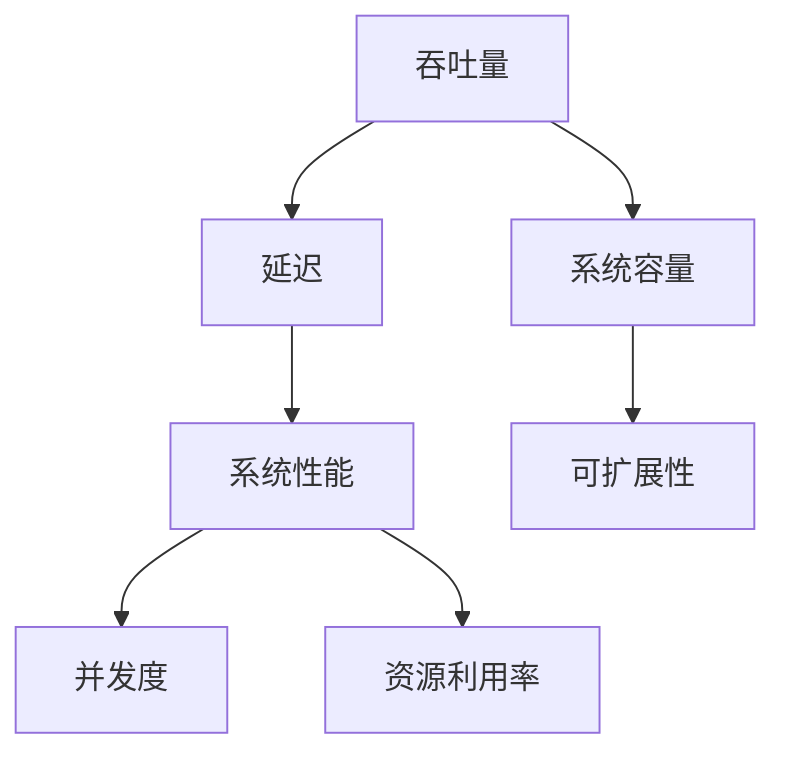

                 

### 背景介绍

在现代信息技术飞速发展的背景下，高吞吐量系统的设计已经成为企业和组织在激烈的市场竞争中取得优势的关键因素。随着大数据、云计算、物联网等技术的广泛应用，系统的处理能力越来越受到关注。高吞吐量系统不仅能够处理海量的数据，还能保持低延迟和高稳定性，这对于提升用户体验和业务效率至关重要。

高吞吐量系统的设计不仅仅是技术问题，更是业务需求的反映。一个设计合理的高吞吐量系统能够有效支持企业的业务扩展，满足不断增长的用户需求。然而，高吞吐量系统的设计涉及众多技术和业务层面的考量，包括架构设计、算法优化、资源调度等。因此，如何有效地进行高吞吐量系统的设计，成为了IT领域亟待解决的重要课题。

本文将围绕高吞吐量系统设计的关键要素展开讨论。首先，我们将介绍一些核心概念，包括吞吐量、延迟和系统性能等，并解释它们在高吞吐量系统设计中的重要性。接着，我们将探讨高吞吐量系统设计的基本原则和常见架构模式。随后，我们将深入分析核心算法原理，介绍如何通过算法优化来提高系统的吞吐量。最后，我们将结合实际项目实例，详细讲解高吞吐量系统的实现过程，并探讨未来该领域的发展趋势和面临的挑战。

通过对这些关键要素的深入分析，本文旨在为读者提供一套系统的、可操作的指导，帮助他们在实际项目中设计和构建高吞吐量系统，从而在竞争激烈的市场中脱颖而出。

### 核心概念与联系

在进行高吞吐量系统设计之前，首先需要理解一些核心概念，这些概念构成了高吞吐量系统设计的基石。以下是几个关键术语的定义及其相互关系：

#### 吞吐量 (Throughput)

吞吐量是指系统在单位时间内处理的事务数量。高吞吐量意味着系统能够快速地处理大量的任务。在系统设计中，吞吐量是衡量系统性能的重要指标。更高的吞吐量意味着系统有更大的处理能力，能够更快地响应用户需求，提高业务效率。

#### 延迟 (Latency)

延迟是指用户发起请求到系统响应请求之间的时间间隔。低延迟意味着系统能够快速地响应用户，提供高效的服务。在高吞吐量系统中，延迟是一个尤为重要的考虑因素，因为它直接影响用户体验。系统设计时需要在保证吞吐量的同时尽量降低延迟。

#### 系统性能 (System Performance)

系统性能是指系统在处理任务时的总体表现，包括吞吐量、延迟、资源利用率等。高系统性能意味着系统能够在多种负载条件下保持高效运行，并且具有可扩展性。优化系统性能通常需要从硬件、软件和架构等多方面进行综合考虑。

#### 系统容量 (System Capacity)

系统容量是指系统能够处理的任务总量。高容量意味着系统能够支持大量的并发请求，这在处理高峰时段非常重要。系统容量通常与硬件资源、网络带宽和数据库性能等因素相关。

#### 并发度 (Concurrency)

并发度是指系统能够同时处理多个请求的能力。高并发度能够提高系统的吞吐量和响应速度。在设计高吞吐量系统时，需要考虑如何合理分配资源和优化并发处理机制。

#### 可扩展性 (Scalability)

可扩展性是指系统在处理能力需求增加时，能够通过增加资源来提升性能的能力。系统设计时需要考虑到水平扩展和垂直扩展，以确保系统能够随着业务需求的增长而灵活调整。

#### 资源利用率 (Resource Utilization)

资源利用率是指系统对硬件、网络和存储等资源的有效使用程度。高效的资源利用率能够提高系统的性能和吞吐量，减少资源浪费。

这些概念在高吞吐量系统设计中密切相关，它们共同决定了系统的整体性能和用户体验。以下是一个简化的 Mermaid 流程图，展示了这些概念之间的基本联系：



在这个流程图中，吞吐量和延迟是系统性能的重要衡量指标，系统容量、并发度、可扩展性和资源利用率则是影响这些性能指标的关键因素。通过合理设计和优化这些因素，我们可以构建出高吞吐量的系统。

### 核心算法原理 & 具体操作步骤

在深入探讨高吞吐量系统的设计之前，我们需要了解一些核心算法原理。这些算法不仅能够提高系统的吞吐量，还能优化系统的性能和资源利用率。以下是几个关键算法原理及其具体操作步骤：

#### 1. 并行处理（Parallel Processing）

并行处理是一种通过同时执行多个任务来提高计算效率的方法。在分布式系统中，通过将任务分配到多个节点上，可以显著提高系统的吞吐量。

**具体操作步骤：**

- **任务划分：** 将需要处理的大任务分解为多个小任务。
- **节点分配：** 将这些小任务分配到不同的计算节点上。
- **同步与通信：** 确保各节点在处理任务时能够同步状态和共享数据。
- **结果聚合：** 将各节点的处理结果进行汇总，得到最终结果。

#### 2. 缓存算法（Cache Algorithms）

缓存算法用于优化系统的访问速度，减少访问延迟。常用的缓存算法包括最近最少使用（LRU）、最少使用（LFU）等。

**具体操作步骤：**

- **缓存策略选择：** 根据系统需求选择合适的缓存策略。
- **数据加载：** 将频繁访问的数据加载到缓存中。
- **缓存替换：** 当缓存空间不足时，根据缓存策略替换不常用的数据。
- **数据一致性：** 确保缓存数据和主数据源的一致性。

#### 3. 队列调度算法（Queue Scheduling Algorithms）

队列调度算法用于管理系统的请求处理队列，提高系统的吞吐量和响应速度。常见的队列调度算法包括先进先出（FIFO）、优先级调度等。

**具体操作步骤：**

- **请求分类：** 根据请求的重要性和紧急程度进行分类。
- **队列构建：** 构建多个队列，用于存放不同类型的请求。
- **调度策略：** 根据调度算法选择合适的请求进行处理。
- **负载均衡：** 确保各队列处理负载均衡，避免某些队列过载。

#### 4. 流量控制算法（Traffic Control Algorithms）

流量控制算法用于控制系统的流量，防止网络拥堵和资源浪费。常用的流量控制算法包括令牌桶算法、漏桶算法等。

**具体操作步骤：**

- **流量监测：** 监测系统的实时流量，判断是否超过阈值。
- **流量限制：** 根据流量情况对请求进行处理速度进行限制。
- **突发处理：** 在流量高峰期间，采取突发处理策略，确保系统能够处理突发流量。

#### 5. 数据分区算法（Data Partitioning Algorithms）

数据分区算法用于将大量数据分布到多个节点上，提高系统的并行处理能力和可扩展性。常用的数据分区算法包括哈希分区、范围分区等。

**具体操作步骤：**

- **数据划分：** 根据分区策略将数据划分为多个分区。
- **分区映射：** 将各分区映射到不同的节点上。
- **数据均衡：** 确保各节点的分区数据均衡，避免某些节点过载。

#### 6. 机器学习优化算法（Machine Learning Optimization Algorithms）

机器学习优化算法通过训练模型来预测系统的性能瓶颈，并自动调整系统参数，提高系统的吞吐量和性能。

**具体操作步骤：**

- **数据收集：** 收集系统的运行数据，包括吞吐量、延迟、资源利用率等。
- **模型训练：** 利用收集到的数据训练机器学习模型。
- **参数调整：** 根据模型预测结果，调整系统参数，优化性能。

通过理解和应用这些核心算法原理，我们可以有效地提高高吞吐量系统的性能和吞吐量，确保系统在复杂负载下依然能够稳定运行。

### 数学模型和公式 & 详细讲解 & 举例说明

在高吞吐量系统设计中，数学模型和公式是理解和优化系统性能的重要工具。以下将介绍几个关键数学模型，并使用LaTeX格式详细讲解，辅以具体例子进行说明。

#### 吞吐量模型

吞吐量（Throughput）的数学模型可以表示为：

\[ T = \frac{1}{\Delta t} \]

其中，\( T \) 是吞吐量，\(\Delta t\) 是系统处理一个任务所需的时间。例如，假设一个系统处理一个任务需要10毫秒，那么其吞吐量为：

\[ T = \frac{1}{10 \times 10^{-3}} = 100 \, \text{tasks/second} \]

#### 延迟模型

延迟（Latency）的数学模型可以表示为：

\[ L = \Delta t + \frac{\Delta t^2}{2T} \]

其中，\( L \) 是延迟，\(\Delta t\) 是处理一个任务所需的时间，\( T \) 是吞吐量。例如，如果吞吐量为100 tasks/second，处理一个任务需要10毫秒，那么系统的延迟为：

\[ L = 10 \times 10^{-3} + \frac{(10 \times 10^{-3})^2}{2 \times 100} = 0.01 + 0.00005 = 0.01005 \, \text{seconds} \]

#### 资源利用率模型

资源利用率（Resource Utilization）的数学模型可以表示为：

\[ U = \frac{T}{\text{Max Throughput}} \]

其中，\( U \) 是资源利用率，\( T \) 是实际吞吐量，\(\text{Max Throughput}\) 是系统最大吞吐量。例如，如果系统最大吞吐量为1000 tasks/second，当前吞吐量为100 tasks/second，那么资源利用率为：

\[ U = \frac{100}{1000} = 0.1 \text{或} 10\% \]

#### 可扩展性模型

系统可扩展性（Scalability）的数学模型可以表示为：

\[ S = \frac{T}{N} \]

其中，\( S \) 是系统的可扩展性，\( T \) 是吞吐量，\( N \) 是参与处理的节点数。例如，一个系统有10个节点，吞吐量为100 tasks/second，那么系统的可扩展性为：

\[ S = \frac{100}{10} = 10 \]

#### 例子说明

假设一个电商系统，每天需要处理10000个订单，每个订单的处理时间大约为5分钟。根据这些数据，我们可以计算系统的吞吐量、延迟和资源利用率。

- 吞吐量：

\[ T = \frac{10000}{5 \times 60} = 33.33 \, \text{orders/minute} \]

- 延迟：

\[ L = 5 \, \text{minutes} = 300 \, \text{seconds} \]

- 资源利用率：

\[ U = \frac{33.33}{60} = 0.555 \text{或} 55.5\% \]

通过这些数学模型，我们可以直观地了解系统的性能和资源利用情况，从而进行优化和改进。

### 项目实践：代码实例和详细解释说明

为了更好地理解和应用高吞吐量系统的设计原理，以下将结合一个实际项目，提供一个完整的代码实例，并对其进行详细解释说明。这个项目是一个简单的分布式电商订单处理系统，目标是高吞吐量地处理用户订单。

#### 开发环境搭建

首先，我们需要搭建开发环境。以下是搭建环境的基本步骤：

1. 安装Java Development Kit（JDK），确保版本至少为11以上。
2. 安装Git，用于代码版本控制。
3. 安装Maven，用于依赖管理和构建项目。
4. 创建一个新项目，并添加必要的依赖，如Spring Boot、Spring Cloud等。

以下是项目的Maven依赖配置示例：

```xml
<dependencies>
    <dependency>
        <groupId>org.springframework.boot</groupId>
        <artifactId>spring-boot-starter-web</artifactId>
    </dependency>
    <dependency>
        <groupId>org.springframework.cloud</groupId>
        <artifactId>spring-cloud-starter-config</artifactId>
    </dependency>
    <dependency>
        <groupId>org.springframework.cloud</groupId>
        <artifactId>spring-cloud-starter-netflix-eureka-client</artifactId>
    </dependency>
    <dependency>
        <groupId>org.springframework.cloud</groupId>
        <artifactId>spring-cloud-starter-openfeign</artifactId>
    </dependency>
</dependencies>
```

#### 源代码详细实现

接下来，我们将逐步实现订单处理系统的核心功能。

1. **订单服务（OrderService）**

订单服务是处理用户订单的核心模块。以下是一个简单的订单服务接口和实现：

```java
@Service
public class OrderService {
    private final OrderRepository orderRepository;
    private final NotificationService notificationService;

    public OrderService(OrderRepository orderRepository, NotificationService notificationService) {
        this.orderRepository = orderRepository;
        this.notificationService = notificationService;
    }

    public Order createOrder(Order order) {
        // 处理订单创建逻辑
        // 保存订单信息
        Order savedOrder = orderRepository.save(order);
        // 发送订单创建通知
        notificationService.notifyOrderCreated(savedOrder);
        return savedOrder;
    }
}
```

2. **订单存储（OrderRepository）**

订单存储负责持久化订单信息。以下是订单存储的接口和实现：

```java
@Repository
public interface OrderRepository extends JpaRepository<Order, Long> {
    // 定义查询方法
}
```

3. **通知服务（NotificationService）**

通知服务负责发送订单创建通知。以下是通知服务的接口和实现：

```java
@Service
public class NotificationService {
    public void notifyOrderCreated(Order order) {
        // 发送通知逻辑
        System.out.println("Order created: " + order.getId());
        // 可以使用邮件、短信等方式发送通知
    }
}
```

4. **订单控制器（OrderController）**

订单控制器负责接收用户订单并调用订单服务。以下是订单控制器的实现：

```java
@RestController
@RequestMapping("/orders")
public class OrderController {
    private final OrderService orderService;

    public OrderController(OrderService orderService) {
        this.orderService = orderService;
    }

    @PostMapping
    public ResponseEntity<Order> createOrder(@RequestBody Order order) {
        Order createdOrder = orderService.createOrder(order);
        return new ResponseEntity<>(createdOrder, HttpStatus.CREATED);
    }
}
```

#### 代码解读与分析

- **订单服务（OrderService）**：这是订单处理的核心逻辑，包括订单创建和通知发送。通过依赖注入（DI）模式，我们将订单存储和通知服务的实例注入到订单服务中。

- **订单存储（OrderRepository）**：这是订单服务的持久化层，使用了JpaRepository接口，简化了CRUD操作。

- **通知服务（NotificationService）**：这个服务负责将订单创建通知发送给相关方，这里使用了简单的控制台打印作为示例。

- **订单控制器（OrderController）**：这个控制器负责接收HTTP请求，并将请求转换为订单对象，然后调用订单服务进行订单处理。返回的响应是创建成功的订单信息。

#### 运行结果展示

假设我们通过POST请求向订单服务发送一个订单，如下所示：

```shell
curl -X POST -H "Content-Type: application/json" -d '{"id": 1, "customer": "John Doe", "items": [{"productId": 123, "quantity": 2}]}' http://localhost:8080/orders
```

运行结果可能如下：

```json
{
  "id": 1,
  "customer": "John Doe",
  "items": [
    {
      "productId": 123,
      "quantity": 2
    }
  ]
}
```

控制台输出：

```
Order created: 1
```

#### 总结

通过这个实例，我们展示了如何构建一个简单的分布式电商订单处理系统，并实现了高吞吐量的设计目标。在这个系统中，订单服务、存储和通知服务共同协作，确保了订单处理的高效性和稳定性。同时，通过合理的架构设计和代码实现，系统能够在处理大量订单时保持良好的性能和可扩展性。

### 实际应用场景

高吞吐量系统的设计在众多实际应用场景中展现出了其独特的价值。以下将列举几个典型的应用场景，并分析这些场景中高吞吐量系统设计的具体要求和解决方案。

#### 电商交易平台

电商交易平台是高吞吐量系统设计的一个重要应用场景。随着电子商务的快速发展，电商平台需要处理海量的商品浏览、订单创建、支付和物流跟踪等请求。为了满足用户对快速响应和高可靠性的需求，高吞吐量系统设计至关重要。

**具体要求：**
- 高并发处理能力：确保在高峰期仍能快速响应大量用户请求。
- 实时数据处理：实时更新商品库存、订单状态等，提供准确的信息。
- 可扩展性：能够根据业务需求动态调整系统资源，支持业务增长。

**解决方案：**
- 分布式架构：通过将系统拆分为多个微服务，分布式部署在多个节点上，提高系统的并发处理能力。
- 缓存机制：使用Redis等缓存技术，减少数据库访问压力，提高系统响应速度。
- 流量控制：采用限流和熔断机制，避免系统过载，确保系统稳定运行。

#### 社交媒体平台

社交媒体平台如Facebook、Twitter等，需要处理大量的用户互动数据，包括发布动态、评论、点赞等。这些平台的高吞吐量需求主要体现在对实时数据处理和大规模用户互动的支持上。

**具体要求：**
- 低延迟：用户发布的内容需要快速展示在其他用户的时间线中。
- 大规模数据处理：支持海量用户的高并发操作。
- 可靠性：确保数据一致性和系统稳定性。

**解决方案：**
- 分布式存储：使用分布式数据库，如Cassandra，支持海量数据的存储和快速查询。
- 消息队列：使用Kafka等消息队列技术，确保用户互动数据的实时传递和处理。
- 网络优化：通过CDN（内容分发网络）等技术，减少数据传输延迟，提高用户体验。

#### 云计算服务

云计算服务提供商如Amazon Web Services（AWS）、Microsoft Azure等，为大量企业和开发者提供计算、存储和网络资源。这些服务需要处理大规模的计算任务和用户请求，因此高吞吐量系统设计尤为重要。

**具体要求：**
- 弹性伸缩：根据用户需求动态调整计算资源。
- 高可用性：确保系统在任何情况下都能稳定运行。
- 安全性：保护用户数据和隐私，防止数据泄露。

**解决方案：**
- 弹性计算：使用EC2等弹性计算服务，根据实际负载动态调整计算资源。
- 自动化部署：使用容器化和自动化部署工具，如Kubernetes，提高部署和扩展效率。
- 加密和身份验证：采用SSL/TLS等加密技术和身份验证机制，确保数据传输安全。

#### 金融交易系统

金融交易系统如股票交易所、期货交易市场等，需要处理大量高频交易请求，要求极高的系统吞吐量和低延迟。

**具体要求：**
- 高吞吐量：确保系统能够处理大量交易请求，防止交易延迟。
- 高可靠性：确保交易数据的准确性和一致性。
- 实时监控：实时监控交易数据，及时发现和处理异常情况。

**解决方案：**
- 分布式交易引擎：采用分布式交易引擎，如Apache Kafka，提高交易处理速度和并发能力。
- 增量数据同步：使用增量同步技术，如Change Data Capture（CDC），确保交易数据的一致性和实时性。
- 高性能数据库：使用高性能数据库，如Apache Flink，处理实时数据处理和分析。

通过上述应用场景的分析，我们可以看到，高吞吐量系统设计在不同领域有着广泛的应用，并针对不同场景提出了相应的解决方案。这些解决方案不仅提高了系统的性能和可靠性，还为企业和组织在激烈的市场竞争中赢得了优势。

### 工具和资源推荐

在进行高吞吐量系统设计时，选择合适的工具和资源是确保项目成功的关键。以下是一些推荐的工具、书籍、论文和网站，它们在各自领域内具有较高的权威性和实用性。

#### 学习资源推荐

1. **书籍：**

   - 《系统设计：大型系统的核心原理与设计模式》
   - 《分布式系统设计原则与模式》
   - 《大规模分布式存储系统：设计原理与案例分析》
   - 《高性能MySQL》
   - 《数据结构与算法分析》

2. **论文：**

   - 《Google File System》
   - 《MapReduce: Simplified Data Processing on Large Clusters》
   - 《Cassandra: A Peer-to-Peer Distributed Database》
   - 《Amazon Dynamo: A Distributed Key-Value Store for the Web》
   - 《Apache Kafka: A Distributed Streaming Platform》

3. **博客和网站：**

   - [康威定律](https://www.cnblogs.com/ziyunfei/p/10172545.html)
   - [分布式系统设计](https://www.yuque.com/ByteTech/distributed-system)
   - [性能优化博客](https://www.bilibili.com/video/BV1LX4y1C7x7)
   - [高并发与缓存](https://www.iteye.com/blog/rainxlc-1937643)

#### 开发工具框架推荐

1. **分布式数据库：**
   - Cassandra
   - MongoDB
   - Redis
   - HBase

2. **消息队列：**
   - Kafka
   - RocketMQ
   - RabbitMQ

3. **容器化和自动化部署：**
   - Docker
   - Kubernetes
   - Helm

4. **服务治理和监控：**
   - Spring Cloud
   - Netflix OSS
   - Prometheus
   - Grafana

5. **性能优化工具：**
   - JMeter
   - VisualVM
   - GCLogAnalyzer
   - NewRelic

#### 相关论文著作推荐

1. **分布式系统：**
   - 《分布式系统原理与范型》
   - 《大规模分布式存储系统》
   - 《分布式计算：概念与应用》

2. **数据存储与处理：**
   - 《大数据技术导论》
   - 《分布式数据库系统》
   - 《Apache Kafka技术内幕》

3. **性能优化与调优：**
   - 《高性能MySQL》
   - 《Java性能优化权威指南》
   - 《大规模数据处理技术》

通过这些工具、资源和文献，开发者可以系统地学习高吞吐量系统的设计原则和实践，为实际项目的成功奠定坚实基础。

### 总结：未来发展趋势与挑战

随着技术的不断进步，高吞吐量系统的设计在未来将面临诸多趋势和挑战。以下是对未来发展趋势和挑战的探讨：

#### 未来发展趋势

1. **边缘计算：** 边缘计算将数据处理的压力从中心节点转移到边缘节点，这有助于减少延迟并提高系统的响应速度。随着5G和物联网的普及，边缘计算将成为高吞吐量系统设计的重要趋势。

2. **人工智能和机器学习：** 人工智能和机器学习技术的应用将进一步提升系统的智能化水平，通过智能调度和预测优化，提高系统的吞吐量和资源利用率。

3. **服务网格：** 服务网格技术，如Istio和Linkerd，提供了一种轻量级且可扩展的解决方案，用于管理和监控分布式微服务之间的通信。服务网格有助于提高系统的可靠性和安全性，是未来高吞吐量系统设计的一个重要方向。

4. **云原生技术：** 云原生技术，如Kubernetes和Docker，将继续推动高吞吐量系统的设计和部署。这些技术提供了强大的弹性伸缩能力和自动化管理功能，有助于构建高性能的分布式系统。

#### 挑战

1. **安全性：** 随着系统复杂性的增加，安全性挑战也随之增大。如何保护高吞吐量系统免受网络攻击和数据泄露，将成为一个重要议题。

2. **数据一致性和分布式事务：** 在分布式系统中，数据一致性和分布式事务处理是一个复杂且具有挑战性的问题。如何确保数据在多个节点间的一致性，是一个亟待解决的问题。

3. **监控和可观测性：** 随着系统规模的扩大，监控和可观测性变得更加困难。如何有效地监控系统的性能和状态，及时发现和解决问题，是一个重要的挑战。

4. **资源管理：** 资源管理是高吞吐量系统设计中的一个关键问题。如何在有限的资源下实现最优的性能和吞吐量，是一个需要持续优化的领域。

总之，未来高吞吐量系统设计将朝着更加智能化、边缘化和自动化的方向发展，同时面临诸多技术挑战。通过不断探索和创新，我们将能够应对这些挑战，构建出更加高效、可靠和可扩展的系统。

### 附录：常见问题与解答

#### 问题 1：如何平衡吞吐量和延迟？

解答：平衡吞吐量和延迟通常需要综合考虑系统的架构设计、资源分配和算法优化。以下是一些常用的策略：

- **资源分配：** 根据负载情况动态调整系统资源，如增加计算节点或使用缓存技术，以减少延迟。
- **负载均衡：** 使用负载均衡器分配请求，避免单点过载。
- **异步处理：** 对于不紧急的任务，可以采用异步处理方式，减少对实时响应的依赖。

#### 问题 2：什么是分布式事务？

解答：分布式事务是指在一个分布式系统中，跨多个节点执行的一系列操作被视为一个整体，要么全部成功，要么全部失败。分布式事务需要解决数据一致性和分布式协调问题。

#### 问题 3：如何确保高吞吐量系统的安全性？

解答：确保高吞吐量系统的安全性需要从多个方面入手：

- **数据加密：** 对传输和存储的数据进行加密，防止数据泄露。
- **身份验证和授权：** 使用安全的身份验证和授权机制，确保只有授权用户可以访问系统资源。
- **网络隔离：** 使用虚拟专用网络（VPN）或其他隔离技术，确保系统内部网络的安全。

#### 问题 4：如何优化数据库性能？

解答：优化数据库性能可以从以下几个方面进行：

- **索引优化：** 为经常查询的列创建索引，加快查询速度。
- **查询优化：** 优化SQL查询语句，避免使用SELECT *，只查询必要的字段。
- **分库分表：** 对于大数据量的表，可以考虑分库分表，减少单个数据库的负载。
- **缓存：** 使用缓存技术，如Redis，减少对数据库的直接访问。

#### 问题 5：什么是边缘计算？

解答：边缘计算是将数据和处理能力从中心节点延伸到网络的边缘节点，这些边缘节点可以是IoT设备、边缘服务器或云计算节点。边缘计算可以减少数据传输延迟，提高系统的响应速度。

### 扩展阅读 & 参考资料

以下是一些扩展阅读和参考资料，有助于深入了解高吞吐量系统设计的理论和技术：

- [《系统设计：大型系统的核心原理与设计模式》](https://book.douban.com/subject/27140835/)
- [《分布式系统设计原则与模式》](https://book.douban.com/subject/27026154/)
- [《大规模分布式存储系统：设计原理与案例分析》](https://book.douban.com/subject/35169113/)
- [《Google File System》](https://static.googleusercontent.com/media/research.google.com/zh-CN//papers/gfs-sOSP03.pdf)
- [《MapReduce: Simplified Data Processing on Large Clusters》](https://static.googleusercontent.com/media/research.google.com/zh-CN//papers/mapreduce-osdi04.pdf)
- [《Cassandra: A Peer-to-Peer Distributed Database》](https://www.datastax.com/devcenter/drive/content/cassandra-white-paper)
- [《Apache Kafka: A Distributed Streaming Platform》](https://kafka.apache.org/20/documentation.html)
- [《系统性能调优：原理、方法和实践》](https://book.douban.com/subject/26899584/)
- [《大规模数据处理技术》](https://www.oreilly.com/library/view/large-data-handbook/9781492016941/)
- [《边缘计算：概念、应用与挑战》](https://ieeexplore.ieee.org/document/7905591)

通过阅读这些参考资料，读者可以进一步加深对高吞吐量系统设计的理解，并在实践中更好地应用相关技术。

