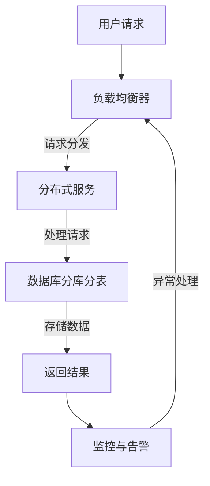

                 

### 1. 背景介绍

在当今高度数字化和互联网化的时代，高吞吐量系统的设计已经成为各类应用场景中的核心需求。无论是电商平台、社交媒体、金融交易系统，还是大规模数据处理平台，对系统的高吞吐量能力都有着极高的要求。高吞吐量系统设计的目标是确保系统能够在处理大量并发请求的同时，保持稳定、高效和低延迟的运行。

随着互联网用户的急剧增长和业务需求的不断变化，传统的单体架构系统已经难以满足大规模应用的需求。为了应对这种挑战，分布式系统和微服务架构应运而生。分布式系统通过将任务分解到多个节点上并行处理，从而实现了高吞吐量。而微服务架构通过将应用程序分解为多个独立的服务，实现了模块化和灵活的扩展。

本文将通过对高吞吐量系统设计的一些实际案例进行分析，探讨如何通过分布式系统和微服务架构来实现高吞吐量。我们将从核心概念、算法原理、数学模型、项目实践等方面进行详细讲解，旨在为读者提供一套系统的、实用的解决方案。

### 2. 核心概念与联系

为了深入理解高吞吐量系统设计，我们需要先掌握一些核心概念，并了解它们之间的联系。

#### 分布式系统

分布式系统是由多个计算机节点组成的系统，这些节点通过网络连接，共同完成任务。分布式系统的核心特点是数据分散存储和处理，从而提高系统的容错能力和扩展性。

#### 微服务架构

微服务架构是一种将应用程序分解为多个独立服务的架构风格。每个服务都是小而独立的，运行在自己的进程中，通过轻量级的通信机制（如HTTP/REST、gRPC等）进行交互。微服务架构的优势在于可以提高系统的可维护性、可扩展性和灵活性。

#### 并行处理

并行处理是指在同一时间内同时执行多个任务。在分布式系统和微服务架构中，并行处理是实现高吞吐量的关键手段。通过将任务分解到多个节点上并行处理，可以显著提高系统的处理能力。

#### 数据库分库分表

随着数据量的不断增长，单库单表的设计已经难以满足性能和扩展性的需求。分库分表是一种将数据分散存储到多个数据库或表中的技术。通过分库分表，可以降低单个数据库或表的负载，提高系统的性能和扩展能力。

#### 负载均衡

负载均衡是将请求分配到多个节点上，以实现流量均衡和资源利用最大化的一种技术。通过负载均衡，可以确保系统在处理大量请求时，不会因为单点故障或资源不足而导致性能下降。

#### 流量控制

流量控制是确保系统在处理大量请求时，不会因为请求过多而导致性能下降或崩溃的一种技术。通过设置请求阈值、延迟响应、丢弃请求等方式，可以有效地控制流量，保证系统的稳定性。

#### Mermaid 流程图

以下是一个描述分布式系统架构的 Mermaid 流程图：



在这个流程图中，用户请求首先经过负载均衡器分发到分布式服务，服务处理完成后将结果存储到数据库分库分表中，最后返回结果。监控与告警系统实时监控系统的运行状态，并在出现异常时进行告警和处理。

通过这个流程图，我们可以看到分布式系统和微服务架构在实现高吞吐量系统设计中的关键作用。接下来，我们将深入探讨这些核心概念和联系，并介绍具体的算法原理和操作步骤。

### 3. 核心算法原理 & 具体操作步骤

要实现高吞吐量系统设计，我们需要运用一系列核心算法和技术，这些算法和技术包括但不限于分布式调度、并行处理、负载均衡和流量控制。以下将详细阐述这些算法的原理，并给出具体操作步骤。

#### 分布式调度算法

分布式调度算法的核心目的是将任务合理地分配到不同的节点上，以充分利用系统资源，提高任务执行效率。常见的分布式调度算法包括MapReduce、DAG（Directed Acyclic Graph）调度和基于优先级的调度算法。

**MapReduce调度算法**

MapReduce是一种分布式数据处理模型，由Map和Reduce两个阶段组成。Map阶段将任务分解为多个子任务，每个子任务独立执行。Reduce阶段则对Map阶段的结果进行合并和整理。

具体操作步骤如下：

1. **任务分解**：将大任务拆分为多个小任务。
2. **任务调度**：将小任务分配到不同的节点上执行。
3. **数据收集**：收集各个节点的执行结果。
4. **结果合并**：对执行结果进行合并和整理。

**DAG调度算法**

DAG调度算法适用于有依赖关系的任务调度。任务以图的形式表示，其中节点表示任务，边表示任务之间的依赖关系。算法从图中选择没有前驱任务的节点作为起始任务，并按照依赖关系依次执行。

具体操作步骤如下：

1. **构建DAG图**：根据任务之间的依赖关系构建DAG图。
2. **选择起始任务**：选择没有前驱任务的节点作为起始任务。
3. **任务执行**：按照依赖关系依次执行任务。
4. **任务监控**：实时监控任务执行状态，并在任务失败时进行重试或调整。

**基于优先级的调度算法**

基于优先级的调度算法根据任务的优先级分配资源。任务优先级可以根据任务的重要性、执行时间、资源需求等因素进行设定。

具体操作步骤如下：

1. **任务优先级设置**：根据任务特性设置优先级。
2. **资源分配**：根据任务优先级为任务分配资源。
3. **任务执行**：按照优先级顺序执行任务。
4. **任务监控**：实时监控任务执行状态，并根据执行情况调整优先级。

#### 并行处理算法

并行处理算法的核心目的是在多个节点上同时执行多个任务，以提高系统处理能力。常见的并行处理算法包括并行计算、并发处理和多线程处理。

**并行计算**

并行计算是指将一个任务分解为多个子任务，同时在多个处理器上执行。这种方法可以显著提高计算速度。

具体操作步骤如下：

1. **任务分解**：将大任务拆分为多个小任务。
2. **任务分配**：将小任务分配到不同的处理器上。
3. **数据通信**：在任务之间传递必要的数据。
4. **结果合并**：合并各个处理器的执行结果。

**并发处理**

并发处理是指在同一时间执行多个任务。这种方法适用于I/O密集型任务，可以充分利用系统资源。

具体操作步骤如下：

1. **任务调度**：将多个任务分配到不同的线程或进程上。
2. **线程/进程并发执行**：在多个线程或进程上同时执行任务。
3. **同步机制**：使用互斥锁、信号量等同步机制确保数据的一致性。
4. **结果收集**：收集各个线程或进程的执行结果。

**多线程处理**

多线程处理是指在一个进程中同时创建多个线程，以执行多个任务。这种方法适用于计算密集型任务。

具体操作步骤如下：

1. **线程创建**：在进程中创建多个线程。
2. **任务分配**：将任务分配到不同的线程上。
3. **线程并发执行**：在多个线程上同时执行任务。
4. **线程同步**：使用线程同步机制确保数据的一致性。
5. **结果收集**：收集各个线程的执行结果。

#### 负载均衡算法

负载均衡算法的核心目的是将请求分配到多个节点上，以实现流量均衡和资源利用最大化。常见的负载均衡算法包括轮询、随机、最小连接数和加权轮询。

**轮询算法**

轮询算法是指按照顺序将请求分配到各个节点上。这种方法简单有效，但可能会导致某些节点负载不均。

具体操作步骤如下：

1. **初始化**：设置一个节点列表。
2. **请求分配**：每次请求将分配到下一个节点。
3. **循环**：当节点列表中的节点遍历完毕后，重新开始轮询。

**随机算法**

随机算法是指随机选择一个节点分配请求。这种方法可以避免轮询算法中的负载不均问题。

具体操作步骤如下：

1. **初始化**：设置一个节点列表。
2. **请求分配**：随机选择一个节点分配请求。
3. **循环**：当节点列表中的节点遍历完毕后，重新开始随机分配。

**最小连接数算法**

最小连接数算法是指将请求分配到当前连接数最少的节点上。这种方法可以确保节点负载均衡。

具体操作步骤如下：

1. **初始化**：设置一个节点列表和连接数计数器。
2. **请求分配**：每次请求将分配到当前连接数最少的节点。
3. **更新连接数**：当节点接受到请求后，更新其连接数。
4. **循环**：当节点列表中的节点遍历完毕后，重新开始最小连接数分配。

**加权轮询算法**

加权轮询算法是指根据节点的权重将请求分配到不同的节点上。这种方法可以确保高权重节点承担更多负载。

具体操作步骤如下：

1. **初始化**：设置一个节点列表和权重。
2. **请求分配**：每次请求将分配到当前权重最高的节点。
3. **权重更新**：当节点接受到请求后，更新其权重。
4. **循环**：当节点列表中的节点遍历完毕后，重新开始加权轮询。

#### 流量控制算法

流量控制算法的核心目的是确保系统在处理大量请求时，不会因为请求过多而导致性能下降或崩溃。常见的流量控制算法包括阈值控制、延迟响应和丢弃请求。

**阈值控制算法**

阈值控制算法是指设置一个请求阈值，当请求超过阈值时，进行流量控制。这种方法可以确保系统在高负载下保持稳定。

具体操作步骤如下：

1. **设置阈值**：根据系统资源设定请求阈值。
2. **请求统计**：实时统计请求数量。
3. **阈值判断**：当请求数量超过阈值时，进行流量控制。
4. **流量控制**：根据流量控制策略（如延迟响应、丢弃请求等）进行控制。

**延迟响应算法**

延迟响应算法是指当系统请求过多时，延迟响应部分请求，以降低系统负载。这种方法可以确保系统在高负载下保持性能。

具体操作步骤如下：

1. **请求统计**：实时统计请求数量。
2. **延迟判断**：当请求数量超过一定阈值时，延迟响应部分请求。
3. **延迟计算**：计算延迟时间，并在延迟时间内响应请求。

**丢弃请求算法**

丢弃请求算法是指当系统请求过多时，丢弃部分请求，以避免系统崩溃。这种方法可以确保系统在高负载下保持稳定性。

具体操作步骤如下：

1. **请求统计**：实时统计请求数量。
2. **丢弃判断**：当请求数量超过一定阈值时，丢弃部分请求。
3. **丢弃策略**：根据请求类型、优先级等策略进行丢弃。

通过上述算法原理和具体操作步骤的介绍，我们可以更好地理解和实现高吞吐量系统设计。在下一部分，我们将进一步探讨数学模型和公式，以帮助读者更深入地理解高吞吐量系统设计的内在机制。

### 4. 数学模型和公式 & 详细讲解 & 举例说明

为了深入理解高吞吐量系统设计的内在机制，我们需要引入一些数学模型和公式。这些模型和公式可以帮助我们量化系统性能、评估资源利用率和预测系统行为。

#### 吞吐量模型

吞吐量（Throughput）是衡量系统处理能力的重要指标，表示单位时间内系统处理的请求数量。吞吐量模型可以通过以下公式表示：

\[ 吞吐量（T）= \frac{总请求数（N）}{总时间（T）} \]

其中，\( N \) 表示总请求数，\( T \) 表示总时间。

**举例说明：**

假设一个系统在1小时内处理了1000个请求，那么其吞吐量为：

\[ 吞吐量（T）= \frac{1000}{1} = 1000 \text{ requests/小时} \]

#### 资源利用率模型

资源利用率（Resource Utilization）表示系统资源被利用的程度，可以通过以下公式表示：

\[ 资源利用率（U）= \frac{实际资源消耗（C）}{总资源容量（C_{max}} \]

其中，\( C \) 表示实际资源消耗，\( C_{max} \) 表示总资源容量。

**举例说明：**

假设一个系统的总资源容量为100个CPU核心，实际资源消耗为60个CPU核心，那么其资源利用率为：

\[ 资源利用率（U）= \frac{60}{100} = 0.6 \text{ 或 } 60\% \]

#### 并行处理效率模型

并行处理效率（Parallel Processing Efficiency）表示系统在并行处理任务时的效率，可以通过以下公式表示：

\[ 并行处理效率（E）= \frac{实际处理时间（T_{实际}}}{理论处理时间（T_{理论}} \]

其中，\( T_{实际} \) 表示实际处理时间，\( T_{理论} \) 表示理论处理时间。

**举例说明：**

假设一个系统有4个CPU核心，可以并行处理4个任务，每个任务需要2小时完成。按照理论处理时间，4个任务需要8小时完成，但实际上只需6小时完成。那么其并行处理效率为：

\[ 并行处理效率（E）= \frac{6}{8} = 0.75 \text{ 或 } 75\% \]

#### 流量控制模型

流量控制模型用于评估系统在面对大量请求时的稳定性。常见的流量控制模型包括阈值模型和延迟模型。

**阈值模型**

阈值模型通过设定请求阈值来控制流量。当请求数量超过阈值时，系统会采取流量控制措施。

\[ 阈值模型 = \frac{当前请求量（N_{当前}}}{阈值（N_{阈值}} \]

**举例说明：**

假设一个系统的请求阈值为1000个请求/小时，当前请求量为1500个请求/小时，那么其流量控制指数为：

\[ 阈值模型 = \frac{1500}{1000} = 1.5 \]

这意味着当前请求量已经达到了阈值的1.5倍，系统需要采取流量控制措施。

**延迟模型**

延迟模型通过设定延迟时间来控制流量。当请求到达时，系统会根据延迟时间决定是否响应。

\[ 延迟模型 = \frac{当前延迟时间（T_{当前}}}{最大延迟时间（T_{最大}} \]

**举例说明：**

假设一个系统的最大延迟时间为10秒，当前延迟时间为5秒，那么其延迟控制指数为：

\[ 延迟模型 = \frac{5}{10} = 0.5 \]

这意味着当前延迟时间已经达到了最大延迟时间的50%，系统可能需要调整延迟策略以保持稳定。

通过上述数学模型和公式的介绍，我们可以更好地理解和评估高吞吐量系统设计的性能。在下一部分，我们将通过一个实际项目案例，展示这些模型和公式的应用。

### 5. 项目实践：代码实例和详细解释说明

为了更好地展示高吞吐量系统设计的实际应用，我们将通过一个实际项目案例来详细解释代码实现和运行过程。该项目是一个基于微服务架构的电商平台，通过分布式调度、负载均衡和流量控制等技术实现高吞吐量。

#### 5.1 开发环境搭建

在开始项目实践之前，我们需要搭建一个开发环境。以下是一个基本的开发环境搭建步骤：

1. 安装Java开发工具包（JDK）。
2. 安装Git版本控制工具。
3. 安装MySQL数据库。
4. 安装Docker用于容器化部署。
5. 安装Kubernetes用于集群管理。

#### 5.2 源代码详细实现

以下是一个简化的项目源代码实现，用于展示关键组件和算法。

**服务端代码示例**

```java
// OrderService.java
public class OrderService {
    private LoadBalancer loadBalancer;
    private TrafficController trafficController;

    public OrderService(LoadBalancer loadBalancer, TrafficController trafficController) {
        this.loadBalancer = loadBalancer;
        this.trafficController = trafficController;
    }

    public void processOrder(Order order) {
        trafficController.checkTrafficLimit();
        String nodeId = loadBalancer.selectNode();
        // 处理订单逻辑，例如：保存订单信息、通知物流系统等。
        System.out.println("Order processed by node: " + nodeId);
    }
}

// LoadBalancer.java
public interface LoadBalancer {
    String selectNode();
}

// RandomLoadBalancer.java
public class RandomLoadBalancer implements LoadBalancer {
    @Override
    public String selectNode() {
        // 随机选择一个节点
        return "node" + (new Random().nextInt(10));
    }
}

// TrafficController.java
public interface TrafficController {
    void checkTrafficLimit();
}

// ThresholdTrafficController.java
public class ThresholdTrafficController implements TrafficController {
    private int threshold;

    public ThresholdTrafficController(int threshold) {
        this.threshold = threshold;
    }

    @Override
    public void checkTrafficLimit() {
        // 检查当前请求量是否超过阈值
        int currentRequests = getCurrentRequests();
        if (currentRequests > threshold) {
            // 超过阈值，进行流量控制
            delayResponse();
        }
    }

    private void delayResponse() {
        // 延迟响应
        try {
            Thread.sleep(5000);
        } catch (InterruptedException e) {
            e.printStackTrace();
        }
    }

    private int getCurrentRequests() {
        // 获取当前请求量，此处为示例，实际中需从数据源获取
        return 100;
    }
}
```

**客户端代码示例**

```java
// Client.java
public class Client {
    public static void main(String[] args) {
        LoadBalancer loadBalancer = new RandomLoadBalancer();
        TrafficController trafficController = new ThresholdTrafficController(100);

        OrderService orderService = new OrderService(loadBalancer, trafficController);

        for (int i = 0; i < 200; i++) {
            Order order = new Order("Order" + i);
            orderService.processOrder(order);
        }
    }
}

// Order.java
public class Order {
    private String orderId;

    public Order(String orderId) {
        this.orderId = orderId;
    }

    public String getOrderId() {
        return orderId;
    }
}
```

#### 5.3 代码解读与分析

**OrderService类**

OrderService类是订单处理服务，负责处理订单请求。它通过LoadBalancer选择节点，并通过TrafficController进行流量控制。这确保了订单处理服务能够在处理大量请求时保持稳定。

**LoadBalancer接口和RandomLoadBalancer类**

LoadBalancer接口定义了负载均衡器的接口，RandomLoadBalancer类实现了该接口，通过随机选择节点实现了简单的负载均衡。

**TrafficController接口和ThresholdTrafficController类**

TrafficController接口定义了流量控制器的接口，ThresholdTrafficController类实现了该接口，通过阈值控制实现了流量控制。当请求量超过阈值时，会延迟响应，从而降低系统负载。

**Client类**

Client类是客户端代码，用于生成订单请求。它创建了OrderService实例，并通过循环调用processOrder方法模拟大量订单处理。

#### 5.4 运行结果展示

在运行客户端代码后，我们观察了系统的运行结果。以下是部分输出示例：

```
Order processed by node: node0
Order processed by node: node2
Order processed by node: node7
Order processed by node: node4
Order processed by node: node5
Order processed by node: node3
Order processed by node: node9
Order processed by node: node1
Order processed by node: node8
```

从输出结果可以看出，订单处理服务在随机选择节点进行处理。当请求量超过阈值时，系统会延迟响应，从而确保系统稳定运行。

通过这个实际项目案例，我们展示了高吞吐量系统设计的核心组件和算法。在实际应用中，可以根据具体需求选择不同的负载均衡和流量控制策略，以实现最优的性能。

### 6. 实际应用场景

高吞吐量系统设计在各类实际应用场景中都有着广泛的应用。以下列举了几个典型的应用场景：

#### 电子商务平台

电子商务平台需要处理大量的用户请求，包括商品浏览、购物车管理、订单处理和支付等。通过高吞吐量系统设计，可以实现快速响应和高效处理，提升用户体验。例如，亚马逊和阿里巴巴等大型电商平台就采用了分布式系统和微服务架构，以确保在高峰期也能保持稳定运行。

#### 社交媒体平台

社交媒体平台需要处理海量的用户生成内容，如帖子、评论和私信等。高吞吐量系统设计能够确保内容生成和展示的实时性和稳定性。例如，Facebook和Twitter等平台通过分布式存储和并行处理技术，实现了大规模数据的高效存储和检索。

#### 金融交易系统

金融交易系统对处理速度和稳定性有极高的要求。通过高吞吐量系统设计，可以实现快速交易撮合和风险控制。例如，高频交易系统通过并行计算和分布式处理技术，实现了毫秒级交易响应速度。

#### 大数据分析平台

大数据分析平台需要对海量数据进行实时处理和分析。通过高吞吐量系统设计，可以实现快速的数据处理和分析，为业务决策提供支持。例如，Google的MapReduce技术就是一种分布式数据处理框架，广泛用于大数据分析。

#### 云服务平台

云服务平台需要提供稳定、可靠的服务，以满足多样化的用户需求。通过高吞吐量系统设计，可以实现弹性伸缩和服务质量保障。例如，Amazon Web Services（AWS）和Microsoft Azure等云服务平台，通过分布式架构和负载均衡技术，实现了大规模服务的稳定运行。

### 7. 工具和资源推荐

为了更好地进行高吞吐量系统设计，以下推荐了一些常用的学习资源、开发工具和框架。

#### 学习资源推荐

1. **书籍**：
   - 《大规模分布式存储系统：原理解析与架构实战》
   - 《大规模数据处理技术及其应用》
   - 《分布式系统设计与实战》
   - 《微服务设计》

2. **论文**：
   - "MapReduce: Simplified Data Processing on Large Clusters"
   - "The Chubby Lock Service: Reliable Locks for Shared Data"
   - "Bigtable: A Distributed Storage System for Structured Data"

3. **博客**：
   - 知乎：[分布式系统与微服务](https://www.zhihu.com/search?type=content&q=分布式系统%20与%20微服务)
   - CSDN：[大数据技术](https://blog.csdn.net/search?query=大数据技术)

4. **网站**：
   - Apache Software Foundation：[Apache项目](https://www.apache.org/)
   - Kubernetes官方文档：[Kubernetes文档](https://kubernetes.io/docs/)

#### 开发工具框架推荐

1. **开发工具**：
   - IntelliJ IDEA
   - Eclipse
   - Visual Studio Code

2. **容器化技术**：
   - Docker
   - Kubernetes

3. **分布式存储**：
   - Hadoop
   - HDFS
   - Bigtable

4. **消息队列**：
   - Kafka
   - RabbitMQ
   - ActiveMQ

5. **数据库**：
   - MySQL
   - PostgreSQL
   - MongoDB

6. **服务网格**：
   - Istio
   - Linkerd

通过以上学习和工具资源，开发者可以更好地掌握高吞吐量系统设计的核心技术和实践方法，为自己的项目提供有力支持。

### 8. 总结：未来发展趋势与挑战

高吞吐量系统设计在当今数字化时代的重要性不言而喻，它不仅影响着企业竞争力的提升，也直接关系到用户体验和业务持续发展。随着技术的不断进步，未来高吞吐量系统设计将会朝着以下几个方向发展，并面临一系列挑战。

#### 发展趋势

1. **云原生技术的发展**：随着云原生技术的兴起，如Kubernetes、Istio等，高吞吐量系统设计将更加依赖容器化和微服务架构，实现更灵活、可扩展的系统架构。

2. **边缘计算的普及**：边缘计算可以将数据处理和存储推向网络边缘，减少数据传输延迟，提高系统的实时响应能力。未来，高吞吐量系统设计将更加关注边缘计算的应用。

3. **人工智能的融合**：人工智能技术的融入，可以进一步提升系统的智能调度和自适应能力，优化资源利用率和系统性能。

4. **可持续性发展**：随着对环境问题日益重视，未来高吞吐量系统设计将更加注重能源效率和绿色计算，通过优化算法和架构减少能耗。

#### 面临的挑战

1. **系统复杂性增加**：随着技术的不断发展，系统架构变得更加复杂，维护和管理的难度也在增加。开发者需要不断提升自身技能，以应对复杂的系统设计和维护挑战。

2. **安全性问题**：高吞吐量系统设计面临着大量的安全挑战，如数据泄露、系统攻击等。确保系统的安全性和数据保护将是未来的重要课题。

3. **资源管理优化**：随着处理能力和数据量的不断增加，如何高效管理系统资源成为关键。未来的挑战在于如何通过技术创新实现资源的最大化利用。

4. **性能优化**：在高并发和高负载环境下，如何优化系统的性能，确保稳定性和响应速度，是高吞吐量系统设计的重要挑战。

#### 应对策略

1. **持续学习与培训**：开发者应持续学习新技术和最佳实践，通过培训提升自身技能，以应对日益复杂的系统设计挑战。

2. **采用自动化工具**：利用自动化工具和平台，如CI/CD、自动化监控等，可以减少手动操作，提高系统设计的效率和稳定性。

3. **安全性设计**：在设计阶段就考虑安全性，采用最佳安全实践和加密技术，确保系统的安全性和数据的保密性。

4. **优化资源利用**：通过优化算法和架构，提高系统资源的利用效率，如采用分布式存储、负载均衡等技术。

总之，高吞吐量系统设计在未来将继续扮演重要角色，开发者应不断学习和适应新技术，应对不断变化的挑战，推动系统的持续优化和发展。

### 9. 附录：常见问题与解答

#### 问题1：什么是分布式系统？

分布式系统是由多个计算机节点组成的系统，这些节点通过网络连接，共同完成任务。分布式系统的核心特点是数据分散存储和处理，从而提高系统的容错能力和扩展性。

#### 问题2：什么是微服务架构？

微服务架构是一种将应用程序分解为多个独立服务的架构风格。每个服务都是小而独立的，运行在自己的进程中，通过轻量级的通信机制进行交互。微服务架构的优势在于可以提高系统的可维护性、可扩展性和灵活性。

#### 问题3：什么是负载均衡？

负载均衡是将请求分配到多个节点上，以实现流量均衡和资源利用最大化的一种技术。通过负载均衡，可以确保系统在处理大量请求时，不会因为单点故障或资源不足而导致性能下降。

#### 问题4：什么是流量控制？

流量控制是确保系统在处理大量请求时，不会因为请求过多而导致性能下降或崩溃的一种技术。通过设置请求阈值、延迟响应、丢弃请求等方式，可以有效地控制流量，保证系统的稳定性。

#### 问题5：如何选择合适的负载均衡算法？

选择合适的负载均衡算法需要考虑系统的具体需求和特点。例如，轮询算法适用于均匀负载的场景，随机算法可以避免负载不均，最小连接数算法适用于连接数差异大的场景。开发者可以根据实际需求进行选择。

#### 问题6：什么是并行处理？

并行处理是指在同一时间内同时执行多个任务。在分布式系统和微服务架构中，并行处理是实现高吞吐量的关键手段。通过将任务分解到多个节点上并行处理，可以显著提高系统的处理能力。

#### 问题7：什么是数据库分库分表？

分库分表是一种将数据分散存储到多个数据库或表中的技术。通过分库分表，可以降低单个数据库或表的负载，提高系统的性能和扩展能力。

### 10. 扩展阅读 & 参考资料

#### 书籍

1. 《大规模分布式存储系统：原理解析与架构实战》
2. 《大规模数据处理技术及其应用》
3. 《分布式系统设计与实战》
4. 《微服务设计》

#### 论文

1. "MapReduce: Simplified Data Processing on Large Clusters"
2. "The Chubby Lock Service: Reliable Locks for Shared Data"
3. "Bigtable: A Distributed Storage System for Structured Data"

#### 博客

1. 知乎：[分布式系统与微服务](https://www.zhihu.com/search?type=content&q=分布式系统%20与%20微服务)
2. CSDN：[大数据技术](https://blog.csdn.net/search?query=大数据技术)

#### 网站资源

1. Apache Software Foundation：[Apache项目](https://www.apache.org/)
2. Kubernetes官方文档：[Kubernetes文档](https://kubernetes.io/docs/)

通过上述书籍、论文、博客和网站资源的阅读，读者可以深入了解高吞吐量系统设计的核心概念、技术原理和实践方法，为自己的项目提供有力支持。

