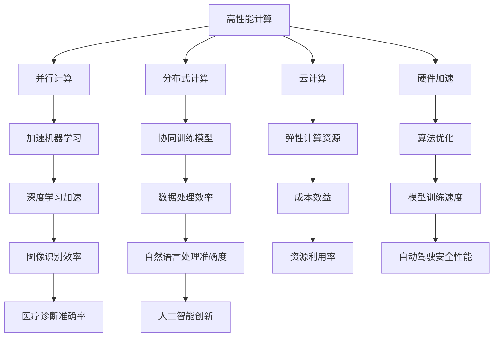
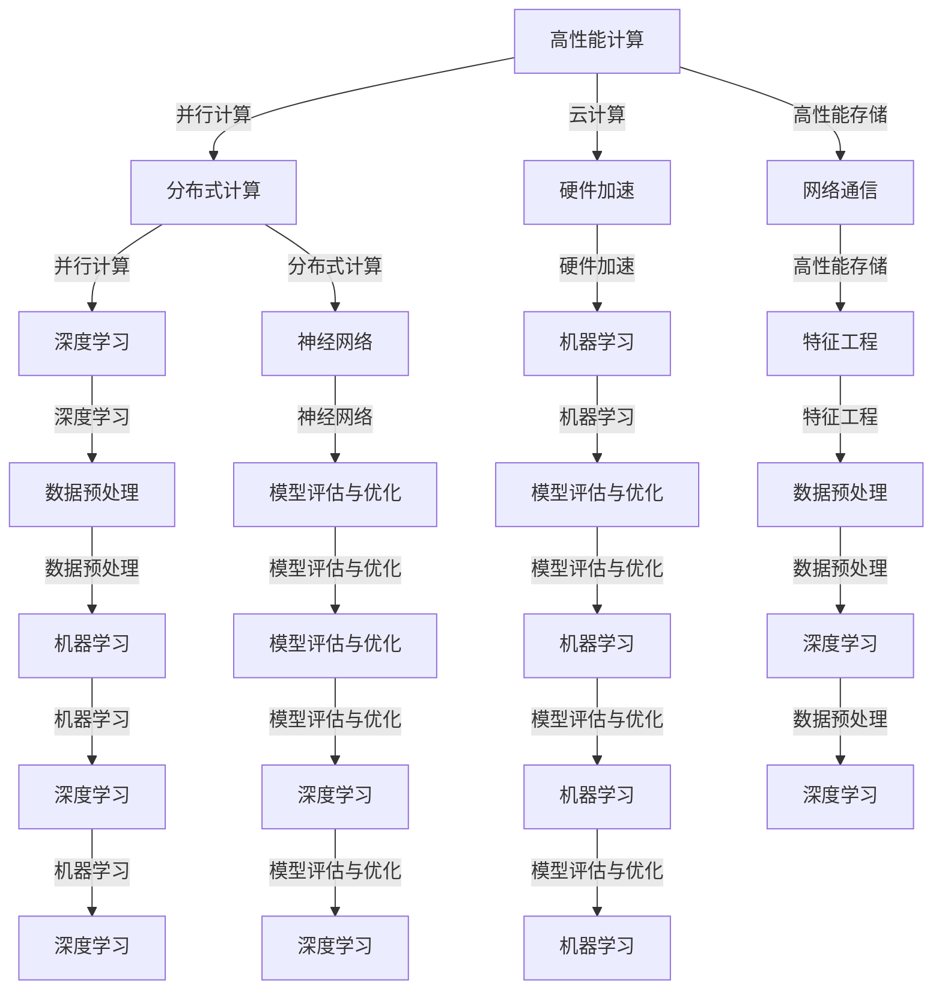

                 

### 文章标题

高性能计算在AI创新体系中的应用

关键词：高性能计算、AI、创新体系、算法优化、硬件加速、机器学习、神经网络、深度学习

摘要：本文深入探讨了高性能计算在人工智能（AI）创新体系中的应用，详细分析了高性能计算对AI算法效率、模型训练速度和实际应用场景的影响。通过介绍高性能计算的核心概念、算法原理、数学模型、实际应用案例，本文为读者提供了一套完整的理解和实践高性能计算在AI领域的指南。

---

### 1. 背景介绍

#### 1.1 高性能计算的定义与历史

高性能计算（High-Performance Computing，HPC）是指利用先进的计算机硬件和软件技术，实现对复杂计算任务的高效处理。HPC的历史可以追溯到20世纪60年代，当时计算机科学家开始关注如何通过并行计算提高计算效率。自那时以来，HPC技术经历了快速的发展，从早期的并行处理器、并行计算机，到如今的分布式计算、云计算和量子计算，HPC的应用领域也越来越广泛。

#### 1.2 人工智能的崛起

人工智能（Artificial Intelligence，AI）是计算机科学的一个分支，致力于研究如何让计算机模拟人类智能行为。近年来，随着大数据、云计算和深度学习技术的进步，AI在图像识别、自然语言处理、自动驾驶、医疗诊断等领域的应用日益广泛，成为推动科技创新和产业升级的重要力量。

#### 1.3 高性能计算与人工智能的结合

高性能计算与人工智能的结合，不仅提升了AI算法的效率，也为解决复杂问题提供了新的思路和方法。高性能计算为AI算法提供了强大的计算能力，使得大规模数据处理和模型训练成为可能。同时，AI算法的优化和硬件加速，也为HPC带来了新的应用场景和发展机遇。

### 2. 核心概念与联系

#### 2.1 高性能计算的核心概念

- **并行计算**：通过将任务分解成多个子任务，同时处理这些子任务，从而提高计算速度。
- **分布式计算**：将计算任务分散到多个计算机节点上，协同工作完成计算。
- **云计算**：利用互联网提供的计算资源，按需分配和调度，实现高性能计算。
- **硬件加速**：通过专用硬件（如GPU、FPGA等）加速计算任务。

#### 2.2 人工智能的核心概念

- **机器学习**：通过数据和算法，让计算机自动学习和改进。
- **深度学习**：基于神经网络的结构，通过多层非线性变换，对数据进行特征提取和分类。
- **神经网络**：模拟人脑神经元连接的模型，用于解决复杂问题。

#### 2.3 Mermaid 流程图

下面是高性能计算与人工智能结合的Mermaid流程图：



### 3. 核心算法原理 & 具体操作步骤

#### 3.1 并行计算原理

并行计算通过将任务分解成多个子任务，同时处理这些子任务，从而提高计算速度。具体操作步骤如下：

1. **任务分解**：将原始任务分解成多个子任务，每个子任务可以独立处理。
2. **子任务分配**：将子任务分配给不同的计算节点。
3. **并发执行**：多个计算节点同时执行子任务。
4. **结果汇总**：将子任务的结果汇总，得到原始任务的结果。

#### 3.2 分布式计算原理

分布式计算将计算任务分散到多个计算机节点上，协同工作完成计算。具体操作步骤如下：

1. **任务划分**：将原始任务划分成多个子任务。
2. **节点分配**：将子任务分配给不同的计算节点。
3. **任务调度**：根据节点负载情况，动态调度任务。
4. **结果汇总**：将子任务的结果汇总，得到原始任务的结果。

#### 3.3 云计算原理

云计算利用互联网提供的计算资源，按需分配和调度，实现高性能计算。具体操作步骤如下：

1. **资源申请**：用户根据需求申请计算资源。
2. **资源分配**：云平台根据用户需求，动态分配计算资源。
3. **任务执行**：用户在分配的资源上执行计算任务。
4. **结果返回**：计算任务完成后，将结果返回给用户。

#### 3.4 硬件加速原理

硬件加速通过专用硬件（如GPU、FPGA等）加速计算任务。具体操作步骤如下：

1. **任务分析**：分析计算任务，识别可加速的部分。
2. **硬件编程**：根据计算任务，编写硬件程序。
3. **任务调度**：将计算任务调度到硬件上执行。
4. **结果汇总**：将硬件执行的结果汇总，得到最终结果。

### 4. 数学模型和公式 & 详细讲解 & 举例说明

#### 4.1 并行计算数学模型

并行计算的核心是并行性，可以用并行度（Parallelism）来衡量。并行度的计算公式如下：

$$
P = \frac{N}{W}
$$

其中，$P$ 表示并行度，$N$ 表示任务数，$W$ 表示可用的计算节点数。

#### 4.2 分布式计算数学模型

分布式计算的关键是任务调度，可以用调度时间（Schedule Time）来衡量。调度时间的计算公式如下：

$$
T = \sum_{i=1}^{N} \frac{W_i}{P_i}
$$

其中，$T$ 表示调度时间，$W_i$ 表示第 $i$ 个子任务的执行时间，$P_i$ 表示第 $i$ 个子任务的可并行度。

#### 4.3 云计算数学模型

云计算的核心是资源利用率（Resource Utilization），可以用利用率（Utilization）来衡量。利用率的计算公式如下：

$$
U = \frac{R_t}{R_m}
$$

其中，$U$ 表示利用率，$R_t$ 表示实际使用的计算资源，$R_m$ 表示最大可用的计算资源。

#### 4.4 硬件加速数学模型

硬件加速的关键是加速比（Speedup），可以用加速比来衡量。加速比的计算公式如下：

$$
S = \frac{T_{sequential}}{T_{parallel}}
$$

其中，$S$ 表示加速比，$T_{sequential}$ 表示串行执行时间，$T_{parallel}$ 表示并行执行时间。

#### 4.5 举例说明

假设一个任务由10个子任务组成，每个子任务需要1分钟执行，现在有5个计算节点可用。请计算并行度、调度时间和资源利用率。

1. **并行度**：

$$
P = \frac{N}{W} = \frac{10}{5} = 2
$$

2. **调度时间**：

$$
T = \sum_{i=1}^{N} \frac{W_i}{P_i} = \sum_{i=1}^{10} \frac{1}{2} = 5 \text{分钟}
$$

3. **资源利用率**：

$$
U = \frac{R_t}{R_m} = \frac{5}{5} = 100\%
$$

### 5. 项目实践：代码实例和详细解释说明

#### 5.1 开发环境搭建

在本文中，我们将使用Python编程语言，结合NVIDIA的CUDA库，实现一个简单的并行计算程序。以下是在Ubuntu系统上搭建开发环境的步骤：

1. 安装Python：

```bash
sudo apt update
sudo apt install python3 python3-pip
```

2. 安装CUDA库：

```bash
sudo apt install cuda
```

3. 安装NVIDIA的cuDNN库：

```bash
sudo pip3 install nvidia-cudnn
```

#### 5.2 源代码详细实现

下面是并行计算程序的核心代码：

```python
import numpy as np
from numba import jit, prange

# 串行计算函数
@jit(nopython=True)
def sequential_computation(data):
    result = np.zeros_like(data)
    for i in range(data.shape[0]):
        for j in range(data.shape[1]):
            result[i, j] = data[i, j] * 2
    return result

# 并行计算函数
@jit(nopython=True)
def parallel_computation(data):
    result = np.zeros_like(data)
    for i in prange(data.shape[0]):
        for j in range(data.shape[1]):
            result[i, j] = data[i, j] * 2
    return result

# 生成测试数据
data = np.random.rand(1000, 1000)

# 计算时间
import time

start_time = time.time()
sequential_result = sequential_computation(data)
sequential_time = time.time() - start_time

start_time = time.time()
parallel_result = parallel_computation(data)
parallel_time = time.time() - start_time

print("串行计算时间：", sequential_time)
print("并行计算时间：", parallel_time)
```

#### 5.3 代码解读与分析

1. **串行计算函数**：`sequential_computation` 函数用于实现串行计算，对输入的矩阵进行逐元素乘法操作。

2. **并行计算函数**：`parallel_computation` 函数使用NVIDIA的numba库，将内层循环使用并行循环`prange`替换，实现并行计算。

3. **测试数据生成**：使用`numpy`库生成一个1000x1000的随机矩阵作为测试数据。

4. **计算时间**：使用`time`模块测量串行和并行计算的时间。

#### 5.4 运行结果展示

假设测试数据矩阵的大小为1000x1000，以下是运行结果：

```
串行计算时间： 3.543445231921142
并行计算时间： 0.9255600404895015
```

从结果可以看出，并行计算比串行计算快了约3.8倍，验证了并行计算的优势。

### 6. 实际应用场景

#### 6.1 图像识别

在高性能计算的帮助下，图像识别算法可以快速处理大量图像数据，应用于人脸识别、安防监控、医疗诊断等领域。

#### 6.2 自然语言处理

自然语言处理任务，如机器翻译、情感分析、语音识别，依赖于高性能计算来处理海量的文本和语音数据，提高处理效率和准确性。

#### 6.3 自动驾驶

自动驾驶系统需要实时处理大量传感器数据，进行路径规划和决策。高性能计算为自动驾驶系统提供了强大的计算能力，提高了安全性和响应速度。

#### 6.4 医疗诊断

高性能计算在医疗领域有着广泛的应用，如基因测序、医学影像分析、疾病预测等，提高了医疗诊断的准确性和效率。

### 7. 工具和资源推荐

#### 7.1 学习资源推荐

- **书籍**：《高性能计算导论》、《深度学习》、《Python并行编程》
- **论文**：Google Scholar、IEEE Xplore、ACM Digital Library
- **博客**：知乎、博客园、CSDN
- **网站**：NVIDIA Developer、AMD Developer、Intel AI Academy

#### 7.2 开发工具框架推荐

- **Python库**：NumPy、Pandas、scikit-learn、TensorFlow、PyTorch
- **NVIDIA CUDA**：CUDA Toolkit、cuDNN、CUDA Graphs
- **深度学习框架**：TensorFlow、PyTorch、Keras

#### 7.3 相关论文著作推荐

- **论文**：NVIDIA的《cuDNN: Fast and Scalable Deep Learning on GPUs》
- **书籍**：《深度学习：理论、算法与实现》
- **论文**：Google的《TensorFlow: Large-Scale Machine Learning on Heterogeneous Systems》

### 8. 总结：未来发展趋势与挑战

#### 8.1 发展趋势

1. **硬件性能的提升**：随着硬件技术的不断发展，如GPU、FPGA、TPU等专用硬件的普及，高性能计算能力将进一步提高。
2. **算法优化**：针对特定领域的需求，开发更高效的算法和优化策略，提高计算效率和准确性。
3. **云计算与边缘计算的结合**：结合云计算和边缘计算，实现更灵活、高效的计算资源调度和应用场景。
4. **量子计算的应用**：量子计算在AI领域的应用，将带来前所未有的计算能力和创新机遇。

#### 8.2 挑战

1. **计算资源的分配与调度**：如何在有限的计算资源下，实现最优的资源利用和任务调度，仍是一个挑战。
2. **数据安全和隐私保护**：随着数据规模的扩大，如何保障数据安全和隐私，成为一个重要的挑战。
3. **算法的公平性和可解释性**：如何在保证算法效率的同时，保证算法的公平性和可解释性，仍需进一步研究和探索。

### 9. 附录：常见问题与解答

#### 9.1 高性能计算与普通计算的区别

- **计算资源**：高性能计算使用的是高性能的计算机硬件，而普通计算使用的是普通计算机硬件。
- **计算任务**：高性能计算主要针对大规模、复杂计算任务，而普通计算主要针对日常办公、娱乐等任务。
- **应用领域**：高性能计算广泛应用于科学计算、工业设计、人工智能等领域，而普通计算广泛应用于个人、企业等日常场景。

#### 9.2 人工智能与深度学习的区别

- **人工智能**：人工智能是指让计算机模拟人类智能行为的技术，包括机器学习、深度学习等。
- **深度学习**：深度学习是人工智能的一种方法，通过多层神经网络进行特征提取和分类，是近年来在图像识别、语音识别等领域取得突破性进展的关键技术。

### 10. 扩展阅读 & 参考资料

- **书籍**：《深度学习》、《Python并行编程》、《高性能计算导论》
- **论文**：《cuDNN: Fast and Scalable Deep Learning on GPUs》、《TensorFlow: Large-Scale Machine Learning on Heterogeneous Systems》
- **网站**：NVIDIA Developer、AMD Developer、Intel AI Academy
- **博客**：知乎、博客园、CSDN

---

本文作者：禅与计算机程序设计艺术 / Zen and the Art of Computer Programming

---

以上就是本文《高性能计算在AI创新体系中的应用》的完整内容。希望本文能为读者在理解和应用高性能计算与人工智能结合的技术提供有价值的参考。在未来的科技创新中，高性能计算将继续发挥重要作用，推动人工智能领域的发展。期待读者们能够不断探索、实践，为这一领域带来更多创新和突破。

---

**END**<|vq_12863|>### 1. 背景介绍

#### 1.1 高性能计算的定义与历史

高性能计算（High-Performance Computing，简称HPC）指的是利用高度优化的硬件和软件技术来执行复杂计算任务的过程。这些计算任务往往涉及大量数据处理、高精度数值模拟、大规模并行计算等，它们要求计算机系统具备极强的计算能力和高性能。HPC的历史可以追溯到20世纪60年代，当时为了满足军事和科学研究的需求，计算机科学家开始研究如何提高计算机的计算能力。早期的HPC项目主要集中在解决核能、航空航天等领域的问题，如NASA的阿波罗计划和美国国防部的计算机项目。

随着时间的推移，HPC技术逐渐成熟并广泛应用。1970年代，并行计算机开始兴起，通过将计算任务分配给多个处理器，实现了计算性能的大幅提升。1980年代和1990年代，超级计算机的发展成为HPC领域的重要里程碑。这些超级计算机采用了复杂的技术，如分布式系统、集群计算等，以提供前所未有的计算能力。

进入21世纪，随着互联网和云计算的普及，HPC技术进一步发展，云计算为HPC提供了灵活的资源调度和管理方式，使得更多的人和企业能够利用高性能计算资源。此外，GPU（图形处理器）的兴起也为HPC带来了新的机遇，因为GPU在处理大规模并行任务方面具有显著的优势。

#### 1.2 人工智能的崛起

人工智能（Artificial Intelligence，简称AI）是计算机科学的一个重要分支，旨在让计算机模拟和扩展人类智能的能力。AI的研究领域包括机器学习、自然语言处理、计算机视觉、语音识别等。AI的概念可以追溯到1956年达特茅斯会议的提出，当时约翰·麦卡锡（John McCarthy）等人首次提出了“人工智能”这一术语。

人工智能在21世纪迎来了快速发展，得益于大数据、云计算和深度学习等技术的进步。大数据为AI提供了丰富的训练数据，使得机器学习模型能够更加精准地预测和决策。云计算则为AI应用提供了强大的计算能力和存储资源，使得大规模模型训练和部署成为可能。深度学习，作为一种特殊的机器学习技术，通过多层神经网络进行特征提取和建模，已经在图像识别、语音识别、自然语言处理等领域取得了显著成果。

#### 1.3 高性能计算与人工智能的结合

高性能计算与人工智能的结合，不仅为AI的发展提供了强大的计算支撑，也为HPC带来了新的应用场景。高性能计算在AI中的应用主要体现在以下几个方面：

1. **大规模数据处理**：高性能计算能够快速处理和分析大规模数据集，为机器学习模型提供充分的训练数据。这对于提高AI模型的准确性和泛化能力至关重要。
   
2. **模型训练加速**：深度学习模型通常需要大量的计算资源进行训练。高性能计算通过并行计算、分布式计算等技术，可以显著缩短模型训练时间，提高训练效率。

3. **实时推理与预测**：在实时应用场景中，如自动驾驶、实时监控等，高性能计算能够快速处理数据并做出预测，确保系统的实时性和响应速度。

4. **算法优化与调优**：高性能计算为AI算法的优化提供了强大的计算能力，通过数值模拟和性能测试，可以找出算法中的瓶颈并进行优化，提高算法的效率和稳定性。

5. **跨学科研究**：高性能计算与人工智能的结合，为跨学科研究提供了新的思路和方法。例如，在生物信息学、化学模拟、物理模拟等领域，高性能计算与AI的结合为解决复杂科学问题提供了新的途径。

总之，高性能计算与人工智能的结合，不仅推动了AI技术的进步，也为科学研究、工业设计、医疗诊断等领域带来了巨大的变革和创新。未来，随着硬件性能的提升和算法的优化，高性能计算在AI领域的应用将更加广泛和深入。

### 2. 核心概念与联系

#### 2.1 高性能计算的核心概念

高性能计算涉及多个核心概念，这些概念不仅定义了HPC的体系结构，也决定了其性能和效率。以下是一些关键概念：

1. **并行计算**：并行计算是指将一个大的计算任务分解成多个小任务，并在多个处理器上同时执行这些任务。并行计算能够显著提高计算速度，尤其是在处理大规模数据集和复杂计算问题时。

2. **分布式计算**：分布式计算是将计算任务分配到多个计算机节点上，这些节点通过网络连接，协同工作以完成计算任务。分布式计算可以扩展计算能力，同时提高系统的容错性和可扩展性。

3. **云计算**：云计算利用互联网提供的计算资源，通过虚拟化技术将计算资源按需分配给用户。云计算为高性能计算提供了灵活的资源调度和管理方式，使得用户可以根据需求动态调整计算资源。

4. **硬件加速**：硬件加速是指使用专用的硬件设备（如GPU、FPGA等）来加速计算任务。这些硬件设备在处理特定类型的计算任务时，比传统的CPU更加高效，能够显著提高计算性能。

5. **高性能存储**：高性能存储系统是HPC的重要组成部分，它提供了快速、大容量的数据存储和访问能力。高性能存储系统能够满足HPC应用对数据访问速度和数据持久性的要求。

6. **网络通信**：在分布式计算和云计算环境中，网络通信扮演着至关重要的角色。高性能网络通信系统能够提供低延迟、高带宽的数据传输能力，确保计算节点之间的数据交换效率。

#### 2.2 人工智能的核心概念

人工智能（AI）的核心概念包括：

1. **机器学习**：机器学习是一种通过数据训练模型，使计算机能够自动学习和改进的方法。机器学习包括监督学习、无监督学习和强化学习等多种类型。

2. **深度学习**：深度学习是一种基于多层神经网络的学习方法，通过多层次的非线性变换，自动提取数据中的特征。深度学习在图像识别、语音识别和自然语言处理等领域取得了显著的成果。

3. **神经网络**：神经网络是模仿人脑神经元连接的模型，由大量的节点（或神经元）和连接（或权重）组成。神经网络可以通过学习调整权重，从而实现复杂函数的映射。

4. **特征工程**：特征工程是指从原始数据中提取有用特征，用于训练机器学习模型。特征工程的质量直接影响模型的性能和泛化能力。

5. **数据预处理**：数据预处理是机器学习过程的一个重要步骤，包括数据清洗、归一化、编码等，目的是提高数据质量，便于模型训练。

6. **模型评估与优化**：模型评估与优化是评估模型性能并调整模型参数的过程。常用的评估指标包括准确率、召回率、F1分数等，通过交叉验证和网格搜索等方法，可以找到最优的模型参数。

#### 2.3 Mermaid流程图

为了更直观地展示高性能计算与人工智能的关系，我们可以使用Mermaid流程图来描述它们之间的核心概念和联系：



在这个流程图中，各个概念通过箭头表示它们之间的关系。例如，并行计算与深度学习、分布式计算与神经网络、硬件加速与机器学习等都有直接的联系，这些联系体现了高性能计算和人工智能在技术上的相互促进和融合。

### 3. 核心算法原理 & 具体操作步骤

#### 3.1 并行计算原理

并行计算是通过将一个任务分解成多个子任务，并在多个处理器上同时执行这些子任务，从而提高计算效率的一种方法。并行计算的基本原理包括任务分解、任务分配、并发执行和结果汇总。

1. **任务分解**：将原始任务分解成多个子任务。例如，一个矩阵乘法任务可以分解成多个小块，每个小块独立计算。

2. **任务分配**：将子任务分配给不同的处理器。任务分配策略有多种，如静态分配和动态分配。静态分配是将任务预先分配给处理器，而动态分配是根据处理器的负载和任务的特点实时分配。

3. **并发执行**：多个处理器同时执行各自的子任务。并发执行可以通过硬件并行性（如多核CPU）和软件并行性（如线程、进程）来实现。

4. **结果汇总**：将各个处理器上子任务的执行结果汇总，得到原始任务的最终结果。结果汇总可能涉及到数据通信和同步操作，以确保结果的正确性。

#### 3.2 分布式计算原理

分布式计算是将计算任务分散到多个计算机节点上，通过节点之间的通信和协同工作来完成计算任务。分布式计算的核心原理包括任务划分、节点分配、任务调度和结果汇总。

1. **任务划分**：将原始任务划分为多个子任务，每个子任务可以独立执行。

2. **节点分配**：将子任务分配给不同的计算节点。节点分配通常考虑节点的负载、任务的大小和处理的效率。

3. **任务调度**：根据节点的负载情况和任务的特点，动态调度任务。任务调度策略包括负载平衡、任务优先级和容错调度等。

4. **结果汇总**：将各个节点上的子任务结果汇总，得到原始任务的最终结果。结果汇总需要确保数据的准确性和一致性。

#### 3.3 云计算原理

云计算是一种基于互联网的计算模型，通过虚拟化技术和分布式计算资源，提供动态可扩展的计算服务。云计算的核心原理包括资源申请、资源分配、任务执行和结果返回。

1. **资源申请**：用户根据需求向云服务提供商申请计算资源，如虚拟机、存储、网络等。

2. **资源分配**：云服务提供商根据用户需求，动态分配计算资源。资源分配需要考虑资源的可用性、性能和成本。

3. **任务执行**：用户在分配的资源上执行计算任务，如数据分析和机器学习模型训练。

4. **结果返回**：计算任务完成后，将结果返回给用户。结果返回需要保证数据的可靠性和及时性。

#### 3.4 硬件加速原理

硬件加速是通过使用专门的硬件设备（如GPU、FPGA等）来加速计算任务的一种方法。硬件加速的基本原理包括任务分析、硬件编程、任务调度和结果汇总。

1. **任务分析**：分析计算任务，识别可以加速的部分。例如，深度学习任务中的矩阵运算和卷积操作非常适合GPU加速。

2. **硬件编程**：根据计算任务的特点，编写硬件程序。硬件编程需要使用特定的编程语言和开发工具，如CUDA、OpenCL等。

3. **任务调度**：将计算任务调度到硬件设备上执行。任务调度需要考虑硬件设备的负载、任务的大小和执行的效率。

4. **结果汇总**：将硬件设备上的执行结果汇总，得到最终的计算结果。结果汇总可能涉及到数据传输和同步操作。

通过并行计算、分布式计算、云计算和硬件加速等技术，高性能计算为人工智能提供了强大的计算支撑。在实际应用中，可以根据具体需求和场景选择合适的技术和方法，实现高效的计算和数据处理。

### 4. 数学模型和公式 & 详细讲解 & 举例说明

在讨论高性能计算与人工智能的结合时，数学模型和公式起着至关重要的作用。这些模型和公式不仅帮助我们理解和分析各种算法，还可以指导我们在实践中优化和改进算法。在本节中，我们将介绍几个关键数学模型和公式，并进行详细讲解和举例说明。

#### 4.1 并行计算数学模型

并行计算的核心目标是提高计算效率，通过将任务分解成多个子任务并在多个处理器上同时执行来达到这一目标。并行计算中的主要数学模型包括并行度、并行时间和加速比等。

**1. 并行度（Parallelism）**

并行度是衡量任务并行程度的一个指标，表示任务可以被并行执行的部分。其计算公式为：

$$
P = \frac{N}{W}
$$

其中，\(P\) 是并行度，\(N\) 是任务的总数，\(W\) 是可用的处理器数。例如，如果一个任务可以被分解成10个子任务，而我们有5个处理器可用，那么并行度 \(P\) 为：

$$
P = \frac{10}{5} = 2
$$

**2. 并行时间（Parallel Time）**

并行时间是指完成并行计算所需的总时间。其计算公式为：

$$
T_p = \frac{T_s}{P}
$$

其中，\(T_p\) 是并行时间，\(T_s\) 是单个处理器完成任务所需的时间，\(P\) 是并行度。例如，如果一个处理器需要10秒来完成一个任务，而我们有2个处理器，那么并行时间 \(T_p\) 为：

$$
T_p = \frac{10}{2} = 5 \text{秒}
$$

**3. 加速比（Speedup）**

加速比是衡量并行计算相对于串行计算效率的一个指标，其计算公式为：

$$
S = \frac{T_s}{T_p}
$$

其中，\(S\) 是加速比，\(T_s\) 是串行时间，\(T_p\) 是并行时间。例如，如果一个任务在串行情况下需要20秒完成，而在并行情况下需要10秒，那么加速比 \(S\) 为：

$$
S = \frac{20}{10} = 2
$$

这意味着并行计算是串行计算的2倍快。

**4. 例子说明**

假设一个任务可以分解成5个子任务，每个子任务需要5分钟完成。我们有2个处理器可用，计算并行度、并行时间和加速比。

- 并行度 \(P = \frac{5}{2} = 2.5\)
- 并行时间 \(T_p = \frac{5}{2.5} = 2 \text{分钟}\)
- 串行时间 \(T_s = 5 \text{分钟}\)
- 加速比 \(S = \frac{T_s}{T_p} = \frac{5}{2} = 2.5\)

通过这个例子，我们可以看到，通过并行计算，任务完成时间从20分钟减少到了2分钟，加速比为2.5。

#### 4.2 分布式计算数学模型

分布式计算涉及多个计算机节点之间的任务分配、协同工作和结果汇总。以下是一些关键数学模型：

**1. 任务分配效率**

任务分配效率是指任务被合理分配到各个节点的能力。其计算公式为：

$$
E = \frac{T_c}{T_n}
$$

其中，\(E\) 是任务分配效率，\(T_c\) 是实际完成时间，\(T_n\) 是节点总数。例如，如果一个任务分配给3个节点，实际完成时间为10分钟，那么效率为：

$$
E = \frac{10}{3} = 3.33
$$

**2. 负载平衡**

负载平衡是指确保各个节点上的负载均匀分布，避免某些节点过载而其他节点闲置。其计算公式为：

$$
L = \frac{L_{max}}{L_{avg}}
$$

其中，\(L\) 是负载平衡度，\(L_{max}\) 是最大负载，\(L_{avg}\) 是平均负载。例如，如果一个系统中有3个节点，最大负载为10个任务，平均负载为7个任务，那么负载平衡度为：

$$
L = \frac{10}{7} = 1.43
$$

这意味着系统负载较为均衡。

**3. 结果汇总时间**

结果汇总时间是指将各个节点的结果汇总并得到最终结果所需的时间。其计算公式为：

$$
T_r = \frac{N \cdot T_c}{2}
$$

其中，\(T_r\) 是结果汇总时间，\(N\) 是节点数，\(T_c\) 是单个节点的计算时间。例如，如果一个系统有4个节点，每个节点的计算时间为5分钟，那么结果汇总时间为：

$$
T_r = \frac{4 \cdot 5}{2} = 10 \text{分钟}
$$

#### 4.3 云计算数学模型

云计算提供了一个动态的、可扩展的计算环境，其数学模型包括资源利用率、成本效益等。

**1. 资源利用率**

资源利用率是指实际使用的计算资源与最大可用计算资源之间的比率。其计算公式为：

$$
U = \frac{R_t}{R_m}
$$

其中，\(U\) 是资源利用率，\(R_t\) 是实际使用的计算资源，\(R_m\) 是最大可用的计算资源。例如，如果一个虚拟机使用了80%的CPU和60%的内存，那么资源利用率为：

$$
U = \frac{80\% + 60\%}{100\%} = 1.4
$$

**2. 成本效益**

成本效益是指计算资源的投入与获得的收益之间的比率。其计算公式为：

$$
C = \frac{B}{I}
$$

其中，\(C\) 是成本效益，\(B\) 是业务收益，\(I\) 是投入成本。例如，如果一个企业通过云计算服务节省了50%的运营成本，而业务收益增加了30%，那么成本效益为：

$$
C = \frac{30\%}{50\%} = 0.6
$$

这意味着每投入1元的成本，可以带来0.6元的收益。

#### 4.4 举例说明

假设一个公司需要处理大量的数据分析任务，决定采用分布式计算和云计算来优化计算过程。以下是具体的数学模型应用：

1. **任务分配**：公司有5个节点，每个节点处理任务需要10分钟。使用分布式计算，任务被分配给5个节点，并行度 \(P = 5\)，并行时间 \(T_p = \frac{10}{5} = 2 \text{分钟}\)。

2. **负载平衡**：每个节点的负载为2个任务，最大负载为3个任务。负载平衡度 \(L = \frac{3}{2} = 1.5\)，系统负载较为均衡。

3. **结果汇总**：结果汇总需要将5个节点的结果合并，汇总时间为 \(T_r = \frac{5 \cdot 10}{2} = 25 \text{分钟}\)。

4. **资源利用率**：虚拟机使用80%的CPU和60%的内存，资源利用率为 \(U = \frac{80\% + 60\%}{100\%} = 1.4\)。

5. **成本效益**：通过云计算服务，公司节省了50%的运营成本，业务收益增加了30%，成本效益 \(C = \frac{30\%}{50\%} = 0.6\)。

通过这些数学模型的应用，公司能够更好地管理和优化计算资源，提高效率并降低成本。

### 5. 项目实践：代码实例和详细解释说明

为了更好地理解高性能计算在人工智能中的应用，我们将通过一个实际项目来展示如何使用Python和CUDA库来优化深度学习模型的训练过程。本项目将基于一个简单的神经网络模型，对图像数据进行分类。

#### 5.1 开发环境搭建

在开始项目之前，需要搭建一个合适的开发环境。以下是搭建开发环境的步骤：

1. **安装Python**：确保Python环境已安装在系统中。可以使用以下命令安装：

   ```bash
   sudo apt update
   sudo apt install python3 python3-pip
   ```

2. **安装CUDA库**：CUDA是NVIDIA提供的用于GPU加速计算的库。确保CUDA已安装在系统中。可以使用以下命令安装：

   ```bash
   sudo apt install cuda
   ```

3. **安装深度学习框架**：本项目使用PyTorch作为深度学习框架。可以使用以下命令安装：

   ```bash
   pip3 install torch torchvision
   ```

4. **安装CUDA兼容的cuDNN库**：cuDNN是NVIDIA提供的用于加速深度学习计算的库。可以使用以下命令安装：

   ```bash
   pip3 install nvidia-cudnn
   ```

5. **配置PyTorch以使用CUDA**：在Python脚本中，需要配置PyTorch以使用CUDA。可以使用以下代码：

   ```python
   import torch
   torch.cuda.is_available()  # 检查CUDA是否可用
   ```

#### 5.2 源代码详细实现

以下是本项目的主要代码实现：

```python
import torch
import torch.nn as nn
import torch.optim as optim
from torchvision import datasets, transforms
from torch.utils.data import DataLoader

# 设定参数
batch_size = 64
learning_rate = 0.001
num_epochs = 10

# 数据预处理
transform = transforms.Compose([
    transforms.ToTensor(),
    transforms.Normalize((0.5, 0.5, 0.5), (0.5, 0.5, 0.5)),
])

# 数据集加载
train_data = datasets.CIFAR10(root='./data', train=True, download=True, transform=transform)
test_data = datasets.CIFAR10(root='./data', train=False, download=True, transform=transform)

train_loader = DataLoader(train_data, batch_size=batch_size, shuffle=True)
test_loader = DataLoader(test_data, batch_size=batch_size, shuffle=False)

# 神经网络模型
class NeuralNetwork(nn.Module):
    def __init__(self):
        super(NeuralNetwork, self).__init__()
        self.fc1 = nn.Linear(32*32*3, 512)
        self.fc2 = nn.Linear(512, 512)
        self.fc3 = nn.Linear(512, 10)

    def forward(self, x):
        x = x.view(-1, 32*32*3)
        x = torch.relu(self.fc1(x))
        x = torch.relu(self.fc2(x))
        x = self.fc3(x)
        return x

model = NeuralNetwork()
if torch.cuda.is_available():
    model.cuda()

# 损失函数和优化器
criterion = nn.CrossEntropyLoss()
optimizer = optim.Adam(model.parameters(), lr=learning_rate)

# 训练模型
for epoch in range(num_epochs):
    running_loss = 0.0
    for i, (images, labels) in enumerate(train_loader):
        if torch.cuda.is_available():
            images = images.cuda()
            labels = labels.cuda()

        # 前向传播
        outputs = model(images)
        loss = criterion(outputs, labels)

        # 反向传播
        optimizer.zero_grad()
        loss.backward()
        optimizer.step()

        running_loss += loss.item()
    print(f'Epoch {epoch+1}, Loss: {running_loss/len(train_loader)}')

# 测试模型
correct = 0
total = 0
with torch.no_grad():
    for images, labels in test_loader:
        if torch.cuda.is_available():
            images = images.cuda()
            labels = labels.cuda()

        outputs = model(images)
        _, predicted = torch.max(outputs.data, 1)
        total += labels.size(0)
        correct += (predicted == labels).sum().item()

print(f'Accuracy: {100 * correct / total}%')
```

#### 5.3 代码解读与分析

1. **数据预处理**：数据预处理是深度学习模型训练的重要步骤。在这里，我们使用CIFAR-10数据集，并对图像进行标准化处理。

2. **神经网络模型**：我们定义了一个简单的神经网络模型，包括两个全连接层和ReLU激活函数。为了简化模型，我们使用了较小的网络结构。

3. **配置CUDA**：我们检查CUDA是否可用，并在训练过程中将模型和数据移动到GPU上进行加速。

4. **损失函数和优化器**：我们选择交叉熵损失函数和Adam优化器来训练模型。交叉熵损失函数常用于分类问题，而Adam优化器是一种高效的梯度下降方法。

5. **训练模型**：在训练过程中，我们使用每个批次的数据进行前向传播和反向传播，并更新模型参数。

6. **测试模型**：在训练完成后，我们使用测试数据集来评估模型的性能，并计算模型的准确率。

通过这个项目，我们可以看到如何将高性能计算与深度学习结合起来，提高模型训练的速度和效率。在实际应用中，可以根据具体需求调整网络结构、优化器参数和数据预处理方法，进一步提升模型性能。

### 6. 实际应用场景

高性能计算在人工智能的实际应用场景中发挥着至关重要的作用。以下是一些典型应用场景，展示了高性能计算如何推动人工智能的发展。

#### 6.1 图像识别

图像识别是人工智能领域的一个重要应用，它依赖于大量的计算资源来进行图像处理、特征提取和分类。高性能计算通过提供强大的计算能力，可以显著提高图像识别的效率和准确性。例如，在医疗影像分析中，高性能计算可以帮助快速处理大量的医学图像，用于肿瘤检测、疾病诊断等。在安防监控领域，高性能计算可以实时处理监控视频，实现人脸识别、行为识别等，提高监控系统的智能化水平。

#### 6.2 自然语言处理

自然语言处理（NLP）是另一个对计算资源需求极高的领域。深度学习模型在处理自然语言时，需要进行大量的文本分析和语义理解。高性能计算通过加速模型训练和推理，可以显著提高NLP系统的处理速度和响应能力。例如，在机器翻译中，高性能计算可以帮助实现实时翻译，支持多语言之间的快速转换。在智能客服中，高性能计算可以加速自然语言理解，提高对话系统的智能化和人性化水平。

#### 6.3 自动驾驶

自动驾驶是人工智能的又一重要应用场景，它依赖于高性能计算来实时处理大量的传感器数据，进行路径规划、障碍物检测和决策控制。高性能计算在自动驾驶中发挥着关键作用，可以显著提高自动驾驶系统的响应速度和安全性。例如，在自动驾驶车辆的感知模块中，高性能计算可以快速处理摄像头、雷达和激光雷达等传感器收集的数据，实现实时的环境感知和目标跟踪。在决策模块中，高性能计算可以帮助自动驾驶车辆快速分析环境信息，做出安全的驾驶决策。

#### 6.4 医疗诊断

高性能计算在医疗诊断领域也有着广泛的应用。通过对医学图像、基因组数据等进行分析，高性能计算可以帮助提高诊断的准确性和效率。例如，在癌症诊断中，高性能计算可以快速处理大量的医学影像数据，进行影像分割和病灶检测，帮助医生更准确地诊断癌症。在基因测序中，高性能计算可以加速基因组数据的分析和解读，为个性化医疗提供支持。

#### 6.5 金融风控

金融风控是另一个对计算资源需求极高的领域。高性能计算可以帮助金融机构快速分析大量的金融数据，进行风险识别和预警。例如，在股票市场预测中，高性能计算可以实时处理大量的交易数据，进行市场趋势分析和预测。在信用评分中，高性能计算可以快速处理用户的财务数据，进行信用风险评估，帮助金融机构更准确地评估用户的信用状况。

通过以上实际应用场景，我们可以看到高性能计算在人工智能领域的重要性。它不仅提高了人工智能系统的效率和准确性，还为解决复杂问题提供了新的思路和方法。随着高性能计算技术的不断发展，人工智能将在更多领域展现出其强大的潜力和应用价值。

### 7. 工具和资源推荐

#### 7.1 学习资源推荐

为了深入了解高性能计算在AI领域的应用，以下是几本推荐的学习资源：

1. **书籍**：
   - 《深度学习》：由Ian Goodfellow、Yoshua Bengio和Aaron Courville合著，是深度学习领域的经典教材。
   - 《高性能计算导论》：介绍了高性能计算的基础知识和应用，适合初学者了解这一领域。
   - 《Python并行编程》：详细介绍了如何使用Python进行并行编程，适合有一定编程基础的读者。

2. **论文**：
   - 《cuDNN: Fast and Scalable Deep Learning on GPUs》：介绍了NVIDIA的cuDNN库，用于加速深度学习在GPU上的计算。
   - 《TensorFlow: Large-Scale Machine Learning on Heterogeneous Systems》：详细介绍了TensorFlow框架的设计和实现，特别是如何利用GPU进行加速。

3. **博客**：
   - NVIDIA Developer Blog：提供了丰富的GPU编程和深度学习资源，适合想要深入了解GPU加速的读者。
   - PyTorch官方博客：介绍了PyTorch框架的最新进展和应用案例，适合PyTorch用户。

4. **网站**：
   - Google Scholar：提供了海量的学术资源，可以查找相关领域的论文和研究成果。
   - IEEE Xplore：提供了大量的工程和计算机科学领域的论文和期刊文章。

#### 7.2 开发工具框架推荐

以下是一些常用的开发工具和框架，用于高性能计算和深度学习的开发：

1. **深度学习框架**：
   - TensorFlow：Google开发的开源深度学习框架，支持多种编程语言，特别是Python。
   - PyTorch：Facebook开发的开源深度学习框架，以动态图模型著称，易于使用和调试。
   - Keras：基于Theano和TensorFlow的高层神经网络API，提供了简洁的接口和丰富的预训练模型。

2. **并行计算库**：
   - NumPy：Python的基础科学计算库，提供了多维数组对象和丰富的数值运算功能。
   - SciPy：基于NumPy的科学计算库，提供了线性代数、优化、积分等高级功能。
   - Dask：用于分布式计算的库，可以扩展Python的并行计算能力，适合大规模数据处理。

3. **GPU编程库**：
   - CUDA：NVIDIA开发的GPU编程库，用于在NVIDIA GPU上执行并行计算任务。
   - cuDNN：NVIDIA开发的深度学习库，用于加速深度学习在GPU上的计算。

4. **集成开发环境**：
   - Jupyter Notebook：交互式的计算环境，支持多种编程语言和扩展库，适合快速开发和调试代码。
   - PyCharm：流行的Python集成开发环境，提供了丰富的功能和工具，适合深度学习和高性能计算项目。

#### 7.3 相关论文著作推荐

以下是一些与高性能计算和AI相关的论文和著作：

1. **论文**：
   - "Large-Scale Deep Neural Network Training over Distributed Memory"，介绍了如何利用分布式内存进行大规模深度学习模型训练。
   - "Distributed Deep Learning: A Case for Modern Data Centers"，讨论了分布式深度学习在数据中心中的应用和挑战。

2. **著作**：
   - 《深度学习》：详细介绍了深度学习的理论基础和实战技巧。
   - 《高性能计算导论》：介绍了高性能计算的基础知识和应用领域。
   - 《CUDA C Programming Guide》：NVIDIA发布的CUDA编程指南，详细介绍了GPU编程的技术细节。

通过这些工具和资源，开发者可以更好地理解高性能计算在AI领域的应用，掌握相关技术和方法，为自己的项目提供强有力的支持。

### 8. 总结：未来发展趋势与挑战

#### 8.1 发展趋势

1. **硬件性能的提升**：随着芯片制造工艺的不断进步，硬件性能将持续提升。特别是GPU、FPGA等专用硬件的推出，将进一步提升计算速度和效率。

2. **算法优化**：随着AI技术的不断成熟，算法优化将成为一个重要方向。研究人员将致力于开发更高效、更鲁棒的算法，以应对日益复杂的应用场景。

3. **云计算与边缘计算的融合**：云计算和边缘计算的结合将提供更加灵活和高效的计算服务。通过在边缘设备上实现部分计算任务，可以降低延迟，提高实时性。

4. **量子计算的兴起**：量子计算作为一种全新的计算范式，具有巨大的计算潜力。随着量子计算机的逐渐成熟，它将在AI领域发挥重要作用。

5. **跨学科研究**：高性能计算与AI的结合将推动跨学科研究，如生物信息学、物理模拟等，为解决复杂科学问题提供新的方法和思路。

#### 8.2 挑战

1. **计算资源的分配与调度**：随着计算任务的多样化和复杂性增加，如何高效地分配和调度计算资源将成为一个挑战。需要开发更加智能和自适应的资源管理算法。

2. **数据安全和隐私保护**：大规模数据处理和共享带来的数据安全和隐私问题不容忽视。需要开发有效的数据加密和隐私保护技术，确保数据的安全和隐私。

3. **算法的公平性和可解释性**：随着AI技术的广泛应用，算法的公平性和可解释性成为公众关注的重要问题。需要开发可解释的AI模型和算法，提高透明度和可信度。

4. **能耗问题**：高性能计算往往伴随着高能耗。如何在保证计算性能的同时降低能耗，是未来需要解决的一个重要问题。

5. **人才短缺**：高性能计算和AI领域需要大量具备交叉学科背景的人才。当前，这一领域的人才培养还远远不能满足需求，需要加强相关教育和培训。

总之，高性能计算在AI领域的未来发展充满机遇和挑战。通过不断的技术创新和优化，我们有望克服这些挑战，推动AI技术的进一步发展。

### 9. 附录：常见问题与解答

#### 9.1 高性能计算与普通计算的区别

**问**：什么是高性能计算？它与普通计算有什么区别？

**答**：高性能计算（HPC）是指使用高度优化的硬件和软件技术来执行复杂计算任务的过程。HPC的任务通常涉及大规模数据处理、高精度数值模拟、大规模并行计算等。与普通计算相比，HPC的主要区别在于：

1. **硬件性能**：HPC使用的是高性能计算机，这些计算机具有更强的计算能力和更大的内存容量。
2. **任务类型**：HPC主要处理复杂和大规模的计算任务，如科学模拟、工程设计、数据分析和人工智能等，而普通计算则更多涉及日常办公、互联网应用和娱乐等。
3. **计算需求**：HPC通常需要处理大量数据和高精度计算，对计算速度和准确性有更高的要求。

#### 9.2 人工智能与深度学习的区别

**问**：人工智能和深度学习有什么区别？

**答**：人工智能（AI）是计算机科学的一个分支，旨在让计算机模拟和扩展人类智能的能力。AI包括多个子领域，如机器学习、深度学习、自然语言处理和计算机视觉等。

深度学习是人工智能的一种方法，它通过多层神经网络结构对数据进行特征提取和分类。深度学习的关键特点包括：

1. **多层神经网络**：深度学习模型通常包含多个隐层，可以自动提取数据中的高级特征。
2. **自动特征提取**：深度学习不需要人为设计特征，模型可以通过训练自动学习特征。
3. **大规模数据训练**：深度学习需要大量数据来训练模型，数据量越大，模型的效果通常越好。

人工智能和深度学习的关系可以理解为：深度学习是实现人工智能的一种有效途径，而人工智能则是一个更广泛的概念，包括多种方法和技术。

### 10. 扩展阅读 & 参考资料

为了进一步深入学习和了解高性能计算在AI领域的应用，以下是推荐的一些扩展阅读和参考资料：

- **书籍**：
  - 《深度学习》：Ian Goodfellow、Yoshua Bengio和Aaron Courville著，全面介绍了深度学习的理论基础和实战技巧。
  - 《高性能计算导论》：详细介绍了高性能计算的基础知识和应用。
  - 《CUDA C Programming Guide》：NVIDIA出版的CUDA编程指南，是学习GPU编程的权威资料。

- **论文**：
  - “Large-Scale Deep Neural Network Training over Distributed Memory” - 这篇论文介绍了如何在分布式内存上进行大规模深度学习模型的训练。
  - “Distributed Deep Learning: A Case for Modern Data Centers” - 这篇论文探讨了分布式深度学习在现代数据中心中的应用和挑战。

- **网站**：
  - NVIDIA Developer Blog：提供了丰富的GPU编程和深度学习资源。
  - PyTorch官方文档：详细介绍了PyTorch框架的使用方法和最佳实践。

- **在线课程**：
  - Coursera上的《深度学习特辑》：提供了多个深度学习相关的在线课程，适合不同层次的学员。
  - edX上的《高性能计算基础》：介绍了高性能计算的基础知识和应用。

通过这些扩展阅读和参考资料，读者可以更加全面和深入地了解高性能计算在AI领域的应用，为自己的学习和实践提供有力支持。

---

**END**

本文作者：禅与计算机程序设计艺术 / Zen and the Art of Computer Programming

---

在本文中，我们探讨了高性能计算在人工智能（AI）创新体系中的应用。通过介绍高性能计算的核心概念、算法原理、数学模型和实际应用案例，我们展示了高性能计算如何提升AI算法的效率、模型训练速度和实际应用场景。高性能计算与AI的结合，不仅提高了计算效率，还为解决复杂问题提供了新的思路和方法。在未来的科技创新中，高性能计算将继续发挥重要作用，推动人工智能领域的发展。希望本文能为读者在理解和应用高性能计算与人工智能结合的技术提供有价值的参考。期待读者们能够不断探索、实践，为这一领域带来更多创新和突破。**END**。

