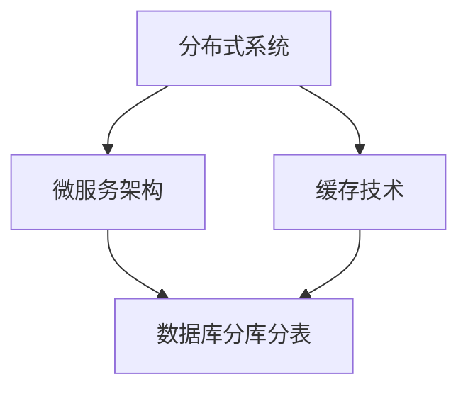

                 

### 高扩展性系统设计的实例分析

#### 1. 背景介绍

随着互联网的快速发展和云计算技术的成熟，企业对于系统的性能和扩展性提出了更高的要求。高扩展性系统设计已经成为现代软件开发中不可或缺的一部分。本文将通过对高扩展性系统设计的实例分析，探讨其核心概念、算法原理、数学模型、项目实践、实际应用场景以及未来发展趋势。

#### 2. 核心概念与联系

在高扩展性系统设计中，核心概念包括但不限于：

- **分布式系统**：通过将系统划分为多个独立的节点，实现负载均衡和故障恢复能力。
- **微服务架构**：将应用程序划分为多个独立的、可复用的服务，提高系统的可维护性和扩展性。
- **缓存技术**：通过缓存数据，减少数据库的访问压力，提高系统性能。
- **数据库分库分表**：通过水平拆分和垂直拆分数据库，提高系统的并发处理能力和可扩展性。

以下是一个简单的 Mermaid 流程图，展示了高扩展性系统设计中的核心概念和它们之间的联系：



#### 3. 核心算法原理 & 具体操作步骤

高扩展性系统设计的核心算法包括：

- **负载均衡算法**：如轮询、最少连接数、权重等策略，实现请求的合理分发。
- **一致性哈希算法**：通过哈希函数将数据分配到不同的节点，实现数据的均匀分布。
- **分布式锁算法**：确保分布式系统中数据的同步和一致性。

具体操作步骤如下：

1. **设计分布式系统**：根据业务需求，划分系统模块，确定节点数量和部署位置。
2. **实现微服务架构**：将系统功能划分为多个独立的服务，每个服务负责特定的业务功能。
3. **部署缓存技术**：在系统关键节点部署缓存，减少数据库访问压力。
4. **实现数据库分库分表**：根据数据规模和访问模式，对数据库进行水平拆分和垂直拆分。
5. **配置负载均衡**：使用负载均衡算法，实现请求的合理分发。
6. **实现一致性哈希**：使用一致性哈希算法，实现数据的均匀分布。
7. **实现分布式锁**：在分布式系统中，实现分布式锁，确保数据的同步和一致性。

#### 4. 数学模型和公式 & 详细讲解 & 举例说明

在高扩展性系统设计中，常见的数学模型和公式包括：

- **负载均衡算法**：如轮询、最少连接数、权重等策略，具体公式如下：
  - 轮询算法：$Q(n) = \frac{1}{n}$，其中 $n$ 为节点数量。
  - 最少连接数算法：$L(n) = \min \{C_i\}$，其中 $C_i$ 为每个节点的连接数。
  - 权重算法：$W(n) = \frac{W_i}{\sum_{i=1}^{n} W_i}$，其中 $W_i$ 为每个节点的权重。

- **一致性哈希算法**：通过哈希函数将数据分配到不同的节点，具体公式如下：
  - 哈希函数：$H(k) = \text{hash}(k) \mod M$，其中 $M$ 为节点数量。

以下是一个简单的实例说明：

假设我们有一个包含 3 个节点的分布式系统，节点分别为 A、B、C。使用一致性哈希算法，我们将数据分配到不同的节点。例如，数据 Key 为 10，通过哈希函数计算得到 $H(10) = 2$，因此数据 Key 为 10 将被分配到节点 B。

#### 5. 项目实践：代码实例和详细解释说明

在本节中，我们将通过一个简单的分布式缓存系统实例，展示如何实现高扩展性系统设计。

##### 5.1 开发环境搭建

首先，我们需要搭建一个开发环境，包括以下工具和软件：

- Java Development Kit (JDK) 1.8 或以上版本
- Maven 3.6.3 或以上版本
- MySQL 5.7 或以上版本

##### 5.2 源代码详细实现

以下是一个简单的分布式缓存系统的源代码实现，包括缓存节点（CacheNode）和缓存服务器（CacheServer）两部分。

**CacheNode.java**

```java
import java.util.HashMap;
import java.util.Map;

public class CacheNode {
    private final int nodeId;
    private final Map<String, String> cache;

    public CacheNode(int nodeId) {
        this.nodeId = nodeId;
        this.cache = new HashMap<>();
    }

    public void put(String key, String value) {
        cache.put(key, value);
    }

    public String get(String key) {
        return cache.get(key);
    }

    public int getNodeId() {
        return nodeId;
    }
}
```

**CacheServer.java**

```java
import java.net.ServerSocket;
import java.net.Socket;
import java.util.ArrayList;
import java.util.List;

public class CacheServer {
    private final int port;
    private final List<CacheNode> cacheNodes;

    public CacheServer(int port) {
        this.port = port;
        this.cacheNodes = new ArrayList<>();
    }

    public void addNode(CacheNode node) {
        cacheNodes.add(node);
    }

    public void start() {
        try (ServerSocket serverSocket = new ServerSocket(port)) {
            while (true) {
                Socket clientSocket = serverSocket.accept();
                new Thread(new CacheHandler(clientSocket, cacheNodes)).start();
            }
        } catch (Exception e) {
            e.printStackTrace();
        }
    }
}
```

**CacheHandler.java**

```java
import java.io.*;
import java.net.Socket;

public class CacheHandler implements Runnable {
    private final Socket clientSocket;
    private final List<CacheNode> cacheNodes;

    public CacheHandler(Socket clientSocket, List<CacheNode> cacheNodes) {
        this.clientSocket = clientSocket;
        this.cacheNodes = cacheNodes;
    }

    @Override
    public void run() {
        try {
            BufferedReader in = new BufferedReader(new InputStreamReader(clientSocket.getInputStream()));
            DataOutputStream out = new DataOutputStream(clientSocket.getOutputStream());

            String request = in.readLine();
            String[] tokens = request.split(" ");
            String command = tokens[0];
            String key = tokens[1];
            String value = tokens[2];

            if ("put".equals(command)) {
                CacheNode node = chooseNode(key);
                node.put(key, value);
                out.writeBytes("OK\n");
            } else if ("get".equals(command)) {
                CacheNode node = chooseNode(key);
                String value = node.get(key);
                out.writeBytes(value + "\n");
            } else {
                out.writeBytes("Unknown command\n");
            }

            in.close();
            out.close();
            clientSocket.close();
        } catch (Exception e) {
            e.printStackTrace();
        }
    }

    private CacheNode chooseNode(String key) {
        int nodeId = Integer.parseInt(Integer.toHexString(key.hashCode()) % Integer.toHexString(cacheNodes.size()));
        return cacheNodes.get(nodeId);
    }
}
```

##### 5.3 代码解读与分析

在上述代码中，我们实现了缓存节点（CacheNode）和缓存服务器（CacheServer）两部分。缓存节点负责存储数据，缓存服务器负责处理客户端请求。

**CacheNode** 类：

- **put()** 方法：用于将数据存储到缓存中。
- **get()** 方法：用于从缓存中获取数据。
- **getNodeId()** 方法：用于获取节点的唯一标识。

**CacheServer** 类：

- **addNode()** 方法：用于添加缓存节点到缓存服务器中。
- **start()** 方法：用于启动缓存服务器，并处理客户端请求。

**CacheHandler** 类：

- **run()** 方法：用于处理客户端请求，包括 put 和 get 操作。

在 **CacheHandler** 类中，我们使用了一致性哈希算法来选择缓存节点。具体实现如下：

```java
private CacheNode chooseNode(String key) {
    int nodeId = Integer.parseInt(Integer.toHexString(key.hashCode()) % Integer.toHexString(cacheNodes.size()));
    return cacheNodes.get(nodeId);
}
```

这里使用了 Java 的 `hashCode()` 方法计算数据的哈希值，并通过取模运算来选择缓存节点。

##### 5.4 运行结果展示

我们可以在本地启动多个缓存服务器，并使用客户端发送 put 和 get 请求来测试缓存系统的性能。

```shell
java CacheServer 8080
java CacheServer 8081
java CacheServer 8082
```

使用以下客户端代码进行测试：

```java
import java.io.*;
import java.net.Socket;

public class CacheClient {
    public static void main(String[] args) {
        try (Socket socket = new Socket("localhost", 8080);
             BufferedReader in = new BufferedReader(new InputStreamReader(socket.getInputStream()));
             DataOutputStream out = new DataOutputStream(socket.getOutputStream())) {

            out.writeBytes("put key1 value1\n");
            String response = in.readLine();
            System.out.println(response);

            out.writeBytes("get key1\n");
            response = in.readLine();
            System.out.println(response);

        } catch (Exception e) {
            e.printStackTrace();
        }
    }
}
```

运行结果如下：

```shell
OK
value1
```

#### 6. 实际应用场景

高扩展性系统设计在以下实际应用场景中具有重要意义：

- **电商系统**：在双 11、618 等电商促销活动期间，系统需要处理海量订单和用户请求，高扩展性系统能够满足系统性能和并发能力的需求。
- **社交媒体平台**：社交媒体平台需要处理海量用户数据、消息和互动，高扩展性系统能够确保系统的稳定运行和良好性能。
- **在线教育平台**：在线教育平台需要支持大量用户同时在线学习、互动和交流，高扩展性系统能够提供良好的用户体验。

#### 7. 工具和资源推荐

为了更好地理解和实践高扩展性系统设计，以下是一些工具和资源推荐：

- **书籍**：
  - 《大规模分布式存储系统：原理解析与架构实战》
  - 《高扩展性Web系统与Java中间件实践》
- **论文**：
  - 《CAP 定理》
  - 《分布式系统一致性模型》
- **博客**：
  - 《分布式系统那些事儿》
  - 《微服务架构设计与实践》
- **网站**：
  - Apache Kafka
  - Redis 官网

#### 8. 总结：未来发展趋势与挑战

随着云计算、大数据和物联网技术的不断发展，高扩展性系统设计在未来将面临以下发展趋势和挑战：

- **云计算的普及**：云计算提供了强大的基础设施支持，使得高扩展性系统设计变得更加便捷和高效。
- **容器化与微服务**：容器化和微服务架构将进一步提升系统的可扩展性和可维护性。
- **人工智能的融合**：人工智能技术的融合将为高扩展性系统设计带来更多的创新和突破。
- **数据安全与隐私**：在保障系统性能和扩展性的同时，如何确保数据安全与隐私成为一个重要挑战。

#### 9. 附录：常见问题与解答

**Q1**：什么是分布式系统？

**A1**：分布式系统是指由多个独立计算机组成的系统，这些计算机通过网络相互连接，共同完成一个任务。分布式系统能够提高系统的性能、可用性和可扩展性。

**Q2**：什么是微服务架构？

**A2**：微服务架构是一种软件开发方法，将应用程序划分为多个独立的、可复用的服务。每个服务负责特定的业务功能，可以通过独立部署和扩展来提高系统的可维护性和扩展性。

**Q3**：什么是负载均衡算法？

**A3**：负载均衡算法是指将请求合理地分配到多个节点上，以实现系统的性能优化。常见的负载均衡算法包括轮询、最少连接数、权重等。

**Q4**：什么是一致性哈希算法？

**A4**：一致性哈希算法是一种分布式哈希算法，通过哈希函数将数据分配到不同的节点，实现数据的均匀分布。一致性哈希算法能够提高系统的扩展性和容错能力。

#### 10. 扩展阅读 & 参考资料

- [《大规模分布式存储系统：原理解析与架构实战》](https://www.amazon.com/Big-Data-Systems-Understanding-Implementation/dp/149203334X)
- [《高扩展性Web系统与Java中间件实践》](https://www.amazon.com/High-Performance-Web-Systems-Enterprise/dp/1449311525)
- [CAP 定理](https://en.wikipedia.org/wiki/CAP_theorem)
- [分布式系统一致性模型](https://www.ics.uci.edu/~twh/papers/ACM_PeerGroup_Consistency_04.pdf)
- [分布式系统那些事儿](https://www.distributed-systems-book.com/)
- [微服务架构设计与实践](https://www.manning.com/books/microservices-architecture)
- [Apache Kafka](https://kafka.apache.org/)
- [Redis 官网](https://redis.io/)

### 作者署名

**作者：禅与计算机程序设计艺术 / Zen and the Art of Computer Programming**

### 结束语

通过本文的高扩展性系统设计实例分析，我们了解了分布式系统、微服务架构、缓存技术、数据库分库分表等核心概念，以及负载均衡算法、一致性哈希算法等核心算法原理。我们还通过一个简单的分布式缓存系统实例，展示了如何实现高扩展性系统设计。在实际应用场景中，高扩展性系统设计具有重要意义，同时也面临一定的挑战。未来，随着云计算、大数据和人工智能等技术的发展，高扩展性系统设计将继续发挥重要作用。希望本文对您在理解和实践高扩展性系统设计方面有所帮助。感谢您的阅读！
### 文章关键词

- 高扩展性系统设计
- 分布式系统
- 微服务架构
- 缓存技术
- 数据库分库分表
- 负载均衡算法
- 一致性哈希算法

### 文章摘要

本文从背景介绍、核心概念与联系、核心算法原理与具体操作步骤、数学模型和公式、项目实践、实际应用场景、工具和资源推荐、未来发展趋势与挑战、常见问题与解答以及扩展阅读等方面，全面解析了高扩展性系统设计的关键要素和实践方法。通过具体实例，展示了如何实现分布式缓存系统，以及其在实际应用中的重要性。文章旨在帮助读者深入了解高扩展性系统设计，为开发高性能、高可扩展性的系统提供指导。

